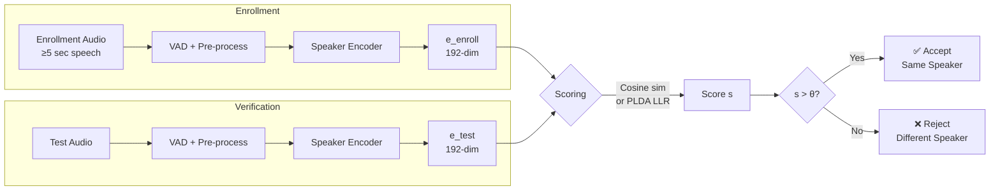

# ✅ Speaker Verification

> [!tldr] TL;DR
> Speaker verification answers a binary question: "Is this audio from the claimed speaker?" Given an enrollment recording and a test recording, a similarity score is computed and compared to a threshold. The system is evaluated with EER (Equal Error Rate) and minDCF on benchmarks like VoxCeleb1.

## Intuition

Imagine a bouncer at an exclusive club who has memorized your voice from a single phone call. When you show up, they compare your voice against their memory — not against everyone else they've ever heard, just against *you*. If you sound sufficiently similar, you're in; if not, you're rejected. This is fundamentally different from identification (which of N people is this?) and from diarization (when did each person speak?). The bouncer's challenge is that your voice changes with colds, stress, microphone quality, and background noise — yet must still be recognizable as uniquely yours.

## Mermaid Diagram



## Key Concepts

### Cosine Similarity Scoring

$$s_{\cos} = \frac{\mathbf{e}_{\text{enr}} \cdot \mathbf{e}_{\text{test}}}{\|\mathbf{e}_{\text{enr}}\| \cdot \|\mathbf{e}_{\text{test}}\|}$$

Range $[-1, +1]$; same speaker $\approx +0.7$–$0.9$, different $\approx -0.1$–$+0.3$. Fast and works well with ECAPA embeddings.

### PLDA Log-Likelihood Ratio

$$s_{\text{PLDA}} = \log \frac{p(\mathbf{e}_{\text{enr}}, \mathbf{e}_{\text{test}} \mid H_{\text{same}})}{p(\mathbf{e}_{\text{enr}}, \mathbf{e}_{\text{test}} \mid H_{\text{diff}})}$$

$H_{\text{same}}$: both embeddings drawn from same latent speaker factor. $H_{\text{diff}}$: drawn from independent factors. PLDA is more robust to channel variability and short utterances but requires training data.

### Evaluation Metrics

**False Accept Rate (FAR)** — fraction of impostor trials accepted:

$$\text{FAR}(\theta) = \frac{\text{# impostors above } \theta}{\text{# total impostor trials}}$$

**False Reject Rate (FRR)** — fraction of genuine trials rejected:

$$\text{FRR}(\theta) = \frac{\text{# genuine below } \theta}{\text{# total genuine trials}}$$

**Equal Error Rate (EER)**: threshold $\theta^*$ where $\text{FAR}(\theta^*) = \text{FRR}(\theta^*)$. Lower is better.

**Detection Cost Function (DCF)**:

$$\text{DCF}(\theta) = C_{\text{miss}} \cdot P_{\text{target}} \cdot \text{FRR}(\theta) + C_{\text{fa}} \cdot (1 - P_{\text{target}}) \cdot \text{FAR}(\theta)$$

**minDCF**: minimum of DCF over all thresholds; captures operating point relevant to deployment cost.

### Benchmark Results

| Model | Training Data | VoxCeleb1-O EER | minDCF |
|-------|--------------|-----------------|--------|
| PLDA + i-vector | VoxCeleb2 | ~5.3% | ~0.49 |
| x-vector + PLDA | VoxCeleb2 + aug | ~3.1% | ~0.31 |
| ECAPA-TDNN | VoxCeleb2 + aug | ~0.87% | ~0.11 |
| ResNet34 + AM-Softmax | VoxCeleb2 + aug | ~0.98% | ~0.12 |
| WavLM Large + fine-tune | VoxCeleb2 | ~0.40% | ~0.05 |

### Python Code: Cosine Verification with SpeechBrain

```python
import torch
import torchaudio
import torch.nn.functional as F
import numpy as np
from speechbrain.pretrained import EncoderClassifier
from sklearn.metrics import roc_curve

# Load model
model = EncoderClassifier.from_hparams(
    source="speechbrain/spkrec-ecapa-voxceleb",
    savedir="pretrained_models/ecapa"
)

def get_embedding(audio_path: str) -> torch.Tensor:
    wav, sr = torchaudio.load(audio_path)
    if sr != 16000:
        wav = torchaudio.functional.resample(wav, sr, 16000)
    with torch.no_grad():
        emb = model.encode_batch(wav).squeeze()
    return F.normalize(emb, dim=-1)   # L2 normalize

def verify(enroll_path: str, test_path: str, threshold: float = 0.25) -> dict:
    e_enr = get_embedding(enroll_path)
    e_tst = get_embedding(test_path)
    score = torch.dot(e_enr, e_tst).item()
    return {"score": score, "accept": score > threshold}

# EER computation
def compute_eer(genuine_scores, impostor_scores):
    labels  = [1]*len(genuine_scores) + [0]*len(impostor_scores)
    scores  = list(genuine_scores) + list(impostor_scores)
    fpr, tpr, thresholds = roc_curve(labels, scores, pos_label=1)
    fnr = 1 - tpr
    # EER is where FPR == FNR
    eer_idx = np.nanargmin(np.abs(fpr - fnr))
    eer      = (fpr[eer_idx] + fnr[eer_idx]) / 2
    eer_thresh = thresholds[eer_idx]
    return eer, eer_thresh

# Example usage
result = verify("enroll_speaker_A.wav", "test_same_speaker.wav")
print(f"Score: {result['score']:.4f}, Decision: {'ACCEPT' if result['accept'] else 'REJECT'}")
```

### Anti-Spoofing (Deepfake Audio Detection)

Modern verification systems face synthesized/replayed attacks. The ASVspoof challenge tracks this problem:

| Attack Type | Example | Detection Approach |
|-------------|---------|-------------------|
| Replay | Record + re-play genuine speech | Spectral artefact detection |
| TTS synthesis | Neural TTS impersonation | AASIST, RawNet2 |
| Voice conversion | Convert impostor → target | Phase/artifact cues |

**AASIST** (Audio Anti-Spoofing with Integrated Spectro-Temporal Graph Architecture) jointly models spectral and temporal artifacts for end-to-end detection.

Combined system: final score = $\alpha \cdot s_{\text{ASV}} + (1-\alpha) \cdot s_{\text{CM}}$ where CM is the countermeasure score.

### Threshold Selection in Deployment

- Use a calibrated score (logistic regression on development set scores) to map raw similarity to a log-likelihood ratio.
- Set threshold based on business costs: banking (low FAR), smart speaker (low FRR).
- Multi-session enrollment: average multiple enrollment embeddings before scoring for robustness.

## Real-World Notes

- VoxCeleb1 "O" (original) test list has 37,720 trial pairs across 40 speakers recorded in the wild.
- In telephony, short enrollment (5–10 sec) is realistic; ECAPA performs well even with 2–3 sec.
- Age, health changes, and microphone upgrades cause long-term drift; periodic re-enrollment helps.
- Regulatory compliance (GDPR) may require explicit consent before storing voiceprints.

## Common Pitfalls

- **Threshold calibrated on dev set but not domain-matched** — EER threshold often shifts 0.1–0.3 in new deployment environments.
- **Single enrollment utterance in noisy conditions** — always collect 3+ enrollment segments and average embeddings.
- **Ignoring anti-spoofing** — a verified speaker system without liveness detection is trivially spoofable by replay.
- **Conflating EER with accuracy** — a 1% EER system still fails 1 in 100 trials; for 1M daily verifications that is 10,000 errors/day.

## Related Concepts

- [[Speaker_Embeddings]] — the core representation powering all scoring
- [[Speaker_Diarization]] — uses verification as a sub-problem within clustering
- [[Speaker_Identification_Adaptation]] — multi-class extension of verification
- [[_MOC_Audio_Signal_Processing]] — feature extraction upstream

## Review Questions

1. A verification system has FAR = 2% and FRR = 2% at threshold $\theta^*$. What is the EER, and how would you adjust $\theta$ to make the system more secure (lower FAR)?
2. Explain why PLDA scoring is more robust to session variability than cosine similarity.
3. An attacker replays a genuine recording. Which ASVspoof challenge track covers this, and what acoustic cues can betray a replay attack?

## Sources

- Nagrani et al., "VoxCeleb: A large-scale speaker identification dataset" (INTERSPEECH 2017)
- Jung et al., "AASIST: Audio Anti-Spoofing using Integrated Spectro-Temporal Graph Architecture" (ICASSP 2022)
- Desplanques et al., "ECAPA-TDNN" (Interspeech 2020)
- NIST SRE evaluation plan: https://www.nist.gov/itl/iad/mig/speaker-recognition

#speaker-verification #eer #dcf #cosine-similarity #plda #anti-spoofing #voxceleb #audio-speech
