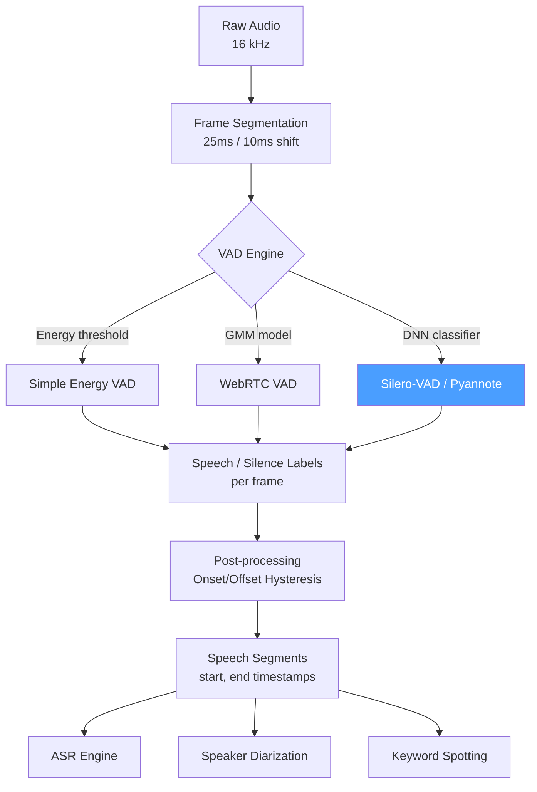

# 🔇 Voice Activity Detection

> [!tldr] TL;DR
> Voice Activity Detection (VAD) classifies each audio frame as speech or non-speech. It is the universal pre-processor for ASR, speaker diarization, and meeting transcription — trimming silence reduces compute and prevents downstream models from hallucinating on noise.

## Intuition

Think of a court stenographer who only types when someone is actually speaking, not during the awkward silences or background noise of a busy courtroom. Without VAD, an ASR system would waste compute on (and potentially hallucinate words from) traffic noise, HVAC hum, and keyboard clicks. VAD draws a "speech / not speech" timeline over audio — even a simple energy threshold helps, but real environments (call centres, cafes, video calls) demand something smarter that can distinguish a whispered word from a loud door slam.

## Mermaid Diagram



## Key Concepts

### Energy-Based VAD

The simplest approach: compute Root Mean Square (RMS) energy per frame and threshold.

$$E_t = \sqrt{\frac{1}{N}\sum_{n=0}^{N-1} x[n + tH]^2}$$

$$\text{label}_t = \begin{cases} \text{speech} & E_t > \theta_E \\ \text{silence} & \text{otherwise} \end{cases}$$

Also useful: Zero-Crossing Rate (ZCR) to distinguish voiced speech from fricatives/bursts.

**Limitation**: fails when background noise energy exceeds $\theta_E$ (wind, babble, HVAC).

### WebRTC VAD

Google's open-source VAD (used in Chrome, WebRTC), based on a GMM per aggressiveness level:

| Aggressiveness | Filtering | Use Case |
|---------------|-----------|----------|
| 0 (least) | Minimal | Clean studio speech |
| 1 | Light | Conference room |
| 2 | Moderate | Office environment |
| 3 (most) | Aggressive | Street / café noise |

Frame size: 10, 20, or 30 ms. Runs at ~1 MHz on modern hardware. Widely deployed in telephony.

### DNN-Based VAD

Binary classification on acoustic features:

$$P(\text{speech} \mid \mathbf{x}_t) = \sigma\left(\text{DNN}(\mathbf{x}_{t-c:t+c})\right)$$

where $\mathbf{x}_t$ are filterbank features and context $c$ is typically 15–30 frames. Much more robust to noise; slightly higher latency.

### Silero-VAD

LSTM-based model released by Silero AI; currently one of the most widely used in production:

- Model size: ~2 MB (ONNX) or ~1 MB (JIT)
- Latency: <10 ms per 30 ms chunk
- Multilingual: trained on 6000+ hours across many languages
- Output: speech probability per 30 ms chunk
- Available via `torchaudio`, `pyannote`, and standalone

### Pyannote VAD

End-to-end transformer-based pipeline:
- Pre-trained segmentation model uses sinc-conv frontend + LSTM
- Outputs frame-level speech probability
- Integrates directly with pyannote.audio diarization pipeline

### Key Hyperparameters

| Parameter | Typical Value | Effect |
|-----------|--------------|--------|
| `frame_size` | 25–30 ms | Time resolution of decisions |
| `frame_shift` | 10 ms | Temporal stride |
| `onset` threshold | 0.5–0.7 | P(speech) to start a segment |
| `offset` threshold | 0.35–0.5 | P(speech) to end a segment (onset > offset = hysteresis) |
| `min_speech_duration` | 0.1–0.5 s | Minimum speech burst length |
| `min_silence_duration` | 0.1–0.3 s | Minimum silence to split segments |

### Onset/Offset Hysteresis

Without hysteresis, rapid oscillation at a single threshold causes many short spurious segments. By setting `offset < onset`:

- Start speech only when $P_t > 0.6$
- End speech only when $P_t < 0.4$

This creates a state machine that stays in "speech" through brief dips, reducing fragmentation.

### Python Code: Silero-VAD Usage

```python
import torch
import torchaudio

# Load Silero-VAD from torchaudio
torch.hub.set_dir("./models")
model, utils = torch.hub.load(
    repo_or_dir="snakers4/silero-vad",
    model="silero_vad",
    force_reload=False,
    trust_repo=True
)
(get_speech_timestamps, save_audio, read_audio,
 VADIterator, collect_chunks) = utils

# Load audio (must be 16 kHz or 8 kHz)
wav = read_audio("meeting.wav", sampling_rate=16000)

# Get speech timestamps (seconds)
speech_timestamps = get_speech_timestamps(
    wav,
    model,
    sampling_rate=16000,
    threshold=0.5,           # onset probability
    min_speech_duration_ms=250,
    min_silence_duration_ms=100,
    return_seconds=True
)

for seg in speech_timestamps:
    print(f"Speech: {seg['start']:.2f}s — {seg['end']:.2f}s")

# Extract only speech
speech_only = collect_chunks(speech_timestamps, wav)
torchaudio.save("speech_only.wav", speech_only.unsqueeze(0), 16000)
```

### Python Code: pyannote VAD

```python
from pyannote.audio import Pipeline
import torch

# Requires HuggingFace token (pyannote gated model)
pipeline = Pipeline.from_pretrained(
    "pyannote/voice-activity-detection",
    use_auth_token="YOUR_HF_TOKEN"
)
pipeline.to(torch.device("cuda"))

output = pipeline("meeting.wav")

# Iterate speech segments
for speech in output.get_timeline().support():
    print(f"Speech: {speech.start:.3f}s — {speech.end:.3f}s")
```

### Comparison Table

| Method | Accuracy (clean) | Accuracy (noisy) | Latency | Size | License |
|--------|-----------------|-----------------|---------|------|---------|
| Energy threshold | ~85% | ~55% | <1 ms | 0 MB | — |
| WebRTC VAD | ~91% | ~72% | ~1 ms | 0.1 MB | BSD |
| DNN (custom) | ~96% | ~89% | 5–20 ms | 5–50 MB | custom |
| Silero-VAD | ~97% | ~93% | <10 ms | 2 MB | MIT |
| Pyannote VAD | ~98% | ~95% | ~20 ms | 80 MB | MIT |

## Real-World Notes

- For streaming ASR, Silero-VAD with chunk-based processing achieves near-real-time performance on CPU.
- WebRTC VAD remains the default in browser/telephony stacks due to its zero-dependency C implementation.
- In meeting transcription, over-aggressive VAD (short `min_silence_duration`) produces fragmented diarization; under-aggressive merges speakers.
- VAD decisions are rarely perfect; downstream systems must tolerate small speech/silence boundary errors (~30–100 ms).
- Pyannote's segmentation model (used inside diarization) implicitly performs VAD as part of speaker-change detection.

## Common Pitfalls

- **Applying VAD after resampling to 8 kHz** — Silero-VAD supports 8 kHz; WebRTC requires 8/16 kHz. Mismatch causes errors.
- **Using energy VAD in open-microphone scenarios** — any broadband noise burst (clap, door slam) triggers false positives.
- **Forgetting onset/offset hysteresis** — single-threshold VAD on DNN probabilities fragments 3-second sentences into dozens of 100 ms chunks.
- **Not removing non-speech before speaker embedding** — feeding silence/noise into a speaker encoder degrades embedding quality.

## Related Concepts

- [[Speaker_Diarization]] — VAD is step 1 of the diarization pipeline
- [[Speaker_Embeddings]] — requires clean speech frames; VAD provides them
- [[Speaker_Verification]] — enrollment/test audio should be VAD-trimmed
- [[_MOC_ASR]] — VAD front-end reduces ASR latency and hallucinations

## Review Questions

1. Explain onset/offset hysteresis for VAD. What happens if you set onset = offset = 0.5?
2. For a call-centre deployment handling 1000 concurrent calls, why would you choose WebRTC VAD over pyannote VAD despite the accuracy difference?
3. Describe how DNN-based VAD handles low-SNR environments better than energy-based VAD.

## Sources

- Silero-VAD GitHub: https://github.com/snakers4/silero-vad
- WebRTC VAD: https://webrtc.googlesource.com/src/+/refs/heads/main/common_audio/vad/
- Bredin et al., "pyannote.audio: neural building blocks for speaker diarization" (ICASSP 2020)
- Sohn et al., "A Statistical Model-Based Voice Activity Detection" (IEEE SPL 1999)

#vad #voice-activity-detection #silero-vad #pyannote #webrtc #speech-detection #audio-speech
