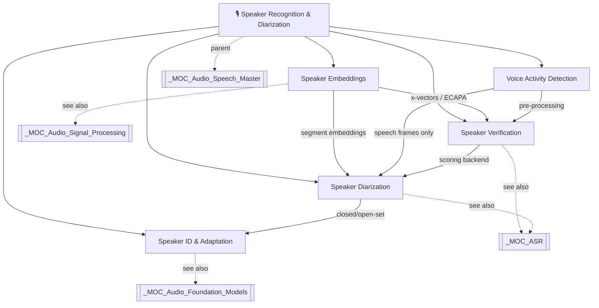

# 🎙️ Speaker Recognition & Diarization — Section Hub

> [!abstract] Section Overview
> This section covers the full stack of speaker-centric audio analysis: extracting identity from voice, verifying or identifying speakers, detecting when speech is present, segmenting conversations by speaker, and adapting systems to new speakers. Together these technologies underpin voice biometrics, meeting transcription, call-centre analytics, and voice assistants.

---

## Concept Map

---

## Learning Path

| Step | Note | Difficulty | Why This Order |
|------|------|------------|----------------|
| 1 | [[Voice_Activity_Detection]] | Intermediate | Pre-processor every other system depends on |
| 2 | [[Speaker_Embeddings]] | Intermediate | Core representation powering verification & diarization |
| 3 | [[Speaker_Verification]] | Intermediate | Binary decision task; introduces EER/DCF metrics |
| 4 | [[Speaker_Diarization]] | Advanced | Combines VAD + embeddings + clustering |
| 5 | [[Speaker_Identification_Adaptation]] | Advanced | Multi-speaker scenarios, few-shot, adaptation |

---

## All Notes in This Section

| Note | Core Concept | Key Methods | Benchmark |
|------|--------------|-------------|-----------|
| [[Speaker_Embeddings]] | Fixed-size voice identity vector | i-vector → x-vector → ECAPA-TDNN | VoxCeleb EER |
| [[Speaker_Verification]] | Same-speaker binary decision | Cosine / PLDA scoring | VoxCeleb1 EER ~0.87% |
| [[Voice_Activity_Detection]] | Speech vs silence detection | Energy, WebRTC, Silero-VAD | Latency / accuracy |
| [[Speaker_Diarization]] | "Who spoke when" | AHC clustering, EEND, pyannote | DER on AMI corpus |
| [[Speaker_Identification_Adaptation]] | Closed/open-set + adaptation | Prototypical nets, LoRA fine-tune | Rank-1 accuracy |

---

## Key Questions for This Section

1. How does the ECAPA-TDNN differ from a vanilla x-vector model in terms of pooling and feature aggregation?
2. What is EER and why is it a better metric than fixed-threshold accuracy for speaker verification?
3. Why does VAD onset/offset hysteresis matter for downstream diarization quality?
4. What is the fundamental difference between EEND and clustering-based diarization regarding overlapping speech?
5. How does open-set speaker identification differ from closed-set, and what metric governs the reject threshold?

---

## Related Sections

| Section | Connection |
|---------|-----------|
| [[_MOC_Audio_Signal_Processing]] | MFCC / filterbanks feed into speaker embeddings |
| [[_MOC_ASR]] | VAD and diarization are front-ends for ASR pipelines |
| [[_MOC_Audio_Foundation_Models]] | Whisper, WavLM self-supervised representations for speakers |
| [[_MOC_Audio_Speech_Master]] | Parent vault MOC |

---

#audio-speech #speaker-recognition #diarization #biometrics #moc
