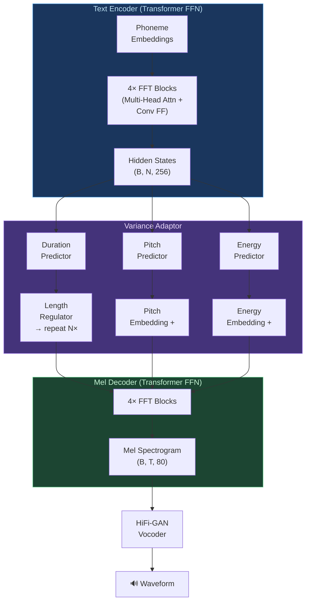

# ⚡ FastSpeech and Neural Vocoders: Parallel TTS and Waveform Generation

> [!tldr] TL;DR
> FastSpeech 2 achieves parallel mel-spectrogram generation by explicitly predicting phoneme durations and using a length regulator to align phoneme encodings to frame time, eliminating the sequential decoder and enabling 270× faster inference than Tacotron 2. HiFi-GAN then converts those spectrograms to high-fidelity audio at near-real-time speed using adversarial training.

---

## Intuition

Tacotron 2 generates mel frames one by one — like a person speaking word-by-word, waiting for each word to finish before starting the next. FastSpeech asks: "what if we knew in advance exactly how long each phoneme should last?" With that duration knowledge, we can expand phoneme representations to match their audio duration and then generate all mel frames in a single parallel pass — like printing a full page rather than typing one letter at a time. The trick is learning to predict those durations accurately, which FastSpeech 2 does by extracting ground-truth durations from a forced aligner.

---

## Mermaid Diagram



---

## Key Concepts

### FastSpeech (2019) — Duration Predictor

FastSpeech introduced the **length regulator** — the core innovation that makes parallel synthesis possible.

**Duration extraction (training):** Extract phoneme durations from a teacher Tacotron 2's attention weights:

$$d_n = \text{count of frames where } \underset{t}{\arg\max}\ \alpha_{t,n} = n$$

**Length Regulator:** Given hidden states $\mathbf{H} \in \mathbb{R}^{N \times d}$ and durations $\{d_n\}$:

$$\mathcal{LR}(\mathbf{H}, \mathbf{D}) = [\underbrace{h_1, h_1, \ldots, h_1}_{d_1}, \underbrace{h_2, \ldots}_{d_2}, \ldots, \underbrace{h_N, \ldots}_{d_N}] \in \mathbb{R}^{T \times d}$$

where $T = \sum_n d_n$ is the total number of mel frames.

During inference, the duration predictor (2-layer Conv + linear) outputs durations:

$$\hat{d}_n = \text{round}(\exp(\hat{d}_n^{\text{log}}))$$

Speed control is trivial: multiply all durations by a scalar $\alpha$ to speed up or slow down speech.

### FastSpeech 2 (2020) — Variance Adaptor

FastSpeech 2 improves on FastSpeech by:
1. **Ground-truth durations from MFA** (Montreal Forced Aligner) instead of soft attention extraction — more accurate
2. **Pitch predictor:** predict per-frame log-F0, discretized into 256 bins and embedded
3. **Energy predictor:** predict per-frame L2 norm of mel spectrogram, also binned and embedded

$$\mathcal{L}_{\text{FS2}} = \mathcal{L}_{\text{mel}} + \lambda_d \mathcal{L}_{\text{dur}} + \lambda_p \mathcal{L}_{\text{pitch}} + \lambda_e \mathcal{L}_{\text{energy}}$$

All predictor losses are MSE on log scale. The variance adaptor outputs:

$$\tilde{H} = \text{LR}(H + E_{\text{pitch}} + E_{\text{energy}}, D)$$

### Feed-Forward Transformer (FFT) Block

Each FFT block is a lightweight Transformer variant:

$$\text{FFT}(x) = \text{LayerNorm}(x + \text{MultiHeadAttn}(x)) $$
$$\text{FFT}(x) = \text{LayerNorm}(x + \text{Conv1D}(\text{ReLU}(\text{Conv1D}(x))))$$

The second sublayer uses **1D depthwise convolutions** rather than a dense FFN — captures local temporal correlations efficiently.

### HiFi-GAN Vocoder

HiFi-GAN (2020) uses adversarial training with two discriminator families:

**Multi-Period Discriminator (MPD):**
Reshape waveform into 2D grids at periods $p \in \{2, 3, 5, 7, 11\}$:
$$x_p \in \mathbb{R}^{T/p \times p} \Rightarrow \text{2D Conv discriminator}$$
Captures periodic structure of voiced speech.

**Multi-Scale Discriminator (MSD):**
Three discriminators on raw waveform at scales $\{1, 2, 4\}$ (average pooling).
Captures long-range dependencies and envelope.

**Generator loss (combined):**

$$\mathcal{L}_G = \mathcal{L}_{\text{adv}} + \lambda_{\text{fm}} \mathcal{L}_{\text{feat}} + \lambda_{\text{mel}} \mathcal{L}_{\text{mel}}$$

- $\mathcal{L}_{\text{adv}}$: fool discriminators
- $\mathcal{L}_{\text{feat}}$: feature matching (L1 on discriminator intermediate activations)
- $\mathcal{L}_{\text{mel}}$: L1 on mel spectrogram (keeps training stable)

### WaveNet — Dilated Causal Convolutions

WaveNet (2016) models the waveform autoregressively:

$$p(x) = \prod_{t=1}^{T} p(x_t \mid x_1, \ldots, x_{t-1}, c)$$

Using **dilated causal convolutions** to achieve exponentially growing receptive fields:

$$y_t = \tanh(W_f * x)_t \odot \sigma(W_g * x)_t \quad (\text{gated activation})$$

Dilation doubles each layer: $\{1, 2, 4, 8, \ldots, 512\}$ → receptive field of 1024 samples.
**Problem:** generating 22,050 samples per second autoregressively is 600× slower than real-time.

### WaveGlow — Normalizing Flow Vocoder

WaveGlow (2019) uses **normalizing flows** (Glow architecture): learn an invertible mapping $f: x \leftrightarrow z$ where $z \sim \mathcal{N}(0, I)$.

Training: $\mathcal{L} = -\log p_z(z) - \log|\det J_f^{-1}|$ (exact likelihood)
Inference: sample $z$, apply $f^{-1}$ conditioned on mel spectrogram.
**Advantage:** parallel inference (O(1) vs O(T)).

### Vocoder Comparison

| Vocoder | Architecture | Quality (MOS) | Inference Speed | Memory | Notes |
|---------|-------------|----------------|-----------------|--------|-------|
| Griffin-Lim | Phase estimation | 2.8 | Fast | Minimal | No training, obvious artifacts |
| WaveNet | AR dilated CNN | 4.5 | 600× slower than RT | High | Original Google quality ref |
| WaveRNN | AR dual-softmax RNN | 4.4 | ~1× RT (optimized) | Low | Good mobile candidate |
| WaveGlow | Normalizing flow | 4.3 | ~25× RT | Medium | NVIDIA, parallel |
| HiFi-GAN V1 | GAN (MPD+MSD) | 4.4 | ~167× RT (GPU) | Medium | Best quality/speed balance |
| UnivNet | GAN + multi-resolution spec | 4.5 | ~90× RT | Medium | Addresses HiFi-GAN pitch errors |

### FastSpeech 2 + HiFi-GAN Inference

```python
# Using ESPnet-TTS for full pipeline

# pip install espnet espnet_model_zoo

from espnet2.bin.tts_inference import Text2Speech
from espnet_model_zoo.downloader import ModelDownloader
import soundfile as sf
import numpy as np

# Download pretrained FastSpeech2 + HiFi-GAN model
d = ModelDownloader()
model_info = d.download_and_unpack("kan-bayashi/ljspeech_fastspeech2")

tts = Text2Speech.from_pretrained(
    model_tag="kan-bayashi/ljspeech_fastspeech2",
    vocoder_tag="parallel_wavegan/ljspeech_hifigan.v1",
    device="cpu",
)

# Inference with speed/pitch control
text = "FastSpeech two generates mel spectrograms in parallel."
with torch.no_grad():
    output = tts(
        text,
        speed_control_alpha=1.0,   # 1.0 = normal, 1.2 = 20% faster
        noise_scale=0.333,          # variance in durations
    )

wav = output["wav"]
sf.write("fastspeech2_output.wav", wav.numpy(), tts.fs)
print(f"Generated {len(wav)/tts.fs:.2f}s of audio")
```

```python
# Montreal Forced Aligner duration extraction (offline)
# mfa align /path/to/wavs /path/to/transcripts english_mfa english_mfa /output/textgrids

import textgrid
import numpy as np

def extract_durations_from_textgrid(tg_path: str, hop_length: int = 256, sr: int = 22050):
    """Convert MFA TextGrid alignments to frame-level durations."""
    tg = textgrid.TextGrid.fromFile(tg_path)
    phone_tier = tg.getFirst("phones")
    frame_dur = hop_length / sr  # seconds per frame

    durations = []
    for interval in phone_tier:
        dur_sec = interval.maxTime - interval.minTime
        dur_frames = max(1, round(dur_sec / frame_dur))
        durations.append((interval.mark, dur_frames))
    return durations
```

---

## Real-World Notes

- **MFA (Montreal Forced Aligner)** is the standard tool for extracting ground-truth durations in FastSpeech 2 training pipelines. It aligns audio to transcripts using a trained acoustic model.
- **Coqui TTS** provides ready-to-use FastSpeech 2 recipes that include the full MFA pipeline.
- **HiFi-GAN V1** (largest) vs **V2** (faster, slightly lower quality) — production systems often use V2 for latency-sensitive applications.
- **Streaming TTS** requires either (a) chunking the mel spectrogram and streaming chunks to the vocoder, or (b) streaming autoregressive vocoders. HiFi-GAN is non-AR so it supports chunk-based streaming well.
- **UnivNet** (2021) improves on HiFi-GAN by using multi-resolution spectrogram discriminators, reducing pitch inconsistencies in voiced segments.

---

## Common Pitfalls

- **Duration predictor errors compound:** if the duration predictor outputs short durations for a long word, the mel decoder has too few frames to represent it properly — output sounds rushed or garbled.
- **MFA alignment failures** on unusual names, foreign words, or low-quality audio silently corrupt the training data — always inspect alignment quality.
- **HiFi-GAN trained on LJSpeech** generalizes poorly to other speakers without fine-tuning — always use a matched or universal vocoder.
- **Speed control beyond 0.5×–2.0×** degrades naturalness rapidly — the duration predictor was never trained on extreme rates.

---

## Related Concepts

- [[Tacotron_and_Neural_TTS]] — the autoregressive predecessor; understand why non-AR is an improvement
- [[Zero_Shot_Voice_Cloning]] — VITS integrates vocoder into the TTS model itself, eliminating the separate vocoder stage
- [[TTS_Fundamentals]] — mel spectrograms, vocoder types overview
- [[_MOC_Audio_Signal_Processing]] — STFT, mel filterbanks, F0 extraction that inform variance adaptor targets

---

## Review Questions

1. Derive the total number of mel frames $T$ in the output of FastSpeech 2's length regulator given phoneme sequence of length $N$ with durations $\{d_n\}$, and explain why $\sum d_n$ must equal the ground-truth mel length during training.
2. HiFi-GAN uses both multi-period and multi-scale discriminators. Explain what acoustic phenomenon each discriminator type is specifically designed to capture, and why one alone is insufficient.
3. WaveNet achieves MOS comparable to HiFi-GAN but is 600× slower. Describe one scenario where you would still choose WaveNet over HiFi-GAN, and justify your answer.

---

## Sources

- Ren, Y. et al. (2019). FastSpeech: Fast, Robust and Controllable Text to Speech. *NeurIPS*.
- Ren, Y. et al. (2020). FastSpeech 2: Fast and High-Quality End-to-End Text to Speech. *ICLR*.
- Kong, J. et al. (2020). HiFi-GAN: Generative Adversarial Networks for Efficient and High Fidelity Speech Synthesis. *NeurIPS*.
- van den Oord, A. et al. (2016). WaveNet: A Generative Model for Raw Audio. *arXiv*.
- Prenger, R. et al. (2019). WaveGlow: A Flow-based Generative Network for Speech Synthesis. *ICASSP*.

#tts #fastspeech #non-autoregressive #hifi-gan #wavenet #vocoder #variance-adaptor
