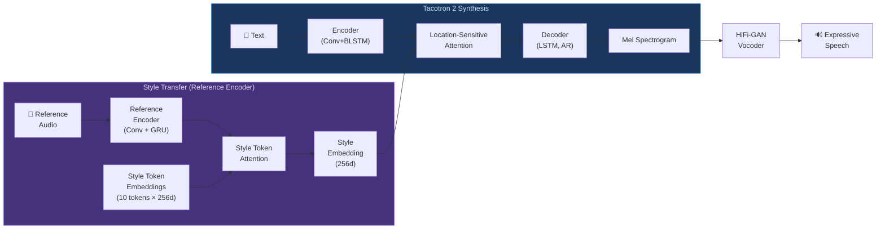

# 🎭 Prosody and Expressive TTS: Style, Emotion, and Reference Encoders

> [!tldr] TL;DR
> Prosody — pitch (F0), duration, rhythm, and intensity — determines *how* speech sounds, not just what it says. Standard TTS models average out prosodic variation and produce flat, robotic output; expressive TTS systems learn to control or transfer prosody using reference encoders, Global Style Tokens (GST), VAE-based latent spaces, and explicit emotion conditioning.

---

## Intuition

Consider the sentence "Really?" Spoken with rising pitch and high energy, it expresses surprise. Spoken flatly, it signals skepticism. Whispered, it conveys disbelief. The words are identical — only prosody changes the meaning. Standard Tacotron 2, trained to minimize average mel-spectrogram loss, learns the *average* prosody of the training corpus. This produces speech that sounds technically correct but emotionally neutral and sometimes unnatural. Expressive TTS systems add a "style knob" — a way to say "synthesize this text, but sound excited, or slow and thoughtful, or like this reference clip."

---

## Mermaid Diagram



---

## Key Concepts

### Prosody Elements

| Element | Acoustic Correlate | Perceptual Effect |
|---------|-------------------|------------------|
| Pitch (F0) | Fundamental frequency (Hz) | Intonation, emotion, question vs. statement |
| Duration | Phoneme/syllable length (ms) | Tempo, emphasis, clarity |
| Intensity/Energy | RMS amplitude (dB) | Loudness, stress, confidence |
| Rhythm | Timing patterns across syllables | Language-specific beat, naturalness |
| Speaking rate | Syllables per second | Urgency, formality, mood |

**F0 range** (typical): Male 80–165 Hz, Female 165–255 Hz; emotional speech can exceed 400 Hz in extreme exclamations.

**Prosody and meaning:**
$$\underbrace{\text{"Really?"}}_{\text{rising F0, high energy}} \neq \underbrace{\text{"Really."}}_{\text{falling F0, low energy}} \neq \underbrace{\text{"Really..."}}_{\text{flat F0, slow rate}}$$

### Tacotron 2 Limitation: Prosody Averaging

Standard Tacotron 2 minimizes:
$$\mathcal{L}_{\text{mel}} = \| \hat{M} - M^* \|_1$$

Since many valid prosodic realizations exist for any text, the model learns their expectation — resulting in **mean prosody**:

$$\hat{M}_t \approx \mathbb{E}_{p(\text{prosody}|\text{text})}[M_t]$$

This is a form of **posterior collapse in prosody space**: rich variation in the training data averages to flat, expressionless output.

### Reference Encoder

The reference encoder (Wang et al., 2018) extracts a fixed-dimensional prosodic style embedding from a reference audio clip:

$$\mathbf{e}_{\text{style}} = \text{ReferenceEncoder}(M_{\text{ref}})$$

Architecture:
1. 6 Conv2D layers on mel spectrogram (ReLU + batch norm, stride $(2,2)$)
2. Single-layer GRU over time steps, take last hidden state
3. FC layer → 128-dim embedding

This embedding is broadcast-added to encoder outputs, injecting global style information into every attention step.

**Limitation:** requires a reference audio at inference — cannot synthesize in a new style without a matching reference clip.

### Global Style Tokens (GST, 2018)

**GST** (Wang et al., 2018) extends the reference encoder with a **learned style token bank**:

$$\mathbf{e}_{\text{style}} = \text{MultiHeadAttention}(\mathbf{e}_{\text{ref}},\ \mathbf{T})$$

where $\mathbf{T} \in \mathbb{R}^{K \times d}$ is a bank of $K$ learnable style tokens (typically $K=10$, $d=256$).

**Properties:**
- Tokens learn to represent interpretable styles (speaking rate, energy, pitch range) without explicit labels
- **Interpolation:** style can be blended — `0.7 × token_3 + 0.3 × token_7` produces a mix
- **Style control without reference:** at inference, specify token weights directly:
$$\mathbf{e}_{\text{style}} = \sum_{k=1}^{K} w_k \mathbf{t}_k, \quad w_k \geq 0, \sum w_k = 1$$
- Tokens can be mapped to emotion labels post-hoc by analyzing which tokens activate for emotional recordings

### VAE-Based Prosody Modeling (GMVAE-TTS)

**Problem with GST:** style embedding is deterministic — cannot sample diverse renditions of the same text.

**VAE solution:** model style as a latent variable with a learned prior:

$$q_\phi(\mathbf{z} | M_{\text{ref}}) \approx \mathcal{N}(\mu_\phi, \sigma^2_\phi)$$
$$p_\theta(\mathbf{z}) = \mathcal{N}(0, I)$$
$$\mathcal{L}_{\text{VAE}} = -\mathbb{E}_q[\log p_\theta(M|\mathbf{z})] + D_{\text{KL}}(q_\phi \| p_\theta)$$

**GMVAE-TTS** uses a Gaussian Mixture prior (multiple modes) for richer style space modeling:

$$p(\mathbf{z}) = \sum_{k=1}^{K} \pi_k \mathcal{N}(\mathbf{z}; \mu_k, \Sigma_k)$$

At inference: **sample from prior** to get diverse prosodic renditions without any reference audio.

### Explicit Prosody Modeling (FastSpeech 2 Style)

FastSpeech 2 models prosody **explicitly** via predictors:

| Predictor | Target | Loss |
|-----------|--------|------|
| Duration predictor | Phoneme duration (from MFA) | MSE on log-duration |
| Pitch predictor | Per-frame F0 (from CREPE/WORLD) | MSE on log-F0 |
| Energy predictor | Per-frame RMS energy | MSE |

**Advantage:** fully interpretable, directly controllable.
**Disadvantage:** MSE forces mean prediction — same averaging problem as Tacotron 2, but now in a lower-dimensional space.

### Emotional TTS

Multi-label emotion conditioning — concatenate one-hot emotion vector to speaker/style embedding:

$$\mathbf{c} = [\mathbf{e}_{\text{speaker}}; \mathbf{e}_{\text{style}}; \mathbf{e}_{\text{emotion}}]$$

**Emotion labels** (from EmoSpeech, ESD datasets): neutral, happy, sad, angry, surprised, fearful, disgusted.

**ESPnet-TTS emotional training:**
```python
# Using ESPnet with emotion conditioning (simplified)
# Data preparation: CSV with (wav_path, text, speaker_id, emotion_label)

from espnet2.bin.tts_train import main as tts_train

# train.yaml includes:
# model_conf:
#   use_gst: true
#   gst_tokens: 10
#   use_emotions: true
#   emotion_classes: 7
```

### SSML (Speech Synthesis Markup Language)

SSML provides direct prosody control via markup — supported by Google TTS, Amazon Polly, Azure TTS:

```xml
<speak>
  <!-- Emphasis -->
  <emphasis level="strong">Important</emphasis> announcement.

  <!-- Pause -->
  Wait for it.
  <break time="500ms"/>
  Now!

  <!-- Pitch and rate control -->
  <prosody pitch="+10%" rate="slow">
    This is calm and low.
  </prosody>

  <!-- Whisper effect (AMAZON extension) -->
  <amazon:effect name="whispered">
    I have a secret.
  </amazon:effect>

  <!-- Say-as: force interpretation -->
  <say-as interpret-as="date" format="mdy">02/14/2024</say-as>
</speak>
```

### Prosody Transfer

**Goal:** synthesize text with speaker A's content but speaker B's prosody style.

```python
# Conceptual: reference encoder style transfer with Coqui TTS

from TTS.api import TTS
import torch

tts = TTS("tts_models/en/ljspeech/gst_tacotron2")
tts.to("cuda")

# Extract style from reference (excited speaker B)
style_embedding = tts.synthesizer.tts_model.reference_encoder(
    tts.synthesizer._load_wav("excited_reference.wav")
)

# Synthesize with target text but reference style
output = tts.synthesizer.tts(
    text="The quarterly results exceeded all expectations.",
    style_wav="excited_reference.wav",  # Tacotron 2 + GST API
)
tts.synthesizer.save_wav(output, "prosody_transferred.wav")
```

### Implicit vs Explicit Prosody Modeling

| Aspect | Implicit (GST/VAE) | Explicit (FastSpeech 2 predictors) |
|--------|-------------------|------------------------------------|
| Control mechanism | Style token weights or latent sample | Direct F0/duration/energy values |
| Interpretability | Low (tokens may not map to labels) | High (F0 in Hz, duration in frames) |
| Diversity | High (sample from prior) | Low (predictor outputs mean) |
| Training requirements | Only audio + transcripts | Needs pitch tracker + forced aligner |
| Cross-speaker transfer | Natural via reference encoder | Must explicitly transfer F0 curve |
| Failure mode | Style entangled with speaker identity | Over-smoothed F0, robotic rhythm |

### Evaluation

- **Prosody MOS:** raters specifically assess naturalness of intonation, rhythm, and emphasis (not just general quality).
- **Emotion recognition accuracy:** pass synthesized audio through a pre-trained emotion classifier; compare to target label.
- **F0 correlation:** Pearson r between predicted and reference F0 trajectories.
- **Duration error:** Mean Absolute Error between predicted and reference phoneme durations (in ms).

$$r_{F0} = \frac{\text{Cov}(\hat{F}_0, F_0^*)}{\sigma_{\hat{F}_0} \sigma_{F_0^*}}$$

---

## Real-World Notes

- **GST tokens are not guaranteed to be interpretable** — some tokens capture speaker identity rather than style. Regularization (e.g., emotion supervision on some tokens) helps disentangle.
- **SSML is the practical solution** for production expressive TTS — direct, controllable, language-agnostic.
- **EmoSpeech and ESD** are the most common open-source emotional speech datasets for training emotional TTS.
- **Prosody transfer degrades** when source and target speakers have very different speaking styles (e.g., transferring whisper prosody to a loud speaker).
- **Real-world audiobooks** are an excellent prosody training resource — LibriTTS contains 245 hours of multi-speaker expressive speech.

---

## Common Pitfalls

- **Style-speaker entanglement:** GST tokens may capture speaker timbre instead of speaking style. Add a speaker classification adversarial loss to force disentanglement.
- **VAE posterior collapse:** the KL term drives $q \to p$ and the model ignores the latent — use KL annealing (warm-up schedule) or free bits:
  $$\mathcal{L}_{\text{KL}} = \max(\lambda_{\text{min}}, D_{\text{KL}})$$
- **Emotion label ambiguity:** the same audio may be labeled differently by different annotators. Soft (probabilistic) emotion labels outperform hard one-hot labels.
- **F0 extraction errors** on noisy audio propagate to the pitch predictor — always validate extracted F0 before training.

---

## Related Concepts

- [[Tacotron_and_Neural_TTS]] — GST and reference encoder are add-ons to Tacotron 2
- [[FastSpeech_and_Vocoders]] — FastSpeech 2 variance adaptor is the explicit prosody modeling approach
- [[Zero_Shot_Voice_Cloning]] — prosody transfer is closely related to voice cloning; both use reference encoders
- [[TTS_Fundamentals]] — F0, duration, energy fundamentals

---

## Review Questions

1. Explain why minimizing mel-spectrogram L1 loss causes a TTS model to produce flat prosody, using the mathematical concept of expectation.
2. You have a GST-Tacotron 2 model where token 3 consistently activates for angry speech. Describe the exact inference procedure to synthesize a neutral text in an angry style without any reference audio at runtime.
3. Compare implicit (VAE) and explicit (FastSpeech 2) prosody modeling on the dimension of *diversity at inference time*. Which approach produces more varied renditions of the same text, and why?

---

## Sources

- Wang, Y. et al. (2018). Style Tokens: Unsupervised Style Modeling, Control and Transfer in End-to-End Speech Synthesis (GST). *ICML*.
- Henter, G. E. et al. (2019). Deep Generative Model for Speech Synthesis (GMVAE-TTS). *Interspeech*.
- Ren, Y. et al. (2020). FastSpeech 2: Fast and High-Quality End-to-End Text to Speech. *ICLR*.
- W3C. (2004). Speech Synthesis Markup Language (SSML). https://www.w3.org/TR/speech-synthesis/
- Zhou, K. et al. (2022). Emotion Intensity and its Control for Emotional Voice Conversion. *IEEE TASLP*.

#tts #prosody #expressive-tts #gst #reference-encoder #emotion #ssml #vae #f0-modeling
