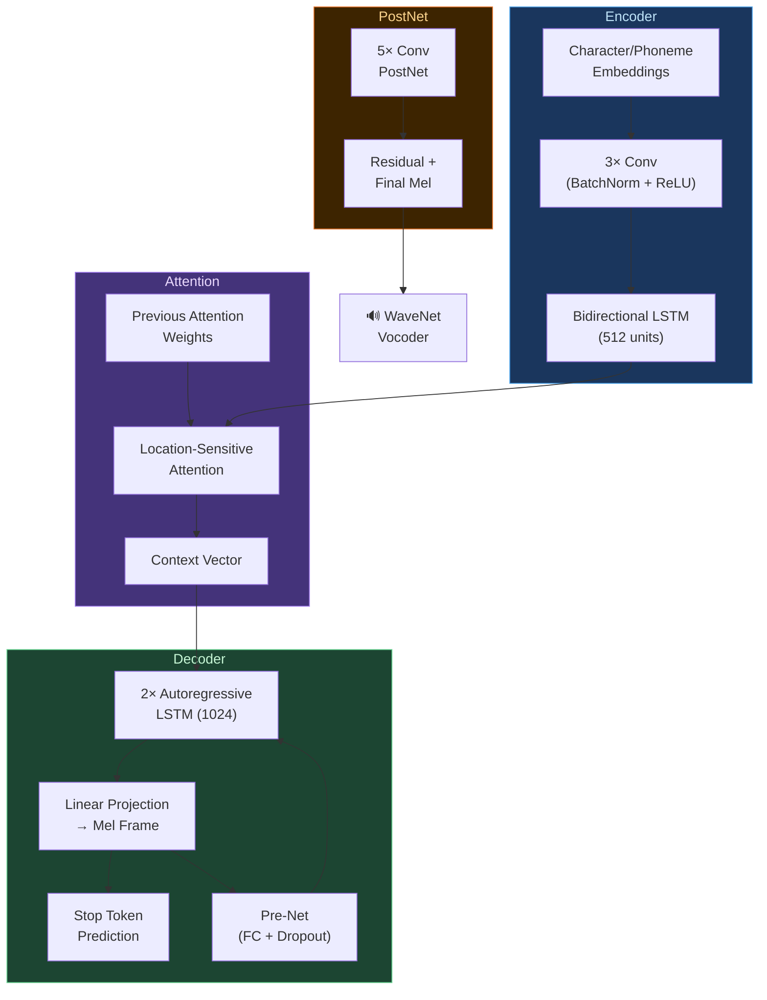

# 🧠 Tacotron and Neural TTS: End-to-End Speech Synthesis

> [!tldr] TL;DR
> Tacotron (2017) was the first system to learn the entire TTS pipeline end-to-end from characters to mel spectrograms using a sequence-to-sequence model with attention. Tacotron 2 (2018) refined this with a cleaner architecture and WaveNet vocoder, establishing the attention-based autoregressive paradigm that dominated neural TTS for years.

---

## Intuition

Before Tacotron, building a TTS system meant hand-crafting rules for text normalization, maintaining phoneme dictionaries, training separate acoustic models, and tuning vocoders — each a specialist system. Tacotron treated the whole thing like machine translation: "here is a sequence of characters, produce the corresponding mel spectrogram." Just as neural MT learned alignment between source and target words automatically, Tacotron learned which characters produce which audio frames through attention. The main challenge was teaching the model that "character at position 3 produces audio frames 40–65" — which requires a monotonic, nearly diagonal attention pattern unlike the bidirectional attention in translation.

---

## Mermaid Diagram



---

## Key Concepts

### Tacotron (2017) — CBHG Encoder

The original Tacotron used a complex **CBHG** encoder:
- **C**onvolution **B**ank: 1D convolutions with kernel sizes $k = 1, 2, \ldots, K$ (captures n-gram features)
- **H**ighway networks: gated skip connections for gradient flow
- **G**RU: bidirectional, captures long-range context

$$\text{CBHG}(x) = \text{BiGRU}(\text{Highway}(\text{MaxPool}(\text{ConvBank}(x))))$$

The decoder was a GRU with Bahdanau attention predicting $r=2$ mel frames per step (reduction factor), followed by a post-processing CBHG net generating linear spectrograms for Griffin-Lim.

### Tacotron 2 (2018) — Cleaner Architecture

Tacotron 2 simplified the encoder to Conv+BLSTM, adopted **location-sensitive attention**, predicted mel spectrograms directly (no linear spectrogram step), and used **WaveNet** as the vocoder.

**Location-Sensitive Attention:**

$$e_{i,j} = V^T \tanh(W_{\text{query}} h_i + W_{\text{key}} k_j + W_{\text{loc}} f_{i,j} + b)$$

where $f_{i,j}$ are features from previous attention weights convolved with a location filter. This encourages monotonic forward movement through the input.

$$\alpha_{i,j} = \text{softmax}(e_{i,j}), \quad c_i = \sum_j \alpha_{i,j} k_j$$

### Autoregressive Mel Decoding

The decoder generates mel frames **one at a time**, conditioned on all previous frames:

$$\hat{m}_t = f_\theta(\hat{m}_{t-1}, c_t, h_{t-1}^{\text{dec}})$$

Each step also predicts a **stop token** $p_{\text{stop}} \in [0,1]$ — generation halts when $p_{\text{stop}} > 0.5$.

**Key advantage:** natural handling of variable-length alignment.
**Key disadvantage:** O(T) serial inference steps — slow for long utterances.

### Attention Collapse

Attention failure modes in autoregressive TTS:

| Failure | Symptom | Cause |
|---------|---------|-------|
| Repetition | Same word spoken twice or looped | Attention stuck on one position |
| Skipping | Words or syllables dropped | Attention jumps forward too fast |
| Early stopping | Audio cuts off mid-sentence | Stop token fires prematurely |
| Mumbling | Garbled output | Diffuse, unfocused attention |

**Mitigations:**
- **Guided attention loss:** penalize non-diagonal attention during training
$$\mathcal{L}_{\text{guided}} = \mathbb{E}_{t,n}\left[\alpha_{t,n} \cdot W_{t,n}\right], \quad W_{t,n} = 1 - \exp\!\left(-\frac{(n/N - t/T)^2}{2g^2}\right)$$
- **CTC pre-training:** train encoder with CTC to ensure good phone representations before attention training
- **Forward attention:** constrain attention to only move forward

### Tacotron vs Tacotron 2 vs FastSpeech 2

| Feature | Tacotron | Tacotron 2 | FastSpeech 2 |
|---------|----------|------------|--------------|
| Encoder | CBHG | Conv+BLSTM | Transformer FFN |
| Attention | Bahdanau | Location-Sensitive | None (explicit duration) |
| Decoder | GRU (AR) | LSTM (AR) | Transformer (parallel) |
| Vocoder | Griffin-Lim | WaveNet | HiFi-GAN |
| Inference | Sequential | Sequential | Parallel |
| MOS (approx.) | 3.82 | 4.53 | 4.39 |
| Speed vs RT | ~0.5× | ~0.3× | ~40× |

### Coqui TTS Inference (Tacotron 2)

```python
# pip install TTS

from TTS.api import TTS

# Load pretrained Tacotron 2 + HiFi-GAN (Coqui replaces WaveNet with HiFi-GAN)
tts = TTS(model_name="tts_models/en/ljspeech/tacotron2-DDC", progress_bar=False)

# Synthesize to file
tts.tts_to_file(
    text="The quick brown fox jumps over the lazy dog.",
    file_path="output.wav"
)

# Inspect mel spectrogram generation (lower-level)
from TTS.tts.configs.tacotron2_config import Tacotron2Config
from TTS.tts.models.tacotron2 import Tacotron2
import torch

config = Tacotron2Config.init_from_argparse()
model = Tacotron2.init_from_config(config)
model.eval()

with torch.no_grad():
    outputs = model.inference(
        text_inputs=torch.randint(0, 50, (1, 20)),   # token ids
        input_lengths=torch.tensor([20]),
        speaker_ids=None,
    )
    mel_outputs = outputs["model_outputs"]  # (1, n_mels, T)
    print(f"Mel spectrogram shape: {mel_outputs.shape}")
```

### SpeedySpeech and FastPitch

**FastPitch (2020):** Tacotron-style encoder but with a pitch predictor — predicts per-phoneme F0, which is upsampled alongside duration to make parallel synthesis possible. MOS competitive with Tacotron 2 at 90× faster inference.

**SpeedySpeech (2020):** Lightweight student model distilled from Tacotron 2 attention, targeting edge deployment.

---

## Real-World Notes

- **Coqui TTS** (open-source) provides pretrained Tacotron 2 models for 11 languages — easiest entry point for research and prototyping.
- **Google's production TTS** (Wavenet-based) still uses variants of this attention-based approach internally for high-quality voices.
- **Attention instability** is significantly worse on long inputs (>200 characters). Chunking input at sentence boundaries is a practical fix.
- **Reduction factor $r$** (generating multiple mel frames per attention step) was important in original Tacotron to stabilize training. Tacotron 2 set $r=1$.

---

## Common Pitfalls

- **Training on noisy data** causes attention to learn spurious alignments — data quality matters more than quantity for TTS.
- **Teacher forcing mismatch:** during training the model sees ground-truth previous frames; at inference it sees its own predictions — exposure bias accumulates errors over long utterances.
- **Forgetting to normalize mel spectrograms** to $[-1, 1]$ before feeding to WaveNet causes poor vocoder quality.
- **MOS inflation:** comparing MOS across different test sets, rater pools, or evaluation protocols is invalid. Only A/B comparisons within the same eval matter.

---

## Related Concepts

- [[TTS_Fundamentals]] — pipeline background and vocoder overview
- [[FastSpeech_and_Vocoders]] — the non-autoregressive successor to Tacotron 2
- [[Prosody_and_Expressive_TTS]] — adding style control on top of Tacotron 2
- [[Zero_Shot_Voice_Cloning]] — VITS and VALL-E as the next generation beyond Tacotron

---

## Review Questions

1. What specific problem does location-sensitive attention solve that vanilla Bahdanau attention does not, and why does it matter for TTS?
2. Trace the path of the word "hello" through the Tacotron 2 encoder-attention-decoder pipeline, specifying the tensor shape at each stage.
3. Why does teacher forcing during training cause degraded quality at inference, and what techniques mitigate this exposure bias?

---

## Sources

- Wang, Y. et al. (2017). Tacotron: Towards End-to-End Speech Synthesis. *Interspeech*.
- Shen, J. et al. (2018). Natural TTS Synthesis by Conditioning WaveNet on Mel Spectrogram Predictions (Tacotron 2). *ICASSP*.
- He, K. et al. (2015). Deep Residual Learning (Highway network background). *CVPR*.
- Lancucki, A. (2021). FastPitch: Parallel Text-to-speech with Pitch Prediction. *ICASSP*.

#tts #tacotron #neural-tts #attention #cbhg #mel-spectrogram #autoregressive
