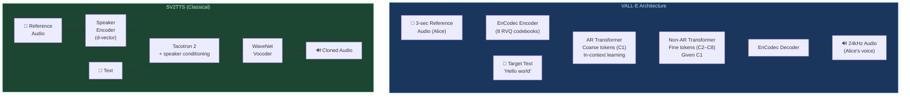

# 🎭 Zero-Shot Voice Cloning: VITS, VALL-E, and Speaker Transfer

> [!tldr] TL;DR
> Zero-shot voice cloning synthesizes speech in a target speaker's voice from just a few seconds of reference audio — no fine-tuning required. The field evolved from speaker-embedding conditioning (SV2TTS, VITS) to language-model-over-audio-codec approaches (VALL-E), where TTS became an in-context learning problem.

---

## Intuition

Imagine learning to impersonate a celebrity: you listen to a few seconds of their voice, pick up on their vocal timbre, rhythm, and pitch patterns, then speak in that style — even saying things they've never said. Zero-shot voice cloning automates this. The key insight is that a speaker's identity lives in a learned embedding space: extract that embedding from a reference clip, then condition the TTS model on it. VALL-E takes this further — it treats speech tokens like words in a language, and "cloning" becomes in-context learning: "here are some speech tokens from Alice; continue speaking as Alice."

---

## Mermaid Diagram



---

## Key Concepts

### Speaker Embedding Conditioning (SV2TTS)

**SV2TTS** (2018, Jia et al.) was the first scalable zero-shot voice cloning system:

1. **Speaker Encoder:** GE2E-trained speaker verification model maps reference audio → 256-dim d-vector $\mathbf{e} \in \mathbb{R}^{256}$
2. **Synthesizer:** Tacotron 2 conditioned on $\mathbf{e}$ — concatenate embedding to encoder outputs at each attention step
3. **Vocoder:** Modified WaveNet conditioned on $\mathbf{e}$

$$\hat{M} = \text{Tacotron2}(x_{\text{text}}, \mathbf{e}_{\text{ref}})$$

**Limitation:** speaker encoder and synthesizer are trained on different data — the embedding space sees speakers the synthesizer never trained on, causing mismatch.

### VITS (2021, Kim et al.)

**VITS** (Variational Inference with adversarial learning for end-to-end TTS) combines:
- **Posterior encoder:** maps mel spectrogram → latent $z$ (VAE posterior $q_\phi(z|x_{\text{mel}})$)
- **Prior encoder:** text → prior distribution $p_\theta(z|x_{\text{text}})$ (normalizing flow on phoneme encodings)
- **Decoder:** HiFi-GAN generator from $z$ to waveform
- **Stochastic duration predictor:** models $p(\mathbf{d}|z_{\text{text}})$ — duration as a distribution, not a point estimate

**ELBO training objective:**

$$\mathcal{L}_{\text{VITS}} = \underbrace{\mathbb{E}_{q_\phi}[\log p_\theta(x|z)]}_{\text{reconstruction}} - \underbrace{D_{\text{KL}}(q_\phi(z|x) \| p_\theta(z|c))}_{\text{regularization}} + \mathcal{L}_{\text{adv}} + \mathcal{L}_{\text{fm}}$$

**Why VITS matters for cloning:** No separate vocoder to fine-tune — the whole model is joint. Speaker conditioning enters through the prior encoder. Inference is a single forward pass.

### YourTTS (2021)

Built on VITS with:
- **Multi-speaker training** across 1,800+ speakers (VCTK + LibriTTS)
- **Speaker embedding** from zero-shot speaker encoder (no per-speaker tokens)
- **Multilingual:** English, Portuguese, French — zero-shot cross-lingual transfer

Demonstrated that VITS-scale training enables convincing zero-shot voice cloning without fine-tuning.

### VALL-E (2023, Wang et al., Microsoft)

**Key insight:** Represent audio with **discrete tokens** from EnCodec (a neural audio codec), then train a language model on those tokens conditioned on text and reference audio tokens.

**EnCodec:** Encodes 24kHz audio at 75 tokens/sec using 8 codebooks of residual vector quantization (RVQ):
$$\text{Audio} \xrightarrow{\text{Encoder}} \mathbf{C} \in \{1,\ldots,1024\}^{T \times 8}$$

**VALL-E training:**
- **AR model** (Transformer decoder): generate first codebook $C_1$ autoregressively
  $$p(C_1 | \text{text}, \tilde{C}_1^{\text{enroll}}) = \prod_t p(c_{1,t} | c_{1,<t}, \text{text}, \tilde{C}_1^{\text{enroll}})$$
- **NAR model** (Transformer): generate remaining codebooks $C_2, \ldots, C_8$ in parallel given $C_1$

**In-context learning:** The 3-second enrollment clip's tokens $\tilde{C}_1^{\text{enroll}}$ are the context — no gradient update, no fine-tuning. The model has simply learned "tokens sound like this enrollment → continue in this voice."

**VALL-E performance:** MOS ≈ 3.8 on zero-shot tasks (vs. ground truth 4.5); speaker similarity competitive with ground truth on DIAR metrics.

### SPEAR-TTS, Voicebox, and StyleTTS 2

| Model | Year | Key Innovation |
|-------|------|----------------|
| SPEAR-TTS | 2023 | Back-translation to create parallel text-speech data for voice cloning |
| Voicebox | 2023 | Flow-matching over mel frames; in-context audio editing |
| StyleTTS 2 | 2023 | Style diffusion + adversarial training; zero-shot MOS > GT on some benchmarks |
| XTTS (Coqui) | 2023 | Multilingual VITS variant; open-source zero-shot voice cloning |

### Model Comparison

| Model | Naturalness MOS | Speaker Similarity | Data Needed | Inference Speed | Fine-tuning? |
|-------|----------------|-------------------|-------------|-----------------|--------------|
| SV2TTS | 3.6 | Moderate | Moderate pretrain | Moderate | No |
| YourTTS | 3.9 | Good | Large pretrain | Fast (VITS) | No |
| VITS | 4.4 (single-spk) | N/A | Moderate | Very fast | Per-speaker |
| VALL-E | ~3.8 | Very Good | Massive (60K hrs) | Moderate | No |
| XTTS v2 | ~4.0 | Good | Large pretrain | Fast | No |
| StyleTTS 2 | >4.0 | Good | Moderate | Fast | Optional |

### Coqui XTTS Zero-Shot Demo

```python
# pip install TTS  (includes XTTS v2)

from TTS.api import TTS
import torch

# XTTS v2: multilingual, zero-shot, 6-sec reference needed
tts = TTS("tts_models/multilingual/multi-dataset/xtts_v2")
tts.to("cuda" if torch.cuda.is_available() else "cpu")

# Zero-shot synthesis: provide a reference wav of the target speaker
tts.tts_to_file(
    text="In context learning allows the model to adapt its voice without any gradient updates.",
    speaker_wav="reference_speaker.wav",   # 6+ seconds of clean speech
    language="en",
    file_path="cloned_voice.wav",
)
print("Synthesized in target speaker's voice — no fine-tuning performed.")
```

```python
# VALL-E via unofficial implementation (vallex library)
# Note: official Microsoft VALL-E is not open-source; VALL-E X is the multilingual version

# Using AudioCraft / VALL-E-X approximation
from vallex import VALLEXTT

model = VALLEXTT.from_pretrained("Plachta/VALL-E-X")

# Generate speech
wav, sr = model.infer_from_text(
    text="Hello, this is a demonstration of zero shot voice cloning.",
    prompt_text="The reference utterance text here.",  # transcript of reference
    prompt_speech_path="reference_speaker.wav",
    language="English",
)

import soundfile as sf
sf.write("valle_output.wav", wav, sr)
```

### Evaluation Metrics

- **Speaker Similarity Score:** cosine similarity between speaker embeddings (from ECAPA-TDNN or x-vector) of generated and reference speech. Target: > 0.85.
- **Naturalness MOS:** human rater 1–5 scale.
- **Word Error Rate (WER):** transcribe generated audio with ASR; compare to target text. High WER = muffled/unintelligible synthesis.
- **DIAR (Diarization):** does a speaker diarization system assign generated audio to the reference speaker?

$$\text{Sim} = \cos(\mathbf{e}_{\text{gen}}, \mathbf{e}_{\text{ref}}) = \frac{\mathbf{e}_{\text{gen}} \cdot \mathbf{e}_{\text{ref}}}{\|\mathbf{e}_{\text{gen}}\| \|\mathbf{e}_{\text{ref}}\|}$$

### Ethical Considerations

Voice cloning raises serious ethical concerns:

- **Deepfake speech:** political impersonation, fraud, phishing (vishing)
- **Non-consensual use:** cloning a celebrity or private individual's voice
- **Watermarking:** AudioSeal (Meta) and SynthID (Google) embed imperceptible watermarks in synthesized audio for detection
- **Consent frameworks:** emerging standards require explicit speaker consent for voice cloning (EU AI Act)
- **Detection:** ASVspoof challenge benchmarks — best systems now achieve EER < 1% on known attacks but struggle with unknown vocoders

---

## Real-World Notes

- **3–6 seconds of reference audio** is sufficient for XTTS and VALL-E-style models. Longer (30s–1min) references improve speaker similarity significantly.
- **Reference audio quality matters more than length** — background noise in the reference propagates to synthesized speech.
- **Cross-lingual voice cloning** (speak French in an English-enrolled voice) works with multilingual models like XTTS v2 and VALL-E X.
- **Real-time voice conversion** (changing voice during live speech) is a different task — typically uses pitch shifting + vocal tract transformation rather than TTS.

---

## Common Pitfalls

- **Reference audio with background noise** causes the model to clone the noise characteristics along with the voice.
- **Confusing voice conversion with voice cloning:** cloning synthesizes from text; conversion transforms existing speech.
- **VITS single-speaker model** does not generalize to new speakers — must train multi-speaker VITS (YourTTS) for zero-shot capability.
- **VALL-E hallucinations:** the LM can generate plausible-sounding but incorrect words — always verify WER on synthesized output.

---

## Related Concepts

- [[Tacotron_and_Neural_TTS]] — the base architecture SV2TTS builds on
- [[FastSpeech_and_Vocoders]] — VITS integrates the vocoder internally, unlike FastSpeech 2
- [[Prosody_and_Expressive_TTS]] — prosody transfer across speakers is closely related to voice cloning
- [[_MOC_Speaker_Recognition]] — speaker encoder models (ECAPA-TDNN, x-vector) are borrowed from speaker verification
- [[_MOC_Audio_Foundation_Models]] — VALL-E, AudioLM, MusicGen are all LM-over-codec foundation models

---

## Review Questions

1. Explain why VALL-E treats voice cloning as an in-context learning problem rather than a fine-tuning problem, and describe what the 3-second enrollment clip provides to the AR transformer.
2. Compare VITS and SV2TTS on three dimensions: how speaker identity is encoded, whether the vocoder is separate, and inference speed.
3. A voice cloning system achieves high naturalness MOS (4.2) but low speaker similarity (0.61). What is the likely cause, and which component of the system would you investigate first?

---

## Sources

- Jia, Y. et al. (2018). Transfer Learning from Speaker Verification to Multispeech Text-To-Speech Synthesis. *NeurIPS*.
- Kim, J. et al. (2021). Conditional Variational Autoencoder with Adversarial Learning for End-to-End Text-to-Speech. *ICML*.
- Casanova, E. et al. (2022). YourTTS: Towards Zero-Shot Multi-Speaker TTS and Zero-Shot Voice Conversion. *ICML*.
- Wang, C. et al. (2023). Neural Codec Language Models are Zero-Shot Text to Speech Synthesizers (VALL-E). *arXiv*.
- Li, Y. et al. (2023). StyleTTS 2: Towards Human-Level Text-to-Speech through Style Diffusion. *NeurIPS*.

#tts #voice-cloning #zero-shot #vall-e #vits #sv2tts #encodec #speaker-embedding
