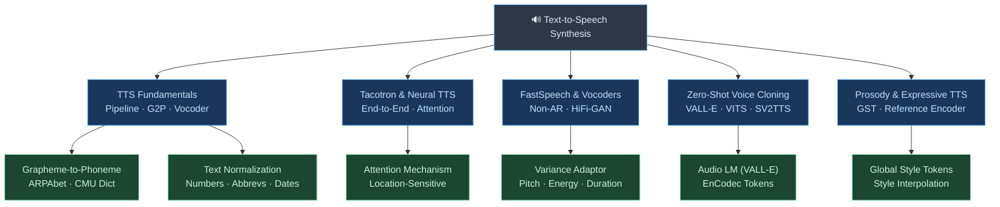

# 🗺️ Text-to-Speech Synthesis — Section Hub

> From raw text to natural, expressive human-sounding speech — covering pipelines, neural architectures, voice cloning, and prosody control.

---

## Concept Map

---

## Learning Path

| Step | Note | Difficulty | What You'll Learn |
|------|------|------------|-------------------|
| 1 | [[TTS_Fundamentals]] | Beginner → Intermediate | Pipeline overview, G2P, phonemes, vocoders, MOS |
| 2 | [[Tacotron_and_Neural_TTS]] | Intermediate | End-to-end neural TTS, attention alignment |
| 3 | [[FastSpeech_and_Vocoders]] | Advanced | Non-autoregressive TTS, HiFi-GAN, speed vs quality |
| 4 | [[Prosody_and_Expressive_TTS]] | Advanced | GST, reference encoder, emotional speech |
| 5 | [[Zero_Shot_Voice_Cloning]] | Advanced | VALL-E, VITS, SV2TTS, ethical considerations |

---

## All Notes in This Section

| Note | Topics | Key Models |
|------|--------|------------|
| [[TTS_Fundamentals]] | Pipeline, G2P, ARPAbet, MOS, concatenative vs neural | Festival, HTS, Griffin-Lim |
| [[Tacotron_and_Neural_TTS]] | CBHG encoder, location-sensitive attention, autoregressive mel decoder | Tacotron, Tacotron 2 |
| [[FastSpeech_and_Vocoders]] | Duration predictor, length regulator, MPD/MSD discriminators | FastSpeech 2, HiFi-GAN, WaveGlow |
| [[Zero_Shot_Voice_Cloning]] | Speaker embeddings, EnCodec, in-context learning | VALL-E, VITS, YourTTS, SV2TTS |
| [[Prosody_and_Expressive_TTS]] | F0 modeling, GST, VAE prosody, SSML, emotion TTS | GST-Tacotron, GMVAE-TTS |

---

## 5 Key Questions for This Section

1. What are the stages of a classical TTS pipeline, and which stage does each neural model replace?
2. How does the attention mechanism in Tacotron 2 replace hand-engineered alignment, and what can go wrong?
3. Why is FastSpeech 2 orders of magnitude faster than Tacotron 2, and what quality trade-off does it make?
4. How does VALL-E treat TTS as a language-modeling problem over discrete audio tokens?
5. What is the difference between implicit and explicit prosody modeling, and when does each approach fail?

---

## Related Sections

| Section | Why It Connects |
|---------|----------------|
| [[_MOC_Audio_Signal_Processing]] | Mel spectrograms, F0 extraction, STFT — the signal foundations TTS builds on |
| [[_MOC_ASR]] | ASR converts speech → text; TTS is the inverse. Shared phoneme representations |
| [[_MOC_Speaker_Recognition]] | Voice cloning borrows speaker embedding models from speaker verification |
| [[_MOC_Audio_Foundation_Models]] | VALL-E, Voicebox, and AudioLM are foundation models that include TTS capability |
| [[_MOC_NLP_Master]] | TTS takes NLP text output — dependency parsing, NER, and G2P all depend on language understanding |
| [[_MOC_Audio_Speech_Master]] | Parent vault MOC |

---

#audio-speech #tts #speech-synthesis #section-moc
