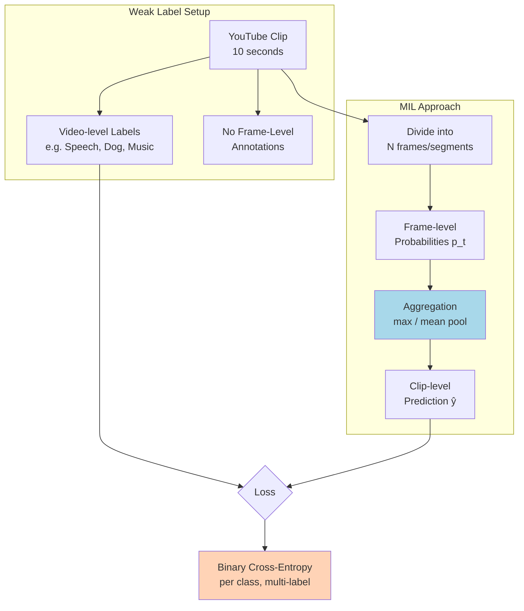

# 🏷️ Audio Tagging & Weak Supervision

> [!tldr] TL;DR
> Audio tagging assigns multiple sound-class labels to a clip (multi-label, not single-class), measured by mean Average Precision (mAP). AudioSet's 527-class, 2M-clip dataset uses weak clip-level labels, which requires Multiple Instance Learning (MIL) to handle the mismatch between video-level annotations and frame-level sound events.

## Intuition

Imagine watching a YouTube clip of a street musician — at different moments you hear guitar, crowd noise, car horns, and applause. The video-level tag says "street music" but the actual audio contains many overlapping sounds that start and stop. This is the **weakly supervised** problem: you have a bag of observations (the clip) with a set of bag-level labels, but no per-frame annotations. Multiple Instance Learning asks: *given only clip-level labels, can I still train a model that detects when each sound occurs?*

## Mermaid Diagram



## Key Concepts

### AudioSet

Google's AudioSet (2017) is the ImageNet of audio:

| Property | Value |
|----------|-------|
| Clips | ~2 million |
| Duration | 10 seconds each |
| Classes | 527 |
| Label type | Weak (video-level, multi-label) |
| Source | YouTube (balanced + unbalanced splits) |
| Balanced eval set | 20,550 clips |

AudioSet uses a hierarchical ontology — e.g., *Dog → Bark, Whine, Howl*.

### Multi-Label Loss Function

Unlike single-class classification (softmax + cross-entropy), audio tagging uses **sigmoid + binary cross-entropy** per class:

$$\mathcal{L}_{\text{BCE}} = -\frac{1}{C} \sum_{c=1}^{C} \left[ y_c \log \sigma(\hat{z}_c) + (1-y_c) \log(1 - \sigma(\hat{z}_c)) \right]$$

where $C = 527$, $y_c \in \{0,1\}$, and $\hat{z}_c$ is the raw logit. Crucially, classes are **not mutually exclusive** — a clip can have 3 simultaneous sounds.

### Mean Average Precision (mAP)

$$\text{mAP} = \frac{1}{C} \sum_{c=1}^{C} \text{AP}_c, \quad \text{AP}_c = \sum_k (R_k - R_{k-1}) \cdot P_k$$

This averages over all 527 classes the area under the precision-recall curve. AudioSet models are typically evaluated on the ~20k balanced eval set.

### PANN: Pretrained Audio Neural Networks

CNN14 is the flagship PANN architecture:

```
Input: Log-mel spectrogram (64 mel, 1001 frames)
→ BN + Conv1 (64 filters)
→ Conv Block (64) × 2
→ Conv Block (128) × 2
→ Conv Block (256) × 2
→ Conv Block (512) × 2
→ Conv Block (1024) × 2
→ Conv Block (2048) × 2
→ Global Avg Pool + Global Max Pool (concat)
→ FC(2048) → FC(527) → Sigmoid
```

```python
import torch

# Load pretrained PANN CNN14 from Zenodo
model = torch.hub.load('qiuqiangkong/audioset_tagging_cnn', 'Cnn14',
                        pretrained=True, sample_rate=32000,
                        window_size=1024, hop_size=320,
                        mel_bins=64, fmin=50, fmax=14000,
                        classes_num=527)
model.eval()

import librosa, numpy as np
y, sr = librosa.load('audio.wav', sr=32000, mono=True)
waveform = torch.FloatTensor(y).unsqueeze(0)  # (1, T)

with torch.no_grad():
    output = model(waveform)

# output['clipwise_output'] shape: (1, 527)
probs = output['clipwise_output'][0].numpy()
top5_idx = np.argsort(probs)[-5:][::-1]
```

### AST: Audio Spectrogram Transformer

AST (2021) applies a ViT directly to spectrogram patches:

1. Spectrogram $\to$ patches $16 \times 16$, linearly embedded
2. Positional embeddings (2D) + CLS token
3. 12-layer Transformer encoder
4. CLS output $\to$ FC $\to$ sigmoid

Key trick: **double pretraining** — ImageNet pretrained ViT then fine-tuned on AudioSet. The patch embeddings from ImageNet provide strong low-level texture priors that transfer to mel spectrogram textures.

$$\text{mAP}_{\text{AST}} \approx 0.459 \quad \text{(AudioSet eval set)}$$

### AudioSet mAP Benchmark

| Model | mAP | Params | Notes |
|-------|-----|--------|-------|
| PANN CNN14 | 0.431 | 79M | Baseline strong CNN |
| AST | 0.459 | 87M | ViT + ImageNet pretrain |
| AudioMAE | 0.471 | 86M | Masked spectrogram pretraining |
| BEATs | **0.486** | 90M | Iterative audio-tokenizer training |
| SSAST | 0.468 | 90M | Self-supervised joint pretraining |

### MIL Aggregation Strategies

| Strategy | Formula | Characteristics |
|----------|---------|----------------|
| Max pooling | $\hat{y}_c = \max_t p_{c,t}$ | Detects presence; ignores duration |
| Mean pooling | $\hat{y}_c = \frac{1}{T}\sum_t p_{c,t}$ | Requires sustained presence |
| Log-sum-exp | $\hat{y}_c = \frac{1}{\alpha}\log(\frac{1}{T}\sum_t e^{\alpha p_{c,t}})$ | Smooth interpolation; $\alpha \to \infty$ = max |
| Attention pool | $\hat{y}_c = \sum_t a_{c,t} p_{c,t}$ | Learned attention weights per class |

### Sound Event Detection (SED)

SED extends tagging to produce **frame-level** onset/offset predictions. Metrics: **Polyphonic Sound Detection Score (PSDS)** which penalises both false alarms and cross-trigger errors.

```python
# PSDS metric via sed_scores_eval library
from sed_scores_eval import psds_score
psds = psds_score(
    scores=frame_level_probs,   # (n_files × n_frames × n_classes)
    ground_truth=ground_truth,  # onset/offset annotation
    dtc_threshold=0.7,          # detection-to-ground-truth collar
    gtc_threshold=0.7,
    alpha_ct=0.0, alpha_st=0.0
)
```

## Real-World Notes

- AudioSet's "balanced" split has equal samples per class; the "unbalanced" full set is dominated by speech/music.
- PANN embeddings (2048-dim from CNN14's penultimate layer) are widely used as audio features in downstream tasks — analogous to ImageNet features for vision.
- Class imbalance is severe: some classes have <100 positive clips out of 2M. Weighted sampling or focal loss helps.

## Common Pitfalls

- **mAP vs accuracy**: AudioSet uses mAP, not accuracy — a model predicting all-zeros gets mAP~0 but 100% "accuracy" on rare classes.
- **Strong vs weak labels**: don't conflate AudioSet (weak, clip-level) with DESED (strong, frame-level onset/offset).
- **AudioSet download**: ~5TB and requires scraping YouTube — many clips are now unavailable; pre-extracted features are often used instead.
- **Multi-label threshold**: sigmoid output requires a threshold (often 0.25 for AudioSet, not 0.5) per class for binary decisions.

## Related Concepts

- [[Environmental_Sound_Classification]] — same mel-CNN pipeline, single-label, smaller scale
- [[Audio_Captioning_Retrieval]] — CLAP and BEATs emerge from AudioSet-scale pretraining
- [[Music_Classification_MIR]] — music tagging is a specialised audio tagging task

## Review Questions

1. AudioSet labels are described as "weak." What exactly makes them weak, and what assumption does MIL make to still learn from them?
2. Why is mAP a better metric than accuracy for AudioSet's 527-class multi-label problem?
3. AST pretrained on ImageNet (not audio) before AudioSet fine-tuning outperforms a CNN pretrained on AudioSet from scratch. Propose a mechanism for why visual pretraining helps audio classification.

## Sources

- Gemmeke, J. F. et al. (2017). Audio Set: An Ontology and Human-Labeled Dataset for Audio Events. *ICASSP*.
- Kong, Q. et al. (2020). PANNs: Large-Scale Pretrained Audio Neural Networks for Audio Pattern Recognition. *IEEE TASLP*.
- Gong, Y. et al. (2021). AST: Audio Spectrogram Transformer. *Interspeech*.
- Chen, P. et al. (2023). BEATs: Audio Pre-Training with Acoustic Tokenizers. *ICML*.

#audio-tagging #AudioSet #PANN #AST #weak-supervision #MIL #sound-event-detection #mAP
