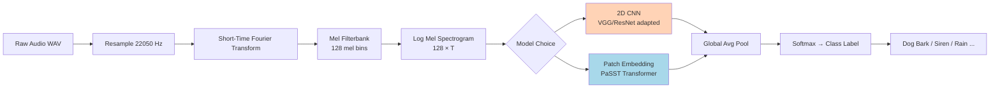

# 🔊 Environmental Sound Classification

> [!tldr] TL;DR
> Environmental Sound Classification (ESC) assigns a category label (dog bark, siren, rain) to short non-speech audio clips. The dominant approach is treating a mel spectrogram as a 2D image and applying CNNs or Vision Transformers, with state-of-the-art models like PaSST exceeding 99% accuracy on ESC-50.

## Intuition

Imagine you are blindfolded in a city — you can still tell a police siren from a jackhammer from a barking dog purely from sound. Each sound has a characteristic visual "fingerprint" when plotted as a spectrogram: sirens show parallel diagonal sweeping lines, rain looks like diffuse noise, a dog bark shows a short impulsive burst. ESC models learn these fingerprints exactly as an image classifier learns to recognize cats from fur textures — making the mel spectrogram + CNN pipeline an almost direct transfer of computer vision machinery.

## Mermaid Diagram



## Key Concepts

### Benchmark Datasets

| Dataset | Classes | Clips | Fold CV | Key Property |
|---------|---------|-------|---------|--------------|
| ESC-50 | 50 | 2000 | 5-fold | Standard benchmark; 5-sec clips |
| UrbanSound8K | 10 urban | 8732 | 10-fold | Pre-defined spatial folds |
| DCASE Task 1 | Acoustic scenes | ~10k | Challenge split | Annual competition |
| FSD50K | 200 | 51k | Official splits | FineGrained AudioSet subset |

ESC-50 fold structure enforces that clips from the same source do not appear in both train and test — critical to avoid data leakage.

### Baseline: MFCC + SVM

```python
import librosa, numpy as np
from sklearn.svm import SVC
from sklearn.preprocessing import StandardScaler

def extract_mfcc_features(file_path, n_mfcc=40):
    y, sr = librosa.load(file_path, sr=22050, duration=5.0)
    mfcc = librosa.feature.mfcc(y=y, sr=sr, n_mfcc=n_mfcc)
    # Aggregate: mean + std across time
    return np.concatenate([mfcc.mean(axis=1), mfcc.std(axis=1)])

# Fit SVM
scaler = StandardScaler()
X_train = scaler.fit_transform([extract_mfcc_features(f) for f in train_files])
clf = SVC(kernel='rbf', C=10, gamma='scale')
clf.fit(X_train, y_train)
```

Achieves ~73% on ESC-50 — strong baseline but misses temporal structure.

### CNN on Mel Spectrogram

The key insight: a mel spectrogram is a 2D array (frequency × time) — treat it as a single-channel image.

$$S_{\text{mel}}[m, t] = 10 \log_{10} \left( \sum_{k} |X[k, t]|^2 \cdot H_m[k] \right)$$

where $H_m[k]$ are triangular mel filterbank weights and $X[k,t]$ is the STFT.

```python
import torch, torchaudio, torch.nn as nn
import torchaudio.transforms as T

class MelCNN(nn.Module):
    def __init__(self, n_classes=50):
        super().__init__()
        self.mel = T.MelSpectrogram(sample_rate=22050, n_mels=128,
                                     n_fft=1024, hop_length=512)
        self.db  = T.AmplitudeToDB()
        self.cnn = nn.Sequential(
            nn.Conv2d(1, 32, 3, padding=1), nn.BatchNorm2d(32), nn.ReLU(),
            nn.MaxPool2d(2),
            nn.Conv2d(32, 64, 3, padding=1), nn.BatchNorm2d(64), nn.ReLU(),
            nn.MaxPool2d(2),
            nn.Conv2d(64, 128, 3, padding=1), nn.BatchNorm2d(128), nn.ReLU(),
            nn.AdaptiveAvgPool2d((4, 4)),
        )
        self.fc = nn.Linear(128 * 16, n_classes)

    def forward(self, waveform):            # (B, T)
        spec = self.db(self.mel(waveform))  # (B, 128, T')
        spec = spec.unsqueeze(1)            # (B, 1, 128, T')
        feat = self.cnn(spec).flatten(1)
        return self.fc(feat)
```

### Data Augmentation

| Technique | How Applied | Effect |
|-----------|-------------|--------|
| Time shift | Roll waveform by random offset | Temporal invariance |
| Pitch shift | `librosa.effects.pitch_shift` | Frequency invariance |
| SpecAugment | Mask time/freq bands in spectrogram | Robust to noise |
| Background mixing | Add low-SNR noise clip | Generalises to real environments |
| Mixup | Blend two clips: $\tilde{x} = \lambda x_i + (1-\lambda)x_j$ | Soft label regularisation |

### PaSST (Patchout faSt Spectrogram Transformer)

PaSST extends the Audio Spectrogram Transformer by **randomly dropping spectrogram patches** during training (analogous to dropout, but spatial):

$$\mathcal{L}_{\text{CE}} = -\sum_c y_c \log \hat{y}_c, \quad \hat{y} = \text{softmax}(\text{Transformer}(\text{PatchEmbed}(S_{\text{mel}})))$$

Achieves **99.6% on ESC-50** (vs. human 81.3% on that benchmark).

### Accuracy Comparison: ESC-50

| Model | Accuracy | Notes |
|-------|----------|-------|
| SVM + MFCC | ~73% | Baseline |
| CNN + Mel | ~83% | VGG-style |
| SoundNet | ~88% | Trained on video soundtracks |
| AST (ImageNet + AudioSet) | ~95.6% | ViT fine-tuned |
| PaSST | **99.6%** | Patchout + ImageNet + AudioSet pretrain |

## Real-World Notes

- **Microphone variability** is a major issue in production: a clip recorded on a phone mic vs. a studio mic sounds very different in spectrograms.
- UrbanSound8K's 10-fold CV uses geographic blocks — crucial so sounds from the same recording location don't bleed between train/test.
- DCASE organises annual challenges with new tasks each year (scene classification, anomaly detection, few-shot sound events).

## Common Pitfalls

- **Data leakage**: forgetting that ESC-50's 5 folds must be respected — random 80/20 splits will inflate accuracy by ~10%.
- **Frequency axis ordering**: librosa returns mel bins from low to high; some frameworks flip this — check your orientation.
- **Duration mismatch**: ESC clips are exactly 5s; padding shorter clips with silence vs. wrapping them changes statistics.
- **ImageNet normalisation**: when using pretrained CNNs, normalise the single-channel spectrogram to ImageNet RGB stats (replicate across 3 channels or re-train BN).

## Related Concepts

- [[Audio_Tagging_Weak_Supervision]] — scales to 527 classes on AudioSet with weak labels
- [[_MOC_Audio_Signal_Processing]] — mel spectrogram construction details
- [[Music_Classification_MIR]] — music-specific features beyond mel

## Review Questions

1. Why does ESC-50 use 5-fold cross-validation instead of a random train/test split, and what would happen to reported accuracy if you ignored the fold structure?
2. SpecAugment masks rectangular blocks in the time-frequency plane. Explain why this acts as a regulariser and not just as a data corruptor.
3. PaSST achieves 99.6% on ESC-50 while human accuracy is ~81.3%. What does this imply about the difficulty of the benchmark, and what limitations remain for real-world deployment?

## Sources

- Piczak, K. J. (2015). ESC: Dataset for Environmental Sound Classification. *ACM MM*.
- Salamon, J. & Bello, J. P. (2017). Deep Convolutional Neural Networks and Data Augmentation for ESC. *IEEE SPL*.
- Koutini, K. et al. (2022). Efficient Training of Audio Transformers with Patchout. *Interspeech*.
- Gemmeke, J. F. et al. (2017). Audio Set. *ICASSP*.

#audio-classification #ESC-50 #UrbanSound8K #mel-spectrogram #CNN #PaSST #DCASE
