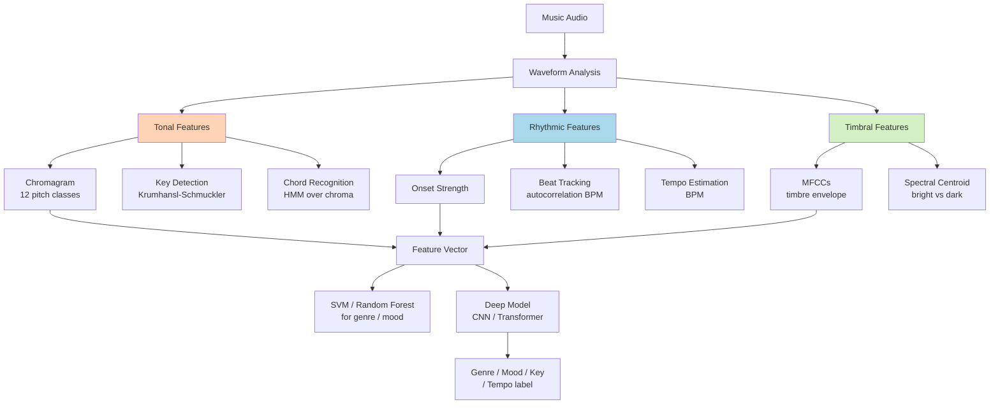

# 🎸 Music Classification & Music Information Retrieval

> [!tldr] TL;DR
> Music Information Retrieval (MIR) extracts semantic attributes from music — genre, mood, tempo, chords, key — using both hand-crafted tonal/rhythmic features and deep neural networks. Mel spectrograms dominate deep approaches, but music-specific features like chroma and onset strength add crucial harmonic and rhythmic grounding.

## Intuition

Music is structured sound with two complementary dimensions: **harmony** (which notes and chords are playing) and **rhythm** (when and how fast they occur). A genre classifier needs to know that blues features the minor pentatonic scale and a swung 4/4 groove, while techno features synthetic timbres and a rigid 4-on-the-floor 130 BPM kick. Features like the chromagram capture harmonic fingerprints (which of the 12 pitch classes are active), while onset strength and autocorrelation capture rhythmic regularity. Deep models learn these implicitly; classical MIR features make them explicit and interpretable.

## Mermaid Diagram



## Key Concepts

### MIR Task Taxonomy

| Task | Dataset | Metric | Typical Accuracy |
|------|---------|--------|-----------------|
| Genre classification | GTZAN (10 genres, 1000 clips) | Accuracy | ~90% CNN |
| Mood/emotion (valence-arousal) | MER-TAF, Mosei | R² | ~0.6 R² |
| Instrument recognition | IRMAS (11 instruments) | F1 | ~80% CNN |
| Key detection | GiantSteps | Accuracy | ~70–80% |
| Tempo estimation | Ballroom, ACM Tempo | Accuracy ±4% | ~85% |
| Chord recognition | RWC, Billboard | Weighted chord accuracy | ~75% HMM |
| Auto-tagging | MagnaTagATune (188 tags) | AUC-ROC | ~0.90 |

### Tonal Features: Chromagram

The chroma (pitch-class profile) collapses the full frequency axis into 12 semitone bins, discarding octave information:

$$C[p, t] = \sum_{k \; : \; \text{pitch}(k) \equiv p \pmod{12}} |X[k, t]|^2, \quad p \in \{C, C\#, D, \ldots, B\}$$

```python
import librosa, librosa.display, matplotlib.pyplot as plt

y, sr = librosa.load('song.mp3', sr=22050)

# Constant-Q chromagram (better pitch resolution)
chroma = librosa.feature.chroma_cqt(y=y, sr=sr, bins_per_octave=36)
# shape: (12, T)

plt.figure(figsize=(12, 3))
librosa.display.specshow(chroma, y_axis='chroma', x_axis='time', sr=sr)
plt.colorbar(); plt.title('Chromagram')
```

Chord root detection: the pitch class with maximum chroma energy over a window is the likely root.

### Rhythmic Features: Beat Tracking

Beat tracking uses the **onset strength envelope** — a measure of how quickly energy is increasing at each moment — and finds periodicity via autocorrelation:

$$\text{onset\_env}[t] = \text{ReLU}\left(\frac{d}{dt} \log S[t]\right), \quad S[t] = \sum_f |X[f,t]|$$

```python
# Beat tracking with librosa
tempo, beat_frames = librosa.beat.beat_track(y=y, sr=sr, units='frames')
beat_times = librosa.frames_to_time(beat_frames, sr=sr)

print(f"Estimated tempo: {tempo:.1f} BPM")
print(f"Beat locations (s): {beat_times[:10]}")

# Onset strength
onset_env = librosa.onset.onset_strength(y=y, sr=sr)
# Fourier tempogram for visualisation
tempogram = librosa.feature.tempogram(onset_envelope=onset_env, sr=sr)
```

### Key Detection: Krumhansl-Schmuckler

The K-S algorithm correlates the time-averaged chroma vector against pre-defined major/minor key profiles:

$$\hat{k} = \arg\max_{k \in \{24 \text{ keys}\}} \text{corr}\left(\bar{C}, \mathbf{w}_k\right)$$

where $\mathbf{w}_k$ are the empirical pitch salience profiles for each key (e.g., C major weights: $[6.35, 2.23, 3.48, 2.33, 4.38, 4.09, 2.52, 5.19, 2.39, 3.66, 2.29, 2.88]$).

```python
# librosa tonal_centroid can feed into key estimation
chroma_mean = chroma.mean(axis=1)          # 12-dim vector
# Correlate with Krumhansl major/minor profiles
krumhansl_major = np.array([6.35,2.23,3.48,2.33,4.38,4.09,2.52,5.19,2.39,3.66,2.29,2.88])
key_profile = np.roll(krumhansl_major, 0)  # shift for each key
similarity = np.corrcoef(chroma_mean, key_profile)[0, 1]
```

### Chord Recognition with HMM

Chord recognition models the temporal smoothness of harmonic progressions:

- **Emission**: $P(\text{chroma}_t \mid \text{chord}_c)$ — Gaussian or template-based
- **Transition**: $P(\text{chord}_{t+1} \mid \text{chord}_t)$ — learned from chord transcriptions
- **Decoding**: Viterbi algorithm over chord vocabulary

$$\hat{C}_{1:T} = \arg\max \prod_t P(\text{obs}_t \mid C_t) \cdot P(C_t \mid C_{t-1})$$

### Deep Learning for MIR

**SampleCNN**: 1D dilated CNNs operating on raw audio — no hand-crafted features:

```python
# SampleCNN block (simplified)
class SampleCNNBlock(nn.Module):
    def __init__(self, in_ch, out_ch, kernel=3, stride=3):
        super().__init__()
        self.conv = nn.Conv1d(in_ch, out_ch, kernel, stride, padding=1)
        self.bn   = nn.BatchNorm1d(out_ch)
    def forward(self, x):
        return F.relu(self.bn(self.conv(x)))

# 9 blocks with stride 3 each: downsamples 3^9 = 19683× at 22050 Hz → ~1 frame
```

**Musicnn**: Musically-motivated CNN with separate front-ends for timbral (time-domain) and temporal (frequency-domain) patterns, then merged.

**MERT**: Music foundation model — masked token prediction on music audio at scale, fine-tuned for any MIR downstream task; achieves SOTA on GTZAN (~96%), MagnaTagATune AUC ~0.91.

### MIR Tasks × Features × Recommended Models

| Task | Hand-crafted Features | Deep Model | Notes |
|------|-----------------------|-----------|-------|
| Genre | MFCC + chroma + tempo | SampleCNN / MERT | GTZAN ~90% CNN, ~96% MERT |
| Tempo | Onset + autocorrelation | TCN | Ballroom ~85% acc |
| Key | Chromagram + K-S | MERT fine-tune | GiantSteps ~79% |
| Chord | Chroma + HMM | CRNN + CRF | Billboard ~75% WCA |
| Mood | Spectral + chroma | Bi-LSTM / Transformer | Continuous valence-arousal |
| Auto-tag | — | Musicnn / MERT | MagnaTagATune AUC ~0.91 |

## Real-World Notes

- GTZAN has known label errors (~2–3%) and some clips appear across supposed "genres" — the Tzanetakis fault. Use GTZAN-fault-filtered splits.
- Music mood is highly subjective — annotator agreement on valence scores is typically around $\kappa \approx 0.4$.
- Tempo estimation allows **double/half** errors (annotating at half the correct BPM) — the Accuracy ±4% metric only counts being within 4% of one of {0.5×, 1×, 2×} the reference.

## Common Pitfalls

- **Chroma vs. MFCC**: chroma captures *what notes* are playing (harmony); MFCC captures *timbre* (instrument texture). Genre classification benefits from both.
- **Sliding window length**: chords change at ~1s resolution; use ~1s frames for chord recognition but shorter for onset detection.
- **Key ambiguity**: parallel major/minor (e.g., C major vs. C minor) share 3 pitch classes — K-S often confuses them; use relative key correction.
- **BPM phase**: librosa's `beat_track` returns frame indices, not seconds — always convert with `frames_to_time`.

## Related Concepts

- [[Music_Source_Separation]] — separating stems enables per-stem MIR analysis
- [[Environmental_Sound_Classification]] — same mel-CNN pipeline for non-music sounds
- [[Audio_Captioning_Retrieval]] — CLAP can zero-shot classify music genres using text prompts

## Review Questions

1. A chromagram compresses the full frequency axis to 12 bins. What information is deliberately discarded, and why is this useful for chord/key analysis?
2. Describe the steps from a raw waveform to a BPM estimate using librosa's beat tracker, including the intermediate `onset_strength` signal.
3. MERT achieves ~96% on GTZAN while a simple CNN achieves ~90%. What does the ~6% gap likely reflect about music structure that the foundation model has learned?

## Sources

- Tzanetakis, G. & Cook, P. (2002). Musical Genre Classification of Audio Signals. *IEEE TASLP*.
- Lee, J. et al. (2017). Sample-level Deep Convolutional Neural Networks for Music Auto-tagging. *AES*.
- Li, Y. et al. (2023). MERT: Acoustic Music Understanding Model with Large-Scale Self-Supervised Training. *ICLR 2024*.
- Krumhansl, C. L. (1990). *Cognitive Foundations of Musical Pitch*. Oxford.

#MIR #music-classification #genre #chroma #beat-tracking #tempo #GTZAN #MERT #chord-recognition
