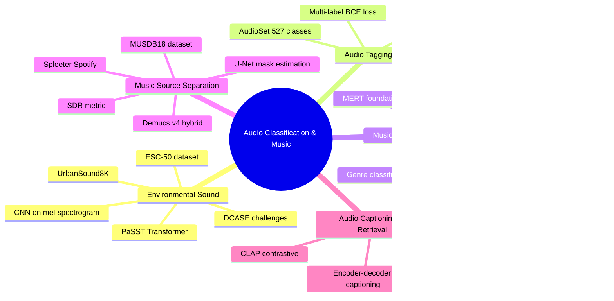

# 🎵 MOC: Audio Classification & Music

> [!abstract] Section Overview
> This section covers the full spectrum of audio understanding beyond speech — from classifying environmental sounds and tagging audio events, to music analysis, source separation, and language-grounded audio retrieval. These techniques power smart home devices, music apps, content moderation, and multimodal AI systems.

---

## Concept Map

---

## Learning Path

| Step | Note | Difficulty | Why This Order |
|------|------|------------|----------------|
| 1 | [[Environmental_Sound_Classification]] | Intermediate | Foundation: mel-spec CNN pattern used everywhere |
| 2 | [[Audio_Tagging_Weak_Supervision]] | Intermediate | Scales up with AudioSet + weak labels |
| 3 | [[Music_Classification_MIR]] | Intermediate | Music-specific features (chroma, tempo, chords) |
| 4 | [[Music_Source_Separation]] | Advanced | Generative/mask-based signal decomposition |
| 5 | [[Audio_Captioning_Retrieval]] | Advanced | Language-grounded audio understanding (CLAP) |

---

## All Notes in This Section

| Note | Topic | Difficulty | Key Models |
|------|-------|------------|-----------|
| [[Environmental_Sound_Classification]] | ESC-50, UrbanSound8K, CNN | Intermediate | PaSST, SoundNet, VGG |
| [[Audio_Tagging_Weak_Supervision]] | AudioSet, MIL, SED | Intermediate | PANN CNN14, AST, BEATs |
| [[Music_Classification_MIR]] | Genre, mood, chroma, tempo | Intermediate | MERT, SampleCNN, Musicnn |
| [[Music_Source_Separation]] | MUSDB18, SDR, U-Net | Advanced | Demucs v4, UMX, Spleeter |
| [[Audio_Captioning_Retrieval]] | AudioCaps, CLAP, zero-shot | Advanced | CLAP, WavCaps, BEATs |

---

## Key Questions for This Section

1. Why do ImageNet-pretrained CNNs transfer surprisingly well to audio spectrograms?
2. What makes AudioSet "weakly labeled," and how does Multiple Instance Learning (MIL) address this?
3. What is the difference between audio tagging (clip-level) and Sound Event Detection (frame-level)?
4. How does Demucs v4 operate in both the waveform and spectrogram domain simultaneously?
5. How does CLAP enable zero-shot audio classification without any audio-label training pairs at test time?

---

## Cross-Section Links

| Related Section | Why It Connects |
|----------------|-----------------|
| [[_MOC_Audio_Signal_Processing]] | Mel spectrograms, MFCCs, chroma — features used here |
| [[_MOC_ASR]] | Speech classification shares model architectures |
| [[_MOC_Audio_Foundation_Models]] | CLAP, MERT, BEATs — foundation models appear in both |
| [[_MOC_Audio_Speech_Master]] | Top-level vault entry point |

---

#audio-classification #music #MIR #audio-tagging #source-separation #CLAP #AudioSet #ESC-50
