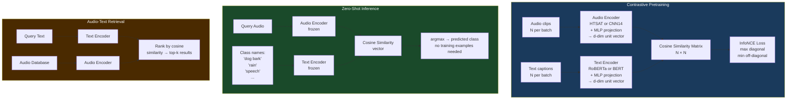

# CLAP: Contrastive Language–Audio Pretraining

> [!tldr] TL;DR
> CLAP (Microsoft/LAION) learns a **joint audio-text embedding space** by contrasting matched audio-caption pairs, enabling zero-shot audio classification, cross-modal retrieval, and audio-conditioned generation — the direct audio analogue of CLIP for images.

---

## Intuition

CLIP taught computers to understand images by reading millions of image captions: "a photo of a cat wearing a hat" matched to the actual image. CLAP does the same for audio: pair "the sound of raindrops on a tin roof during a thunderstorm" with its audio recording, and repeat for 4.6 million examples. After training, the model learns a shared space where **semantically similar audio and text are nearby**, regardless of modality. This unlocks zero-shot classification without a single labeled example: just compare the audio embedding to embeddings of class name strings and pick the closest one.

---

## Mermaid Diagram



---

## Key Concepts

### InfoNCE Contrastive Loss

Given a batch of $N$ (audio, text) pairs, let $a_i$ and $t_i$ be the L2-normalised embeddings:

$$\mathcal{L}_{\text{audio→text}} = -\frac{1}{N} \sum_{i=1}^{N} \log \frac{\exp(a_i \cdot t_i / \tau)}{\sum_{j=1}^{N} \exp(a_i \cdot t_j / \tau)}$$

$$\mathcal{L}_{\text{text→audio}} = -\frac{1}{N} \sum_{i=1}^{N} \log \frac{\exp(t_i \cdot a_i / \tau)}{\sum_{j=1}^{N} \exp(t_i \cdot a_j / \tau)}$$

$$\mathcal{L}_{\text{CLAP}} = \frac{1}{2}(\mathcal{L}_{\text{audio→text}} + \mathcal{L}_{\text{text→audio}})$$

where $\tau$ is a learnable temperature parameter (initialised to $\log(1/0.07) \approx 2.66$). The $N \times N$ similarity matrix has the $N$ diagonal entries as positive pairs and $N^2 - N$ off-diagonal entries as negatives.

**Effective batch size matters:** larger batches provide more negatives per step, improving alignment quality (CLIP uses batches of 32,768).

---

### Audio Encoders

**HTSAT (Hierarchical Token-Semantic Audio Transformer):**
- Swin Transformer applied to log-mel spectrograms
- Patch merging creates hierarchical representations
- 4 stages, patch size $4 \times 4$, window size $8 \times 8$
- Output: global average pooled → 768-d projection

**CNN14 (PANN baseline):**
- 14-layer VGG-style CNN on log-mel spectrograms
- Pooling over time and frequency → 2048-d → projection
- Simpler but slightly lower zero-shot performance than HTSAT

| Audio Encoder | Params | ZS AudioCaps R@1 | Spectral Input |
|--------------|--------|------------------|----------------|
| CNN14 | 80M | 33.5% | Log-mel 64 bins |
| HTSAT-tiny | 31M | 36.7% | Log-mel 64 bins |
| HTSAT-base | 90M | **39.2%** | Log-mel 64 bins |

---

### Text Encoders

CLAP variants use different text backbones:

| Text Encoder | Params | Notes |
|-------------|--------|-------|
| BERT-base | 110M | Original MSCLAP (2022) |
| RoBERTa-base | 125M | LAION-CLAP default |
| RoBERTa-large | 355M | Higher capacity |
| GPT-2 | 117M | Causal LM alternative |

Text is encoded using the `[CLS]` token (BERT) or final token (GPT-2) representation, then projected to embedding dimension $d$.

---

### Zero-Shot Audio Classification

For a set of class names $\{y_1, \ldots, y_C\}$, create text prompts:

```python
prompts = [f"the sound of {cls}" for cls in class_names]
# or ensemble multiple templates:
templates = [
    "a recording of {}",
    "the sound of {}",
    "an audio clip of {}",
    "{} sounds",
]
```

Then classify:

$$\hat{y} = \arg\max_c \cos(a_\text{query},\, \bar{t}_c)$$

where $\bar{t}_c$ is the mean embedding over prompt templates for class $c$.

---

### BEATs: Iterative Audio Tokenizer Pretraining

BEATs (Microsoft, 2023) takes a different self-supervised approach inspired by HuBERT's iterative clustering — but instead of k-means, it learns a **neural tokenizer** jointly with the encoder:

**Iterative BEATs:**
1. Train audio tokenizer $\mathcal{T}$ (quantized encoder) on audio reconstruction
2. Train BERT-style encoder on masked prediction of $\mathcal{T}$ outputs
3. Use trained encoder as new tokenizer; repeat

$$\mathcal{L}_{\text{BEATs}} = -\sum_{t \in M} \log p_\theta(z_t \mid \tilde{X})$$

where $z_t = \mathcal{T}(X_t)$ are the tokenizer's outputs. This avoids the separate offline k-means step in HuBERT.

BEATs achieves **98.0% on AudioSet** (full fine-tune), surpassing all prior PANN and HuBERT-based models.

---

### CLAP Variants Comparison

| Model | Org | Year | Training Data | Zero-Shot R@1\nAudioCaps | Zero-Shot Acc\nESC-50 |
|-------|-----|------|---------------|--------------------------|----------------------|
| MSCLAP (2022) | Microsoft | 2022 | 630K pairs | 33.5% | 82.6% |
| MSCLAP (2023) | Microsoft | 2023 | 4.7M pairs | 37.5% | 91.0% |
| **LAION-CLAP** | LAION | 2023 | **4.6M pairs** | **39.4%** | **93.1%** |
| WavCaps | Surrey/CUHK | 2023 | 400K (GPT-enriched) | 36.3% | 89.5% |
| EAT | — | 2024 | 2M pairs | 40.1% | 94.2% |

*R@1 = Recall at 1 for text-to-audio retrieval on AudioCaps test set.*

---

### Zero-Shot Classification with LAION-CLAP (Code)

```python
import laion_clap
import torch
import torchaudio

# Load LAION-CLAP model
model = laion_clap.CLAP_Module(enable_fusion=False, amodel="HTSAT-base")
model.load_ckpt()  # downloads pretrained weights
model.eval()

# Encode audio
audio, sr = torchaudio.load("dog_bark.wav")
if sr != 48000:
    audio = torchaudio.functional.resample(audio, sr, 48000)
audio = audio.mean(0)  # stereo → mono
# CLAP expects 10-second windows at 48kHz
audio = audio[:48000 * 10]  # truncate / pad to 10s

audio_embed = model.get_audio_embedding_from_data(
    x=audio.unsqueeze(0),  # (1, T)
    use_tensor=True
)  # (1, 512)

# Encode class name texts
class_names = ["dog barking", "cat meowing", "rain", "speech", "music", "wind"]
text_prompts = [f"a sound of {c}" for c in class_names]
text_embeds = model.get_text_embedding(text_prompts)  # (C, 512)

# Cosine similarity → zero-shot classification
sims = torch.nn.functional.cosine_similarity(
    audio_embed,               # (1, 512)
    torch.tensor(text_embeds), # (C, 512)
    dim=-1
)
pred_class = class_names[sims.argmax().item()]
print(f"Predicted class: {pred_class} (score: {sims.max():.3f})")

# Text-to-audio retrieval
query = "rain falling on leaves"
q_embed = model.get_text_embedding([query])  # (1, 512)
# Given a database of audio embeddings `db_embeds` (N, 512):
# scores = cosine_similarity(q_embed, db_embeds) → rank by scores
```

---

### Universal Sound Separation with CLAP

CLAP embeddings can guide **source separation** without paired training data:

1. Mix $= s_1 + s_2$; goal: extract source matching text query $q$
2. Train separator to maximise $\cos(\text{CLAP}(\hat{s}), \text{CLAP\_text}(q))$
3. Zero-shot: "extract the guitar", "remove background noise", "isolate the voice"

This makes CLAP useful far beyond classification — it becomes a **universal audio understanding backbone**.

---

## Real-World Notes

- **LAION-CLAP is fully open-source** (MIT license), making it the standard choice for research and production pipelines.
- **Prompt engineering matters** for zero-shot: "sound of" prefix consistently outperforms bare class names. Ensembling 4–8 templates gives +1–2% improvement.
- **AudioSet retrieval:** LAION-CLAP's joint embedding can retrieve relevant clips from AudioSet's 2M clips in milliseconds using approximate nearest-neighbour search (FAISS/HNSWlib).

---

## Common Pitfalls

- **Audio duration assumption:** CLAP processes fixed-length windows (typically 10 seconds). Long clips must be chunked and embeddings averaged; this works poorly for structured content (music, speech).
- **Caption quality gap:** Training on noisy web captions (auto-generated from metadata) introduces noise. WavCaps uses GPT-4 to rewrite captions, improving alignment quality significantly.
- **Retrieval ≠ classification:** R@1 on retrieval tasks rewards exact match. For classification, template ensembling and softmax calibration are needed for well-calibrated probabilities.
- **Domain shift:** CLAP trained on general sounds transfers poorly to specialised domains (medical audio, industrial machinery). Fine-tuning on domain-specific caption pairs is recommended.

---

## Related Concepts

- [[Wav2Vec2_HuBERT]] — BEATs uses iterative tokenizer training similar to HuBERT
- [[AudioCraft_MusicGen]] — MusicLM (related to MusicGen) uses MuLan, a music-domain CLAP variant
- [[Multimodal_Audio_Language_Models]] — CLAP embeddings used as conditioning in AudioPaLM and WavLLM
- [[_MOC_Audio_Classification]] — CLAP zero-shot vs supervised PANNs vs fine-tuned SSL

---

## Review Questions

1. CLAP uses InfoNCE loss. Explain why **batch size is critical** for contrastive learning quality. What happens with very small batches ($N = 8$) vs large batches ($N = 4096$)?
2. How does **prompt template ensembling** improve zero-shot classification accuracy? Describe the mechanism and provide an example with three templates for "dog barking".
3. A company wants to use CLAP for real-time audio event detection in security cameras. What are the two main limitations of applying the pretrained LAION-CLAP model directly, and how would you address each?

---

## Sources

- Wu et al., "Large-Scale Contrastive Language-Audio Pretraining with Feature Fusion and Keyword-to-Caption Augmentation," ICASSP 2023. arXiv:2211.06687 (MSCLAP)
- Laion-AI, "LAION-CLAP: Robust Audio-Text Representations via Large-Scale Contrastive Pretraining," ICASSP 2023. arXiv:2211.06955
- Chen et al., "BEATs: Audio Pre-Training with Acoustic Tokenizers," ICML 2023. arXiv:2212.09058
- Mei et al., "WavCaps: A ChatGPT-Assisted Weakly-Labelled Audio Captioning Dataset for Audio-Language Multimodal Research," arXiv:2303.17395
- LAION-CLAP GitHub: https://github.com/LAION-AI/CLAP

#audio #clap #contrastive-learning #zero-shot #audio-language #retrieval #classification #beats #laion
