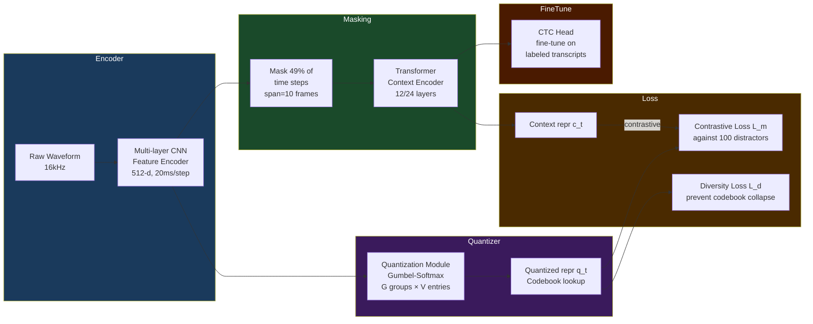

# Self-Supervised Speech Pretraining: Wav2Vec 2.0 and HuBERT

> [!tldr] TL;DR
> Wav2Vec 2.0 and HuBERT learn powerful speech representations from **unlabeled audio** using masking and either contrastive or classification objectives, then fine-tune on tiny labeled datasets to achieve state-of-the-art ASR — wav2vec 2.0 reaches 4.8% WER on LibriSpeech test-clean with just **10 minutes** of labeled speech.

---

## Intuition

Imagine learning to read a language by first listening to thousands of hours of conversation without a transcript — building intuitions about phonemes, rhythm, and structure — and then being shown just a few hundred labeled examples to map sounds to letters. That is exactly what self-supervised speech models do. The key insight is that **raw audio contains enormous redundancy**: neighboring frames are predictable from context, and masked frames can be inferred. By forcing the model to predict masked audio segments, it learns rich acoustic and linguistic representations without any human labeling cost.

---

## Mermaid Diagram



---

## Key Concepts

### Wav2Vec 2.0 Architecture (Facebook AI, 2020)

**Three modules:**

| Module | Role | Details |
|--------|------|---------|
| CNN Feature Encoder | Raw audio → latent features | 7 conv layers, stride [5,2,2,2,2,2,2], output 20ms/step |
| Quantization Module | Latent → discrete codes | G=2 groups, V=320 entries each; Gumbel-softmax sampling |
| Transformer Context Encoder | Contextual representations | 12 (base) or 24 (large) layers, relative positional encoding |

**Contrastive Loss:**

During pretraining, $M$ time steps are masked. For each masked step $t$, the model must identify the true quantized representation $q_t$ from a set of $K=100$ distractors $\tilde{q}$:

$$\mathcal{L}_m = -\log \frac{\exp(\text{sim}(c_t,\, q_t) / \kappa)}{\sum_{\tilde{q} \sim Q_t} \exp(\text{sim}(c_t,\, \tilde{q}) / \kappa)}$$

where $\text{sim}(a, b) = a^\top b / \|a\| \|b\|$ is cosine similarity and $\kappa = 0.1$ is a temperature parameter.

**Diversity Loss** (prevents codebook collapse):

$$\mathcal{L}_d = \frac{1}{GV} \sum_{g=1}^{G} -H(\bar{p}_g) = \frac{1}{GV} \sum_{g=1}^{G} \sum_{v=1}^{V} \bar{p}_{g,v} \log \bar{p}_{g,v}$$

Total loss: $\mathcal{L} = \mathcal{L}_m + \alpha \mathcal{L}_d$ with $\alpha = 0.1$.

**Masking strategy:** spans of length $\ell = 10$ frames are masked, covering ~49% of timesteps total.

---

### HuBERT (Hidden Unit BERT, Facebook AI, 2021)

HuBERT replaces the contrastive objective with a simpler **masked prediction** (classification) objective over offline cluster targets:

$$\mathcal{L}_{\text{HuBERT}} = -\sum_{t \in M} \log p(z_t \mid \tilde{X}, t)$$

where $z_t$ is the cluster ID for frame $t$ and $\tilde{X}$ is the masked waveform.

**Iterative training procedure:**

| Round | Cluster Targets | Model Used |
|-------|-----------------|------------|
| 1 | 100 k-means clusters on 39-dim MFCC | Train HuBERT Base from scratch |
| 2 | 500 clusters on 6th-layer HuBERT features | Re-train / continue |
| 3+ | Clusters on later-layer features | Refine further |

The key insight: **only masked frames** contribute to the loss, forcing the model to learn from context rather than memorising.

---

### WavLM and Data2Vec (Bonus Context)

| Model | Org | Year | Objective | Key Innovation |
|-------|-----|------|-----------|----------------|
| wav2vec 2.0 | Meta | 2020 | Contrastive | Gumbel-softmax quantization |
| HuBERT | Meta | 2021 | Masked classification | Iterative offline clustering |
| WavLM | Microsoft | 2022 | Masked + denoising | Denoised masked prediction |
| data2vec | Meta | 2022 | Regression on teacher | Unified SSL across modalities |

**WavLM** adds a **gated relative position bias** to the Transformer and trains on a masked *denoised* prediction: the model must predict clean features despite noisy input, improving robustness for downstream tasks.

---

### Fine-Tuning for ASR

```python
from transformers import Wav2Vec2ForCTC, Wav2Vec2Processor
import torch

# Load pre-trained model and processor
model = Wav2Vec2ForCTC.from_pretrained("facebook/wav2vec2-base-960h")
processor = Wav2Vec2Processor.from_pretrained("facebook/wav2vec2-base-960h")

# Transcribe audio (16kHz mono numpy array)
import librosa
audio, sr = librosa.load("speech.wav", sr=16000)

inputs = processor(audio, sampling_rate=16000, return_tensors="pt", padding=True)

with torch.no_grad():
    logits = model(**inputs).logits  # shape: (1, T, vocab_size)

# CTC greedy decode
predicted_ids = torch.argmax(logits, dim=-1)
transcription = processor.batch_decode(predicted_ids)
print(transcription[0])

# --- Fine-tuning with CTC loss ---
from transformers import TrainingArguments, Trainer
from datasets import load_dataset

dataset = load_dataset("librispeech_asr", "clean", split="train.100")

def preprocess(batch):
    audio = batch["audio"]["array"]
    batch["input_values"] = processor(
        audio, sampling_rate=16000
    ).input_values[0]
    with processor.as_target_processor():
        batch["labels"] = processor(batch["text"]).input_ids
    return batch

dataset = dataset.map(preprocess, remove_columns=dataset.column_names)
```

---

### ASR Performance (LibriSpeech)

| Model | Labeled Data | test-clean WER | test-other WER |
|-------|-------------|----------------|----------------|
| wav2vec 2.0 Base | 10 min | 4.8% | 8.2% |
| wav2vec 2.0 Large | 10 min | 3.0% | 5.2% |
| HuBERT Base | 960h fine-tune | 2.7% | 6.3% |
| HuBERT Large | 960h fine-tune | **2.0%** | **3.9%** |
| WavLM Large | 960h fine-tune | 1.8% | 3.4% |
| Supervised baseline | 960h | ~2.5% | ~6% |

---

## Real-World Notes

- **Low-resource languages:** wav2vec 2.0 is the backbone of Facebook's work on 1,000+ language ASR (MMS project), enabling languages with only 1–10 hours of labeled data.
- **XLSR (Cross-Lingual):** Multilingual wav2vec 2.0 pretrained on 128 languages simultaneously; fine-tune per language with minimal data.
- **Speaker verification:** HuBERT features extracted from the last few layers are strong speaker embeddings, competing with x-vectors.

---

## Common Pitfalls

- **Sampling rate mismatch:** All these models expect 16kHz mono audio. Resampling from 8kHz phone audio degrades quality.
- **CTC greedy vs beam search:** Greedy decoding can give 10–20% relative WER increase vs beam search with a language model; always use beam search + LM for production.
- **Codebook collapse:** Without the diversity loss in wav2vec 2.0, the quantizer can collapse to using only a few codes, preventing learning of diverse phonemes.
- **Fine-tuning learning rate:** Use a very small LR ($10^{-4}$ or less) for the Transformer, slightly larger for the CTC head; large LRs destroy pretrained representations.

---

## Related Concepts

- [[AudioLM]] — uses HuBERT as its semantic tokeniser upstream
- [[CLAP_and_Audio_Language]] — BEATs also uses iterative tokenizer training like HuBERT
- [[Multimodal_Audio_Language_Models]] — Qwen-Audio uses Whisper encoder; WavLLM uses HuBERT
- [[_MOC_ASR]] — CTC decoding, beam search, language model integration

---

## Review Questions

1. Explain why the **diversity loss** $\mathcal{L}_d$ is necessary in wav2vec 2.0 pretraining. What would happen if only $\mathcal{L}_m$ were used?
2. How does HuBERT's iterative training procedure bootstrap better cluster targets across rounds? Why does the quality of clusters matter?
3. A researcher wants to apply HuBERT to a low-resource tonal language (e.g., Vietnamese, 2 hours labeled). What pretraining strategy would you recommend, and why?

---

## Sources

- Baevski et al., "wav2vec 2.0: A Framework for Self-Supervised Learning of Speech Representations," NeurIPS 2020. arXiv:2006.11477
- Hsu et al., "HuBERT: Self-Supervised Speech Representation Learning by Masked Prediction of Hidden Units," TASLP 2021. arXiv:2106.07447
- Chen et al., "WavLM: Large-Scale Self-Supervised Pre-Training for Full Stack Speech Processing," IEEE JSTSP 2022. arXiv:2110.13900
- HuggingFace Wav2Vec2 docs: https://huggingface.co/docs/transformers/model_doc/wav2vec2

#audio #self-supervised-learning #asr #wav2vec #hubert #wavlm #contrastive-learning #transformers #foundation-models
