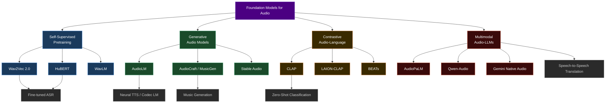

# Foundation Models for Audio — Section Hub

> [!abstract] Section Overview
> Foundation models have revolutionised audio AI by enabling **self-supervised pretraining** on massive unlabeled audio corpora followed by fine-tuning on small labeled datasets. This section covers the key architectures, training paradigms, and multimodal extensions that define the current state of the art.

---

## Concept Map

---

## Learning Path

| Step | Note | Difficulty | What You Gain |
|------|------|------------|---------------|
| 1 | [[Wav2Vec2_HuBERT]] | Advanced | Self-supervised pretraining, contrastive + masked prediction objectives |
| 2 | [[AudioLM]] | Advanced | Discrete audio tokenisation, hierarchical language modelling |
| 3 | [[AudioCraft_MusicGen]] | Advanced | Controlled music & audio generation, codec LMs, delay pattern |
| 4 | [[CLAP_and_Audio_Language]] | Advanced | Contrastive audio-text embeddings, zero-shot classification |
| 5 | [[Multimodal_Audio_Language_Models]] | Advanced | Full audio-language models, speech-to-speech, instruction following |

---

## All Notes in This Section

| Note | Topics | Key Models |
|------|--------|------------|
| [[Wav2Vec2_HuBERT]] | Self-supervised ASR, contrastive loss, masked prediction | wav2vec 2.0, HuBERT, WavLM, data2vec |
| [[AudioLM]] | Hierarchical audio LM, semantic + acoustic tokens, RVQ codecs | AudioLM, SoundStream, EnCodec |
| [[AudioCraft_MusicGen]] | Text/melody-conditioned music generation, delay pattern | MusicGen, AudioGen, MAGNeT, Stable Audio |
| [[CLAP_and_Audio_Language]] | Dual-encoder contrastive learning, zero-shot audio understanding | CLAP, LAION-CLAP, BEATs, EAT |
| [[Multimodal_Audio_Language_Models]] | Audio-LLMs, discrete vs continuous audio input to LLMs | AudioPaLM, Qwen-Audio, Gemini, Moshi |

---

## Five Key Questions

1. How does **masked prediction** in HuBERT differ from the **contrastive loss** in wav2vec 2.0, and what are the practical trade-offs?
2. Why does AudioLM use **two separate tokenisers** (semantic and acoustic), and what problem does this solve compared to a single tokeniser?
3. How does MusicGen's **delay pattern** enable single-stage generation over multiple RVQ codebook levels?
4. What makes **CLAP** the audio analogue of CLIP, and what downstream tasks does a joint audio-text embedding space unlock?
5. What are the architectural differences between **discrete-token** and **continuous-embedding** approaches to building audio-language models?

---

## Prerequisites & Cross-Section Links

| Related Section | Why It Matters |
|-----------------|----------------|
| [[_MOC_Audio_Signal_Processing]] | Feature extraction (MFCC, spectrograms) used as inputs to foundation models |
| [[_MOC_ASR]] | Downstream task for wav2vec 2.0 / HuBERT fine-tuning |
| [[_MOC_TTS]] | Codec LMs (VALL-E, SoundStream) intersect with TTS |
| [[_MOC_Audio_Classification]] | Zero-shot classification with CLAP |
| [[_MOC_NLP_Master]] | Transformer architectures, BERT pretraining, LLM integration |
| [[_MOC_CV_Master]] | CLIP as conceptual ancestor of CLAP; audio-visual models |
| [[_MOC_Audio_Speech_Master]] | Parent vault MOC |

---

#audio #foundation-models #self-supervised #speech #music #multimodal
