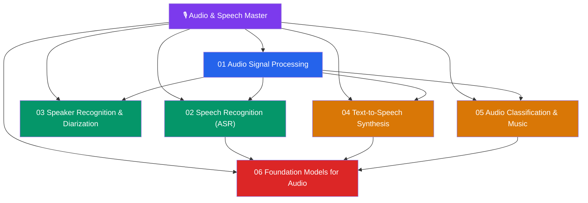

# 🎙️ Audio & Speech — Master Map of Content

> [!abstract] About This Vault
> A deep-dive Audio & Speech Processing reference: **37 notes across 6 sections**, covering the complete modern audio AI stack from digital signal processing and spectrograms through automatic speech recognition (ASR), speaker recognition and diarization, text-to-speech synthesis, audio classification and music understanding, and foundation models for audio. Every note pairs intuition-first analogies with precise mathematics, architecture diagrams, Python code (librosa, torch audio), and review questions. This vault bridges signal processing (see [[_MOC_SS_Master]]) with modern deep learning, providing the specialized knowledge needed for ASR systems, voice assistants, audio generation, and multimodal audio-language models.

## Vault Architecture

## Sections at a Glance

| # | Section | Notes | Entry Point | Difficulty |
|---|---------|-------|-------------|------------|
| 01 | Audio Signal Processing | 5 | [[_MOC_Audio_Signal_Processing]] | Beginner → Intermediate |
| 02 | Speech Recognition (ASR) | 5 | [[_MOC_ASR]] | Intermediate |
| 03 | Speaker Recognition & Diarization | 5 | [[_MOC_Speaker_Recognition]] | Intermediate → Advanced |
| 04 | Text-to-Speech Synthesis | 5 | [[_MOC_TTS]] | Intermediate → Advanced |
| 05 | Audio Classification & Music | 5 | [[_MOC_Audio_Classification]] | Intermediate |
| 06 | Foundation Models for Audio | 5 | [[_MOC_Audio_Foundation_Models]] | Advanced |

---

## Learning Paths

### Path 1 — Speech Engineer (ASR/TTS Production)
**Signal Processing → ASR → TTS → Foundation Models**

[[_MOC_Audio_Signal_Processing]] → [[Digital_Audio_Fundamentals]] → [[Spectrograms_Features]] → [[_MOC_ASR]] → [[ASR_Deep_Learning]] → [[CTC_and_Attention_ASR]] → [[Whisper_Architecture]] → [[_MOC_TTS]] → [[Neural_TTS]] → [[FastSpeech_and_Vocoders]] → [[_MOC_Audio_Foundation_Models]] → [[Wav2Vec2_HuBERT]]

### Path 2 — Voice AI / Speaker Systems
**Signal Processing → ASR → Speaker Recognition → Diarization**

[[Digital_Audio_Fundamentals]] → [[Spectrograms_Features]] → [[_MOC_ASR]] → [[ASR_Deep_Learning]] → [[_MOC_Speaker_Recognition]] → [[Speaker_Embeddings]] → [[Speaker_Verification]] → [[Speaker_Diarization]] → [[Voice_Activity_Detection]]

### Path 3 — Audio ML / Music AI
**Signal Processing → Audio Classification → Music → Foundation Models**

[[Digital_Audio_Fundamentals]] → [[Spectrograms_Features]] → [[_MOC_Audio_Classification]] → [[Environmental_Sound_Classification]] → [[Music_Classification_MIR]] → [[Audio_Tagging]] → [[_MOC_Audio_Foundation_Models]] → [[AudioCraft_MusicGen]] → [[Multimodal_Audio_Language]]

### Path 4 — Researcher (Self-Supervised Audio)
**Signal Processing → Foundation Models → All Applications**

[[Spectrograms_Features]] → [[_MOC_Audio_Foundation_Models]] → [[Wav2Vec2_HuBERT]] → [[AudioLM]] → [[AudioCraft_MusicGen]] → [[Multimodal_Audio_Language]] → [[_MOC_ASR]] → [[Whisper_Architecture]]

---

## Cross-Vault Links

- **[[_MOC_AI_ML_Master]]** (AI/ML vault) — deep learning fundamentals, Transformer architecture, and self-supervised pretraining that underpin all audio foundation models
- **[[_MOC_NLP_Master]]** — ASR output feeds NLP pipelines; TTS takes NLP output; audio-language models (Section 06) are NLP models conditioned on audio
- **[[_MOC_SS_Master]]** (Signals & Systems vault) — Fourier transforms, sampling theorem, convolution, and filter theory are the mathematical foundation for Section 01 of this vault
- **[[_MOC_CV_Master]]** — Video understanding (CV Section 06) combines audio and visual streams; audio-visual models are frontier research

---

## Section MOC Index

- [[_MOC_Audio_Signal_Processing]] — Digital audio representation (PCM, sample rate, bit depth), STFT and spectrogram computation, mel-scale filterbanks, mel spectrograms, MFCCs, pre-emphasis and windowing, librosa and torchaudio APIs.
- [[_MOC_ASR]] — Classical HMM-GMM ASR pipeline, end-to-end deep learning ASR, CTC (Connectionist Temporal Classification) loss and decoding, attention encoder-decoder ASR, Whisper (weakly supervised multitask), and language model integration (shallow fusion, deep fusion).
- [[_MOC_Speaker_Recognition]] — Speaker embeddings (i-vectors, d-vectors, x-vectors), speaker verification (EER, DCF metrics), speaker identification, voice activity detection (VAD), speaker diarization (clustering and end-to-end approaches).
- [[_MOC_TTS]] — Neural TTS pipeline: text normalization, grapheme-to-phoneme (G2P), acoustic models (Tacotron 2, FastSpeech 2), neural vocoders (WaveNet, WaveGlow, HiFi-GAN), zero-shot voice cloning (VALL-E, YourTTS), and prosody control.
- [[_MOC_Audio_Classification]] — Environmental sound classification (ESC-50, AudioSet), music genre and instrument classification, general audio tagging, music information retrieval (beat tracking, chord recognition, source separation), audio captioning.
- [[_MOC_Audio_Foundation_Models]] — Self-supervised audio pretraining (wav2vec 2.0, HuBERT contrastive/predictive), AudioLM (language modeling over audio tokens), AudioCraft/MusicGen (discrete audio generation), CLAP (contrastive audio-language), and multimodal audio-language models (Gemini Audio, Qwen-Audio).

#MOC #AudioSpeech #MasterMOC
