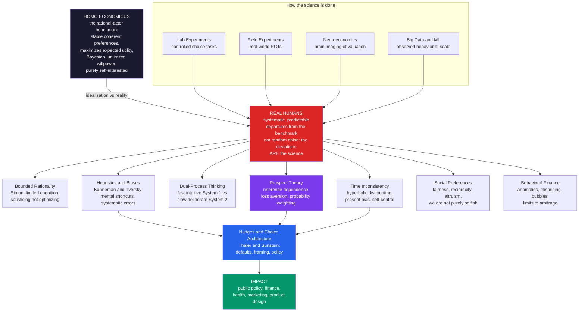

# 🧠 Behavioral Economics — An Overview

> [!abstract] TL;DR
> Behavioral economics integrates the psychology of judgment and decision-making into economics to build models of how people **actually** choose, rather than how an idealized rational agent *should*. Its central move is to replace "Homo economicus" — a coldly rational calculator with stable preferences, unlimited willpower, perfect Bayesian information processing, and pure self-interest — with real, psychologically grounded humans whose decisions depart from that benchmark in **systematic, predictable** ways: loss aversion, present bias, framing effects, fairness concerns, and dozens of heuristics and biases. Documented through lab and field experiments and honored with three Nobel Prizes (Simon, Kahneman, Thaler, Shiller), it has produced prospect theory, the heuristics-and-biases program, and the "nudge" revolution in public policy — making economics more realistic and predictive and reshaping finance, policy, health, and product design.

---

## Intuition

**Analogy:** Classical economics built its cathedral on a fictional creature — **Homo economicus**, a coldly rational calculator who always maximizes utility, never miscounts, never lets emotion sway a decision, and never wavers between what he wants now and what he planned last week. He is to a real person what a frictionless plane is to an actual hillside: a clean idealization that makes the math tractable. The trouble is that the fiction was quietly treated as the truth about human beings.

Real humans are gloriously different. We fear losses far more than we value equivalent gains, so we cling to sinking stocks and demand a premium to part with a coffee mug we owned for five minutes. We procrastinate against our own carefully laid plans, signing up for the gym in January and never going. We are swayed by how a choice is *described* — "90% survival" feels like a different world from "10% mortality," though they are the same fact. And we care about fairness even when caring costs us money, rejecting an unfair split of free cash just to punish the person who offered it. Behavioral economics is what happens when economists finally let real, psychological, error-prone humans back into their models — and discover that the "mistakes" are not random static. They are **systematic, predictable, and often deeply rational** in their own way, given the limits of attention, memory, and computation a real brain actually has.

The crucial reframing is this: the deviations from Homo economicus are not noise to be averaged away. They *are* the science. Because the errors are lawful, they can be measured, modeled, and — in the nudge program — designed around.

---

## How It Works

Behavioral economics is organized as a *dialogue between a benchmark and its violations*. The benchmark is the **rational-actor model** (Homo economicus): standard economics assumes agents have stable, coherent, transitive preferences; maximize **expected utility**; update beliefs by Bayes' rule using all available information; possess unlimited computational power and willpower; and are purely self-interested. This is a powerful and often useful idealization — it yields sharp predictions and underwrites most of microeconomics — but it is descriptively false in ways that matter. The behavioral program takes each assumption in turn, shows where and how real humans depart from it, and builds a more realistic model of the departure.

The departures cluster into a handful of **great themes**, each of which becomes a dedicated note in this vault:

1. **Bounded rationality** (Herbert Simon) — cognition is limited, so people *satisfice* (accept the first "good enough" option) rather than optimize over every alternative. Rationality is bounded by the scissors of cognitive limits and environmental structure.
2. **Heuristics and biases** (Daniel Kahneman and Amos Tversky) — under uncertainty we lean on mental shortcuts (availability, representativeness, anchoring). The shortcuts are usually efficient but produce *systematic* errors — biases — that recur across people and contexts.
3. **Dual-process thinking** — a fast, automatic, intuitive **System 1** and a slow, effortful, deliberate **System 2**. Many biases are System 1 answers that System 2 fails to catch.
4. **Prospect theory** — the crown jewel. Value is defined over *changes* relative to a **reference point**, not final wealth; the value function is S-shaped (concave in gains, convex in losses) and **steeper for losses than gains** (loss aversion); and probabilities are subjectively *weighted* (small probabilities overweighted, near-certainties underweighted).
5. **Time inconsistency** — people discount the future *hyperbolically*, producing **present bias**: a preference for smaller-sooner rewards that reverses their own long-run plans, creating self-control problems and a demand for commitment devices.
6. **Social preferences** — we are not purely selfish. Fairness, reciprocity, and altruism show up robustly in ultimatum and public-goods games; people sacrifice real money to reward kindness and punish unfairness.
7. **Behavioral finance** — markets populated by real humans (and by limits to arbitrage) exhibit anomalies, mispricings, momentum, and bubbles that the efficient-market ideal cannot easily explain.
8. **Nudges and choice architecture** (Richard Thaler and Cass Sunstein) — because the deviations are lawful, the *design of the choice environment* (defaults, framing, ordering, salience) predictably steers behavior. This is the field's bridge from theory to policy.

Underpinning all of this is **method**. Behavioral economics is an empirical, testable science, done through controlled **lab experiments** (choice tasks with real stakes), **field experiments** (real-world randomized controlled trials — a huge modern trend), surveys, **neuroeconomics** (brain imaging of valuation and choice), and increasingly big data and machine learning. The history is one of a fringe idea becoming mainstream: Simon's bounded rationality (Nobel 1978), Kahneman and Tversky's heuristics-and-biases and prospect theory (Kahneman's Nobel 2002; Tversky had died), Shiller's behavioral finance (Nobel 2013), and Thaler's mental accounting and nudges (Nobel 2017) — three Nobel Prizes that mark the field's arrival at the center of economics.



---

## Key Concepts

### Secondary Level

**What behavioral economics is.** Old-school economics assumed people are perfectly logical money-machines who always figure out the best choice and stick to it. Behavioral economics is the discovery that real people don't work that way — and that our "mistakes" follow reliable patterns you can predict and even count on.

**The imaginary perfect chooser.** Economists gave their ideal person a nickname: *Homo economicus*, "economic man." He never overspends, never regrets, never gets tempted by dessert, and always reads the fine print. He is useful for math but he is not a real human. Behavioral economics puts real humans — forgetful, emotional, easily distracted — back into the picture.

**Four everyday quirks the field studies:**

| Quirk | What it means | Everyday example |
|---|---|---|
| Loss aversion | Losing hurts about twice as much as winning feels good | You are angrier about losing \$20 than happy about finding \$20 |
| Present bias | We want good things *now*, even against our own plans | Buying the gym membership but never going |
| Framing | *How* a choice is described changes what we pick | "95% fat-free" sells better than "5% fat," same yogurt |
| Fairness | We care about being treated fairly, even when it costs us | Refusing a lopsided split of free money out of principle |

**Why it matters.** Once you know *how* people's decisions get bent, you can design the world to gently help them — like automatically signing workers up for retirement savings and letting them opt out. That single design choice, called a **nudge**, can double how much a whole country saves, without forcing anyone to do anything.

### Undergraduate Level

#### The rational-actor benchmark and its assumptions

The neoclassical agent is defined by a tight bundle of assumptions worth naming precisely, because behavioral economics attacks them one at a time. Preferences are **complete, transitive, and stable** (you can rank any two options, your rankings don't cycle, and they don't drift with irrelevant context). Choice under risk maximizes **expected utility** — the probability-weighted average of a utility function over final outcomes (von Neumann–Morgenstern). Beliefs are updated by **Bayes' rule** from all available information. Computation and willpower are **unlimited**. And motivation is **purely self-interested**. Each is a good approximation somewhere and a poor one elsewhere; the vault's opening notes (*The Rational Actor Model and Its Limits*) dissect exactly where each breaks.

#### Bounded rationality and satisficing

Herbert Simon's insight (1955) was that optimization is a fiction because it ignores the *cost* of thinking. Real agents have limited attention, memory, and time, so they **satisfice**: they set an aspiration level and take the first option that clears it. Rationality, in Simon's metaphor, is a pair of scissors — one blade is the mind's cognitive limits, the other is the structure of the environment; you cannot understand behavior by looking at either blade alone. This reframes "irrationality" as *adaptive economizing on scarce cognitive resources* and seeds the later **resource-rational** and **ecological-rationality** programs (developed in *Bounded Rationality and Satisficing*).

#### Prospect theory: the crown jewel

Kahneman and Tversky's prospect theory (1979) replaces expected-utility theory with three edits, each a documented empirical fact:

1. **Reference dependence** — outcomes are coded as gains or losses relative to a reference point (often the status quo), not as levels of final wealth. The same \$50,000 is a triumph for someone expecting \$40,000 and a disaster for someone expecting \$60,000.
2. **Diminishing sensitivity and loss aversion** — the value function is concave over gains (risk aversion) and convex over losses (risk seeking), and it is markedly **steeper on the loss side**. Losses loom roughly twice as large as equivalent gains (a coefficient near 2 to 2.25). This single fact explains the **endowment effect**, **status quo bias**, and the **disposition effect** in investing.
3. **Probability weighting** — people transform objective probabilities through a nonlinear weighting function that **overweights small probabilities** (why we buy lottery tickets *and* insurance) and underweights moderate-to-high ones (the **certainty effect**, and the Allais paradox).

#### Intertemporal choice and self-control

Standard theory uses **exponential discounting** (a constant per-period discount rate), which is *dynamically consistent*: your ranking of two future dates never flips as time passes. Humans instead show **hyperbolic** (or quasi-hyperbolic, "beta-delta") discounting, which weights the immediate present especially heavily. The result is **present bias** and preference reversals — you sincerely plan to save/diet/study tomorrow, then repeatedly choose the sooner reward when tomorrow becomes today. This creates a genuine demand for **commitment devices** (locked savings, deadlines, the "Save More Tomorrow" plan). Developed in *Intertemporal Choice and Discounting*.

#### Social preferences and fairness

The purely self-interested assumption fails cleanly in the lab. In the **ultimatum game**, proposers offer, and responders can reject; a self-interested responder should accept any positive amount, yet people routinely reject offers below ~20–30%, paying to punish unfairness. In **public-goods** and **trust** games, cooperation and reciprocity are widespread. These findings — that fairness, reciprocity, and altruism are real arguments in the utility function — connect behavioral economics to **behavioral game theory** (the subject of *Social Preferences, Fairness, and Reciprocity*).

### Graduate Level

#### The normative-versus-descriptive debate: are biases "errors"?

The field's deepest tension is over the *status of rationality*. Kahneman and Tversky's heuristics-and-biases tradition treats systematic deviations from the axioms of expected-utility and Bayesian probability as **errors** — real failures against a normative standard. Gerd Gigerenzer and the **ecological rationality** school push back hard: many "biases" are artifacts of asking people questions in unnatural formats (probabilities rather than natural frequencies), and simple heuristics like *take-the-best* or *recognition* can be **more** accurate than complex optimization in the noisy, small-sample environments humans actually inhabit ("less-is-more" effects, bias-variance tradeoff). The productive middle ground is **resource-rational analysis**: apparent irrationality is optimal *given* the true costs of computation. The unresolved question — is the rational-agent model a good *normative* benchmark for how we *should* decide even if it is descriptively false, or is it the wrong yardstick entirely? — is treated head-on in *The Rational Actor Model and Its Limits*.

#### The "as-if" defense and revealed preference

Milton Friedman's classic methodological defense held that unrealistic assumptions are fine if the model *predicts* well — a billiards player behaves *as if* he solves the physics, without literally computing it. Behavioral economics answers on two fronts: first, the as-if defense fails **predictively** in domains (framing, defaults, intertemporal reversals) where the model gets the *sign* of the effect wrong; second, the entire edifice of **revealed preference** — inferring stable preferences from choices — collapses when choices are *constructed on the spot*, **preference-reversal** dependent, and manipulable by logically irrelevant features of the menu. When preferences are context-dependent, "revealed preference" reveals the context as much as the person.

#### Method as the engine: from the lab to field RCTs and neuroeconomics

What makes behavioral economics a *science* rather than a catalog of quirks is its method. Early evidence came from **controlled lab experiments** with monetary incentives (addressing the "hypothetical choices" critique). The modern frontier is **field experiments** — large randomized controlled trials embedded in real firms, tax agencies, and clinics — which test whether lab effects survive in the wild and at scale (they often shrink). **Neuroeconomics** adds an implementation layer: fMRI and single-unit studies locate value computation in the striatum and ventromedial prefrontal cortex, dopaminergic **reward-prediction-error** signals that look strikingly like reinforcement-learning updates, and dissociable systems for immediate versus delayed reward — giving present bias and loss aversion candidate neural mechanisms (the subject of *Neuroeconomics*). Increasingly, **big data and machine learning** mine choices at population scale. The replication crisis in psychology has also disciplined the field toward pre-registration and larger samples.

#### How this vault is organized

This deep-dive vault centralizes and expands material that appears in scattered form elsewhere in the second brain — Psychology's applied [[Behavioral_Economics_Psychology]] note, Finance's [[Foundations_of_Behavioral_Finance]], and Cognitive Science's [[Judgment_and_Decision_Making]] — into a single coherent arc. The sibling notes ahead are: *The Rational Actor Model and Its Limits*, *Bounded Rationality and Satisficing*, *Heuristics and Biases Overview*, *Dual Process Theory System 1 and 2*, *Prospect Theory*, *Loss Aversion and the Endowment Effect*, *Intertemporal Choice and Discounting*, *Social Preferences Fairness and Reciprocity*, *Nudges and Choice Architecture*, *Behavioral Finance Foundations*, *Neuroeconomics*, and *The Reach and Future of Behavioral Economics*. This overview is the map; those notes are the territory.

---

## Python Demo

```python
import numpy as np
import matplotlib
matplotlib.use("Agg")
import matplotlib.pyplot as plt

# ----------------------------------------------------------------------
# Behavioral Economics: the RATIONAL benchmark vs BEHAVIORAL reality.
#
#  Panel 1  Rational risk-averse agent: CONCAVE expected-utility of wealth.
#  Panel 2  Prospect-theory VALUE function: S-shaped, reference-dependent,
#           and STEEPER for losses than gains (loss aversion).
#  Panel 3  A signature ANOMALY -- FRAMING (Tversky-Kahneman "Asian disease").
#           The SAME outcomes described as gains vs losses flip the preferred
#           choice, something a coherent (description-invariant) rational
#           agent could never do.
# ----------------------------------------------------------------------

# ---- Kahneman & Tversky (1992) cumulative prospect theory parameters ----
alpha = 0.88   # curvature for gains  (diminishing sensitivity)
beta  = 0.88   # curvature for losses
lam   = 2.25   # loss-aversion coefficient (losses loom ~2.25x larger)
gamma = 0.61   # probability-weighting curvature

def pt_value(x):
    """Prospect-theory value of outcome x (gain if >0, loss if <0),
    measured relative to the reference point x = 0."""
    x = np.asarray(x, dtype=float)
    return np.where(x >= 0, x**alpha, -lam * (-x)**beta)

def weight(p):
    """Tversky-Kahneman probability weighting: small probs overweighted."""
    p = np.asarray(p, dtype=float)
    return p**gamma / (p**gamma + (1 - p)**gamma)**(1.0 / gamma)

# ---- Panel 1: a rational RISK-AVERSE agent has CONCAVE utility of wealth.
rho = 0.5                          # power utility u(w)=w^rho, 0<rho<1 => risk averse
wealth = np.linspace(1, 100, 400)
u = wealth**rho
# A 50/50 gamble between 20 and 80 has expected wealth 50, but the utility of
# a CERTAIN 50 exceeds the EXPECTED utility of the gamble (risk aversion).
eu_gamble = 0.5 * (20**rho) + 0.5 * (80**rho)
certainty_equiv = eu_gamble**(1.0 / rho)   # sure wealth giving that utility

# ---- Panel 2: prospect-theory value function over gains & losses.
x = np.linspace(-100, 100, 400)
v = pt_value(x)

# ---- Panel 3: FRAMING anomaly (Tversky & Kahneman 1981, "Asian disease").
# 600 lives at stake. Two logically identical framings:
#   GAIN frame (reference = 0 saved; outcomes are LIVES SAVED, gains)
#     A: 200 saved for sure
#     B: 1/3 prob 600 saved, 2/3 prob 0 saved         (expected value = 200)
#   LOSS frame (reference = 600 saved; outcomes are DEATHS, losses)
#     C: 400 die for sure
#     D: 1/3 prob 0 die, 2/3 prob 600 die             (expected value = 400)
# A/C are the SAME world; B/D are the SAME world. A rational agent must
# choose consistently across frames; prospect theory predicts a REVERSAL.
p_lo, p_hi = 1/3, 2/3
V_A = pt_value(200)                    # sure gain of 200 lives
V_B = weight(p_lo) * pt_value(600)     # gamble, other branch worth 0
V_C = pt_value(-400)                   # sure loss of 400 lives
V_D = weight(p_hi) * pt_value(-600)    # gamble, other branch worth 0

gain_choice = "A (sure)"   if V_A > V_B else "B (gamble)"
loss_choice = "C (sure)"   if V_C > V_D else "D (gamble)"

print("=" * 62)
print("RATIONAL BENCHMARK vs BEHAVIORAL REALITY")
print("=" * 62)
print(f"Risk-averse power utility u(w) = w^{rho}:")
print(f"  utility of a CERTAIN 50           = {50**rho:6.3f}")
print(f"  expected utility of 50/50(20,80)  = {eu_gamble:6.3f}")
print(f"  => certainty equivalent           = {certainty_equiv:6.2f}"
      f"  (< 50: agent pays to avoid risk)")
print("-" * 62)
print("Asian-disease FRAMING problem (logically identical outcomes):")
print(f"  GAIN frame  V(A sure)={V_A:7.2f}  V(B gamble)={V_B:7.2f}"
      f"  -> prefers {gain_choice}")
print(f"  LOSS frame  V(C sure)={V_C:7.2f}  V(D gamble)={V_D:7.2f}"
      f"  -> prefers {loss_choice}")
print("  A rational agent is frame-invariant; PT predicts a REVERSAL.")

# ---------------------------- FIGURE ----------------------------------
fig, (ax1, ax2, ax3) = plt.subplots(1, 3, figsize=(17, 5.4))
fig.suptitle("Behavioral Economics: the Rational Benchmark vs Behavioral Reality",
             fontsize=13, fontweight="bold")

# Panel 1: rational concave utility => risk aversion
ax1.plot(wealth, u, color="#2563eb", lw=2.5, label=r"$u(w)=w^{0.5}$ (concave)")
ax1.plot([20, 80], [20**rho, 80**rho], "o--", color="#dc2626", lw=1.6,
         label="50/50 gamble chord")
ax1.scatter([50], [50**rho], s=80, color="#059669", zorder=5,
            label="utility of a certain 50")
ax1.scatter([50], [eu_gamble], s=80, color="#dc2626", zorder=5,
            label="expected utility of gamble")
ax1.axvline(certainty_equiv, color="#6b7280", ls=":", lw=1.2)
ax1.set_title("Rational agent: concave utility\n= risk aversion", fontsize=10)
ax1.set_xlabel("Wealth"); ax1.set_ylabel("Utility")
ax1.legend(fontsize=7.5, loc="lower right"); ax1.grid(alpha=0.25)

# Panel 2: prospect-theory value function
ax2.plot(x, v, color="#7c3aed", lw=2.6, label="prospect-theory value v(x)")
ax2.plot(x, x, color="#94a3b8", ls="--", lw=1.4, label="rational linear value")
ax2.axhline(0, color="black", lw=0.8); ax2.axvline(0, color="black", lw=0.8)
ax2.plot([50, 50], [0, pt_value(50)], color="#059669", lw=1.2, ls=":")
ax2.plot([-50, -50], [0, pt_value(-50)], color="#dc2626", lw=1.2, ls=":")
ax2.annotate("losses steeper\n(loss aversion, lambda=2.25)",
             xy=(-50, pt_value(-50)), xytext=(-98, -150), fontsize=8,
             color="#dc2626", arrowprops=dict(arrowstyle="->", color="#dc2626"))
ax2.set_title("Behavioral agent: prospect-theory value\n(reference-dependent, S-shaped)",
              fontsize=10)
ax2.set_xlabel("Outcome relative to reference point")
ax2.set_ylabel("Subjective value")
ax2.legend(fontsize=7.5, loc="upper left"); ax2.grid(alpha=0.25)

# Panel 3: framing preference reversal
labels = ["A sure\n(gain)", "B gamble\n(gain)", "C sure\n(loss)", "D gamble\n(loss)"]
vals   = [V_A, V_B, V_C, V_D]
cols   = ["#059669", "#93c5fd", "#dc2626", "#fca5a5"]
ax3.bar(labels, vals, color=cols, edgecolor="black", linewidth=0.8)
ax3.axhline(0, color="black", lw=0.8)
ax3.set_title("Framing anomaly: identical outcomes,\nreversed choice", fontsize=10)
ax3.set_ylabel("Prospect-theory value")
ax3.text(0.5, max(V_A, V_B) + 8, f"gain frame -> {gain_choice}\n(risk-averse)",
         ha="center", fontsize=8, color="#065f46")
ax3.text(2.5, 30, f"loss frame -> {loss_choice}\n(risk-seeking)",
         ha="center", fontsize=8, color="#7f1d1d")
ax3.tick_params(axis="x", labelsize=7.5); ax3.grid(axis="y", alpha=0.25)

plt.tight_layout(rect=[0, 0, 1, 0.94])
plt.savefig("behavioral_economics_overview.png", dpi=110, bbox_inches="tight")
plt.show()
```

**What the demo shows:**

- **Panel 1 (rational agent)** plots a concave power-utility curve. Because the curve bends, the utility of a *certain* 50 sits *above* the expected utility of a 50/50 gamble with the same average payoff — so the agent's **certainty equivalent** is below 50 and he will pay a premium to avoid risk. This is textbook risk aversion, entirely inside the rational model.
- **Panel 2 (behavioral agent)** overlays the prospect-theory **value function** on the rational linear valuation. The curve is kinked at the reference point and visibly **steeper below zero** than above it: the pain of a 50-unit loss exceeds the pleasure of a 50-unit gain by the loss-aversion factor. Value is defined over *changes from a reference point*, not final wealth — a structural departure from the utility curve in Panel 1.
- **Panel 3 (the anomaly)** computes each option's prospect-theory value in the "Asian disease" problem. The **same** medical outcomes, merely re-described as *lives saved* versus *deaths*, flip the preferred choice: risk-averse in the gain frame (prefer the sure A), risk-seeking in the loss frame (prefer the gamble D). A rational, description-invariant agent could never reverse like this — the reversal is the signature of framing.

---

## Real-World Applications

> **Public policy and the "nudge" revolution.** After Thaler and Sunstein's *Nudge* (2008), governments built dedicated **behavioral insights teams** — the UK's "Nudge Unit," the US Social and Behavioral Sciences Team, and dozens of others worldwide. The flagship results: **automatic enrollment** in retirement plans (defaulting workers in, with opt-out) raised participation from roughly 60% to over 90%; **opt-out organ-donation defaults** produce consent rates near 90% versus ~15% in opt-in countries; and reframed tax letters ("9 out of 10 people in your area have already paid") measurably raise compliance. Same freedom, redesigned default, dramatically different outcomes.

> **Finance: bubbles, crashes, and anomalies.** Robert Shiller's behavioral finance (Nobel 2013) explained speculative bubbles — dot-com, housing — as products of herding, extrapolative expectations, and narrative-driven "irrational exuberance" that the efficient-market hypothesis struggles to accommodate. Loss aversion explains the **disposition effect** (investors sell winners too early and ride losers too long), and **limits to arbitrage** explain why mispricings persist rather than being instantly corrected by rational traders.

> **Health and behavior change.** Present bias and friction are the enemies of healthy behavior, so interventions attack them directly: pre-commitment contracts for smoking cessation and exercise, default appointment slots and text reminders that lift vaccination uptake, simplified medication packaging and refills for adherence, and cafeteria placement that puts the healthy option first and at eye level.

> **Marketing, pricing, and product design.** Reference points and anchoring drive perceived value ("was \$200, now \$120"), decoy options steer choice between plans, loss-framed messaging ("don't miss out") outperforms gain framing for many segments, and mental accounting explains why "free shipping" beats an equivalent discount. The same science powers **dark patterns** — pre-ticked upsells, hard-to-cancel subscriptions — which is why regulators increasingly police choice architecture that exploits rather than helps.

> **Development economics.** Field RCTs — the method championed by 2019 Nobel laureates Banerjee, Duflo, and Kremer — routinely embed behavioral levers (reminders, small incentives, defaults, commitment savings accounts) to raise vaccination, savings, and school attendance in low-income settings, turning behavioral economics into a tool for poverty alleviation.

---

## Common Pitfalls

- **Treating "irrational" as "random."** The single most important misreading. Behavioral economics documents *systematic* deviations — everyone anchors, everyone is loss-averse, in the *same* direction. Because the errors are lawful, they are predictable and designable-around. "People are just noisy/unpredictable" is exactly the opposite of the field's finding.

- **Confusing the descriptive and the normative.** Showing that people *do* violate an axiom (descriptive) is not the same as showing they *should not* obey it (normative). Some deviations are genuine errors people would fix if shown; others (à la Gigerenzer) are ecologically smart adaptations to real environments. Collapsing the two turns a subtle debate into sloganeering, in either direction.

- **Believing nudges are a silver bullet.** Real effect sizes are often modest (single-digit percentage points) and frequently *shrink* when lab findings are scaled to field RCTs. Nudges complement — they do not replace — prices, incentives, and regulation. Overselling them invites backlash and crowds out structural reform.

- **Reifying Homo economicus, then reifying its opposite.** The rational-actor model is a *tool*, not a claim about souls; and behavioral economics is not the claim that humans are hopelessly irrational. People are *boundedly* rational — often impressively adaptive given real constraints. Swapping one caricature for another ("humans are just irrational") misses the actual science, which is about *when and how* the two models each apply.

- **Ignoring incentives, stakes, and learning.** Some lab anomalies attenuate with higher stakes, expertise, market discipline, or repetition. A responsible behavioral claim specifies the conditions under which the effect holds and survives — which is precisely why the field moved from hypothetical questionnaires to incentivized lab tasks and then to field experiments.

- **Cherry-picking a bias to explain anything after the fact.** With dozens of documented biases, it is tempting to name one *post hoc* for any outcome ("that's just the endowment effect"). Good behavioral economics makes *ex ante*, falsifiable, quantitative predictions and tests them, rather than retrofitting a bias to whatever happened.

---

## Related Concepts

- [[Behavioral_Economics_Psychology]] — Psychology's applied treatment of the same material (nudges, mental accounting, EAST framework); this vault centralizes and deepens it rather than duplicating it.
- [[Judgment_and_Decision_Making]] — Cognitive Science's account of heuristics, biases, and the reasoning processes that *produce* the economic anomalies catalogued here.
- [[Dual_Process_Theory]] — The System 1 / System 2 architecture underlying many biases; the cognitive machinery behind fast intuitive versus slow deliberate choice.
- [[Cognitive_Biases]] — The systematic reasoning errors (anchoring, availability, representativeness) that behavioral economics imports into models of choice.
- [[Problem_Solving_and_Decision_Making]] — Psychology's companion note on how people actually reason toward decisions, including bounded search and satisficing.
- [[Utility_Theory]] — The neoclassical benchmark that behavioral economics measures departures against; prospect theory is a direct revision of expected-utility theory.
- [[Foundations_of_Behavioral_Finance]] — The finance-specific application: how real investors' biases drive market behavior.
- [[Prospect_Theory_and_Loss_Aversion]] — Finance's treatment of the crown-jewel theory as it applies to portfolios and trading.
- [[Nudges_and_Choice_Architecture]] — The policy-design toolkit built on these behavioral insights.
- [[Market_Anomalies_and_Bubbles]] — Where limits to arbitrage and herding produce the mispricings that the efficient-market ideal cannot explain.
- [[Dominance_and_Rationality]] — Game theory's formal rationality assumptions, the benchmark that behavioral game theory relaxes.
- [[Bargaining_Theory]] — The formal backdrop to ultimatum-game fairness results and social preferences.
- [[Decision_Making_and_Reward_Circuits]] — The neuroscience of valuation and reward-prediction error that neuroeconomics uses to ground loss aversion and present bias.
- [[Probability_Theory]] — The Bayesian/expected-value machinery that Homo economicus is assumed to wield perfectly and that real humans systematically distort.

---

## Review Questions

### Secondary

1. Economists once assumed people are like perfectly logical money-machines ("Homo economicus"). Name two ways a real person you know behaves differently from that ideal, and say whether each difference seems random or fairly predictable.
2. A company automatically signs new employees up to save for retirement but lets anyone opt out, instead of asking them to sign up. Why does this small change make so many more people save, even though no one is forced to do anything?
3. A yogurt labeled "95% fat-free" sells better than the identical one labeled "5% fat." What is this effect called, and why does it work on people even though the two labels describe the same yogurt?

### Undergraduate

1. State the core assumptions of the rational-actor (Homo economicus) model, then explain how prospect theory revises expected-utility theory on three specific points (reference dependence, loss aversion, probability weighting). Use the endowment effect as a worked example of one of them.
2. Distinguish exponential from hyperbolic discounting and explain precisely why the latter produces *preference reversals* and a demand for commitment devices while the former does not. Give a real-world savings or health example.
3. In the ultimatum game, a purely self-interested responder should accept any positive offer, yet people routinely reject offers below about 20–30%. What does this reveal about the standard preference assumptions, and how would you incorporate fairness into a utility function to model it?

### Graduate

1. Evaluate the claim that the rational-actor model remains a good *normative* benchmark even though it is descriptively false. In your answer, contrast the heuristics-and-biases interpretation of anomalies as "errors" with Gigerenzer's ecological-rationality view that they are adaptations, and explain what "resource-rational" analysis contributes to resolving the dispute. What evidence could adjudicate between the two?
2. Friedman's "as-if" methodology holds that unrealistic assumptions are acceptable if predictions are accurate. Construct the strongest behavioral rebuttal, distinguishing cases where the rational model errs only in *mechanism* from cases where it errs in the *sign* of the predicted effect. Why does the phenomenon of constructed, context-dependent preference threaten the entire revealed-preference program?
3. Behavioral economics is increasingly done through large field RCTs rather than lab tasks, and lab effect sizes frequently shrink in the field. Discuss what this pattern implies for the external validity of the classic anomalies, how neuroeconomic evidence (e.g., reward-prediction-error signals, dissociable immediate-versus-delayed valuation systems) should update our confidence in specific behavioral mechanisms, and where the replication crisis leaves the field's core claims.

---

## Sources

- [Kahneman, D. & Tversky, A. (1979). "Prospect Theory: An Analysis of Decision under Risk." *Econometrica* 47(2), 263–291](https://doi.org/10.2307/1914185)
- [Tversky, A. & Kahneman, D. (1981). "The Framing of Decisions and the Psychology of Choice." *Science* 211(4481), 453–458](https://doi.org/10.1126/science.7455683)
- [Simon, H. A. (1955). "A Behavioral Model of Rational Choice." *Quarterly Journal of Economics* 69(1), 99–118](https://doi.org/10.2307/1884852)
- [Kahneman, D. (2011). *Thinking, Fast and Slow*. Farrar, Straus and Giroux](https://us.macmillan.com/books/9780374533557/thinkingfastandslow)
- [Thaler, R. H. (2015). *Misbehaving: The Making of Behavioral Economics*. W. W. Norton](https://wwnorton.com/books/misbehaving)
- [Thaler, R. H. & Sunstein, C. R. (2008). *Nudge: Improving Decisions About Health, Wealth, and Happiness*. Yale University Press](https://yalebooks.yale.edu/book/9780300122237/nudge/)
- [Angner, E. (2020). *A Course in Behavioral Economics* (3rd ed.). Bloomsbury / Red Globe Press](https://www.bloomsbury.com/us/course-in-behavioral-economics-9781352010800/)

---

#behavioral-economics #bounded-rationality #prospect-theory #nudges #interdisciplinary
