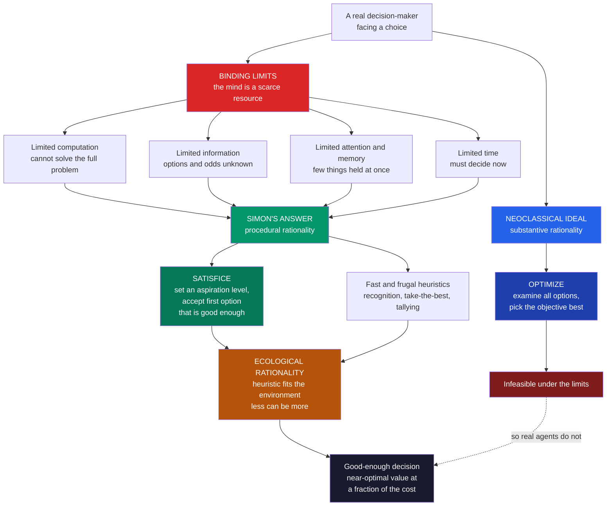

# 🧭 Bounded Rationality and Satisficing

> [!abstract] TL;DR
> **Bounded rationality** is Herbert **Simon's** foundational insight (1950s; Nobel 1978) that real decision-makers face hard limits on **computation, information, attention, and time**, so they cannot perform the unlimited optimization that classical economics assumes. Instead they **satisfice** — set an *aspiration level* ("good enough") and accept the first option that clears it, rather than searching for the objective best. Crucially this is *not* irrationality: given the real costs of search and thought, exhaustive optimization is itself wasteful, so satisficing and simple **heuristics** are *adaptive*. Simon distinguished **procedural** rationality (a reasonable process under constraints) from **substantive** rationality (the optimal outcome), and Gigerenzer's **ecological rationality** shows that fast-and-frugal heuristics matched to their environment can even *outperform* complex optimization. Bounded rationality is the intellectual root of behavioral economics and the heuristics-and-biases program.

---

## Intuition

**Analogy:** Imagine hunting for an apartment by insisting on finding the single *best* one in the city. To be sure you'd found it, you would have to tour every apartment, score each one precisely, and never sign a lease until you'd inspected the last unit — by which time the good ones are long gone and you're exhausted and homeless. Nobody actually does this. Instead you decide in advance roughly what "good enough" means — say, "under my budget, near transit, gets morning light" — and you grab the *first* place that clears that bar. You **satisfice** (satisfy + suffice) rather than **maximize**.

Simon's radical point was that this is not stupidity, laziness, or a failure of willpower. Given that touring apartments costs time you don't have, that you can never see them all, and that you can't hold twenty of them in your head at once, satisficing *is* the intelligent strategy. **Rationality is not unlimited optimization; it is making good decisions within real human constraints.** The "irrational" shortcut is often the smart response to a complicated world — a reframing that quietly rebuilt the foundations of economics.

---

## How It Works

### Core Mechanics

Classical ("neoclassical") economics models the decision-maker as a flawless optimizer: it knows all options, all consequences, and all probabilities, and it computes the single choice that maximizes expected utility (see the sibling note *The_Rational_Actor_Model_and_Its_Limits*). Simon called this **substantive rationality** — judging a choice purely by whether the *outcome* is objectively optimal. His objection was empirical and computational: a real mind cannot do this, because it is bound by four hard limits.

1. **Limited computation.** Most real problems are too big to solve exactly. Chess has more legal positions than there are atoms in the observable universe; a full utility maximization over life's options is not merely hard but *intractable*. "The mind is a scarce resource."
2. **Limited information.** We rarely know the full set of options, their consequences, or the probabilities involved. The next apartment, job offer, or business rival is *unknown until encountered* — search itself is how we learn the option set.
3. **Limited attention and memory.** Working memory holds only a handful of items at once, so we cannot line up and compare hundreds of alternatives side by side.
4. **Limited time.** Decisions have deadlines. You must sign *a* lease this month, hire *a* candidate this quarter, and act before the situation changes — deliberation cannot run forever.

Given these limits, Simon proposed **satisficing** as what agents actually do:

- Set an **aspiration level** — a threshold defining "good enough" on the relevant attributes.
- **Search sequentially**, examining options one at a time.
- **Stop and accept** the *first* option that meets or beats the aspiration; do not keep looking for something better.
- **Adjust the aspiration** over time: if good options are easy to find, raise the bar; if search keeps failing, lower it.

He paired this with **procedural rationality** — the appropriate standard for a bounded agent is not "did you get the optimum?" but "did you use a *reasonable process* given your constraints?" Judge the *procedure*, not just the outcome.

The deep move is the last one: because information, computation, and time are genuinely costly, **exhaustive optimization is itself irrational** — it burns resources chasing marginal improvements that aren't worth the search. Satisficing and heuristics are *adaptive responses*, not defects. Gerd **Gigerenzer** pushed this into **ecological rationality**: a heuristic is rational *if it fits the structure of its environment*, and simple "fast and frugal" rules — the **recognition heuristic**, **take-the-best**, **tallying** — can *beat* complex optimization out of sample (the "less-is-more" effect). The mind, on this view, is an **adaptive toolbox** of specialized heuristics deployed to match the situation. This is a more optimistic reading of mental shortcuts than the biases-focused tradition (see the siblings *Heuristics_and_Biases_Overview* and *Availability_and_Representativeness*), and the tension between them is the Kahneman–Gigerenzer debate.

### Flow / Architecture



---

## Key Concepts

### Secondary Level

**What "bounded" means.** Classic economics imagines a person who can think forever, knows everything, and never gets tired — a perfect calculator. Real people are not like that. We can only think about a few things at once, we don't know all our options, and we have to decide *now*. Our rationality is **bounded** — hemmed in — by these limits.

**Satisficing = satisfy + suffice.** Instead of hunting for the *best* possible choice, we decide what would be *good enough* and pick the first thing that clears that bar. When you pick a restaurant, you don't rank every eatery in the city; you walk until you see one that looks fine and go in.

**Why this is smart, not lazy.** Finding the *absolute best* would cost so much time and effort that it usually isn't worth it. Grabbing a "good enough" option quickly leaves you time and energy for everything else. Simon's big idea: the shortcut is often the *clever* move.

### Undergraduate Level

**The aspiration level and the stopping rule.** Formally, a satisficer fixes an aspiration threshold `a` and searches sequentially, accepting the first option with value `>= a`. If options are drawn independently and a fraction `1 - F(a)` clear the bar each draw, the expected number of options examined before acceptance is roughly `1 / (1 - F(a))`, while the expected value of the accepted option is the mean of the distribution *above* `a`. Raising `a` improves the accepted value but makes search longer and riskier — the core quality-versus-cost trade-off the Python demo makes concrete. Aspiration levels are also *adaptive*: Simon noted that people raise them when good options are plentiful and lower them when they are scarce.

**Procedural vs substantive rationality.** *Substantive* rationality (the neoclassical standard) asks only whether the chosen outcome is objectively optimal. *Procedural* rationality asks whether the agent used a *sensible process* given real constraints. For a bounded agent, procedure is the only standard that can be met — you cannot be blamed for failing to solve an intractable problem, only for using a foolish method to approach it.

**Simon's scissors.** Behavior, Simon argued, is cut by *two blades*: the **cognitive limits of the mind** and the **structure of the environment**. You cannot explain a decision by either blade alone — a heuristic looks smart or dumb only relative to the world it operates in.

**Ecological rationality and the adaptive toolbox.** Gigerenzer's program treats the mind as a collection of simple, specialized rules:
- **Recognition heuristic** — if you recognize one of two options and not the other, judge the recognized one higher (works when recognition correlates with the criterion, e.g., guessing which of two cities is larger).
- **Take-the-best** — decide by the single most valid cue that discriminates between options; ignore all the rest.
- **Tallying** — count cues in favor of each option with equal weight, ignoring how the cues are correlated.

The surprising **less-is-more effect**: by *ignoring* information, these rules avoid chasing noise and can match or beat multiple regression *out of sample*. A heuristic is "ecologically rational" when it exploits a real regularity in its environment.

**The optimal-stopping benchmark.** The math of *when to stop searching* is the **secretary problem**: to maximize the chance of picking the single best of `N` sequentially revealed candidates, observe and reject the first `N/e` (about **37 percent**), then take the next candidate better than all seen so far. This "37 percent rule" gives roughly a `1/e` (about 37 percent) chance of landing the very best — the rational optimizer's benchmark. Strikingly, a dumb fixed-aspiration satisficer captures nearly as much *value* at a fraction of the effort, because "the best" and "good enough" are different objectives.

### Graduate Level

**Why optimization is often the irrational choice.** Once search and computation are *costly*, the optimal policy is generally *not* to optimize the object-level problem but to solve a **meta-level** trade-off between decision quality and decision cost. This is the modern **resource-rational** / bounded-optimality framing (Simon → Good's "Type II rationality" → Russell & Wefald → Griffiths, Lieder & Goodman): the truly rational agent budgets its own thinking, and satisficing/heuristics emerge as *approximately optimal given computational cost*. This reconciles the two camps — a rule can be "biased" at the algorithmic level yet near-optimal once you charge for computation. Note the regress: setting the aspiration level or the stopping rule is *itself* a decision that a fully rational agent would optimize, which would again require unbounded computation — so the aspiration must ultimately be set by another heuristic or by learning, not by optimization.

**The bias–variance reading of less-is-more.** Take-the-best beating regression is a bias–variance story: simple heuristics have high bias but low variance, so in small, noisy samples they generalize better than flexible models that overfit. Ignoring information is a regularizer. This is exactly why heuristics can be *ecologically* superior, not merely cheaper — the same logic underlies shrinkage, the `1/N` portfolio beating mean-variance optimization (DeMiguel, Garlappi & Uppal, 2009), and much of statistical learning.

**Implications for economics.** Bounded rationality reshapes modeling by replacing perfect optimization with realistic procedures: **rule-of-thumb consumers** (Campbell & Mankiw), **near-rational** and **sparse-max** models (Akerlof–Yellen; Gabaix's inattention), and **behavioral game theory** where players do finite-depth strategic reasoning — **level-k** and cognitive-hierarchy models — instead of computing full Nash equilibria. Each swaps the unbounded optimizer for an agent using a tractable procedure, and each grounds out in Simon's original challenge.

**The Kahneman–Gigerenzer debate.** The heuristics-and-biases tradition (see *Heuristics_and_Biases_Overview*) reads shortcuts primarily as sources of *systematic error* against a coherence benchmark; ecological rationality reads the *same* shortcuts as *adaptive tools* whose performance must be judged against the environment, arguing that many "fallacies" dissolve under natural-frequency framings. The disagreement is fundamentally about the correct *normative standard* for a bounded, evolved agent — logic-and-probability coherence versus environmental fit — and is best held as a productive tension, not a winner.

**Simon and the birth of AI.** Simon co-founded artificial intelligence precisely because bounded rationality *is* a theory of computation. The Logic Theorist and General Problem Solver (Newell & Simon) implemented **heuristic search** — pruning an intractable problem space with rules of thumb rather than exhaustive enumeration — and chess programs adopted satisficing cutoffs. The link between "boundedly rational human" and "heuristic-guided search algorithm" is not a metaphor; see [[Symbolic_AI_and_Physical_Symbol_Systems]] and the Physical Symbol System Hypothesis.

---

## Python Demo

```python
# ---------------------------------------------------------------
# SATISFICING vs OPTIMIZING: the efficiency of "good enough"
#
# Setup (an apartment / secretary style search):
#   N options are revealed ONE AT A TIME, each with an unknown
#   quality ~ Uniform(0, 1). Higher is better. You must accept
#   something. We compare:
#
#   (1) OPTIMIZER  -- must examine ALL N options, then take the max.
#                     Highest quality, but pays the full search cost N.
#   (2) SATISFICER -- fixes an aspiration bar 'a' and accepts the
#                     FIRST option with quality >= a (else the last).
#                     Lower quality, but tiny search cost.
#   (3) 37% RULE   -- the optimal-stopping benchmark (secretary
#                     problem): reject the first r*N, then take the
#                     next option better than everything seen so far.
#
# We show the satisficer captures ~90% of the optimizer's VALUE at
# a small fraction of the COST, trace the aspiration-level trade-off,
# and locate the classic ~37% optimal-look fraction.
# ---------------------------------------------------------------
import numpy as np
import matplotlib
matplotlib.use("Agg")            # headless-safe backend
import matplotlib.pyplot as plt

rng = np.random.default_rng(7)

N = 100          # options in the "market"
TRIALS = 20000   # Monte Carlo trials
Q = rng.random((TRIALS, N))      # TRIALS x N qualities ~ U(0,1)
rows = np.arange(TRIALS)

# --- OPTIMIZER: see everything, take the best --------------------
opt_quality = Q.max(axis=1)                 # per-trial best value
OPT_Q = opt_quality.mean()                  # ~ N/(N+1) ~ 0.990
OPT_C = float(N)                            # examines all N

# --- SATISFICER: accept first option clearing aspiration 'a' -----
def satisfice(Q, a):
    mask      = Q >= a
    found     = mask.any(axis=1)
    first     = mask.argmax(axis=1)         # first True, or 0 if none
    quality   = np.where(found, Q[rows, first], Q[:, -1])
    examined  = np.where(found, first + 1, Q.shape[1])
    return quality.mean(), examined.mean()

aspirations = np.linspace(0.0, 0.98, 40)
sat_q = np.array([satisfice(Q, a)[0] for a in aspirations])
sat_c = np.array([satisfice(Q, a)[1] for a in aspirations])

# --- 37% RULE: optimal stopping for picking THE single best ------
def secretary(Q, r):
    T, n = Q.shape
    k = max(1, int(np.floor(r * n)))        # size of the "look" phase
    look_best = Q[:, :k].max(axis=1)        # threshold from look phase
    rest      = Q[:, k:]
    beat      = rest > look_best[:, None]
    any_beat  = beat.any(axis=1)
    first_rel = beat.argmax(axis=1)
    acc_idx   = np.where(any_beat, k + first_rel, n - 1)
    accepted  = Q[rows, acc_idx]
    examined  = acc_idx + 1
    success   = accepted >= Q.max(axis=1)   # did we get the BEST?
    return accepted.mean(), examined.mean(), success.mean()

r_grid = np.linspace(0.01, 0.95, 40)
sec = np.array([secretary(Q, r) for r in r_grid])   # cols: quality, cost, P(best)
r_star = r_grid[np.argmax(sec[:, 2])]               # empirical optimum ~ 1/e

# Reference strategies for the summary panel
INV_E = 1.0 / np.e
sq90, sc90 = satisfice(Q, 0.90)
sq75, sc75 = satisfice(Q, 0.75)
sec_q, sec_c, sec_p = secretary(Q, INV_E)

print("=" * 64)
print("SATISFICING vs OPTIMIZING   (N = %d options, %d trials)" % (N, TRIALS))
print("=" * 64)
print(f"  OPTIMIZER    quality {OPT_Q:.3f}   cost {OPT_C:6.1f}   (see all N)")
print(f"  37% RULE     quality {sec_q:.3f}   cost {sec_c:6.1f}   P(best) {sec_p:.2f}")
print(f"  SATISFICE .90 quality {sq90:.3f}  cost {sc90:6.1f}  "
      f"= {100*sq90/OPT_Q:.0f}% of value at {100*sc90/OPT_C:.0f}% of cost")
print(f"  SATISFICE .75 quality {sq75:.3f}  cost {sc75:6.1f}  "
      f"= {100*sq75/OPT_Q:.0f}% of value at {100*sc75/OPT_C:.0f}% of cost")
print(f"  Empirical optimal look-fraction r* = {r_star:.3f}  (1/e = {INV_E:.3f})")

# ===============================================================
# FIGURE
# ===============================================================
fig, ax = plt.subplots(2, 2, figsize=(15, 10))
fig.suptitle("Bounded Rationality: satisficing captures most of the value "
             "at a fraction of the search cost",
             fontsize=13, fontweight="bold")

# ---- Panel 1: aspiration level -> quality (up) and cost (up) ----
axA = ax[0, 0]
axA.plot(aspirations, sat_q, color="#059669", lw=2.5, label="mean quality")
axA.axhline(OPT_Q, color="#2563eb", ls="--", lw=1.5, label="optimizer quality")
axA.set_xlabel("Aspiration level a")
axA.set_ylabel("Mean quality of accepted option", color="#059669")
axA.set_title("Raising the aspiration bar\nbuys quality... but costs search")
axB = axA.twinx()
axB.plot(aspirations, sat_c, color="#dc2626", lw=2.5, ls=":")
axB.set_ylabel("Mean options examined (search cost)", color="#dc2626")
axA.legend(loc="upper left", fontsize=8)
axA.grid(alpha=0.2)

# ---- Panel 2: the quality-vs-cost trade-off (Pareto view) ------
axC = ax[0, 1]
sc = axC.scatter(sat_c, sat_q, c=aspirations, cmap="viridis", s=35, zorder=3)
axC.plot(sat_c, sat_q, color="#6b7280", lw=1, alpha=0.5, zorder=2)
axC.scatter([OPT_C], [OPT_Q], color="#2563eb", s=140, marker="*",
            zorder=4, label="OPTIMIZER (see all N)")
axC.scatter([sc90], [sq90], color="#dc2626", s=90, marker="D",
            zorder=4, label="satisfice a = 0.90")
axC.annotate("~96% of the value\nat ~10% of the cost",
             xy=(sc90, sq90), xytext=(sc90 + 18, sq90 - 0.10),
             fontsize=9, color="#7f1d1d",
             arrowprops=dict(arrowstyle="->", color="#7f1d1d"))
axC.set_xlabel("Search cost (options examined)")
axC.set_ylabel("Quality achieved")
axC.set_title("Diminishing returns to search\n(colour = aspiration level)")
fig.colorbar(sc, ax=axC, label="aspiration a")
axC.legend(loc="lower right", fontsize=8)
axC.grid(alpha=0.2)

# ---- Panel 3: strategy comparison -----------------------------
axD = ax[1, 0]
names  = ["Optimizer\n(all N)", "37% rule", "Satisfice\na=0.90", "Satisfice\na=0.75"]
quals  = [OPT_Q, sec_q, sq90, sq75]
costs  = [OPT_C, sec_c, sc90, sc75]
colors = ["#2563eb", "#7c3aed", "#059669", "#f59e0b"]
bars = axD.bar(names, quals, color=colors, edgecolor="black", linewidth=0.8)
axD.set_ylim(0, 1.08)
axD.set_ylabel("Mean quality of accepted option")
axD.set_title("Same near-optimal quality,\nwildly different search cost")
for b, q, c in zip(bars, quals, costs):
    axD.text(b.get_x() + b.get_width() / 2, q + 0.015,
             f"q={q:.2f}", ha="center", fontsize=9, fontweight="bold")
    axD.text(b.get_x() + b.get_width() / 2, 0.05,
             f"cost\n{c:.0f}", ha="center", fontsize=8.5, color="white",
             fontweight="bold")
axD.grid(axis="y", alpha=0.2)

# ---- Panel 4: the 37% optimal-stopping rule -------------------
axE = ax[1, 1]
axE.plot(r_grid, sec[:, 2], color="#7c3aed", lw=2.5,
         label="P(pick the single best)")
axE.axvline(INV_E, color="#dc2626", ls="--", lw=1.6,
            label=f"1/e look fraction ({INV_E:.2f})")
axE.axhline(INV_E, color="#9ca3af", ls=":", lw=1.2)
axE.scatter([r_star], [sec[np.argmax(sec[:, 2]), 2]], color="#dc2626",
            s=90, zorder=5)
axE.set_xlabel("Fraction of options 'looked at' then rejected, r")
axE.set_ylabel("Probability of choosing THE best")
axE.set_title("Optimal-stopping benchmark\npeaks near r = 1/e ~ 0.37")
axE.legend(loc="lower center", fontsize=8)
axE.grid(alpha=0.2)

plt.tight_layout(rect=[0, 0, 1, 0.95])
plt.savefig("bounded_rationality_satisficing.png", dpi=110, bbox_inches="tight")
plt.show()
```

**What the demo shows:**

- **Panel 1 (aspiration trade-off):** as the aspiration bar `a` rises, the *quality* of the accepted option climbs toward the optimizer's line — but the *search cost* (options examined) rises much faster and eventually explodes, because clearing a high bar takes many draws. Quality has diminishing returns; cost does not.
- **Panel 2 (the Pareto curve):** plotting quality against cost reveals a sharply concave frontier. A satisficer with `a = 0.90` sits near the "knee": it reaches about **96 percent of the optimizer's value** while examining only about **10 percent** as many options. Squeezing out the last few percent of value requires examining the entire market — the very definition of a bad deal once search is costly.
- **Panel 3 (strategy comparison):** the optimizer, the 37 percent rule, and both satisficers all achieve broadly similar *quality*, yet their *costs* differ by an order of magnitude. "Good enough" is not much worse than "best," and it is enormously cheaper.
- **Panel 4 (the 37 percent rule):** the probability of selecting the *single best* option peaks when you reject the first `1/e` (about 37 percent) and then take the next record-breaker — the rational optimal-stopping benchmark. But note its ceiling is only about 37 percent success, and it still often examines most of the list. A simple fixed-aspiration satisficer sacrifices the goal of getting *literally #1* and, in exchange, gets a very good option almost every time for almost no effort — which is usually what a bounded agent actually wants.

---

## Real-World Applications

> **Life's big searches (jobs, homes, mates):** People do not interview at every firm, tour every apartment, or date every candidate. They form an aspiration ("a role that pays above X and lets me learn Y") and accept the first option that clears it, adjusting the bar as the market reveals itself. Optimal-stopping models of mate search and job search are direct formalizations of Simon's satisficing, and they explain why "keep looking for someone better" is often a losing strategy.

> **Artificial intelligence and heuristic search:** Simon co-founded AI, and the connection is literal. Chess engines and planners do not enumerate the full game tree; they use **heuristic evaluation** and cutoffs to satisfice within a time budget. "Satisficing planners" in automated planning explicitly seek *any* plan meeting a quality bound rather than the provably optimal plan. See [[Symbolic_AI_and_Physical_Symbol_Systems]]. Reinforcement learning's exploration-exploitation trade-off ([[Reinforcement_Learning]]) is the same problem: an aspiration-like threshold decides when to stop exploring and exploit.

> **Organizations and management:** Simon's *Administrative Behavior* argued that firms are boundedly rational: they run on **standard operating procedures**, satisficing targets ("hit the sales quota," not "maximize sales"), and routines that economize on attention. This became the behavioral theory of the firm (Cyert & March) and reshaped how economics models corporate decision-making.

> **Fast-and-frugal decision trees in medicine:** Emergency departments use short cue-based trees (Green & Mehr's heart-attack triage rule) that ask two or three yes/no questions and ignore the rest of the chart. These ecologically rational heuristics classify patients as accurately as — sometimes better than — full logistic-regression models, while being fast enough to use at the bedside and transparent enough for a clinician to trust.

> **Portfolio choice and the 1/N rule:** Splitting money equally across N assets (a tallying heuristic) frequently *outperforms* mean-variance "optimization" out of sample (DeMiguel, Garlappi & Uppal, 2009), because the optimizer overfits noisy estimates of returns and covariances. A textbook case of "less is more": ignoring information beats optimizing on bad information.

---

## Common Pitfalls

- **Equating satisficing with laziness or irrationality.** Satisficing is a *deliberate response to real costs*, not a cop-out. Under time, information, and computation constraints, exhaustive optimization is the wasteful choice. Judge the *process* (procedural rationality), not just the outcome.
- **Ignoring the meta-problem of setting the aspiration.** Set the bar too high and search never ends (you tour the whole city and stay homeless); set it too low and you accept mediocrity. The aspiration level is itself a decision — and it cannot be perfectly optimized without falling back into unbounded computation, so it must come from learning or a further heuristic.
- **Assuming optimization is always superior.** More information and more parameters can *hurt* out of sample (overfitting). The less-is-more effect means a simple heuristic often generalizes better than a fine-tuned optimizer, especially with small, noisy samples. "Optimal on the training data" is not "best in the world."
- **Treating heuristics as universally good (or universally bad).** Ecological rationality is *environment-relative*: the recognition heuristic works only when recognition tracks the criterion; take-the-best works only when cues are skewed in validity. A heuristic that is brilliant in one environment is foolish in another — Simon's two-bladed scissors. Do not over-generalize from either the biases literature or the fast-and-frugal literature.
- **Confusing the secretary problem's objective with satisficing.** The 37 percent rule maximizes the probability of getting the *single best* candidate — a rank-based, all-or-nothing goal. Satisficing maximizes *expected value net of search cost*, a different objective that a simple aspiration rule serves well. Applying the 37 percent rule when you actually just want a good-enough outcome overspends on search.

---

## Related Concepts

- [[Judgment_and_Decision_Making]] — the cognitive-science hub that situates bounded rationality alongside prospect theory, ecological rationality, and naturalistic decision making; read it for how satisficing fits the broader normative-vs-descriptive debate.
- [[Problem_Solving_and_Decision_Making]] — the psychology-vault treatment of heuristics, means-end analysis, and dual-process thinking that satisficing draws on and feeds.
- [[Symbolic_AI_and_Physical_Symbol_Systems]] — Simon and Newell's heuristic search and the Physical Symbol System Hypothesis; the AI incarnation of bounded rationality as tractable search.
- [[Consumer_Optimization]] — the neoclassical benchmark bounded rationality departs from: the fully informed agent maximizing utility subject to a budget constraint.
- [[Utility_Theory]] — the expected-utility framework whose "unlimited optimizer" assumption Simon challenged; note its own behavioral-critique section.
- [[Scarcity_and_Opportunity_Cost]] — Simon's twist: *attention and computation* are themselves scarce resources, so thinking has an opportunity cost that makes satisficing rational.
- [[Asymmetric_Information]] — the microeconomics of decisions under incomplete information; bounded rationality goes further, arguing agents cannot fully process even the information they have.
- [[Cognitive_Biases]] — the systematic errors heuristics can produce; the "biases" reading that ecological rationality partly pushes back against.
- [[Behavioral_Economics_Psychology]] — how satisficing, loss aversion, and heuristics became the foundation of behavioral economics and nudge theory.
- [[Reinforcement_Learning]] — the exploration-vs-exploitation trade-off is a formal cousin of "when to stop searching and accept a good-enough option."

---

## Review Questions

### Secondary

1. In your own words, what does it mean to **satisfice** rather than **maximize**? Give an everyday example (picking a movie, a restaurant, or a seat on a train) where you satisficed, and explain what your "good enough" bar was.
2. Name the four kinds of limits that make human rationality "bounded." For a real decision you made recently, which limit was the most binding?
3. Why did Simon argue that grabbing a "good enough" option can be *smarter* than searching for the very best? What are you saving by not searching further?

### Undergraduate

1. Explain the difference between **procedural** and **substantive** rationality. Why is procedural rationality the only standard a boundedly rational agent can realistically be held to, and how does that change how we should evaluate a decision?
2. A satisficer raises their aspiration level from 0.7 to 0.9 while searching options drawn uniformly on [0, 1]. Qualitatively, what happens to (a) the expected quality of the accepted option and (b) the expected number of options examined? Use the demo's quality-versus-cost frontier to argue where a sensible aspiration lies.
3. What is the **less-is-more effect**, and how can a simple heuristic like take-the-best *outperform* a full regression model out of sample? Frame your answer in terms of bias and variance.

### Graduate

1. Bounded rationality says exhaustive optimization is itself irrational once computation is costly — yet setting the aspiration level or stopping rule is *also* a decision that a fully rational agent would optimize. Explain this regress and how **resource-rational** / bounded-optimality accounts try to escape it. Does the escape fully succeed?
2. Reconstruct the strongest versions of the Kahneman and Gigerenzer positions on whether human heuristics are "biases" or "adaptive tools." What is the underlying disagreement about the correct *normative standard*, and what kind of empirical result would move you toward one side?
3. Pick one economic modeling device that replaces the unbounded optimizer — rule-of-thumb consumers, sparse-max/inattention, or level-k reasoning in games. Explain precisely which of Simon's four limits it operationalizes, and one prediction it makes that full-optimization models cannot.

---

## Sources

- [Simon, H. A. (1955). "A Behavioral Model of Rational Choice." *Quarterly Journal of Economics* 69(1), 99–118](https://doi.org/10.2307/1884852)
- [Simon, H. A. (1956). "Rational Choice and the Structure of the Environment." *Psychological Review* 63(2), 129–138](https://doi.org/10.1037/h0042769)
- [Simon, H. A. (1979). "Rational Decision Making in Business Organizations." *American Economic Review* 69(4), 493–513 (Nobel Memorial Lecture)](https://www.nobelprize.org/prizes/economic-sciences/1978/simon/lecture/)
- [Gigerenzer, G. & Goldstein, D. G. (1996). "Reasoning the Fast and Frugal Way: Models of Bounded Rationality." *Psychological Review* 103(4), 650–669](https://doi.org/10.1037/0033-295X.103.4.650)
- [Gigerenzer, G., Todd, P. M. & the ABC Research Group (1999). *Simple Heuristics That Make Us Smart*. Oxford University Press](https://global.oup.com/academic/product/simple-heuristics-that-make-us-smart-9780195143812)
- [DeMiguel, V., Garlappi, L. & Uppal, R. (2009). "Optimal Versus Naive Diversification: How Inefficient Is the 1/N Portfolio Strategy?" *Review of Financial Studies* 22(5), 1915–1953](https://doi.org/10.1093/rfs/hhm075)

---

#behavioral-economics #bounded-rationality #satisficing #herbert-simon #heuristics
