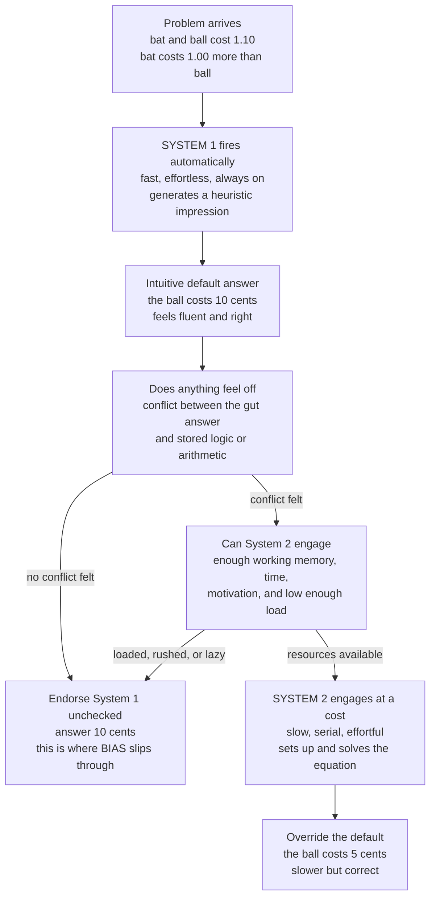

# 🧠 Dual-Process Theory: System 1 and System 2

> [!abstract] TL;DR
> **Dual-process theory** — the fast, automatic, intuitive **System 1** versus the slow, effortful, deliberate **System 2** — is the cognitive architecture beneath behavioral economics. System 1 continuously throws up heuristic impressions that a *lazy* System 2 usually endorses without checking, so **biases arise precisely when System 1 is wrong and System 2 fails to override** — especially under cognitive load, time pressure, or fatigue. It explains why cognitive illusions persist, why reflection (measured by the Cognitive Reflection Test) reduces errors, and why the best interventions either engage System 2 or, more powerfully, redesign the environment to work *with* System 1.

---

## Intuition

**Analogy: the blurter who runs the show, and the auditor who rarely audits.**

A bat and a ball cost **1.10** together. The bat costs **1.00 more** than the ball. So how much is the ball?

If **"10 cents"** leapt into your head, you just met your **System 1** — the fast, automatic, intuitive mind that answers *before* you think. (The ball is actually **5 cents**: 0.05 plus 1.05 is 1.10, and 1.05 is exactly 1.00 more than 0.05. If the ball were 10 cents, the bat would be 1.10 and the total 1.20.)

System 1 is the effortless autopilot that reads a face's emotion, completes "2 plus 2," parses your native language, and jumps to conclusions — all without any feeling of work. **System 2** is the slow, effortful, deliberate mind you would have to *engage* to catch the error: the one that actually sets up the equation. Here is the uncomfortable part. Most of the time System 1 runs the show, and System 2 lazily rubber-stamps whatever System 1 suggests. The bat-and-ball answer *felt* right, System 2 never bothered to audit it, and that is exactly how biases slip through in even very intelligent people.

---

## How It Works

### Core Mechanics

Dual-process theory (Stanovich and West coined the "System 1 / System 2" labels; Kahneman popularized them in *Thinking, Fast and Slow*) claims that judgment is best explained by two modes of processing with sharply different signatures.

1. **System 1 — fast thinking.** Automatic, fast, parallel, effortless, emotional, and largely unconscious. It is *always on*. It generates impressions, feelings, intuitions, and quick answers; it handles pattern recognition, well-learned skills, and the classic **heuristics** (availability, representativeness, anchoring). It is the source of both our brilliance — instant expertise — and our systematic biases. Its characteristic failure is **attribute substitution**: when asked a hard question, it quietly answers an easier one instead.

2. **System 2 — slow thinking.** Deliberate, slow, serial, effortful, logical, and conscious. It is engaged for complex computation, logical reasoning, self-control, and *monitoring* System 1. But it has **limited capacity** (attention and working memory), it tires, and it is fundamentally **lazy** — it defaults to endorsing System 1 rather than checking it. It is the supervisor that usually fails to supervise.

3. **The division of labor — the lazy controller.** System 1 continuously proposes; System 2 usually *adopts* the proposal with little modification. System 2 only steps in when a conflict is salient, the stakes are high, or you are explicitly prompted and able to reflect. In everyday life, the overwhelming majority of decisions are effectively System 1 decisions that System 2 merely ratified.

4. **How biases arise — the dual-process account of error.** A bias occurs when System 1's heuristic answer is *wrong* **and** System 2 fails to catch and override it. That failure has predictable causes: laziness, cognitive load, time pressure, fatigue, or simply lacking the relevant knowledge. The bat-and-ball problem is the canonical demonstration — System 1 says 10 cents; only an engaged System 2 computes 5 cents.

5. **The Cognitive Reflection Test (CRT).** Frederick's three-item test (bat-and-ball; the lily pads that double daily; the widget machines) measures the *disposition* to override an intuitive-but-wrong answer with reflection. Each item dangles a fluent lure and rewards suppressing it. CRT scores predict susceptibility to a wide range of biases and correlate with — but are not identical to — numeracy and intelligence.

6. **Cognitive load and depletion.** When System 2 is busy — distracted, tired, time-pressured, or holding digits in memory — people rely *more* on System 1: more intuitive, more biased, more impulsive, worse at self-control. Deliberation is fragile. (The stronger "ego depletion" claim — that self-control drains like a muscle — has had serious replication problems, so treat it as contested rather than settled.)

This is a *metaphor*, not neuroanatomy: there is no single "System 1 region." Gigerenzer's important counterpoint is that System 1 intuition is often **ecologically rational** — fast-and-frugal heuristics that are well-calibrated to real environments — not an inferior version of logic. The two "systems" are useful labels for functional signatures, to be wielded with care.

### Flow / Architecture



---

## Key Concepts

### Secondary (intuitive level)

- Your mind answers in two ways: a **fast, gut way** (System 1) and a **slow, careful way** (System 2).
- The fast way is right almost all the time and costs no effort — but on trick questions it blurts an answer that *feels* right and is wrong.
- The slow way can catch the mistake, but only if you *notice* something is off and *bother* to think it through.
- **Bat-and-ball:** the ball is 5 cents, not 10. "10 cents" is System 1; "5 cents" needs System 2.
- Being smart is not enough — you also have to be the kind of person who *stops and checks*.

### Undergraduate (mechanistic level)

- **System 1 (typical features):** fast, automatic, parallel, effortless, emotional, always on; produces heuristics and overlearned associations; failure mode is **attribute substitution** (answering an easier question).
- **System 2 (typical features):** slow, deliberate, serial, effortful, logical, conscious; limited by working memory and attention; the **lazy controller** that usually endorses rather than checks.
- **Division of labor:** System 1 proposes continuously; System 2 disposes rarely — only on salient conflict, high stakes, or explicit prompting.
- **Dual-process account of bias:** error = (System 1 wrong) AND (System 2 fails to override). The override fails under load, haste, fatigue, or missing knowledge.
- **CRT (Frederick, 2005):** short test of the *reflective disposition*; predicts bias susceptibility beyond raw IQ.
- **Cognitive load:** loading working memory shifts behavior toward System 1 — more biased, more impulsive, worse self-control.

### Graduate (theoretical and critical level)

- **Metaphor, not modules.** "System 1 / System 2" reifies a *list* of co-varying properties (fast/slow, automatic/controlled, unconscious/conscious). Critics (Keren and Schul; Kruglanski and Gigerenzer) note these features dissociate, and that a single continuous process varying in effort can reproduce much of the data. The disciplined defense (Evans and Stanovich, 2013) keeps only **working-memory-dependent cognitive decoupling** as defining and demotes speed and consciousness to correlates — which is why cognitive scientists increasingly say "Type 1 / Type 2."
- **Reflection is not just ability.** Stanovich splits System 2 into the **algorithmic mind** (raw computational capacity, ~fluid IQ) and the **reflective mind** (the *tendency* to engage). This dissociation explains **dysrationalia**: high-IQ people who still fail CRT because they lack the disposition to override, and it is why CRT is not redundant with IQ.
- **Conflict detection versus override.** De Neys's "logical intuitions" work shows biased responders often *register* the conflict (slower, less confident, autonomic arousal) yet still fail to inhibit the default. The bottleneck is frequently *override*, not detection — pushing some genuine logical competence *down* into System 1 and blurring "intuition equals error."
- **Ecological rationality (Gigerenzer).** System 1 heuristics like recognition and take-the-best can *outperform* effortful models in uncertain, small-sample environments. "Intuition" is not a degraded System 2; it is a different, sometimes superior, tool. The normative label "bias" presupposes the deliberate answer is always the right benchmark, which is contestable.
- **Depletion caveat.** The ego-depletion literature that once anchored the "System 2 tires" claim has failed large pre-registered replications, so the *fatigue* mechanism is best stated cautiously; the *load* mechanism (concurrent demand shifting behavior toward System 1) is far more robust.
- **Why it matters for policy.** Dual-process thinking tells you *why* biases persist and *when* they spike (load, haste), which motivates two intervention families: **debiasing** by engaging System 2 (checklists, "consider the opposite," slowing down) — modest and effortful — or **choice architecture** that works with System 1 (defaults, framing, salience) — cheaper and often stronger. This foreshadows the sibling notes *Nudges_and_Choice_Architecture* and *Present_Bias_and_Self_Control*, and rests on *Heuristics_and_Biases_Overview*, *Bounded_Rationality_and_Satisficing*, and *Anchoring_and_Adjustment*.

---

## Python Demo

```python
# Models the System-1 / System-2 interaction on CRT-style conflict items.
# System 1 answers instantly with a heuristic (WRONG on conflict items,
# RIGHT on no-conflict items). System 2 can OVERRIDE and get it right, but
# only if it ENGAGES -- an event whose probability rises with motivation,
# problem salience, and individual reflectiveness, and FALLS with cognitive
# load. Engaging also costs TIME (the speed-accuracy trade-off).
import numpy as np
import matplotlib
matplotlib.use("Agg")
import matplotlib.pyplot as plt

rng = np.random.default_rng(42)
N = 40000                      # simulated reasoners per condition
T_S1, T_S2 = 0.6, 3.0          # response times: System 1 fast, System 2 slow
P_S2_CORRECT = 0.90            # engaged System 2 is usually (not perfectly) right

def p_engage(load, motivation, salience, reflect):
    """Logistic probability that System 2 engages (the lazy controller wakes up)."""
    z = 2.2 * reflect + 1.8 * motivation + 1.6 * salience - 3.0 * load - 0.4
    return 1.0 / (1.0 + np.exp(-z))

def simulate(load, motivation=0.5, salience=0.5, conflict=True):
    reflect = rng.beta(2, 2, N)                    # reflective disposition per person
    engaged = rng.random(N) < p_engage(load, motivation, salience, reflect)
    s1_correct = (not conflict)                    # System 1 wrong on conflict items
    s2_correct = rng.random(N) < P_S2_CORRECT      # System 2 usually correct if engaged
    correct = np.where(engaged, s2_correct, s1_correct)
    rt = np.where(engaged, T_S2, T_S1)             # engaging costs time
    return correct.mean(), rt.mean(), engaged.mean()

# (A) Cognitive load sweep: how load erodes accuracy on conflict items ----------
loads = np.linspace(0.0, 1.0, 41)
acc_conf, acc_noconf, eng = [], [], []
for L in loads:
    ac, _, pe = simulate(L, conflict=True)
    an, _, _  = simulate(L, conflict=False)
    acc_conf.append(ac); acc_noconf.append(an); eng.append(pe)
acc_conf, acc_noconf, eng = map(np.array, (acc_conf, acc_noconf, eng))

# (B) Speed-accuracy trade-off: raising motivation buys accuracy with time ------
mots = np.linspace(0.0, 1.0, 41)
rt_curve, acc_curve = [], []
for m in mots:
    ac, rt, _ = simulate(0.4, motivation=m, conflict=True)
    rt_curve.append(rt); acc_curve.append(ac)
rt_curve, acc_curve = np.array(rt_curve), np.array(acc_curve)

print("Conflict accuracy at load=0.0 :", round(float(acc_conf[0]), 3))
print("Conflict accuracy at load=1.0 :", round(float(acc_conf[-1]), 3))
print("No-conflict accuracy (load 0) :", round(float(acc_noconf[0]), 3))
print("System 2 engagement, load 0.0 :", round(float(eng[0]), 3))
print("System 2 engagement, load 1.0 :", round(float(eng[-1]), 3))

fig, (axA, axB) = plt.subplots(1, 2, figsize=(13, 5.2))

axA.plot(loads, acc_conf,   color="#dc2626", lw=2.6,
         label="Conflict item (System 1 lure is WRONG)")
axA.plot(loads, acc_noconf, color="#059669", lw=2.6,
         label="No-conflict item (System 1 is RIGHT)")
axA.plot(loads, eng, color="#2563eb", lw=1.8, ls="--",
         label="P(System 2 engages)")
axA.axhline(0.5, color="#6b7280", ls=":", lw=1, label="Chance")
axA.set_xlabel("Cognitive load  (0 = free mind, 1 = fully loaded)")
axA.set_ylabel("Accuracy / engagement probability")
axA.set_title("Load starves System 2 -> intuition (bias) takes over")
axA.set_ylim(-0.02, 1.02); axA.legend(fontsize=8.5); axA.grid(alpha=0.3)

axB.plot(rt_curve, acc_curve, color="#7c3aed", lw=2.6, marker="o", ms=3)
axB.annotate("low motivation\nfast + intuitive (wrong)",
             xy=(rt_curve[0], acc_curve[0]), xytext=(0.9, 0.15),
             fontsize=8.5, arrowprops=dict(arrowstyle="->", color="#7c3aed"))
axB.annotate("high motivation\nslow + deliberate (right)",
             xy=(rt_curve[-1], acc_curve[-1]), xytext=(1.3, 0.9),
             fontsize=8.5, arrowprops=dict(arrowstyle="->", color="#7c3aed"))
axB.set_xlabel("Mean response time (System 1 fast <-> System 2 slow)")
axB.set_ylabel("Accuracy on conflict items")
axB.set_title("Speed-accuracy trade-off: buying correctness with effort")
axB.set_ylim(-0.02, 1.02); axB.grid(alpha=0.3)

plt.tight_layout()
plt.savefig("dual_process_system1_system2.png", dpi=110, bbox_inches="tight")
plt.show()
```

**What the demo shows.** Panel A sweeps cognitive load. As load rises, the probability that System 2 engages collapses (blue dashed), so accuracy on **conflict** items (red) falls toward chance — the model's version of "distracted, tired people give the biased answer." On **no-conflict** items (green) load barely matters, because there System 1's fast answer is already correct — biases are not general stupidity, they are *specific* to items where the intuitive lure is wrong. Panel B traces the **speed-accuracy trade-off**: raising motivation coaxes more people into effortful System 2, which pushes accuracy up but also pushes mean response time up — you buy correctness with effort and time, exactly the currency deliberation is priced in.

---

## Real-World Applications

> **Behavioral economics and nudging.** The heuristics-and-biases program (Kahneman and Tversky) and Thaler and Sunstein's *Nudge* rest on dual-process ideas. Because most everyday choices are made by System 1, choice architects design **defaults, framing, and salience** — automatic pension enrollment, opt-out organ donation, calorie labels — that work *with* System 1 instead of hoping a deliberative System 2 shows up. See [[Behavioral_Economics_Psychology]].

> **Medical diagnosis.** Clinical reasoning is taught as explicitly dual-process. Expert **pattern recognition** (System 1) is fast and highly accurate for typical cases, but most serious diagnostic errors trace to System 1 shortcuts (premature closure, anchoring) that System 2 never checked. "Diagnostic time-out" and checklists are engineered System 2 triggers on high-stakes cases.

> **AI and large language models.** A base LLM's single forward pass behaves like System 1 — fast, pattern-completing, sometimes confidently wrong. Techniques like **chain-of-thought prompting, self-consistency, and multi-step reasoning models** are engineered System-2 override layers that trade latency and compute for accuracy on problems where the fluent answer is a trap.

> **Behavioral finance.** Loss aversion, overconfidence, and herding are treated as System 1 responses that disciplined, rule-based System 2 processes are meant to counteract — which is why systematic investors codify decisions into checklists and models that strip out in-the-moment intuition.

> **Marketing and dark patterns.** The same load-and-haste mechanics that produce honest biases are weaponized commercially: pre-ticked upsell boxes, countdown timers, and cluttered cancellation flows all *raise cognitive load and time pressure* to keep the customer in System 1 and away from a reflective System 2 override.

---

## Common Pitfalls

- **Reifying two brain modules** — there is no single "System 1 region" and "System 2 region." They are functional signatures, not anatomy; treating a phrase from a popular book as neuroanatomy is the most common error, and the reason experts increasingly say "Type 1 / Type 2."
- **Equating System 1 with "bad" and System 2 with "good"** — System 1 is right the vast majority of the time and is the only reason you can function at speed; System 2 is slow, effortful, and can *rationalize* worse answers. The systems are not vice and virtue.
- **Assuming System 2 is a truth machine** — engaged deliberation can be captured to *defend* the intuitive answer (motivated reasoning) rather than correct it. Engaging System 2 guarantees decoupling capacity, not a correct output.
- **Reading CRT as a pure reflection meter** — CRT scores are entangled with numeracy and IQ; a low score can mean weak arithmetic, not just low reflectiveness. Interpret alongside ability.
- **Over-trusting ego depletion** — the "willpower is a draining muscle" story failed large pre-registered replications. The robust mechanism is concurrent **cognitive load** shifting behavior toward System 1, not literal fuel depletion.
- **Circular, post-hoc labeling** — calling every error "System 1" and every success "System 2" after the fact explains nothing and is unfalsifiable. Predict in advance which items will trip the lure, or the theory collapses into a just-so story.

---

## Related Concepts

- [[Dual_Process_Theory]] — the Cognitive Science treatment of the same architecture, with the Type 1 / Type 2 terminology and the reasoning-research lineage (Wason, Sloman, Stanovich, Evans).
- [[Cognitive_Biases]] — the catalogue of predictable errors that System 1 produces when its heuristics run outside their calibrated conditions; this note is the *mechanism* behind that catalogue.
- [[Behavioral_Economics_Psychology]] — the applied, policy-facing companion: nudges, prospect theory, and choice architecture built on the System 1 / System 2 split.
- [[Judgment_and_Decision_Making]] — situates dual-process reasoning inside the broader normative-versus-descriptive decision-making debate.
- [[Cognitive_Biases_and_Heuristics]] — the Logic and Critical Thinking angle on why fast heuristics systematically misfire, and how reflection counters them.
- [[Problem_Solving_and_Decision_Making]] — the psychology-side framing of fast-versus-slow thinking in choice.
- [[Attention_and_Cognitive_Load]] — the capacity bottleneck that determines whether System 2 has the resources to override System 1.
- [[Working_Memory_and_Cognitive_Load]] — System 2 *is* working memory plus executive control applied to reasoning; this is the resource that load exhausts.
- [[Attention_and_Executive_Function]] — the prefrontal cognitive-control machinery that implements System 2 monitoring and inhibition.
- [[Decision_Making_and_Reward_Circuits]] — the neural substrate where fast valuation (System 1) and deliberate control (System 2) interact.

---

## Review Questions

### Secondary

1. In your own words, describe the difference between "fast" and "slow" thinking, and give one everyday example where the fast way gives a wrong answer.
2. In the bat-and-ball problem the ball costs 5 cents, not 10. Explain why so many smart people blurt out "10 cents," and what they would have to do to catch it.
3. Why is it wrong to say "System 1 is bad and System 2 is good"?

### Undergraduate

1. State the dual-process account of *how a bias arises* as a two-part condition, then use it to explain why the same person answers a CRT item correctly when relaxed but wrong when rushed and distracted.
2. The Cognitive Reflection Test predicts bias susceptibility *beyond* IQ. Using Stanovich's split between the algorithmic mind and the reflective mind, explain how a high-IQ person can still fail the CRT (dysrationalia).
3. A firm wants users to keep an unwanted subscription. Using cognitive load and time pressure, describe how it would design the cancellation flow to keep users in System 1 — and how a regulator might force a System 2 override.

### Graduate

1. Gigerenzer argues System 1 intuition is often *ecologically rational*, not inferior. Construct his strongest objection to the "intuition equals bias" framing, then evaluate whether the heuristics-and-biases program can absorb it or is genuinely threatened.
2. De Neys shows biased reasoners often *detect* the conflict yet fail to override. How does this "logical intuitions" finding complicate the neat mapping of intuition-to-error and deliberation-to-logic, and what does it imply for debiasing versus choice-architecture interventions?
3. Given the replication failures around ego depletion, design an experiment that isolates the robust *cognitive-load* mechanism (concurrent demand shifting behavior toward System 1) from the contested *fatigue* mechanism. What manipulations and measures would dissociate them?

---

## Sources

- [Kahneman, D. (2011). *Thinking, Fast and Slow*. Farrar, Straus and Giroux.](https://us.macmillan.com/books/9780374533557/thinkingfastandslow)
- [Frederick, S. (2005). "Cognitive Reflection and Decision Making." *Journal of Economic Perspectives*, 19(4), 25-42.](https://doi.org/10.1257/089533005775196732)
- [Stanovich, K. E., & West, R. F. (2000). "Individual Differences in Reasoning: Implications for the Rationality Debate?" *Behavioral and Brain Sciences*, 23(5), 645-665.](https://doi.org/10.1017/S0140525X00003435)
- [Evans, J. St. B. T., & Stanovich, K. E. (2013). "Dual-Process Theories of Higher Cognition: Advancing the Debate." *Perspectives on Psychological Science*, 8(3), 223-241.](https://doi.org/10.1177/1745691612460685)
- [De Neys, W. (2012). "Bias and Conflict: A Case for Logical Intuitions." *Perspectives on Psychological Science*, 7(1), 28-38.](https://doi.org/10.1177/1745691611429354)

---

#behavioral-economics #dual-process #system-1-system-2 #thinking-fast-slow #cognitive-reflection
