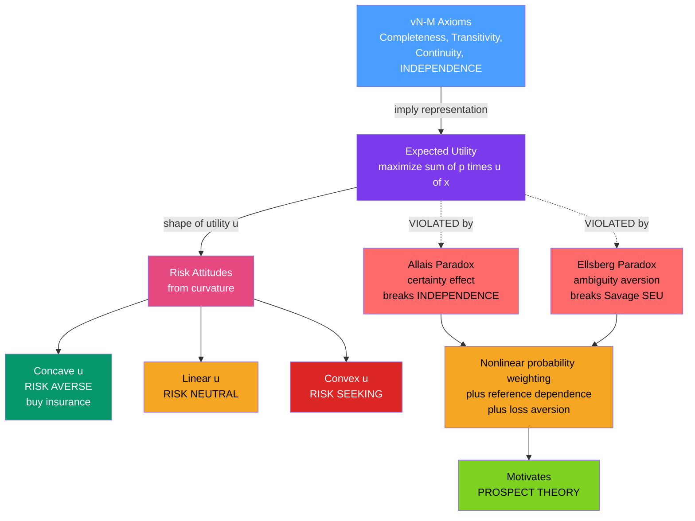

# 🎲 Expected Utility Theory and Its Violations

> [!abstract] TL;DR
> **Expected utility (EU) theory** was the reigning account of rational choice under **risk** for two centuries: an agent should pick the option that maximizes the **probability-weighted sum of the utilities** of outcomes, $\sum_i p_i\,u(x_i)$. Its power comes from the **von Neumann-Morgenstern axioms** — completeness, transitivity, continuity, and above all **independence** (the sure-thing principle) — which together *force* your preferences to look like EU maximization. **Risk attitudes fall out of utility curvature**: concave utility gives risk aversion (why we buy insurance), convex gives risk seeking. Then two simple thought experiments broke it. The **Allais paradox** (1953) shows that the **certainty effect** makes ordinary people — and expert economists — violate independence. The **Ellsberg paradox** (1961) shows people flee **ambiguity** (unknown odds) in a way no coherent probability belief can justify. These violations, together with the **reflection effect** and **preference reversals**, are the empirical cracks that motivated **prospect theory** and launched behavioral economics — while EU survives as a *normative* benchmark.

## Intuition — analogy FIRST

How *should* you choose between risky gambles? For 200 years the answer was expected utility theory — an elegant, axiom-backed rule that says: weigh each outcome's utility by its probability and pick the biggest total. It is beautiful mathematics, as clean as a law of physics.

Then in 1953 the French economist **Maurice Allais** posed a pair of simple gambling choices at a conference in Paris and watched the world's leading economists — including a future Nobel laureate, **Leonard Savage** — make choices that *violated their own sacred theory*. When Savage was shown that his gut answers were mutually inconsistent, he changed one of them to restore coherence. The paradox was not that people are stupid. It was that even brilliant, motivated, mathematically fluent people **systematically break the rules of rational risk-taking** — and do so in a *predictable direction*. That predictable direction is the seed of an entirely new science of decision-making.

The lesson lands like an optical illusion: knowing the "correct" answer does not stop your intuition from pulling the wrong way. EU tells you the illusion exists; it does not make it disappear.

---

## How It Works

Expected utility theory has two moving parts. First, a **representation**: if your preferences over risky prospects obey four axioms, then there *exists* a utility function $u$ over outcomes such that you behave exactly as if maximizing $\mathbb{E}[u]$. Second, an **interpretation of risk**: the *shape* of $u$ encodes your attitude toward risk.

**Step 1 — From Bernoulli to von Neumann-Morgenstern.** Daniel Bernoulli (1738) resolved the **St. Petersburg paradox** — a gamble with *infinite* expected monetary value that no one will pay much to play — by proposing that people maximize expected **utility of wealth**, not expected wealth, and that utility has **diminishing marginal returns**. Two centuries later, **von Neumann and Morgenstern** (1944) turned this idea into a theorem: they wrote down axioms on preferences that *imply* the existence of a utility function unique up to a positive affine transformation.

**Step 2 — The axioms.** Preferences over lotteries must satisfy:
1. **Completeness** — you can rank any two lotteries.
2. **Transitivity** — if $A \succeq B$ and $B \succeq C$, then $A \succeq C$.
3. **Continuity** — no "infinitely preferred" outcome; small probability changes move preference smoothly.
4. **Independence (the sure-thing principle)** — if $A \succeq B$, then mixing each with a common third lottery $C$ at the same probability preserves the ranking: $\alpha A + (1-\alpha)C \succeq \alpha B + (1-\alpha)C$. This is the crucial, contested axiom.

**Step 3 — Risk from curvature.** With EU in hand, define the **certainty equivalent** $CE$ of a gamble $g$ by $u(CE) = \mathbb{E}[u(g)]$, and the **risk premium** by $\pi = \mathbb{E}[g] - CE$. Then:
- **Concave** $u$ (diminishing marginal utility) $\Rightarrow$ $CE < \mathbb{E}[g]$ $\Rightarrow$ **risk aversion** — you prefer a sure amount to a fair gamble of equal expected value. This explains insurance and diversification.
- **Linear** $u$ $\Rightarrow$ risk neutrality; **convex** $u$ $\Rightarrow$ risk seeking.

**Step 4 — The violations.** The **Allais paradox** engineers two choices that share a common component; independence says that common component should cancel, yet the **certainty effect** makes people treat a jump to certainty as special, reversing the "canceled" preference. The **Ellsberg paradox** shows people prefer *known* odds to *unknown* odds so strongly that no single probability distribution over the ambiguous state can rationalize their choices — breaking Savage's subjective EU. Both point to the same fix: weight *probabilities* nonlinearly and evaluate outcomes against a *reference point*.



---

## Key Concepts / Details

### Secondary (intuition level)
- **A gamble is worth its utility average, not its money average.** Because a second million matters less than the first (diminishing marginal utility), a *sure* million can beat a coin flip between two and zero million even though the money averages are equal.
- **Insurance is rational risk aversion.** You knowingly pay more than the expected payout because avoiding a big, unlikely loss is worth a small certain cost when utility is concave.
- **The certainty effect.** A move from a 99 percent chance to a 100 percent chance *feels* far bigger than a move from 10 percent to 11 percent — even though both add one percentage point. Certainty has a psychological premium.
- **Risk vs the unknown.** We prefer a bet where we *know* the odds to one where the odds are hidden, even when there is no logical reason to.

### Undergraduate (formal level)
- **EU representation:** preferences satisfying the vN-M axioms are represented by $U(g) = \sum_i p_i\,u(x_i)$, with $u$ unique up to $a\,u + b$, $a>0$.
- **Independence axiom (sure-thing principle):** $A \succeq B \Rightarrow \alpha A + (1-\alpha)C \succeq \alpha B + (1-\alpha)C$ for all $C$ and $\alpha \in (0,1]$. This is what the Allais choices violate.
- **Arrow-Pratt measure of absolute risk aversion:** $r_A(w) = -\dfrac{u''(w)}{u'(w)}$. Concavity ($u''<0$) makes $r_A>0$ (risk averse). Common forms: **CRRA** $u(w)=\frac{w^{1-\gamma}}{1-\gamma}$ and **CARA** $u(w)=-e^{-\alpha w}$.
- **Certainty equivalent and risk premium:** $u(CE)=\mathbb{E}[u(g)]$; $\pi=\mathbb{E}[g]-CE \ge 0$ for a risk averter. The risk premium is *why* insurers profit.
- **Common-ratio and common-consequence effects** are the two structural families of Allais-type violations.

### Graduate (frontier level)
- **Savage's subjective EU** extends vN-M to *unknown* probabilities: rational agents act as if they hold a subjective probability and maximize subjective EU. The **Ellsberg paradox** refutes this descriptively — ambiguity-averse choices are inconsistent with *any* single prior, motivating **maxmin expected utility** (Gilboa-Schmeidler) and **Choquet expected utility** with non-additive beliefs (capacities).
- **Weakening independence** yields the non-EU family: **rank-dependent utility** (Quiggin) and **cumulative prospect theory** replace $p$ with a decision weight $w(p)$ applied to *cumulative* probabilities, preserving stochastic dominance while allowing the certainty effect.
- **The reflection effect** — risk aversion for gains but risk *seeking* for losses — cannot come from a single monotone utility over final wealth; it requires **reference dependence**.
- **Preference reversals** (Lichtenstein-Slovic): the option you *choose* is not always the one you *price* highest, threatening the very existence of a stable preference order — deeper than any single-axiom violation.
- **The fourfold pattern of risk attitudes** (Tversky-Kahneman): risk averse for likely gains and unlikely losses, risk seeking for unlikely gains and likely losses — the empirical fingerprint of nonlinear **probability weighting** overlaid on loss aversion.

---

## Python Demo

```python
# Expected Utility, risk aversion, and the ALLAIS PARADOX made numerical.
# Part (a): concave utility -> risk aversion, certainty equivalent, risk premium.
# Part (b): the Allais choice pairs -> the common human pattern is inconsistent
#           with ANY expected-utility function (no u can satisfy both choices).
import numpy as np
import matplotlib.pyplot as plt

# ----------------------------------------------------------------------
# PART (a): Risk aversion from a concave utility function u(w) = sqrt(w)
# ----------------------------------------------------------------------
u = lambda w: np.sqrt(w)          # concave -> diminishing marginal utility
u_inv = lambda y: y**2            # inverse, to invert the certainty equivalent

# A fair 50/50 gamble between 0 and 100 (expected value = 50)
outcomes = np.array([0.0, 100.0])
probs    = np.array([0.5, 0.5])

EV  = probs @ outcomes            # expected MONEY value        = 50
EU  = probs @ u(outcomes)         # expected UTILITY            = 5
CE  = u_inv(EU)                   # certainty equivalent        = 25
RP  = EV - CE                     # risk premium                = 25

print("PART (a) — Risk aversion from concave utility")
print(f"  Expected value of gamble : {EV:.1f}")
print(f"  Utility of the sure EV   : u(50) = {u(50):.3f}")
print(f"  Expected utility of gamble: {EU:.3f}")
print(f"  Certainty equivalent     : {CE:.1f}  (< EV -> risk averse)")
print(f"  Risk premium             : {RP:.1f}\n")

# ----------------------------------------------------------------------
# PART (b): THE ALLAIS PARADOX — inconsistency with expected utility
# Outcomes in millions. Normalize the utility scale: u(0)=0, u(5)=1,
# and let the unknown be v = u(1), which MUST lie in [0, 1].
#
# Problem 1:  A1 = sure 1M            vs  B1 = {5M w.p .10, 1M w.p .89, 0 w.p .01}
# Problem 2:  A2 = {1M w.p .11, 0 w.p .89}  vs  B2 = {5M w.p .10, 0 w.p .90}
#
# The MODAL human pattern is: choose A1 in Problem 1, choose B2 in Problem 2.
#   EU(A1) >= EU(B1):  v >= 0.10*1 + 0.89*v + 0.01*0  ->  0.11 v >= 0.10 -> v >= 10/11
#   EU(B2) >= EU(A2):  0.10*1 >= 0.11*v               ->  v <= 10/11
# These require v >= 10/11 AND v <= 10/11 simultaneously -> ONLY the knife-edge
# v = 10/11 is even consistent, and STRICT preference in both is IMPOSSIBLE.
# No concave, convex, or any-shaped utility can rationalize the strict pattern.
# ----------------------------------------------------------------------
v = np.linspace(0.0, 1.0, 1001)                 # every candidate u(1M)

EU_A1 = v                                        # u(1M)
EU_B1 = 0.10*1.0 + 0.89*v + 0.01*0.0
EU_A2 = 0.11*v + 0.89*0.0
EU_B2 = 0.10*1.0 + 0.90*0.0

prefers_A1 = EU_A1 > EU_B1                        # sure thing in Problem 1
prefers_B2 = EU_B2 > EU_A2                        # gamble in Problem 2
consistent = prefers_A1 & prefers_B2             # the modal pattern under EU

threshold = 10/11
print("PART (b) — Allais paradox")
print(f"  Choosing SURE 1M in Problem 1 requires u(1M) > {threshold:.4f}")
print(f"  Choosing GAMBLE B2 in Problem 2 requires u(1M) < {threshold:.4f}")
print(f"  Values of u(1M) satisfying BOTH strictly: {int(consistent.sum())} "
      f"out of {len(v)}  -> the pattern is IMPOSSIBLE under expected utility.")

# The CERTAINTY EFFECT view: Problem 1 vs 2 differ only by adding a common
# 0.89 chance of 1M to BOTH options of Problem 2. Independence says that common
# component must cancel, so the ranking should be the SAME in both problems.
# It is not -> the certainty of A1 (jump from .99 to 1.00) is overweighted.

# ----------------------------------------------------------------------
# PLOTS
# ----------------------------------------------------------------------
fig, (ax1, ax2) = plt.subplots(1, 2, figsize=(13, 5.2))

# (a) Concave utility + risk aversion geometry
w = np.linspace(0, 100, 400)
ax1.plot(w, u(w), color="#7c3aed", lw=2.5, label="u(w) = sqrt(w)  (concave)")
ax1.plot([0, 100], [u(0), u(100)], "--", color="#dc2626", lw=1.8,
         label="chord = expected utility of gamble")
ax1.scatter([EV], [u(EV)], color="#059669", zorder=5, s=70,
            label=f"u(EV)=u(50)={u(50):.2f}  (sure thing)")
ax1.scatter([EV], [EU], color="#dc2626", zorder=5, s=70,
            label=f"EU of gamble={EU:.2f}")
ax1.scatter([CE], [EU], color="#f5a623", zorder=5, s=70,
            label=f"certainty equiv={CE:.0f}")
ax1.annotate("", xy=(CE, EU), xytext=(EV, EU),
             arrowprops=dict(arrowstyle="<->", color="black"))
ax1.text((CE+EV)/2, EU-0.7, f"risk premium={RP:.0f}", ha="center", fontsize=9)
ax1.set_xlabel("wealth w"); ax1.set_ylabel("utility u(w)")
ax1.set_title("(a) Concave utility -> risk aversion")
ax1.legend(fontsize=8, loc="lower right"); ax1.grid(alpha=0.3)

# (b) Allais inconsistency: the two required regions for u(1M) do not overlap
ax2.plot(v, EU_A1 - EU_B1, color="#059669", lw=2.2,
         label="EU(A1) - EU(B1)  > 0 -> pick SURE 1M")
ax2.plot(v, EU_B2 - EU_A2, color="#dc2626", lw=2.2,
         label="EU(B2) - EU(A2)  > 0 -> pick GAMBLE B2")
ax2.axhline(0, color="black", lw=1)
ax2.axvline(threshold, color="#7c3aed", ls="--", lw=1.8,
            label=f"knife-edge u(1M)={threshold:.3f}")
ax2.fill_between(v, -1, 1, where=(v > threshold), color="#059669", alpha=0.10)
ax2.fill_between(v, -1, 1, where=(v < threshold), color="#dc2626", alpha=0.10)
ax2.set_ylim(-0.12, 0.12)
ax2.set_xlabel("candidate utility u(1M)  (with u(0)=0, u(5M)=1)")
ax2.set_ylabel("EU advantage of the chosen option")
ax2.set_title("(b) Allais: no single u(1M) supports both choices")
ax2.legend(fontsize=8, loc="upper center"); ax2.grid(alpha=0.3)

plt.tight_layout()
plt.savefig("expected_utility_and_allais.png", dpi=120)
print("\nSaved figure: expected_utility_and_allais.png")
```

Running it prints the risk-aversion numbers (certainty equivalent 25 versus expected value 50, a risk premium of 25) and then the decisive Allais result: choosing the sure million in Problem 1 requires $u(1\text{M}) > 10/11$, while choosing the gamble in Problem 2 requires $u(1\text{M}) < 10/11$. **Zero** utility values satisfy both strictly — the common human pattern is inconsistent with *every* expected-utility function, concave or not. The left panel shows the classic risk-aversion geometry (the utility curve sits above its chord); the right panel shows the two preference regions meeting only at a single knife-edge point, never overlapping. That empty overlap *is* the paradox, and the culprit is the **certainty effect**: independence says the shared 0.89 chance of a million should cancel between the two problems, but the psychological pull of turning "almost certain" into "certain" refuses to cancel.

---

## Real-World Applications

- **Insurance and reinsurance pricing.** The entire industry rests on concave utility: customers pay a premium above expected loss because certainty is worth more to a risk averter, and insurers pool independent risks so their own effective utility is nearly linear. The risk premium in the demo is the insurer's margin in miniature.
- **Portfolio choice and the equity premium.** Mean-variance and CRRA-utility models price the trade-off between return and risk; the empirically *huge* equity premium is partly explained by loss aversion and probability weighting — EU's descriptive failures showing up in asset prices. See [[Prospect_Theory_and_Loss_Aversion]].
- **Lotteries and insurance bought by the same person.** A single concave (or convex) utility cannot explain buying lottery tickets *and* insurance. Overweighting of small probabilities — the certainty effect's mirror image — does, which is why prospect theory's weighting function is the practical model.
- **Ambiguity in markets and policy.** Ellsberg-style ambiguity aversion explains under-diversification into unfamiliar assets, the home bias, cautious responses to novel risks (new drugs, climate tail risk), and why investors demand an extra premium when odds are unknown, not merely unfavorable.
- **Decision analysis and medical choice.** Clinicians and analysts still elicit utilities and certainty equivalents to structure high-stakes decisions — EU remains the *normative* scaffolding even where real patients deviate from it.

---

## Common Pitfalls

- **Confusing risk aversion with loss aversion.** Risk aversion is curvature of utility over *final wealth*; loss aversion is an asymmetry around a *reference point*. The reflection effect (risk seeking in losses) needs the latter and cannot come from a single concave $u$.
- **Thinking the Allais pattern is a "mistake" curable by concavity.** It is not a calibration error — the demo shows *no* utility shape rationalizes it. The fix is to change the *theory* (nonlinear probability weighting), not the utility numbers.
- **Treating risk and ambiguity as the same thing.** Risk means *known* probabilities; ambiguity means *unknown* probabilities. Ellsberg shows people price these differently, which subjective EU forbids. Sizing an "unknown" as if it were a known 50/50 misreads the whole phenomenon.
- **Reading EU's descriptive failure as normative failure.** EU still tells you how to be *coherent* (no Dutch books, no dominated choices). The normative-descriptive gap is the point, not a bug — behavioral economics describes; EU prescribes.
- **Assuming preferences are stable.** Preference reversals (choice versus pricing) show the "true" preference can depend on how it is elicited, undermining the assumption of a single fixed utility before any axiom is even tested.
- **Over-precision on parameters.** Elicited risk-aversion coefficients and the $10/11$ threshold are exact in the toy problem but vary widely across people, stakes, and framing in the field.

---

## Related Concepts

This note is the entry point for the **Behavioral_Economics** foundations. Its not-yet-written siblings extend it directly: **The_Rational_Actor_Model_and_Its_Limits** (the broader rational-choice framework EU sits inside), **Prospect_Theory** (Kahneman and Tversky's descriptive replacement built from these very violations), **Probability_Weighting_and_Certainty_Effect** (the nonlinear weighting function that formalizes the Allais certainty effect), **Risk_Ambiguity_and_Uncertainty** (the Knightian distinction Ellsberg exploits), and **Heuristics_and_Biases_Overview** (the wider catalogue of systematic deviations).

Verified cross-vault links:
- [[Utility_Theory]] — cross-vault (Microeconomics): the ordinal/cardinal utility foundation EU builds on; concavity there becomes risk aversion here.
- [[Prospect_Theory_and_Loss_Aversion]] — cross-vault (Finance): the descriptive theory these violations motivated, with the S-shaped value function and probability weighting.
- [[Dominance_and_Rationality]] — cross-vault (Game Theory): the rationality axioms (transitivity, dominance) that EU shares and that Allais/Ellsberg strain.
- [[Probability_Theory]] — cross-vault (Mathematics): the probability calculus over which expectations and the independence axiom are defined.
- [[Cognitive_Biases]] — cross-vault (Psychology): the certainty effect and ambiguity aversion as instances of systematic judgment biases.
- [[Behavioral_Finance]] — cross-vault (Finance): where these decision anomalies reshape asset pricing and investor behavior.
- [[Problem_Solving_and_Decision_Making]] — cross-vault (Psychology): the cognitive-process view of how people actually decide under risk.

## Review Questions

1. **(Secondary)** Explain, using the idea of diminishing marginal utility, why a risk-averse person will pay $30 to insure against a 1-in-100 chance of losing $2,000 even though the expected loss is only $20. What does "certainty equivalent" mean here?
2. **(Undergraduate)** Write out the four vN-M axioms and state the independence axiom precisely. Then, using the two Allais choice pairs, show algebraically that the modal pattern (sure 1M in Problem 1, gamble B2 in Problem 2) implies $u(1\text{M}) > 10/11$ *and* $u(1\text{M}) < 10/11$. Why does this prove no expected-utility function fits?
3. **(Graduate)** Contrast the Allais and Ellsberg paradoxes: which axiom does each attack (vN-M independence versus Savage's sure-thing principle over subjective probabilities), and why does ambiguity aversion imply that *no* single prior can represent the agent's beliefs? Sketch how maxmin expected utility or rank-dependent utility repairs each violation, and argue whether EU should still be regarded as the correct *normative* standard.

---

## Sources

- von Neumann, J. & Morgenstern, O. (1944), *Theory of Games and Economic Behavior*, Princeton University Press (the axiomatic foundation of expected utility).
- Allais, M. (1953), "Le Comportement de l'Homme Rationnel devant le Risque," *Econometrica* 21(4), 503-546 (the Allais paradox).
- Ellsberg, D. (1961), "Risk, Ambiguity, and the Savage Axioms," *Quarterly Journal of Economics* 75(4), 643-669 (the Ellsberg paradox and ambiguity aversion).
- Kahneman, D. & Tversky, A. (1979), "Prospect Theory: An Analysis of Decision under Risk," *Econometrica* 47(2), 263-291 (the descriptive replacement).
- Bernoulli, D. (1738/1954), "Exposition of a New Theory on the Measurement of Risk," *Econometrica* 22(1), 23-36 (diminishing marginal utility and the St. Petersburg paradox).

#behavioral-economics #expected-utility #allais-paradox #ellsberg #certainty-effect
