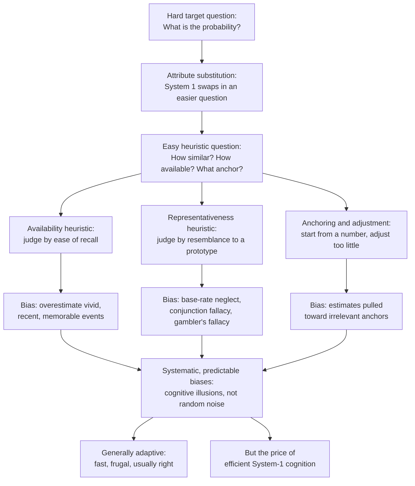

# 🧠 Heuristics and Biases (Overview)

> [!abstract] TL;DR
> The **heuristics-and-biases program** of Daniel Kahneman and Amos Tversky (from 1974's *Judgment under Uncertainty*) showed that human judgment under uncertainty runs on a small set of mental shortcuts — **availability**, **representativeness**, and **anchoring** — that are generally adaptive and fast but produce **systematic, predictable biases** (base-rate neglect, the conjunction fallacy, overconfidence) rather than random errors. These "cognitive illusions" persist even when you know about them, are the fingerprints of efficient System-1 cognition, and — by documenting exactly how real judgment departs from Bayesian rationality — founded behavioral economics (Nobel 2002) and reshaped psychology, medicine, law, forecasting, and policy.

---

## Intuition

**Analogy:** Your mind is a master of shortcuts. Asked whether there are more English words starting with the letter *K* or with *K* as the *third* letter, you instantly "feel" the answer — because K-first words spring to mind so easily — and you are wrong (third-letter K-words are roughly three times as common, just harder to summon). That instant feeling is a **heuristic**: a shortcut that reads an answer off whatever is easy to retrieve. It usually serves you brilliantly and fast, but it casts a predictable **shadow** — a systematic bias that trips you up in exactly the same way every time.

Kahneman and Tversky's revolution was showing that our errors are not random noise and not stupidity. They are the *lawful* consequences of the shortcuts that make thinking possible at all. If you know which shortcut a person is using, you can predict *which* mistake they will make and *in which direction* — the way an optical illusion fools every viewer identically. The bias is the fingerprint of the heuristic.

---

## How It Works

### Core Mechanics

1. **Judgment under uncertainty is expensive.** Correctly estimating "how probable is X?" demands base rates, likelihoods, and Bayes' rule — computation the mind rarely performs in real time.
2. **The mind substitutes an easier question (attribute substitution).** Instead of answering the hard target question, System 1 quietly swaps in an easier heuristic attribute and reports *that* answer as if it were the real one. "How likely?" becomes "How similar?", "How easily recalled?", or "What number did I just hear?"
3. **Three classic heuristics** (Tversky & Kahneman, 1974) do most of the work:
   - **Availability** — judge frequency or probability by *how easily instances come to mind*. Vivid, recent, emotionally charged events (plane crashes, shark attacks, terrorism) get over-estimated; silent statistical killers (diabetes, car crashes) get under-estimated. Ease of recall is mistaken for actual frequency.
   - **Representativeness** — judge probability by *how much something resembles a prototype or stereotype*. This produces its signature errors: **base-rate neglect** (ignoring prior probabilities when a vivid description is available), the **conjunction fallacy** (rating "Linda is a bank teller *and* a feminist" as more probable than "Linda is a bank teller"), and **insensitivity to sample size** (expecting small samples to mirror the population — the gambler's fallacy).
   - **Anchoring and adjustment** — start from an initial value (an *anchor*, however arbitrary) and adjust insufficiently. Spinning a rigged wheel before asking "what fraction of UN countries are African?" drags answers toward the wheel's number; even judges' sentences move toward numbers rolled on dice.
4. **The biases are systematic, not random.** The same person makes the same error repeatably. These are **cognitive illusions**, directly analogous to visual illusions: knowing the two lines are equal length does not make the Müller-Lyer arrows *look* equal, and knowing about base rates does not stop the vivid description from *feeling* diagnostic.
5. **Base-rate neglect is the central Bayesian failure.** People over-weight the likelihood (how well the evidence fits the hypothesis) and under-weight the prior (how common the hypothesis is to begin with) — the mammogram/disease-test problem and the taxicab problem. This directly foreshadows the sibling note **Base_Rate_Neglect_and_Bayesian_Reasoning**.
6. **The program spawned a "bias zoo."** Overconfidence, confirmation bias, hindsight bias, framing, the halo effect, the planning fallacy, and dozens more form a growing taxonomy (the vault's cognitive-biases material catalogs these), all traceable to the same shortcut-driven machinery.
7. **Heuristics are adaptive, not defective.** The balanced view: shortcuts *evolved because they usually work well and fast* in the environments we face. Gerd Gigerenzer's **ecological rationality** and **fast-and-frugal** research frames the same heuristics as *smart* — sometimes more accurate than complex models. Biases are the price of efficient cognition, and the tension between the "biases" framing and the "fast-and-frugal" framing is one of the field's most productive debates (see the sibling **Bounded_Rationality_and_Satisficing**).
8. **Dual-process link.** Heuristics are largely the product of fast, automatic **System 1** thinking, left uncorrected by slow, effortful **System 2** — the subject of the sibling **Dual_Process_Theory_System_1_and_2**.

### Flow / Architecture



---

## Key Concepts

**Secondary (intuitive grasp).** A *heuristic* is a mental rule of thumb that trades accuracy for speed. Because everyone shares the same rules of thumb, everyone tends to make the same predictable errors — a *bias*. Example: because plane crashes are memorable, most people fear flying more than driving, even though driving is far deadlier per mile (the availability heuristic at work).

**Undergraduate (mechanism and named effects).** *Attribute substitution* is the engine: the mind answers a hard question by silently substituting an easier one. The three canonical heuristics (availability, representativeness, anchoring) map onto named biases: base-rate neglect, the conjunction fallacy, insensitivity to sample size, and anchoring effects. The key theoretical claim is that these are *systematic* — replicable in direction and magnitude — which is what makes them scientifically tractable and distinguishes them from mere ignorance. Debiasing exists (considering the opposite, statistical training, changing the choice environment) but *awareness alone is usually insufficient*.

**Graduate (normative stakes and open debates).** The program is defined *against a normative benchmark* — Bayes' theorem for probability judgment and expected-utility theory for choice. Documenting *lawful* departures from these benchmarks is what founded behavioral economics. Three live tensions: (1) the **rationality debate** — are these results evidence of irrationality (Kahneman–Tversky) or of *ecological* rationality well-tuned to natural environments (Gigerenzer), with much of the disagreement turning on whether probabilities are presented as single-event percentages or **natural frequencies**? (2) the **content-vs-process** question — is representativeness a genuine mechanism or a redescription of the effects it names? and (3) **debiasing efficacy** — since cognitive illusions persist under full information, the most reliable interventions restructure the *environment* (choice architecture, algorithms, reference-class forecasting) rather than exhorting the individual to try harder.

---

## Python Demo

```python
# Two demonstrations of heuristic-driven bias, quantified:
#   (a) REPRESENTATIVENESS / base-rate neglect: the disease-test problem.
#       The intuitive answer equates P(disease | positive) with the test's
#       sensitivity, ignoring the base rate. The correct answer is Bayesian
#       and is far lower when the disease is rare.
#   (b) AVAILABILITY: perceived vs. actual frequency of causes of death.
#       Vivid, memorable causes are systematically overestimated.
import numpy as np
import matplotlib.pyplot as plt

# ---------- (a) Base-rate neglect: Bayesian vs. intuitive -------------------
sensitivity = 0.90          # P(positive | disease)
false_pos_rate = 0.09       # P(positive | healthy)  -> specificity = 0.91

def posterior(base_rate, sens=sensitivity, fpr=false_pos_rate):
    """Correct P(disease | positive) via Bayes' theorem."""
    p_pos = sens * base_rate + fpr * (1.0 - base_rate)
    return sens * base_rate / p_pos

base_rates = np.linspace(0.001, 0.30, 400)
bayes = posterior(base_rates)                      # correct answer
intuition = np.full_like(base_rates, sensitivity)  # biased answer ~ sensitivity

# Headline case: a rare disease (1% base rate) with a "90% accurate" test
br = 0.01
print(f"Base rate            : {br:.1%}")
print(f"Intuitive answer     : {sensitivity:.1%}  (equates P(D|+) with sensitivity)")
print(f"Correct Bayesian P    : {posterior(br):.1%}")
print(f"Base-rate-neglect gap : {sensitivity - posterior(br):.1%}")

# Natural-frequency breakdown that dissolves the illusion (per 10,000 people)
N = 10_000
sick = int(round(br * N))
tp = int(round(sensitivity * sick))               # true positives
fp = int(round(false_pos_rate * (N - sick)))      # false positives
print(f"\nOut of {N:,}: {sick} sick -> {tp} true positives; "
      f"{N - sick} healthy -> {fp} false positives")
print(f"So of {tp + fp} positive tests, only {tp} are truly sick "
      f"= {tp / (tp + fp):.1%}")

# ---------- (b) Availability: perceived vs. actual mortality ----------------
# Illustrative figures (relative scale) echoing Lichtenstein et al. (1978):
# memorable/dramatic causes are overestimated, mundane ones underestimated.
causes   = ["Car\naccident", "Stroke", "Diabetes", "Homicide",
            "Plane\ncrash", "Shark\nattack", "Tornado", "Lightning"]
actual   = np.array([100, 210, 190, 20, 1.5, 0.03, 0.6, 0.15])   # ~ true rate
perceived = np.array([90,  55,  40, 60, 25,  8,    18,  6])       # ~ felt rate

# ---------- Plot ------------------------------------------------------------
fig, ax = plt.subplots(1, 3, figsize=(16, 5))

# Panel 1: the base-rate-neglect gap across base rates
ax[0].plot(base_rates * 100, bayes * 100, lw=2.5, label="Correct (Bayesian)")
ax[0].plot(base_rates * 100, intuition * 100, "--", lw=2,
           color="crimson", label="Intuition (~sensitivity)")
ax[0].fill_between(base_rates * 100, bayes * 100, intuition * 100,
                   color="crimson", alpha=0.12, label="Bias gap")
ax[0].axvline(br * 100, color="gray", ls=":", lw=1)
ax[0].set_xlabel("Disease base rate (%)")
ax[0].set_ylabel("P(disease | positive test) (%)")
ax[0].set_title("Base-rate neglect: intuition vs. Bayes")
ax[0].legend(); ax[0].grid(alpha=0.3)

# Panel 2: the headline 1% case, side by side
labels = ["Intuition", "Bayesian\n(correct)"]
vals = [sensitivity * 100, posterior(br) * 100]
bars = ax[1].bar(labels, vals, color=["crimson", "steelblue"])
ax[1].bar_label(bars, fmt="%.1f%%", padding=3)
ax[1].set_ylabel("P(disease | positive) (%)")
ax[1].set_title(f"Rare disease (base rate {br:.0%}, test 90% accurate)")
ax[1].set_ylim(0, 100); ax[1].grid(axis="y", alpha=0.3)

# Panel 3: availability -- perceived vs. actual mortality (log scale)
x = np.arange(len(causes)); w = 0.4
ax[2].bar(x - w/2, actual, w, label="Actual rate", color="steelblue")
ax[2].bar(x + w/2, perceived, w, label="Perceived rate", color="orange")
ax[2].set_yscale("log")
ax[2].set_xticks(x); ax[2].set_xticklabels(causes, fontsize=8)
ax[2].set_ylabel("Relative frequency (log scale)")
ax[2].set_title("Availability: vivid causes overestimated")
ax[2].legend(); ax[2].grid(axis="y", alpha=0.3)

plt.tight_layout()
plt.savefig("heuristics_and_biases.png", dpi=120)
plt.show()
```

Running this prints that a "90% accurate" test on a disease with a 1% base rate yields a true positive probability of only about **9%**, not the ~90% intuition supplies — a base-rate-neglect gap of roughly **81 percentage points**. Panel 1 shows this gap shrinking as the disease becomes more common (the prior matters less when it is large); Panel 3 shows how availability inflates the felt frequency of dramatic, memorable causes of death while deflating mundane statistical killers.

---

## Real-World Applications

> **Example (medicine):** David Eddy's classic study found that most physicians, told a patient tested positive on a "90-95% accurate" mammogram for a cancer with a ~1% base rate, estimated the probability of cancer at ~75-90% — when the Bayesian answer is under 10%. This is representativeness-driven base-rate neglect in a life-or-death setting, and it is exactly the calculation the Python demo reproduces. Presenting the same data as **natural frequencies** ("10 of 1,000 women have it...") sharply improves accuracy, which is why decision aids and med-school curricula now teach frequency formats.

- **Finance and insurance:** availability inflates perceived risk right after a crash or catastrophe (over-buying insurance, panic-selling); anchoring drives valuations toward listing prices and analysts' initial targets.
- **Law:** anchoring shifts jury damage awards and sentencing toward the first number mentioned (prosecutor's demand); the availability of a vivid crime distorts perceived crime rates.
- **Forecasting and project management:** the planning fallacy (a representativeness/inside-view error) makes teams systematically under-budget time and cost; reference-class forecasting is the standard debiasing fix.
- **Public policy and design:** because biases persist under awareness, policy increasingly restructures the *environment* — choice architecture, defaults, and algorithms — the lineage from this program to behavioral economics and nudge theory.

---

## Common Pitfalls

- **Treating biases as stupidity or as random error** — the entire point of the program is that biases are *systematic* and afflict experts, statisticians, and Nobel laureates alike. They are features of efficient cognition, not defects of unintelligent people.
- **Assuming awareness debiases you** — knowing about anchoring does not stop the anchor from pulling your estimate. Cognitive illusions persist like visual illusions; reliable fixes are procedural (consider-the-opposite, checklists, algorithms), not motivational.
- **Confusing P(evidence | hypothesis) with P(hypothesis | evidence)** — the core Bayesian inversion error behind base-rate neglect. A "90% accurate" test does not make a positive result 90% likely to be true when the condition is rare.
- **Over-applying the "irrationality" verdict** — the fast-and-frugal / ecological-rationality critique (Gigerenzer) shows the same heuristics are often *adaptive and accurate* in natural environments, and that many "biases" shrink or vanish under natural-frequency framing. Cite the effect, but note the debate.
- **Flattening the bias zoo** — not all catalogued biases have equal effect sizes or robustness; naming a bias is not the same as explaining or demonstrating it in the case at hand.

---

## Related Concepts

- [[Cognitive_Biases]] — the Psychology-vault companion cataloging the full "bias zoo" this program spawned (availability, anchoring, hindsight, framing, and more).
- [[Behavioral_Economics_Psychology]] — how these heuristics and biases became the foundation of behavioral economics, prospect theory, and nudge/choice-architecture policy.
- [[Judgment_and_Decision_Making]] — the cognitive-science treatment of the same program, extended to prospect theory and the normative expected-utility benchmark.
- [[Bayesian_Reasoning]] — the normative standard (Bayes' theorem) against which base-rate neglect is measured; the correct-answer engine in the Python demo.
- [[Dual_Process_Theory]] — System 1 (fast, automatic) generates the heuristics; System 2 (slow, effortful) fails to correct them.
- [[Cognitive_Biases_and_Heuristics]] — the Logic-and-Critical-Thinking view, connecting these effects to reasoning fallacies and debiasing.
- [[Problem_Solving_and_Decision_Making]] — the decision-making context in which these shortcuts operate.
- [[Probability_Theory]] — the formal probability machinery (priors, likelihoods) that base-rate neglect violates.

*Not yet written (Behavioral_Economics siblings referenced above): Bounded_Rationality_and_Satisficing, Dual_Process_Theory_System_1_and_2, Anchoring_and_Adjustment, Availability_and_Representativeness, Base_Rate_Neglect_and_Bayesian_Reasoning, Overconfidence_and_Calibration.*

---

## Review Questions

1. **(Conceptual)** Explain *attribute substitution* and use it to show why the availability, representativeness, and anchoring heuristics are three instances of the *same* underlying mechanism rather than three unrelated quirks.
2. **(Scenario)** A screening test is "95% accurate" for a condition present in 0.5% of the population, and a patient tests positive. A colleague concludes the patient "almost certainly has it." Compute the actual posterior probability, name the bias, and describe one reframing of the numbers that would make the colleague's intuition more accurate.
3. **(Trade-off)** Kahneman–Tversky call heuristics error-prone; Gigerenzer calls them fast-and-frugal and often superior. Lay out the trade-off each side emphasizes, and give one concrete condition under which you would expect a simple heuristic to *outperform* a full Bayesian computation.

---

## Sources

- Tversky, A. & Kahneman, D. (1974). "Judgment under Uncertainty: Heuristics and Biases." *Science*, 185(4157), 1124–1131.
- Kahneman, D. (2011). *Thinking, Fast and Slow*. Farrar, Straus and Giroux.
- Gigerenzer, G. & Goldstein, D. G. (1996). "Reasoning the Fast and Frugal Way: Models of Bounded Rationality." *Psychological Review*, 103(4), 650–669.
- Eddy, D. M. (1982). "Probabilistic Reasoning in Clinical Medicine." In Kahneman, Slovic & Tversky (Eds.), *Judgment under Uncertainty*.
- Lichtenstein, S., Slovic, P., Fischhoff, B., Layman, M. & Combs, B. (1978). "Judged Frequency of Lethal Events." *Journal of Experimental Psychology: Human Learning and Memory*, 4(6), 551–578.

---

#behavioral-economics #heuristics #cognitive-biases #kahneman-tversky #base-rate-neglect
