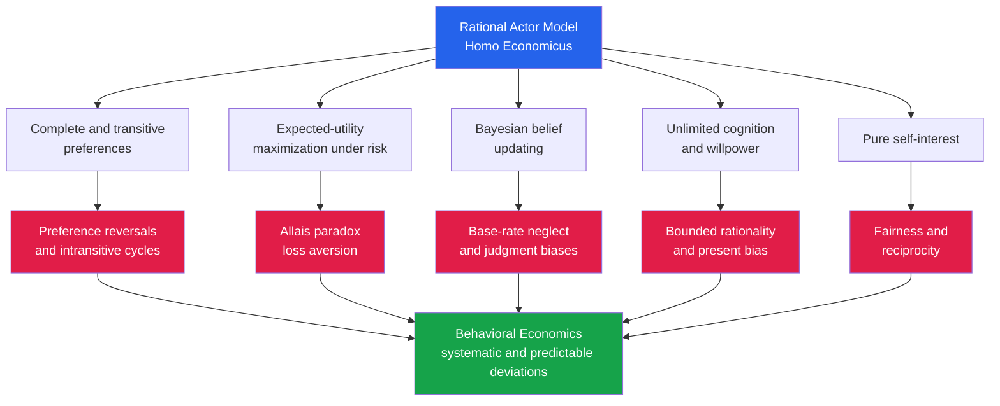

# 🎯 The Rational Actor Model and Its Limits

> [!abstract] TL;DR
> **Homo economicus** — the rational actor — is neoclassical economics' idealized agent: someone with **complete, transitive preferences** who **maximizes expected utility** under risk, **updates beliefs by Bayes' rule**, has **unlimited cognition and willpower**, and acts on **self-interest**. It is the frictionless plane of economics: parsimonious, mathematically tractable, predictive in aggregate, and normatively defensible. Behavioral economics does not throw it away — it keeps it as the **benchmark** and studies the **systematic, predictable ways real humans violate it** (preference reversals, the Allais paradox, base-rate neglect, present bias, fairness concerns), which are precisely the phenomena that define the field.

---

## Intuition

**Analogy:** Economics runs on a thought experiment. Imagine a person who is a flawless optimizer — they always know exactly what they want, rank every option consistently, calculate probabilities like a trained statistician, and pick the choice that maximizes their satisfaction every single time, without fatigue, emotion, or error. This "rational actor" is economics' equivalent of the physicist's **frictionless plane**: a deliberate idealization that strips away messy detail so the math becomes tractable and the predictions become sharp.

The trouble is that, unlike the frictionless plane, real people do not merely deviate a *little* around the ideal. They deviate **systematically and predictably**. A frictionless-plane model of a rolling ball is wrong by a small, random-looking amount; the rational-actor model of a choosing human is wrong in the *same direction, for the same reasons, across millions of people*. Those regular deviations are not noise to be averaged away — they are the signal. That is the seed of behavioral economics.

---

## How It Works

The rational actor model is not a vague appeal to "people are smart." It is a precise stack of five assumptions, each with a mathematical form, each attractive for a reason — and each with a documented breaking point. The companion note *Behavioral_Economics_Overview* frames the whole program around measuring departures from this stack.

### Core Mechanics

1. **Complete and transitive preferences.** For any two options $A$ and $B$, the agent can say $A \succ B$, $B \succ A$, or $A \sim B$ — this is **completeness** (no "I can't compare these"). And preferences never cycle: if $A \succ B$ and $B \succ C$, then $A \succ C$ — this is **transitivity**. Together with continuity, these axioms guarantee the preferences can be represented by a **utility function** $u(\cdot)$ that the agent maximizes. Geometrically this is the world of [[Utility_Theory]] and [[Indifference_Curves]].

2. **Expected-utility maximization under risk.** When outcomes are uncertain, the **von Neumann–Morgenstern axioms** — completeness, transitivity, continuity, and crucially **independence** — imply the agent maximizes **expected utility**: the probability-weighted average of the utilities of outcomes, $EU(L) = \sum_i p_i \, u(x_i)$. A **concave** utility function then produces **risk aversion**: a sure amount is preferred to a fair gamble with the same expected value.

3. **Bayesian belief updating.** Faced with new evidence, the rational agent revises beliefs by **Bayes' rule**, $P(H \mid E) = \frac{P(E \mid H)\,P(H)}{P(E)}$, correctly weighting **base rates** and likelihoods. There are no systematic judgment errors — see [[Bayesian_Statistics]].

4. **Unlimited cognition and willpower.** Implicitly, the agent has infinite computational power (can solve any optimization instantly), perfect memory, and complete **self-control** — it always follows through on the optimal plan, so preferences are **time-consistent** (no succumbing to temptation, no regret).

5. **Self-interest.** The agent maximizes **its own** payoff. It has no intrinsic concern for fairness, others' welfare, or social norms — those enter only *instrumentally* (e.g., being fair today to get repeat business tomorrow). This is the rationality assumed in [[Dominance_and_Rationality]] and [[Nash_Equilibrium]].

**Why the model is useful.** These assumptions are not naive — they are chosen for real virtues:
- **Parsimony** — a handful of axioms generate an entire theory.
- **Tractability** — the machinery of optimization and equilibrium becomes available; you can *solve* for behavior.
- **Predictive power** — it often works, especially in aggregate and in competitive markets where money is on the line.
- **Normative force** — the axioms describe how one arguably *should* decide to be coherent; an agent violating transitivity can be turned into a **money pump**.

Milton Friedman's **"as-if" defense** sharpens this: a model should be judged by the accuracy of its *predictions*, not the realism of its *assumptions*. A pool player behaves "as if" solving Newtonian mechanics without knowing physics; firms behave "as if" maximizing profit. On this view, unrealistic axioms are fine — until their failures produce **wrong predictions** (asset bubbles, chronic under-saving, framing effects), which is exactly where the behavioral critique bites.

**Normative vs descriptive.** The pivotal distinction: rational choice as a **normative** theory (how to decide coherently and optimally) versus a **descriptive** theory (how people actually decide). Behavioral economics is descriptive — it documents what humans do — while retaining the rational model as its measuring stick. The live debate is whether observed biases are genuine **errors** or **ecologically rational** adaptations to real-world environments.

### Flow / Architecture



---

## Key Concepts

### Secondary (intuition level)

- **The rational actor / Homo economicus** — a made-up "perfectly sensible" person: knows what they want, never contradicts themselves, and always picks the best option.
- **Preferences and choice** — you can rank any two things, and you pick the one you rank higher; you never go in circles (prefer coffee to tea, tea to juice, then juice to coffee).
- **Self-interest** — the model assumes people look out for their own payoff first.
- **Why economists pretend this** — the same reason physics starts with frictionless surfaces: it makes the problem solvable and the predictions clean.

### Undergraduate (CS/econ background)

- **The axioms of rational choice** — **completeness** (any two options are comparable) and **transitivity** (no cycles), plus continuity, guarantee a **utility function** exists. See [[Utility_Theory]], [[Indifference_Curves]], [[Consumer_Optimization]].
- **Expected utility theory** — the **von Neumann–Morgenstern axioms** (completeness, transitivity, continuity, **independence**) imply agents maximize $EU = \sum_i p_i u(x_i)$.
- **Risk aversion from concavity** — a concave $u$ means the utility of the expected value exceeds the expected utility, so the agent prefers certainty; the gap is the **risk premium**, and the sure amount matching the gamble's EU is the **certainty equivalent**.
- **Bayesian updating** — revise beliefs with [[Bayesian_Statistics]] and Bayes' rule; respect base rates.
- **Normative vs descriptive** — *should* versus *does*; behavioral economics is descriptive but benchmarks against the normative model.
- **Systematic violations preview** — preference reversals (transitivity), the **Allais paradox** (independence), base-rate neglect (Bayes), present bias (willpower), and fairness (self-interest). These are unpacked in the siblings *Expected_Utility_Theory_and_Its_Violations*, *Heuristics_and_Biases_Overview*, and *Prospect_Theory*.

### Graduate (system-level thinking)

- **The independence axiom and Allais** — independence (mixing two lotteries with a common third does not reverse preference) is the vNM axiom most often violated; the **Allais paradox** and the **common-ratio / common-consequence effects** are direct falsifications, motivating **rank-dependent** and **prospect-theory** value functions with nonlinear **probability weighting**.
- **Revealed preference** — **WARP/GARP** ground utility in observable choice (Samuelson, Afriat); stochastic-choice and **random-utility** models (McFadden) relax deterministic rationality while preserving structure.
- **Representation theorems** — Debreu's utility representation, the vNM theorem, and Savage's **subjective expected utility** (deriving both probabilities and utilities from preference axioms) are the formal backbone; violations are best understood as failures of specific axioms, not "irrationality" wholesale.
- **The "as-if" methodological debate** — Friedman's *Methodology of Positive Economics* versus the behavioral rebuttal: assumptions' realism matters exactly when their failure changes predictions (framing effects, bubbles, under-annuitization).
- **Bounded rationality and ecological rationality** — Simon's **satisficing** and Gigerenzer's **fast-and-frugal heuristics** reframe deviations as adaptive under real constraints, contra the Kahneman–Tversky "heuristics-and-biases" reading; this tension is the field's central methodological fault line (see *Bounded_Rationality_and_Satisficing*).
- **Time inconsistency** — exponential vs **hyperbolic/quasi-hyperbolic (beta-delta)** discounting formalizes the willpower failure and generates dynamically inconsistent plans.

---

## Python Demo

```python
# Two demonstrations side by side:
#  (A) THE RATIONAL MODEL  -> a concave utility function makes an agent
#      risk-averse and gives a clean, TRANSITIVE ranking of risky gambles
#      via expected-utility maximization (the standard model).
#  (B) A VIOLATION         -> the classic PREFERENCE REVERSAL: the same
#      people CHOOSE the "P-bet" but PRICE the "$-bet" higher, an
#      intransitivity that NO single utility function can rationalize.
import numpy as np
import matplotlib.pyplot as plt

rng = np.random.default_rng(0)

# ----------------------------------------------------------------------
# PART A: rational expected-utility maximization with concave utility
# ----------------------------------------------------------------------
def u(w):                      # concave utility -> risk aversion
    return np.sqrt(w)

gambles = {                    # each gamble is a list of (payoff, prob)
    "Sure 50":     [(50, 1.0)],
    "50/50 0-100": [(0, 0.5), (100, 0.5)],
    "10/90 0-60":  [(0, 0.1), (60, 0.9)],
}

def expected_value(g):  return sum(p * x for x, p in g)
def expected_utility(g): return sum(p * u(x) for x, p in g)

eu = {name: expected_utility(g) for name, g in gambles.items()}
ev = {name: expected_value(g)  for name, g in gambles.items()}

print("=== Rational model: expected-utility ranking ===")
for name in gambles:
    print(f"{name:14s}  EV={ev[name]:5.1f}   EU={eu[name]:5.3f}")
order = sorted(eu, key=eu.get, reverse=True)   # complete + transitive order
print("Transitive preference order:", " > ".join(order))
print("Rational choice (max EU):", order[0])

# ----------------------------------------------------------------------
# PART B: the preference reversal (Lichtenstein & Slovic)
#   P-bet: win 4  with prob 0.9   (likely to win a small prize)
#   $-bet: win 40 with prob 0.1   (unlikely to win a big prize)
# CHOICE  -> attention lands on the PROBABILITY (people like "likely wins")
# PRICING -> the dollar response is ANCHORED on the big PRIZE magnitude
# ----------------------------------------------------------------------
Pbet = (4.0, 0.9)      # (prize, prob)
Dbet = (40.0, 0.1)
N = 20000

def choice_score(prize, prob, prob_weight):
    # in the CHOICE task, probability is the prominent dimension
    return prob_weight * prob + (1 - prob_weight) * (prize / 40.0)

def stated_price(prize, prob, anchor):
    # in the PRICING task, the response is anchored on the prize size
    return anchor * prize * np.sqrt(prob) + (1 - anchor) * prize * prob

pw = rng.uniform(0.30, 0.95, N)    # how prominent probability is in CHOICE
an = rng.uniform(0.50, 0.90, N)    # how strongly the prize anchors PRICING

chose_P        = choice_score(*Pbet, pw) > choice_score(*Dbet, pw)
price_P        = stated_price(*Pbet, an)
price_D        = stated_price(*Dbet, an)
priced_D_higher = price_D > price_P
reversal       = chose_P & priced_D_higher     # choose P but price $ above P

print("\n=== Preference reversal: choice vs pricing ===")
print(f"Chose the P-bet:          {chose_P.mean()*100:5.1f} percent")
print(f"Priced the $-bet higher:  {priced_D_higher.mean()*100:5.1f} percent")
print(f"Showed a REVERSAL:        {reversal.mean()*100:5.1f} percent")
print("No single utility function can rank P>$ (choice) and $>P (price).")

# ----------------------------------------------------------------------
# Plots
# ----------------------------------------------------------------------
fig, ax = plt.subplots(1, 3, figsize=(15, 4.6))

# Panel 1 -- concave utility, risk aversion, certainty equivalent
w = np.linspace(0, 100, 400)
ax[0].plot(w, u(w), color="#2563eb", lw=2.5, label="u(w) = sqrt(w), concave")
ax[0].plot([0, 100], [u(0), u(100)], "o--", color="#e11d48",
           label="chord = EU of 50/50 gamble")
EU_g = 0.5*u(0) + 0.5*u(100)                 # expected utility = 5.0
CE   = EU_g**2                               # certainty equivalent = 25
ax[0].scatter([50], [u(50)], color="#2563eb", zorder=5)
ax[0].scatter([50], [EU_g],  color="#e11d48", zorder=5)
ax[0].plot([CE, CE], [0, EU_g], ":", color="#16a34a")
ax[0].plot([0, CE], [EU_g, EU_g], ":", color="#16a34a")
ax[0].annotate("u of mean = 7.07", (50, u(50)), xytext=(6, 6),
               textcoords="offset points", color="#2563eb")
ax[0].annotate("mean of u = 5.0", (50, EU_g), xytext=(6, -14),
               textcoords="offset points", color="#e11d48")
ax[0].annotate(f"certainty equiv = {CE:.0f}\nrisk premium = {50-CE:.0f}",
               (CE, EU_g/2), xytext=(8, -2),
               textcoords="offset points", color="#16a34a")
ax[0].set_title("Rational: concave utility -> risk aversion")
ax[0].set_xlabel("wealth w"); ax[0].set_ylabel("utility u(w)")
ax[0].legend(loc="lower right", fontsize=8)

# Panel 2 -- CHOICE task
ax[1].bar(["P-bet\nwin 4, p=0.9", "$-bet\nwin 40, p=0.1"],
          [chose_P.mean()*100, (~chose_P).mean()*100],
          color=["#2563eb", "#9ca3af"])
ax[1].set_ylabel("percent choosing"); ax[1].set_ylim(0, 100)
ax[1].set_title("Choice task: most pick the P-bet")

# Panel 3 -- PRICING task
ax[2].bar(["P-bet\nwin 4, p=0.9", "$-bet\nwin 40, p=0.1"],
          [price_P.mean(), price_D.mean()],
          color=["#9ca3af", "#e11d48"])
ax[2].set_ylabel("mean stated price (dollars)")
ax[2].set_title("Pricing task: the $-bet is priced higher")

fig.suptitle("Rational EU maximization (left) vs a preference reversal that breaks it (right)",
             fontweight="bold")
fig.tight_layout()
plt.savefig("rational_actor_demo.png", dpi=120)
plt.show()
```

**What you see.** Part A prints a clean, **transitive** ranking (`Sure 50 > 10/90 0-60 > 50/50 0-100`) and the left panel shows why a concave utility makes the agent risk-averse: the utility of the average (7.07) sits above the average of the utilities (5.0), so the agent will accept only 25 for certain in place of a gamble worth 50 on average — a risk premium of 25. Part B shows the crack: a large majority **choose** the P-bet, yet the **same population** puts a higher dollar price on the $-bet. Choosing $P \succ \$$ while pricing $\$ \succ P$ is a straight **intransitivity** — there is no utility function that ranks both ways, so this is not the rational agent making a small error but a structural violation of the axioms.

---

## Real-World Applications

> **Example — Retirement under-saving and auto-enrollment.** The rational actor smooths consumption over life and saves the optimal amount effortlessly (unlimited willpower, time-consistent plans). Real workers exhibit **present bias** and inertia, chronically under-saving. Because the *willpower* assumption fails, the *prediction* fails — and the fix, **automatic enrollment** with opt-out defaults (Thaler & Benartzi's "Save More Tomorrow"), moved participation from roughly one-third to over four-fifths at firms that adopted it. The rational model would predict defaults are irrelevant (people just opt into their optimum); the data say otherwise.

> **Example — Insurance and lotteries coexisting.** The concave-utility, risk-averse rational agent explains why people **buy insurance**. But the same person also **buys lottery tickets** (risk-seeking over small probabilities of large gains). Expected utility with a single concave $u$ cannot do both; the **nonlinear probability weighting** of prospect theory can — one of the clearest cases where the benchmark's failure is diagnostic, not fatal.

> **Example — Ultimatum-game rejections.** Pure self-interest predicts a responder accepts *any* positive offer of free money. Across dozens of countries, responders **reject** offers below roughly 20-30 percent, punishing unfairness at a cost to themselves — a robust falsification of the self-interest assumption that grounds the study of **social preferences** and fairness.

---

## Common Pitfalls

- **Confusing "rational" with "smart" or "selfish-and-cold."** In the technical sense, rationality means only that preferences are complete, transitive, and consistently maximized. A saint who values others' welfare is perfectly "rational" — altruism can sit *inside* the utility function. The model's real content is the *axioms*, not a cynical view of human nature.
- **Treating deviations as random noise.** The whole point is that violations are **systematic and directional**. Averaging across people does not wash out loss aversion or base-rate neglect the way it washes out measurement error.
- **Over-reading the "as-if" defense.** "Assumptions need not be realistic" is fine only while predictions hold. When unrealistic assumptions *cause* wrong predictions (bubbles, framing effects, under-saving), the defense collapses — realism of assumptions becomes load-bearing.
- **Assuming a single concave utility explains all risk behavior.** It cannot simultaneously explain insurance-buying and lottery-playing; that requires probability weighting or reference dependence (*Prospect_Theory*).
- **Forgetting the model is still the benchmark.** Behavioral economics is not "the rational model is wrong, ignore it." Without the normative benchmark, you cannot even *define* a bias — a deviation requires something to deviate from.
- **Ignoring the ecological-rationality counterargument.** Some "biases" are efficient adaptations to real environments (Gigerenzer). Labeling every departure an "error" begs the question of what the right benchmark is.

---

## Related Concepts

- [[Utility_Theory]] — the ordinal utility function and preference axioms (completeness, transitivity) that the rational actor maximizes.
- [[Indifference_Curves]] — the geometric representation of the rational agent's consistent, transitive preferences.
- [[Consumer_Optimization]] — the formal constrained-maximization that the rational actor solves without cognitive limits.
- [[Bayesian_Statistics]] — the normatively correct belief-updating rule the rational agent is assumed to follow; base-rate neglect is its behavioral failure.
- [[Dominance_and_Rationality]] — how game theory encodes rationality (never play dominated strategies) and where human reasoning stops short (limited iteration).
- [[Nash_Equilibrium]] — equilibrium built on mutually rational, expected-utility-maximizing players.
- [[Probability_Theory]] — the calculus of expected value and probability underlying expected-utility theory.
- [[Cognitive_Biases]] — the psychological catalog of systematic departures from the rational benchmark.
- [[Problem_Solving_and_Decision_Making]] — the cognitive-psychology account of how people actually decide, versus the normative ideal.
- [[Judgment_and_Decision_Making]] — cognitive science's treatment of heuristics and biases against normative models.
- [[Dual_Process_Theory]] — System 1 / System 2 as a mechanism for why fast intuition departs from slow optimization.
- [[Bayesian_Models_of_Cognition]] — the view that the mind approximates Bayesian rationality, sharpening the "error vs adaptive" debate.
- [[Behavioral_Economics_Psychology]] — the psychology-side companion overview of the same deviations.

---

## Review Questions

1. **(Conceptual)** State the four von Neumann–Morgenstern axioms and explain precisely which one the Allais paradox violates. Why can no single utility function represent an agent who both chooses the P-bet and prices the $-bet higher?
2. **(Scenario)** A pension provider finds that when saving is opt-**out** rather than opt-**in**, participation triples, even though the paperwork cost is trivial. Which specific assumption of the rational actor model does this falsify, and why does the "as-if rational" defense fail to rescue the model here? What design response follows?
3. **(Trade-off)** Behavioral economists call systematic deviations "biases"; ecological-rationality theorists call many of them "adaptive heuristics." Argue both sides: when is it more useful to treat a departure from expected-utility theory as an *error to be corrected* versus a *smart shortcut suited to the environment*? What evidence would settle a given case?

---

## Sources

- Friedman, M. (1953). *The Methodology of Positive Economics*, in *Essays in Positive Economics*. University of Chicago Press. (The "as-if" defense.)
- von Neumann, J. & Morgenstern, O. (1944). *Theory of Games and Economic Behavior*. Princeton University Press. (Expected-utility axioms.)
- Kahneman, D. & Tversky, A. (1979). "Prospect Theory: An Analysis of Decision under Risk." *Econometrica*, 47(2), 263-291.
- Lichtenstein, S. & Slovic, P. (1971). "Reversals of Preference Between Bids and Choices in Gambling Decisions." *Journal of Experimental Psychology*, 89(1), 46-55. (Preference reversals.)
- Simon, H. A. (1955). "A Behavioral Model of Rational Choice." *Quarterly Journal of Economics*, 69(1), 99-118. (Bounded rationality.)
- Thaler, R. H. (2015). *Misbehaving: The Making of Behavioral Economics*. W. W. Norton. (Narrative synthesis of the benchmark and its failures.)

---

#behavioral-economics #rational-choice #homo-economicus #expected-utility #rationality
