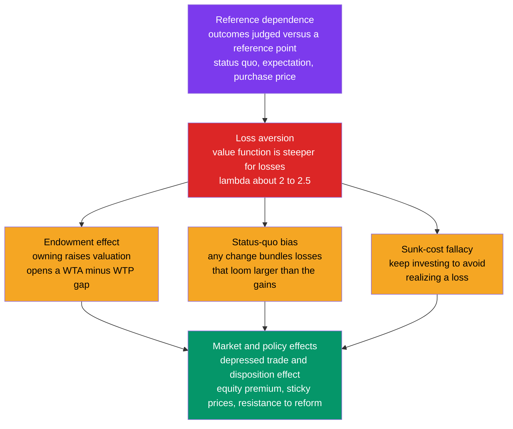

# 🪙 Loss Aversion and the Endowment Effect

> [!abstract] TL;DR
> **Loss aversion** — the finding that losses hurt about **twice** as much as equivalent gains feel good (coefficient λ ≈ 2 to 2.5) — is behavioral economics' most robust and consequential result, arising from the **steeper-for-losses** slope of prospect theory's value function. Because outcomes are judged relative to a **reference point** (reference dependence), the mere fact of *owning* something codes giving it up as a heavily-weighted loss. This produces the **endowment effect**: owners demand roughly twice what buyers will pay for the same object, opening a **WTA–WTP gap** that challenges the Coase theorem and depresses trade. The same asymmetry drives **status-quo bias**, the **sunk-cost fallacy**, the equity premium puzzle, the disposition effect, sticky prices, and stubborn resistance to change.

## Intuition

**Analogy:** You find a crisp \$20 bill on the sidewalk — a pleasant little lift to your day. On a different day you reach into your pocket and discover a \$20 bill has fallen out and is gone. The annoyance of the loss stings *more* than the delight of the find pleased you — even though it is the exact same \$20. That asymmetry is **loss aversion**: on our internal ledger, losses are written in bigger, bolder ink than gains.

This has a strange consequence. Because *losing* something you hold registers as a weighted loss, **the mere fact of owning an object makes you value it more than you would if you didn't own it.** Hand a stranger a coffee mug, wait five minutes, and ask what price they'd sell it for. They will typically demand about **double** what an equivalent stranger — offered the chance to *buy* the same mug — is willing to pay. We cling to what we have, and that quiet clinging reshapes markets, negotiations, retirement savings, and our whole appetite for change.

---

## How It Works

### Loss aversion is a slope, not a mood

In **expected-utility theory** the rational agent evaluates final *states of wealth*, so \$100 lost and \$100 gained are mirror images. Prospect theory (Kahneman & Tversky, 1979) replaces this with a **value function** defined over *changes* from a reference point, and that function is **kinked at the origin**: the curve descends more steeply into losses than it rises into gains. Formally, near the reference point the marginal value of a loss is about λ ≈ 2 to 2.5 times the marginal value of an equal gain. Loss aversion is therefore a structural property of *how the graph is bent*, not a passing emotional state. (The full value function — with its concave gains, convex losses, and probability weighting — is the subject of the companion note **Prospect_Theory**.)

### The reference point is the hinge

Nothing is a "loss" in the abstract; it is a loss *relative to some anchor*. That anchor — the **reference point** — can be the **status quo**, a **prior expectation**, a **purchase price**, or a **peer's outcome**, and whoever controls it controls what counts as gain versus loss. This is why the same objective outcome can be experienced as a gain in one framing and a loss in another (the domain of the companion note **Reference_Dependence_and_Framing**). Change the reference point and you change the sign of the outcome — and the behavior.

### Evidence that losses loom larger

- **Rejected favorable gambles.** People turn down a 50/50 bet to win \$110 or lose \$100 even though its expected value is positive. Experimentally, the potential *gain* must be roughly **twice** the potential loss before the bet is accepted — Kahneman's oft-quoted result that people need to win about \$200 to accept a risk of losing \$100. That 2:1 acceptance ratio *is* λ.
- **The disposition effect.** Investors sell winners too early and cling to losers too long, refusing to realize a paper loss (developed in the sibling **Prospect_Theory_in_Markets_Disposition_Effect**).
- **Risk-seeking to avoid losses.** In the loss domain people become gamblers, taking bad bets for a chance to break even.
- **Neural correlates.** fMRI studies (e.g., Tom, Fox, Trepel & Poldrack, 2007) find that potential losses deactivate reward-related regions *more steeply* than equivalent gains activate them — a biological echo of the behavioral asymmetry.

### From loss aversion to the endowment effect

Once you own the mug, your reference point *includes* the mug. Selling it is coded as a **loss** (weighted by λ); for a buyer, acquiring it is coded as a **gain** (weighted normally). The seller therefore demands **willingness-to-accept** (WTA) ≈ λ × value, while the buyer offers only **willingness-to-pay** (WTP) ≈ value. Standard theory says WTA and WTP should be nearly equal for small stakes; the endowment effect makes them diverge by a factor of about two. The same machinery yields **status-quo bias** (any change bundles losses that outweigh gains, so we default to inaction) and the **sunk-cost fallacy** (abandoning a project forces us to *realize* a loss, so we throw good money after bad).

### Common root and its consequences



---

## Key Concepts

### Secondary (explain it to a curious beginner)
- **Loss aversion:** losing feels worse than winning the same amount feels good — roughly twice as bad.
- **Reference point:** the "starting line" you compare outcomes against; above it is a gain, below it is a loss.
- **Endowment effect:** you value something more once it is yours, so you want more to sell it than you'd pay to buy it.
- **Status-quo bias:** a preference for leaving things as they are, because change feels like a loss.

### Undergraduate (needs some economics background)
- **The value-function kink:** loss aversion is the discontinuity in slope at the origin of prospect theory's value function; the loss branch has slope λ times steeper than the gain branch.
- **WTA–WTP gap:** the systematic wedge between willingness-to-accept (high, loss-framed) and willingness-to-pay (low, gain-framed), empirically around 2:1 for consumption goods.
- **Coase-theorem tension:** the endowment effect means the *initial allocation of a right changes its valuation*, so bargaining need not reach the allocation-independent efficient outcome the [[Coase_Theorem]] predicts.
- **Sunk-cost fallacy vs marginal thinking:** rational choice ignores unrecoverable costs; loss aversion makes us treat abandonment as *realizing* a loss, fueling escalation of commitment.

### Graduate (system-level and quantitative)
- **Parametric form:** with v(x) = x^α for gains and v(x) = −λ(−x)^β for losses (Tversky–Kahneman 1992: α = β ≈ 0.88, λ ≈ 2.25), loss aversion is the λ multiplier; the endowment ratio WTA/WTP ≈ λ when curvature is mild.
- **Myopic loss aversion (Benartzi & Thaler, 1995):** combining loss aversion with frequent portfolio evaluation reproduces the *equity premium puzzle* — the empirically large excess return investors demand to bear stock volatility.
- **Boundary conditions:** the endowment effect **shrinks or vanishes** for goods held *for exchange* (money, tokens) rather than *for use*, and for **experienced traders** (List, 2003, 2004) — evidence it is partly learnable and context-dependent.
- **Competing explanations:** ownership/attachment accounts, and **query-theory / query-order** artifacts (Johnson, Häubl & Keinan, 2007) — owners retrieve value-increasing thoughts first — challenge a pure loss-aversion reading, an active and unsettled debate.

---

## Python Demo

```python
# Loss aversion and the endowment effect, from one coefficient (lambda).
# (a) LOSS AVERSION  -> a fair 50/50 gamble is rejected; recover lambda from
#     the minimum gain needed to accept a given loss.
# (b) ENDOWMENT EFFECT -> a simulated "mug market": owners demand WTA ~ lambda*v,
#     buyers offer WTP ~ v, producing a ~2x WTA/WTP gap and collapsed trade.
import numpy as np
import matplotlib.pyplot as plt

rng = np.random.default_rng(42)

# Prospect-theory value function: concave gains, convex + STEEPER losses.
alpha, beta = 0.88, 0.88      # Tversky-Kahneman (1992) curvature
lam = 2.25                    # loss-aversion coefficient: losses ~2.25x gains

def value(x):
    x = np.asarray(x, dtype=float)
    return np.where(x >= 0, np.abs(x) ** alpha, -lam * np.abs(x) ** beta)

# ---------- (a) LOSS AVERSION: rejecting fair bets ----------
# A symmetric bet wins G (p=0.5) or loses L (p=0.5). Expected value = 0.5(G-L).
# It is accepted only if prospect value 0.5*value(G)+0.5*value(-L) >= 0.
# With a linear value function this reduces to the clean threshold G = lam * L,
# so the SLOPE of "minimum acceptable gain vs loss" recovers lambda.
losses = np.linspace(10, 200, 40)
min_gain = lam * losses                       # acceptance threshold
recovered_lambda = np.polyfit(losses, min_gain, 1)[0]

# ---------- (b) ENDOWMENT EFFECT: the mug experiment ----------
N = 4000
use_value = rng.uniform(0.5, 6.0, N)          # private consumption value ($)
is_owner = rng.random(N) < 0.5                # random endowment of the mug

# Owners code giving up the mug as a LOSS -> WTA = lam * v (loss-weighted).
# Buyers code acquiring it as a GAIN from reference 0 -> WTP = v.
WTA = lam * use_value[is_owner]
WTP = use_value[~is_owner]

# Pair owners with buyers to measure trade volume.
n = min(WTA.size, WTP.size)
owners_v, buyers_v = use_value[is_owner][:n], use_value[~is_owner][:n]
rational_trades = np.mean(buyers_v > owners_v)          # no loss aversion
endow_trades = np.mean(buyers_v >= lam * owners_v)      # WTP >= WTA

print(f"input lambda            : {lam:.2f}")
print(f"recovered lambda (slope): {recovered_lambda:.2f}")
print(f"median WTA (owners)     : ${np.median(WTA):.2f}")
print(f"median WTP (buyers)     : ${np.median(WTP):.2f}")
print(f"WTA/WTP ratio           : {np.median(WTA)/np.median(WTP):.2f}")
print(f"trade rate  rational    : {rational_trades:6.1%}")
print(f"trade rate  endowment   : {endow_trades:6.1%}")

# ---------- plots ----------
fig, ax = plt.subplots(2, 2, figsize=(12, 9))

xs = np.linspace(-100, 100, 400)
ax[0, 0].plot(xs, value(xs), color="#7c3aed", lw=2)
ax[0, 0].axhline(0, color="gray", lw=0.8); ax[0, 0].axvline(0, color="gray", lw=0.8)
ax[0, 0].plot(50, value(50), "o", color="#059669")
ax[0, 0].plot(-50, value(-50), "o", color="#dc2626")
ax[0, 0].annotate("gain of 50\nfeels modest", (50, value(50)),
                  textcoords="offset points", xytext=(8, -18), color="#059669")
ax[0, 0].annotate("loss of 50\nhurts ~2x more", (-50, value(-50)),
                  textcoords="offset points", xytext=(-72, 8), color="#dc2626")
ax[0, 0].set_title("Value function: steeper for losses (loss aversion)")
ax[0, 0].set_xlabel("outcome relative to reference"); ax[0, 0].set_ylabel("subjective value")

ax[0, 1].plot(losses, losses, "--", color="gray", label="EV-neutral  G = L")
ax[0, 1].plot(losses, min_gain, color="#dc2626", lw=2,
              label=f"accept threshold  G = lam*L  (lam~{recovered_lambda:.1f})")
ax[0, 1].fill_between(losses, losses, min_gain, color="#ffcccc", alpha=0.6,
                      label="favorable gambles REJECTED")
ax[0, 1].scatter([100], [225], color="black", zorder=5)
ax[0, 1].annotate("need ~2x the loss\nto accept the bet", (100, 225),
                  textcoords="offset points", xytext=(-150, -25))
ax[0, 1].set_title("Loss aversion: minimum gain to accept a 50/50 bet")
ax[0, 1].set_xlabel("potential loss  L"); ax[0, 1].set_ylabel("minimum acceptable gain  G")
ax[0, 1].legend(fontsize=8)

bins = np.linspace(0, 14, 40)
ax[1, 0].hist(WTP, bins=bins, alpha=0.6, color="#059669",
              label=f"WTP buyers (median ${np.median(WTP):.1f})")
ax[1, 0].hist(WTA, bins=bins, alpha=0.6, color="#dc2626",
              label=f"WTA owners (median ${np.median(WTA):.1f})")
ax[1, 0].axvline(np.median(WTP), color="#059669", ls="--")
ax[1, 0].axvline(np.median(WTA), color="#dc2626", ls="--")
ax[1, 0].set_title(f"Endowment effect: WTA/WTP gap ~ {np.median(WTA)/np.median(WTP):.1f}x")
ax[1, 0].set_xlabel("price ($)"); ax[1, 0].set_ylabel("count"); ax[1, 0].legend(fontsize=8)

ax[1, 1].bar(["rational\n(no loss aversion)", "endowment\n(loss averse)"],
             [rational_trades * 100, endow_trades * 100], color=["#059669", "#dc2626"])
ax[1, 1].set_ylabel("percent of possible trades executed")
ax[1, 1].set_title("Endowment effect depresses trading volume")
for i, v in enumerate([rational_trades * 100, endow_trades * 100]):
    ax[1, 1].text(i, v + 1, f"{v:.0f}%", ha="center")

plt.tight_layout()
plt.savefig("loss_aversion_endowment.png", dpi=110)
plt.show()
```

Running it prints a recovered λ ≈ 2.25 from the gamble slope, a median WTA roughly double the median WTP, and a trade rate that collapses from about 50% (rational) to a fraction of that once ownership is loss-coded — the endowment effect and the Coase-theorem tension in miniature.

---

## Real-World Applications

- **The equity premium puzzle.** *Myopic loss aversion* (Benartzi & Thaler) explains why stocks have historically paid a far larger return than bonds than variance alone justifies: investors who check portfolios often experience frequent paper losses, weight them by λ, and demand a steep premium to hold equities.
- **The disposition effect and sticky markets.** Loss aversion makes traders hold losers and dump winners, and makes homeowners refuse to sell below purchase price — thinning housing volume in downturns rather than clearing prices.
- **Sticky prices and wages.** Cutting a nominal wage is coded as a *loss* by workers even when real wages could fall painlessly via inflation, giving wages downward rigidity that shapes macroeconomic adjustment.
- **Choice architecture and defaults.** Because the status quo is the reference point, **defaults** are powerful: automatic-enrollment retirement plans and opt-out organ-donation registries lift participation dramatically by making inaction the desired outcome (the domain of **Nudges_and_Choice_Architecture** and its companion **Mental_Accounting**).
- **Marketing and negotiation.** *Free trials* manufacture the endowment effect — once the product feels "yours," returning it is a loss. In bargaining, every concession is felt as a loss, so skilled negotiators frame their asks as helping the other side *avoid* losses rather than *forgo* gains.
- **Insurance and subscriptions.** Loss-averse consumers over-buy low-deductible insurance and let auto-renewing subscriptions run because canceling means confronting a salient loss.

---

## Common Pitfalls

- **Confusing loss aversion with risk aversion.** Risk aversion is a dislike of *variance*; loss aversion is an *asymmetry around a reference point* that can make people risk-*seeking* to avoid a sure loss. They are distinct and can point in opposite directions.
- **Treating the reference point as fixed.** The whole effect hinges on *which* anchor is active — purchase price, a recent high, an expectation, or a peer. Framing can deliberately move it, and analyses that assume a static reference miss the mechanism.
- **Over-precision on λ.** The ~2:1 ratio is a robust *average*, not a universal constant; it varies with person, domain, stakes, and emotion. Do not treat λ = 2.25 as a law of nature.
- **Assuming the endowment effect is universal.** It **shrinks for exchange goods** (money, tokens) and **for experienced traders**, and part of it may be query-order or attachment rather than pure loss aversion. Applying it indiscriminately overstates the "stickiness" of real markets.
- **Ignoring sunk-cost thinking in yourself.** "We've already spent so much, we can't stop now" is the sunk-cost fallacy in words — a loss-aversion trap that escalates commitment to failing projects. Rational choice weighs only *future* costs and benefits.

---

## Related Concepts

- [[Prospect_Theory_and_Loss_Aversion]] — cross-vault: the full S-shaped value function, probability weighting, and the disposition effect that this note's asymmetry sits inside.
- [[Coase_Theorem]] — cross-vault: the endowment effect and WTA–WTP gap directly challenge its allocation-invariance prediction.
- [[Utility_Theory]] — cross-vault: the expected-utility benchmark (value over final wealth) that loss aversion systematically violates.
- [[Nudges_and_Choice_Architecture]] — cross-vault: defaults harness status-quo bias and loss aversion to steer behavior.
- [[Market_Anomalies_and_Bubbles]] — cross-vault: the equity premium puzzle and momentum that myopic loss aversion helps explain.
- [[Cognitive_Biases]] — cross-vault: the broader family of reference-point and framing biases.
- [[Behavioral_Economics_Psychology]] — cross-vault: the psychological parent tradition of these findings.
- [[Judgment_and_Decision_Making]] — cross-vault: the cognitive-science account of choice under risk and uncertainty.
- [[Fairness_Bargaining_and_the_Ultimatum_Game]] — cross-vault: reference-dependent fairness and concessions-as-losses in bargaining.

*Companion notes in this Behavioral Economics section (planned):* **Prospect_Theory**, **Reference_Dependence_and_Framing**, **Mental_Accounting**, and **Prospect_Theory_in_Markets_Disposition_Effect**.

---

## Review Questions

1. **(Conceptual)** Explain why loss aversion is best described as a property of the *slope* of the value function rather than as an emotion, and show how the same coefficient λ produces both the rejection of a fair 50/50 gamble and the endowment effect's WTA–WTP gap.
2. **(Scenario)** A city wants residents to switch to a new, cheaper electricity plan that is strictly better on price. Uptake is dismal despite the savings. Using reference dependence and status-quo bias, explain the inertia and design one intervention — specifying the reference point you are moving — to raise switching.
3. **(Trade-off / boundaries)** The endowment effect nearly disappears for experienced traders and for money-like "exchange" goods, and some researchers attribute part of it to query order rather than loss aversion. Given these caveats, how much should a policymaker rely on the endowment effect when predicting that people will "cling" to an initial allocation of tradeable pollution permits? Argue both sides.

---

## Sources

- Kahneman, D., Knetsch, J. L. & Thaler, R. H. (1990), "Experimental Tests of the Endowment Effect and the Coase Theorem," *Journal of Political Economy*, 98(6).
- Kahneman, D. & Tversky, A. (1979), "Prospect Theory: An Analysis of Decision under Risk," *Econometrica*, 47(2).
- Tversky, A. & Kahneman, D. (1991), "Loss Aversion in Riskless Choice: A Reference-Dependent Model," *Quarterly Journal of Economics*, 106(4).
- Benartzi, S. & Thaler, R. H. (1995), "Myopic Loss Aversion and the Equity Premium Puzzle," *Quarterly Journal of Economics*, 110(1).
- List, J. A. (2003), "Does Market Experience Eliminate Market Anomalies?," *Quarterly Journal of Economics*, 118(1).

---

#behavioral-economics #loss-aversion #endowment-effect #status-quo-bias #WTA-WTP-gap
