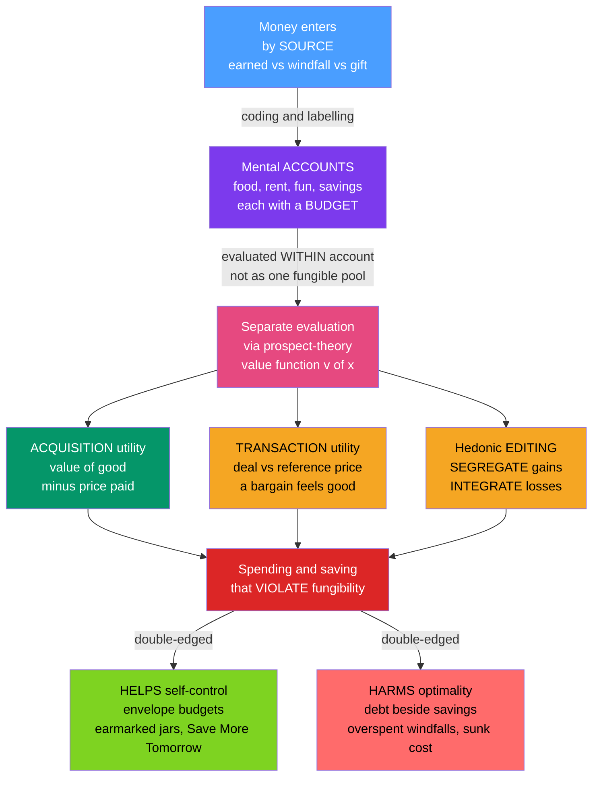

# 🧾 Mental Accounting

> [!abstract] TL;DR
> **Mental accounting** (Richard Thaler) is the set of cognitive operations by which people **code, categorize, and evaluate** economic activity — treating money as if it lived in separate mental "jars" rather than as a single fungible pool. Economically a dollar is a dollar regardless of its **source** (earned vs. windfall vs. gift), its **label** (grocery budget vs. fun budget), or its **form** (cash vs. credit); psychologically it is not. Each mental account is evaluated *separately* with a **prospect-theory value function**, which generates a signature list of "irrational" behaviors: spending windfalls more freely than earned income, driving across town to save $5 on a cheap item but not an expensive one (relative-vs-absolute framing), buying things because the **deal** feels good (transaction utility), holding low-interest savings while carrying high-interest debt, and the sunk-cost fallacy. It is **double-edged** — the same non-fungibility that undermines optimal finance becomes, when deliberately harnessed (envelope budgeting, earmarked savings jars, retirement accounts, Save More Tomorrow), one of the most powerful tools for self-control we have.

---

## Intuition

**Analogy:** Money is supposed to be **fungible** — a dollar is a dollar, wherever it comes from and whatever it is "for." A hundred dollars of salary and a hundred dollars of birthday cash buy exactly the same groceries. Yet our minds refuse to see it that way. Instead we sort money into separate mental jars: the "grocery" jar, the "fun" jar, the "this-was-a-gift-so-splurge-it" jar, the "sacred retirement" jar. We will drive across town to save $5 on a $15 calculator but not to save the same $5 on a $500 laptop. We treat a tax refund as free money to blow on a gadget while carefully guarding an identical amount of salary. We keep cash earning 1% in a savings account while carrying a balance at 22% on a credit card. Each of these violates cold economic logic — and each is completely normal.

Those mental jars are not a bug you can lecture away; they are the *architecture* of how ordinary people manage money. Thaler's insight was that the jars are **lawful**: the same jar-logic that makes us overspend a windfall also, if we build the jars on purpose, lets us save for retirement we could never manage as one undifferentiated pile of cash.

---

## How It Works

Mental accounting has three moving parts, and all three inherit their machinery from **prospect theory** — the topic of this vault section. Because outcomes are evaluated as **gains and losses relative to a reference point** (not as changes in total wealth), and because the value function is S-shaped and loss-averse, *where you file a dollar changes how much it is worth to you.*

**1. Accounts and budgets.** People open mental **accounts** (categories: food, rent, entertainment, savings) and attach **budgets** (spending limits) to each. Crucially, spending is evaluated *within* an account, not against total wealth. Running low in the "dining out" budget causes real discomfort even when the "vacation" budget is flush — a fungible agent would simply move a dollar across, but the mental books do not let it. This is why an unexpectedly expensive dinner ruins the evening while a far larger, "correctly categorized" mortgage payment does not.

**2. Transaction utility vs. acquisition utility.** Thaler decomposed the value of any purchase into two parts. **Acquisition utility** is the standard consumer-surplus term — the value of the good relative to the price paid. **Transaction utility** is the pleasure or pain of the *deal itself*, measured against a **reference price** (what you expected to pay). Transaction utility explains why people buy things on sale they do not need (the "bargain" delivers positive transaction utility even when acquisition utility is low) and refuse fair deals that merely *feel* overpriced. The famous **beer-on-the-beach** experiment nails it: people will pay far more for the identical beer fetched from a fancy resort than from a rundown grocery, because the reference price — and hence the transaction utility — is set by the seller, not the beer.

**3. Booking gains and losses — hedonic editing.** How outcomes are *filed* is chosen (often unconsciously) to maximize psychological value, given the shape of the value function:
- **Segregate gains.** Because the gain branch is concave, two separate gains are worth more than one combined gain: $v(a) + v(b) > v(a+b)$. Savor wins one at a time ("silver linings").
- **Integrate losses.** Because the loss branch is convex, one big loss hurts less than several small ones: $v(-a) + v(-b) < v(-(a+b))$. Bundle the bad news.
- **Integrate a small loss with a larger gain** — cancel a minor cost against a win so the steep loss slope near zero never bites.
- **Segregate a small gain from a larger loss** — keep the "silver lining" separate so it registers as a full, steep near-zero gain.

The same account structure explains the **sunk-cost fallacy** (a payment sits "open" in an account that must be "closed" by consuming the thing, so we use the un-refundable ticket in a blizzard), **payment depreciation** (the pain of a prepaid vacation fades, so it later feels "free"), and the **source-of-money / windfall effect** (dollars filed as "windfall" carry a higher marginal propensity to consume than dollars filed as "salary" — the **house-money effect**, where gamblers take bigger risks with their winnings than with their stake).



---

## Key Concepts

### Secondary (intuition level)
- **Money is not fungible in the mind.** The same dollar is treated differently depending on its source, its label, and its form. A refund feels like "free money"; salary feels earned and guarded.
- **The deal is part of the price.** We feel good buying on sale and cheated paying "too much" for the same item, even when the item's usefulness never changed.
- **We judge savings as percentages, not dollars.** Saving $5 feels huge on a $15 purchase and trivial on a $500 one, so we chase the discount on cheap things and shrug at big-ticket ones.
- **Windfalls get spent; wages get saved.** A bonus or gambling win is treated as house money to be enjoyed; a paycheck is defended.

### Undergraduate (formal level)
- **Fungibility violation.** Standard theory: consumption depends only on total wealth/permanent income; the **marginal propensity to consume (MPC)** out of a dollar is independent of its source. Mental accounting predicts MPC differs by account — high for windfalls, low for wealth/pension accounts — violating the **permanent-income hypothesis**.
- **Value decomposition.** Total value of a purchase = **acquisition utility** $\;u_a = v(\text{good}) - p\;$ plus **transaction utility** $\;u_t = v(p^{*} - p)\;$, where $p^{*}$ is the reference (expected/"fair") price. A sale raises $u_t$ without touching $u_a$.
- **Hedonic editing rules** follow directly from the prospect-theory value function $v(x)=x^{\alpha}$ for $x\ge 0$ and $v(x)=-\lambda(-x)^{\beta}$ for $x<0$ with $\alpha,\beta<1,\ \lambda>1$: concavity in gains $\Rightarrow$ **segregate gains**; convexity in losses $\Rightarrow$ **integrate losses**; $\lambda>1$ (loss aversion) drives the mixed-outcome rules.
- **Budget rigidity.** Spending is constrained per account; a slack "vacation" budget cannot painlessly subsidize an over-drawn "groceries" budget, generating consumption distortions.

### Graduate (frontier level)
- **The two-stage editing/evaluation model.** Prospect theory's **editing phase** (coding, combining, segregating, cancelling) *is* the accounting operation; mental accounting supplies the rule for *which* outcomes get bracketed together — i.e., how the reference point and the "brackets" (**narrow vs. broad bracketing**, Read-Loewenstein-Rabin) are set. Narrow bracketing plus loss aversion generates the equity-premium-scale phenomenon of **myopic loss aversion** (Benartzi-Thaler).
- **Choice bracketing and dynamic inconsistency.** Whether repeated gambles or expenses are evaluated one-at-a-time or as a portfolio changes revealed risk attitudes and can be exploited or corrected by design.
- **Payment decoupling and depreciation.** Prospective accounting means the timing of payment relative to consumption (prepay, pay-as-you-go, credit) alters felt cost; decoupling payment from consumption (flat-rate plans, prepaid cards) systematically raises consumption.
- **Policy leverage.** Because MPC is source-dependent, the *labeling* of transfers matters for stimulus design — a "bonus" is spent, a "rebate/refund" partly saved, an identical sum framed as replacing lost income behaves differently again (the **behavioral public finance** of stimulus checks).

---

## Python Demo

```python
# Mental accounting: two violations of the fungibility of money.
#   (a) RELATIVE-vs-ABSOLUTE savings anomaly (the jacket/calculator experiment):
#       people travel to save $5 on a cheap item but NOT the same $5 on an
#       expensive one, because they evaluate the saving RELATIVE to the item's
#       price (a percentage/mental-accounting frame), not in absolute dollars.
#   (b) HEDONIC EDITING + WINDFALL effect: prospect theory predicts people
#       SEGREGATE gains and INTEGRATE losses, and spend "windfall" money more
#       freely than "earned" money (different marginal propensity to consume).
import numpy as np
import matplotlib.pyplot as plt

sigmoid = lambda z: 1.0 / (1.0 + np.exp(-z))
logit   = lambda p: np.log(p / (1.0 - p))

# ----------------------------------------------------------------------
# (a) Relative-vs-absolute savings anomaly
# Classic Tversky-Kahneman data: save $5 by a 20-minute drive.
#   calculator: $15 -> $10, about 68% will travel
#   jacket:     $125 -> $120, about 29% will travel
# A RATIONAL agent compares the ABSOLUTE $5 saving to the fixed travel cost,
# so willingness-to-travel is FLAT in the item's price. The mental-accounting
# agent judges the saving as a FRACTION of the price -> steeply declining.
# ----------------------------------------------------------------------
saving = 5.0
prices = np.linspace(10.0, 500.0, 400)
rel    = saving / prices                       # saving as a fraction of price

# Calibrate the percentage-frame logistic to the two empirical anchor points.
r1, p1 = saving / 15.0,  0.68
r2, p2 = saving / 125.0, 0.29
k = (logit(p1) - logit(p2)) / (r1 - r2)
c = logit(p1) - k * r1
P_relative = sigmoid(k * rel + c)              # mental-accounting prediction
P_absolute = np.full_like(prices, 0.90)        # rational: $5 > travel cost -> ~always

# ----------------------------------------------------------------------
# (b) Hedonic editing via the prospect-theory value function, plus windfalls
# ----------------------------------------------------------------------
alpha, beta, lam = 0.88, 0.88, 2.25            # Tversky-Kahneman 1992 estimates
def v(x):
    x = np.asarray(x, dtype=float)
    return np.where(x >= 0, np.power(np.abs(x), alpha),
                    -lam * np.power(np.abs(x), beta))

g = 50.0                                        # two gains / losses of $50 each
seg_gain = float(v(g) + v(g))                   # SEGREGATE two gains
int_gain = float(v(2 * g))                      # INTEGRATE into one gain
seg_loss = float(v(-g) + v(-g))                 # SEGREGATE two losses
int_loss = float(v(-2 * g))                     # INTEGRATE into one loss

# Windfall vs earned: illustrative marginal propensity to consume by ACCOUNT.
mpc = {"Earned\nincome": 0.35, "Tax\nrefund": 0.65, "Gambling\nwinnings": 0.85}

print("(a) Relative-vs-absolute savings anomaly")
print(f"    P(travel) at $15 item : {sigmoid(k*r1 + c):.2f}  (empirical ~0.68)")
print(f"    P(travel) at $125 item: {sigmoid(k*r2 + c):.2f}  (empirical ~0.29)")
print(f"    Absolute frame is flat at {P_absolute[0]:.2f} regardless of price.\n")
print("(b) Hedonic editing (subjective value units)")
print(f"    GAINS  : segregate {seg_gain:6.2f}  >  integrate {int_gain:6.2f}"
      f"  -> savor wins separately")
print(f"    LOSSES : segregate {seg_loss:6.2f}  <  integrate {int_loss:6.2f}"
      f"  -> bundle losses to soften the blow")

# ----------------------------------------------------------------------
# PLOTS
# ----------------------------------------------------------------------
fig, (ax1, ax2, ax3) = plt.subplots(1, 3, figsize=(16, 5))

# (a) willingness to travel vs base price
ax1.plot(prices, P_relative, color="#7c3aed", lw=2.6,
         label="mental-accounting frame\n(saving as % of price)")
ax1.plot(prices, P_absolute, "--", color="#059669", lw=2.2,
         label="rational absolute frame\n($5 saved is $5, always)")
ax1.scatter([15, 125], [p1, p2], color="#dc2626", zorder=5, s=70,
            label="classic experiment data")
ax1.annotate("$15 calculator", xy=(15, p1), xytext=(70, 0.80), fontsize=8,
             arrowprops=dict(arrowstyle="->", color="black"))
ax1.annotate("$125 jacket", xy=(125, p2), xytext=(180, 0.42), fontsize=8,
             arrowprops=dict(arrowstyle="->", color="black"))
ax1.set_xlabel("item base price ($)"); ax1.set_ylabel("P(travel to save $5)")
ax1.set_title("(a) Same $5 saving, different choice"); ax1.set_ylim(0, 1)
ax1.legend(fontsize=8, loc="upper right"); ax1.grid(alpha=0.3)

# (b) hedonic editing: segregate gains, integrate losses
labels = ["Gains", "Losses"]
xpos = np.arange(2)
seg = [seg_gain, seg_loss]
integ = [int_gain, int_loss]
ax2.bar(xpos - 0.2, seg,   width=0.4, color="#4a9eff", label="segregated (booked apart)")
ax2.bar(xpos + 0.2, integ, width=0.4, color="#f5a623", label="integrated (booked together)")
ax2.axhline(0, color="black", lw=1)
ax2.set_xticks(xpos); ax2.set_xticklabels(labels)
ax2.set_ylabel("subjective value  v(.)")
ax2.set_title("(b) Hedonic editing\nsegregate gains, integrate losses")
ax2.legend(fontsize=8, loc="lower left"); ax2.grid(alpha=0.3, axis="y")

# (c) windfall effect: marginal propensity to consume by source of money
names = list(mpc.keys()); vals = list(mpc.values())
colors = ["#059669", "#f5a623", "#dc2626"]
ax3.bar(names, vals, color=colors)
for i, val in enumerate(vals):
    ax3.text(i, val + 0.02, f"{val:.2f}", ha="center", fontsize=9)
ax3.set_ylabel("marginal propensity to consume")
ax3.set_title("(c) Fungibility violated\nwindfalls spent more freely")
ax3.set_ylim(0, 1); ax3.grid(alpha=0.3, axis="y")

plt.tight_layout()
plt.savefig("mental_accounting.png", dpi=120)
print("\nSaved figure: mental_accounting.png")
```

Running it prints the anomaly: the percentage frame reproduces the classic split (about 0.68 of people travel for the $15 calculator, about 0.29 for the $125 jacket) while the rational absolute frame stays flat — because $5 is $5. Panel (a) shows the mental-accounting curve collapsing as the base price rises, meeting the two real data points, whereas the rational line ignores the price entirely. Panel (b) shows the hedonic-editing rules falling straight out of the value function: two segregated gains beat one combined gain (savor separately), while one integrated loss hurts less than two segregated ones (bundle the bad news). Panel (c) shows the fungibility violation in one picture — the marginal propensity to consume rising steeply from earned income to refund to gambling winnings, even though a dollar is a dollar.

---

## Real-World Applications

- **Household budgeting and self-control.** Envelope budgeting, separate "vacation" and "emergency" savings jars, and apps like YNAB deliberately manufacture non-fungibility so that earmarked money resists raiding — turning a bias into a commitment device. See [[Budgeting_and_Saving]].
- **Retirement policy — Save More Tomorrow.** Thaler and Benartzi's program pre-commits workers to raise 401(k) contributions out of *future* raises, exploiting the "future money" account and payment-timing effects to lift savings rates dramatically. See [[Retirement_Planning_and_FIRE]] and the sibling note **Behavioral_Economics_in_Health_and_Retirement**.
- **Retail and pricing.** "Was $200, now $99," anchoring reference prices, "free shipping" thresholds, and loss-leader deals all engineer **transaction utility** so a purchase feels like a win independent of the item's real value. See [[Behavioral_Finance]].
- **Fiscal stimulus design.** Because MPC is source-dependent, whether a transfer is framed as a "bonus," a "rebate," or "replacing lost income" changes how much gets spent — a live lever in stimulus-check design and behavioral public finance.
- **Consumer credit traps.** The credit-card "account" is psychologically decoupled from the cash "account," so people simultaneously hold low-yield savings and revolve high-interest debt — a fungibility failure that costs households real money. See [[Debt_and_Credit_Management]].

---

## Common Pitfalls

- **Confusing mental accounting with mere budgeting.** Budgeting is a deliberate tool; mental accounting is the *automatic* cognitive tendency that budgeting harnesses. The bias operates whether or not you keep a spreadsheet.
- **Assuming the jars are always harmful.** They are double-edged. The very non-fungibility that makes people overspend a bonus is what lets a "sacred" retirement account survive decades of temptation. Good design copies the jars on purpose.
- **Reading transaction utility as irrational noise.** The pleasure of a good deal is a real component of experienced value; ignoring it mis-predicts demand (people forgo positive-surplus purchases that "feel overpriced" and make negative-surplus ones that are "steals").
- **Treating the windfall/house-money effect as generosity.** It is a *framing* of the source, not a change in wealth. The same dollar re-labeled as "earned" is guarded again — evidence it is the account, not the amount, doing the work.
- **Over-precise hedonic-editing predictions.** Whether people succeed in segregating or integrating outcomes to their own advantage is itself imperfect; the rules describe the *optimal* editing, not guaranteed behavior.
- **Ignoring bracketing.** Narrow bracketing (evaluating each gamble/expense alone) versus broad bracketing (as a portfolio) can flip risk attitudes; the same person is more loss-averse when outcomes are booked one at a time.

---

## Related Concepts

Mental accounting sits in this vault's **Prospect Theory and Risk** section and depends on it directly. Its not-yet-written siblings extend it: **Prospect_Theory** (the value function and reference dependence that make *where* a dollar is filed change its worth), **Loss_Aversion_and_the_Endowment_Effect** (the steep loss branch that drives loss-integration and the sunk-cost fallacy), **Reference_Dependence_and_Framing** (which sets the reference price behind transaction utility), **Present_Bias_and_Self_Control** (why earmarked accounts work as commitment devices), and **Behavioral_Economics_in_Health_and_Retirement** (Save More Tomorrow and automatic enrollment as applied mental accounting).

Verified links:
- [[Prospect_Theory_and_Loss_Aversion]] — cross-vault (Finance): the S-shaped, loss-averse value function that each mental account is evaluated with.
- [[Expected_Utility_Theory_and_Its_Violations]] — same vault: the fungible-wealth benchmark whose independence from source/label mental accounting violates.
- [[Utility_Theory]] — cross-vault (Microeconomics): the standard consumer-surplus notion that acquisition utility formalizes.
- [[Budget_Constraint]] — cross-vault (Microeconomics): the single fungible budget line mental "budgets" fragment into rigid per-account limits.
- [[Behavioral_Finance]] — cross-vault (Finance): where mental accounting reshapes investor behavior (house money, disposition effect, dividend preference).
- [[Cognitive_Biases_in_Investing]] — cross-vault (Finance): mental accounting as a catalogued investing bias.
- [[Nudges_and_Choice_Architecture]] — cross-vault (Finance): designing accounts and defaults that harness non-fungibility for good.
- [[Budgeting_and_Saving]] — cross-vault (Finance): envelope systems and earmarked jars as applied mental accounting.
- [[Debt_and_Credit_Management]] — cross-vault (Finance): the savings-beside-debt paradox mental accounting explains.
- [[Retirement_Planning_and_FIRE]] — cross-vault (Finance): retirement accounts as commitment devices.
- [[Behavioral_Economics_Psychology]] — cross-vault (Psychology): the psychology-of-money view of the same phenomenon.
- [[Problem_Solving_and_Decision_Making]] — cross-vault (Psychology): the cognitive-process account of coding and evaluating choices.
- [[Judgment_and_Decision_Making]] — cross-vault (Cognitive Science): the broader JDM framework mental accounting lives in.
- [[Ricardian_Equivalence]] — cross-vault (Macroeconomics): a consumption-smoothing benchmark that source-dependent MPC (windfall spending) violates.
- [[Heuristics_and_Biases_Overview]] — same vault: the wider catalogue of systematic deviations this belongs to.

---

## Review Questions

1. **(Secondary)** You get a $500 tax refund and, in the same month, receive a $500 raise built into your paycheck. Standard economics says a dollar is a dollar, so both should affect your spending identically. Explain, using the idea of mental accounts and the "source of money," why most people spend the refund far more freely — and why a tax refund is arguably the *worst* windfall to celebrate.
2. **(Undergraduate)** Using the prospect-theory value function $v(x)=x^{0.88}$ for gains and $v(x)=-2.25(-x)^{0.88}$ for losses, show algebraically why people prefer to **segregate** two $50 gains but **integrate** two $50 losses. Then explain how the same function predicts you should mentally *bundle* a small parking ticket with a large lottery win but *keep separate* a small refund from a large medical bill.
3. **(Graduate)** A retail bank wants to raise customer savings without changing interest rates or income. Design an intervention that exploits mental accounting (accounts, budgets, payment timing, bracketing) and predict its effect on the marginal propensity to consume. Then argue the other side: identify one way your design could *harm* customers by entrenching a fungibility violation (for example, savings held beside revolving debt), and how you would mitigate it.

---

## Sources

- Thaler, R. H. (1985), "Mental Accounting and Consumer Choice," *Marketing Science* 4(3), 199-214 (introduces acquisition vs. transaction utility and the beer-on-the-beach example).
- Thaler, R. H. (1999), "Mental Accounting Matters," *Journal of Behavioral Decision Making* 12(3), 183-206 (the definitive synthesis: accounts, budgets, hedonic editing, sunk costs).
- Tversky, A. & Kahneman, D. (1981), "The Framing of Decisions and the Psychology of Choice," *Science* 211(4481), 453-458 (the jacket/calculator relative-vs-absolute experiment).
- Kahneman, D. & Tversky, A. (1979), "Prospect Theory: An Analysis of Decision under Risk," *Econometrica* 47(2), 263-291 (the value function underlying hedonic editing).
- Thaler, R. H. & Benartzi, S. (2004), "Save More Tomorrow: Using Behavioral Economics to Increase Employee Saving," *Journal of Political Economy* 112(S1), S164-S187 (mental accounting harnessed for retirement saving).

#behavioral-economics #mental-accounting #fungibility #thaler #transaction-utility
