# 🎰 Probability Weighting and the Certainty Effect

> [!abstract] TL;DR
> **Probability weighting** is the second pillar of **prospect theory** (the first is the S-shaped value function): people do *not* plug objective probabilities into decisions linearly. They pass them through a nonlinear **weighting function** $w(p)$ that produces **decision weights** — and the resulting curve is an **inverse-S**. Small probabilities are **overweighted** ($w(p) > p$: a one-in-a-million chance looms much larger than one in a million), moderate-to-large probabilities are **underweighted** ($w(p) < p$), and the two regimes cross over around $p \approx 0.3$–$0.4$. Two special zones dominate: the **certainty effect** (the jump from $0.99$ to a *sure* $1.00$ is valued far more than the jump from $0.10$ to $0.11$) and its mirror the **possibility effect** (the jump from *impossible* to barely possible carries extra hope or dread). This single distortion cracks puzzles expected utility cannot: it explains why the same person **buys lottery tickets and insurance**, resolves the **Allais paradox**, and generates prospect theory's **fourfold pattern** of risk attitudes. Crucially, weighting is about how probabilities enter *choice* (decision weights), not necessarily distorted *beliefs*.

## Intuition — analogy FIRST

Watch an ordinary person on payday. They buy a lottery ticket — betting a dollar that the near-impossible jackpot will land on *them*. On the way home they renew their home insurance — paying a premium to protect against a fire that almost certainly will not happen. Both purchases lose money on average. And they are *opposite* bets: one wagers that the improbable good thing will happen, the other pays to be shielded from the improbable bad thing. How can one brain want both?

Because we do not treat probabilities the way arithmetic says we should. A one-in-a-million jackpot does not *feel* like one in a million; the sliver of hope gets magnified until it feels genuinely *possible*. The same magnification makes a one-in-a-thousand house fire feel worth insuring against. We **overweight tiny probabilities** at both ends of fortune — so we chase long-shot gains *and* flee long-shot losses.

Now feel the other distortion. Moving a bet from a 99 percent chance to a *dead-certain* 100 percent feels enormously more valuable than moving it from 10 percent to 11 percent — even though both add exactly one percentage point. Certainty has a psychological premium; the last sliver of doubt is worth more than any interior sliver. That extra weight on the sure thing is the **certainty effect**, and it is the engine behind the most famous violation of rational choice, the Allais paradox. The lesson: objective odds get bent before they ever reach the decision — inflated at the rare and the certain, deflated in the merely likely middle.

---

## How It Works

Expected utility theory says a gamble's value is $\sum_i p_i\,u(x_i)$ — each outcome's utility weighted by its *true* probability. Prospect theory keeps the sum but replaces $p_i$ with a **decision weight** $\pi_i = w(p_i)$: value becomes $\sum_i w(p_i)\,v(x_i)$, where $v$ is the reference-dependent value function and $w$ is the **probability weighting function**. The whole departure from rationality lives in the shape of $w$.

**Step 1 — Diminishing sensitivity from two anchors.** Perception is sharpest near reference points and dulls in between (Weber-Fechner logic applied to chance). The natural anchors are **impossibility** ($p=0$) and **certainty** ($p=1$). So sensitivity to probability changes is *high* near 0 and near 1 and *low* in the middle. That single principle bends the identity line $w(p)=p$ into a curve.

**Step 2 — The inverse-S shape.** Diminishing sensitivity produces:
1. **Overweighting of small $p$** — $w(p) > p$. A 0.001 chance is treated as if it were meaningfully larger (roughly 0.01–0.02). This is the **possibility effect**: the leap from "can't happen" to "might happen" gets extra weight (hope for a jackpot, dread of a crash).
2. **Underweighting of moderate-to-large $p$** — $w(p) < p$. A genuinely good 80 percent chance is treated as if it were smaller, because it sits in the insensitive middle.
3. **A crossover** where $w(p)=p$, empirically around $p \approx 0.3$–$0.4$.
4. **The certainty effect near $p=1$** — the curve rises steeply into the certainty anchor, so the final step to a *sure thing* carries a disproportionate jump in weight.

**Step 3 — Explaining gambling and insurance together.** Overweighting small $p$ makes a tiny probability of a *large gain* feel valuable enough to pay for (buy the lottery ticket — **risk-seeking for unlikely gains**) *and* a tiny probability of a *large loss* feel threatening enough to pay to avoid (buy insurance — **risk-averse for unlikely losses**). One distortion, two behaviors expected utility could never reconcile with a single utility curve.

**Step 4 — Resolving Allais.** The Allais choices differ only by a common component that expected utility's independence axiom says must cancel. But one pair contains a *certain* outcome. The certainty effect overweights it, so the "cancelable" component does not cancel — and the preference reverses. Weighting rationalizes the "irrational" pattern.

**Step 5 — The fourfold pattern.** Overlay the value function's curvature (concave for gains, convex for losses) on nonlinear weighting and you get four risk attitudes at once: risk-averse for likely gains and unlikely losses, risk-seeking for unlikely gains (lotteries) and likely losses. Probability weighting supplies the two *unlikely-outcome* corners.

**Step 6 — Cumulative weighting (the modern fix).** Applying $w$ to *individual* probabilities can make the original 1979 theory violate stochastic dominance. **Cumulative prospect theory** (Tversky-Kahneman 1992), building on Quiggin's **rank-dependent utility**, instead weights *cumulative* (rank-ordered) probabilities — preserving dominance while keeping the inverse-S. This is the rigorous form used today.

```mermaid
graph TD
    P["Objective probability p<br/>the true odds"]
    P -->|"nonlinear weighting w of p"| W["Decision weight w of p<br/>how p enters CHOICE<br/>not necessarily belief"]
    W --> SHAPE["Inverse-S shape<br/>diminishing sensitivity<br/>from anchors 0 and 1"]

    SHAPE --> SMALL["SMALL p OVERweighted<br/>w of p greater than p<br/>possibility effect near 0"]
    SHAPE --> MID["MODERATE-LARGE p UNDERweighted<br/>w of p less than p<br/>crossover near 0.35"]
    SHAPE --> CERT["CERTAINTY effect near 1<br/>step from 0.99 to sure 1.00<br/>overweighted"]

    SMALL --> LOT["Buy LOTTERY tickets<br/>overvalue tiny chance of big GAIN<br/>risk-seeking"]
    SMALL --> INS["Buy INSURANCE<br/>overvalue tiny chance of big LOSS<br/>risk-averse"]
    CERT --> ALL["ALLAIS paradox<br/>sure thing overweighted<br/>preference reversal"]

    LOT --> FOUR["FOURFOLD pattern<br/>of risk attitudes"]
    INS --> FOUR
    ALL --> FOUR

    style P fill:#4a9eff,color:#fff
    style W fill:#7c3aed,color:#fff
    style SHAPE fill:#e64980,color:#fff
    style SMALL fill:#059669,color:#fff
    style MID fill:#f5a623,color:#000
    style CERT fill:#dc2626,color:#fff
    style LOT fill:#7ed321,color:#000
    style INS fill:#7ed321,color:#000
    style ALL fill:#ff6b6b,color:#000
    style FOUR fill:#f5a623,color:#000
```



---

## Key Concepts / Details

### Secondary (intuition level)
- **We bend the odds before we decide.** A tiny chance feels bigger than it is; a great chance feels smaller than it is; a *sure* thing feels specially valuable.
- **Lottery and insurance are the same reflex.** Both come from overweighting rare events — one a rare *win*, the other a rare *loss*.
- **The certainty effect.** Removing the *last* one percent of risk feels worth far more than removing an interior one percent. We crave the sure thing.
- **The possibility effect.** Going from "impossible" to "just barely possible" opens a door — hope or dread rushes in out of proportion to the actual odds.

### Undergraduate (formal level)
- **Value with decision weights:** prospect theory evaluates a prospect as $V = \sum_i w(p_i)\,v(x_i)$, replacing true probabilities $p_i$ with **decision weights** $w(p_i)$ and utility $u$ with a reference-dependent **value function** $v$.
- **Tversky-Kahneman weighting function:** $w(p) = \dfrac{p^{\gamma}}{\left(p^{\gamma} + (1-p)^{\gamma}\right)^{1/\gamma}}$, with $\gamma \approx 0.61$ for gains ($0.69$ for losses). $\gamma < 1$ produces the inverse-S; $\gamma = 1$ recovers linearity ($w(p)=p$).
- **Key inequalities:** $w(p) > p$ for small $p$ (overweighting), $w(p) < p$ for moderate/large $p$ (underweighting), single interior crossover near $p \approx 0.35$; and $w$ is **not** a probability (weights need not sum to 1).
- **Certainty effect, formalized:** the marginal weight $w(1) - w(1-\epsilon)$ is large relative to an equal interior step $w(q+\epsilon) - w(q)$ — steepness of $w$ near the certainty anchor.
- **Prelec's one-parameter form:** $w(p) = \exp\!\left(-(-\ln p)^{\alpha}\right)$, $\alpha < 1$, has a fixed point at $p = 1/e \approx 0.37$ — an alternative axiomatized weighting curve.

### Graduate (frontier level)
- **Rank-dependent / cumulative weighting:** applying $w$ to individual probabilities can violate first-order stochastic dominance. **Rank-dependent utility** (Quiggin 1982) and **cumulative prospect theory** (Tversky-Kahneman 1992) instead transform the *cumulative* distribution, so each outcome's decision weight is a *difference* of transformed cumulative probabilities, $\pi_i = w(P_{\ge i}) - w(P_{> i})$. This restores dominance while preserving the inverse-S.
- **Sign-dependence:** gains and losses use separate weighting functions $w^+$ and $w^-$ over their respective cumulative tails, allowing distinct curvature by domain.
- **Decision weights are not beliefs.** Weighting concerns how *known or judged* probabilities enter *choice*; it is analytically separate from biased probability *judgment* (see availability and representativeness, which distort the *estimate* of $p$ itself). A person can state the odds correctly and still weight them nonlinearly.
- **Parametric identification:** the elevation (overall optimism/pessimism) and curvature (sensitivity) of $w$ are separately identifiable (Gonzalez-Wu 1999); two parameters cleanly map to the two psychological primitives.
- **The fourfold pattern as a signature:** risk-averse for high-probability gains and low-probability losses; risk-seeking for low-probability gains and high-probability losses. The low-probability corners require nonlinear weighting — no single monotone utility over final wealth can produce them.

---

## Python Demo

```python
# Probability weighting made numerical:
#   (a) plot the Tversky-Kahneman weighting function w(p) -> the inverse-S,
#       overweighting small p, a crossover near 0.35, underweighting large p;
#   (b) USE it to explain phenomena:
#       - one distortion -> BUY LOTTERY *and* BUY INSURANCE (small p overweighted);
#       - the CERTAINTY / POSSIBILITY effect (why 0.99->1.00 beats 0.10->0.11);
#       - the fourfold pattern of risk attitudes.
import numpy as np
import matplotlib.pyplot as plt

# --------------------------------------------------------------------------
# Tversky-Kahneman (1992) one-parameter probability weighting function.
# w(p) turns an OBJECTIVE probability p into a DECISION WEIGHT.
#   gamma < 1  -> inverse-S ;  gamma = 1 -> linear (w(p) = p, no distortion).
# --------------------------------------------------------------------------
def tk_weight(p, gamma=0.61):
    p = np.asarray(p, dtype=float)
    num = p**gamma
    den = (p**gamma + (1.0 - p)**gamma)**(1.0 / gamma)
    return num / den

p  = np.linspace(0.0, 1.0, 2001)
w  = tk_weight(p)

# Crossover: interior point where w(p) == p  (over-weight below, under above)
diff = w - p
sign_change = np.where(np.sign(diff[:-1]) != np.sign(diff[1:]))[0]
interior = sign_change[(p[sign_change] > 0.02) & (p[sign_change] < 0.98)]
p_cross  = p[interior[0]] if len(interior) else float("nan")
print(f"Crossover  w(p) = p  at  p ~ {p_cross:.3f}"
      "   (overweight below, underweight above)\n")

# --------------------------------------------------------------------------
# (1) GAMBLING + INSURANCE from ONE distortion: small p is overweighted.
#     The SAME multiplier explains buying a lottery ticket (tiny p of big GAIN)
#     and buying insurance (tiny p of big LOSS).
# --------------------------------------------------------------------------
tiny = 0.001
mult = tk_weight(tiny) / tiny
print("(1) Overweighting of small probabilities")
print(f"    w({tiny}) = {tk_weight(tiny):.4f}  ->  weighted as if ~{mult:.1f}x its true odds")
print("    Same pull -> BUY LOTTERY (rare big gain) AND BUY INSURANCE (rare big loss).\n")

# --------------------------------------------------------------------------
# (2) CERTAINTY vs POSSIBILITY vs interior: the marginal decision weight of a
#     one-percentage-point change depends WILDLY on WHERE it sits.
# --------------------------------------------------------------------------
pairs  = [(0.00, 0.01), (0.10, 0.11), (0.50, 0.51), (0.99, 1.00)]
labels, dW = [], []
for a, b in pairs:
    dw = float(tk_weight(b) - tk_weight(a))
    dW.append(dw); labels.append(f"{a:.2f}->{b:.2f}")
print("(2) Decision weight of a +1 percentage-point change:")
for lab, dw in zip(labels, dW):
    print(f"    d w  {lab} = {dw:.4f}")
ratio = dW[3] / dW[1]
print(f"    -> the CERTAINTY step 0.99->1.00 carries ~{ratio:.0f}x the weight of the "
      "interior step 0.10->0.11 (the Allais certainty effect).\n")

# --------------------------------------------------------------------------
# PLOTS: 2x2 -> weighting function, marginal weights, gamble/insurance, fourfold
# --------------------------------------------------------------------------
fig, ax = plt.subplots(2, 2, figsize=(13.5, 10))

# (a) the weighting function w(p) and the inverse-S
ax0 = ax[0, 0]
ax0.plot(p, p, "--", color="#888", lw=1.6, label="w(p) = p  (expected utility)")
ax0.plot(p, w, color="#7c3aed", lw=2.6, label="w(p)  Tversky-Kahneman, gamma=0.61")
ax0.fill_between(p, p, w, where=(w > p), color="#059669", alpha=0.18,
                 label="OVERweight small p")
ax0.fill_between(p, p, w, where=(w < p), color="#dc2626", alpha=0.14,
                 label="UNDERweight moderate-large p")
ax0.axvline(p_cross, color="#e64980", ls=":", lw=1.6)
ax0.scatter([p_cross], [p_cross], color="#e64980", zorder=5, s=55)
ax0.annotate(f"crossover ~{p_cross:.2f}", (p_cross, p_cross),
             textcoords="offset points", xytext=(8, -22), fontsize=9, color="#e64980")
ax0.annotate("certainty effect\n(steep into p=1)", (0.90, tk_weight(0.90)),
             textcoords="offset points", xytext=(-120, 20), fontsize=8.5, color="#dc2626",
             arrowprops=dict(arrowstyle="->", color="#dc2626"))
ax0.set_xlabel("objective probability p"); ax0.set_ylabel("decision weight w(p)")
ax0.set_title("(a) The inverse-S probability weighting function")
ax0.legend(fontsize=8, loc="upper left"); ax0.grid(alpha=0.3)
ax0.set_xlim(0, 1); ax0.set_ylim(0, 1)

# (b) marginal weight of a +1pp change -> possibility & certainty dominate
ax1 = ax[0, 1]
colors = ["#7ed321", "#f5a623", "#f5a623", "#dc2626"]
bars = ax1.bar(labels, dW, color=colors, edgecolor="black")
ax1.axhline(0.01, color="#888", ls="--", lw=1.2, label="a linear weighter's +1pp = 0.01")
ax1.set_ylabel("change in decision weight for +1 percentage point")
ax1.set_title("(b) Same +1pp is weighted VERY differently\n(possibility & certainty edges dominate)")
for bar, dw in zip(bars, dW):
    ax1.text(bar.get_x() + bar.get_width()/2, dw + 0.002, f"{dw:.3f}",
             ha="center", fontsize=9)
ax1.legend(fontsize=8); ax1.grid(alpha=0.3, axis="y")

# (c) gambling + insurance: decision-weight multiple w(p)/p for small p
ax2 = ax[1, 0]
ps = np.array([0.0005, 0.001, 0.005, 0.01, 0.05, 0.10])
multiples = tk_weight(ps) / ps
ax2.plot(ps, multiples, "o-", color="#7c3aed", lw=2.2, ms=7)
ax2.axhline(1.0, color="#888", ls="--", lw=1.4, label="no distortion (w(p)=p)")
for xp, m in zip(ps, multiples):
    ax2.annotate(f"{m:.1f}x", (xp, m), textcoords="offset points",
                 xytext=(0, 8), fontsize=8, ha="center")
ax2.set_xscale("log")
ax2.set_xlabel("true probability p (log scale)")
ax2.set_ylabel("weight multiple  w(p) / p")
ax2.set_title("(c) Small p overweighted many-fold\n-> LOTTERY (rare gain) AND INSURANCE (rare loss)")
ax2.legend(fontsize=8); ax2.grid(alpha=0.3, which="both")

# (d) the fourfold pattern of risk attitudes (weighting x value curvature)
ax3 = ax[1, 1]
ax3.set_xlim(0, 2); ax3.set_ylim(0, 2); ax3.axis("off")
ax3.set_title("(d) Fourfold pattern of risk attitudes")
cells = {
    (0, 1): ("LOW-p GAINS", "RISK-SEEKING", "buy the lottery", "#7ed321"),
    (1, 1): ("HIGH-p GAINS", "RISK-AVERSE", "lock in a sure gain", "#4a9eff"),
    (0, 0): ("LOW-p LOSSES", "RISK-AVERSE", "buy insurance", "#4a9eff"),
    (1, 0): ("HIGH-p LOSSES", "RISK-SEEKING", "gamble to avoid sure loss", "#dc2626"),
}
for (cx, cy), (head, att, ex, col) in cells.items():
    ax3.add_patch(plt.Rectangle((cx, cy), 1, 1, facecolor=col, alpha=0.22,
                                edgecolor="black"))
    ax3.text(cx + 0.5, cy + 0.72, head, ha="center", fontsize=9, weight="bold")
    ax3.text(cx + 0.5, cy + 0.48, att, ha="center", fontsize=10, color=col, weight="bold")
    ax3.text(cx + 0.5, cy + 0.24, ex, ha="center", fontsize=8.5, style="italic")
ax3.text(1.0, 2.06, "columns: probability   |   rows: gain (top) vs loss (bottom)",
         ha="center", fontsize=8, color="#555")

plt.tight_layout()
plt.savefig("probability_weighting_and_certainty_effect.png", dpi=120)
print("Saved figure: probability_weighting_and_certainty_effect.png")
```

Running it prints the crossover near $p \approx 0.34$, the small-probability multiplier (a 0.001 chance is weighted like roughly 0.014 — about **14x** its true odds, the shared root of lottery-buying and insurance-buying), and the decisive certainty-effect number: the step from 0.99 to a *sure* 1.00 carries roughly **ten times** the decision weight of the interior step 0.10 to 0.11, even though both add one percentage point. Panel (a) shows the inverse-S hugging above the diagonal for small $p$ and dropping below it in the middle; panel (b) shows the same one-percentage-point change weighted wildly differently depending on where it sits (the possibility and certainty edges dominate); panel (c) shows the weight multiple exploding as $p \to 0$, the engine of gambling *and* insurance; panel (d) lays out the fourfold pattern, with the two low-probability corners — the lottery and the insurance policy — that only nonlinear weighting can produce.

---

## Real-World Applications

- **Lottery and gambling markets.** State lotteries with brutally negative expected value thrive because $w(p) \gg p$ for jackpot-sized odds — the tiny chance is *felt* as far larger. The same overweighting produces the **longshot bias** in horse-race and sports betting: bettors systematically overbet long shots and underbet favorites, exactly the inverse-S in the wild.
- **Insurance and extended warranties.** Over-insuring against rare events, buying low-deductible policies, and paying for extended warranties on cheap electronics are all the *loss-domain* face of small-probability overweighting — the certainty of a small premium beats the overweighted sliver of a large loss.
- **The Allais paradox and product design.** Guarantees, money-back promises, and "risk-free trials" monetize the certainty effect: removing the *last* increment of risk is worth a premium. Sales of insurance riders that push coverage to "100 percent" exploit the steepness of $w$ near certainty.
- **Tail-risk pricing in finance.** The **volatility smile** — deep out-of-the-money options priced above Black-Scholes — reflects overweighting of rare, extreme moves; the "peso problem" is markets pricing a small-probability catastrophe as if larger. Behavioral models fold $w(p)$ into option demand and crash-risk premia. See [[Volatility_Smile]] and [[Value_at_Risk]].
- **Catastrophic and terrorism risk.** Public and political responses to rare catastrophes (terror attacks, nuclear accidents, novel pandemics) show large overweighting of low-probability, high-consequence events — driving disproportionate spending relative to expected harm.

---

## Common Pitfalls

- **Confusing decision weights with distorted beliefs.** Weighting is about how probabilities enter *choice*, not about mis-estimating the odds. People who correctly *know* a probability can still *weight* it nonlinearly. Distorted *judgment* of $p$ is a separate mechanism (availability, representativeness) that stacks on top of weighting.
- **Treating $w(p)$ as a probability.** Decision weights need not sum to one and are not additive over mutually exclusive events. Assuming $w(p) + w(1-p) = 1$ is wrong (typically the sum is less than 1 — subcertainty).
- **Weighting individual instead of cumulative probabilities.** The original 1979 formulation can violate stochastic dominance if you weight each outcome's raw probability. Modern **cumulative** prospect theory weights the rank-ordered cumulative distribution to fix this — use it for anything rigorous.
- **Reading the fourfold pattern off the value function alone.** Loss aversion and value curvature explain the *high-probability* corners, but the *low-probability* corners (lotteries, insurance) require nonlinear weighting. Omitting $w(p)$ silently loses half the pattern.
- **Assuming one universal $\gamma$.** The curvature and elevation of $w$ vary by person, domain (gains vs losses), stakes, and framing. The $0.61$ figure is a lab estimate, not a constant of nature.
- **Ignoring the difference between overweighting and probability neglect.** Overweighting bends $p$ smoothly; *neglect* is treating vividly described tiny risks as near-certain regardless of magnitude — a stronger, framing-driven failure the smooth $w(p)$ does not fully capture.

---

## Related Concepts

This note is the second pillar of prospect theory within **Behavioral_Economics/02_Prospect_Theory_and_Risk**. Its siblings extend it directly: **Prospect_Theory** (the full theory combining this weighting function with the reference-dependent, loss-averse value function), **Risk_Ambiguity_and_Uncertainty** (weighting handles *known* odds; ambiguity handles *unknown* odds, the Ellsberg case), **Availability_and_Representativeness** (which distort the *judgment* of $p$ that weighting then further bends in choice), and **Prospect_Theory_in_Markets_Disposition_Effect** (where these decision weights reshape asset prices and trading). Each is referenced here in prose pending its own note.

Verified links:
- [[Expected_Utility_Theory_and_Its_Violations]] — Behavioral_Economics sibling: the theory whose linear probability weighting this replaces, and whose Allais/certainty violations motivated it.
- [[Heuristics_and_Biases_Overview]] — Behavioral_Economics sibling: the broader catalogue of systematic deviations in which weighting sits.
- [[Dual_Process_Theory_System_1_and_2]] — Behavioral_Economics sibling: the fast, feeling-driven System 1 that inflates rare and certain outcomes.
- [[Prospect_Theory_and_Loss_Aversion]] — cross-vault (Finance): the value-function pillar that pairs with this weighting pillar to produce the fourfold pattern.
- [[Utility_Theory]] — cross-vault (Microeconomics): the utility foundation over which decision weights multiply.
- [[Probability_Theory]] — cross-vault (Mathematics): the objective probabilities $p$ that $w$ transforms.
- [[Cognitive_Biases]] — cross-vault (Psychology): the certainty and possibility effects as systematic decision biases.
- [[Problem_Solving_and_Decision_Making]] — cross-vault (Psychology): the cognitive-process account of choice under risk.
- [[Judgment_and_Decision_Making]] — cross-vault (Cognitive Science): the computational-level view of weighting and decision.
- [[Bayesian_Models_of_Cognition]] — cross-vault (Cognitive Science): the normative belief-updating baseline against which decision weights (not beliefs) deviate.
- [[Behavioral_Finance]] — cross-vault (Finance): where weighting shows up as longshot bias, tail-risk premia, and anomalies.
- [[Volatility_Smile]] — cross-vault (Quantitative Finance): option pricing evidence of overweighted rare extreme moves.
- [[Value_at_Risk]] — cross-vault (Quantitative Finance): tail-risk measurement that behavioral weighting systematically re-prices.
- [[Insurance_and_Personal_Risk]] — cross-vault (Finance): the loss-domain application of small-probability overweighting.

## Review Questions

1. **(Secondary)** Your friend buys both a lottery ticket and a home insurance policy in the same afternoon, even though both lose money on average. Using the idea that people overweight small probabilities, explain why one brain wants both. Which purchase is the "gain" side and which is the "loss" side of the same distortion?
2. **(Undergraduate)** Using the Tversky-Kahneman function $w(p) = p^{\gamma}/(p^{\gamma}+(1-p)^{\gamma})^{1/\gamma}$ with $\gamma \approx 0.61$, explain (a) why $w(p) > p$ for small $p$ and $w(p) < p$ for moderate $p$, (b) roughly where the crossover sits, and (c) why the decision weight added by moving from 0.99 to 1.00 is far larger than the weight added by moving from 0.10 to 0.11. Connect (c) to the Allais paradox's common-consequence violation.
3. **(Graduate)** Why does applying $w$ to *individual* outcome probabilities risk violating first-order stochastic dominance, and how does cumulative (rank-dependent) prospect theory repair this while preserving the inverse-S? Separately, defend the claim that probability weighting concerns *decision weights* rather than *beliefs*, and explain what empirical design would distinguish nonlinear weighting from biased probability judgment.

---

## Sources

- Kahneman, D. & Tversky, A. (1979), "Prospect Theory: An Analysis of Decision under Risk," *Econometrica* 47(2), 263-291 (introduces the weighting function and the certainty effect).
- Tversky, A. & Kahneman, D. (1992), "Advances in Prospect Theory: Cumulative Representation of Uncertainty," *Journal of Risk and Uncertainty* 5(4), 297-323 (cumulative prospect theory; the $\gamma \approx 0.61$ estimate).
- Quiggin, J. (1982), "A Theory of Anticipated Utility," *Journal of Economic Behavior & Organization* 3(4), 323-343 (rank-dependent utility, the basis for cumulative weighting).
- Prelec, D. (1998), "The Probability Weighting Function," *Econometrica* 66(3), 497-527 (axiomatic one-parameter weighting with fixed point at $1/e$).
- Gonzalez, R. & Wu, G. (1999), "On the Shape of the Probability Weighting Function," *Cognitive Psychology* 38(1), 129-166 (separating elevation from curvature; the longshot/fourfold evidence).

#behavioral-economics #probability-weighting #certainty-effect #prospect-theory #decision-weights
