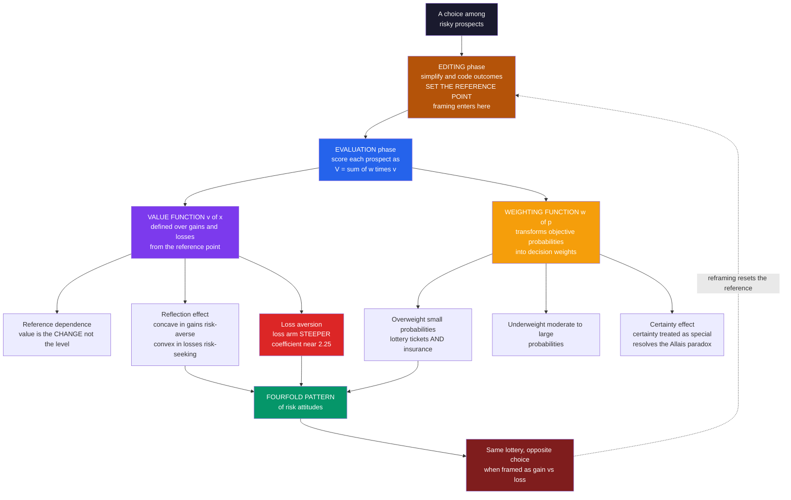

# 🎯 Prospect Theory

> [!abstract] TL;DR
> **Prospect theory** (Kahneman & Tversky, 1979) is the most influential *descriptive* theory of decision-making under risk — a psychologically realistic replacement for expected-utility theory that finally explained the systematic violations expected utility could not. It rests on **two departures**: outcomes are valued as **gains and losses relative to a reference point** through an S-shaped **value function** — concave for gains, convex for losses, and *steeper* for losses (**loss aversion**, roughly 2 to 2.25 times) — and probabilities are run through a nonlinear **weighting function** that overweights small probabilities and certainty while underweighting the middle. Together these reproduce the reflection effect, the Allais paradox, and the **fourfold pattern of risk attitudes**, and they underlie the endowment effect, framing, mental accounting, and the disposition effect. It is the theoretical core of behavioral economics and the basis of Kahneman's 2002 Nobel Prize.

---

## Intuition

**Analogy:** Would you rather get **$500 for sure**, or flip a coin for **$1,000-or-nothing**? Almost everyone grabs the sure $500 — we are cautious with gains. Now flip the frame: would you rather **lose $500 for sure**, or flip a coin to **lose $1,000-or-nothing**? Suddenly most people *gamble*, desperate to avoid the certain loss. It is the very same coin flip, but our appetite for risk *reverses* depending on whether the situation is dressed up as winning or losing — and, on top of that, the *sting* of losing $500 clearly outweighs the *pleasure* of gaining $500.

That single observation breaks classical economics. Expected-utility theory says a rational agent cares only about final wealth, so the two coin flips — mathematically identical — should be treated identically. They are not. Prospect theory captured this **reference-dependent, loss-averse** psychology in a precise formula, explained a decade of paradoxes that had embarrassed economics, and won a Nobel Prize doing it.

---

## How It Works

### Core mechanics

Classical **expected-utility theory** (EU) scores a gamble as the probability-weighted sum of the utility of each *final wealth* level: `EU = sum of p_i * u(w_i)`. It is normatively beautiful and descriptively wrong. Prospect theory keeps the multiply-and-sum skeleton but makes two psychologically grounded changes, evaluated over *changes* `x` from a reference point rather than absolute wealth:

$$V \;=\; \sum_i \pi(p_i)\, v(x_i)$$

**Departure 1 — the value function `v(x)`.** Instead of utility over final wealth, value is defined over **gains and losses relative to a reference point** (the status quo, an expectation, an aspiration, or a purchase price). Its shape encodes three facts:

1. **Reference dependence** — the carrier of value is the *change*, not the level. The identical bank balance feels like triumph or disaster depending on where you started. This is the profound break from wealth-based utility.
2. **Diminishing sensitivity — the reflection effect** — the function is **concave for gains** (each extra dollar of gain thrills you less) and **convex for losses** (each extra dollar of loss stings you less). Concavity in gains makes people **risk-averse for gains**; convexity in losses makes them **risk-seeking for losses**. The curve reflects across the reference point.
3. **Loss aversion** — the loss arm is **steeper** than the gain arm. "Losses loom larger than gains": a loss hurts about **2 to 2.25 times** as much as an equal-sized gain pleases. This is the single most consequential behavioral finding, and it produces the S-shaped kink at the reference point.

**Departure 2 — the probability-weighting function `w(p)`.** People do not use raw probabilities. The weighting function **overweights small probabilities** — why the same person buys both lottery tickets (overvaluing a tiny chance of a big gain) *and* insurance (overvaluing a tiny chance of a big loss) — and **underweights moderate-to-large probabilities**. It has an **inverse-S** shape and treats **certainty** as special (the **certainty effect**: a jump from 99 percent to 100 percent feels far larger than from 60 to 61). This nonlinearity is what resolves the **Allais paradox**.

**Two phases.** Prospect theory splits a decision into an **editing phase** — simplifying, coding, and combining prospects, and crucially *setting the reference point* (this is where **framing** enters and can flip a choice) — followed by an **evaluation phase**, where `v` and `w` are applied to score each edited prospect.

**Cumulative prospect theory (Tversky & Kahneman, 1992).** The original 1979 model applied `w` to each probability separately, which could violate stochastic dominance and did not extend cleanly to many outcomes. The 1992 refinement applies **rank-dependent** weighting to *cumulative* probabilities, repairing dominance and extending to arbitrary outcome sets and to both gains and losses. This is the modern, rigorous version used in research today.

### Flow / Architecture



---

## Key Concepts

### Secondary Level

**The one idea to keep:** we judge outcomes as **gains and losses from where we stand right now**, not as final totals — and **losing hurts more than winning feels good**. Give someone a coffee mug and, within minutes, they demand more money to give it up than they would ever have paid to buy it. Nothing about the mug changed; it just became *theirs*, and losing it now feels worse than gaining it did.

**Why the coin flip reverses.** For *gains* we play it safe and take the sure thing. For *losses* we roll the dice, hoping to escape the certain hit. Same odds, opposite instinct — because the pain of a sure loss is what we are running from.

**Why we buy both lottery tickets and insurance.** A lottery ticket is a tiny chance of a huge win; insurance protects against a tiny chance of a huge loss. Cold math says most of us should skip both. But our minds **blow up small chances** — a 1-in-a-million shot *feels* like much more than one in a million — so the jackpot and the disaster both loom larger than they should, and we happily pay for both.

### Undergraduate Level

**Expected utility and what it gets wrong.** EU maximizes `sum p_i * u(w_i)` over final wealth, with `u` concave to produce risk aversion. A single concave utility-of-wealth curve *cannot* simultaneously explain risk aversion for gains and risk seeking for losses, nor the coexistence of gambling and insurance, nor why framing changes choices. See [[Utility_Theory]] for the classical framework prospect theory replaces.

**The value function, formally.** A standard parametric form (Tversky & Kahneman, 1992):

$$v(x) = \begin{cases} x^{\alpha} & x \ge 0 \\ -\lambda\,(-x)^{\beta} & x < 0 \end{cases}$$

with estimates `α = β ≈ 0.88` (diminishing sensitivity on both arms) and `λ ≈ 2.25` (loss aversion). Concavity for gains plus convexity for losses is the **reflection effect**; the factor `λ > 1` is **loss aversion**.

**The weighting function, formally.** `w(p) = p^γ / (p^γ + (1-p)^γ)^(1/γ)` with `γ ≈ 0.61` for gains and `≈ 0.69` for losses. It is inverse-S: above the diagonal for small `p` (overweighting) and below it for large `p` (underweighting), with a fixed jump at certainty.

**The fourfold pattern of risk attitudes** — prospect theory's signature, empirically confirmed prediction that EU cannot produce:

| | Gains | Losses |
|---|---|---|
| **High probability** | Risk-**averse** — take the sure win, fear disappointment | Risk-**seeking** — gamble to avoid the certain loss |
| **Low probability** | Risk-**seeking** — buy the lottery ticket, overweight the jackpot | Risk-**averse** — buy insurance, overweight the disaster |

Notice the pattern comes mostly from **probability weighting**, not loss aversion: within a single domain (all gains or all losses) the loss-aversion coefficient `λ` cancels out of the certainty-equivalent, and it is the overweighting of small `p` and underweighting of large `p` that flips the attitude across the columns.

### Graduate Level

**Reference-point specification is the theory's soft underbelly.** Prospect theory's predictions depend *entirely* on where the reference point sits, yet the original theory does not fully specify how it is set. Candidates include the status quo (Kahneman-Tversky), rational expectations of the outcome (Kőszegi-Rabin, 2006), an aspiration level, or a recent peak. Because value is measured *from* the reference point, misspecifying it invalidates every prediction — and **framing effects are literally reference-point manipulation** in the editing phase.

**Cumulative (rank-dependent) weighting.** For a gain prospect with outcomes sorted ascending, the decision weight on the `i`-th outcome is `w(p_i + ... + p_n) - w(p_{i+1} + ... + p_n)` — the *marginal* weight of climbing the cumulative distribution. This construction guarantees the weights sum to one and respects stochastic dominance, curing the original 1979 model's defects while preserving the certainty effect. Gains and losses are weighted with separate functions `w^+` and `w^-`, giving cumulative prospect theory sign-dependence as well as rank-dependence.

**Why it resolves Allais.** In the classic common-consequence problems, the modal human choices are jointly *impossible* under EU (they force two contradictory inequalities on the utilities). Prospect theory dissolves the contradiction: the **certainty effect** gives the sure option in the first problem a full decision weight that its probabilistically diluted twin in the second problem loses, so preferring the certain outcome *and* the riskier lottery becomes coherent. The Python demo below computes this explicitly.

**Loss aversion as the master mechanism.** Loss aversion is the engine behind a family of otherwise-disconnected anomalies: the **endowment effect** and **status-quo bias** (giving something up is coded as a loss), the **equity premium puzzle** (loss-averse investors demand a large premium to hold volatile stocks), the **disposition effect** (holding losers to avoid realizing a loss), and much of framing. These are developed in the sibling notes *Loss_Aversion_and_the_Endowment_Effect*, *Reference_Dependence_and_Framing*, *Probability_Weighting_and_Certainty_Effect*, *Mental_Accounting*, and *Prospect_Theory_in_Markets_Disposition_Effect*, with the expected-utility baseline and its failures in *Expected_Utility_Theory_and_Its_Violations*.

---

## Python Demo

```python
# ---------------------------------------------------------------
# PROSPECT THEORY (Kahneman & Tversky, 1979 / cumulative 1992)
#
# (a) plot the S-shaped VALUE FUNCTION v(x): concave in gains,
#     convex in losses, and STEEPER for losses (loss aversion).
# (b) plot the inverse-S PROBABILITY WEIGHTING function w(p):
#     overweights small p, underweights moderate/large p.
# (c) USE the theory to (i) reproduce the FOURFOLD PATTERN of
#     risk attitudes and (ii) RESOLVE the ALLAIS PARADOX that
#     expected-utility theory provably cannot -- contrasting the
#     prospect-theory choice with the expected-utility choice.
# ---------------------------------------------------------------
import numpy as np
import matplotlib
matplotlib.use("Agg")            # headless-safe backend
import matplotlib.pyplot as plt

# --- Tversky & Kahneman (1992) parameter estimates --------------
ALPHA, BETA = 0.88, 0.88   # value-function curvature (gains, losses)
LAMBDA      = 2.25         # loss-aversion coefficient
GAMMA_G     = 0.61         # weighting curvature for gains
GAMMA_L     = 0.69         # weighting curvature for losses

def value(x):
    """S-shaped value function coded relative to the reference point."""
    x = np.asarray(x, dtype=float)
    gains  = np.power(np.abs(x), ALPHA)
    losses = -LAMBDA * np.power(np.abs(x), BETA)
    return np.where(x >= 0, gains, losses)

def weight(p, gamma):
    """Inverse-S probability weighting: overweights small p."""
    p = np.asarray(p, dtype=float)
    num = np.power(p, gamma)
    den = np.power(np.power(p, gamma) + np.power(1.0 - p, gamma), 1.0 / gamma)
    return num / den

def certainty_equivalent(G, p):
    """CE of a two-outcome prospect: G with prob p, else 0.
    Handles gains (G>0) and losses (G<0). Uses the sign-appropriate
    weighting curve. lambda cancels within a single domain."""
    if G >= 0:
        V  = weight(p, GAMMA_G) * value(G)          # = w(p) * G**alpha
        ce = V ** (1.0 / ALPHA)
    else:
        w  = weight(p, GAMMA_L)
        ce = -(abs(G)) * (w ** (1.0 / BETA))        # a sure (negative) loss
    return float(ce)

# ===============================================================
# (c-i) THE FOURFOLD PATTERN OF RISK ATTITUDES
#   For each prospect compare the certainty equivalent (what the
#   gamble is subjectively WORTH) with the expected value (its
#   fair price). CE < EV => risk-averse; CE > EV => risk-seeking.
# ===============================================================
prospects = [
    ("High-prob GAIN  90% win $100", +100, 0.90),
    ("Low-prob  GAIN   5% win $100", +100, 0.05),
    ("High-prob LOSS  90% lose $100", -100, 0.90),
    ("Low-prob  LOSS   5% lose $100", -100, 0.05),
]
print("=" * 66)
print("FOURFOLD PATTERN OF RISK ATTITUDES  (prospect theory)")
print("=" * 66)
labels, ce_vals, ev_vals, attitudes = [], [], [], []
for name, G, p in prospects:
    ce = certainty_equivalent(G, p)
    ev = p * G
    if G >= 0:
        attitude = "RISK-AVERSE " if ce < ev else "RISK-SEEKING"
    else:                       # losses: less-negative CE than EV = seeking
        attitude = "RISK-SEEKING" if ce > ev else "RISK-AVERSE "
    print(f"  {name:32s}  EV={ev:7.1f}  CE={ce:7.1f}  -> {attitude}")
    labels.append(name.split("  ")[0]); ce_vals.append(ce)
    ev_vals.append(ev); attitudes.append(attitude.strip())
print("  Low-prob gain -> lottery tickets;  low-prob loss -> insurance.")
print("  Pattern is driven by PROBABILITY WEIGHTING, not loss aversion.")

# ===============================================================
# (c-ii) THE ALLAIS PARADOX  (Kahneman & Tversky 1979 numbers)
#
#   Problem 1:  A = 2500 @33%, 2400 @66%, 0 @1%   vs  B = 2400 for sure
#   Problem 2:  C = 2500 @33%, 0 @67%            vs  D = 2400 @34%, 0 @66%
#   Modal human choice: B (Problem 1) and C (Problem 2).
#
#   EXPECTED UTILITY forbids (B and C): B>A and C>D force the two
#   contradictory inequalities  0.34 u(2400) > 0.33 u(2500)  and
#   its exact negation.  No utility function can satisfy both.
# ===============================================================
def cpt_gain(outcomes, probs):
    """Cumulative (rank-dependent) prospect-theory value, gains only."""
    order = np.argsort(outcomes)                 # ascending
    x = np.asarray(outcomes, float)[order]
    p = np.asarray(probs,   float)[order]
    cum_from_top = np.cumsum(p[::-1])[::-1]      # P(X >= x_i)
    w_top   = weight(cum_from_top, GAMMA_G)
    w_above = np.append(weight(cum_from_top[1:], GAMMA_G), 0.0)
    pi = w_top - w_above                          # rank-dependent weights
    return float(np.sum(pi * value(x)))

V_A = cpt_gain([2500, 2400, 0], [0.33, 0.66, 0.01])
V_B = cpt_gain([2400],          [1.00])
V_C = cpt_gain([2500, 0],       [0.33, 0.67])
V_D = cpt_gain([2400, 0],       [0.34, 0.66])

# EU contradiction test with ANY concave u (use the value function):
u = lambda w: float(value(w))
eu_gap1 = 0.34 * u(2400) - 0.33 * u(2500)        # > 0  <=> EU picks B
eu_gap2 = 0.33 * u(2500) - 0.34 * u(2400)        # > 0  <=> EU picks C
print("\n" + "=" * 66)
print("ALLAIS PARADOX  (expected utility vs prospect theory)")
print("=" * 66)
print(f"  EU:  B>A needs {eu_gap1:+.1f} > 0   and   C>D needs {eu_gap2:+.1f} > 0")
print(f"       -> exact negatives: no utility function gives BOTH.  CONTRADICTION.")
print(f"  PT:  Problem 1  V(B)={V_B:7.1f} vs V(A)={V_A:7.1f}"
      f"  -> prefers {'B (sure 2400)' if V_B > V_A else 'A'}")
print(f"       Problem 2  V(C)={V_C:7.1f} vs V(D)={V_D:7.1f}"
      f"  -> prefers {'C (riskier)' if V_C > V_D else 'D'}")
print("       Prospect theory reproduces BOTH modal choices (B and C).")
print("       The certainty effect makes B special; PT resolves the paradox.")

# ===============================================================
# FIGURE: value function | weighting function | fourfold pattern
# ===============================================================
fig, (axV, axW, axF) = plt.subplots(1, 3, figsize=(17, 5.4))
fig.suptitle("Prospect Theory: value function, probability weighting, "
             "and the fourfold pattern of risk attitudes",
             fontsize=13, fontweight="bold")

# ---- Panel 1: the S-shaped value function ----------------------
x = np.linspace(-250, 250, 800)
axV.plot(x, value(x), color="#7c3aed", lw=2.6)
axV.axhline(0, color="#9ca3af", lw=0.8); axV.axvline(0, color="#9ca3af", lw=0.8)
axV.plot([100, 100], [0, value(100)],   color="#059669", lw=1.4, ls=":")
axV.plot([-100, -100], [0, value(-100)], color="#dc2626", lw=1.4, ls=":")
axV.annotate(f"v(+100) = {float(value(100)):.0f}", xy=(100, float(value(100))),
             xytext=(115, float(value(100)) + 20), color="#059669", fontsize=9)
axV.annotate(f"v(-100) = {float(value(-100)):.0f}  steeper",
             xy=(-100, float(value(-100))), xytext=(-245, float(value(-100)) - 35),
             color="#dc2626", fontsize=9)
axV.set_title("Value function v(x)\nconcave gains, convex + steeper losses", fontsize=10)
axV.set_xlabel("Outcome relative to reference point"); axV.set_ylabel("Subjective value")
axV.text(105, -150, "LOSSES loom larger\nthan equal GAINS", fontsize=8.5, color="#dc2626")
axV.grid(alpha=0.2)

# ---- Panel 2: the inverse-S weighting function -----------------
p = np.linspace(0.0001, 0.9999, 800)
axW.plot(p, weight(p, GAMMA_G), color="#f59e0b", lw=2.6, label="w(p) decision weight")
axW.plot([0, 1], [0, 1], color="#9ca3af", lw=1.2, ls="--", label="w(p) = p objective")
axW.fill_between(p, weight(p, GAMMA_G), p, where=(weight(p, GAMMA_G) > p),
                 color="#f59e0b", alpha=0.15)
axW.fill_between(p, weight(p, GAMMA_G), p, where=(weight(p, GAMMA_G) < p),
                 color="#2563eb", alpha=0.12)
axW.set_title("Weighting function w(p)\noverweights small p, underweights large p", fontsize=10)
axW.set_xlabel("Objective probability p"); axW.set_ylabel("Decision weight w(p)")
axW.text(0.03, 0.34, "small p\nOVER-weighted\nlotteries + insurance", fontsize=8, color="#b45309")
axW.text(0.55, 0.40, "large p\nUNDER-weighted", fontsize=8, color="#1e40af")
axW.legend(loc="lower right", fontsize=8); axW.grid(alpha=0.2)

# ---- Panel 3: fourfold pattern (CE vs EV) ----------------------
idx = np.arange(len(labels)); bw = 0.38
bar_colors = ["#dc2626" if a == "RISK-SEEKING" else "#059669" for a in attitudes]
axF.bar(idx - bw/2, ev_vals, bw, color="#9ca3af", edgecolor="black",
        linewidth=0.6, label="Expected value (fair)")
axF.bar(idx + bw/2, ce_vals, bw, color=bar_colors, edgecolor="black",
        linewidth=0.6, label="Certainty equivalent (felt worth)")
axF.axhline(0, color="black", lw=0.9)
for i, a in enumerate(attitudes):
    axF.text(i, (max(ev_vals[i], ce_vals[i]) + 6) if ev_vals[i] >= 0
             else (min(ev_vals[i], ce_vals[i]) - 16), a,
             ha="center", fontsize=7.5, fontweight="bold",
             color="#7f1d1d" if a == "RISK-SEEKING" else "#065f46")
axF.set_xticks(idx)
axF.set_xticklabels(["hi-p\ngain", "lo-p\ngain", "hi-p\nloss", "lo-p\nloss"], fontsize=8)
axF.set_title("Fourfold pattern\nred = risk-seeking, green = risk-averse", fontsize=10)
axF.set_ylabel("Value ($)"); axF.legend(loc="lower left", fontsize=7.5)
axF.grid(axis="y", alpha=0.2)

plt.tight_layout(rect=[0, 0, 1, 0.93])
plt.savefig("prospect_theory.png", dpi=110, bbox_inches="tight")
plt.show()
```

**What the demo shows:**

- **Panel 1 (value function):** concave above the reference point, convex below it, and the loss arm is *steeper* — `v(-100)` sits about `2.25×` farther from zero than `v(+100)`. That asymmetry *is* loss aversion; the convex loss arm is why people gamble to escape a sure loss.
- **Panel 2 (weighting function):** the orange curve bows *above* the diagonal for small `p` (a 1 percent chance feels like more than 1 percent — hence buying lotteries *and* insurance) and *below* it for large `p`. This distortion, not the value function, drives the fourfold pattern.
- **Panel 3 (fourfold pattern):** for four canonical prospects the certainty equivalent flips above or below the expected value — **risk-averse** for likely gains and unlikely losses, **risk-seeking** for unlikely gains and likely losses — the exact 2×2 signature expected utility cannot produce.
- **Console (Allais paradox):** the modal human choices B and C force two *exactly contradictory* inequalities on any utility function, so expected utility is provably violated; cumulative prospect theory reproduces *both* choices because the certainty effect gives the sure 2400 a decision weight its diluted twin loses.

---

## Real-World Applications

> **Behavioral finance — the disposition effect and the equity premium.** Prospect theory explains why investors **sell winners too early and hold losers too long**: a stock above its purchase price sits in the concave *gain* domain where they lock in the sure win, while a stock below it sits in the convex *loss* domain where they turn risk-seeking and gamble on recovery. Loss aversion also underlies the **equity premium puzzle** — stocks must pay a large premium because loss-averse investors overweight the frequent small drops. Developed in [[Prospect_Theory_and_Loss_Aversion]] and the sibling note *Prospect_Theory_in_Markets_Disposition_Effect*.

> **Insurance and lotteries sold to the same customer.** The overweighting of small probabilities makes both products attractive at once: people happily pay above fair value to insure a tiny chance of catastrophe *and* to chase a tiny chance of a jackpot. Insurers and state lotteries price directly around this tail distortion.

> **Nudges and public policy.** Automatic-enrollment retirement plans and opt-out organ-donation defaults exploit status-quo bias and loss aversion — leaving a default feels like a loss — to raise participation without removing choice. Tax-compliance letters framed around what citizens *lose* by not paying outperform gain-framed versions. See [[Behavioral_Economics_Psychology]] and [[Nudges_and_Choice_Architecture]].

> **Marketing, pricing, and product design.** "Was $200, now $120" sets a high reference point so the price feels like a *gain*; "don't lose your streak", expiring points, and free trials that auto-charge weaponize loss aversion; decoy premium tiers anchor the middle option as reasonable. Every one of these is a deliberate manipulation of the reference point in the editing phase.

> **Medicine and risk communication.** Identical prognoses framed as "90 percent survival" versus "10 percent mortality" produce different treatment choices; overweighting of rare side effects distorts vaccine and screening decisions. Communicating in natural frequencies and controlling the frame are evidence-based countermeasures.

---

## Common Pitfalls

- **Confusing loss aversion with risk aversion.** Risk aversion is a dislike of *variance*; loss aversion is an *asymmetry around a reference point* that can make people actively *seek* variance (gamble) to escape a sure loss. They point in opposite directions in the loss domain.
- **Treating the reference point as fixed or obvious.** It can be the status quo, an expectation, an aspiration, a peer's outcome, or a recent peak — and it *shifts*. Because value is measured from it, misspecifying the reference point invalidates every prediction. Framing effects are literally reference-point manipulation.
- **Attributing the fourfold pattern to loss aversion.** Within a single domain the loss-aversion coefficient cancels out of the certainty-equivalent; the fourfold flip across probability columns comes from **probability weighting**, not from `λ`.
- **Using separable weighting for many-outcome gambles.** The original 1979 formula, applied to three or more outcomes, can violate stochastic dominance and produce weights that do not sum to one. Use the 1992 **cumulative, rank-dependent** version for anything beyond a simple two-outcome prospect.
- **Over-precision on `λ ≈ 2.25` and the parameter estimates.** The roughly 2-to-1 loss-to-gain ratio is a robust *average*, not a universal constant; it varies by person, domain, stakes, and emotional context.
- **Reading prospect theory as "people are irrational."** It is a *descriptive* theory of how choice actually works, not a verdict of stupidity. Many of its patterns are adaptive shortcuts; the interesting question is *which environment* they are matched to.

---

## Related Concepts

- [[Judgment_and_Decision_Making]] — the cognitive-science home of prospect theory alongside the heuristics-and-biases program, the normative-vs-descriptive contrast, and the dual-process framing.
- [[Behavioral_Economics_Psychology]] — how prospect theory, loss aversion, and bounded rationality became the foundation of behavioral economics, nudge theory, and mental accounting.
- [[Prospect_Theory_and_Loss_Aversion]] — the finance-vault treatment centered on the disposition effect, the equity premium puzzle, and reference points in markets.
- [[Utility_Theory]] — the classical expected-utility / consumer-choice framework that prospect theory descriptively replaces; the normative benchmark.
- [[Cognitive_Biases]] — the psychology-vault taxonomy of the systematic errors (endowment, status-quo, anchoring) that reference dependence and loss aversion generate.
- [[Problem_Solving_and_Decision_Making]] — dual-process theory and the cognitive-psychology foundations of how heuristics and framing shape choice.
- [[Dual_Process_Theory]] — System 1 / System 2; the editing-phase intuitions that prospect theory's framing effects exploit.
- [[Foundations_of_Behavioral_Finance]] — the bounded-rationality tradition that prospect theory formalizes for markets.
- [[Cognitive_Biases_in_Investing]] — mental accounting and anchoring as close cousins of reference dependence in investing.
- [[Nudges_and_Choice_Architecture]] — engineering defaults and frames around loss aversion for better outcomes.

*Forthcoming siblings in this section (referenced above in prose):* Expected_Utility_Theory_and_Its_Violations, Loss_Aversion_and_the_Endowment_Effect, Reference_Dependence_and_Framing, Probability_Weighting_and_Certainty_Effect, Mental_Accounting, and Prospect_Theory_in_Markets_Disposition_Effect.

---

## Review Questions

### Secondary

1. You are offered a sure $500 or a coin flip for $1,000-or-nothing, and most people take the sure $500. When the identical flip is reframed as *losing* $500 for sure versus a coin flip to lose $1,000-or-nothing, most people gamble. In plain language, what about our psychology makes the same bet feel so different?
2. Why does the same person often buy *both* a lottery ticket and an insurance policy, even though careful math says they should probably skip both? Which feature of prospect theory explains it?
3. A shop labels a jacket "was $200, now $120" instead of just "$120." Using the idea of a reference point, explain why the crossed-out price makes people more willing to buy.

### Undergraduate

1. Draw the prospect-theory value function and label its reference point, its concave gain region, its convex loss region, and the steeper loss slope. State precisely which property produces (a) risk aversion for gains, (b) risk seeking for losses, and (c) loss aversion.
2. Reconstruct the **fourfold pattern of risk attitudes** as a 2×2 table. Using the *shapes* of both the value function and the weighting function, explain why the pattern is driven mainly by probability weighting rather than by loss aversion.
3. Show that in the Allais problems the modal human choices are jointly impossible under expected utility, then explain how the **certainty effect** in prospect theory's weighting function resolves the contradiction.

### Graduate

1. Cumulative prospect theory (1992) replaced the original 1979 model's separable weighting with rank-dependent weighting on cumulative probabilities. State two concrete defects of the 1979 formulation that this repaired, and explain why rank-dependence guarantees respect for stochastic dominance.
2. Prospect theory's predictions hinge entirely on the reference point, which the theory under-specifies. Design an experiment that could adjudicate between at least two competing accounts of reference-point formation (for example status quo versus rational expectations versus recent peak), and state what each account predicts for your paradigm.
3. Loss aversion is invoked to explain the endowment effect, status-quo bias, the equity premium puzzle, and the disposition effect. Choose two of these, derive each from the value function's shape, and identify one competing (non-loss-aversion) explanation for each — and how you would empirically distinguish them.

---

## Sources

- [Kahneman, D. & Tversky, A. (1979). "Prospect Theory: An Analysis of Decision under Risk." *Econometrica* 47(2), 263–291](https://doi.org/10.2307/1914185)
- [Tversky, A. & Kahneman, D. (1992). "Advances in Prospect Theory: Cumulative Representation of Uncertainty." *Journal of Risk and Uncertainty* 5(4), 297–323](https://doi.org/10.1007/BF00122574)
- [Tversky, A. & Kahneman, D. (1981). "The Framing of Decisions and the Psychology of Choice." *Science* 211(4481), 453–458](https://doi.org/10.1126/science.7455683)
- [Kőszegi, B. & Rabin, M. (2006). "A Model of Reference-Dependent Preferences." *Quarterly Journal of Economics* 121(4), 1133–1165](https://doi.org/10.1093/qje/121.4.1133)
- [Kahneman, D. (2011). *Thinking, Fast and Slow*. Farrar, Straus and Giroux](https://us.macmillan.com/books/9780374533557/thinkingfastandslow)

---

#behavioral-economics #prospect-theory #loss-aversion #reference-dependence #probability-weighting
