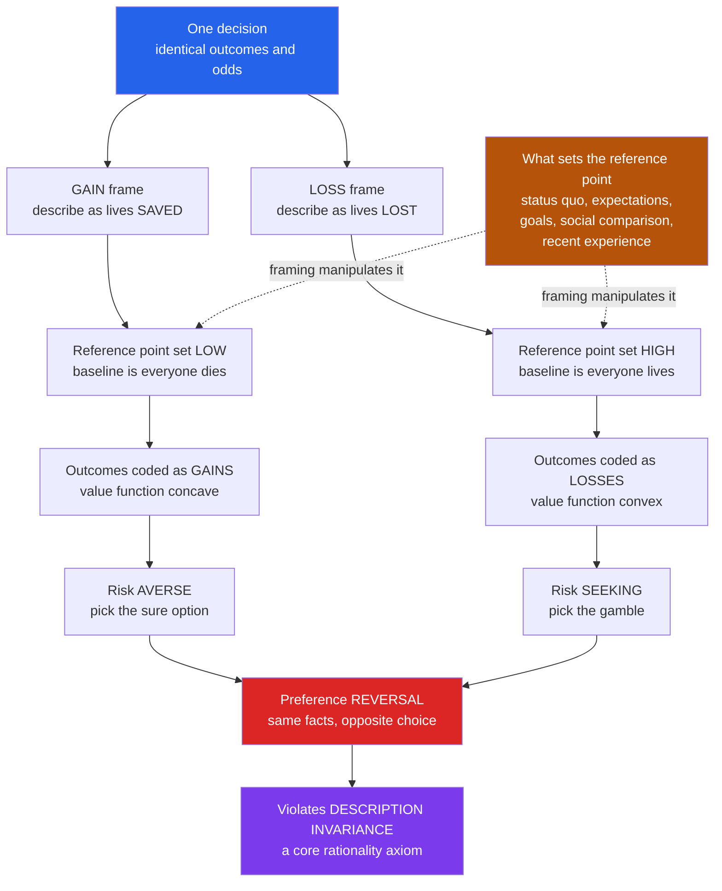

# 🪞 Reference Dependence and Framing

> [!abstract] TL;DR
> **Reference dependence** is the behavioral-economics principle that people evaluate outcomes not as absolute final states (total wealth, lives) but as **gains or losses relative to a reference point** — and that reference point is malleable, set by the status quo, expectations, goals, social comparisons, or simply by how a choice is worded. **Framing** exploits exactly this: describe the *same* decision differently and you move the reference point, flipping people from risk-averse to risk-seeking. The canonical proof is the **Asian disease problem** (Tversky & Kahneman, 1981), where identical public-health options phrased as *lives saved* versus *lives lost* reverse the majority choice — a direct violation of **description invariance**, the axiom that equivalent descriptions should yield equivalent preferences. Because whoever frames a choice shapes its outcome, framing pervades marketing, politics, medicine, and policy, and — by showing that preferences are often *constructed on the spot* rather than read off fixed values — it challenges the foundations of rational-choice economics and welfare analysis.

---

## Intuition

**Analogy:** Ground beef labeled **"80 percent lean"** flies off the shelf; the *identical* beef labeled **"20 percent fat"** repels the same shoppers. A surgery with a **"90 percent survival rate"** sounds far safer than one with a **"10 percent mortality rate"** — even though the two statements describe exactly the same operation. A perfectly rational agent would be immune to such rewordings: the facts have not changed. But humans are exquisitely sensitive to how a choice is *framed*, because the frame silently sets the **reference point** from which everything else is judged a gain or a loss. Change the frame and you can flip a decision without changing a single fact.

That is the whole idea in one line: **we do not evaluate outcomes in the abstract; we evaluate them relative to a benchmark — and the benchmark is up for grabs.** The same 500-dollar bonus is a windfall if you expected nothing and a bitter disappointment if you expected 1,000. Standard economics says only final wealth matters, so both should feel identical. Reference dependence says the *change* is what we feel, and framing is the art of choosing which change the other person sees.

---

## How It Works

### Reference dependence: the carrier of value is the *change*

Classical economics assumes people care about **final states** — the total wealth, the total number of lives, the absolute quantity of a good. Prospect theory replaces this with **reference dependence**: outcomes enter your evaluation as **deviations from a reference point** `r`. An outcome `x` is coded as a **gain** if `x > r` and a **loss** if `x < r`, and the subjective *value function* `v(x - r)` is:

- **Concave over gains** — diminishing sensitivity means the felt difference between 100 and 200 dollars exceeds that between 1,100 and 1,200. Concavity over gains produces **risk aversion**: a sure gain is preferred to a gamble of equal expected value.
- **Convex over losses** — the same diminishing sensitivity in the loss domain means going from a 100-dollar loss to a 200-dollar loss stings less than the first 100. Convexity over losses produces **risk seeking**: people gamble to *avoid* a sure loss.
- **Steeper for losses than gains** — the loss arm falls about 2.25 times faster than the gain arm rises (**loss aversion**), the subject of the sibling note *Loss_Aversion_and_the_Endowment_Effect*.

The decisive consequence: **which side of the reference point an outcome lands on determines whether you are risk-averse or risk-seeking about it.** So if a frame can move the reference point, it can move you across the kink from cautious to reckless — with the objective outcomes untouched.

### What sets the reference point

The reference point is not given by nature; it is constructed, and several forces compete to set it:

1. **The status quo** — your current state. This is the default reference and the engine of **status-quo bias** and the endowment effect: giving something up is coded as a loss, so we cling to what we have.
2. **Expectations** — what you *anticipated*. The **Kőszegi–Rabin (2006)** model makes the reference point your recent rational expectations: a 3 percent raise feels like a *loss* if you expected 5 percent, even though your paycheck grew. The reference is forward-looking, not just the status quo.
3. **Aspirations and goals** — a target you set (a sales quota, a marathon time). Outcomes below the goal are losses; runners bunch just under round-number finish times because finishing at 4:01 is a "loss" against the 4:00 goal.
4. **Social comparison** — what peers have. A 100,000-dollar salary is a gain next to a colleague earning 80,000 and a loss next to one earning 150,000.
5. **Recent experience and adaptation** — where you have adapted to. Yesterday's price becomes today's anchor for whether a stock "went up" or "down."

Because the reference point is this malleable, **whoever controls how a choice is described often controls the reference point — and therefore the decision.**

### Framing effects and the violation of description invariance

A **framing effect** occurs when logically equivalent descriptions of the same options elicit systematically different choices. This directly violates **description invariance** (also called *extensionality* or *invariance*) — a bedrock rationality axiom stating that preferences should depend only on the *outcomes*, not on how those outcomes are *described*. A rational agent presented with "80 percent lean" and "20 percent fat" should treat them as one and the same. Real agents do not, and the failure is lawful and directional, not random.

The taxonomy of framing (Levin, Schneider & Gaeth, 1998) distinguishes:

- **Risky-choice / gain-loss framing** — the Asian disease type: the *same* gamble is cast against a gain reference or a loss reference, moving people across the value-function kink. This is *reference-point* framing.
- **Attribute framing** — a single attribute is described positively or negatively ("90 percent lean" vs "10 percent fat", "90 percent success" vs "10 percent failure"). Same fact, different *evaluation*, driven by which valence is made salient and by loss aversion.
- **Goal framing** — the same action is pitched by the gain from doing it ("screening detects cancer early") versus the loss from not doing it ("skipping screening risks late detection"). Loss-framed appeals are typically more persuasive because losses loom larger.

### The Asian disease problem

The canonical demonstration. Six hundred people face a deadly disease; two programs are offered, and respondents are randomly given one of two frames of the *mathematically identical* options:

- **Gain (lives-saved) frame** — reference point is "everyone dies." Program A: **200 saved for sure**. Program B: **1/3 chance 600 saved, 2/3 chance none saved.** Coded as gains, people are risk-averse and a large majority pick the **sure** Program A.
- **Loss (lives-lost) frame** — reference point is "no one dies." Program C: **400 die for sure**. Program D: **1/3 chance no one dies, 2/3 chance 600 die.** Coded as losses, the same people turn risk-seeking and a majority pick the **gamble**, Program D.

But A and C are identical (200 live, 400 die), and B and D are identical. The **same population reverses its choice on wording alone** — the sharpest possible evidence that the reference point, not the outcomes, is driving the decision.

### Why framing works

Two mechanisms combine. First, **reference dependence + loss aversion**: the frame sets the reference point, and the value function's opposite curvature on each side flips risk attitude. Second, **attention and salience**: a frame directs attention to particular features ("lean" vs "fat"), and evaluation over-weights whatever is in focus. Underlying both, the fast, automatic **System 1** (see [[Dual_Process_Theory]]) **accepts the frame as given** — it evaluates the problem *as presented* rather than translating it into a canonical, frame-neutral form, which would require effortful System 2 work most people never do.



---

## Key Concepts

### Secondary (intuition level)

- **Reference point** — the invisible "starting line" you measure an outcome against. Above it feels like winning, below it feels like losing.
- **Gains vs losses** — we do not feel our total bank balance; we feel whether it went *up or down* from where we expected.
- **Framing** — the exact same situation, described in two different ways, feels different and gets a different answer. "80 percent lean" beats "20 percent fat" even though they are the same meat.
- **The disease puzzle** — offer people two rescue plans described as "lives saved" and most play it safe; describe the identical plans as "lives lost" and most take the gamble. Wording flipped the choice.
- **Why it matters** — the person who chooses the words often chooses your decision for you.

### Undergraduate (econ/CS background)

- **Reference dependence, formally** — value is `v(x - r)`, not `u(x)`; the carrier of value is the *change* from reference `r`, a clean break from expected-utility theory, which scores only final states. Introduced in *Prospect_Theory*.
- **Description invariance (extensionality)** — the rationality axiom that logically equivalent framings must yield identical preferences. Framing effects are its empirical falsification, alongside the preference reversals discussed in [[The_Rational_Actor_Model_and_Its_Limits]].
- **Risk attitude follows the sign** — concavity over gains gives risk aversion; convexity over losses gives risk seeking. Move the reference point and you move the agent across the kink.
- **The framing taxonomy** — risky-choice (gain-loss), attribute, and goal framing (Levin, Schneider & Gaeth, 1998), each with a distinct mechanism.
- **Reference-point sources** — status quo, **rational expectations** (Kőszegi–Rabin), aspirations/goals, social comparison, adaptation. Mis-specifying `r` invalidates every prospect-theory prediction, so identifying the reference point is the central empirical challenge.
- **The Asian disease numbers** — gain frame: sure 200 vs 1/3-chance-600; loss frame: sure -400 vs 2/3-chance--600. Identical in outcomes, opposite in modal choice.

### Graduate (system-level thinking)

- **Expectations-based reference points** — Kőszegi & Rabin (2006, 2007) endogenize `r` as the agent's recent probabilistic beliefs about outcomes, yielding a *personal equilibrium* where the reference point and the choice are mutually consistent. This resolves the "where does `r` come from?" indeterminacy that plagues naive prospect theory and predicts the **attachment/endowment effect scales with expectation of trade**.
- **Constructed preferences** — Slovic (1995) and Lichtenstein & Slovic (2006): if a mere reframing flips choices, preferences may not pre-exist as stable, coherent quantities waiting to be revealed; people frequently **construct** them on the spot under the influence of context, salience, and frame. This undercuts **revealed-preference** methodology and complicates welfare analysis — *whose* preferences (which frame's) count?
- **Welfare and libertarian paternalism** — if framing is unavoidable (there is no "neutral" way to present a choice), then **choice architecture** is inescapable, motivating the deliberate design of frames and defaults in *Nudges_and_Choice_Architecture*. The normative question becomes not *whether* to frame but *how*, and by what standard.
- **Robustness and debiasing** — framing effects survive incentives, expertise, and warnings; considering multiple frames ("reframe as both gain and loss"), joint vs separate evaluation, high numeracy, and statistical training reduce but rarely eliminate them. Frame-invariant decision-making is genuinely hard, which is why the effect is a *coherence* violation, not a mere knowledge gap.
- **Relation to anchoring and mental accounting** — the reference point is a close cousin of the anchor in *Anchoring_and_Adjustment* and of the account boundaries in *Mental_Accounting*; all three are cases of a labile mental benchmark shaping evaluation.

---

## Python Demo

```python
# ---------------------------------------------------------------
# REFERENCE DEPENDENCE AND FRAMING
#
# (a) THE ASIAN DISEASE PROBLEM (Tversky & Kahneman, 1981):
#     mathematically IDENTICAL options are presented in a GAIN
#     frame (lives SAVED) and a LOSS frame (lives LOST). Using the
#     prospect-theory value function (concave over gains -> risk
#     averse; convex + steeper over losses -> risk seeking) we
#     COMPUTE that the SAME agent prefers the SURE option in the
#     gain frame but the GAMBLE in the loss frame -- reproducing
#     the famous preference REVERSAL from wording alone.
#
# (b) ATTRIBUTE FRAMING ("80 percent lean" vs "20 percent fat"):
#     the identical product is rated worse when the negative
#     attribute is salient, because loss aversion makes the "fat"
#     framing loom larger than the "lean" framing rewards.
# ---------------------------------------------------------------
import numpy as np
import matplotlib
matplotlib.use("Agg")            # headless-safe backend
import matplotlib.pyplot as plt

# --- Tversky & Kahneman (1992) parameter estimates --------------
ALPHA  = 0.88    # value-function curvature for GAINS  (concave)
BETA   = 0.88    # value-function curvature for LOSSES (convex)
LAMBDA = 2.25    # loss-aversion coefficient (losses ~2.25x gains)
GAMMA  = 0.61    # probability-weighting curvature (inverse-S)

def value(x):
    """PT value coded relative to the reference point (x = outcome - r).
    Concave in gains, convex and steeper in losses."""
    x = np.asarray(x, dtype=float)
    gains  = np.power(np.abs(x), ALPHA)
    losses = -LAMBDA * np.power(np.abs(x), BETA)
    return np.where(x >= 0, gains, losses)

def weight(p):
    """Inverse-S probability weighting: overweights small p."""
    p = np.asarray(p, dtype=float)
    return np.power(p, GAMMA) / np.power(
        np.power(p, GAMMA) + np.power(1.0 - p, GAMMA), 1.0 / GAMMA)

def prospect(outcomes, probs):
    """V = sum_i w(p_i) * v(x_i); outcomes coded vs the reference."""
    outcomes = np.asarray(outcomes, dtype=float)
    probs    = np.asarray(probs, dtype=float)
    return float(np.sum(weight(probs) * value(outcomes)))

# ===============================================================
# (a) ASIAN DISEASE PROBLEM  (600 lives at risk)
#
#  GAIN frame  (reference = "everyone dies", outcomes are lives SAVED)
#     A  save 200 for sure                       -> +200
#     B  1/3 chance save 600, 2/3 chance save 0  -> +600 @ 1/3
#
#  LOSS frame  (reference = "no one dies", outcomes are lives LOST)
#     C  400 die for sure                        -> -400
#     D  1/3 chance 0 die, 2/3 chance 600 die    -> -600 @ 2/3
#
#  A and C are identical (200 live / 400 die); so are B and D.
# ===============================================================
V_A = prospect([+200],     [1.0])          # sure save   (gain frame)
V_B = prospect([+600, 0],  [1/3, 2/3])     # gamble save (gain frame)
V_C = prospect([-400],     [1.0])          # sure deaths (loss frame)
V_D = prospect([-600, 0],  [2/3, 1/3])     # gamble deaths (loss frame)

print("=" * 60)
print("ASIAN DISEASE PROBLEM  (same options, two frames)")
print("=" * 60)
print("  GAIN frame (lives SAVED):")
print(f"    A sure +200 : V = {V_A:8.2f}")
print(f"    B gamble    : V = {V_B:8.2f}")
gain_pick = "A SURE  -> RISK-AVERSE" if V_A > V_B else "B GAMBLE -> risk-seeking"
print(f"    -> prefers {gain_pick}")
print("  LOSS frame (lives LOST):")
print(f"    C sure -400 : V = {V_C:8.2f}")
print(f"    D gamble    : V = {V_D:8.2f}")
loss_pick = "D GAMBLE -> RISK-SEEKING" if V_D > V_C else "C SURE -> risk-averse"
print(f"    -> prefers {loss_pick}")
print("  A==C and B==D in outcomes, yet the choice REVERSES on wording.")

# ===============================================================
# (b) ATTRIBUTE FRAMING  ("lean" vs "fat" label, same product)
#
#  Same beef, lean fraction L (fat = 1 - L). The consumer's net
#  impression starts from a common BASE and is shifted by the
#  SALIENT attribute coded through the PT value function:
#     lean label -> attend to L as a GAIN   : + value(+100*L)
#     fat  label -> attend to fat as a LOSS : + value(-100*fat)  (loss-averse)
#  Both frames are mapped to a shared 1..7 rating scale, so the
#  gap is a genuine framing effect on the IDENTICAL product.
# ===============================================================
lean = np.linspace(0.50, 0.95, 60)
fat  = 1.0 - lean
BASE = 100.0
net_lean = BASE + value(100 * lean)        # positive (gain) coding
net_fat  = BASE + value(-100 * fat)        # negative (loss) coding, x2.25

lo = min(net_lean.min(), net_fat.min())
hi = max(net_lean.max(), net_fat.max())
def to_rating(net):                        # shared linear map to 1..7
    return 1.0 + 6.0 * (net - lo) / (hi - lo)
rate_lean = to_rating(net_lean)
rate_fat  = to_rating(net_fat)

# the flagship 80/20 product
i80 = int(np.argmin(np.abs(lean - 0.80)))
print("\n" + "=" * 60)
print("ATTRIBUTE FRAMING  (identical 80% lean / 20% fat beef)")
print("=" * 60)
print(f"  rated as '80 percent LEAN': {rate_lean[i80]:.2f} / 7")
print(f"  rated as '20 percent FAT' : {rate_fat[i80]:.2f} / 7")
print("  Same product. The negative frame is rated far lower (loss aversion).")

# ===============================================================
# FIGURE
# ===============================================================
fig, (axV, axD, axA) = plt.subplots(1, 3, figsize=(17, 5.2))
fig.suptitle("Reference dependence and framing: the value function, the "
             "Asian-disease reversal, and attribute framing",
             fontsize=13, fontweight="bold")

# Panel 1 -- the S-shaped, reference-dependent value function
x = np.linspace(-500, 500, 800)
axV.plot(x, value(x), color="#7c3aed", lw=2.5)
axV.axhline(0, color="#9ca3af", lw=0.8)
axV.axvline(0, color="#9ca3af", lw=0.8)
axV.annotate("concave over GAINS\n(risk averse)", xy=(250, value(250)),
             xytext=(60, 60), color="#059669", fontsize=9)
axV.annotate("convex + steeper over LOSSES\n(risk seeking)",
             xy=(-250, value(-250)), xytext=(-490, -520),
             color="#dc2626", fontsize=9)
axV.text(-470, 250, "reference point\nsits at the kink", fontsize=8.5,
         color="#7c3aed")
axV.set_title("Value function v(x - r)\ncoded relative to the reference point",
              fontsize=10)
axV.set_xlabel("Outcome relative to reference point")
axV.set_ylabel("Subjective value")
axV.grid(alpha=0.2)

# Panel 2 -- Asian disease preference reversal (grouped bars)
labels = ["A\nsure +200", "B\ngamble", "C\nsure -400", "D\ngamble"]
vals   = [V_A, V_B, V_C, V_D]
picked = [V_A > V_B, V_B > V_A, V_C > V_D, V_D > V_C]
colors = ["#059669" if (lab[0] in "AB" and pk) else
          "#dc2626" if (lab[0] in "CD" and pk) else "#cbd5e1"
          for lab, pk in zip(labels, picked)]
bars = axD.bar(labels, vals, color=colors, edgecolor="black", linewidth=0.8)
axD.axhline(0, color="black", lw=0.9)
for b, v in zip(bars, vals):
    axD.text(b.get_x() + b.get_width() / 2, v + (6 if v >= 0 else -16),
             f"{v:.0f}", ha="center", fontsize=9, fontweight="bold")
axD.text(0.5, V_A + 40, "GAIN frame\npicks the SURE thing",
         ha="center", fontsize=8.5, color="#065f46")
axD.text(2.5, -60, "LOSS frame\npicks the GAMBLE",
         ha="center", fontsize=8.5, color="#7f1d1d")
axD.set_title("Asian disease: same options,\nreversed choice by frame",
              fontsize=10)
axD.set_ylabel("Prospect-theory valuation V")
axD.grid(axis="y", alpha=0.2)

# Panel 3 -- attribute framing gap
axA.plot(lean * 100, rate_lean, color="#059669", lw=2.5,
         label='"percent LEAN" frame (gain)')
axA.plot(lean * 100, rate_fat, color="#dc2626", lw=2.5,
         label='"percent FAT" frame (loss)')
axA.fill_between(lean * 100, rate_lean, rate_fat, color="#f59e0b", alpha=0.15)
axA.axvline(80, color="#9ca3af", ls=":", lw=1.2)
axA.scatter([80, 80], [rate_lean[i80], rate_fat[i80]],
            color=["#059669", "#dc2626"], zorder=5)
axA.annotate(f"{rate_lean[i80]:.1f}", (80, rate_lean[i80]),
             xytext=(6, 4), textcoords="offset points", color="#065f46")
axA.annotate(f"{rate_fat[i80]:.1f}", (80, rate_fat[i80]),
             xytext=(6, -14), textcoords="offset points", color="#7f1d1d")
axA.set_title("Attribute framing: identical beef,\nrated worse as 'fat'",
              fontsize=10)
axA.set_xlabel("Lean content of the SAME product (percent)")
axA.set_ylabel("Consumer rating (1 to 7)")
axA.set_ylim(0.5, 7.5)
axA.legend(loc="upper left", fontsize=8)
axA.grid(alpha=0.2)

plt.tight_layout(rect=[0, 0, 1, 0.93])
plt.savefig("reference_dependence_and_framing.png", dpi=110, bbox_inches="tight")
plt.show()
```

**What the demo shows:**

- **Panel 1 (value function):** the curve bends concave above the reference point and convex-and-steeper below it. Because risk attitude follows curvature, *which side of the reference an outcome lands on* decides whether the agent is risk-averse or risk-seeking — which is exactly the lever a frame pulls.
- **Panel 2 (Asian disease):** in the gain frame the sure option A out-values the gamble B (risk aversion), while in the loss frame the gamble D out-values the sure option C (risk seeking). Since A and C are the same outcome and B and D are the same gamble, this is a genuine **preference reversal produced by wording alone** — impossible under expected-utility theory, which scores only final states.
- **Panel 3 (attribute framing):** the identical beef is rated markedly lower whenever the negative attribute ("fat") is the salient frame, because loss aversion makes the fat coding loom larger than the equivalent lean coding rewards. The shaded band is the framing effect on one and the same product.

---

## Real-World Applications

> **Marketing and pricing:** Discounts are framed as *losses avoided* ("save 20 dollars", "don't miss out") because a loss-framed reference point stings more than a gain-framed one pleases. Credit-card surcharges were rebranded as "cash discounts" so paying with plastic feels like *forgoing a gain* rather than *incurring a loss*. "80 percent lean", "95 percent fat-free", and "9 out of 10 dentists" are attribute framing turned into ad copy. Decoy and anchor pricing (a pricey "premium" tier that reframes the middle option as reasonable) manipulate the reference point directly — see *Anchoring_and_Adjustment*.

> **Politics:** The same policy wins or loses on its label. **"Estate tax" versus "death tax"**, **"pro-choice" versus "pro-abortion"**, **"undocumented immigrant" versus "illegal alien"**, **"tax relief" versus "spending cut"** — each frame installs a different reference point and moral valence. Political consultants and think tanks (famously George Lakoff's work on framing) treat the contest over frames as more decisive than the contest over facts.

> **Medicine:** Presenting a treatment as **"90 percent survival"** versus **"10 percent mortality"** measurably shifts what patients *and physicians* choose for the identical prognosis; surgery looks more attractive under survival framing, radiation under mortality framing. Goal framing changes screening uptake: "get screened to catch cancer early" (gain) is less motivating than "skipping screening lets cancer grow undetected" (loss). Communicating risks in natural frequencies and *dual* framing are recommended countermeasures.

> **Negotiation:** Whoever sets the reference point (the opening offer, the "list price", the incumbent contract terms) defines what counts as a concession versus a gain for the other side. Framing a demand as *restoring* a prior state (a loss to be recovered) mobilizes more resolve than framing it as a new gain.

> **Nudges and choice architecture:** Because there is no frame-free way to present a choice, every default, ordering, and label is a frame. Loss-framed reminders ("you are losing money by not enrolling"), opt-out defaults that make the status quo the reference point, and progress bars / streak counters that turn abandonment into a felt loss are framing engineered into interfaces — the applied core of *Nudges_and_Choice_Architecture*.

---

## Common Pitfalls

- **Assuming the reference point is obvious or fixed.** The single biggest modeling error with prospect theory. The reference can be the status quo, an expectation, a goal, a social comparison, or a recent peak — and it *moves*. Because value is measured from it, mis-specifying the reference point invalidates every prediction. A framing effect just *is* reference-point manipulation.
- **Thinking intelligence or expertise grants immunity.** Physicians, statisticians, and professional traders all show framing effects. Coherence violations like framing and preference reversal barely shrink with training, unlike some knowledge-based errors. "I'm too smart to be framed" is itself the bias blind spot.
- **Believing a "neutral" framing exists.** Every description installs *some* reference point; there is no view from nowhere. The practical question is not whether to frame but which frame is most honest and useful — a point with sharp ethical and welfare consequences.
- **Confusing framing with lying.** Framing effects arise from *logically equivalent, truthful* descriptions. "10 percent fat" is not false; that is precisely what makes framing such a potent and ethically slippery tool for influence.
- **Conflating attribute framing with risky-choice framing.** They have different mechanisms: attribute framing shifts *evaluation* of a certain object via salience and valence; risky-choice framing shifts *risk attitude* via the reference point and the value-function kink. Predictions and debiasing differ.
- **Over-claiming that "preferences don't exist."** The constructed-preference view says preferences are often *labile and context-dependent*, not that they are arbitrary. Stable preferences exist for familiar, well-practiced choices; construction dominates for novel, ambiguous, or emotionally complex ones.

---

## Related Concepts

- [[The_Rational_Actor_Model_and_Its_Limits]] — framing violates the model's **description-invariance** axiom; this note is one of the concrete "systematic deviations" that define behavioral economics against the rational benchmark.
- [[Judgment_and_Decision_Making]] — the cognitive-science treatment of prospect theory, reference dependence, and the same framing/preference-reversal phenomena, with the full heuristics-and-biases context.
- [[Problem_Solving_and_Decision_Making]] — the cognitive-psychology companion covering framing and dual-process decision making.
- [[Dual_Process_Theory]] — System 1 accepts the frame as given; frame-invariant reasoning requires effortful System 2 recoding, explaining why framing is so robust.
- [[Cognitive_Biases]] — the psychology-vault catalogue in which the framing effect, status-quo bias, and anchoring sit as systematic departures from the normative model.
- [[Cognitive_Biases_and_Heuristics]] — the logic-vault taxonomy of biases as reasoning errors, including framing as a violation of extensionality.
- [[Decision_Making_Under_Uncertainty]] — the prescriptive counterpart: how to make frame-robust decisions (consider multiple frames, evaluate outcomes as final states).
- [[Utility_Theory]] — the classical final-state theory that reference dependence overturns; utility scores absolute states, prospect theory scores changes from a reference.
- [[Consumer_Optimization]] — the standard constrained-choice model that assumes stable, frame-invariant preferences, which framing effects call into question.
- [[Attitudes_and_Persuasion]] — social psychology's account of how message framing (gain vs loss appeals) shapes attitude change and behavior.
- [[Social_Influence_and_Conformity]] — social comparison as a source of the reference point, and framing as a mechanism of influence.
- [[Persuasion_and_Audience]] — the rhetorical side: framing as an audience-relative choice of terms that sets the interpretive reference.
- [[Rhetoric_and_Logic]] — framing as an informal-logic phenomenon bordering on manipulation when equivalent descriptions steer conclusions.
- [[Political_and_Public_Rhetoric]] — "estate tax vs death tax" and related political frames as reference-point contests.
- [[Media_Literacy_and_Source_Evaluation]] — recognizing and reframing loaded framings as a critical-thinking defense.

---

## Review Questions

### Secondary

1. Explain why "80 percent lean" ground beef sells better than "20 percent fat" ground beef even though they are the *same* meat. What is this effect called?
2. A store shows a sweater's "was 120 dollars, now 60 dollars" tag. Using the idea of a **reference point**, explain why this makes people more likely to buy than simply labeling it "60 dollars".
3. A doctor can describe an operation as "90 percent survival" or "10 percent mortality". These are identical facts. Why might a patient choose differently depending on which the doctor says?

### Undergraduate

1. State **description invariance** precisely and explain how the **Asian disease problem** violates it. Walk through *why* the gain frame makes people risk-averse and the loss frame makes them risk-seeking, referring to the shape of the value function on each side of the reference point.
2. List four different things that can set a person's **reference point**, and give a concrete example where two of them *disagree* (so the same outcome is a gain under one and a loss under the other). Why does this make reference points hard to pin down empirically?
3. Distinguish **attribute framing** from **risky-choice framing** in terms of mechanism. For each, name a real advertisement or policy that exploits it, and say what specifically is being manipulated.

### Graduate

1. If a mere reframing can reverse someone's choice, in what sense do they have a "preference" at all? Lay out the **constructed-preference** position (Slovic; Lichtenstein & Slovic) and explain the problem it poses for **revealed-preference** methodology and for welfare analysis. If there is no neutral frame, how *should* a policymaker decide which frame's preferences count?
2. The Kőszegi–Rabin model makes the reference point equal to recent **rational expectations** rather than the status quo. Design an experiment that could distinguish the expectations-based account from a status-quo account of the reference point, stating exactly what each predicts. Why does this matter for interpreting endowment and framing effects?
3. Framing effects survive incentives, expertise, and explicit warnings. Given that robustness, evaluate the ethics of "choice architecture": if every presentation is *some* frame, is deliberately choosing the frame that benefits the chooser a defensible form of paternalism, manipulation, or neither? Ground your answer in a concrete policy (e.g., organ-donation defaults or retirement auto-enrollment).

---

## Sources

- [Tversky, A. & Kahneman, D. (1981). "The Framing of Decisions and the Psychology of Choice." *Science* 211(4481), 453–458](https://doi.org/10.1126/science.7455683)
- [Kahneman, D. & Tversky, A. (1979). "Prospect Theory: An Analysis of Decision under Risk." *Econometrica* 47(2), 263–291](https://doi.org/10.2307/1914185)
- [Levin, I. P., Schneider, S. L. & Gaeth, G. J. (1998). "All Frames Are Not Created Equal: A Typology and Critical Analysis of Framing Effects." *Organizational Behavior and Human Decision Processes* 76(2), 149–188](https://doi.org/10.1006/obhd.1998.2804)
- [Kőszegi, B. & Rabin, M. (2006). "A Model of Reference-Dependent Preferences." *Quarterly Journal of Economics* 121(4), 1133–1165](https://doi.org/10.1093/qje/121.4.1133)
- [Slovic, P. (1995). "The Construction of Preference." *American Psychologist* 50(5), 364–371](https://doi.org/10.1037/0003-066X.50.5.364)
- [Kahneman, D. (2011). *Thinking, Fast and Slow*. Farrar, Straus and Giroux](https://us.macmillan.com/books/9780374533557/thinkingfastandslow)

---

#behavioral-economics #framing-effects #reference-dependence #description-invariance #asian-disease-problem
