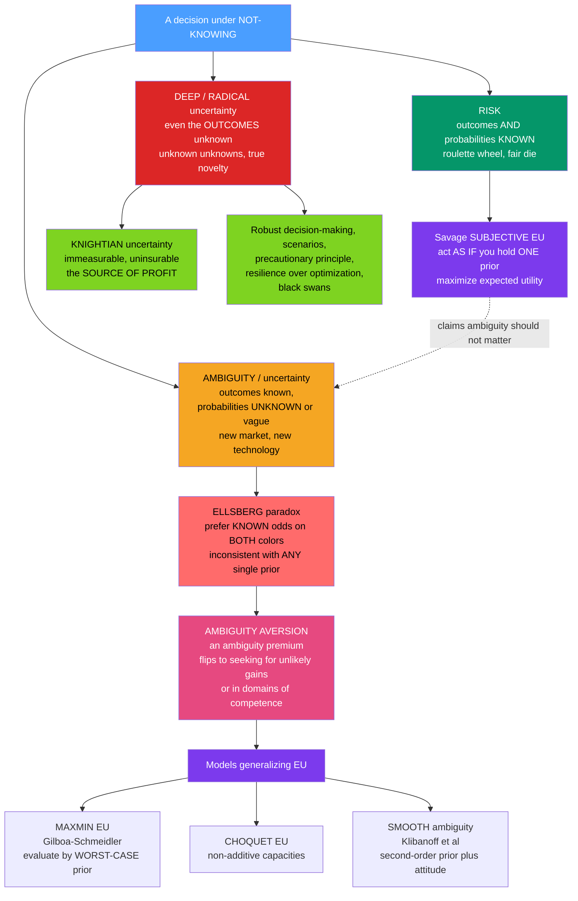

# 🎲 Risk, Ambiguity, and Uncertainty

> [!abstract] TL;DR
> Standard economics collapses every unknown into **risk** — a gamble whose odds you can compute — and then applies expected utility. But there are **three levels of not-knowing**, and the distinctions matter enormously: **risk** (outcomes *and* their probabilities are known — a fair die), **ambiguity / uncertainty** (outcomes known but probabilities unknown or vague — a new technology, an unfamiliar market), and **deep / radical uncertainty** (even the possible *outcomes* are unknown — true novelty, "unknown unknowns"). **Frank Knight (1921)** argued that measurable, insurable *risk* is fundamentally different from immeasurable *uncertainty*, and that **entrepreneurial profit** is the reward for bearing the latter. **Savage's subjective expected utility** tried to erase the distinction — a rational agent should just *act as if* it holds a precise probability for any event. The **Ellsberg paradox (1961)** decisively refuted this descriptively: people prefer *known* odds to *unknown* ones so consistently that **no single probability belief can rationalize their choices** — the phenomenon of **ambiguity aversion**. Formal repairs (**maxmin expected utility**, **Choquet** capacities, **smooth ambiguity**) model the unknown, while **deep uncertainty** (climate tipping points, pandemics, black swans) exposes the limits of expected-value thinking altogether.

## Intuition

**Analogy — the two urns.** Two urns each hold 100 balls. In the **first**, you *know* the mix: 50 red and 50 black. In the **second**, the mix is *unknown* — anywhere from 0 to 100 red. You may bet on red and win $100. Which urn do you draw from? Almost everyone picks the **known 50/50 urn**. We would rather face odds we can *measure* than odds we *cannot*, even when there is no logical reason to prefer either. And here is the twist that breaks the textbook: the very same people, offered $100 for drawing **black**, *again* prefer the known urn. If you truly believed the ambiguous urn had "probably fewer reds," you should jump at betting black on it — but you do not. This queasiness about the **unknown** — not just risk, but not even knowing the risk — is **ambiguity aversion**, and it shapes how we invest, insure, vote, and confront a genuinely uncertain world.

The move from the first urn to the second is the move from **risk** to **ambiguity**. And there is a third urn you never even get to see — one where you do not know what colors are inside, how many balls there are, or whether the game will change mid-draw. That is **deep uncertainty**, and no amount of probability arithmetic prepares you for it.

---

## How It Works

The core claim is that "not-knowing" is not one thing but a **ladder of three**, and that human behavior and good decision-making both depend on which rung you are on.

**1. Risk — the ground floor.** Outcomes *and* their probabilities are known. A roulette wheel, a fair die, a well-understood insurance pool of millions of independent policies. Classical decision theory — [[Expected_Utility_Theory_and_Its_Violations|expected utility]] — was built exactly for this rung: weight each outcome's utility by its known probability and maximize the sum. Risk is *measurable* and therefore *insurable*.

**2. Ambiguity (Knightian uncertainty) — the middle floor.** You know the *possible* outcomes but the probabilities are **unknown, vague, or contested**. What is the chance a brand-new drug has a rare side effect? That an unfamiliar foreign market returns 10 percent next year? **Frank Knight (1921)** drew the foundational line here: **risk** is a quantity you can put a number on and hedge; true **uncertainty** is not. Knight's radical corollary — that **entrepreneurial profit is the reward for bearing genuine, non-quantifiable uncertainty**, not mere risk (which competition prices away) — is erased by any theory that reduces everything to probabilities.

**3. Deep / radical uncertainty — the unknown floors above.** Even the *set of possible outcomes* is unknown: "unknown unknowns," true novelty, structural surprise. Climate tipping points, a novel pandemic, a disruptive technology, a systemic financial cascade. Here you cannot even write down the sample space, let alone a probability over it.

**The Bayesian counter-attack.** **Savage's subjective expected utility (SEU, 1954)** insists the distinction is a *mirage*: a coherent agent should always **act as if** it holds a precise (subjective, Bayesian) probability for every event — even a totally ambiguous one — and maximize expected utility with it. On this view ambiguity *should not matter*: you just form your best estimate and proceed. This is the "act as if you have probabilities" doctrine.

**Ellsberg's refutation.** **Daniel Ellsberg (1961)** showed this fails *descriptively and systematically*. In the two-urn problem, preferring the **known** urn for the **red** bet reveals you think its red-probability exceeds the ambiguous urn's; preferring the **known** urn for the **black** bet reveals the opposite. **No single probability** for the ambiguous urn can satisfy both — the preference pattern violates Savage's **sure-thing principle**. People are not mis-estimating; they are refusing to bet on odds they cannot pin down. That refusal is **ambiguity aversion**, and it carries an **ambiguity premium** — an extra discount demanded for the unknown, over and above any discount for the risk itself.

**Modeling the unknown.** Decision theory responded by *generalizing* EU to keep multiple probabilities in play at once:
- **Maxmin expected utility** (Gilboa-Schmeidler, 1989): entertain a whole **set** of possible probability distributions and evaluate any option by its **worst-case** expected utility over that set. Pessimism = robustness. The wider your set, the harsher the worst case, the larger the ambiguity premium.
- **Choquet expected utility** (Schmeidler): replace ordinary additive probability with a **non-additive capacity**, so that the weights on "red" and "not-red" need not sum to one — encoding the missing confidence.
- **Smooth ambiguity** (Klibanoff, Marinacci, Mukerji, 2005): put a **second-order distribution** over the possible probabilities and pass expected utilities through an **ambiguity-attitude function** (concave = ambiguity averse) before averaging. This separates *beliefs* from *attitude toward ambiguity* the way EU separates beliefs from risk attitude.

**When ambiguity aversion flips.** It is not universal. People become **ambiguity seeking** for **unlikely gains** (the lottery-ticket pull), and, per the **competence hypothesis** (Heath-Tversky), they will happily bet on ambiguous events **in domains where they feel knowledgeable** — a sports fan bets on the ambiguous game, not the known coin flip.



---

## Key Concepts / Details

### Secondary (intuition level)
- **Three levels of not-knowing.** Risk = you know the odds (fair die). Ambiguity = you know what can happen but not the odds (new startup). Deep uncertainty = you do not even know the full list of what can happen (the next black swan).
- **Ambiguity aversion.** We would rather bet on a known 50/50 than on an unknown mix — an extra dislike of *not knowing the odds*, separate from disliking bad odds.
- **The ambiguity premium.** The extra return, lower price, or wider margin we demand before we will accept an unknown-odds bet.
- **Knight's big idea.** Insurable, measurable *risk* is one thing; genuinely immeasurable *uncertainty* is another — and profit is the payment for facing the second.

### Undergraduate (formal level)
- **Ellsberg inconsistency (two-urn).** Let the ambiguous urn have subjective red-probability `p`. Preferring the known urn for the *red* bet implies `0.5 > p`; preferring it for the *black* bet implies `0.5 > 1 - p`, i.e. `p > 0.5`. Both cannot hold — **no** `p` exists. This violates Savage's **sure-thing principle** and subjective EU.
- **Maxmin expected utility (Gilboa-Schmeidler).** Evaluate option `f` as `V(f) = min over q in C of E_q[u(f)]`, where `C` is a closed convex **set of priors**. A singleton `C` collapses to ordinary EU; a wider `C` yields a larger worst-case discount.
- **Choquet EU.** Uses a **capacity** `v` (a non-additive set function with `v(red) + v(black) < 1` under ambiguity) and integrates via the Choquet integral; the "missing mass" `1 - v(red) - v(black)` measures ambiguity.
- **Risk vs uncertainty in one line.** Risk lives inside a fixed, known probability model; uncertainty is *about which model is true*.

### Graduate (frontier level)
- **Smooth ambiguity (KMM 2005).** `V(f) = E_mu[ phi( E_q[u(f)] ) ]`, where `mu` is a second-order distribution over first-order priors `q` and `phi` is the **ambiguity-attitude function**. Concave `phi` = ambiguity aversion; linear `phi` recovers SEU. This cleanly separates *ambiguity* (spread of `mu`) from *ambiguity attitude* (curvature of `phi`), mirroring how EU separates *risk* from *risk attitude*.
- **Multiplier preferences / robust control** (Hansen-Sargent). Penalize distance from a reference model via relative entropy; equivalent to a maxmin over a KL-ball of priors — the macro-finance workhorse for **model uncertainty**.
- **Deep uncertainty and the limits of probability.** When the state space itself is open, expected-value optimization is undefined. Approaches shift to **robust decision-making** (perform acceptably across many scenarios), **scenario planning**, the **precautionary principle**, **resilience over optimization**, and Taleb's **black swans** / antifragility — designing for surprise rather than forecasting it.
- **Fat tails and non-ergodicity.** Under heavy-tailed or non-ergodic dynamics, time-averages diverge from ensemble-averages, so even a well-defined expected value can be a *dangerous* decision criterion (ruin-avoidance dominates) — a deep critique of expected-value thinking that connects to catastrophe and climate policy.

---

## Python Demo

```python
# Risk vs AMBIGUITY: the Ellsberg paradox and ambiguity aversion, made numerical.
#
# Part (a) THE ELLSBERG PARADOX (two-urn):
#   Known urn K = 50 red / 50 black  ->  P_K(red) = P_K(black) = 0.5.
#   Ambiguous urn A = unknown mix    ->  suppose a SINGLE subjective P_A(red) = p.
#   Bet pays $100 on the chosen color, $0 otherwise (risk-neutral to isolate ambiguity).
#   The COMMON pattern is: prefer K for the RED bet AND prefer K for the BLACK bet.
#     prefer K on red   :  50  >  100 * p        ->  p < 0.5
#     prefer K on black :  50  >  100 * (1 - p)  ->  p > 0.5
#   Both at once is IMPOSSIBLE: no single p exists -> subjective EU is violated.
#
# Part (b) MAXMIN AMBIGUITY MODEL (Gilboa-Schmeidler):
#   Instead of one p, entertain a SET of priors  p in [0.5 - w, 0.5 + w].
#   Evaluate the ambiguous bet by its WORST-CASE probability (pessimism):
#     red   bet worst case -> smallest P(red)   = 0.5 - w
#     black bet worst case -> smallest P(black) = 1 - (0.5 + w) = 0.5 - w
#   Ambiguity premium = (value of KNOWN bet) - (maxmin value of AMBIGUOUS bet)
#                     = 100 * 0.5 - 100 * (0.5 - w) = 100 * w  -> grows with WIDTH w.
import numpy as np
import matplotlib.pyplot as plt

WIN = 100.0  # payoff on the winning color

# ---------------------------------------------------------------------------
# PART (a): Ellsberg inconsistency across every candidate single prior p
# ---------------------------------------------------------------------------
p = np.linspace(0.0, 1.0, 1001)                    # candidate P_A(red)

known_value        = 0.5 * WIN                      # = 50, same for red or black
amb_red_value      = p * WIN                        # betting red on ambiguous urn
amb_black_value    = (1.0 - p) * WIN               # betting black on ambiguous urn

adv_known_on_red   = known_value - amb_red_value    # > 0  =>  prefer KNOWN on red
adv_known_on_black = known_value - amb_black_value  # > 0  =>  prefer KNOWN on black

prefers_known_red   = adv_known_on_red   > 0        # region p < 0.5
prefers_known_black = adv_known_on_black > 0        # region p > 0.5
both = prefers_known_red & prefers_known_black      # the Ellsberg pattern

print("PART (a) - Ellsberg two-urn paradox")
print(f"  Prefer KNOWN urn on the RED bet   requires p < 0.5")
print(f"  Prefer KNOWN urn on the BLACK bet requires p > 0.5")
print(f"  Priors p satisfying BOTH: {int(both.sum())} of {len(p)}"
      f"  ->  NO single belief works: subjective EU is violated.\n")

# ---------------------------------------------------------------------------
# PART (b): Maxmin ambiguity premium grows with the WIDTH of the prior set
# ---------------------------------------------------------------------------
w = np.linspace(0.0, 0.5, 200)                      # half-width of prior set
maxmin_value_amb = (0.5 - w) * WIN                  # worst-case value of ambiguous bet
ambiguity_premium = known_value - maxmin_value_amb  # = 100 * w  (linear in width)

# For contrast, a SMOOTH-ambiguity style agent whose penalty is convex in the
# spread: premium grows faster than linear (illustrative, phi concave in utility).
smooth_premium = WIN * (w + 0.8 * w**2)

print("PART (b) - Maxmin ambiguity premium")
for wi in (0.0, 0.1, 0.25, 0.5):
    print(f"  width w = {wi:0.2f}  ->  maxmin value = "
          f"${(0.5 - wi) * WIN:5.1f},  ambiguity premium = ${WIN * wi:5.1f}")

# ---------------------------------------------------------------------------
# PLOTS
# ---------------------------------------------------------------------------
fig, (ax1, ax2) = plt.subplots(1, 2, figsize=(13, 5.2))

# (a) Ellsberg: the two "prefer known" regions never overlap
ax1.plot(p, adv_known_on_red,   color="#059669", lw=2.4,
         label="advantage of KNOWN urn on RED bet")
ax1.plot(p, adv_known_on_black, color="#dc2626", lw=2.4,
         label="advantage of KNOWN urn on BLACK bet")
ax1.axhline(0, color="black", lw=1)
ax1.axvline(0.5, color="#7c3aed", ls="--", lw=1.8, label="p = 0.5 knife-edge")
ax1.fill_between(p, -60, 60, where=prefers_known_red,   color="#059669", alpha=0.08)
ax1.fill_between(p, -60, 60, where=prefers_known_black, color="#dc2626", alpha=0.08)
ax1.set_xlabel("assumed single subjective prior  p = P(red) on ambiguous urn")
ax1.set_ylabel("dollar advantage of the KNOWN urn")
ax1.set_title("(a) Ellsberg: no single p makes BOTH bets prefer the known urn")
ax1.legend(fontsize=8, loc="upper center"); ax1.grid(alpha=0.3)

# (b) Ambiguity premium vs width of the prior set
ax2.plot(w, ambiguity_premium, color="#f5a623", lw=2.6,
         label="MAXMIN premium = 100 * w  (linear)")
ax2.plot(w, smooth_premium, color="#7c3aed", lw=2.2, ls="--",
         label="smooth-ambiguity style (convex)")
ax2.fill_between(w, 0, ambiguity_premium, color="#f5a623", alpha=0.12)
ax2.set_xlabel("width w of the prior set  [0.5 - w, 0.5 + w]  (ambiguity)")
ax2.set_ylabel("ambiguity premium  (dollars discounted)")
ax2.set_title("(b) Ambiguity-averse agent discounts the unknown urn")
ax2.legend(fontsize=9, loc="upper left"); ax2.grid(alpha=0.3)

plt.tight_layout()
plt.savefig("risk_ambiguity_uncertainty.png", dpi=120)
print("\nSaved figure: risk_ambiguity_uncertainty.png")
```

Running it prints the decisive Ellsberg result: choosing the known urn on the *red* bet requires `p < 0.5`, choosing it on the *black* bet requires `p > 0.5`, and **zero** priors satisfy both — the common preference pattern is inconsistent with holding *any* single probability belief about the ambiguous urn, so subjective expected utility cannot represent it. The left panel makes this visual: the green "prefer known on red" region (`p < 0.5`) and the red "prefer known on black" region (`p > 0.5`) meet only at the knife-edge `p = 0.5`, never overlapping. The right panel shows the **maxmin** repair in action — as the width `w` of the entertained prior set grows from 0 (pure risk) to 0.5 (total ambiguity), the worst-case evaluation slides down and the **ambiguity premium grows linearly** (`$100 * w`), while a smooth-ambiguity-style agent's premium bends convexly. The premium is the price of not knowing the odds, distinct from any discount for the odds themselves.

---

## Real-World Applications

- **Financial markets.** Ambiguity aversion helps explain the **equity premium puzzle** (investors demand extra return when the return distribution itself is uncertain, not just volatile), **flight-to-quality / flight-to-safety** in crises (a stampede into Treasuries when *models* break down), chronic **under-diversification** and **home bias** (people over-hold familiar assets whose odds they feel they know), and the mispricing of genuinely "unknown" risks. This is where the behavioral picture meets asset pricing — see [[Behavioral_Finance]] and the not-yet-written **Market_Anomalies_and_Limits_to_Arbitrage**.
- **Insurance.** Insurers themselves are ambiguity averse: **ambiguous risks** (novel liabilities, correlated catastrophe exposure, emerging cyber risk) are systematically **under-supplied and over-priced** relative to their actuarial expected loss, because the *loss distribution* is contested. The uninsurable tail is precisely Knight's uncertainty.
- **Climate and catastrophe policy.** The canonical **deep-uncertainty** arena: tipping points, **fat tails**, and unforeseeable outcomes make expected-value cost-benefit fragile (Weitzman's "dismal theorem"). This motivates the **precautionary principle**, **robust decision-making**, and resilience-first design — connecting to [[Bifurcations_and_Tipping_Points]] and [[Resilience_and_Robustness]].
- **Medical and regulatory decisions.** Approving a novel drug or technology means acting when the probability of a rare harm is genuinely unknown; ambiguity aversion pushes toward caution (and sometimes paralysis), while the competence effect shapes which experts feel comfortable betting.
- **Entrepreneurship.** Knight's original application: the entrepreneur earns **profit** precisely for bearing *non-quantifiable* uncertainty that no insurer will price and no market has already competed away. Bearing the immeasurable is the job.
- **Systemic risk.** Financial cascades and pandemics are structurally uncertain, not merely risky — the sample space shifts as the crisis unfolds. See [[Cascades_and_Systemic_Risk]].

---

## Common Pitfalls

- **Collapsing ambiguity into risk.** The single most common error: assigning the ambiguous urn a "reasonable 50/50" and proceeding as if it were the known urn. The Ellsberg pattern proves people *do not* treat these as equivalent, and pretending they are erases the ambiguity premium that drives home bias, flight-to-safety, and under-supplied insurance.
- **Treating deep uncertainty as ambiguity.** Ambiguity still has a fixed, known outcome set; deep uncertainty does not. Building an ever-wider probability distribution does not rescue you when the *next outcome was not in your list at all* — that is a black-swan blind spot, not a wide prior.
- **Reading Ellsberg as irrationality.** Ambiguity aversion is a *coherent response to model uncertainty*, formalized by maxmin, Choquet, and smooth-ambiguity theories. It violates Savage's axioms, not logic. Calling it a "bias" to be corrected misses that robustness is often *wise*.
- **Confusing risk aversion with ambiguity aversion.** Risk aversion is curvature of utility over *outcomes* with **known** probabilities; ambiguity aversion is an extra distaste for **unknown** probabilities. An agent can be risk-neutral yet strongly ambiguity averse — exactly the setup in the demo.
- **Over-trusting expected values under fat tails.** When the loss distribution is heavy-tailed or non-ergodic, the expected value can be finite yet decision-irrelevant because a single ruinous draw ends the game. Ruin-avoidance, not expectation-maximization, should govern.
- **False precision in models.** Maxmin, Choquet, and smooth-ambiguity models still require you to specify a *set* of priors or a second-order distribution — themselves guesses. The tools discipline ignorance; they do not abolish it.

---

## Related Concepts

This note sits in **Behavioral_Economics / 02_Prospect_Theory_and_Risk** and depends directly on its foundations sibling [[Expected_Utility_Theory_and_Its_Violations]] (the Ellsberg paradox is the ambiguity half of that note's story). Its other not-yet-written siblings extend it: **Prospect_Theory** (the reference-dependent, loss-averse value function for decisions under *risk*), **Probability_Weighting_and_Certainty_Effect** (nonlinear weighting of *known* probabilities — the complement to unknown ones here), **Overconfidence_and_Calibration** (mis-estimating one's own uncertainty, the flip side of ambiguity aversion), and **Market_Anomalies_and_Limits_to_Arbitrage** (where ambiguity premia survive in prices).

Verified cross-vault links:
- [[Expected_Utility_Theory_and_Its_Violations]] — Behavioral_Economics sibling: EU and its Ellsberg/Allais violations; this note deep-dives the ambiguity branch.
- [[Utility_Theory]] — Microeconomics: the utility foundation that risk attitude curves and that ambiguity models generalize.
- [[Asymmetric_Information]] — Microeconomics: information gaps between parties, a different but adjacent "not-knowing" that also breaks first-best markets.
- [[Probability_Theory]] — Mathematics: the additive probability calculus that ambiguity (non-additive capacities, prior sets) departs from.
- [[Bayesian_Statistics]] — Mathematics: the single-prior Bayesian view Savage's SEU embodies and Ellsberg challenges.
- [[Value_at_Risk]] — Quantitative Finance: a risk metric that presumes a known loss distribution — exactly what deep uncertainty denies.
- [[Behavioral_Finance]] — Finance: home bias, flight-to-safety, and the equity premium as ambiguity-aversion footprints in asset prices.
- [[Prospect_Theory_and_Loss_Aversion]] — Finance: the risk-side companion; ambiguity aversion layers on top of reference dependence.
- [[Cognitive_Biases]] — Psychology: ambiguity aversion and the competence effect as systematic judgment tendencies.
- [[Cascades_and_Systemic_Risk]] — Systems Thinking: systemic financial and network failures as deep, structurally uncertain events.
- [[Resilience_and_Robustness]] — Systems Thinking: designing for robustness over optimization when probabilities are unknowable.
- [[Bifurcations_and_Tipping_Points]] — Systems Thinking: climate/regime tipping points, the archetype of fat-tailed deep uncertainty.
- [[Maximum_Entropy_Principle]] — Information Theory: the principled way to assign a *single* least-committal prior under ignorance — the Bayesian answer that ambiguity aversion rejects.
- [[Insurance_and_Personal_Risk]] — Finance: why measurable risk is insurable and Knightian uncertainty is not.

## Review Questions

1. **(Secondary)** Using the two-urn story, explain the difference between *risk* and *ambiguity*, and describe what "ambiguity aversion" means. Why is preferring the known urn for *both* the red bet and the black bet the surprising part?
2. **(Undergraduate)** Set up the Ellsberg two-urn choices formally with a single subjective prior `p = P(red)` on the ambiguous urn (risk-neutral, $100 payoff). Show that preferring the known urn on red requires `p < 0.5` while preferring it on black requires `p > 0.5`, and explain why this proves no subjective-EU representation exists. Then show how a maxmin agent with prior set `[0.5 - w, 0.5 + w]` avoids the contradiction and generates an ambiguity premium of `100w`.
3. **(Graduate)** Compare Knightian uncertainty, Savage's subjective EU, and the three ambiguity models (maxmin, Choquet, smooth ambiguity): which one best captures the *separation of ambiguity from ambiguity attitude*, and why? Then argue where all of them still fail — i.e., under **deep/radical uncertainty** with an open outcome set — and defend one non-probabilistic response (robust decision-making, the precautionary principle, or resilience) for climate or pandemic policy.

---

## Sources

- Knight, F. H. (1921). *Risk, Uncertainty, and Profit*. Houghton Mifflin. (The foundational risk-vs-uncertainty distinction and the theory of profit.)
- Ellsberg, D. (1961). "Risk, Ambiguity, and the Savage Axioms." *Quarterly Journal of Economics* 75(4), 643-669. (The Ellsberg paradox and ambiguity aversion.)
- Savage, L. J. (1954). *The Foundations of Statistics*. Wiley. (Subjective expected utility and the sure-thing principle.)
- Gilboa, I. & Schmeidler, D. (1989). "Maxmin Expected Utility with Non-Unique Prior." *Journal of Mathematical Economics* 18(2), 141-153. (Multiple-priors / maxmin model.)
- Klibanoff, P., Marinacci, M. & Mukerji, S. (2005). "A Smooth Model of Decision Making under Ambiguity." *Econometrica* 73(6), 1849-1892. (Second-order beliefs and the ambiguity-attitude function.)
- Heath, C. & Tversky, A. (1991). "Preference and Belief: Ambiguity and Competence in Choice under Uncertainty." *Journal of Risk and Uncertainty* 4(1), 5-28. (The competence hypothesis and ambiguity seeking.)

#behavioral-economics #ambiguity-aversion #knightian-uncertainty #ellsberg #risk-vs-uncertainty
