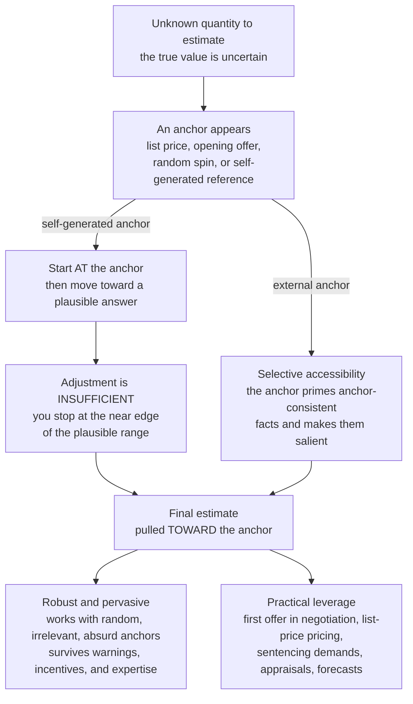

# ⚓ Anchoring and Adjustment

> [!abstract] TL;DR
> **Anchoring** — one of Tversky and Kahneman's three original heuristics — is the tendency, when estimating an unknown quantity, to start from an initial value (the **anchor**) and adjust toward the answer, but to **adjust insufficiently**, leaving the final estimate biased *toward the anchor*. It is one of the most robust effects in psychology: it works with **random, irrelevant, and even absurd** anchors, survives **warnings and incentives**, and biases **experts** (judges, appraisers, doctors) as readily as novices. Two mechanisms drive it — **insufficient adjustment** (mostly for self-generated anchors) and **selective accessibility** (the anchor primes anchor-consistent evidence, mostly for externally-provided anchors). Because the **first number wins**, anchoring makes the opening offer decisive in negotiation, powers retail pricing tactics ("was \$200, now \$99," suggested prices, decoys, "limit 12 per customer"), and distorts legal sentencing and forecasts — making an understanding of how to avoid anchors and how to *set* them a practically indispensable piece of behavioral economics.

---

## Intuition

**Analogy:** Imagine a game-show wheel that is secretly rigged to stop on **65**. It spins, lands on 65, and then you are asked: *what percentage of African nations are members of the UN?* People who saw 65 guess high — a median around 45. Now rig the same wheel to land on **10**, spin it in front of a different group, and ask the identical question. They guess low — a median around 25. A completely **random, irrelevant number** — one everyone watched a wheel produce, with no bearing whatsoever on African geopolitics — silently dragged their estimate toward it.

That is **anchoring**: the first number you see becomes a kind of mental gravity well, and your final judgment ends up *orbiting* it. It happens with the list price on a used car, the opening bid in a salary talk, the "was \$200" on a discount tag, and even a number you generate yourself. The unnerving part is that the anchor does not even have to be *plausible* to bias you — ask people whether Gandhi died before or after age 140, then ask his age at death, and their guesses climb, absurd anchor and all.

---

## How It Works

### Core Mechanics

1. **Estimation starts somewhere.** Faced with "how much / how many / how likely?", the mind does not compute from a blank slate. It grabs a convenient starting value — the **anchor** — which may be externally supplied (a price, an opening offer) or self-generated (adjusting from a known landmark, like starting at water's freezing point to estimate the freezing point of vodka).
2. **Adjustment moves toward the answer — but stops short.** From the anchor, the estimator adjusts in the plausible direction. Crucially, the adjustment is **insufficient**: people stop at the *near edge* of the range they would consider acceptable rather than travelling to its center. The estimate therefore lands **between the anchor and the true value, closer to the anchor** than it should.
3. **The anchor need not be relevant — or even sane.** The signature of anchoring is that it operates with anchors that are demonstrably uninformative: numbers from a rigged wheel, the last two digits of a **Social Security number** (which shift how much people will pay for wine and gadgets), and grotesque implausible values (populations of "more or less than 50 million?" vs "more or less than 1 billion?"). Even anchors people *know* are random still pull.
4. **Two mechanisms, one effect.** Modern accounts separate the drivers:
   - **Insufficient adjustment** (Tversky and Kahneman, 1974; Epley and Gilovich, 2001, 2006) — the *original* account, strongest for **self-generated** anchors. You deliberately start at a known value and move, but terminate the effortful search prematurely, often once you reach a merely *plausible* answer.
   - **Selective accessibility / anchoring-as-priming** (Strack and Mussweiler, 1997; Chapman and Johnson) — strongest for **externally-provided** anchors. Entertaining the anchor (even to reject it) makes anchor-*consistent* information more accessible and salient, biasing the subsequent judgment. Testing "is it more than 65?" recruits reasons it might be high, which then color the numeric answer.
5. **Anchoring is astonishingly robust.** It resists nearly every intervention that "should" kill a mere reasoning slip: it persists when people are **warned** in advance, when they are **incentivized for accuracy**, when the anchor is **explicitly labelled random**, when they are experts on the topic, and across wildly different domains — numeric estimates, monetary valuations, probability judgments, and even judicial sentencing. This reliability makes it one of the field's most replicable findings and a cornerstone of the parent [[Heuristics_and_Biases_Overview]].
6. **Self-generated vs external anchors bias differently.** Both pull, but by different routes: self-generated anchors (you *know* the anchor is wrong and adjust) yield insufficient-adjustment effects that shrink somewhat with effort and accuracy motivation; external anchors (a list price you did not invent) work largely through selective accessibility and are far harder to shake. The **two-process view** holds that both operate, weighted by anchor type.

### Flow / Architecture



---

## Key Concepts

**Secondary (intuitive grasp).** An **anchor** is the first number you happen to see, and your guess sticks near it even when the number is meaningless. If a store tags a jacket "was \$200, now \$99," the \$200 is an anchor that makes \$99 feel like a steal — regardless of what the jacket is truly worth. In a negotiation, whoever names a price *first* usually gets a final deal closer to their number. The rule of thumb: **the first number in the room casts a long shadow over the last.**

**Undergraduate (mechanism and named effects).** Anchoring is one of the three canonical heuristics (with **availability** and **representativeness**, treated in the sibling *Availability_and_Representativeness*). Its engine is **anchor-then-adjust with insufficient adjustment**: the final estimate is a weighted blend of the anchor and one's own belief, with a stubbornly heavy weight on the anchor. The strength of the effect is measured by the **anchoring index** — the fraction of the *difference between a high and a low anchor* that carries through into the difference between the two groups' estimates. Empirically this index runs about **30 to 50 percent**. Two mechanisms are distinguished: **insufficient adjustment** for self-generated anchors and **selective accessibility** for external ones. The classic demonstrations are the **wheel-of-fortune / UN-membership** study and the **Gandhi / implausible-anchor** studies.

**Graduate (robustness, moderators, and the debate).** Anchoring's most striking property is its **imperviousness to correction**: forewarning, accuracy incentives, and explicit random-anchor labels barely dent it (Wilson et al., 1996; Epley and Gilovich, 2005). Moderators do exist — effects are larger for uncertain, hard-to-estimate quantities, and **"consider-the-opposite"** (deliberately generating reasons the estimate should be far from the anchor) is among the few interventions with reliable, if partial, debiasing power (Mussweiler, Strack and Pfeiffer, 2000). The **two-process controversy** — whether one mechanism (selective accessibility) can explain all anchoring, or whether self-generated anchors genuinely engage separate adjustment machinery — remains live, with Epley and Gilovich defending a *dual* account. A methodological caveat: some celebrated single studies (e.g., the SSN-and-wine result of Ariely, Loewenstein and Prelec, 2003) have seen **replication debate**, so the field now leans on the *aggregate* robustness of dozens of anchoring paradigms rather than any one showpiece.

---

## Python Demo

```python
# Two demonstrations of anchoring, quantified.
#   (a) THE CLASSIC EXPERIMENT: two groups estimate an unknown quantity after
#       seeing a random LOW vs HIGH anchor. Each person starts from the anchor
#       and adjusts toward their own belief, but INSUFFICIENTLY (only a fraction
#       'adj' of the way). Group means end up pulled toward their anchors, and
#       the "anchoring index" recovers how much of the anchor gap carries through
#       (typically ~30-50%).
#   (b) AN APPLICATION: a high "list price" anchor raises willingness-to-pay,
#       and a seller's first offer anchors the final negotiated price.
import numpy as np
import matplotlib.pyplot as plt

rng = np.random.default_rng(7)

# ---------- (a) Wheel-of-fortune style anchoring ----------------------------
true_value = 23.0          # e.g. true % of African nations in the UN (stylized)
belief_sd  = 8.0           # people are genuinely uncertain -> dispersed beliefs
adj        = 0.60          # ADJUSTMENT is only 60% of the gap (insufficient)
A_low, A_high = 10.0, 65.0 # random anchors from the rigged wheel
N = 5000

# estimate = anchor + adj*(belief - anchor) = adj*belief + (1-adj)*anchor
# The weight on the anchor is (1 - adj); that IS the anchoring index.
belief_low  = rng.normal(true_value, belief_sd, N)
belief_high = rng.normal(true_value, belief_sd, N)
est_low  = adj * belief_low  + (1 - adj) * A_low
est_high = adj * belief_high + (1 - adj) * A_high

anchoring_index = (np.median(est_high) - np.median(est_low)) / (A_high - A_low)

print("=== (a) Classic anchoring experiment ===")
print(f"true value                 : {true_value:.0f}")
print(f"low-anchor median estimate : {np.median(est_low):.1f}  (anchor {A_low:.0f})")
print(f"high-anchor median estimate: {np.median(est_high):.1f}  (anchor {A_high:.0f})")
print(f"anchoring index            : {anchoring_index:.2%}  "
      f"(should be ~ 1 - adj = {1 - adj:.0%})")

# Sweep the anchor across a range to show the estimate tracking it linearly;
# the slope of mean-estimate vs anchor is exactly the anchoring index.
anchors = np.linspace(0, 100, 21)
mean_est = [np.mean(adj * rng.normal(true_value, belief_sd, N) + (1 - adj) * a)
            for a in anchors]
slope = np.polyfit(anchors, mean_est, 1)[0]

# ---------- (b) Application: list-price anchor on willingness-to-pay --------
mu_v, sd_v = 50.0, 12.0     # intrinsic value of the product ($)
w = 0.30                    # WTP absorbs 30% of the gap to the anchor price
V = rng.normal(mu_v, sd_v, N)
list_low, list_high = 60.0, 120.0    # "suggested retail price" anchors
wtp_none = V                                   # no anchor shown
wtp_low  = V + w * (list_low  - V)             # modest anchor
wtp_high = V + w * (list_high - V)             # aggressive "was $120" anchor

print("\n=== (b) List-price anchor on willingness-to-pay ===")
print(f"mean WTP no anchor    : ${wtp_none.mean():.2f}")
print(f"mean WTP low anchor   : ${wtp_low.mean():.2f}  (list ${list_low:.0f})")
print(f"mean WTP high anchor  : ${wtp_high.mean():.2f}  (list ${list_high:.0f})")
print(f"WTP lift from anchor  : ${wtp_high.mean() - wtp_none.mean():.2f}")

# Negotiation: a seller's first offer anchors the settlement inside the ZOPA.
Rs, Rb = 60.0, 100.0                 # seller/buyer reservation prices
fair = 0.5 * (Rs + Rb)               # naive fair split = 80
a_neg = 0.35                         # settlement absorbs 35% of first-offer pull
first_offers = np.linspace(85, 130, 30)
settlement = np.clip(fair + a_neg * (first_offers - fair), Rs, Rb)
neg_slope = np.polyfit(first_offers, settlement, 1)[0]
print(f"\nnegotiation: settlement rises {neg_slope:.2f} per $1 of first offer")

# ---------- plots -----------------------------------------------------------
fig, ax = plt.subplots(2, 2, figsize=(13, 9))

bins = np.linspace(-5, 80, 45)
ax[0, 0].hist(est_low,  bins=bins, alpha=0.6, color="#2563eb",
              label=f"low anchor {A_low:.0f}  (median {np.median(est_low):.0f})")
ax[0, 0].hist(est_high, bins=bins, alpha=0.6, color="#dc2626",
              label=f"high anchor {A_high:.0f}  (median {np.median(est_high):.0f})")
ax[0, 0].axvline(true_value, color="black", ls="--", lw=1.5, label="true value")
ax[0, 0].set_title("Classic anchoring: same question, two random anchors")
ax[0, 0].set_xlabel("estimate"); ax[0, 0].set_ylabel("count"); ax[0, 0].legend(fontsize=8)

ax[0, 1].plot(anchors, mean_est, "o-", color="#7c3aed",
              label=f"mean estimate  (slope = index = {slope:.2f})")
ax[0, 1].plot(anchors, anchors, "--", color="gray", label="if fully anchored  y = x")
ax[0, 1].axhline(true_value, color="black", ls=":", label="true value")
ax[0, 1].set_title("Estimate tracks the anchor: slope IS the anchoring index")
ax[0, 1].set_xlabel("anchor value"); ax[0, 1].set_ylabel("mean estimate")
ax[0, 1].legend(fontsize=8)

wbins = np.linspace(20, 100, 45)
ax[1, 0].hist(wtp_none, bins=wbins, alpha=0.55, color="#059669",
              label=f"no anchor (mean ${wtp_none.mean():.0f})")
ax[1, 0].hist(wtp_high, bins=wbins, alpha=0.55, color="#dc2626",
              label=f'"was ${list_high:.0f}" (mean ${wtp_high.mean():.0f})')
ax[1, 0].axvline(wtp_none.mean(), color="#059669", ls="--")
ax[1, 0].axvline(wtp_high.mean(), color="#dc2626", ls="--")
ax[1, 0].set_title("Application: a high list price lifts willingness-to-pay")
ax[1, 0].set_xlabel("willingness-to-pay ($)"); ax[1, 0].set_ylabel("count")
ax[1, 0].legend(fontsize=8)

ax[1, 1].plot(first_offers, settlement, color="#dc2626", lw=2.5,
              label=f"settlement  (slope {neg_slope:.2f})")
ax[1, 1].axhline(fair, color="gray", ls="--", label="naive fair split")
ax[1, 1].fill_between(first_offers, Rs, Rb, color="#fde68a", alpha=0.3,
                      label="ZOPA (bargaining range)")
ax[1, 1].set_title("Negotiation: the seller's first offer anchors the deal")
ax[1, 1].set_xlabel("seller's first offer ($)"); ax[1, 1].set_ylabel("final price ($)")
ax[1, 1].legend(fontsize=8)

plt.tight_layout()
plt.savefig("anchoring_and_adjustment.png", dpi=120)
plt.show()
```

Running it prints an **anchoring index near 40 percent** — exactly `1 - adj` — meaning roughly 40 percent of the 55-point gap between the random low and high anchors survives into the two groups' estimates, even though the anchors are pure noise. The application panels show a high "was \$120" list price lifting mean willingness-to-pay by tens of dollars over the no-anchor baseline, and a seller's first offer moving the final negotiated price by about \$0.35 per dollar of opening ask — the tactical logic of anchoring first.

---

## Real-World Applications

> **Example (negotiation):** In salary and deal-making, the **first offer anchors the entire negotiation**. Experimental and field studies (Galinsky and Mussweiler, 2001) find that the party who makes an aggressive-but-not-absurd opening offer secures a final settlement measurably closer to their target — often explaining a large share of the outcome variance. This is why the advice to "let the other side name a number first" can backfire: you have just ceded the anchor. When you cannot avoid receiving an extreme anchor, the counter is to *re-anchor* immediately with your own number rather than adjusting from theirs.

- **Retail and marketing.** "Manufacturer's suggested retail price," the crossed-out "was \$200, now \$99," decoy high-end options that make mid-tier products look reasonable, expensive dishes that anchor the rest of a menu, and "**limit 12 per customer**" signs (which raise average purchase quantity by anchoring on 12) are all anchoring exploited commercially. The anchor inflates *perceived value* and *willingness-to-pay* even when shoppers discount it.
- **Legal sentencing.** Judges' sentences are pulled toward the **prosecutor's demand** — and in a striking study (Englich, Mussweiler and Strack, 2006), toward sentence numbers determined by **rolling dice** in front of them. Expertise provides little immunity; the criminal-justice reach of anchoring is genuinely sobering.
- **Appraisals and valuation.** Real-estate agents' "expert" appraisals shift substantially with the property's **listing price** (Northcraft and Neale, 1987), even as the agents deny being influenced. Analysts' price targets cluster near current prices; forecasters anchor on the last observation.
- **Medicine and forecasting.** Initial diagnoses anchor subsequent judgment (**diagnosis momentum**), and project forecasts anchor on the first plausible estimate — connecting to the planning fallacy and the reference-class fixes discussed under *Overconfidence_and_Calibration*.

Anchoring is also the lever behind much of **choice architecture**: default values, slider start-points, and suggested donation amounts all set anchors, a theme developed in the sibling *Nudges_and_Choice_Architecture*, while its role as a *reference point* that reshapes valuation connects to *Reference_Dependence_and_Framing* and [[Loss_Aversion_and_the_Endowment_Effect]].

---

## Common Pitfalls

- **Believing awareness protects you** — knowing about anchoring does *not* stop the anchor from pulling your estimate, any more than knowing about an optical illusion makes the lines look equal. Warnings and even accuracy incentives leave the effect largely intact; reliable fixes are *procedural* (generate your own estimate before seeing any anchor; consider-the-opposite), not motivational.
- **Assuming only "plausible" anchors bias** — random, irrelevant, and outright absurd anchors work too. Do not dismiss an anchor as harmless just because it is obviously unrelated to the quantity in question.
- **Letting the other side anchor in negotiation** — ceding the first offer hands over the anchor. If you must respond to an extreme opener, *re-anchor* with your own well-justified number rather than "adjusting" from theirs (which cements their anchor as the reference).
- **Confusing anchoring with a fixed weighted average** — the anchoring index varies with task difficulty, expertise, anchor type (self-generated vs external), and stakes. The ~30 to 50 percent figure is a robust *average*, not a constant to plug in blindly.
- **Treating one showpiece study as the whole phenomenon** — some famous single results (e.g., the Social-Security-number wine study) face replication debate. Anchoring is well established in *aggregate* across dozens of paradigms; rest the claim on that body, not on any single dramatic experiment.
- **Over-adjusting your debiasing** — the fix for a known anchor is *not* to swing wildly to the opposite extreme (which just creates a new anchor), but to build the estimate from an independent base rate or first-principles calculation.

---

## Related Concepts

- [[Heuristics_and_Biases_Overview]] — the parent program; anchoring is one of Tversky and Kahneman's three original heuristics alongside availability and representativeness.
- [[Dual_Process_Theory_System_1_and_2]] — the anchor's pull is a fast, automatic System-1 process; the effortful (and insufficient) adjustment toward the true value is System 2's job.
- [[Loss_Aversion_and_the_Endowment_Effect]] — anchors set *reference points*, the same mechanism whose shifts drive reference-dependent valuation and the endowment effect.
- [[Cognitive_Biases]] — Psychology-vault catalog of the "bias zoo" in which anchoring is a headline entry.
- [[Judgment_and_Decision_Making]] — the cognitive-science treatment of estimation and choice under uncertainty where anchoring is a core distortion.
- [[Cognitive_Biases_and_Heuristics]] — the Logic-and-Critical-Thinking view, connecting anchoring to reasoning errors and debiasing (consider-the-opposite).
- [[Decision_Making_Under_Uncertainty]] — how anchoring corrupts point estimates and probability judgments when the true value is genuinely uncertain.
- [[Bargaining_Theory]] — the game-theoretic model of offers and settlements that anchoring reshapes in practice through the first-offer effect.
- [[Consumer_and_Producer_Surplus]] — willingness-to-pay is the surplus concept that list-price and "was/now" anchors inflate.
- [[Price_Discrimination]] — the pricing and valuation tactics (decoys, reference prices) that anchoring exploits to extract surplus.

*Not yet written (Behavioral_Economics siblings referenced above in prose): Availability_and_Representativeness, Reference_Dependence_and_Framing, Nudges_and_Choice_Architecture, Overconfidence_and_Calibration.*

---

## Review Questions

1. **(Conceptual)** Distinguish the two mechanisms behind anchoring — *insufficient adjustment* and *selective accessibility* — and explain which one better accounts for a **self-generated** anchor (estimating vodka's freezing point by adjusting down from water's) versus an **externally-provided** anchor (a used-car list price). Why does the distinction matter for predicting which debiasing interventions will help?
2. **(Scenario)** You are negotiating a contract and the other side opens with a number you consider outrageous. One colleague says "ignore it, it's absurd, just state a fair price." Using what you know about anchoring's robustness to warnings and about implausible anchors, explain why simply "ignoring" the offer is dangerous, and describe the tactically correct response.
3. **(Trade-off / measurement)** The **anchoring index** typically runs 30 to 50 percent and is highly robust, yet some individual anchoring studies have failed to replicate. As a policymaker deciding whether to ban "was/now" reference-price advertising, how much weight should you place on the anchoring literature, and what specific evidence would you demand before acting? Argue both sides.

---

## Sources

- Tversky, A. & Kahneman, D. (1974). "Judgment under Uncertainty: Heuristics and Biases." *Science*, 185(4157), 1124–1131.
- Strack, F. & Mussweiler, T. (1997). "Explaining the Enigmatic Anchoring Effect: Mechanisms of Selective Accessibility." *Journal of Personality and Social Psychology*, 73(3), 437–446.
- Epley, N. & Gilovich, T. (2006). "The Anchoring-and-Adjustment Heuristic: Why the Adjustments Are Insufficient." *Psychological Science*, 17(4), 311–318.
- Englich, B., Mussweiler, T. & Strack, F. (2006). "Playing Dice with Criminal Sentences: The Influence of Irrelevant Anchors on Experts' Judicial Decision Making." *Personality and Social Psychology Bulletin*, 32(2), 188–200.
- Galinsky, A. D. & Mussweiler, T. (2001). "First Offers as Anchors: The Role of Perspective-Taking and Negotiator Focus." *Journal of Personality and Social Psychology*, 81(4), 657–669.
- Northcraft, G. B. & Neale, M. A. (1987). "Experts, Amateurs, and Real Estate: An Anchoring-and-Adjustment Perspective on Property Pricing Decisions." *Organizational Behavior and Human Decision Processes*, 39(1), 84–97.

---

#behavioral-economics #anchoring #adjustment #cognitive-bias #negotiation
