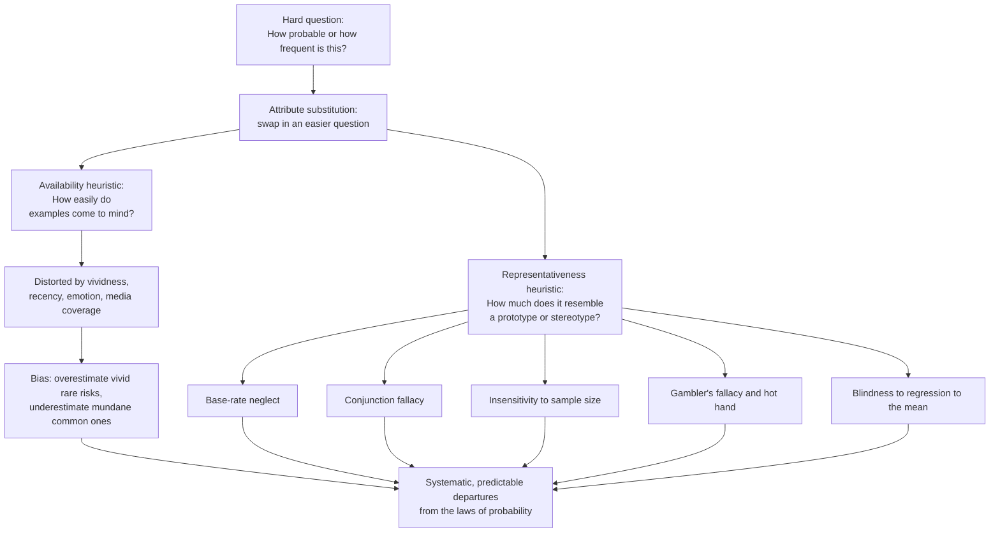

# 🧠 Availability and Representativeness

> [!abstract] TL;DR
> **Availability** and **representativeness** are two of Kahneman and Tversky's three original judgment heuristics: availability estimates *how frequent or probable* something is by *how easily examples come to mind*, and representativeness estimates *how probable a category or process is* by *how much the case resembles a prototype*. Both work by substituting an easy question for a hard one, and both are usually adaptive — but they misfire in lawful ways. Availability makes us **overweight vivid, recent, media-covered risks** (fearing sharks over cars); representativeness produces **base-rate neglect**, the **conjunction fallacy** (Linda), **insensitivity to sample size**, the **gambler's fallacy**, and blindness to **regression to the mean**. Together they explain why human probability judgment departs so predictably from the laws of probability, distorting risk perception, finance, stereotyping, and medical, legal, and policy decisions.

---

## Intuition

**Analogy:** After the news runs footage of a shark attack, swimmers stay ashore — even though you are far likelier to die *driving to the beach* than in the water. Vivid, recent, dramatic events spring to mind effortlessly, so we judge them as more *common* than they are. That is the **availability heuristic**: frequency read off ease of recall. Now meet a shy, bookish, detail-loving stranger and you will guess "librarian" over "salesperson" — ignoring that there are perhaps fifty times more salespeople than librarians in the world. That is the **representativeness heuristic**: probability read off resemblance to a stereotype, with the base rate quietly thrown away.

Both shortcuts answer a hard question ("how likely is this, really?") by silently swapping in an easier one ("how easily can I recall it?" or "how much does it look like the type?"). The swap usually works — genuinely common things *are* easier to recall, and members of a category usually *do* resemble the prototype. The biases are the systematic exceptions, where the easy cue and the true probability come apart, and our judgment follows the cue right off the cliff.

---

## How It Works

### Core Mechanics

Both heuristics are instances of **attribute substitution**: when the target question (a probability or frequency) is too hard to compute, System 1 substitutes a related attribute that is easy to evaluate, and reports *that* answer as if it had answered the original.

**Availability — judging frequency by ease of retrieval.**
1. To estimate "how common is X?", the mind tries to retrieve instances of X and monitors how *fluently* they come.
2. Fluent, effortless retrieval is taken as evidence of high frequency ("if I can think of it easily, it must be common").
3. This is a *good* cue on average — common events genuinely leave more traces in memory. But retrieval fluency is driven by many things *other* than frequency: **vividness**, **recency**, **emotional salience**, personal involvement, and — decisively in the modern world — **media coverage**.
4. The result is a systematic distortion: **rare-but-vivid** causes (plane crashes, terrorism, shark attacks, homicide, lottery jackpots) are *overestimated*, while **common-but-mundane** ones (diabetes, stroke, ordinary car accidents) are *underestimated*.
5. Feedback loops amplify it. In an **availability cascade**, media attention raises availability, which raises public concern, which drives still more coverage — a self-reinforcing spiral that can make a statistically minor hazard dominate policy.

**Representativeness — judging probability by similarity to a prototype.**
1. To estimate "how likely is it that this belongs to category C (or was produced by process P)?", the mind judges how much the case *resembles* the prototypical C (or the prototypical output of P).
2. High similarity is read as high probability ("it looks like an X, so it's probably an X").
3. Similarity is usually a decent proxy for category membership — but it is blind to statistical facts that probability *requires*, producing a whole cluster of errors:
   - **Base-rate neglect** — ignoring prior probabilities. A vivid description of a "quiet, tidy, detail-oriented" person makes us say "librarian," disregarding that salespeople vastly outnumber librarians (foreshadowing the sibling *Base_Rate_Neglect_and_Bayesian_Reasoning*).
   - **The conjunction fallacy** — judging a specific conjunction more probable than one of its components. In the **Linda problem**, most people rank "Linda is a bank teller *and* a feminist" as more likely than "Linda is a bank teller," which is mathematically impossible: a conjunction can never exceed its component, since `P(A and B) <= P(A)`. The conjunction just *resembles* Linda better.
   - **Insensitivity to sample size** — expecting even small samples to mirror the population. In the **hospital problem**, people judge that a small and a large hospital are equally likely to record a day with 60 percent boys, when small samples in fact swing far more widely.
   - **The gambler's fallacy** — expecting short random sequences to *look* random. After a run of heads, people feel the coin "owes" tails; the hot-hand belief is the mirror-image error. Both assume local stretches must be representative of the global 50/50.
   - **Misconceptions of regression** — ignoring **regression to the mean** (see below).

**Both are efficient but fallible.** Ease of recall usually *does* track frequency; similarity usually *does* track category membership. The heuristics evolved because they are fast, frugal, and mostly right — the *ecological rationality* view. The biases are the systematic failure modes, not signs of stupidity, and they persist even in experts who know about them.

### Regression to the mean (the subtle one)

Extreme outcomes are usually part luck; the next observation tends to be **less extreme** for purely statistical reasons. Because the mind craves *representative*, *causal* explanations, it misses this and invents spurious causes. A rookie who has a brilliant season and slumps the next is said to suffer the "**Sports Illustrated jinx**"; in reality a peak season is partly luck that does not repeat. Kahneman's famous insight: because performance regresses, **praising** a great performance is typically followed by a worse one (so praise seems to "backfire") and **punishing** a terrible one is followed by improvement (so punishment seems to "work") — even when neither had any effect. This blind spot warps how we evaluate coaching, medicine, management, and any intervention applied after an extreme observation.

### Flow / Architecture



---

## Key Concepts

**Secondary (intuitive grasp).** Two mental shortcuts for guessing "how likely?" The **availability** shortcut says: *if examples come to mind easily, it must be common* — which is why the news makes us fear the wrong things. The **representativeness** shortcut says: *if it looks like the type, it probably is the type* — which is why a shy stranger reads as "librarian" and why "Linda the feminist bank teller" feels more likely than "Linda the bank teller," even though it cannot be.

**Undergraduate (mechanisms and named effects).** Both heuristics are *attribute substitution*: an easy attribute (retrieval fluency; similarity) stands in for a hard one (probability; frequency). Availability's biases stem from the many non-frequency drivers of recall — vividness, recency, salience, media — and scale up into **availability cascades**. Representativeness spawns a signature family of violations of probability theory: **base-rate neglect** (ignoring priors), the **conjunction fallacy** (`P(A and B) > P(A)` judged true), **sample-size insensitivity** (the hospital problem), and the **gambler's/hot-hand fallacies** (demanding that short sequences look representative). The claim that makes these scientific is that the errors are *systematic* — replicable in direction and size — the fingerprint of the underlying heuristic.

**Graduate (normative stakes and debates).** Each heuristic is defined *against a normative benchmark*: Bayes' theorem for probability, the multiplication and law-of-large-numbers rules for conjunctions and samples. Three live tensions. (1) **Rationality debate** — Gigerenzer argues many "biases" shrink or vanish under **natural-frequency** framing ("10 of 1,000" rather than "1 percent"), so the errors may reflect an unnatural presentation format rather than a broken mind; the conjunction fallacy in particular is partly a pragmatic misreading ("bank teller" implicating "and not a feminist"). (2) **Mechanism vs redescription** — is "representativeness" a genuine process or just a label for the effects it names? (3) **Regression blindness** is the deepest: because people demand *causal, representative* stories, they systematically misattribute regression to the mean to spurious causes, corrupting causal inference across medicine, sport, education, and management. Debiasing that reliably works tends to be *procedural* (frequency formats, reference-class forecasting, considering the opposite) rather than mere awareness.

---

## Python Demo

```python
# Quantifying both judgment heuristics:
#   (a) REPRESENTATIVENESS
#        - the CONJUNCTION FALLACY (Linda): people rate P(teller AND feminist)
#          above P(teller), which is impossible since P(A and B) <= P(A).
#        - BASE-RATE NEGLECT (engineer vs. lawyer): representativeness judges by
#          the description alone and ignores the base rate; Bayes does not.
#   (b) AVAILABILITY
#        - perceived vs. actual frequency of causes of death: vivid, media-heavy
#          causes are overestimated; mundane statistical killers underestimated.
import numpy as np
import matplotlib.pyplot as plt
from matplotlib.patches import Rectangle

# ---------- (a1) Conjunction fallacy: the Linda problem ---------------------
# Median judged "probabilities" people actually give (Tversky & Kahneman 1983):
p_teller_judged            = 0.40   # "Linda is a bank teller"
p_teller_and_fem_judged    = 0.60   # "Linda is a bank teller AND a feminist"
# Logic: whatever P(teller) is, the conjunction cannot exceed it.
print("CONJUNCTION FALLACY (Linda)")
print(f"  Judged  P(teller)            = {p_teller_judged:.2f}")
print(f"  Judged  P(teller & feminist) = {p_teller_and_fem_judged:.2f}")
print(f"  Logical law: P(A and B) <= P(A)  ->  conjunction CANNOT exceed teller")
print(f"  Violation size = {p_teller_and_fem_judged - p_teller_judged:+.2f}\n")

# ---------- (a2) Base-rate neglect: engineer vs. lawyer ---------------------
# A description that "sounds like an engineer" is drawn from a mixed sample.
# Likelihoods stay fixed; only the base rate changes between two conditions.
L_desc_given_eng = 0.90    # P(description | engineer)
L_desc_given_law = 0.30    # P(description | lawyer)

def bayes_engineer(prior_eng):
    """Correct P(engineer | description) via Bayes' theorem."""
    num = L_desc_given_eng * prior_eng
    den = num + L_desc_given_law * (1.0 - prior_eng)
    return num / den

# Representativeness intuition ignores the base rate: it judges by fit alone,
# i.e. the normalized likelihood, identical in both conditions.
intuition = L_desc_given_eng / (L_desc_given_eng + L_desc_given_law)

priors = np.array([0.30, 0.70])          # 30% engineers vs. 70% engineers
bayes  = np.array([bayes_engineer(p) for p in priors])
print("BASE-RATE NEGLECT (engineer vs. lawyer)")
for p, b in zip(priors, bayes):
    print(f"  base rate engineers = {p:.0%}: Bayesian P(eng|desc) = {b:.2f}, "
          f"intuition (base-rate-blind) = {intuition:.2f}")

# ---------- (b) Availability: perceived vs. actual mortality ----------------
# Illustrative relative scale echoing Lichtenstein et al. (1978):
causes    = ["Car\ncrash", "Stroke", "Diabetes", "Homicide",
             "Plane\ncrash", "Shark\nattack", "Tornado", "Terrorism"]
actual    = np.array([100.0, 210.0, 190.0, 20.0, 1.5, 0.03, 0.6, 0.5])  # true
perceived = np.array([ 90.0,  55.0,  40.0, 65.0, 28.0, 9.0, 20.0, 40.0]) # felt

# ---------- Plot -----------------------------------------------------------
fig, ax = plt.subplots(2, 2, figsize=(14, 10))

# Panel A: conjunction fallacy bars
labels_c = ["P(teller)", "P(teller\nAND feminist)"]
bars = ax[0, 0].bar(labels_c, [p_teller_judged, p_teller_and_fem_judged],
                    color=["steelblue", "crimson"])
ax[0, 0].axhline(p_teller_judged, ls="--", color="gray", lw=1.2)
ax[0, 0].bar_label(bars, fmt="%.2f", padding=3)
ax[0, 0].set_ylim(0, 0.8)
ax[0, 0].set_ylabel("Judged probability")
ax[0, 0].set_title("Conjunction fallacy: the impossible ranking\n"
                   "(conjunction judged MORE probable than its component)")
ax[0, 0].text(1, 0.42, "logical ceiling\nfor the conjunction",
              ha="center", fontsize=8, color="gray")

# Panel B: nested-set (Venn) truth -- feminist bank tellers subset of tellers
axB = ax[0, 1]
axB.add_patch(Rectangle((0.05, 0.15), 0.9, 0.7, facecolor="steelblue",
                        alpha=0.30, edgecolor="steelblue", lw=2))
axB.add_patch(Rectangle((0.15, 0.30), 0.35, 0.4, facecolor="crimson",
                        alpha=0.45, edgecolor="crimson", lw=2))
axB.text(0.72, 0.78, "Bank tellers", ha="center", color="steelblue", fontsize=11)
axB.text(0.325, 0.50, "tellers\n& feminists", ha="center", color="darkred",
         fontsize=10)
axB.set_xlim(0, 1); axB.set_ylim(0, 1); axB.axis("off")
axB.set_title("Why it is impossible: the conjunction is a SUBSET\n"
              "P(A and B) can never exceed P(A)")

# Panel C: base-rate neglect -- Bayes moves with the prior, intuition does not
x = np.arange(len(priors)); w = 0.35
b1 = ax[1, 0].bar(x - w/2, bayes, w, label="Bayesian (correct)",
                  color="steelblue")
b2 = ax[1, 0].bar(x + w/2, [intuition]*len(priors), w,
                  label="Representativeness intuition", color="crimson")
ax[1, 0].bar_label(b1, fmt="%.2f", padding=3)
ax[1, 0].bar_label(b2, fmt="%.2f", padding=3)
ax[1, 0].set_xticks(x)
ax[1, 0].set_xticklabels(["30% engineers", "70% engineers"])
ax[1, 0].set_ylabel("P(engineer | description)")
ax[1, 0].set_ylim(0, 1)
ax[1, 0].set_title("Base-rate neglect: intuition ignores the prior")
ax[1, 0].legend(fontsize=8); ax[1, 0].grid(axis="y", alpha=0.3)

# Panel D: availability -- perceived vs. actual causes of death (log scale)
xd = np.arange(len(causes))
ax[1, 1].bar(xd - 0.2, actual, 0.4, label="Actual rate", color="steelblue")
ax[1, 1].bar(xd + 0.2, perceived, 0.4, label="Perceived rate", color="orange")
ax[1, 1].set_yscale("log")
ax[1, 1].set_xticks(xd); ax[1, 1].set_xticklabels(causes, fontsize=8)
ax[1, 1].set_ylabel("Relative frequency (log scale)")
ax[1, 1].set_title("Availability: vivid causes overestimated,\n"
                   "mundane killers underestimated")
ax[1, 1].legend(fontsize=8); ax[1, 1].grid(axis="y", alpha=0.3)

plt.tight_layout()
plt.savefig("availability_and_representativeness.png", dpi=120)
plt.show()
```

Running this prints that the median respondent rates the *conjunction* "bank teller and feminist" (0.60) above its own *component* "bank teller" (0.40) — a logically impossible ranking, since the conjunction is a strict subset (Panel B). For the engineer-vs-lawyer problem, the correct Bayesian probability moves sharply with the base rate (about **0.56** when engineers are 30 percent of the sample, **0.88** when they are 70 percent), while the representativeness-driven intuition stays pinned at **0.75** in *both* conditions — the base rate is simply ignored. Panel D shows availability inflating the felt frequency of dramatic, media-heavy causes (homicide, plane crashes, terrorism) while deflating the mundane statistical killers (stroke, diabetes) that actually do most of the damage.

---

## Real-World Applications

> **Example (risk perception and policy):** In the year after the September 11 attacks, many Americans avoided flying and drove instead — a switch to a per-mile far deadlier mode. Gerd Gigerenzer estimated this availability-driven behavior caused roughly **1,500 additional US road deaths**, more than the number killed on the four hijacked planes. Terrorism's extreme vividness and saturation media coverage inflated its felt frequency (availability), while the mundane, statistically larger risk of driving faded from mind. The same asymmetry explains why societies over-invest in preventing rare spectacular hazards and under-invest against heart disease, stroke, and car crashes.

- **Finance:** availability makes investors chase recent, vivid performance and panic-sell after salient crashes; the **gambler's fallacy** ("a losing streak is due to reverse") and the **hot-hand** belief in a "star" fund manager are representativeness errors, and ignoring **regression to the mean** makes last year's top fund look like skill rather than luck (see the sibling *Herding_Bubbles_and_Crashes* and *Overconfidence_and_Calibration*).
- **Stereotyping and profiling:** representativeness turns a resemblance to a prototype into a probability judgment, feeding prejudice and discriminatory profiling — a person is judged by fit to a category stereotype while the base rate is discarded.
- **Medicine and law:** base-rate neglect corrupts diagnosis from a positive test on a rare condition and forensic interpretation of matching evidence (the "prosecutor's fallacy"); vivid case memories skew a clinician's sense of how common a disease is.
- **Management and evaluation:** regression to the mean makes praise look like it "backfires" and punishment look like it "works," and makes any intervention launched after an extreme result appear more effective than it is.

---

## Common Pitfalls

- **Confusing ease of recall with actual frequency** — availability's core error. Vividness, recency, and media coverage inflate retrieval fluency independently of how common something is; a hazard being *easy to picture* is not evidence that it is *likely*.
- **Judging a conjunction more probable than its parts** — the conjunction fallacy. Adding a plausible, representative detail ("and a feminist") makes a story feel more likely while *strictly* lowering its probability. More detail means fewer cases, never more.
- **Throwing away the base rate** — reasoning from `P(evidence | hypothesis)` (how well the description fits the type) to `P(hypothesis | evidence)` without the prior. A great fit to a rare category is still rare.
- **Expecting small samples to be representative** — the gambler's fallacy and sample-size insensitivity. Independent trials have no memory; a coin does not "owe" tails, and short streaks swing widely by design.
- **Mistaking regression for causation** — attributing the natural fade of an extreme performance to a jinx, a coach, a pill, or a punishment. Whenever an outcome is measured *because* it was extreme, expect the next measurement to move toward the mean on its own.
- **Over-selling irrationality** — many of these effects soften under **natural-frequency** framing and pragmatic re-reading. Cite the bias, but note the ecological-rationality critique (see *Heuristics_and_Biases_Overview*).

---

## Related Concepts

- [[Heuristics_and_Biases_Overview]] — the parent program (Kahneman and Tversky) of which availability and representativeness are two of the three founding heuristics.
- [[Dual_Process_Theory_System_1_and_2]] — fast, automatic System 1 generates both heuristics; effortful System 2 often fails to override them.
- [[Cognitive_Biases]] — the Psychology-vault catalog of the wider "bias zoo" these two heuristics seed.
- [[Bayesian_Reasoning]] — the normative standard (priors, likelihoods, Bayes' theorem) that base-rate neglect and the conjunction fallacy violate; the correct-answer engine in the demo.
- [[Judgment_and_Decision_Making]] — the cognitive-science treatment of the same heuristics-and-biases program.
- [[Cognitive_Biases_and_Heuristics]] — the Logic-and-Critical-Thinking view, linking these effects to reasoning fallacies and debiasing.
- [[Probability_Theory]] — the conjunction rule and law of large numbers that the conjunction fallacy and sample-size insensitivity break.
- [[Bayesian_Statistics]] — formal prior-updating machinery behind the engineer-vs-lawyer computation.
- [[Regression_and_Correlation]] — the statistical basis of regression to the mean, the effect representativeness makes us miss.
- [[Concepts_and_Categorization]] — prototype and similarity structure of concepts, the raw material representativeness reads.
- [[Prejudice_and_Discrimination]] — how representativeness-driven stereotyping shades into social bias.
- [[Behavioral_Economics_Psychology]] — how these heuristics became the foundation of behavioral economics and choice architecture.

*Not yet written (Behavioral_Economics siblings referenced above): Anchoring_and_Adjustment, Base_Rate_Neglect_and_Bayesian_Reasoning, Overconfidence_and_Calibration, Herding_Bubbles_and_Crashes.*

---

## Review Questions

1. **(Conceptual)** Availability and representativeness look like different quirks, yet both are called "attribute substitution." Identify the *hard* question and the *easy* substitute for each, and explain why the substitution is usually adaptive but occasionally disastrous.
2. **(Scenario)** A hospital records the sex of every newborn. On some days more than 60 percent of babies are boys. Is such a day more likely at a large hospital (about 45 births/day) or a small one (about 15 births/day)? Give the answer, name the bias behind the common wrong answer, and state the statistical principle it violates.
3. **(Trade-off)** A mutual fund tops the rankings this year and a magazine profiles the "star manager." Explain how representativeness (hot hand), availability (its vivid coverage), and regression to the mean each push you toward — or away from — investing, and describe the procedural check that best guards against the resulting error.

---

## Sources

- Tversky, A. & Kahneman, D. (1973). "Availability: A Heuristic for Judging Frequency and Probability." *Cognitive Psychology*, 5(2), 207–232.
- Tversky, A. & Kahneman, D. (1974). "Judgment under Uncertainty: Heuristics and Biases." *Science*, 185(4157), 1124–1131.
- Tversky, A. & Kahneman, D. (1983). "Extensional Versus Intuitive Reasoning: The Conjunction Fallacy in Probability Judgment." *Psychological Review*, 90(4), 293–315.
- Kahneman, D. (2011). *Thinking, Fast and Slow*. Farrar, Straus and Giroux.
- Lichtenstein, S., Slovic, P., Fischhoff, B., Layman, M. & Combs, B. (1978). "Judged Frequency of Lethal Events." *Journal of Experimental Psychology: Human Learning and Memory*, 4(6), 551–578.
- Gigerenzer, G. (2004). "Dread Risk, September 11, and Fatal Traffic Accidents." *Psychological Science*, 15(4), 286–287.

---

#behavioral-economics #availability-heuristic #representativeness #conjunction-fallacy #base-rate-neglect
