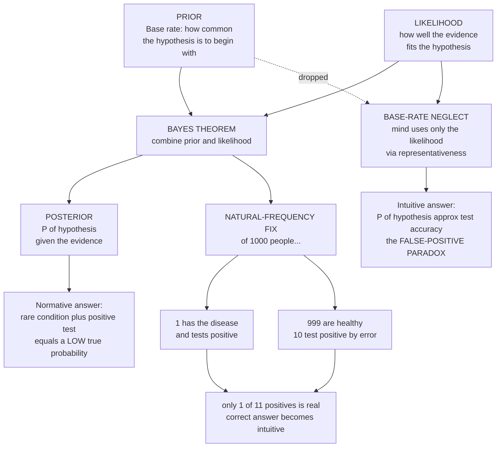

# 🎯 Base-Rate Neglect and Bayesian Reasoning

> [!abstract] TL;DR
> **Bayesian reasoning** is the *normative* standard for updating beliefs: **Bayes' theorem** combines the **prior** (the base rate — how common a hypothesis is to begin with) with the **likelihood** (how well the evidence fits) to yield the **posterior** (the probability of the hypothesis given the evidence). **Base-rate neglect** is the pervasive human failure to do this — people fixate on the specific, vivid evidence (driven by the **representativeness** heuristic) and ignore or underweight the prior, directly violating Bayes' rule. Its most stunning consequence is the **false-positive paradox**: for a *rare* condition, even a highly accurate test yields *mostly false positives*, so a positive result implies a surprisingly *low* probability of actually having the condition — a fact most physicians get wrong. The same error drives the **prosecutor's fallacy** and wrongful convictions, overtreatment from mass screening, and flawed security profiling. Crucially it is largely *fixable*: reframing the numbers as **natural frequencies** ("of 1000 people, 1 has the disease...") makes the Bayesian answer intuitive, which is why Bayesian literacy is an essential skill for medicine, law, and everyday judgment.

---

## Intuition

**Analogy.** A test for a rare disease is advertised as "**99 percent accurate**," and you test **positive**. Are you doomed? Ask almost anyone — including doctors — and they will say you are *almost certainly* sick, maybe 99 percent likely. But suppose the disease afflicts only **1 in 1000** people. Then your true chance of having it is only about **9 percent**. You are more than *ten times more likely to be healthy* than sick, despite the alarming positive result.

Why? Because the intuition throws away the **base rate**. The disease is so rare that among any large group, the tiny handful of genuinely sick people who test positive are *swamped* by the far larger number of *healthy* people who also test positive by sheer bad luck — the test's 1 percent error rate applied to the enormous healthy majority. Out of 1000 people, the single sick person tests positive, but so do about 10 healthy people. That is 11 positives, only 1 of them real: roughly 9 percent. The evidence *feels* overwhelming, yet most positives are **false positives**. This single blind spot — neglecting how common something is in the first place — corrupts medical diagnosis, courtroom verdicts, airport security, and everyday risk judgment, all because our minds do not natively reason like Bayes' theorem.

---

## How It Works

### Core mechanics

1. **Bayes' theorem is the correct machinery.** To judge "how probable is hypothesis $H$ given evidence $E$?", the normative rule is
$$P(H \mid E) = \frac{P(E \mid H)\,P(H)}{P(E)} = \frac{P(E \mid H)\,P(H)}{P(E \mid H)\,P(H) + P(E \mid \lnot H)\,P(\lnot H)}.$$
The **posterior** $P(H\mid E)$ is built from three ingredients: the **prior** $P(H)$ (the base rate), the **likelihood** $P(E\mid H)$ (how diagnostic the evidence is), and the **false-alarm rate** $P(E\mid\lnot H)$ (how often the evidence appears even when $H$ is false). A rational agent *always* multiplies the likelihood by the prior.

2. **Base-rate neglect drops the prior.** When a vivid, specific description or a "positive" test result is available, people answer as if $P(H\mid E) \approx P(E\mid H)$ — they report the *likelihood* as though it were the *posterior*. They over-weight the individuating evidence and under-weight (or entirely ignore) how common $H$ is. This is a direct violation of Bayes' rule and one of the most consequential judgment errors in the catalog.

3. **Representativeness is the engine.** People judge $P(H\mid E)$ by how *similar* the evidence is to a prototype of $H$ — how well the personality sketch fits "engineer," how much the symptom fits "the disease." Similarity has no place for base rates, so representativeness systematically substitutes for probability (see [[Availability_and_Representativeness]]).

4. **The false-positive paradox.** Combine a *low* prior with a *non-zero* false-alarm rate and the arithmetic turns brutal. The number of false positives scales with the *large* healthy population $P(\lnot H)$, while true positives scale with the *tiny* sick population $P(H)$. When $P(H)$ is small enough, false positives dominate even for an excellent test, so $P(H\mid E)$ stays low. This is why an accurate test for a rare condition is far less reassuring — or alarming — than it seems.

5. **The classic demonstrations** (Kahneman and Tversky) isolate the error:
   - **Lawyer-Engineer:** told a sample is 70 percent lawyers and 30 percent engineers, then given a personality sketch, people judge the profession by *stereotype fit* and largely ignore the 70/30 base rate. Reverse the proportions and their answers barely move.
   - **Taxicab:** a witness identifies a cab as "Blue," and the witness is 80 percent reliable — but 85 percent of the city's cabs are Green. People say ~80 percent Blue; Bayes says only ~41 percent, because Blue cabs are rare.
   - **Cancer/Mammogram:** the medical version, below, that stuns even clinicians.

6. **Natural frequencies dissolve the illusion.** Gigerenzer's key insight: the *same* problem posed as counts of people ("of 1000 people, 1 has the disease; that 1 tests positive; of the 999 healthy, 10 test positive...") makes the correct answer nearly obvious. The mind reasons far better with frequencies than with conditional-probability percentages, because frequencies keep the base-rate information visible instead of hiding it inside a normalized fraction.

7. **The picture is nuanced — not "always ignore base rates."** In some settings people commit the *opposite* error, **conservatism**: they update *too little* toward strong evidence, staying anchored near the prior. Human belief revision is non-Bayesian in complex ways — sometimes too much weight on the evidence (base-rate neglect), sometimes too little (conservatism) — depending on how the problem is framed and whether the base rate feels causally relevant.

### Flow / Architecture



---

## Key Concepts

**Secondary (intuitive grasp).** A *base rate* is simply how common something is — how many people in a crowd have a disease, how many cabs in a city are one color. A positive test or a matching description is *evidence*, but evidence must always be weighed against the base rate. If a condition is very rare, a "positive" is more likely to be a mistake than the real thing, because there are so many more chances to be wrong. *Base-rate neglect* is forgetting this and trusting the evidence at face value.

**Undergraduate (mechanism and named effects).** *Bayes' theorem* is the correct update rule: posterior $\propto$ likelihood $\times$ prior. Base-rate neglect is the failure to multiply by the prior, driven by the *representativeness* heuristic (judging probability by similarity). It produces the *false-positive paradox*: with prevalence $b$, sensitivity $s$, and false-positive rate $f$, the positive predictive value is $\text{PPV} = \frac{s\,b}{s\,b + f(1-b)}$, which is small whenever $b$ is small even if $s$ is near 1. The *prosecutor's fallacy* is the same error in reverse — confusing $P(E\mid \lnot H)$ (a small match-by-chance probability) with $P(\lnot H \mid E)$ (probability of innocence). The *natural-frequency* reframing is the reliable debiasing tool: it externalizes the base rate as a count, restoring accurate reasoning even in non-experts.

**Graduate (normative stakes and open debates).** Behavioral economics defines the bias *against* a normative benchmark: Bayesian updating. But three subtleties matter. (1) **Format dependence** — much of the "irrationality" shrinks under natural-frequency presentation, fueling Gigerenzer's *ecological rationality* critique: the mind may be well-adapted to the *frequency* formats of natural sampling and poorly adapted to the *single-event probability* formats of modern statistics. (2) **Causal base rates** — Tversky and Kahneman found base-rate use rises sharply when the base rate is framed as *causal* rather than merely statistical (the taxicab problem with "85 percent of accidents involve Green cabs" versus "85 percent of cabs are Green"), implicating a mental-model rather than a pure-computation account. (3) **Direction is not fixed** — since conservatism (under-updating) coexists with base-rate neglect (over-updating on evidence), a complete model must predict *when* each occurs, an active question linking judgment research to **Bayesian_Models_of_Cognition** in cognitive science and to probabilistic ML.

---

## Python Demo

```python
# The false-positive paradox and the natural-frequency fix.
#   (a) DISEASE-TEST: compute the true posterior P(disease | positive) via Bayes'
#       theorem and show how it depends dramatically on the BASE RATE. For a rare
#       disease even a very accurate test yields a LOW posterior (most positives
#       are false). Overlay the WRONG intuitive answer (~ the test accuracy),
#       which ignores the base rate entirely.
#   (b) NATURAL FREQUENCIES: reframe the same numbers as counts of people, drawn
#       as a frequency tree, so the correct answer becomes intuitive (Gigerenzer).
import numpy as np
import matplotlib.pyplot as plt

# ---- Parameters matching the analogy: rare disease, "99% accurate" test ----
base_rate   = 0.001            # prevalence = PRIOR = 1 in 1000
sensitivity = 0.99             # P(positive | disease)
specificity = 0.99             # P(negative | healthy)
fpr         = 1 - specificity  # P(positive | healthy) = 0.01

def posterior(prior, sens=sensitivity, fp=fpr):
    """Bayes' theorem: correct P(disease | positive)."""
    p_pos = sens * prior + fp * (1.0 - prior)   # total probability of a positive
    return sens * prior / p_pos

p_true = posterior(base_rate)
print(f"Base rate (prior)          : {base_rate:.3%}")
print(f"Test accuracy              : {sensitivity:.0%}")
print(f"Intuitive answer (WRONG)   : {sensitivity:.0%}  (equates posterior with accuracy)")
print(f"Correct posterior (Bayes)  : {p_true:.1%}")
print(f"Base-rate-neglect gap      : {sensitivity - p_true:.0%}")

# ---- (a) Posterior vs base rate, for a FIXED test accuracy ----
priors = np.logspace(-4, -0.3, 400)   # 0.01% up to ~50%
post   = posterior(priors)

# ---- (b) Natural-frequency counts (N = 10,000 people) ----
N        = 10_000
diseased = round(base_rate * N)            # 10
healthy  = N - diseased                     # 9990
tp       = round(sensitivity * diseased)    # ~10 true positives
fn       = diseased - tp                     # ~0 false negatives
fp       = round(fpr * healthy)             # ~100 false positives
tn       = healthy - fp                       # ~9890 true negatives
freq_ppv = tp / (tp + fp)                    # 10 / 110 ~ 9%

# ---- Figure ----
fig = plt.figure(figsize=(16, 5.5))
ax1, ax2, ax3 = (fig.add_subplot(1, 3, i) for i in (1, 2, 3))

# Panel 1: the posterior collapses for rare diseases
ax1.plot(priors * 100, post * 100, lw=2.5, color="steelblue",
         label="Correct P(disease | +)  [Bayes]")
ax1.axhline(sensitivity * 100, ls="--", lw=2, color="crimson",
            label="Intuition ~ test accuracy")
ax1.fill_between(priors * 100, post * 100, sensitivity * 100,
                 color="crimson", alpha=0.10, label="base-rate-neglect gap")
ax1.scatter([base_rate * 100], [p_true * 100], color="black", zorder=5)
ax1.annotate(f"rare disease\n{p_true:.0%} truly sick",
             (base_rate * 100, p_true * 100),
             textcoords="offset points", xytext=(30, 12), fontsize=9,
             arrowprops=dict(arrowstyle="->"))
ax1.set_xscale("log")
ax1.set_xlabel("Disease base rate / prevalence  (%, log scale)")
ax1.set_ylabel("P(disease | positive test)  (%)")
ax1.set_title("Posterior collapses when the disease is rare")
ax1.legend(fontsize=8, loc="center right"); ax1.grid(alpha=0.3)

# Panel 2: the headline case, intuition vs Bayes
labels = ["Intuition\n(neglects base rate)", "Bayesian\n(correct)"]
vals   = [sensitivity * 100, p_true * 100]
bars   = ax2.bar(labels, vals, color=["crimson", "steelblue"])
ax2.bar_label(bars, fmt="%.0f%%", padding=3, fontsize=12)
ax2.set_ylabel("P(disease | positive)  (%)")
ax2.set_title("1-in-1000 disease, 99% accurate test")
ax2.set_ylim(0, 108); ax2.grid(axis="y", alpha=0.3)

# Panel 3: natural-frequency tree
ax3.axis("off"); ax3.set_xlim(0, 1); ax3.set_ylim(0, 1)
ax3.set_title("Natural frequencies make Bayes intuitive")

def node(x, y, text, color="whitesmoke"):
    ax3.text(x, y, text, ha="center", va="center", fontsize=9,
             bbox=dict(boxstyle="round,pad=0.4", fc=color, ec="gray"))

node(0.50, 0.92, f"{N:,} people")
node(0.25, 0.62, f"{diseased} diseased")
node(0.75, 0.62, f"{healthy:,} healthy")
node(0.12, 0.30, f"{tp} test +\n(true +)", "#cfe8cf")
node(0.36, 0.30, f"{fn} test -")
node(0.64, 0.30, f"{fp} test +\n(FALSE +)", "#f6cccc")
node(0.88, 0.30, f"{tn:,} test -")
for x0, y0, x1, y1 in [(0.50, 0.87, 0.25, 0.67), (0.50, 0.87, 0.75, 0.67),
                       (0.25, 0.57, 0.12, 0.35), (0.25, 0.57, 0.36, 0.35),
                       (0.75, 0.57, 0.64, 0.35), (0.75, 0.57, 0.88, 0.35)]:
    ax3.plot([x0, x1], [y0, y1], color="gray", lw=1)
ax3.text(0.5, 0.06,
         f"positives = {tp} true + {fp} false  ->  "
         f"P(disease | +) = {tp}/{tp + fp} = {freq_ppv:.0%}",
         ha="center", fontsize=10, weight="bold")

plt.tight_layout()
plt.savefig("base_rate_neglect.png", dpi=120)
plt.show()
```

Running this prints that a "99 percent accurate" test on a disease with a 1-in-1000 base rate yields a true-positive probability of only about **9 percent**, not the ~99 percent the intuition supplies — a base-rate-neglect gap of roughly **90 percentage points**. Panel 1 shows the posterior curve rising as the disease becomes more common (the prior matters less when it is large) while the intuition stays pinned at the test accuracy; Panel 2 contrasts the two answers for the headline case; Panel 3 lays out the natural-frequency tree — of 10,000 people, about 10 true positives are drowned by about 100 false positives, so only ~1 in 11 positives is real.

---

## Real-World Applications

> **Example (medicine — the calculation doctors get wrong):** David Eddy's classic study told physicians a patient had a positive mammogram for a cancer with a ~1 percent base rate and a test with ~90-95 percent accuracy, then asked for the probability of cancer. Most answered **70-90 percent**; the Bayesian answer is **under 10 percent**. This representativeness-driven base-rate neglect in a life-or-death setting is exactly the computation the Python demo reproduces. Presenting the same data as *natural frequencies* ("10 of 1000 women have it; of those, 9 test positive; of the 990 healthy, 89 test positive...") sharply improves clinician accuracy, which is why decision aids and medical curricula now teach frequency formats.

- **Screening policy and overtreatment.** Population screening for *rare* conditions inevitably generates many false positives, driving biopsies, anxiety, and overtreatment. The mammography and PSA-screening debates hinge precisely on this arithmetic: when prevalence is low, a positive is weak evidence, and the harms of false positives can outweigh the benefits — a public-health application of the paradox (see [[Public_Health_and_Epidemiology]]).
- **Forensic and legal reasoning — the prosecutor's fallacy.** A DNA or fingerprint "match" with a 1-in-a-million random-match probability is presented as a 1-in-a-million chance of innocence. That confuses $P(\text{match}\mid\text{innocent})$ with $P(\text{innocent}\mid\text{match})$ — and in a database of millions of innocent people, several will match by chance. Neglecting the base rate of innocence has produced real wrongful convictions (e.g., the Sally Clark case).
- **Security and mass screening.** Terrorist profiling or fraud detection against a *rare* target population flags mostly innocents. Even a 99 percent accurate screen applied to millions of travelers, few of whom are threats, produces overwhelmingly false alarms — the same paradox that governs medical tests, with civil-liberties stakes.
- **Spam filtering and fraud detection (the engineering flip side).** Machine-learning systems make the base rate explicit and tune the false-positive/false-negative trade-off deliberately; precision, recall, and ROC analysis are Bayes made operational (see [[Classification_Metrics]] and [[Naive_Bayes]]). This connects to the sibling **Behavioral_Economics_and_Machine_Learning** on how algorithms both exploit and correct human base-rate blindness.

---

## Common Pitfalls

- **Confusing $P(E\mid H)$ with $P(H\mid E)$** — the core Bayesian inversion. A "99 percent accurate" test does *not* make a positive 99 percent likely to be true when the condition is rare. This single confusion is the root of both base-rate neglect and the prosecutor's fallacy.
- **Reporting the likelihood as the posterior** — quoting a test's sensitivity ("99 percent accurate") as if it answered "how likely am I to be sick?" It answers a *different* question and omits the prior entirely.
- **Presenting risk as single-event percentages** — conditional-probability formats hide the base rate and reliably degrade reasoning. If communication matters (medicine, courtrooms), use *natural frequencies*; the debiasing is in the *format*, not in exhorting people to "try harder."
- **Assuming the fix is universal** — natural frequencies help most when the sampling is natural and the reference class is clear; poorly chosen reference classes or non-natural framings can still mislead.
- **Over-correcting into conservatism** — the opposite error is real: sometimes people cling to the prior and under-update on genuinely strong evidence. Good judgment weighs prior *and* likelihood in proportion, not one to the exclusion of the other. Related is chronic [[Overconfidence_and_Calibration]], where mis-set priors and overweighted evidence compound.

---

## Related Concepts

- [[Heuristics_and_Biases_Overview]] — the parent program; base-rate neglect is its central Bayesian failure, produced by the representativeness heuristic.
- [[Availability_and_Representativeness]] — the sibling bias that *is* the engine of base-rate neglect: judging probability by similarity, which leaves no room for priors.
- [[Overconfidence_and_Calibration]] — the sibling failure of probabilistic self-assessment; miscalibrated priors and overweighted evidence compound with base-rate neglect.
- [[Bayesian_Reasoning]] — the Logic-vault treatment of Bayes' theorem as the normative belief-updating rule this bias violates.
- [[Bayesian_Statistics]] — the Mathematics-vault formalism of priors, likelihoods, and posteriors underlying the whole note.
- [[Probability_Theory]] — conditional probability and the distinction between $P(A\mid B)$ and $P(B\mid A)$ at the heart of the fallacy.
- [[Cognitive_Biases]] — the Psychology-vault catalog placing base-rate neglect among the broader "bias zoo."
- [[Bayesian_Models_of_Cognition]] — the cognitive-science view of the mind *as* an approximate Bayesian reasoner, sharpening when and why it deviates.
- [[Judgment_and_Decision_Making]] — the cognitive-science framing of the same demonstrations (taxicab, lawyer-engineer, mammogram).
- [[Cognitive_Biases_and_Heuristics]] — the Logic-and-Critical-Thinking connection to reasoning fallacies, including the prosecutor's fallacy.
- [[Classification_Metrics]] — precision, recall, and positive predictive value: Bayes and the false-positive trade-off made operational in ML.
- [[Naive_Bayes]] — a classifier that literally applies Bayes' theorem, multiplying priors by likelihoods the way humans fail to.
- [[Public_Health_and_Epidemiology]] — sensitivity, specificity, prevalence, and the screening trade-offs governed by the false-positive paradox.
- [[Dual_Process_Theory_System_1_and_2]] — System 1 supplies the representativeness snap-judgment; System 2 must intervene to apply Bayes.

*Not yet written (Behavioral_Economics siblings referenced in prose): Behavioral_Economics_and_Machine_Learning, The_Replication_Crisis_and_Critiques_of_Behavioral_Economics.*

---

## Review Questions

1. **(Conceptual)** Using Bayes' theorem, explain precisely *which* term base-rate neglect omits and why omitting it makes a positive test result for a rare condition so misleading. Why does the representativeness heuristic naturally produce this omission?
2. **(Scenario)** A screening test is "95 percent accurate" for a condition present in 0.5 percent of the population, and a patient tests positive. A colleague concludes the patient "almost certainly has it." Compute the actual posterior probability, name the bias, and rewrite the numbers as natural frequencies so that the colleague's intuition becomes correct.
3. **(Trade-off)** Kahneman and Tversky treat base-rate neglect as evidence of irrationality; Gigerenzer argues the mind is well-adapted to natural-frequency formats and the "bias" is partly an artifact of single-event probability framing. Lay out what each side emphasizes, and describe one concrete way you would present a diagnostic result to a patient given this debate — and what could still go wrong.

---

## Sources

- Tversky, A. & Kahneman, D. (1974). "Judgment under Uncertainty: Heuristics and Biases." *Science*, 185(4157), 1124-1131.
- Kahneman, D. & Tversky, A. (1973). "On the Psychology of Prediction." *Psychological Review*, 80(4), 237-251. (Lawyer-engineer and base-rate studies.)
- Eddy, D. M. (1982). "Probabilistic Reasoning in Clinical Medicine: Problems and Opportunities." In Kahneman, Slovic & Tversky (Eds.), *Judgment under Uncertainty: Heuristics and Biases*, 249-267.
- Gigerenzer, G. & Hoffrage, U. (1995). "How to Improve Bayesian Reasoning without Instruction: Frequency Formats." *Psychological Review*, 102(4), 684-704.
- Bar-Hillel, M. (1980). "The Base-Rate Fallacy in Probability Judgments." *Acta Psychologica*, 44(3), 211-233.

---

#behavioral-economics #base-rate-neglect #bayesian-reasoning #false-positive-paradox #natural-frequencies
