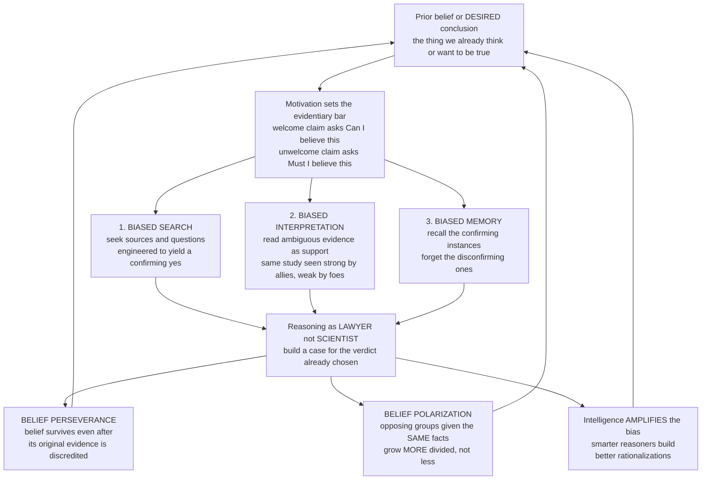

# 🧠 Confirmation Bias and Motivated Reasoning

> [!abstract] TL;DR
> **Confirmation bias** is the pervasive tendency to **search for, interpret, favor, and recall** information that confirms what we already believe, while giving disproportionately little weight to alternatives — "one of the most robust and consequential of all cognitive biases" (Nickerson, 1998). Its deeper motivational cousin, **motivated reasoning**, is reasoning driven by what we **want** to be true: we are intuitive **lawyers** defending a preferred verdict, not intuitive **scientists** seeking truth, setting a higher evidentiary bar for unwelcome conclusions ("*Must* I believe this?") than for welcome ones ("*Can* I believe this?"). Together they make beliefs **persist against disconfirming evidence**, drive opposing groups given **identical facts** to grow *more* polarized, and — disturbingly — **intensify with intelligence and knowledge**, which supply better rationalizations. They are the engine behind political polarization, echo chambers, science denial, and financial and medical errors, and they reveal that good judgment requires not just cognitive ability but the *will to seek disconfirmation* — best supplied by institutions (science, adversarial review, diverse groups) that force beliefs to face challenge.

---

## Intuition

**Analogy: the detective who has already picked the suspect.**

A detective settles early on a prime suspect. From that moment, everything shifts. She notices the clues that fit her theory and glides past the ones that don't; an ambiguous footprint becomes "clearly his," a solid alibi becomes "probably coached." She interviews witnesses with questions shaped to confirm ("You saw him near the scene, didn't you?"), and when she later recalls the case, the confirming details are vivid while the awkward contradictions have faded. She will "solve" the case — with total confidence — and she may well have the wrong person.

We are all that detective. Once we form a belief, we hunt for evidence that **confirms** it, read ambiguous facts in its favor, and quietly dismiss what contradicts it — not out of stupidity, but because we reason like **lawyers defending a client**, not scientists testing a theory. And when we don't merely believe something but actively **want** it to be true — our political side, our stock pick, our self-image — this machinery goes into overdrive. That is why smart people believe wrong things with such conviction, and why more intelligence often just means a **better lawyer**: sharper arguments for the conclusion you had already chosen. The bias is not a failure to think; it is thinking bent to a purpose other than truth.

---

## How It Works

### Core Mechanics

Confirmation bias is best understood as a **three-pronged distortion** of the ordinary machinery of belief — and motivated reasoning as the *motivational fuel* that decides which beliefs get defended.

1. **Biased search (how we gather).** We seek evidence likely to say "yes." In **Wason's 2-4-6 task**, people given the triple 2-4-6 and asked to discover the hidden rule almost always test triples that *fit* their guessed rule ("increasing by two": 4-6-8, 10-12-14) rather than triples that could *break* it — so they confirm a wrong rule and never try the disconfirming test that would reveal the true rule ("any ascending sequence"). The same appears in **Wason's selection task** and in everyday life: we Google "is coffee good for you," follow sources that already agree, and ask questions engineered to elicit confirmation.

2. **Biased interpretation (how we read).** The *same* evidence is read as supporting whatever we already think. In the classic **Lord, Ross & Lepper (1979)** study, supporters and opponents of capital punishment read the *identical* pair of studies — one pro, one con — and each side judged the study agreeing with them as methodologically strong and the other as fatally flawed. Ambiguous data is diagnostic *of your prior*, not of the world. This **biased assimilation** is the beating heart of polarization.

3. **Biased memory (how we recall).** We selectively remember confirming instances and forget the disconfirming ones, so the past appears to have voted for our view all along. Over time this launders a shaky belief into a "well-supported" one.

4. **Motivated reasoning — the lawyer, not the scientist.** Kunda (1990) drew the crucial line between **accuracy goals** (wanting to be right) and **directional goals** (wanting a *particular* answer). Under directional goals we still feel like we are reasoning fairly — we marshal evidence and arguments — but we search memory and construct justifications selectively, stopping as soon as we can defend the conclusion we wanted. Gilovich's compact rule: for **welcome** conclusions we ask "*Can* I believe this?" and one supporting reason suffices; for **unwelcome** ones we ask "*Must* I believe this?" and hunt for any escape. Emotion and identity, not evidence, set the evidentiary bar.

5. **Reasoning as advocacy (why we are built this way).** Mercier & Sperber's **argumentative theory of reasoning** offers a startling reframing: human reasoning may have **evolved not to find truth but to win arguments and justify ourselves to others**. On this view the "bias" is a *feature* — a lawyer is *supposed* to be one-sided. It elegantly explains the paradox that **individual** reasoning is so biased yet **group** reasoning, when views genuinely clash, can be excellent: each advocate is biased, but collectively the arguments get stress-tested. Reasoning is social and rhetorical before it is solitary and truth-seeking.

6. **Identity-protective cognition.** Kahan's work shows motivated reasoning often serves **group identity**: people process facts to protect their standing in valued tribes (political, religious, cultural). This is why factual beliefs on climate, vaccines, guns, and evolution align with tribal identity rather than tracking evidence — and why, alarmingly, **more numerate and scientifically literate people are sometimes *more* polarized**, because they are better at finding and deploying the data that flatters their side. Intelligence here is a **cognitive weapon in the service of tribe**, not a corrective.

7. **The downstream failures.** Because search, interpretation, and memory all bend the same way, two consequences follow: **belief perseverance** — beliefs survive even after their *original* evidence is explicitly **discredited** (Ross, Lepper & Hubbard, 1975) — and **belief polarization** — opposing groups given the *same* mixed evidence grow *further* apart. The much-cited **backfire effect** (corrections *strengthening* the false belief) is real in places but **weaker and less general than once claimed**; the more robust finding is simply that facts often *fail to move* committed minds, not that they reliably boomerang.

### Flow / Architecture



---

## Key Concepts

### Secondary (intuitive level)

- **Confirmation bias** = you notice and remember what *agrees* with you, and skate past what doesn't.
- Three moves: you **look** for agreeing evidence, **read** unclear evidence in your favor, and **remember** the hits and forget the misses.
- **Motivated reasoning** = when you *want* something to be true, you become its lawyer, not its judge — you demand only a *little* proof for good news and a *mountain* for bad news.
- The scary part: being smart does not protect you. Clever people just build **better excuses** for what they already believe.
- Two people can look at the *exact same facts* and both walk away *more* sure they were right — that is **polarization**.

### Undergraduate (mechanistic level)

- **Definition (Nickerson, 1998):** seeking, interpreting, favoring, and recalling information in a way that confirms one's prior beliefs or hypotheses, with disproportionately less consideration of alternatives.
- **The three mechanisms:** biased *search* (Wason 2-4-6 and selection tasks — testing to confirm, not to falsify), biased *interpretation* (Lord et al. 1979 — biased assimilation of identical evidence), biased *memory* (selective recall of confirming instances).
- **Accuracy vs. directional goals (Kunda, 1990):** motivated reasoning operates *within* the constraints of plausible justification — we can't believe just anything, but we can reach a *desired* conclusion whenever the evidence gives us cover.
- **The asymmetric bar (Gilovich):** "*Can* I believe this?" for the welcome vs. "*Must* I believe this?" for the unwelcome.
- **Consequences:** *belief perseverance* (beliefs outlive their discredited evidence), *belief polarization* (opposing priors + shared evidence → divergence), and the contested *backfire effect* (corrections sometimes entrenching — weaker than once thought).
- **The smart-people paradox:** numeracy, education, and IQ do **not** reliably reduce, and can *increase*, motivated reasoning on identity-laden topics.

### Graduate (theoretical and critical level)

- **Is it one phenomenon or many?** "Confirmation bias" is an umbrella over positive-test strategy (Klayman & Ha's *positive testing*, which is often a *rational* default that only looks like confirmation seeking), biased assimilation, congruence bias, and myside bias. Klayman & Ha (1987) showed the 2-4-6 result is not pure irrationality: positive testing is a good general strategy that *misfires* under specific hypothesis-space structures. Naming a bias is not explaining it.
- **Cold vs. hot accounts.** *Cognitive* (cold) accounts derive the effect from information-processing defaults (positive testing, anchoring on an initial hypothesis); *motivational* (hot) accounts add directional goals and affect. Both operate; Kunda's contribution was showing the motivational route still runs *through* cognition — motivation biases *which* memories and rules get accessed, so the reasoning "feels" objective.
- **Argumentative theory (Mercier & Sperber, 2011).** Reframes myside bias as adaptive for an *interactive* function: producing and evaluating arguments in social exchange. Predicts, and finds, that reasoning improves in **groups with genuine disagreement** while degrading in homogeneous ones — an evolutionary rationale for adversarial and deliberative institutions.
- **Identity-protective cognition and the "motivated numeracy" finding (Kahan et al., 2017).** On politically neutral data, higher numeracy → better interpretation; on identity-charged data (e.g., gun-control framings of the *same* 2x2 table), higher numeracy → *greater* polarization. This is the sharpest evidence that reasoning ability is recruited *for* the tribe. It challenges the naive "science literacy fixes denial" model at its root.
- **Bayesian rationalizations of polarization.** Some divergence is Bayes-consistent if agents hold different *auxiliary* beliefs about source reliability (Jern, Chang & Kemp, 2014): discounting a study because you distrust its methodology *can* be normative. The open question is how much observed polarization is defensible Bayesian updating on differing priors about credibility versus genuinely biased assimilation. This blurs the line between "bias" and "rational disagreement" and cautions against labeling every divergence irrational (compare [[Bayesian_Reasoning]]).
- **Debiasing efficacy.** "Consider-the-opposite" and "consider-an-alternative" prompts reliably shrink confirmation and hindsight effects in the lab, but transfer is fragile and identity-protective cognition is *especially* resistant. The most dependable correctives are **structural** — falsification norms, peer review, red teams, adversarial collaboration, and cognitively diverse groups — i.e., outsourcing disconfirmation to institutions rather than trusting the individual to self-audit.

---

## Python Demo

```python
# Two demonstrations of how motivated / confirmation-biased updating departs
# from rational Bayesian belief revision, using log-odds (evidence adds up).
#
#   (a) BIASED UPDATING: a rational Bayesian and a confirmation-biased agent
#       see the SAME stream of mixed evidence about hypothesis H = "state A".
#       Truth is actually state B, so evidence is on average DISCONFIRMING for
#       H. The Bayesian weights every datum equally and converges to the truth;
#       the biased agent OVERWEIGHTS confirming evidence and DISCOUNTS
#       disconfirming evidence, so its belief drifts toward the DESIRED
#       conclusion and DIVERGES from truth.
#
#   (b) BELIEF POLARIZATION: two agents with OPPOSITE priors see the SAME
#       genuinely AMBIGUOUS evidence (true diagnostic value = zero). Each
#       assimilates it toward its own side, so they grow MORE divided -- while
#       a rational agent, correctly reading it as uninformative, does not move.
import numpy as np
import matplotlib
matplotlib.use("Agg")           # file-only backend; safe on headless machines
import matplotlib.pyplot as plt

rng = np.random.default_rng(7)
sigmoid = lambda z: 1.0 / (1.0 + np.exp(-z))     # log-odds -> probability

# ---------------------------------------------------------------------------
# (a) BIASED UPDATING vs RATIONAL BAYESIAN on the same evidence
# ---------------------------------------------------------------------------
T = 200
d = 0.55                                  # signal separation of A vs B Gaussians
truth_is_A = False                        # TRUTH is state B  ->  P(A) should -> 0
mu = d if truth_is_A else -d
x = rng.normal(mu, 1.0, size=T)           # the SAME evidence both agents receive
llr = 2.0 * d * x                         # per-trial log-likelihood ratio for A

prior_logodds = 1.2                       # both START leaning toward A (desired)

# Rational Bayesian: sum every datum at full weight
rational = sigmoid(prior_logodds + np.cumsum(llr))

# Confirmation-biased: embrace confirming (llr>0 supports A), discount the rest
w_confirm, w_discount = 1.0, 0.20
weighted = np.where(llr > 0, w_confirm * llr, w_discount * llr)
biased = sigmoid(prior_logodds + np.cumsum(weighted))

# ---------------------------------------------------------------------------
# (b) BELIEF POLARIZATION on identical AMBIGUOUS evidence
# ---------------------------------------------------------------------------
feat = rng.normal(0.0, 1.0, size=T)       # surface features; TRUE value is ZERO

def assimilate(prior, feature, toward_A, w_hi=1.0, w_lo=0.25):
    # An agent embraces evidence that flatters its side (w_hi) and dismisses
    # the rest (w_lo) -- manufacturing signal from noise via interpretation.
    if toward_A:
        w = np.where(feature > 0, w_hi, w_lo)
    else:
        w = np.where(feature < 0, w_hi, w_lo)
    return prior + np.cumsum(w * feature)

agentA  = sigmoid(assimilate(+0.8, feat, toward_A=True))    # partisan for A
agentB  = sigmoid(assimilate(-0.8, feat, toward_A=False))   # partisan for B
neutral = sigmoid(np.zeros(T))            # rational: ambiguous == uninformative
gap = np.abs(agentA - agentB)             # the widening polarization gap

# ---------------------------------------------------------------------------
# Console summary
# ---------------------------------------------------------------------------
print("(a) BIASED UPDATING  (truth is B, so correct P(A) -> 0)")
print(f"    Rational final belief P(A) : {rational[-1]:.3f}   (converges to truth)")
print(f"    Biased   final belief P(A) : {biased[-1]:.3f}   (drifts to the wish)")
print("(b) POLARIZATION on identical ambiguous evidence")
print(f"    Agent-A final P(A)         : {agentA[-1]:.3f}")
print(f"    Agent-B final P(A)         : {agentB[-1]:.3f}")
print(f"    Belief gap  start -> end   : {gap[0]:.3f} -> {gap[-1]:.3f}")

# ---------------------------------------------------------------------------
# Plots
# ---------------------------------------------------------------------------
t = np.arange(1, T + 1)
fig, (axA, axB) = plt.subplots(1, 2, figsize=(13.5, 5.2))

axA.plot(t, rational, color="#2563eb", lw=2.6, label="Rational Bayesian")
axA.plot(t, biased,   color="#dc2626", lw=2.6, label="Confirmation-biased")
axA.axhline(0.0, color="#6b7280", ls="--", lw=1.4, label="Truth: H is false")
axA.set_xlabel("Evidence received (trials)")
axA.set_ylabel("Belief in hypothesis  P(H = A)")
axA.set_title("Asymmetric updating: same evidence, opposite conclusions")
axA.set_ylim(-0.03, 1.03); axA.legend(fontsize=9); axA.grid(alpha=0.3)

axB.plot(t, agentA,  color="#dc2626", lw=2.6, label="Agent A (prior favors A)")
axB.plot(t, agentB,  color="#2563eb", lw=2.6, label="Agent B (prior favors B)")
axB.plot(t, neutral, color="#6b7280", ls="--", lw=1.6,
         label="Rational (reads it as uninformative)")
axB.fill_between(t, agentB, agentA, color="#f59e0b", alpha=0.15,
                 label="Polarization gap")
axB.set_xlabel("Identical ambiguous evidence (trials)")
axB.set_ylabel("Belief in hypothesis  P(H = A)")
axB.set_title("Belief polarization: same facts drive minds apart")
axB.set_ylim(-0.03, 1.03); axB.legend(fontsize=9); axB.grid(alpha=0.3)

plt.tight_layout()
plt.savefig("confirmation_bias_and_motivated_reasoning.png", dpi=110,
            bbox_inches="tight")
plt.show()
```

**What the demo shows.** In panel (a), both agents start leaning toward A and see the *identical* evidence stream, which — because the truth is B — is on average disconfirming for A. The **rational Bayesian** weights every datum equally and its belief in A collapses toward **0**, tracking reality. The **confirmation-biased** agent keeps the occasional pro-A datum at full strength but discounts the (more numerous) anti-A data to one-fifth weight; the surviving positive scraps accumulate and its belief **drifts upward toward the desired conclusion**, ending near certainty in the *false* hypothesis. Same evidence, opposite verdicts. In panel (b), the evidence is genuinely **ambiguous** (true diagnostic value zero), so the rational agent correctly stays at 0.5 — but the two partisans each embrace the fragments that flatter their side and dismiss the rest, and the shaded **polarization gap widens over time**: identical facts push committed minds *further apart*, the striking, counterintuitive signature of biased assimilation.

---

## Real-World Applications

> **Example (finance):** An investor falls in love with a thesis — "this stock is a generational buy." Confirmation bias then curates reality: they read the bullish analysts, dismiss the bear case as "noise," interpret a mediocre earnings report as "priced in," and remember their winning calls while forgetting the losers. Motivated reasoning raises the evidentiary bar for the sell signal ("*Must* I sell?") far above the bar for holding ("*Can* I keep holding?"). The result is late exits, doubling down on losers, and the failure to update on red flags — a core mechanism behind the sibling topic *Herding_Bubbles_and_Crashes*, where individually biased belief-holding aggregates into market-wide mispricing.

- **Political polarization and echo chambers.** Biased search and interpretation, industrialized by social-media **algorithmic curation** and **filter bubbles**, feed each tribe a confirming diet and read shared events through opposite frames — accelerating the affective polarization documented in political science and sociology.
- **Science denial and conspiracy theories.** Identity-protective cognition explains why factual positions on climate, vaccines, and evolution track tribe rather than data, and why "just give people the facts" campaigns underperform — corrections must contend with motivated reasoning, not mere ignorance.
- **Medicine and forensics.** *Diagnostic momentum* and *anchoring* produce tunnel vision on an early hypothesis; a physician orders tests that confirm the leading diagnosis, and a detective builds a case against the first suspect while discounting exculpatory evidence — a documented driver of misdiagnosis and wrongful conviction.
- **Corporate strategy.** Groupthink is confirmation bias at the team level: dissent is filtered out, favorable projections are believed and unfavorable ones "stress-tested to death," and the organization fails to learn from disconfirming feedback until the failure is undeniable.
- **The general remedy.** Because the individual can't reliably self-audit, high-stakes fields **institutionalize disconfirmation**: pre-registration and peer review in science, **red teams** and **devil's advocates** in intelligence and security, **adversarial collaboration** in research disputes, and courts' adversarial structure — all of which force a belief to survive a genuine attempt to break it.

---

## Common Pitfalls

- **"Confirmation bias is a mark of unintelligence."** The opposite is closer to true. On identity-laden questions, higher numeracy and knowledge *amplify* the bias by supplying better rationalizations (Kahan's motivated numeracy). Treat intelligence as a *weapon* that serves whatever goal is running, not as an antidote.
- **Confusing positive testing with irrational confirmation seeking.** Klayman & Ha showed that *testing where you expect a hit* is often a sensible default strategy; it only misfires under particular hypothesis structures. Don't label every non-falsifying test as biased — the pathology is the *asymmetric weighting of the result*, not the choice of test.
- **Assuming corrections always backfire.** The backfire effect is real in narrow cases but far weaker and less general than the viral version suggests; recent replications find corrections usually *do* move beliefs somewhat. Over-citing backfire breeds a counsel of despair that discourages worthwhile correction.
- **Believing awareness debiases you.** Knowing about confirmation bias does not stop it, any more than knowing about an optical illusion straightens the lines. Reliable fixes are procedural and social (consider-the-opposite, red teams, diverse groups), not motivational pep talks.
- **Treating all polarization as irrationality.** Some divergence is Bayes-consistent when agents rationally differ on *source credibility* (Jern et al., 2014). Distinguish defensible disagreement from genuinely biased assimilation before diagnosing the bias.
- **Mistaking a felt sense of objectivity for actual objectivity.** Motivated reasoning is invisible from the inside — it *feels* like fair, evidence-driven thinking. The felt confidence is not a signal that you are unbiased; if anything, effortless certainty on a topic you care about is a warning light.

---

## Related Concepts

- [[Heuristics_and_Biases_Overview]] — the parent program; confirmation bias is among the most consequential entries in its "bias zoo," and this note details its mechanisms and motivational fuel.
- [[Dual_Process_Theory_System_1_and_2]] — a lazy System 2 does not correct System 1's biased impressions; worse, when *engaged* it can be captured to *rationalize* them (motivated reasoning as System 2 in the service of System 1).
- [[Cognitive_Biases]] — the Psychology-vault catalogue that situates confirmation bias alongside anchoring, hindsight, and the availability of confirming instances.
- [[Bayesian_Reasoning]] — the normative benchmark of even-handed updating that the biased agent in the demo violates; also the source of the "rational polarization" caveat about differing credibility priors.
- [[Reasoning_and_Inference]] — the cognitive-science treatment of Wason's tasks, myside bias, and the argumentative theory of reasoning.
- [[Judgment_and_Decision_Making]] — the broader normative-versus-descriptive framing in which motivated reasoning is a descriptive departure from accuracy-driven ideals.
- [[Cognitive_Biases_and_Heuristics]] — the Logic-and-Critical-Thinking angle on confirmation bias as an obstacle to sound reasoning and how debiasing counters it.
- [[Scientific_Reasoning_and_Method]] — falsification and peer review are institutionalized *disconfirmation*, the structural cure for individual confirmation bias.
- [[Epistemology_and_Theories_of_Knowledge]] — the justification-and-truth backdrop against which "reasoning as advocacy" is such a provocative claim.
- [[Attitudes_and_Persuasion]] — cognitive dissonance and selective exposure explain the motivational pull to protect existing attitudes from contradiction.
- [[Group_Dynamics]] — groupthink is confirmation bias scaled to the team; diverse, dissent-tolerant groups are the social antidote the argumentative theory predicts.
- [[Democratic_Backsliding_and_Polarization]] — motivated reasoning and identity-protective cognition are micro-foundations of macro political polarization.
- [[Media_Propaganda_and_Political_Communication]] — how biased search and interpretation are exploited by messaging and amplified by partisan media.
- [[Digital_Society_and_Online_Communities]] — filter bubbles and algorithmic curation as the technological accelerant of biased search and echo chambers.
- [[Sociology_of_Knowledge_and_Science]] — the collective, institutional view of how communities can correct for individually biased cognition.
- [[Media_Literacy_and_Source_Evaluation]] — the applied skill of deliberately seeking and fairly weighing disconfirming sources.

*Not-yet-written Behavioral_Economics siblings referenced in prose above: Overconfidence_and_Calibration, Hindsight_Bias_and_Narrative_Fallacy, Base_Rate_Neglect_and_Bayesian_Reasoning, Herding_Bubbles_and_Crashes.*

---

## Review Questions

### Secondary

1. Explain confirmation bias to a friend using the detective analogy, and name the three "moves" (how we gather, read, and remember evidence) that it distorts.
2. What is the difference between asking "*Can* I believe this?" and "*Must* I believe this?", and how does it show that we treat good news and bad news unequally?
3. Two people watch the same debate and each becomes *more* convinced their side won. Why does sharing the same evidence sometimes push people *apart* instead of together?

### Undergraduate

1. In Wason's 2-4-6 task, why does a positive-test strategy lead people to confirm a *wrong* rule, and what single kind of test would have revealed the true rule? Connect this to biased search.
2. Distinguish *cold* (cognitive) from *hot* (motivational) accounts of confirmation bias, then use Kunda's accuracy-versus-directional-goals distinction to explain how motivated reasoning can bias conclusions while still *feeling* objective.
3. Kahan's "motivated numeracy" study found that higher numeracy *increased* polarization on an identity-charged version of the *same* data problem. Explain the finding and why it undermines the "more science literacy will fix denial" assumption.

### Graduate

1. Klayman & Ha argue the 2-4-6 result reflects a generally *rational* positive-test strategy, not irrationality. Reconstruct their argument and specify the hypothesis-space conditions under which positive testing misfires — then state what, precisely, is left as genuinely "biased."
2. Jern, Chang & Kemp show some belief polarization is Bayes-consistent given differing priors about source reliability. Design a criterion (or an experiment) that would let you distinguish *defensible Bayesian divergence* from *genuinely biased assimilation* on the same evidence.
3. Mercier & Sperber claim reasoning evolved for argumentation, not solitary truth-seeking, predicting that individual reasoning is biased while group reasoning improves. Derive one testable prediction from this that *differs* from a standard "debias the individual" account, and describe the institutional design it would recommend.

---

## Sources

- [Nickerson, R. S. (1998). "Confirmation Bias: A Ubiquitous Phenomenon in Many Guises." *Review of General Psychology*, 2(2), 175-220.](https://doi.org/10.1037/1089-2680.2.2.175)
- [Kunda, Z. (1990). "The Case for Motivated Reasoning." *Psychological Bulletin*, 108(3), 480-498.](https://doi.org/10.1037/0033-2909.108.3.480)
- [Lord, C. G., Ross, L., & Lepper, M. R. (1979). "Biased Assimilation and Attitude Polarization." *Journal of Personality and Social Psychology*, 37(11), 2098-2109.](https://doi.org/10.1037/0022-3514.37.11.2098)
- [Mercier, H., & Sperber, D. (2011). "Why Do Humans Reason? Arguments for an Argumentative Theory." *Behavioral and Brain Sciences*, 34(2), 57-74.](https://doi.org/10.1017/S0140525X10000968)
- [Kahan, D. M., Peters, E., Dawson, E. C., & Slovic, P. (2017). "Motivated Numeracy and Enlightened Self-Government." *Behavioural Public Policy*, 1(1), 54-86.](https://doi.org/10.1017/bpp.2016.2)

---

#behavioral-economics #confirmation-bias #motivated-reasoning #belief-polarization #cognitive-bias
