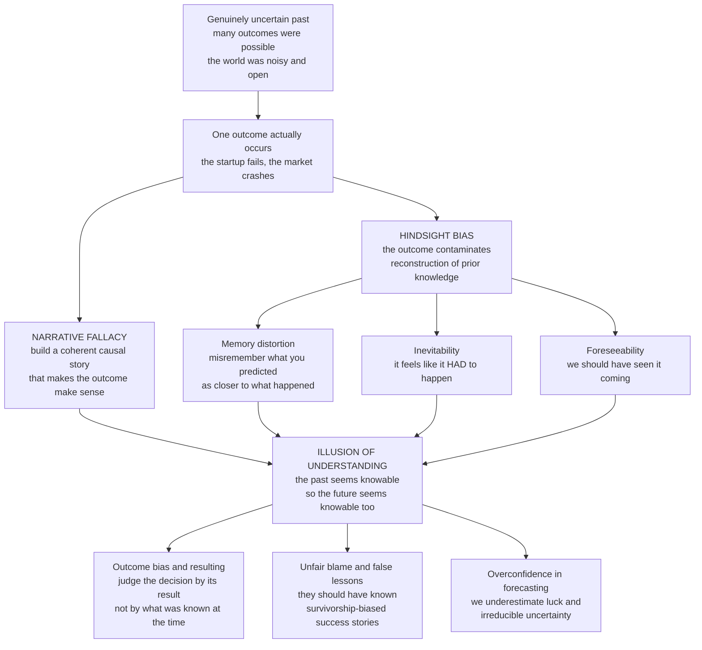

# 🪞 Hindsight Bias and the Narrative Fallacy

> [!abstract] TL;DR
> **Hindsight bias** (the "I-knew-it-all-along" effect) makes us remember past events as more predictable than they were — once we learn an outcome, we misremember our own prior predictions as closer to it, and the event comes to feel **inevitable** and **foreseeable**. The **narrative fallacy** (Taleb) is the twin compulsion to impose tidy **causal stories** on events that were largely random or noisy. Together they manufacture an **illusion of understanding**: we judge decisions by their outcomes rather than their soundness (**outcome bias**), unfairly blame people for not foreseeing the "obvious," learn false lessons from history, and — by making the past seem knowable — grow overconfident about predicting an unpredictable future. The antidotes are prediction journals, judging **process over outcome**, respecting the role of luck, and humility toward seductive explanations.

---

## Intuition

**Analogy:** After the 2008 crash, everyone "knew it was coming" — the housing bubble, the subprime loans, the leverage were all "obvious warning signs in retrospect." Yet in 2006 almost nobody sold their house or shorted the banks. When a startup fails, its doom was "inevitable — the market was never there." When the same startup succeeds, the founder was a "visionary who saw what others missed." Notice the trick: the *identical* early decisions get narrated as folly or genius depending only on how the story ended.

That is hindsight bias at work. Once we know the outcome, we quietly rewrite our memory to feel we predicted it all along ("I knew it"), and we spin a clean **causal story** that makes the messy, unpredictable past look like it *had* to happen. These twin illusions — the past was foreseeable, and it makes a tidy narrative — blind us to how uncertain the world really was, and, more dangerously, to how uncertain it still is.

---

## How It Works

### Core Mechanics

1. **The outcome contaminates memory (Fischhoff).** Baruch Fischhoff's foundational experiments (1975) gave people historical scenarios (e.g., a nineteenth-century British-Gurkha war) and asked them to estimate the probability of each possible ending. Told which ending *actually* happened, subjects raised their recalled estimate for that outcome — even when explicitly instructed to answer *as if they did not know*. Fischhoff called this **creeping determinism**: knowledge of the result seeps backward and colors the reconstruction of what you "must have" thought before.

2. **Three facets of hindsight bias.** The effect decomposes into (a) **memory distortion** — misremembering your *own* earlier prediction as closer to the outcome; (b) **inevitability** — the event now seeming it *had* to turn out this way; and (c) **foreseeability** — believing you (or the experts, the regulators, the doctor) *should have* seen it coming. The three are related but dissociable, and each feeds a different downstream harm.

3. **The narrative fallacy (Taleb).** Humans cannot tolerate a random, disconnected past, so we manufacture **coherent causal stories** that impose order and causation on events that were mostly noise. A good story is compressible, memorable, and emotionally satisfying — and we mistake that fluency for genuine understanding. As Taleb puts it, we are "story-telling animals," and *history is written by the storytellers*, not by the events themselves.

4. **The illusion of understanding.** The consequence of stitching a coherent story over a known outcome is a false sense that we *understand* what happened and could have predicted it — Kahneman's **illusion of validity**. The past seems more knowable than it ever was, so the future seems more knowable than it is. This is the hinge that converts a memory quirk into a forecasting disaster.

5. **Outcome bias — the "resulting" fallacy.** A close relative: we judge the *quality of a decision* by how it turned out rather than by whether it was sound *given what was known at the time*. Baron and Hershey (1988) showed people rate an identical medical decision as "better" when the patient happened to survive. Poker players call this **resulting** — condemning a good bet that lost and praising a reckless bet that won. It confuses **decision quality** with **outcome luck**.

6. **The halo effect and the hunger for coherence.** One salient outcome retroactively colors the evaluation of everything that preceded it (Rosenzweig's *The Halo Effect*). A CEO whose firm booms is called "visionary, focused, disciplined"; when the *same* firm busts, the *same* traits are relabeled "arrogant, rigid, controlling." Business books that promise "the secrets of great companies" are largely halo-effect artifacts: they read success backward into whatever the winners happened to do, ignoring the equally-behaving firms that failed.

7. **Overconfidence and the failure of prediction (Tetlock).** Hindsight *feeds* overconfidence: if the past was obvious, the future should be too. Tetlock's 20-year study of expert political forecasters found they barely beat chance — and, crucially, remained highly confident anyway, partly because hindsight let them reinterpret every miss as "almost right" or "wrong only on timing." The world is far less predictable than our stories suggest.

The sibling notes *Overconfidence_and_Calibration*, *Confirmation_Bias_and_Motivated_Reasoning*, *Availability_and_Representativeness*, and *Herding_Bubbles_and_Crashes* (not yet written) extend this: overconfidence is the calibration failure hindsight breeds; confirmation bias supplies the selective evidence that makes the backward story feel airtight; availability makes vivid post-hoc causes feel diagnostic; and herding plus narrative is how a whole market convinces itself a bubble was "obviously" a new paradigm — until the crash makes the collapse "obviously" inevitable.

### Flow / Architecture



---

## Key Concepts

### Secondary (intuitive level)

- **Hindsight bias** is the "I knew it all along" feeling — after something happens, it seems like you saw it coming, even if you didn't.
- We love a good **story**, so we invent neat explanations for things that were mostly luck or chance (the **narrative fallacy**).
- Because the past looks obvious in hindsight, we wrongly blame people for not predicting it — and we think we can predict the future better than we really can.
- We judge choices by how they turned out, not by whether they were smart at the time. A lucky reckless bet looks "smart"; an unlucky wise bet looks "dumb." That is **outcome bias**.
- Fix: write down what you actually thought *before* you knew the answer.

### Undergraduate (mechanism and named effects)

- **Creeping determinism (Fischhoff, 1975):** outcome knowledge shifts recalled prior probabilities toward the known result, even under instruction to ignore it — the defining lab demonstration of hindsight bias.
- **Three components:** memory distortion (misremembered prediction), inevitability (it had to happen), and foreseeability (it should have been predicted) — separable and independently harmful.
- **Narrative fallacy (Taleb):** the compulsion to compress random sequences into causal stories; fluency of the story is mistaken for validity of the explanation. Closely tied to **apophenia** — seeing meaningful patterns in noise.
- **Outcome bias vs. decision quality:** Baron and Hershey's process-versus-outcome dissociation. A sound decision can yield a bad outcome (bad luck) and a reckless decision a good outcome (good luck); evaluating the *process* requires screening off the result.
- **Halo effect (Rosenzweig):** a single global impression (success/failure) contaminates ratings of specific attributes; the engine behind survivorship-biased "secrets of success" literature.
- **Illusion of validity (Kahneman):** subjective confidence tracks the *coherence* of the story we can tell, not the *accuracy* of the prediction — which is why confidence and correctness routinely decouple.

### Graduate (theory, stakes, and debate)

- **Why it is adaptive (and hard to kill).** Hindsight bias may be a byproduct of efficient **knowledge updating**: once you learn the true state, overwriting the old belief is usually the *right* thing for a memory system optimized for future action, not for accurate autobiography. This is why it resists warning and instruction — it is a feature of learning, misfiring as a distortion of memory.
- **Sense-making versus accuracy.** The narrative fallacy is best understood as a *coherence-maximizing* rather than *accuracy-maximizing* process. Kahneman's **WYSIATI** ("what you see is all there is") explains why a small set of vivid, coherent facts produces high confidence: the mind builds the best story from available material and never registers what is missing (the base rates, the counterfactuals, the silent failures).
- **Survivorship and the reference-class problem.** Success narratives are selected on the dependent variable: we study only the winners and read their traits as causes, ignoring identically-behaving losers (Rosenzweig; Mauboussin). The correction is an **outside view** / reference-class forecasting — ask how a *class* of similar ventures fared, not how this one's story feels. This connects directly to overfitting and data-snooping in quantitative work.
- **Expert prediction (Tetlock).** *Expert Political Judgment* shows credentialed experts barely outperform chance and are systematically overconfident; hindsight is one mechanism that shields them from disconfirmation ("I was basically right," "wrong only on timing"). The **superforecasting** follow-up shows the antidote is behavioral: probabilistic thinking, frequent updating, scoring against reality, and treating beliefs as revisable.
- **The blame and accountability trap.** In law, medicine, aviation, and intelligence, hindsight bias corrupts *ex post* judgments of negligence: a decision reasonable *ex ante* is condemned because we now know the harm occurred (medical malpractice, the 9/11 and Pearl Harbor "failures to connect the dots"). Because the "dots" are only obvious once the picture is known, accountability systems that judge in hindsight punish reasonable process and reward lucky recklessness — corroding honest learning.
- **Distinguishing the neighbors.** Hindsight bias (memory of *prediction*), inevitability (perceived *determinism*), outcome bias (evaluation of *decisions*), and the halo effect (evaluation of *attributes*) are conceptually distinct but empirically entangled, all flowing from the same source: the outcome retroactively organizing our reconstruction of the prior world. Precise experiments manipulate each independently.

---

## Python Demo

```python
# Two demonstrations of how we turn an uncertain past into a "knowable" one:
#   (a) HINDSIGHT BIAS -- a "foreseeability" experiment. Agents give a genuine
#       probability estimate BEFORE an event. The event then happens. When asked
#       to RECALL what they predicted, memory creeps toward the known outcome, so
#       the recalled ("I-knew-it") estimate is inflated -- the hindsight shift.
#   (b) NARRATIVE FALLACY / apophenia -- a purely RANDOM walk (no drift, no signal)
#       invites a tidy causal story: a spurious "trend", "support"/"resistance"
#       lines, confident pattern-reading -- contrasted with the true, signal-free
#       generating process (iid, zero-mean increments).
import numpy as np
import matplotlib
matplotlib.use("Agg")
import matplotlib.pyplot as plt

rng = np.random.default_rng(7)

# ---------- (a) Hindsight bias: foresight vs. recalled ("would have said") -----
N = 40_000
outcome = 1.0                                               # the event DID happen
foresight = np.clip(rng.normal(0.30, 0.12, N), 0.01, 0.99)  # honest prior belief

def recalled(fore, creep):
    """Memory of the prior estimate drifts toward the known outcome by `creep`."""
    r = fore + creep * (outcome - fore) + rng.normal(0, 0.03, N)
    return np.clip(r, 0.0, 1.0)

creep_hat = 0.55                                            # hindsight-creep strength
hindsight = recalled(foresight, creep_hat)
gap = hindsight.mean() - foresight.mean()

print(f"Mean foresight estimate            : {foresight.mean():.3f}")
print(f"Mean recalled (hindsight) estimate : {hindsight.mean():.3f}")
print(f"Hindsight shift (I-knew-it gap)    : {gap:.3f}")

# Inevitability curve: recalled probability as memory-creep rises 0 -> 1
creeps = np.linspace(0.0, 1.0, 41)
mean_recall = [recalled(foresight, c).mean() for c in creeps]

# ---------- (b) Narrative fallacy: a story imposed on a random walk -----------
T = 300
steps = rng.normal(0.0, 1.0, T)          # iid, ZERO mean -> there is NO signal
walk = np.cumsum(steps)                   # random walk (e.g. a "stock price")
t = np.arange(T)

# The spurious "explanations" a storyteller draws on noise:
slope, intercept = np.polyfit(t, walk, 1)  # a "clear trend" (pure artefact)
trend = slope * t + intercept
resistance = np.max(walk)                  # a "ceiling the price can't break"
support = np.min(walk)                     # a "floor that holds"
print(f"\nTrue mean increment (should be ~0) : {steps.mean():.3f}")
print(f"Storyteller's fitted 'trend' slope : {slope:.3f}  <- amplified from noise")

# ---------- Plots -------------------------------------------------------------
fig, ax = plt.subplots(2, 2, figsize=(14, 9))

# A1: foresight vs. recalled distributions
ax[0, 0].hist(foresight, bins=40, alpha=0.6, color="#2563eb",
              label="Foresight (what they truly predicted)")
ax[0, 0].hist(hindsight, bins=40, alpha=0.6, color="#dc2626",
              label="Hindsight recall ('what I'd have said')")
ax[0, 0].axvline(foresight.mean(), color="#2563eb", ls="--", lw=2)
ax[0, 0].axvline(hindsight.mean(), color="#dc2626", ls="--", lw=2)
ax[0, 0].axvline(outcome, color="black", ls=":", lw=2, label="Actual outcome = 1")
ax[0, 0].set_xlabel("Stated probability the event would occur")
ax[0, 0].set_ylabel("Number of agents")
ax[0, 0].set_title("Hindsight bias: memory creeps toward the known outcome")
ax[0, 0].legend(fontsize=8)

# A2: inevitability curve
ax[0, 1].plot(creeps, mean_recall, color="#dc2626", lw=2.6)
ax[0, 1].axhline(foresight.mean(), color="#2563eb", ls="--", lw=1.8,
                 label="True mean foresight")
ax[0, 1].axhline(outcome, color="black", ls=":", lw=1.8, label="Actual outcome")
ax[0, 1].scatter([creep_hat], [hindsight.mean()], color="#dc2626", zorder=5, s=60)
ax[0, 1].set_xlabel("Memory-creep toward outcome (0 = honest, 1 = full rewrite)")
ax[0, 1].set_ylabel("Mean recalled probability")
ax[0, 1].set_title("The event feels ever more 'inevitable' as memory rewrites")
ax[0, 1].legend(fontsize=8)

# B1: the random walk with the spurious story drawn on it
ax[1, 0].plot(t, walk, color="#111827", lw=1.4, label="Random walk (no signal)")
ax[1, 0].plot(t, trend, color="#059669", lw=2.4, ls="--",
              label="Spurious 'trend' (best-fit line)")
ax[1, 0].axhline(resistance, color="#b45309", lw=1.6, ls=":", label="'Resistance'")
ax[1, 0].axhline(support, color="#7c3aed", lw=1.6, ls=":", label="'Support'")
ax[1, 0].set_xlabel("Time")
ax[1, 0].set_ylabel("'Price'")
ax[1, 0].set_title("Narrative fallacy: a tidy story imposed on pure noise")
ax[1, 0].legend(fontsize=8)

# B2: the true generating process -- zero-mean white noise
ax[1, 1].bar(t, steps, color="#9ca3af", width=1.0)
ax[1, 1].axhline(steps.mean(), color="#dc2626", lw=2,
                 label=f"Sample mean step = {steps.mean():.3f}")
ax[1, 1].axhline(0.0, color="black", lw=1, ls="--",
                 label="True mean = 0 (no drift, no trend)")
ax[1, 1].set_xlabel("Time")
ax[1, 1].set_ylabel("Increment (step)")
ax[1, 1].set_title("The truth: iid zero-mean steps -- there was never a trend")
ax[1, 1].legend(fontsize=8)

plt.tight_layout()
plt.savefig("hindsight_and_narrative_fallacy.png", dpi=110)
plt.show()
```

**What the demo shows.** In panel A1 the blue distribution is what agents *honestly* predicted before the event; the red is what they later *recall* predicting once they know it happened — the whole mass has crept rightward toward the outcome, and the two dashed means are separated by the printed "I-knew-it gap." Panel A2 traces the **inevitability curve**: as memory-creep rises from an honest 0 to a full rewrite at 1, the recalled probability climbs from true foresight up toward the outcome — the event feeling more and more "obvious" the more memory is contaminated. Panels B1 and B2 are the same random walk told two ways: B1 is the *storyteller's* version — a confident "uptrend," a "resistance ceiling," a "support floor" drawn on the data; B2 is the *truth* — iid zero-mean steps with essentially no drift. The trend, the support, and the resistance were never in the generating process; they are narratives we impose on noise.

---

## Real-World Applications

> **Example (investing and business books):** Nassim Taleb's core case. Fund managers, founders, and pundits construct compelling causal stories for market moves that are statistically indistinguishable from random walks (see panel B). "Secrets of great companies" bestsellers select winners after the fact and read their traits as causes — a survivorship-plus-halo artifact that vanishes when you include the identically-run firms that failed. Rosenzweig documents how the *same* Cisco or ABB decisions were praised as visionary at the peak and condemned as reckless in the trough, purely because the outcome flipped.

- **Medicine and malpractice:** a physician's *ex ante* reasonable decision is judged negligent *ex post* because the rare bad outcome is now known ("they should have ordered the scan"). Courts and M&M conferences that reason in hindsight systematically overestimate how foreseeable the complication was.
- **Intelligence and disasters:** the "failure to connect the dots" narratives after Pearl Harbor and 9/11. Once the attack is known, the relevant signals stand out from the noise — but *before*, they were buried in a flood of equally-plausible signals. Congressional hindsight punishes reasonable prior triage.
- **Corporate accountability and firing:** executives are fired for decisions that were sound given the information available, because the venture happened to fail (outcome bias). Meanwhile lucky reckless bets get promoted — teaching the organization exactly the wrong lesson about risk.
- **Forecasting and policy:** pundits claim they "called" each crisis while quietly forgetting the crises they wrongly predicted; hindsight shields them from calibration, sustaining unwarranted authority (Tetlock).
- **Quantitative finance:** backtests that "explain" past returns with a story ("momentum works because of underreaction") are prone to data-snooping and survivorship; the spurious-pattern-in-noise of panel B is precisely the overfitting risk that disciplined out-of-sample testing guards against.

---

## Common Pitfalls

- **Judging a decision by its outcome ("resulting").** The single most consequential error. A good decision can lose and a bad decision can win; if you only reward winners you are rewarding luck and punishing sound process. Evaluate the *ex ante* reasoning, not the *ex post* result.
- **Trusting memory of your own past predictions.** Your recollection of "what I thought would happen" is silently edited toward what did happen. Without a written, timestamped record you have no reliable access to your prior beliefs — self-report is contaminated.
- **Mistaking a coherent story for understanding.** A fluent causal narrative feels like knowledge but is often a compression of noise. Ask: does this story also predict *out of sample*, or does it only fit the one case we already know the ending of?
- **Reading success backward (survivorship + halo).** Studying only winners and inferring their traits are causes ignores the identically-behaving losers. "The habits of billionaires" is mostly the habits of *people*, filtered by luck. Always ask about the reference class, not just the survivors.
- **Blaming people for not foreseeing the "obvious."** The dots are only obvious once you know the picture. Hindsight makes *ex ante* reasonable behavior look negligent; fair accountability judges the process available at the time, not the outcome revealed later.
- **Believing awareness inoculates you.** Like other cognitive illusions, hindsight persists even when you *know* about it and are *told* to ignore the outcome (Fischhoff). Procedural fixes — decision journals, pre-mortems, blind evaluation — beat willpower.

---

## Related Concepts

- [[Heuristics_and_Biases_Overview]] — hindsight, outcome bias, and the halo effect are part of the "bias zoo" the Kahneman-Tversky program catalogued; this note is a deep dive on the memory-and-narrative cluster.
- [[Cognitive_Biases]] — the Psychology-vault catalogue that lists hindsight bias, the halo effect, and the misinformation effect as consequences of reconstructive memory.
- [[Memory_Systems]] — the reconstructive, reconsolidating nature of memory (Loftus) is the machinery hindsight bias exploits: every retrieval can rewrite the trace toward the known outcome.
- [[Long_Term_Memory_Systems]] — episodic memory as cue-dependent reconstruction, not playback; explains *why* recalled predictions drift.
- [[Judgment_and_Decision_Making]] — the cognitive-science home of the illusion of validity and the normative-vs-descriptive gap that outcome bias violates.
- [[Cognitive_Biases_and_Heuristics]] — the Logic-and-Critical-Thinking treatment linking these effects to reasoning fallacies and debiasing procedure.
- [[Causal_Reasoning]] — the narrative fallacy is, formally, the over-attribution of causation to correlation and noise; this note supplies the normative standard for causal claims.
- [[Decision_Making_Under_Uncertainty]] — the process-over-outcome, outside-view discipline that counteracts hindsight and outcome bias.
- [[Risk_Ambiguity_and_Uncertainty]] — Taleb's black swans and deep uncertainty: the narrative fallacy is how we retrofit the unforeseeable into "obvious in retrospect."
- [[Behavioral_Finance]] — where hindsight, overconfidence, and narrative combine to drive bubbles, crashes, and the illusion that market moves were predictable.
- [[Overfitting_in_Finance]] — the quantitative sibling: fitting a spurious story to noise (panel B) is exactly the data-snooping/survivorship trap out-of-sample testing defends against.
- [[Kuhn_Paradigms_and_Scientific_Revolutions]] — historiography written by the storytellers: how the past of science is narrated as a clean, inevitable march only in retrospect.

*Not yet written (Behavioral_Economics siblings referenced in prose): Overconfidence_and_Calibration, Confirmation_Bias_and_Motivated_Reasoning, Availability_and_Representativeness, Herding_Bubbles_and_Crashes.*

---

## Review Questions

### Secondary

1. Explain the "I knew it all along" feeling in your own words, and give an example from sports or the news where an outcome that was *not* obvious beforehand felt obvious afterward.
2. Why is it unfair to fire a manager for a decision that failed if the decision was sensible given what they knew at the time? What is this error called?
3. What simple habit best protects you against misremembering what you actually predicted?

### Undergraduate

1. Distinguish the three facets of hindsight bias (memory distortion, inevitability, foreseeability) and give a real setting — legal, medical, or intelligence — where each does distinct damage.
2. Using the random-walk demo, explain the difference between the *generating process* and the *story* an observer imposes on it. Why does a nonzero fitted trend slope emerge from a truly zero-mean process, and why is acting on it a mistake?
3. State the process-versus-outcome distinction precisely, then design a decision-evaluation rule that would reward a sound-but-unlucky decision over a reckless-but-lucky one.

### Graduate

1. Fischhoff showed hindsight bias survives explicit instructions to ignore the outcome. Argue that this persistence is evidence hindsight bias is a byproduct of *adaptive* belief-updating, then explain what that implies for debiasing strategy.
2. "Success studies" in business claim to identify the causes of great performance. Using survivorship bias, the halo effect, and the reference-class/outside-view idea, construct the strongest methodological critique of such studies and propose a study design that would actually isolate causal factors.
3. Tetlock finds experts barely beat chance yet stay confident. Explain the causal chain by which hindsight bias and the narrative fallacy jointly sustain that overconfidence, and describe two features of "superforecasting" practice engineered to break the chain.

---

## Sources

- [Fischhoff, B. (1975). "Hindsight ≠ Foresight: The Effect of Outcome Knowledge on Judgment Under Uncertainty." *Journal of Experimental Psychology: Human Perception and Performance*, 1(3), 288-299.](https://doi.org/10.1037/0096-1523.1.3.288)
- [Baron, J., & Hershey, J. C. (1988). "Outcome Bias in Decision Evaluation." *Journal of Personality and Social Psychology*, 54(4), 569-579.](https://doi.org/10.1037/0022-3514.54.4.569)
- [Taleb, N. N. (2007). *The Black Swan: The Impact of the Highly Improbable*. Random House.](https://www.penguinrandomhouse.com/books/176226/the-black-swan-second-edition-by-nassim-nicholas-taleb/)
- [Kahneman, D. (2011). *Thinking, Fast and Slow* (Part III: Overconfidence; ch. 19-20). Farrar, Straus and Giroux.](https://us.macmillan.com/books/9780374533557/thinkingfastandslow)
- [Tetlock, P. E. (2005). *Expert Political Judgment: How Good Is It? How Can We Know?* Princeton University Press.](https://press.princeton.edu/books/paperback/9780691178288/expert-political-judgment)

---

#behavioral-economics #hindsight-bias #narrative-fallacy #outcome-bias #illusion-of-understanding
