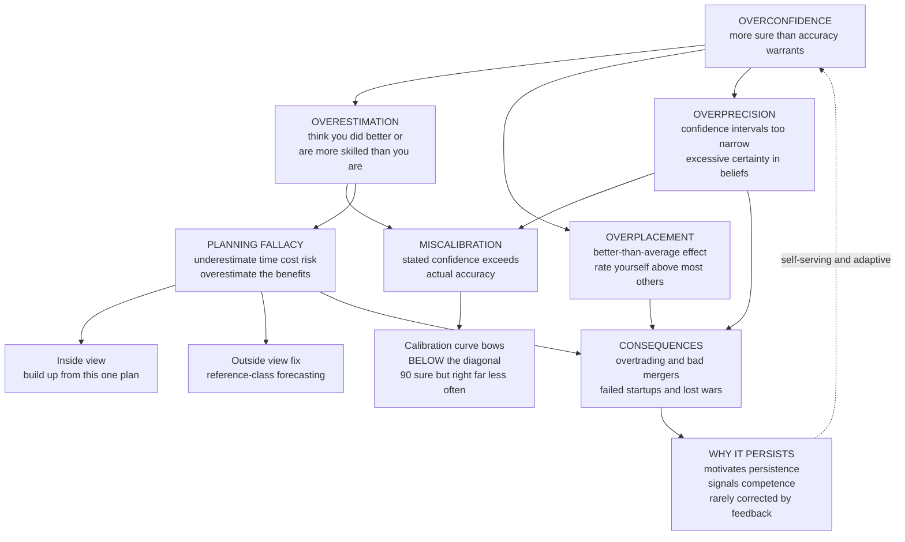

# 🎯 Overconfidence and Calibration

> [!abstract] TL;DR
> **Overconfidence** — being more certain of our judgments, abilities, and forecasts than accuracy warrants — is, in Kahneman's phrase, "the most significant of the cognitive biases," because it silently launches wars, sinks companies, and busts markets. Moore and Healy split it into **three distinct forms**: **overestimation** (thinking you performed or can perform better than you did), **overplacement** (the *better-than-average* effect — most drivers, students, and CEOs rate themselves above the median, a statistical impossibility), and **overprecision** (confidence intervals that are far too narrow). The gold standard against which all three are measured is **calibration**: you are well-calibrated when your stated confidence *matches* your hit rate — you are right 90 percent of the time on the claims you call "90 percent sure." Real people are chronically miscalibrated; their "90 percent" intervals catch the truth barely half the time, and the same optimism drives the **planning fallacy** behind chronically late, over-budget projects. Overconfidence persists because it motivates action, signals competence, and is rarely punished by clear feedback — but it can be partly tamed by tracking calibration, taking the **outside view** (reference-class forecasting), and running **premortems**.

---

## Intuition

**Analogy:** Ask a room full of drivers whether they are above-average behind the wheel and about eighty out of a hundred hands go up — a statistical impossibility, since only half can beat the median. Now switch the game: ask experts to give you a range they are "90 percent sure" contains some unknown quantity — the length of the Nile, next quarter's revenue, a patient's true risk — and the real answer falls *outside* their range not one time in ten, but closer to *five times in ten*. Both rooms reveal the same flaw from two angles. We are, systematically, too sure of ourselves: too sure we are skilled, too sure our estimates are right, too sure our plans will go smoothly.

That single, quiet distortion is arguably the most consequential of all the biases catalogued in [[Heuristics_and_Biases_Overview]]. Anchoring costs you a few dollars; overconfidence starts wars fought on the expectation of quick victory, funds startups whose founders are certain *they* will be the exception, and inflates bubbles priced on the belief that this time the models are right. The cure is not more confidence or less — it is **calibration**: making the number on your certainty mean what it says.

---

## How It Works

### Core Mechanics

1. **Overconfidence is not one thing — it is three.** Moore and Healy (2008) showed that the label had been smuggling together three phenomena with *different causes* that can even point in opposite directions. Distinguishing them is the single most important conceptual move in this literature.
   - **Overestimation** — believing your *absolute* performance, ability, or degree of control is higher than it is. You think you scored 85 when you scored 70; you think you can influence a coin toss you cannot.
   - **Overplacement** — believing you are better *relative to others* than you are: the **better-than-average effect** or **Lake Wobegon effect**, where "all the children are above average." Ninety-plus percent of professors rate their teaching above median; most people think they are more ethical, more honest, and better drivers than the average — all in-aggregate impossibilities.
   - **Overprecision** — being too certain that your beliefs are correct: your subjective probability distributions are **too tight**. This is the form measured by confidence intervals, and it is the most robust and reliable of the three.
2. **Calibration is the gold standard for good judgment.** A person is **well-calibrated** if, across all the times they say "I am *X* percent sure," they turn out right exactly *X* percent of the time. Plot stated confidence on the x-axis against actual accuracy on the y-axis and a perfectly calibrated judge lies on the 45-degree diagonal. **Miscalibration** — the technical meaning of overconfidence — is when confidence exceeds accuracy, so the curve bows *below* the diagonal.
3. **Real people, including experts, live below the diagonal.** The classic "90 percent confidence interval" task (Alpert and Raiffa) is the workhorse demonstration: people's supposedly 90-percent ranges for unknown quantities contain the truth only about 50 percent of the time. Their ranges are simply too narrow — they radically **underestimate uncertainty**. Notably, the exceptions are instructive: **weather forecasters** ("70 percent chance of rain" is right about 70 percent of the time) and expert **bridge players** are well-calibrated, because they make many repeated predictions and get prompt, unambiguous **feedback**.
4. **The planning fallacy is overconfidence about time and cost.** Even when we *know* that similar past projects ran late, we predict our own will finish on schedule — the tendency to underestimate the time, costs, and risks of future actions while overestimating their benefits. Kitchen renovations, dissertations, software releases, the Sydney Opera House (opened ten years late at fourteen times its budget), and most megaprojects overrun for the same reason: we take the **inside view**, building an optimistic scenario from the specifics of *this* plan, instead of the **outside view** — asking how long projects *like this one* actually took (**reference-class forecasting**).
5. **Cousins: the illusion of control and unrealistic optimism.** The **illusion of control** is overestimating our influence over chance outcomes (people pay more for lottery tickets they picked themselves). **Unrealistic optimism** is the "it won't happen to me" bias about accidents, divorce, disease, and default. This same optimism fuels **entrepreneurship**: most new ventures fail, yet founders are near-uniformly sure theirs will succeed.
6. **Why it persists — and why we don't learn out of it.** Overconfidence survives because it is quietly *useful*. It is **motivating** (it sustains persistence, risk-taking, and leadership); it is **self-serving** (it protects self-esteem); it is **socially advantageous** (confidence is persuasive and reads as competence — the *confidence heuristic* — so confident people win more trust and status); and evolutionary arguments (Trivers) suggest **self-deception aids the deception of others**. Crucially, it is **rarely corrected by clean feedback**: outcomes are noisy, delayed, and easy to rationalize, so the loop that fixes a weather forecaster's calibration almost never closes for a CEO or a general.

### Flow / Architecture



---

## Key Concepts

### Secondary Level

**The one idea to keep:** we are more sure than we should be — about how good we are, how we stack up against others, and how right our guesses are. If a weather app said "90 percent chance of rain" but it only rained half the time it said that, you would stop trusting it. Yet that is exactly how most human confidence behaves: when people are "90 percent sure," they are wrong far more than one time in ten. Being *well-calibrated* just means your "sureness" is honest — when you say 90 percent, you are right about 90 percent of the time.

**Two everyday tells.** First, ask a group whether they are above-average drivers and far more than half say yes — impossible, since half must be below the median. Second, ask anyone how long a task will take and it almost always takes longer; the **planning fallacy** is why renovations, essays, and software are chronically late even when we *know* last time ran over.

### Undergraduate Level

**The three forms, kept separate (Moore and Healy).** *Overestimation* is an absolute error about the self (I think I got 85, I got 70). *Overplacement* is a comparative error (I think I am better than most, when I am average) and is strongest for *easy* tasks — everyone can drive, so everyone feels above average. *Overprecision* is certainty about beliefs (my range is too narrow). They can conflict: on a *hard* task people often *underplace* (think they are worse than others) while still *overestimating* their absolute score. Never say "overconfidence" without specifying which one you mean.

**Measuring calibration.** Bin many judgments by stated confidence and compute the empirical hit rate per bin; plot against the diagonal. The gap between mean confidence and mean accuracy is the *overconfidence score*. The **hard-easy effect**: overconfidence grows on hard questions and can flip to underconfidence on very easy ones — a clue that part of "overconfidence" is a regression/measurement artifact, though a real residual remains.

**The interval task and the inside/outside view.** The Alpert-Raiffa "90 percent interval" task reliably yields hit rates near 50 percent — the signature overprecision result, with direct implications for **risk** and **forecasting**: if your uncertainty bands are half as wide as they should be, you are systematically blindsided. The fix for the planning fallacy is the **outside view**: instead of reasoning about your specific plan (inside view), find the reference class of similar past cases and use *their* distribution of outcomes — **reference-class forecasting**, now mandated for some public infrastructure budgeting.

### Graduate Level

**Why the three forms dissociate.** Moore and Healy model overestimation and overplacement as arising partly from *imperfect information about the self versus others*, producing the paradox that the *same* task can yield overestimation and *under*placement simultaneously. Overprecision, by contrast, is remarkably stable across tasks and resistant to debiasing, which is why it is treated as the "purest" and most consequential form. A rigorous claim about overconfidence must state the form, the task difficulty, and the elicitation method, because effect sizes and even *signs* depend on all three.

**Normative benchmark and the Bayesian framing.** Calibration is a *frequentist* property of a forecaster; a coherent Bayesian who reports honest subjective probabilities *should* be calibrated in the long run (see [[Bayesian_Reasoning]] and [[Bayesian_Statistics]]). Overprecision is thus a failure to widen posteriors enough given the true noisiness of one's evidence — an under-dispersion of the subjective predictive distribution. Proper **scoring rules** (Brier, logarithmic) decompose forecast error into *calibration* and *resolution/discrimination* components, letting us reward being right *and* being honest about uncertainty.

**Persistence as equilibrium, not error.** The adaptive accounts reframe overconfidence as a strategy that can be *individually* rational even when *epistemically* wrong. Signaling models show that if confidence is a costly-to-fake signal of competence, a population equilibrium can sustain systematic overconfidence (the confidence heuristic rewards it socially); evolutionary models (Johnson and Fowler, 2011) show overconfidence can be favored when the prize is large relative to the cost of conflict — precisely the conditions of war and market competition. This explains why overconfidence is not merely *not* corrected by feedback but is actively *selected for* in competitive arenas, and why the sober forecaster is often out-competed by the confident one.

---

## Python Demo

```python
# ---------------------------------------------------------------
# OVERCONFIDENCE AND CALIBRATION
#
# (a) CALIBRATION CURVE: simulate a person answering many questions
#     and stating a CONFIDENCE each time. A WELL-calibrated person
#     lies on the diagonal (says "90%" -> right 90% of the time).
#     Real people are OVERCONFIDENT: the curve bows BELOW the diagonal.
# (b) OVERPRECISION: their "90% confidence intervals" contain the
#     true value far less than 90% of the time (hit rate ~50%).
# (c) PLANNING FALLACY: actual task times systematically OVERRUN the
#     estimate -- most projects finish late even when planners "know"
#     similar projects ran over.
# ---------------------------------------------------------------
import numpy as np
import matplotlib
matplotlib.use("Agg")            # headless-safe backend
import matplotlib.pyplot as plt

rng = np.random.default_rng(42)

# ===============================================================
# (a) CALIBRATION CURVE
# ===============================================================
conf_levels = np.array([0.50, 0.60, 0.70, 0.80, 0.90, 1.00])
N_PER = 5000                     # answers at each stated confidence

def true_accuracy(conf):
    """Overconfidence: accuracy rises with stated confidence but with
    slope < 1, so it sits BELOW the diagonal for high confidence."""
    return 0.50 + 0.55 * (conf - 0.50)

stated, correct = [], []
for c in conf_levels:
    outcomes = rng.random(N_PER) < true_accuracy(c)   # Bernoulli hits
    stated.append(np.full(N_PER, c))
    correct.append(outcomes)
stated = np.concatenate(stated)
correct = np.concatenate(correct)

emp_acc = np.array([correct[stated == c].mean() for c in conf_levels])
mean_conf, mean_acc = stated.mean(), correct.mean()

print("=" * 60)
print("(a) CALIBRATION  (stated confidence vs actual accuracy)")
print("=" * 60)
for c, a in zip(conf_levels, emp_acc):
    print(f"    stated {c:4.0%}  ->  actual {a:5.1%}   gap {c - a:+.1%}")
print(f"    MEAN confidence {mean_conf:.1%}  vs  MEAN accuracy {mean_acc:.1%}"
      f"   -> overconfidence {mean_conf - mean_acc:+.1%}")

# ===============================================================
# (b) OVERPRECISION: "90% intervals" that miss half the time
# ===============================================================
Z90 = 1.645                      # half-width of a TRUE 90% interval, in sigmas
SIGMA_TRUE = 1.0                 # real dispersion of the estimate error
OVERPRECISION = 2.4              # people THINK they are 2.4x more precise
half_width = Z90 * SIGMA_TRUE / OVERPRECISION

M = 200_000
errors = rng.normal(0.0, SIGMA_TRUE, M)      # (estimate - truth)
hit = np.abs(errors) <= half_width           # did the "90%" interval catch it?
hit_rate = hit.mean()

print("\n" + "=" * 60)
print("(b) OVERPRECISION  (the 90% interval hit-rate test)")
print("=" * 60)
print(f"    people CLAIM their intervals are 90% intervals,")
print(f"    but the truth falls inside only {hit_rate:.0%} of the time.")

# ===============================================================
# (c) PLANNING FALLACY: actual time overruns the estimate
# ===============================================================
K = 20_000
estimate = rng.lognormal(mean=np.log(10), sigma=0.30, size=K)     # planned weeks
overrun  = rng.lognormal(mean=np.log(1.5), sigma=0.35, size=K)    # overrun factor
actual   = estimate * overrun
ratio    = actual / estimate

print("\n" + "=" * 60)
print("(c) PLANNING FALLACY  (actual / estimated duration)")
print("=" * 60)
print(f"    median ratio = {np.median(ratio):.2f}x  "
      f"({(ratio > 1).mean():.0%} of projects ran OVER the estimate)")

# ===============================================================
# FIGURE: calibration curve | overprecision | planning fallacy
# ===============================================================
fig, (axC, axP, axF) = plt.subplots(1, 3, figsize=(16, 5))

# Panel 1: calibration curve
axC.plot([0.5, 1.0], [0.5, 1.0], "--", color="gray", lw=2,
         label="Perfect calibration")
axC.plot(conf_levels, emp_acc, "o-", color="crimson", lw=2.4,
         label="Overconfident person")
axC.fill_between(conf_levels, emp_acc, conf_levels,
                 color="crimson", alpha=0.12, label="Overconfidence gap")
axC.set_xlabel("Stated confidence")
axC.set_ylabel("Actual accuracy")
axC.set_title("Calibration curve\ncurve bows BELOW the diagonal")
axC.set_xlim(0.48, 1.02); axC.set_ylim(0.48, 1.02)
axC.legend(loc="upper left", fontsize=8); axC.grid(alpha=0.3)

# Panel 2: overprecision hit rate
bars = axP.bar(["Claimed\n90% CI", "Actually\ncontains truth"],
               [90, hit_rate * 100], color=["steelblue", "crimson"])
axP.bar_label(bars, fmt="%.0f%%", padding=3, fontsize=11)
axP.axhline(90, color="steelblue", ls=":", lw=1)
axP.set_ylabel("Percent of intervals containing the truth")
axP.set_title("Overprecision\n'90% intervals' catch truth ~half the time")
axP.set_ylim(0, 100); axP.grid(axis="y", alpha=0.3)

# Panel 3: planning fallacy
axF.hist(ratio, bins=60, color="darkorange", edgecolor="white")
axF.axvline(1.0, color="black", ls="--", lw=1.8, label="on time")
axF.axvline(np.median(ratio), color="crimson", lw=2.2,
            label=f"median = {np.median(ratio):.2f}x")
axF.set_xlabel("Actual time / estimated time")
axF.set_ylabel("Number of projects")
axF.set_title("Planning fallacy\nmost projects run OVER the estimate")
axF.legend(fontsize=8)

plt.tight_layout()
plt.savefig("overconfidence_and_calibration.png", dpi=120, bbox_inches="tight")
plt.show()
```

**What the demo shows:**

- **Panel 1 (calibration curve):** the red curve sits *below* the gray diagonal everywhere above 50 percent — the person says "90 percent" but is right closer to 72 percent. The shaded gap is overconfidence made visible; mean confidence exceeds mean accuracy.
- **Panel 2 (overprecision):** intervals *labelled* as 90 percent intervals actually contain the true value only about half the time, the robust Alpert-Raiffa result. The ranges are simply too narrow — a direct, quantified failure to represent uncertainty.
- **Panel 3 (planning fallacy):** the distribution of actual-to-estimated time is shifted right of 1.0, with the vast majority of projects overrunning and a long right tail of disasters — the signature of inside-view planning that ignores the reference class.

---

## Real-World Applications

> **Finance — overtrading and value-destroying deals.** Barber and Odean's study of 35,000 brokerage accounts found the households that *traded the most earned the least*: overconfident investors overestimate the precision of their information (overprecision), trade too much, underdiversify, and give back their returns to costs. Men, who were more overconfident, traded 45 percent more than women and cut their net returns further. At the top, **CEO overconfidence** ("hubris") predicts value-destroying mergers and over-investment, and collective overconfidence inflates the bubbles studied in [[Market_Anomalies_and_Bubbles]]. See [[Behavioral_Finance]] and [[Cognitive_Biases_in_Investing]]; the trading mechanics belong to the forthcoming sibling *Overtrading_and_Behavioral_Portfolio_Theory*.

- **Strategy and the military.** Wars are repeatedly launched on the overconfident expectation of quick, cheap victory — 1914, Vietnam, Iraq — with each side's planners taking the inside view and discounting the reference class of protracted conflicts.
- **Megaprojects and software.** The planning fallacy makes public infrastructure and IT projects chronically late and over budget; Flyvbjerg's remedy, **reference-class forecasting**, is now built into UK Treasury and Danish transport-budgeting guidance to force the outside view.
- **Medicine and law.** Physicians' diagnostic confidence often outruns their accuracy, and confident **eyewitnesses** sway juries even though confidence and accuracy correlate weakly — a miscalibration with liberty at stake.
- **Entrepreneurship and R&D.** Optimism and the illusion of control keep founders building despite base rates of failure; useful in aggregate (someone has to try), costly for the individual who ignored the reference class.

---

## Common Pitfalls

- **Collapsing the three forms into one word.** Saying "people are overconfident" without specifying *overestimation, overplacement, or overprecision* invites contradiction: on hard tasks people can *overestimate* their score while *underplacing* relative to others. Always name the form, the task difficulty, and the measure.
- **Confusing confidence with accuracy — the confidence heuristic.** We treat a confident speaker as a competent one, but confidence and correctness are only loosely linked. Rewarding the confident forecaster over the calibrated one entrenches the bias in teams and markets.
- **Believing awareness debiases you.** Like the visual illusions in [[Cognitive_Biases]], knowing about overprecision does not widen your intervals. Reliable fixes are *procedural* — track your calibration, force ranges, take the outside view — not motivational.
- **Anchoring on a point estimate, then padding.** People set a best guess and adjust outward too little, so their intervals stay narrow. Better: build the *bounds first* (what would surprise me low? high?) before naming a central value.
- **Ignoring the reference class (inside view).** Estimating a project bottom-up from its specifics feels rigorous but reliably underestimates time and cost. If you have not asked "how did projects *like this* actually turn out," you have not done a forecast, only a plan.
- **Treating overconfidence as pure pathology.** It is partly adaptive — motivating persistence, signaling competence, enabling risk-taking. The goal is *calibrated confidence*: honest uncertainty for forecasts, bold commitment for action, and not confusing the two.

---

## Related Concepts

- [[Heuristics_and_Biases_Overview]] — overconfidence is the flagship member of the "bias zoo" that the Kahneman-Tversky program catalogued; this note is its dedicated deep-dive.
- [[Cognitive_Biases]] — the Psychology-vault taxonomy that houses overconfidence, the illusion of control, and optimism bias among the broader family of systematic errors.
- [[Judgment_and_Decision_Making]] — the cognitive-science treatment of calibration, probability judgment, and the normative benchmarks overconfidence violates.
- [[Bayesian_Reasoning]] — the coherent-probabilities standard under which honest subjective forecasts *should* be calibrated; overprecision is under-dispersed posteriors.
- [[Bayesian_Statistics]] — priors, posteriors, and predictive distributions; the formal machinery for widening intervals to match true noise.
- [[Behavioral_Finance]] — where overconfidence becomes overtrading, hubris-driven M&A, and asset bubbles.
- [[Cognitive_Biases_in_Investing]] — the investor-level catalogue in which overconfidence and the illusion of control are central.
- [[Market_Anomalies_and_Bubbles]] — collective overconfidence as an engine of mispricing and bubbles.
- [[Cognitive_Biases_and_Heuristics]] — the Logic-and-Critical-Thinking view linking overconfidence to reasoning errors and debiasing.
- [[Decision_Making_Under_Uncertainty]] — the applied framework where calibration, ranges, and the outside view do their work.

*Not yet written (Behavioral_Economics siblings referenced above in prose): Availability_and_Representativeness, Confirmation_Bias_and_Motivated_Reasoning, Base_Rate_Neglect_and_Bayesian_Reasoning, and Overtrading_and_Behavioral_Portfolio_Theory.*

---

## Review Questions

### Secondary

1. A weather app says "90 percent chance of rain" on many days, but on those days it actually rains only about 60 percent of the time. Is the app over- or under-confident, and what would a *well-calibrated* app's track record look like?
2. In a class, 80 percent of students say they are "above-average" at math. Explain in plain language why that cannot be true, and name the effect.
3. Give an everyday example of the **planning fallacy** from your own life, and one simple thing you could have done to make a more realistic estimate.

### Undergraduate

1. Distinguish **overestimation**, **overplacement**, and **overprecision** with a concrete example of each, and describe a single task on which a person could plausibly show overestimation and *under*placement at the same time.
2. You are given a set of a forecaster's predictions with stated confidences and outcomes. Describe exactly how you would build a **calibration curve** and compute an overconfidence score, and state what the curve looks like for an overconfident versus a well-calibrated judge.
3. Explain the **inside view** versus the **outside view** for a project estimate, and why reference-class forecasting typically produces later (more accurate) completion dates than a detailed bottom-up plan.

### Graduate

1. Overprecision is described as the most robust and consequential of the three forms, yet part of measured "overconfidence" on hard questions is a hard-easy / regression artifact. How would you design an elicitation and analysis that isolates a *genuine* overprecision residual from measurement artifacts?
2. Frame overprecision in Bayesian terms as under-dispersion of the subjective predictive distribution, and explain how a **proper scoring rule** (e.g., the Brier or logarithmic score) decomposes forecast quality into calibration and discrimination, rewarding honest uncertainty.
3. Adaptive accounts (Trivers; Johnson and Fowler) argue overconfidence can be individually or evolutionarily *advantageous* even when epistemically wrong. Lay out the conditions under which overconfidence is selected for, and explain the tension this creates for any organization that wants *calibrated* forecasts from individuals rewarded for *confident* ones.

---

## Sources

- [Moore, D. A. & Healy, P. J. (2008). "The Trouble with Overconfidence." *Psychological Review* 115(2), 502–517](https://doi.org/10.1037/0033-295X.115.2.502)
- [Buehler, R., Griffin, D. & Ross, M. (1994). "Exploring the 'Planning Fallacy': Why People Underestimate Their Task Completion Times." *Journal of Personality and Social Psychology* 67(3), 366–381](https://doi.org/10.1037/0022-3514.67.3.366)
- [Barber, B. M. & Odean, T. (2001). "Boys Will Be Boys: Gender, Overconfidence, and Common Stock Investment." *Quarterly Journal of Economics* 116(1), 261–292](https://doi.org/10.1162/003355301556400)
- [Johnson, D. D. P. & Fowler, J. H. (2011). "The Evolution of Overconfidence." *Nature* 477, 317–320](https://doi.org/10.1038/nature10384)
- [Kahneman, D. (2011). *Thinking, Fast and Slow*. Farrar, Straus and Giroux](https://us.macmillan.com/books/9780374533557/thinkingfastandslow)

---

#behavioral-economics #overconfidence #calibration #planning-fallacy #overprecision
