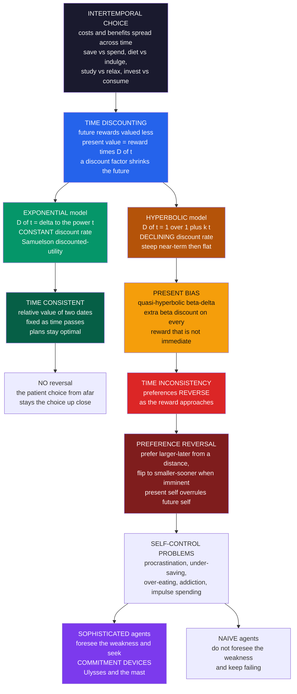

# ⏳ Intertemporal Choice and Discounting

> [!abstract] TL;DR
> **Intertemporal choice** is any decision whose costs and benefits are spread across *time* — saving versus spending, dieting versus indulging, studying versus relaxing. To compare a payoff now against one later, people apply **time discounting**: future rewards are valued *less* than present ones, at a rate that measures impatience. The rational, normative benchmark is the **discounted-utility model** (Samuelson, 1937) with **exponential** discounting — a *constant* per-period discount rate whose defining virtue is **time consistency**: plans made today stay optimal tomorrow, so preferences never reverse. But people demonstrably do *not* discount exponentially. They discount **hyperbolically** — very impatiently over near-term delays, then far more patiently over distant ones — which produces **present bias** (captured tractably by Laibson's **quasi-hyperbolic β-δ model**) and, crucially, **time inconsistency**: as a tempting reward approaches, preferences *reverse*, and the impulsive "present self" overrides the patient plans of the "future self." This is the mathematical root of procrastination, under-saving, over-eating, and addiction; it motivates **commitment devices**, explains the retirement-savings crisis and fixes like auto-enrollment, and underlies the fraught debate over the **social discount rate** for valuing future generations in climate policy.

---

## Intuition

**Analogy:** Offered **$100 today or $110 next week**, many people grab the $100 — too impatient to wait a week for an extra ten dollars. But offer the *same people* **$100 in a year, or $110 in a year and a week**, and they happily wait the extra week for the extra $10. It is the identical one-week delay and the identical $10 reward in both cases. Yet the delay feels *trivial* when the whole thing is far off and *agonizing* when it is right now.

That inconsistency is the whole subject in miniature. Being patient about the distant future but impulsive about the immediate present means our "preferences" literally *change as time approaches* — so the plan our present self makes for next year ("I'll take the larger, later reward") gets quietly overruled once next year becomes today ("give me the smaller one now"). It is the mathematics of procrastination, of addiction, and of every broken New Year's resolution: not a lack of information, but a preference that will not hold still.

---

## How It Works

### Core mechanics

An **intertemporal choice** trades off value received at different points in time. The universal tool for making payoffs at different dates comparable is a **discount function** `D(t)` — a number between 0 and 1 that shrinks a future reward down to its **present value**:

$$\text{PV} \;=\; D(t)\cdot(\text{reward received at time } t)$$

Some discounting is perfectly *rational*. A dollar next year is worth less than a dollar today because of **opportunity cost** (you could invest today's dollar), **uncertainty** (the future payoff might never arrive), and **inflation** (the dollar buys less later) — this is exactly the logic of the finance-vault [[Time_Value_of_Money]]. Behavioral economics does not deny rational discounting; it studies the *rate* and, above all, the *shape* of `D(t)`, because those reveal psychological patterns that pure opportunity cost cannot.

**The exponential benchmark (the normative model).** The standard economic assumption is Samuelson's **discounted-utility (DU) model**: total value is the sum of each period's utility multiplied by a *constant* per-period discount factor `δ` (delta, between 0 and 1):

$$U \;=\; \sum_{t=0}^{T}\delta^{\,t}\,u(c_t),\qquad D(t)=\delta^{\,t}$$

Exponential discounting has one defining property: **time consistency**. The *relative* valuation of any two future dates depends only on the *gap* between them, not on how far away they are. Discounting from week 52 to week 53 shrinks value by exactly the same factor `δ` as discounting from week 0 to week 1. Consequently, a plan that is optimal when viewed from today remains optimal when tomorrow arrives — **no preference reversals, ever**. This is what makes exponential discounting the *rational* benchmark, the intertemporal cousin of the expected-utility model in [[Expected_Utility_Theory_and_Its_Violations]].

**The empirical failure.** People systematically violate the DU model. Measured discount rates are not constant — they **decline with the horizon**: enormous impatience over short delays (a huge implied annual rate to wait a week) but much more patience over long delays (a modest implied rate to wait an extra year far in the future). Alongside this appear the **sign effect** (losses are discounted less steeply than gains), the **magnitude effect** (small amounts are discounted more steeply than large ones), and — the decisive anomaly — **preference reversals** over time. A constant-`δ` model can produce none of these.

**The hyperbolic model (the descriptive model).** The behavioral replacement is **hyperbolic discounting** (Ainslie): value falls off as a *hyperbola* rather than an exponential,

$$D(t)=\frac{1}{1+k\,t}$$

with `k` an impatience parameter. This curve drops **steeply for near-term delays and then flattens** — precisely reproducing the declining discount rate. Because the steepness depends on *when* you stand, hyperbolic discounting is **time-inconsistent**.

**The quasi-hyperbolic (β-δ) model.** Laibson's tractable workhorse keeps exponential discounting but bolts on a single **present-bias parameter** `β` (beta, less than 1) applied to *everything that is not immediate*:

$$D(t)=\begin{cases}1 & t=0\\[4pt]\beta\,\delta^{\,t} & t\ge 1\end{cases}$$

The `β` "kick" is a one-time extra discount that captures the **disproportionate pull of the immediate**: the present is special, and any delay — even a tiny one — triggers `β`. Setting `β = 1` recovers the exponential model; `β < 1` gives present bias while keeping the algebra almost as clean as exponential discounting, which is why economists adopted it as the default model of self-control.

**Time inconsistency and the multiple selves.** The profound consequence: with hyperbolic or β-δ discounting, *your preferences change as time passes*. From a distance you prefer the patient choice (save, diet, study); as the tempting immediate option approaches, you **reverse** and choose the impulsive one. It is as if a **present self** and a **future self** with different preferences take turns at the controls, and the present self keeps overriding the future self's plans. This dynamic inconsistency is the root of **self-control problems** — procrastination, under-saving, over-eating, addiction, impulse spending — the gap between what we *plan* and what we *do*. It is the mathematics of "I'll start tomorrow" (developed further in the forthcoming sibling *Present_Bias_and_Self_Control*).

**Sophistication, naïveté, and commitment.** How people cope depends on self-knowledge. **Sophisticated** agents *know* they are time-inconsistent and seek **commitment devices** to bind their future selves — Ulysses lashing himself to the mast to hear the Sirens without steering into the rocks: illiquid retirement accounts, gym contracts, self-imposed deadlines, apps that lock your phone. **Naïve** agents do not foresee their own weakness, keep believing they will behave next time, and keep failing (formalized by O'Donoghue and Rabin). The distinction drives the design of savings products, deadlines, and health interventions.

**Measuring discount rates.** Experiments and field data estimate discount rates through **choice titration** and **matching tasks** ("what amount now is as good as $110 in a month?"). Rates vary enormously across people and domains, and — treated as a measurable trait — high discounting correlates with lower saving, smoking, obesity, credit-card debt, and worse health and financial outcomes.

### Flow / Architecture



---

## Key Concepts

### Secondary Level

**The one idea to keep:** a reward you get *later* is worth less to you than the same reward *now* — and the closer a tempting reward gets, the more its pull grows. From far away we make sensible, patient plans ("I'll save, I'll diet, I'll start the essay early"). But when the moment arrives and the treat is right in front of us, we cave. The plan did not fail because we learned anything new; our *feelings changed* as the reward got close.

**Why "I'll start tomorrow" never ends.** Tomorrow, when it comes, is *today* — and today always feels special, so the same excuse works again. That endless loop is procrastination, and it is the same machinery behind not saving enough, eating the whole cake, and skipping the gym.

**The trick that works: tie your own hands.** Since you know your future self will be weak, you can *set a trap for them in advance* — put savings somewhere hard to touch, hand your phone to a friend during study time, sign up for a plan you cannot easily quit. That is a **commitment device**, and it is exactly what the sailor Ulysses did when he had his crew tie him to the mast so he could not steer toward danger.

### Undergraduate Level

**The discounted-utility model and time consistency.** The normative benchmark maximizes `U = Σ δ^t · u(c_t)` with a single constant `δ`. Its key property is *stationarity*: the trade-off between period `t` and `t+1` is the factor `δ` regardless of `t`. This guarantees **dynamic consistency** — the plan chosen today is the plan you will still want to follow tomorrow. It is the intertemporal analogue of expected-utility's independence axiom, and, like it, it is descriptively wrong.

**Comparing the discount functions.** For a delay `t`:

| Model | `D(t)` | Discount rate | Time-consistent? |
|---|---|---|---|
| Exponential | `δ^t` | constant | **Yes** |
| Hyperbolic (Mazur) | `1 / (1 + k·t)` | declining with `t` | No |
| Quasi-hyperbolic (β-δ) | `1` if `t = 0`, else `β·δ^t` | one-time `β` drop, then constant | No |

On a log scale, `δ^t` is a **straight line** (constant slope = constant rate); the hyperbolic curve is **convex and bends**, its slope steep near `t = 0` and shallow later — the geometric signature of a declining discount rate.

**The magnitude and sign effects.** Beyond shape, two robust anomalies: the **magnitude effect** — a $10 reward is discounted far more steeply than a $1,000 reward (people are more impatient over small stakes) — and the **sign effect** — future *losses* are discounted less than future *gains* (we are relatively eager to get losses over with). Neither survives in a pure constant-`δ` DU model.

**Where reversals come from.** Consider a smaller-sooner reward (SS) and a larger-later reward (LL) with a fixed gap between them. Under exponential discounting, `PV(LL) / PV(SS) = (A_L / A_S)·δ^{gap}` is **independent of how far away the pair is** — so the ranking never changes. Under hyperbolic discounting that ratio *depends on the current distance*: far away it favours LL, but as SS becomes imminent the steep near-term drop punishes the (still-delayed) LL far more, and the ranking **flips** to SS. The Python demo computes this crossover explicitly.

### Graduate Level

**The β-δ model formally, and sophistication.** With `D(0)=1` and `D(t)=βδ^t` for `t≥1`, a decision-maker at date `s` values a stream as `u(c_s) + β Σ_{t>s} δ^{t-s} u(c_t)`. The `β` term makes *every future self's* trade-offs look different from what the *current* self would choose for that future, producing an intrapersonal game between selves. O'Donoghue and Rabin (1999) formalize the equilibria:

- **Naïfs** believe their future `β` will equal 1 (they think they will be patient later), so they never demand commitment and repeatedly procrastinate — present bias plus false beliefs about it.
- **Sophisticates** correctly anticipate future present-bias and solve the game by backward induction; they *demand* commitment and can pre-empt their own weakness, but sophistication about *some* temptations can perversely license *others* ("I'll indulge now since I know I'll be good later").

**Why hyperbolic discounting implies reversals — the derivation.** For SS of size `A_S` at delay `t` and LL of size `A_L` at delay `t + d`, the hyperbolic agent prefers LL iff `A_L/(1+k(t+d)) > A_S/(1+kt)`. As `t → 0` the right side tends to `A_S` (undiscounted) while the left stays discounted by `1+kd`, so a small `t` favours SS; as `t → ∞` both denominators grow proportionally and the ratio tends to `A_L/A_S > 1`, favouring LL. A single crossover date exists — the mathematical fingerprint of dynamic inconsistency, impossible under any constant `δ`.

**Estimation and identification.** Structural estimation must separate the discount *function* from the *utility curvature* `u(·)`, since concave utility mimics impatience; from *background risk and liquidity* (an illiquid subject discounts more for real reasons); and from *trust* that the experimenter will pay. Field methods (Convex Time Budgets, Andreoni-Sprenger) and incentive-compatible titration address these; naive "money earlier vs later" tasks conflate all of them, which is why raw lab discount rates are often implausibly high.

**The social discount rate.** Scaling the same machinery to public policy — how to weigh the welfare of *future generations* against present costs — is one of the most consequential parameter choices in economics. In the climate debate, the Stern Review used a near-zero pure rate of time preference (treating future people almost equally, implying aggressive present-day mitigation), while Nordhaus favoured a higher market-calibrated rate (implying more gradual action). A tiny change in the discount rate, compounded over centuries, swings the "optimal" carbon price by an order of magnitude — connecting this note to environmental economics and the ethics of [[Public_Goods]] and intergenerational justice.

---

## Python Demo

```python
# ---------------------------------------------------------------
# INTERTEMPORAL CHOICE AND DISCOUNTING
#
# (a) Plot the three DISCOUNT FUNCTIONS D(t):
#       EXPONENTIAL   delta**t        (rational, time-consistent)
#       HYPERBOLIC    1/(1 + k*t)     (steep near-term, then flat)
#       QUASI-HYPERB  beta*delta**t   (Laibson's present-bias kick)
#     shown on both a linear axis and a LOG axis, where the
#     exponential is a STRAIGHT LINE (constant rate) and the
#     hyperbolic visibly BENDS (a declining discount rate).
#
# (b) Demonstrate PREFERENCE REVERSAL / time inconsistency for a
#     smaller-sooner (SS) vs larger-later (LL) reward pair. As the
#     choice date approaches (delay to SS shrinks), the EXPONENTIAL
#     agent ALWAYS prefers the same option, while the HYPERBOLIC
#     agent prefers LL from afar yet FLIPS to the impulsive SS as it
#     becomes imminent -- the crossing of the discounted-value curves.
# ---------------------------------------------------------------
import numpy as np
import matplotlib
matplotlib.use("Agg")            # headless-safe backend
import matplotlib.pyplot as plt

# --- Parameters -------------------------------------------------
DELTA = 0.95     # per-week exponential discount factor
K     = 0.50     # hyperbolic impatience parameter
BETA  = 0.60     # quasi-hyperbolic present-bias parameter (< 1)

def d_exp(t):
    """Exponential (constant-rate, time-consistent) discount factor."""
    return DELTA ** t

def d_hyp(t):
    """Hyperbolic discount factor: steep near-term, then flat."""
    return 1.0 / (1.0 + K * t)

def d_qh(t):
    """Quasi-hyperbolic beta-delta: 1 at t=0, else beta*delta**t."""
    t = np.asarray(t, dtype=float)
    return np.where(t <= 0.0, 1.0, BETA * DELTA ** t)

# ===============================================================
# PRESENT BIAS: the beta "kick" for immediacy (console)
#   The one-step discount from now(0)->1 includes the beta drop;
#   the one-step discount from 1->2 is just delta. Immediacy is
#   treated as special -- the essence of present bias.
# ===============================================================
step_0_to_1 = d_qh(1) / d_qh(0)     # = beta * delta
step_1_to_2 = d_qh(2) / d_qh(1)     # = delta
print("=" * 64)
print("QUASI-HYPERBOLIC PRESENT BIAS (beta = %.2f, delta = %.2f)" % (BETA, DELTA))
print("=" * 64)
print("  discount applied stepping now -> next week : %.3f  (beta*delta)" % step_0_to_1)
print("  discount applied stepping week 1 -> week 2 : %.3f  (delta only)" % step_1_to_2)
print("  The extra bite on the FIRST step of delay is the present-bias kick.")

# ===============================================================
# (b) PREFERENCE REVERSAL: smaller-sooner vs larger-later
#   SS: A_S at delay s          LL: A_L at delay s + GAP
#   Sweep s = weeks until the SOONER reward, from far to imminent.
# ===============================================================
A_S, A_L, GAP = 100.0, 110.0, 1.0     # $100 now-ish vs $110 one week later
s = np.linspace(0.0, 20.0, 400)       # weeks until the sooner reward

# present value of each option, viewed from "s weeks before SS"
pv_ss_exp = A_S * d_exp(s)
pv_ll_exp = A_L * d_exp(s + GAP)
pv_ss_hyp = A_S * d_hyp(s)
pv_ll_hyp = A_L * d_hyp(s + GAP)

def crossover(pv_ss, pv_later, grid):
    """First delay s where SS overtakes LL (sign change of the gap)."""
    diff = pv_later - pv_ss          # positive => LL preferred
    sign = np.sign(diff)
    flips = np.where(np.diff(sign) != 0)[0]
    return grid[flips[0]] if flips.size else None

x_exp = crossover(pv_ss_exp, pv_ll_exp, s)
x_hyp = crossover(pv_ss_hyp, pv_ll_hyp, s)

print("\n" + "=" * 64)
print("PREFERENCE REVERSAL  ($%.0f sooner vs $%.0f, %.0f week later)"
      % (A_S, A_L, GAP))
print("=" * 64)
for label, ss, ll in [("far away (s = 20 wks)", 20.0, 20.0 + GAP),
                      ("imminent (s = 0 wks)", 0.0, 0.0 + GAP)]:
    e = "LL" if A_L * d_exp(ll) > A_S * d_exp(ss) else "SS"
    h = "LL" if A_L * d_hyp(ll) > A_S * d_hyp(ss) else "SS"
    print("  %-22s  exponential -> %s   hyperbolic -> %s" % (label, e, h))
print("  exponential crossover: %s   (never flips: TIME-CONSISTENT)"
      % ("none" if x_exp is None else "%.1f wks" % x_exp))
print("  hyperbolic  crossover: %.1f weeks before SS  (FLIPS: time-INCONSISTENT)"
      % x_hyp)

# ===============================================================
# FIGURE: discount functions (linear + log) | preference reversal
# ===============================================================
fig, (axL, axLog, axR) = plt.subplots(1, 3, figsize=(17, 5.4))
fig.suptitle("Intertemporal choice: exponential (rational) vs hyperbolic "
             "(present-biased) discounting", fontsize=13, fontweight="bold")

t = np.linspace(0, 20, 400)

# ---- Panel 1: discount functions, linear axis ------------------
axL.plot(t, d_exp(t), color="#059669", lw=2.6, label="exponential  delta**t")
axL.plot(t, d_hyp(t), color="#b45309", lw=2.6, label="hyperbolic  1/(1+k t)")
axL.plot(t, d_qh(t),  color="#7c3aed", lw=2.2, ls="--",
         label="quasi-hyperbolic  beta*delta**t")
axL.scatter([0], [d_qh(0)], color="#7c3aed", zorder=5)
axL.annotate("beta kick\nat any delay", xy=(0.5, d_qh(0.5)),
             xytext=(3.0, 0.85), color="#7c3aed", fontsize=8.5,
             arrowprops=dict(arrowstyle="->", color="#7c3aed"))
axL.set_title("Discount functions D(t)\nhyperbolic falls steeply, then flattens",
              fontsize=10)
axL.set_xlabel("Delay t (weeks)"); axL.set_ylabel("Present value of $1")
axL.legend(fontsize=8, loc="upper right"); axL.grid(alpha=0.2)

# ---- Panel 2: same on a LOG axis -------------------------------
axLog.plot(t, d_exp(t), color="#059669", lw=2.6, label="exponential (straight line)")
axLog.plot(t, d_hyp(t), color="#b45309", lw=2.6, label="hyperbolic (bends)")
axLog.set_yscale("log")
axLog.set_title("Log axis: exponential is STRAIGHT\n(constant rate); "
                "hyperbolic BENDS (declining rate)", fontsize=10)
axLog.set_xlabel("Delay t (weeks)"); axLog.set_ylabel("Present value of $1 (log)")
axLog.legend(fontsize=8, loc="lower left"); axLog.grid(alpha=0.2, which="both")

# ---- Panel 3: preference reversal / crossover ------------------
axR.plot(s, pv_ss_hyp, color="#dc2626", lw=2.6, label="SS $100 (hyperbolic)")
axR.plot(s, pv_ll_hyp, color="#2563eb", lw=2.6, label="LL $110 (hyperbolic)")
axR.plot(s, pv_ss_exp, color="#dc2626", lw=1.4, ls=":", label="SS $100 (exponential)")
axR.plot(s, pv_ll_exp, color="#2563eb", lw=1.4, ls=":", label="LL $110 (exponential)")
if x_hyp is not None:
    axR.axvline(x_hyp, color="#111111", lw=1.0, ls="--")
    axR.annotate("REVERSAL\nhyperbolic flips\nLL -> SS", xy=(x_hyp, A_S * d_hyp(x_hyp)),
                 xytext=(x_hyp + 3.5, 78), fontsize=8.5, color="#7f1d1d",
                 arrowprops=dict(arrowstyle="->", color="#7f1d1d"))
axR.annotate("SS imminent\n(present self wins)", xy=(0.3, 96), fontsize=8, color="#7f1d1d")
axR.annotate("both far off\n(patient: LL wins)", xy=(13.5, 62), fontsize=8, color="#1e40af")
axR.set_title("Preference reversal\nhyperbolic curves CROSS, exponential never do",
              fontsize=10)
axR.set_xlabel("Weeks until the sooner reward  (left = imminent)")
axR.set_ylabel("Discounted present value ($)")
axR.legend(fontsize=7.5, loc="upper right"); axR.grid(alpha=0.2)

plt.tight_layout(rect=[0, 0, 1, 0.93])
plt.savefig("intertemporal_discounting.png", dpi=110, bbox_inches="tight")
plt.show()
```

**What the demo shows:**

- **Panel 1 (discount functions):** the hyperbolic curve plunges over the first few weeks and then flattens, while the exponential decays smoothly and evenly. The quasi-hyperbolic dashed line shows the one-time `β` drop that hits the *instant* a reward stops being immediate.
- **Panel 2 (log axis):** on a logarithmic scale the exponential becomes a perfectly **straight line** — the visual proof of a *constant* discount rate — while the hyperbolic curve **bends**, its steep early slope revealing the *declining* rate that produces present bias.
- **Panel 3 (preference reversal):** the two hyperbolic present-value curves **cross**. When both rewards are far off (right side) the larger-later $110 wins; as the sooner reward becomes imminent (left side) the curves flip and the impulsive $100 wins. The dotted exponential curves **never cross** — the exponential agent is time-consistent and always prefers the same option.
- **Console:** the `β`-kick output quantifies present bias (a bigger discount on the *first* week of delay than on later weeks), and the crossover output confirms that only the hyperbolic agent reverses.

---

## Real-World Applications

> **Saving and retirement — the workhorse case.** Present bias is the leading behavioral explanation for chronic **under-saving**: from afar everyone plans to save, but each payday the immediate consumption wins. The fix is to exploit the *same* psychology in reverse — **Thaler and Benartzi's "Save More Tomorrow"** commits people *in advance* to raise their contribution rate out of *future* raises (when the cost is delayed and painless), and **automatic enrollment** turns inertia into an ally by making saving the default. These are the flagship behavioral-policy successes, developed in the forthcoming sibling *Behavioral_Economics_in_Health_and_Retirement* and in [[Retirement_Planning_and_FIRE]]; the long-horizon stakes are amplified by [[The_Power_of_Compounding]].

> **Health, diet, and addiction.** Dieting, exercise, medication adherence, and quitting smoking are all intertemporal battles where the cost is immediate and the payoff distant. Present bias predicts systematic *under-investment* in future health and explains the appeal of commitment contracts (deposit-based apps like stickK, prepaid gym plans). High measured discount rates correlate empirically with smoking, obesity, and poorer health outcomes.

> **Finance and consumer credit — impatience for sale.** **Payday loans**, buy-now-pay-later, and high-interest credit cards are, in effect, products sold to present-biased borrowers who overvalue cash *today* against a distant, discounted repayment. Naïve borrowers underestimate how often they will roll the loan over. The same logic runs through the [[Time_Value_of_Money]] and consumer-borrowing decisions.

> **Environmental and climate policy — the social discount rate.** Valuing costs and benefits that fall centuries in the future forces an explicit choice of discount rate for *future generations*. The Stern-versus-Nordhaus debate over the **social discount rate** is, at bottom, a disagreement about how much to discount the welfare of people not yet born — and it swings the "optimal" carbon price enormously. This links the concept to environmental economics and the ethics of [[Public_Goods]] and intergenerational justice.

> **Choice architecture and nudges.** Because the deviations are lawful, the *design of the choice environment* can steer behavior toward long-run interests without banning options: defaults, deadlines, pre-commitment, and salience of the future self. See [[Nudges_and_Choice_Architecture]] and the connection to [[Behavioral_Economics_Overview]].

---

## Common Pitfalls

- **Equating any discounting with irrationality.** Discounting the future is *rational* to the extent it reflects opportunity cost, uncertainty, and inflation. The behavioral finding is not "discounting is a bias" but that the *shape* is hyperbolic (declining rate), producing inconsistency. A high but *constant* discount rate is impatient, not irrational.
- **Confusing impatience with present bias.** A person can be very impatient yet perfectly **time-consistent** (large but constant `δ`). Present bias is specifically the *extra* weight on the immediate (`β < 1`, or the near-term steepness of the hyperbola) that causes *reversals*. Only the reversal, not the impatience, signals a self-control problem.
- **Ignoring the sophistication distinction.** Predictions differ sharply for naïfs and sophisticates: sophisticates *demand* commitment devices; naïfs do not and keep failing. A model or policy that assumes one when the population is the other will misfire — auto-enrollment helps naïfs precisely because they will not opt in on their own.
- **Reading a preference reversal as a change of information.** The reversal in the demo happens with *no new information* — only the passage of time. Attributing "I'll start tomorrow" to new circumstances misses that the preference itself is unstable.
- **Taking raw lab discount rates at face value.** Naïve "money now vs later" tasks conflate the discount function with utility curvature, liquidity constraints, and trust that the experimenter will actually pay. This inflates estimates wildly; incentive-compatible field methods are needed for credible rates.
- **Using a single discount rate across domains.** Discounting is not a fixed personal constant — it varies by magnitude (magnitude effect), by gain vs loss (sign effect), and by domain (money vs health vs food). One number rarely transfers across contexts.

---

## Related Concepts

- [[Time_Value_of_Money]] — the finance formalization of discounting and present value; the *rational* exponential benchmark applied to cash flows, against which behavioral departures are measured.
- [[Expected_Utility_Theory_and_Its_Violations]] — the discounted-utility model is the intertemporal cousin of expected utility; both are elegant normative benchmarks that fail descriptively in parallel ways.
- [[Prospect_Theory]] — the risk-domain sibling: both replace a normative model with a psychologically real one, and prospect theory's sign asymmetry echoes the sign effect in discounting.
- [[Behavioral_Economics_Overview]] — situates time inconsistency and present bias among the field's great themes (bounded rationality, prospect theory, social preferences).
- [[The_Rational_Actor_Model_and_Its_Limits]] — "unlimited willpower" is one of the Homo economicus assumptions that hyperbolic discounting directly breaks.
- [[Behavioral_Economics_Psychology]] — the psychology-vault treatment of delay of gratification, self-control, and impulsivity (the marshmallow test) that underlies discounting.
- [[Decision_Making_and_Reward_Circuits]] — the neuroscience of delay discounting: limbic reward valuation for immediate rewards versus prefrontal control for delayed ones (dual-valuation systems).
- [[Nudges_and_Choice_Architecture]] — commitment devices, defaults, and Save More Tomorrow as engineered responses to present bias.
- [[Retirement_Planning_and_FIRE]] — the applied saving problem where under-saving and auto-enrollment play out.
- [[The_Power_of_Compounding]] — why present bias is so costly over long horizons: small delays in saving compound into enormous differences.
- [[Utility_Theory]] — the classical utility framework that the discounted-utility model extends across time.
- [[Public_Goods]] — the social-discount-rate debate treats climate stability for future generations as an intergenerational public good.

*Forthcoming siblings in this section (referenced above in prose):* Present_Bias_and_Self_Control and Behavioral_Economics_in_Health_and_Retirement.

---

## Review Questions

### Secondary

1. Most people take **$100 today** over **$110 next week**, but *wait* for **$110 in a year and a week** over **$100 in a year**. It is the same one-week wait for the same $10 both times. In plain language, what changed between the two situations to flip the choice?
2. Why does the excuse "I'll start tomorrow" tend to repeat forever instead of ending after one day?
3. What is a **commitment device**, and how did the story of Ulysses and the mast illustrate one? Give one modern example you could use for saving money or studying.

### Undergraduate

1. Write down the exponential and hyperbolic discount functions. Explain precisely why the exponential one is **time-consistent** (no preference reversals) while the hyperbolic one is not, referring to how the *discount rate* behaves as the delay grows.
2. In the quasi-hyperbolic (β-δ) model, what does the parameter `β` represent, and what does `β = 1` correspond to? Show how the one-period discount from *now to next week* differs from the discount *one week from now to two weeks from now*, and name the phenomenon this captures.
3. For a smaller-sooner reward `A_S` at delay `t` and a larger-later reward `A_L` at delay `t + d`, show that the exponential agent's *ranking* is independent of `t` but the hyperbolic agent's is not. What real behaviors does the hyperbolic crossover explain?

### Graduate

1. Distinguish **naïve** from **sophisticated** present-biased agents in the O'Donoghue-Rabin framework. For a task with immediate costs and delayed benefits (e.g., writing a paper by a deadline), state what each type does, and explain why sophistication about one temptation can perversely *worsen* behavior on another.
2. Structural estimates of discount rates must disentangle the discount function from utility curvature, liquidity, and trust. Explain how *each* confound biases a naïve "money earlier vs later" estimate, and describe one field method (e.g., Convex Time Budgets) that mitigates them.
3. The **social discount rate** debate (Stern vs Nordhaus) turns on the pure rate of time preference for future generations. Explain why a seemingly tiny difference in this rate produces order-of-magnitude differences in the optimal present-day carbon price, and lay out one ethical argument for a near-zero pure rate of time preference.

---

## Sources

- [Samuelson, P. A. (1937). "A Note on Measurement of Utility." *Review of Economic Studies* 4(2), 155–161](https://doi.org/10.2307/2967612)
- [Ainslie, G. (1975). "Specious Reward: A Behavioral Theory of Impulsiveness and Impulse Control." *Psychological Bulletin* 82(4), 463–496](https://doi.org/10.1037/h0076860)
- [Laibson, D. (1997). "Golden Eggs and Hyperbolic Discounting." *Quarterly Journal of Economics* 112(2), 443–478](https://doi.org/10.1162/003355397555253)
- [O'Donoghue, T. & Rabin, M. (1999). "Doing It Now or Later." *American Economic Review* 89(1), 103–124](https://doi.org/10.1257/aer.89.1.103)
- [Frederick, S., Loewenstein, G. & O'Donoghue, T. (2002). "Time Discounting and Time Preference: A Critical Review." *Journal of Economic Literature* 40(2), 351–401](https://doi.org/10.1257/002205102320161311)
- [Thaler, R. H. & Benartzi, S. (2004). "Save More Tomorrow: Using Behavioral Economics to Increase Employee Saving." *Journal of Political Economy* 112(S1), S164–S187](https://doi.org/10.1086/380085)

---

#behavioral-economics #intertemporal-choice #hyperbolic-discounting #time-inconsistency #present-bias
