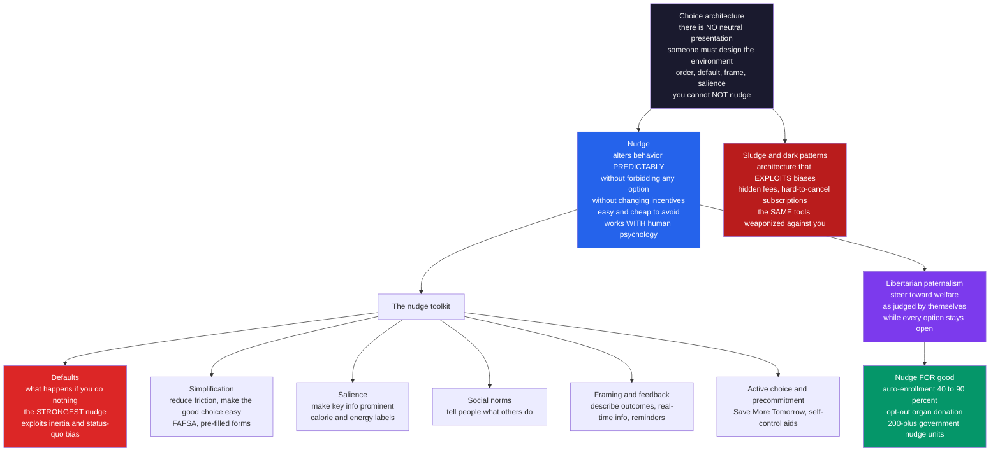

# 🪄 Nudges and Choice Architecture

> [!abstract] TL;DR
> A **nudge** is any aspect of the **choice architecture** — the way options are arranged, ordered, framed, and defaulted — that alters behavior in a **predictable** direction **without forbidding any option or significantly changing economic incentives**, and that is **easy and cheap to avoid** (Thaler & Sunstein, *Nudge*, 2008). The core insight is that **there is no neutral way to present a choice**: someone must design the environment, and because people are boundedly rational, that design inevitably steers decisions — so you may as well design it well. The workhorse is the **default**: because of inertia and status-quo bias, whatever happens if you do nothing is what most people end up with, which is why **automatic retirement enrollment** lifts participation from roughly 40% to over 90% and **opt-out organ donation** produces near-universal consent. The governing philosophy is **libertarian paternalism** — help people by their own lights while keeping every door open. Nudges are cheap, often effective, and have spawned 200-plus government "nudge units," yet they raise real questions about manipulation and paternalism, can be weaponized as **sludge** and dark patterns, and work best *alongside* — not instead of — incentives and regulation.

---

## Intuition

**Analogy:** A school cafeteria cannot force children to eat healthily — and in a free society it should not try. But it *has* to arrange the food somehow, and there is no arrangement-free option. Put the fruit at eye level in a bright bowl by the register and slide the fries to a hard-to-reach back counter, and healthy eating rises measurably. Nothing has been banned, nothing taxed, no one lectured; the fries are still there, still the same price, for anyone who wants them. The *choices* are identical — only their **presentation** changed. That small, freedom-preserving redesign of the environment is a **nudge**.

The deep point hiding in the cafeteria is that **the manager cannot opt out of influencing behavior**. Some layout must exist; whichever one is chosen — even a thoughtless or random one — will steer what thousands of kids eat. The person who designs that environment is a **choice architect**, whether they realize it or not. And because we are not the tireless rational calculators that textbook economics assumed — because we run on inertia, limited attention, and vivid impressions — the way choices are *arranged* (which option is the default, what comes first, what is made salient, how the numbers are framed) quietly determines what millions of people do. Nudging is simply the decision to arrange that environment *deliberately and in the chooser's own interest*, rather than by accident.

---

## How It Works

### The founding definition

Richard Thaler and Cass Sunstein's *Nudge* (2008) gave the concept a precise fence. A **nudge** is "any aspect of the choice architecture that alters people's behavior in a predictable way without forbidding any options or significantly changing their economic incentives." Two clauses do the work. **No option is forbidden** — a nudge is not a ban, a mandate, or a requirement. **Incentives are not significantly changed** — a nudge is not a tax, a subsidy, or a fine. Thaler's one-line test seals it: **"a nudge must be easy and cheap to avoid."** Putting fruit at eye level nudges; outlawing junk food is a mandate; taxing soda changes incentives. The distinguishing move is that nudges work **with** human psychology — inertia, loss aversion, present bias, the pull of social norms — rather than against it, redesigning the *frame* around a choice instead of the choice itself. This is the **applied heart of behavioral economics**: the bridge from *documenting* that people are predictably biased (see [[Heuristics_and_Biases_Overview]]) to *doing something useful* with that fact, and it is the engine of the "behavioral revolution" in public policy.

### Choice architecture: you cannot NOT nudge

The foundational insight is that **there is no neutral presentation of a choice.** Every menu has an order; every form has a default; every price has a frame; every layout makes some things salient and hides others. *Someone* designs that environment — the cafeteria manager, the form designer, the website engineer, the pension administrator — and their design *inevitably* influences decisions, because boundedly rational humans (see [[Bounded_Rationality_and_Satisficing]]) are exquisitely sensitive to these apparently irrelevant details. That designer is the **choice architect**. The critical corollary: **you can't not nudge.** There is always *a* default, *a* frame, *an* order; refusing to think about it does not produce a neutral outcome, it produces an *accidental* one. Since the architecture shapes behavior no matter what, the only real question is whether it is designed thoughtfully or thoughtlessly.

### Libertarian paternalism

The philosophy that licenses deliberate nudging is **libertarian paternalism**, a phrase engineered to sound like an oxymoron and then dissolve one. The **paternalist** half: it is legitimate to *steer* people toward choices that will make **them** better off — not the state, not the firm, but the chooser — by their own lights. The **libertarian** half: this steering must **preserve freedom of choice completely** — all options remain, and opting out must be genuinely easy and low-cost. You help without coercing. The welfare standard is deliberately humble: people should be nudged toward what makes them better off **"as judged by themselves"** — not by the architect's values, but by the chooser's own goals, which they routinely fail to reach through inertia and error. (This standard, and the deep debate around it, is the subject of the planned sibling note *Behavioral Public Policy and Libertarian Paternalism*.)

### The nudge toolkit

The behavioral-policy repertoire is a handful of reliable tools:

1. **Defaults** — the option that takes effect if you do nothing. The **single most powerful nudge**, because it exploits inertia, procrastination, and status-quo bias. *Auto-enrollment*, *opt-out organ donation*, *default green-energy tariffs*.
2. **Simplification and reducing friction** — make the *good* choice the *easy* choice by stripping out steps and paperwork. Simplifying the U.S. **FAFSA** financial-aid form, one-click benefit renewals, pre-filled applications.
3. **Salience and attention** — make key information prominent and hard to miss. **Calorie labels** on menus, **energy-efficiency labels** on appliances, traffic-light nutrition colors.
4. **Social norms** — tell people what others actually do, because we conform. "9 out of 10 people in your area paid their tax on time" (connects to [[Social_Influence_and_Conformity]] and the planned sibling *Social Norms and Conformity*).
5. **Framing and default framing** — describe the same fact in a way that lands (see [[Reference_Dependence_and_Framing]]); "95% fat-free" versus "5% fat."
6. **Feedback** — give real-time information so people can course-correct: home **energy monitors**, the "your usage vs efficient neighbors" utility report.
7. **Reminders and prompts** — text-message nudges for appointments, payments, and medication adherence that fight forgetting.
8. **Active choice** — force a deliberate decision rather than let a default ride ("choose a plan before you continue"), useful when the architect does not want to pick a side.
9. **Precommitment and self-control aids** — let people bind their *future* selves against present bias, the flagship being **Save More Tomorrow** (auto-escalating contributions).

### Defaults: the strongest nudge

Among all the tools, **defaults dominate**, and it is worth seeing exactly why. Because of **inertia, procrastination, and status-quo bias** — the same forces behind [[Loss_Aversion_and_the_Endowment_Effect]], since switching *away* from the default is coded as an active loss-bearing effort — whatever requires **no action** is what most people end up with. The evidence is dramatic and cheap. In retirement saving, switching a 401(k) from **opt-in** (default = not enrolled) to **automatic enrollment / opt-out** (default = enrolled) raises participation from roughly **40% to over 90%**, purely by flipping the default, with **no change in incentives whatsoever** (Madrian & Shea, 2001). In organ donation, **opt-out** ("presumed consent") countries record effective consent near 100%, while otherwise-similar **opt-in** countries languish in the low tens of percent — the famous cross-country contrast in which Austria sits near 100% and Germany near 12% despite near-identical cultures (Johnson & Goldstein, 2003). Because default effects are so large and so cheap, **setting the default well is a profound responsibility**: the architect is, in effect, choosing for the majority who will never actively choose.

### The boundary: nudge, sludge, and manipulation

The same behavioral insight that makes a good default helpful makes a bad one dangerous. **Sludge** (Thaler's own coinage) is choice architecture designed to *hinder* good decisions or to exploit biases **for the architect's benefit rather than the chooser's**: making cancellation deliberately hard, hiding fees until checkout, pre-ticking opt-ins to junk you never wanted, endless friction on rebates and refunds. In the digital world these are the **dark patterns** of manipulative UX. The definitional fence — *easy and cheap to avoid*, *in the chooser's own interest* — is exactly what sludge violates. This is the field's double-edged sword, and it forces an ethical question addressed below: when does steering respect autonomy, and when does it cross into covert manipulation?



---

## Key Concepts

### Secondary (explain it to a curious beginner)
- **Nudge:** a small change in *how* choices are offered that gently steers what people pick, while leaving every option available and easy to refuse.
- **Choice architecture:** the "arrangement" of a decision — the default, the order, the wording. There is always *some* arrangement, so it always influences you.
- **Default:** what you get if you do nothing. Most people go with it, so it is the most powerful nudge.
- **Libertarian paternalism:** helping people make better choices *for themselves* without forcing them — you can always say no.
- **Sludge:** the evil twin of a nudge — sneaky design that makes the *bad* choice easy and the good one hard (like a subscription that is impossible to cancel).

### Undergraduate (needs some economics background)
- **The definitional fence:** a nudge forbids no option and does not "significantly change economic incentives," which cleanly separates it from **mandates/bans** (remove options) and **fiscal tools** (taxes/subsidies that change payoffs). Test: is it *easy and cheap to avoid*?
- **Why defaults are so strong:** they harness **inertia**, **procrastination**, **status-quo bias**, and the fact that the default becomes the **reference point** against which switching is coded as a loss (see [[Loss_Aversion_and_the_Endowment_Effect]]). Empirically, participation swings are enormous for a change that alters no payoff.
- **The "as-judged-by-themselves" welfare standard:** libertarian paternalism justifies steering only toward outcomes the *chooser* would endorse on reflection — not the architect's preferences — which is meant to bound paternalism, though critics note the standard is hard to verify.
- **EAST / behavioral design:** the Behavioural Insights Team's practical heuristic — make the desired behavior **Easy, Attractive, Social, and Timely** — a checklist version of the toolkit above.
- **Nudge units and RCTs:** governments institutionalized this as testable policy, running **randomized controlled trials** (field experiments) on tax letters, benefit forms, and enrollment defaults rather than relying on intuition.

### Graduate (system-level and contested)
- **Anti-anti-paternalism and the impossibility of neutrality:** the strongest argument for libertarian paternalism is *negative* — since a choice architecture must exist and *will* affect behavior, the "do nothing / stay neutral" position is incoherent; the real choice is between *deliberate* and *arbitrary* architecture. Critics counter that this proves too much and licenses more intervention than intended.
- **Welfare inference under constructed preferences:** if preferences are context-dependent and constructed on the spot (the deep problem behind [[Reference_Dependence_and_Framing]]), then "as judged by themselves" is under-determined — *which* self, in *which* frame, is the authoritative judge? This is the philosophical soft spot of the whole program.
- **Effect sizes, heterogeneity, and the "nudge gap":** meta-analyses find defaults are genuinely powerful but many other nudges have **small average effects** that sometimes **fade** or **fail to replicate**, and effects are **heterogeneous** — nudges can even *widen* inequality if the already-advantaged respond more. Publication-bias corrections have shrunk headline estimates.
- **Nudge vs incentive vs mandate — the policy portfolio:** formally, nudges are cheapest and least coercive but often lowest-ceiling; taxes/subsidies change equilibrium prices; mandates guarantee compliance but remove autonomy. The mature view treats them as **complements**, choosing the least-restrictive tool that achieves the goal (links to [[Externalities_and_Pigouvian_Tax]], [[Market_Failures]], [[Public_Goods]]).
- **Transparency and the publicity principle:** Sunstein's defense against the manipulation charge is that a legitimate nudge must survive being made **public** — the architect should be willing to defend it openly to those nudged. Nudges that only work *because* they are hidden fail this test and shade into manipulation and sludge.

---

## Python Demo

```python
import numpy as np
import matplotlib
matplotlib.use("Agg")
import matplotlib.pyplot as plt

# ----------------------------------------------------------------------
# THE POWER OF DEFAULTS -- the strongest nudge, changing NO incentives.
#
#  Panel 1  DEFAULT effect (Monte Carlo): retirement-plan enrollment under
#           OPT-IN (default = not enrolled) vs OPT-OUT / auto-enrollment
#           (default = enrolled). Participation jumps ~40% -> ~90% purely
#           from flipping the default (Madrian & Shea 2001).
#  Panel 2  ORGAN DONATION: opt-in vs opt-out cross-country contrast
#           (Johnson & Goldstein 2003) -- near-100% consent vs low-teens.
#  Panel 3  SAVE MORE TOMORROW: an auto-escalating contribution default
#           raises the savings RATE over time vs a flat default.
#  Panel 4  ...and the resulting retirement WEALTH, compounded over a career.
# ----------------------------------------------------------------------

rng = np.random.default_rng(7)

# ---------- Panel 1: the DEFAULT effect via inertia ----------
# Model: each worker (i) truly WANTS to enroll with prob w (most do, on
# reflection), and (ii) is ACTIVE -- willing to overcome the friction of
# changing away from the default -- with prob a. Inactive workers simply
# keep whatever the default is. Incentives are IDENTICAL in both worlds.
N = 200_000
w = 0.85          # fraction who, if they act, want to be enrolled
a = 0.45          # fraction who actually take action (the rest = inertia)

wants   = rng.random(N) < w
active  = rng.random(N) < a

def participation(default_enrolled):
    # active people follow their true preference; inactive keep the default
    choice = np.where(active, wants, default_enrolled)
    return choice.mean()

opt_in  = participation(default_enrolled=False)   # default = NOT enrolled
opt_out = participation(default_enrolled=True)     # default = enrolled

# ---------- Panel 2: organ-donation defaults (Johnson & Goldstein 2003) ----------
optin_countries  = {"Denmark": 4.25, "Netherlands": 27.5, "UK": 17.17,
                    "Germany": 12.0}
optout_countries = {"Austria": 99.98, "Belgium": 98.0, "France": 99.91,
                    "Hungary": 99.97, "Sweden": 85.9}

# ---------- Panels 3-4: Save More Tomorrow (auto-escalation) ----------
years  = np.arange(0, 40)
salary = 50_000.0       # flat salary for clarity
r      = 0.06           # annual investment return

flat_rate  = np.full_like(years, 3.0, dtype=float)          # stuck at 3%
smart_rate  = np.minimum(3.0 + 2.0 * years, 15.0)           # +2 pts/yr, cap 15%

def accumulate(rate_pct):
    wealth, path = 0.0, []
    for rate in rate_pct:
        wealth = wealth * (1 + r) + salary * rate / 100.0
        path.append(wealth)
    return np.array(path)

flat_wealth  = accumulate(flat_rate)
smart_wealth = accumulate(smart_rate)

print("=" * 60)
print("THE POWER OF DEFAULTS  (no incentives changed)")
print("=" * 60)
print(f"Retirement enrollment  opt-in  (default OFF): {opt_in:6.1%}")
print(f"Retirement enrollment  opt-out (default ON) : {opt_out:6.1%}")
print(f"  -> flipping ONE default moves participation by "
      f"{opt_out - opt_in:.0%}")
print("-" * 60)
print(f"Save More Tomorrow final wealth  flat 3% : ${flat_wealth[-1]:,.0f}")
print(f"Save More Tomorrow final wealth  auto-esc: ${smart_wealth[-1]:,.0f}")
print(f"  -> auto-escalation multiplies nest egg by "
      f"{smart_wealth[-1]/flat_wealth[-1]:.1f}x")

# ------------------------------- FIGURE -------------------------------
fig, ax = plt.subplots(2, 2, figsize=(14, 10))
fig.suptitle("The Power of Defaults: nudging behavior without changing incentives",
             fontsize=14, fontweight="bold")

# Panel 1: opt-in vs opt-out enrollment
bars = ax[0, 0].bar(["OPT-IN\n(default: not enrolled)", "OPT-OUT\n(auto-enrollment)"],
                    [opt_in * 100, opt_out * 100],
                    color=["#dc2626", "#059669"], edgecolor="black")
ax[0, 0].set_ylim(0, 105)
ax[0, 0].set_ylabel("participation (%)")
ax[0, 0].set_title("Default effect: retirement enrollment\n(same plan, same incentives)")
for b, val in zip(bars, [opt_in, opt_out]):
    ax[0, 0].text(b.get_x() + b.get_width() / 2, val * 100 + 2,
                  f"{val:.0%}", ha="center", fontweight="bold")

# Panel 2: organ donation opt-in vs opt-out
names  = list(optin_countries) + list(optout_countries)
rates  = list(optin_countries.values()) + list(optout_countries.values())
colors = ["#dc2626"] * len(optin_countries) + ["#059669"] * len(optout_countries)
ax[0, 1].bar(names, rates, color=colors, edgecolor="black")
ax[0, 1].set_ylim(0, 108)
ax[0, 1].set_ylabel("effective consent to donate (%)")
ax[0, 1].set_title("Organ donation: opt-IN (red) vs opt-OUT (green)\n"
                   "Johnson & Goldstein 2003")
ax[0, 1].tick_params(axis="x", rotation=40, labelsize=8)
ax[0, 1].axhline(50, color="gray", ls=":", lw=1)

# Panel 3: savings-rate trajectory
ax[1, 0].plot(years, flat_rate, color="#dc2626", lw=2.5,
              label="flat default (stuck at 3%)")
ax[1, 0].plot(years, smart_rate, color="#059669", lw=2.5,
              label="Save More Tomorrow (auto-escalate to 15%)")
ax[1, 0].fill_between(years, flat_rate, smart_rate, color="#bbf7d0", alpha=0.5)
ax[1, 0].set_xlabel("years of tenure"); ax[1, 0].set_ylabel("savings rate (% of pay)")
ax[1, 0].set_title("Save More Tomorrow: escalating DEFAULT\nlifts the savings rate")
ax[1, 0].legend(fontsize=9); ax[1, 0].grid(alpha=0.25)

# Panel 4: resulting wealth
ax[1, 1].plot(years, flat_wealth / 1000, color="#dc2626", lw=2.5,
              label=f"flat 3%  ->  ${flat_wealth[-1]/1000:.0f}k")
ax[1, 1].plot(years, smart_wealth / 1000, color="#059669", lw=2.5,
              label=f"auto-escalate  ->  ${smart_wealth[-1]/1000:.0f}k")
ax[1, 1].fill_between(years, flat_wealth / 1000, smart_wealth / 1000,
                      color="#bbf7d0", alpha=0.5)
ax[1, 1].set_xlabel("years"); ax[1, 1].set_ylabel("retirement wealth ($000s)")
ax[1, 1].set_title("...and the compounded nest egg\n(6% annual return)")
ax[1, 1].legend(fontsize=9, loc="upper left"); ax[1, 1].grid(alpha=0.25)

plt.tight_layout(rect=[0, 0, 1, 0.95])
plt.savefig("nudges_and_choice_architecture.png", dpi=110, bbox_inches="tight")
plt.show()
```

**What the demo shows:**

- **Panel 1 (the default effect)** runs a Monte Carlo of workers who mostly *want* to save but only sometimes take action. Flipping the default from *not-enrolled* (opt-in) to *auto-enrolled* (opt-out) swings participation from roughly **40% to over 90%** — a huge behavioral change from a policy that alters **no incentive at all**, just what happens to the majority who never actively choose.
- **Panel 2 (organ donation)** hard-codes the classic Johnson–Goldstein cross-country data. Opt-in countries (red) cluster in the low tens of percent; opt-out ("presumed consent") countries (green) sit near 100%. The cultural distance between Germany and Austria is tiny; the distance in their donor rates is enormous — and it is almost entirely the default.
- **Panel 3 (Save More Tomorrow)** contrasts a flat 3% default with an auto-escalating one that ratchets the contribution rate up by 2 points a year until it caps at 15%. Because the increases are the *default* (applied automatically at each raise), inertia now works *for* the saver instead of against them.
- **Panel 4 (the payoff)** compounds those rates over a 40-year career at 6%. The escalating default produces a multiple-times-larger nest egg — the quiet, cumulative power of designing the default with human psychology in mind.

---

## Real-World Applications

> **Retirement saving.** The flagship success. **Automatic enrollment** (Madrian & Shea, 2001) and **Save More Tomorrow** (Thaler & Benartzi, 2004) moved participation and contribution rates dramatically by changing defaults, not incentives. Policy followed: the U.S. **Pension Protection Act (2006)** encouraged auto-enrollment and auto-escalation, and the UK's **auto-enrolment** rollout (from 2012) brought roughly ten million new savers into workplace pensions with opt-out rates under 10%. (The retirement-and-health application is the focus of the planned sibling *Behavioral Economics in Health and Retirement*.)

> **Organ donation.** Opt-out "presumed consent" defaults are associated with far higher effective consent than opt-in registries — the single most cited demonstration that a default is not a neutral administrative detail but a life-and-death policy lever.

> **Government "nudge units."** The UK **Behavioural Insights Team** (the "Nudge Unit," 2010) and the U.S. **Social and Behavioral Sciences Team** (SBST, 2014) institutionalized behavioral policy, and **200-plus** such units now operate worldwide, running randomized trials on tax-payment letters ("most people pay on time"), benefit-form simplification, court-date reminders, and default green-energy tariffs. This is the *institutionalization* of behavioral policy.

> **Public health and take-up.** **Calorie labels** (salience), **text-message reminders** for vaccinations and appointments, **simplified** FAFSA and benefit forms that raised take-up among eligible families, and cafeteria placement that puts the healthy option first — all classic nudges that make the good choice easy, salient, and timely.

> **Consumer finance and energy.** Default enrollment in **green tariffs** flips the majority to renewable electricity; **home energy reports** comparing your usage to efficient neighbors (social norm + feedback) cut consumption a few percent at scale. The **finance-focused companion note** develops the investing and savings applications in depth: [[Finance/08_Behavioral_Finance/Nudges_and_Choice_Architecture|Nudges and Choice Architecture (Finance)]].

> **Sludge in the wild (the dark side).** The same tools are routinely turned *against* consumers: subscriptions that are one click to start and a phone-tree ordeal to cancel, pre-ticked add-ons, drip-priced "resort fees" revealed only at checkout, and app designs engineered for compulsive use. Regulators have begun to respond — the U.S. FTC's "**click-to-cancel**" rulemaking and the EU's rules against **dark patterns** are attempts to *remove sludge* and police manipulative choice architecture.

---

## Common Pitfalls

- **Confusing nudges with mandates or incentives.** A nudge forbids no option and does not significantly change payoffs. A soda tax, a smoking ban, and a subsidy are *not* nudges — they are fiscal or regulatory tools. The test is Thaler's: **easy and cheap to avoid**. Mislabeling coercion as "just a nudge" is both analytically wrong and a rhetorical dodge.
- **Believing nudges are a silver bullet.** Outside the standout case of defaults, average effect sizes are often **small**, sometimes **fade**, and frequently **shrink or fail to replicate** at scale. Nudges do not fix structural problems (poverty, monopoly, bad prices) and can **distract** from bigger interventions. Treat them as a *complement* to incentives and regulation, not a substitute.
- **Ignoring heterogeneity — nudges may not help those who need help most.** Effects vary across people, and the already-organized often respond more strongly, so a poorly targeted nudge can *widen* the very gaps it was meant to close. Always ask *who* moves.
- **Forgetting you are always nudging.** Declining to design the choice architecture does not yield a neutral outcome; it yields an *arbitrary* one, with some accidental default and frame still steering behavior. "We don't nudge here" is usually a false claim.
- **Crossing into manipulation / building sludge.** A nudge that only works because it is **hidden** — that could not survive being disclosed to the people it steers — has crossed into manipulation. Apply the **publicity/transparency principle**: would you defend this architecture openly to those affected? If cancellation is deliberately hard or fees are concealed, you have built sludge, not a nudge.
- **Setting a bad default carelessly.** Because most people accept the default, choosing it is a *serious* welfare decision, not a formality. A default aimed at the firm's benefit (auto-renew, auto-upsell) rather than the chooser's is where good intentions curdle into exploitation.

---

## Related Concepts

- [[Behavioral_Economics_Overview]] — the parent map; nudges are the field's bridge from documented biases to applied policy.
- [[Loss_Aversion_and_the_Endowment_Effect]] — status-quo bias and the reference-point role of the default are *why* defaults are the strongest nudge.
- [[Reference_Dependence_and_Framing]] — framing is a core nudge tool; the same fact, differently described, steers choice.
- [[Heuristics_and_Biases_Overview]] — the catalog of predictable biases that make choice architecture bite in the first place.
- [[Bounded_Rationality_and_Satisficing]] — because cognition is limited, people accept defaults and salient options rather than optimize.
- [[Dual_Process_Theory_System_1_and_2]] — nudges mostly speak to fast, automatic System 1, which is why they work with (not against) intuition.
- [[Mental_Accounting]] — the psychology behind "free shipping," partitioned budgets, and many pricing nudges.
- [[Prospect_Theory]] — the value function whose kink and reference dependence underwrite loss-averse resistance to switching.
- [[Behavioral_Economics_Psychology]] — Psychology's applied treatment of nudges and the EAST framework.
- [[Social_Influence_and_Conformity]] — the mechanism behind social-norm nudges ("most people already did X").
- [[Attitudes_and_Persuasion]] — the persuasion literature that borders, and sometimes blurs into, nudging and manipulation.
- [[Cognitive_Biases]] — the systematic reasoning errors that choice architecture exploits or corrects.
- [[Problem_Solving_and_Decision_Making]] — how people actually reason toward choices under friction and limited attention.
- [[Judgment_and_Decision_Making]] — Cognitive Science's account of the heuristics and biases that nudges are built around.
- [[Dual_Process_Theory]] — the cognitive-science version of the System 1 / System 2 machinery nudges target.
- [[Utility_Theory]] — the rational benchmark against which "as judged by themselves" welfare is measured.
- [[Market_Failures]] — internalities (self-control failures) are the market failure many nudges are meant to address.
- [[Externalities_and_Pigouvian_Tax]] — the incentive-based alternative to nudging; the two are complements in the policy portfolio.
- [[Public_Goods]] — nudges (reminders, defaults, social norms) are a low-cost tool for raising contribution and compliance.
- [[Finance/08_Behavioral_Finance/Nudges_and_Choice_Architecture|Nudges and Choice Architecture (Finance)]] — the finance-focused companion; investing, savings, and 401(k) design in depth.

*Planned companion notes in this Behavioral Economics section:* **Present_Bias_and_Self_Control** (the discounting engine behind Save More Tomorrow), **Social_Norms_and_Conformity** (the mechanism of norm-based nudges), **Behavioral_Public_Policy_and_Libertarian_Paternalism** (the philosophy and ethics in full), and **Behavioral_Economics_in_Health_and_Retirement** (the applied home of auto-enrollment and health nudges).

---

## Review Questions

### Secondary
1. A cafeteria moves the fruit to eye level and the fries to a hard-to-reach corner, and kids eat more fruit. Nothing was banned or made more expensive. Why does this count as a "nudge," and why is it not the same as forcing kids to eat healthily?
2. Two companies offer the *exact same* retirement plan. Company A asks new hires to sign up; Company B signs them up automatically but lets them quit anytime. Which will have more savers, and why — even though no one is forced and the money works the same in both?
3. What is "sludge," and how is it the opposite of a helpful nudge? Give one everyday example.

### Undergraduate
1. State Thaler & Sunstein's definition of a nudge precisely, then classify each of the following and justify: a soda tax; automatic 401(k) enrollment with opt-out; a ban on trans fats; a calorie label on a menu; a pre-ticked "add travel insurance" box. Use the "easy and cheap to avoid" test.
2. Explain *why* defaults are the most powerful item in the nudge toolkit. Reference inertia, status-quo bias, and the default-as-reference-point idea, and connect it to loss aversion. Why does auto-enrollment move participation so much more than a persuasive brochure?
3. Define **libertarian paternalism** and the **"as judged by themselves"** welfare standard. How does this philosophy try to reconcile steering people with respecting their freedom, and what is one situation where the standard is hard to apply?

### Graduate
1. Critics argue that nudging is either ineffective (small, fading effects) or unethical (covert manipulation). Construct the strongest version of *each* critique, then give the defenders' best replies — the "you can't not nudge" impossibility-of-neutrality argument and Sunstein's transparency/publicity principle. Where do you come down, and why?
2. When preferences are *constructed* and frame-dependent, the "as-judged-by-themselves" standard is under-determined: *which* self, in *which* frame, is the authoritative judge of the person's welfare? Explain the problem, connect it to reference dependence and framing, and discuss whether it fatally undermines libertarian paternalism or merely bounds it.
3. A policymaker must reduce a harmful behavior and can use a nudge (default/reminder), an incentive (tax/subsidy), or a mandate (ban). Lay out the trade-offs — cost, coercion, effect ceiling, heterogeneity, distributional impact — and argue for when nudges should *complement* rather than *replace* incentives and regulation. Use organ donation or retirement saving as a worked example.

---

## Sources

- [Thaler, R. H. & Sunstein, C. R. (2008, rev. 2021). *Nudge: Improving Decisions About Health, Wealth, and Happiness*. Yale University Press / Penguin](https://yalebooks.yale.edu/book/9780300122237/nudge/)
- [Madrian, B. C. & Shea, D. F. (2001). "The Power of Suggestion: Inertia in 401(k) Participation and Savings Behavior." *Quarterly Journal of Economics* 116(4), 1149–1187](https://doi.org/10.1162/003355301753265543)
- [Johnson, E. J. & Goldstein, D. (2003). "Do Defaults Save Lives?" *Science* 302(5649), 1338–1339](https://doi.org/10.1126/science.1091721)
- [Thaler, R. H. & Benartzi, S. (2004). "Save More Tomorrow: Using Behavioral Economics to Increase Employee Saving." *Journal of Political Economy* 112(S1), S164–S187](https://doi.org/10.1086/380085)
- [Thaler, R. H. (2018). "Nudge, not sludge." *Science* 361(6401), 431](https://doi.org/10.1126/science.aau9241)
- [Sunstein, C. R. (2015). "The Ethics of Nudging." *Yale Journal on Regulation* 32(2), 413–450](https://digitalcommons.law.yale.edu/yjreg/vol32/iss2/6/)

---

#behavioral-economics #nudge #choice-architecture #defaults #libertarian-paternalism
