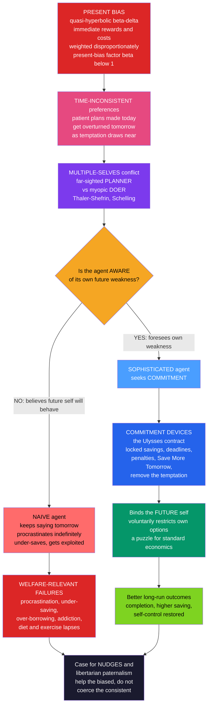

# ⛵ Present Bias and Self-Control

> [!abstract] TL;DR
> **Self-control problems** are the gap between what people **plan** and what they actually **do** when temptation arrives — the dieter who binges, the saver who splurges, the student who intends to study and instead procrastinates. Their mathematical root is **present bias**: people discount the future **quasi-hyperbolically** (the "beta-delta" model, with a present-bias factor $\beta<1$), so an immediate reward or cost is weighted **disproportionately**, and today's patient plan gets overturned tomorrow as temptation draws near — **time-inconsistent** preferences. It is useful to picture the conflict as a battle between a far-sighted **planner** and a myopic **doer** inside one person (Thaler-Shefrin), or a sequence of "temporal selves" (Schelling). The pivotal distinction (O'Donoghue-Rabin) is between **sophisticated** agents, who *know* they are present-biased and buy **commitment devices** (locked savings, deadlines, penalties, the "Ulysses contract") to bind their future selves, and **naive** agents, who wrongly believe they will behave optimally tomorrow and so procrastinate and under-save. Understanding this illuminates the retirement-savings crisis, addiction, debt, and productivity — and raises a deep welfare question: when a present-biased choice is regretted by the same person's future self, *whose* welfare should policy serve?

---

## Intuition

**Analogy:** Ulysses knew the Sirens' song would make him steer his ship onto the rocks — so before he came within earshot he had his crew tie him to the mast and plug their own ears with wax. He was binding his **future self** against a temptation he *knew* he could not resist in the moment. That is the essence of self-control: a battle between a far-sighted **planner**, who wants to reach Ithaca, and a myopic **doer**, who in the moment will do anything to reach the Sirens — both living inside one person. We do the same, less heroically, every day: we set the alarm across the room so we have to get up to silence it, freeze the credit card in a block of ice, enroll in a savings plan we can't easily raid, install an app that locks us out of social media. We build "masts" — deliberate restrictions on our own future freedom — to protect our future selves from our present selves' predictable weakness.

The striking thing is *why* we build them. A perfectly rational agent would never pay to shrink their own future menu of options — more choices can only help. Yet real people pay for locks, deadlines, and penalties precisely to have **fewer** options later. That puzzle, invisible to standard economics, is the natural signature of a mind at war with its own future.

---

## How It Works

### The root: present bias and time inconsistency

A **time-consistent** agent discounts the future **exponentially**: a delay of one week shrinks a reward's value by a constant factor $\delta$ regardless of when the week falls. Such an agent's plans never unravel — if today she prefers "study Tuesday over party Monday," she will still prefer it *when Monday arrives*, because both rewards moved one step closer by the same proportional amount.

Real people instead show **present bias**: the *immediate* moment carries a special, disproportionate weight. The workhorse model is **quasi-hyperbolic** (or "beta-delta") discounting (Phelps-Pollak, Laibson): the weight placed *now* on a payoff $k$ periods away is

$$ D(k) = \begin{cases} 1 & k = 0 \\ \beta\,\delta^{k} & k \ge 1 \end{cases}, \qquad 0 < \beta < 1 . $$

The single extra parameter $\beta$ is the **present-bias factor**. It creates a sharp discontinuity between "now" ($k=0$, full weight) and "not-now" ($k\ge 1$, knocked down by $\beta$). Everything one week away and everything one *year* away is discounted *relative to today* by the same lump $\beta$ — so from today's vantage the far future looks patient and flat, but as any future date becomes **today**, its $\beta$ penalty vanishes and it suddenly looms enormous. That asymmetry is the entire engine. It produces **preference reversals**: you sincerely plan on Sunday to skip dessert all week, but when the cake is in front of you on Wednesday, the *immediate* pleasure loses its $\beta$ discount and overrides the plan. Your patient long-run self and your impatient present self literally rank the same two options differently. (The continuous cousin is Ainslie's **hyperbolic** discounting, $D(k)=1/(1+k k)$, whose steeply-then-shallowly declining curves cross, giving the same reversals.)

### The framing: multiple selves and the planner-doer conflict

Because preferences flip over time, it is fruitful to model a person as **several agents**. Thomas Schelling described a sequence of **temporal selves** with conflicting interests, each in control only for its own moment. Thaler and Shefrin gave a two-system version — the **planner-doer model** — an intrapersonal *principal-agent* problem: a far-sighted **planner** (long-run interests) must govern a sequence of myopic **doers** (each craving immediate gratification), using the only tools it has — **rules** (bright lines like "never gamble"), **willpower** (costly effortful override), and altered **incentives** (commitment). Self-control is precisely the management of this internal struggle. Neuroeconomics gives it a substrate: dissociable valuation systems, with limbic/striatal circuits driving immediate reward and prefrontal circuits supporting patient, executive control.

### The pivotal distinction: naive vs sophisticated

How a present-biased person copes depends on **whether they know they are biased** (O'Donoghue-Rabin):

- A **sophisticated** agent *correctly predicts* that their future selves will also be present-biased. Foreseeing their own weakness, they reason "if I leave it to tomorrow, tomorrow-me will cave too," and therefore act now or, better, **restrict their future options** with a commitment device.
- A **naive** agent believes their future selves will be **patient** (act with $\beta=1$). They think "I'll definitely do it optimally tomorrow," so waiting feels costless — and then tomorrow the same illusion repeats. Naifs procrastinate longer, under-save more, and are the natural prey of firms selling gym memberships, credit, and "free trials that auto-renew."

Most people are **partially naive** — dimly aware of their weakness but underestimating it. Awareness is not a minor detail: it flips behavior from passive procrastination to active self-binding.

### The symptoms and the cure

Present bias with **immediate costs** produces **procrastination**: the effort cost of an unpleasant task hits *now* at full weight while its reward is in the discounted future, so "do it later" always looks better — and a naif defers indefinitely. (The mirror case, immediate *rewards*, can cause the opposite — over-eager consumption, or even **pre-crastination**, doing something too early just to discharge it.) The **cure** a sophisticate reaches for is the **commitment device**: locked retirement accounts, "Save More Tomorrow," Christmas savings clubs, deadlines with penalties, deposit-contract apps (StickK, Beeminder), removing the ice cream from the freezer. Each *voluntarily shrinks the future choice set* so the future doer cannot betray the present planner — the Ulysses contract, generalized.



---

## Key Concepts

### Secondary (intuition level)
- **We do the opposite of what we planned.** We swear off dessert, then eat the cake; we plan to save, then splurge; we mean to study, then scroll. The plan was sincere — the moment just wins.
- **The pull of *now*.** A treat today feels far more urgent than the same treat next week. That extra tug on the present is "present bias," and it is why our patient plans keep losing.
- **Tie yourself to the mast.** Because we know the moment will win, we rig the game in advance: alarm across the room, no junk food in the house, savings that auto-deduct. These are commitment devices.
- **Knowing you'll cave is half the battle.** People who *admit* they'll be tempted set up defenses; people who think "I'll be fine tomorrow" keep putting things off and lose.

### Undergraduate (formal level)
- **Exponential vs quasi-hyperbolic discounting.** Exponential $D(k)=\delta^{k}$ is **dynamically consistent** (no preference reversals). Quasi-hyperbolic $D(k)=\beta\delta^{k}$ for $k\ge1$, $D(0)=1$, with $\beta<1$, injects a fixed present-bias wedge between now and later, producing reversals. $\beta$ measures the *degree* of self-control problem; $\delta$ is ordinary long-run patience.
- **Preference reversal, precisely.** Compare a smaller-sooner reward $s$ at time $t$ with a larger-later reward $\ell$ at $t+1$. Viewed from far away (both future), the agent prefers $\ell$ iff $\beta\delta^{k}s < \beta\delta^{k+1}\ell$. But viewed *at* time $t$ (the sooner reward now available), the comparison becomes $s$ vs $\beta\delta\ell$ — the extra $\beta$ on the delayed option can flip the choice to $s$. Same options, reversed ranking, purely from the passage of time.
- **Naif vs sophisticate.** A **naif** predicts future behavior with $\hat\beta=1$ (thinks future self is patient); a **sophisticate** predicts with $\hat\beta=\beta$ (correct). The intrapersonal decision is a **game between selves** solved by backward induction; naif and sophisticate solve *different* games because they hold different beliefs about the opponents (their own future selves). **Partial naivete** ($\beta<\hat\beta<1$) interpolates.
- **Commitment devices.** A commitment device removes or penalizes a future option so the future self cannot deviate. Because it shrinks the menu, a time-consistent agent would (weakly) reject it; a sophisticated present-biased agent *demands* it. Revealed demand for commitment is thus a behavioral fingerprint of sophistication.

### Graduate (frontier level)
- **The intrapersonal game and its equilibria.** With sophisticated selves, the person is a sequence of players in a dynamic game; behavior is a **subgame-perfect equilibrium** among selves. Multiplicity, punishment strategies ("personal rules" sustained like repeated-game cooperation, Ainslie/Benabou-Tirole), and self-signaling arise. O'Donoghue-Rabin show **immediate costs** make sophistication *help* (it curbs procrastination) while **immediate rewards** can make sophistication *hurt* (a sophisticate, knowing the treat won't last, grabs it sooner — "unraveling").
- **Welfare is genuinely ambiguous.** With time-inconsistent preferences there is **no single utility function** to maximize — the period-0 self and the period-$t$ self disagree. Should the planner adopt the **long-run criterion** (the $\delta$-only, $\beta=1$ self), a "multi-self Pareto" criterion, or respect each self? This is unsettled; it is the normative fault line beneath every self-control intervention.
- **Sophisticated exploitation.** Because naifs mispredict their own behavior, profit-maximizing firms design contracts to exploit them — teaser rates, automatic renewals, gym pricing where members over-predict attendance (DellaVigna-Malmendier). Optimal contracting with present-biased consumers can *require* regulation.
- **Estimating and using $\beta$.** Field estimates put $\beta$ around $0.7$-$0.9$ for many decisions; structural work (Laibson et al.) recovers $\beta,\delta$ jointly from savings and credit data. **Libertarian/asymmetric paternalism** (Camerer, Thaler-Sunstein) then designs interventions that help the $\beta<1$ majority while imposing negligible cost on the $\beta=1$ minority — the formal case for defaults and nudges.

---

## Python Demo

```python
import numpy as np
import matplotlib
matplotlib.use("Agg")
import matplotlib.pyplot as plt

# ----------------------------------------------------------------------
# PRESENT BIAS AND SELF-CONTROL: procrastination and commitment devices.
#
# A one-time unpleasant task (e.g. "finish the report") must be done once
# by a deadline. The EFFORT cost of doing it is IMMEDIATE and RISES the
# longer you wait (rushing near the deadline is painful); the reward v is
# realized later and is the same whenever you finish. We use delta = 1 to
# isolate PRESENT BIAS (beta < 1). Because the immediate cost keeps its
# full weight while the reward is knocked down by beta, "do it later"
# always looks tempting -> procrastination.
#
#   (a) Completion week vs present bias for TIME-CONSISTENT, SOPHISTICATED,
#       and NAIVE agents: the naif procrastinates far worse than the
#       sophisticate who foresees the weakness.
#   (b) Procrastination dynamics: week by week, the naif's "do now" payoff
#       vs "wait" payoff -> "wait" wins every week ("always tomorrow").
#   (c) Commitment device: a self-imposed early DEADLINE rescues the naif,
#       showing why a present-biased person VOLUNTARILY restricts options.
# ----------------------------------------------------------------------

costs = np.array([3, 4, 6, 9, 14, 21, 32, 48], dtype=float)  # rising effort cost/week
T = len(costs)                # 8 weeks; index 0 = week 1
v = 50.0                      # reward, realized later, same whenever finished

def week_time_consistent(c):
    # beta = 1: minimize cost (reward is fixed) -> finish at the cheapest week.
    return int(np.argmin(c))

def week_naive(c, beta, deadline=None):
    # Naif believes NEXT week's self will finish (thinks future self patient),
    # so 'wait' looks like finishing next week at cost c[s+1], discounted by beta.
    # Acts now at first week where do-now payoff >= wait payoff; else forced at DL.
    dl = (T - 1) if deadline is None else deadline
    for s in range(dl):
        do_now = beta * v - c[s]              # immediate cost at FULL weight
        wait   = beta * v - beta * c[s + 1]   # future cost knocked down by beta
        if do_now >= wait:                    # equivalently c[s] <= beta*c[s+1]
            return s
    return dl                                 # never acted -> forced at deadline

def week_sophisticated(c, beta, deadline=None):
    # Sophisticate foresees that future selves are ALSO present-biased.
    # Backward induction: 'wait' really means finishing at the TRUE future
    # completion week w, so do now iff c[s] <= beta*c[w].
    dl = (T - 1) if deadline is None else deadline
    done = np.zeros(T, dtype=int)
    done[dl] = dl                             # forced to finish at the deadline
    for s in range(dl - 1, -1, -1):
        w = done[s + 1]
        done[s] = s if c[s] <= beta * c[w] else w
    return int(done[0])

# ---- (a) completion week vs present bias beta ------------------------
betas = np.linspace(0.30, 1.0, 71)
wk_tc   = np.array([week_time_consistent(costs) + 1        for b in betas])
wk_naiv = np.array([week_naive(costs, b) + 1               for b in betas])
wk_soph = np.array([week_sophisticated(costs, b) + 1       for b in betas])

# ---- (b) naive procrastination dynamics at a fixed strong bias -------
beta0 = 0.5
do_now_path = beta0 * v - costs[:-1]                 # weeks 1..7
wait_path   = beta0 * v - beta0 * costs[1:]          # believed next-week payoff
weeks_bd    = np.arange(1, T)                        # 1..7

# ---- (c) commitment device: self-imposed deadline rescues the naif ---
D = 2                                                # self-imposed deadline = week 3 (index 2)
w_tc      = week_time_consistent(costs)
w_soph    = week_sophisticated(costs, beta0)
w_naive   = week_naive(costs, beta0)                 # no commitment
w_commit  = week_naive(costs, beta0, deadline=D)     # naif + self-imposed deadline
welfare = lambda wk: v - costs[wk]                   # long-run (beta=1) realized welfare

labels_c = ["Time-consistent\n(optimum)", "Sophisticated\n(self-aware)",
            "Naive + commitment\n(self-imposed deadline)", "Naive\n(no commitment)"]
weeks_c  = [w_tc, w_soph, w_commit, w_naive]
welf_c   = [welfare(w) for w in weeks_c]
colors_c = ["#059669", "#4a9eff", "#7ed321", "#dc2626"]

print("Completion week (beta = 0.5):")
print(f"  time-consistent : week {w_tc+1}  cost {costs[w_tc]:5.1f}  welfare {welfare(w_tc):6.1f}")
print(f"  sophisticated   : week {w_soph+1}  cost {costs[w_soph]:5.1f}  welfare {welfare(w_soph):6.1f}")
print(f"  naive           : week {w_naive+1}  cost {costs[w_naive]:5.1f}  welfare {welfare(w_naive):6.1f}")
print(f"  naive+commitment: week {w_commit+1}  cost {costs[w_commit]:5.1f}  welfare {welfare(w_commit):6.1f}")
gain = welfare(w_commit) - welfare(w_naive)
print(f"\nCommitment raises the naif's long-run welfare by {gain:.1f} "
      f"-> a sophisticate would PAY up to {gain:.1f} for the device.")

# ------------------------------- FIGURE -------------------------------
fig, (ax1, ax2, ax3) = plt.subplots(1, 3, figsize=(17, 5.2))
fig.suptitle("Present Bias and Self-Control: procrastination and commitment",
             fontsize=13, fontweight="bold")

# (a) completion week vs beta
ax1.plot(betas, wk_tc,   color="#059669", lw=2.6, label="time-consistent (beta=1 self)")
ax1.plot(betas, wk_soph, color="#4a9eff", lw=2.6, label="sophisticated (self-aware)")
ax1.plot(betas, wk_naiv, color="#dc2626", lw=2.6, label="naive (thinks 'tomorrow I'll do it')")
ax1.axhline(T, color="#6b7280", ls=":", lw=1.2)
ax1.text(0.32, T - 0.35, "forced at deadline", fontsize=8, color="#6b7280")
ax1.set_xlabel("present-bias factor beta  (1 = no bias, lower = more biased)")
ax1.set_ylabel("week the task is completed")
ax1.set_title("(a) Naifs procrastinate worse\nthan sophisticates", fontsize=10)
ax1.invert_xaxis()                       # more bias to the right
ax1.legend(fontsize=8, loc="center left"); ax1.grid(alpha=0.3)

# (b) procrastination dynamics for the naif
ax2.plot(weeks_bd, do_now_path, "o-", color="#dc2626", lw=2.2, label="payoff of 'do it NOW'")
ax2.plot(weeks_bd, wait_path,   "s--", color="#7c3aed", lw=2.2,
         label="payoff of 'WAIT (do it next week)'")
ax2.fill_between(weeks_bd, do_now_path, wait_path,
                 where=(wait_path >= do_now_path), color="#f5a623", alpha=0.25,
                 label="'wait' wins -> procrastinate")
ax2.set_xlabel("current week (task still not done)")
ax2.set_ylabel("perceived payoff (beta=0.5)")
ax2.set_title("(b) 'Always tomorrow':\nwaiting looks better every week", fontsize=10)
ax2.legend(fontsize=8, loc="lower left"); ax2.grid(alpha=0.3)

# (c) commitment device welfare
bars = ax3.bar(range(len(welf_c)), welf_c, color=colors_c, edgecolor="black", linewidth=0.8)
for i, (wc, wk) in enumerate(zip(welf_c, weeks_c)):
    ax3.text(i, wc + 0.6, f"wk {wk+1}\n{wc:.0f}", ha="center", fontsize=8)
ax3.set_xticks(range(len(labels_c)))
ax3.set_xticklabels(labels_c, fontsize=7.5)
ax3.set_ylabel("long-run realized welfare  v - cost")
ax3.set_title("(c) A self-imposed deadline\nrescues the procrastinator", fontsize=10)
ax3.grid(axis="y", alpha=0.3)

plt.tight_layout(rect=[0, 0, 1, 0.93])
plt.savefig("present_bias_self_control.png", dpi=110, bbox_inches="tight")
print("\nSaved figure: present_bias_self_control.png")
```

**What the demo shows.** With rising effort costs and a fixed later reward, a **time-consistent** agent simply finishes in the cheapest week (week 1). A **present-biased** agent feels the effort at full weight *now* but the reward only at weight $\beta$, so "do it later" is perennially tempting. Panel (a) sweeps the bias $\beta$: the **naif**, believing tomorrow-me will act, collapses to the deadline (finishing week 8 at cost 48) once bias is strong, while the **sophisticate**, foreseeing that tomorrow-me will *also* stall, acts early (week 2 at cost 4) — awareness alone rescues most of the loss. Panel (b) traces the naif's self-deception at $\beta=0.5$: in every single week the perceived payoff of "wait" beats "do it now" (the immediate cost is undiscounted, next week's is shaved by $\beta$), so the task is pushed to tomorrow forever — the classic "just one more day" dynamic, where the gap is smallest and most seductive early on. Panel (c) shows the cure: a naif who imposes an **early deadline** on themselves (a "mast") finishes at week 3 for cost 6 instead of week 8 for cost 48 — recovering almost all the welfare the sophisticate captures. The printout quantifies why people *pay* to shrink their own options: the device is worth up to the welfare gap it closes.

---

## Real-World Applications

- **Retirement saving.** Chronic **under-saving** is the flagship present-bias failure — everyone plans to save "starting next year." The behavioral fixes are commitment-based: **automatic enrollment** (defaults that make saving the path of least resistance) and Thaler-Benartzi's **"Save More Tomorrow,"** which pre-commits workers to raise contributions out of *future* raises, so the sacrifice always falls on a future self and the plan is never overturned. See the sibling note **Behavioral_Economics_in_Health_and_Retirement** and [[Nudges_and_Choice_Architecture]].
- **Health behavior.** Diet, exercise, smoking cessation, and medication adherence are all present-bias battles (immediate pleasure/effort vs delayed health). Interventions supply external commitment: deposit-contract apps (**StickK, Beeminder**) that charge you if you fail, "sin taxes" that price the immediate temptation, gym pre-payment, and removing tempting foods from the environment. See [[Health_Behavior_and_Behavior_Change]].
- **Debt and payday lending.** Present-biased consumers **over-borrow**, front-loading consumption and back-loading pain; naifs systematically under-predict how long they'll carry a balance, which is exactly what teaser rates and payday loans exploit — a core case for consumer-credit regulation.
- **Productivity and deadlines.** Procrastination is the workplace symptom; **deadlines with penalties** are the commitment cure. Ariely-Wertenbroch found students who were *allowed to set their own binding deadlines* performed better than those with none — voluntary self-binding as a self-control tool.
- **Policy design and paternalism.** Because present bias is widespread and lawful, it grounds **libertarian/asymmetric paternalism**: choice architecture that helps the $\beta<1$ majority (defaults, cooling-off periods, mandatory disclosures) while barely touching the $\beta=1$ minority. The normative subtleties — *which* self's welfare counts — are taken up in the sibling notes **Behavioral_Public_Policy_and_Libertarian_Paternalism** and **Intertemporal_Choice_and_Discounting**.

---

## Common Pitfalls

- **Confusing impatience with present bias.** A very impatient but *time-consistent* agent (low $\delta$) is not conflicted — they never regret their choices. Self-control problems come specifically from the **present-bias wedge** $\beta<1$ that makes *now* special and creates *preference reversals*. Only the second generates a demand for commitment.
- **Assuming everyone is sophisticated.** Modeling all agents as fully sophisticated erases procrastination and exploitation. The action is in **naivete and partial naivete** — people who mispredict their own future behavior. Whether a person is naive or sophisticated changes the sign of the intervention that helps them.
- **Thinking sophistication is always good.** With *immediate rewards* (temptation goods), sophistication can backfire: knowing "the treat won't be there tomorrow," a sophisticate consumes it sooner — the "unraveling" O'Donoghue-Rabin flag. Sophistication reliably helps only against *immediate-cost* procrastination.
- **Treating commitment demand as irrational.** Paying to shrink your own choice set looks crazy under standard theory, so it gets dismissed. For a present-biased sophisticate it is *optimal*. The demand for commitment is evidence, not error.
- **Collapsing the welfare question.** Concluding "the person is worse off" assumes the long-run self is the "true" self. With time-inconsistent preferences there is **no agreed welfare metric** — the present self genuinely wanted the cake. Serious policy analysis names which self's welfare it privileges rather than smuggling the assumption in.
- **Over-relying on willpower.** Treating self-control as raw effortful override (and the "ego depletion" story that willpower is a depletable fuel) is contested and often fails in the field. Robust self-control leans on **structure** — commitment, defaults, and removing temptation — not heroic in-the-moment resistance.

---

## Related Concepts

Present bias is one leg of this vault's **Intertemporal and Social** section. Its not-yet-written siblings extend it directly: **Intertemporal_Choice_and_Discounting** (the exponential-vs-hyperbolic discounting machinery whose $\beta<1$ wedge *is* the root of self-control problems), **Nudges_and_Choice_Architecture** as the policy toolkit, **Behavioral_Economics_in_Health_and_Retirement** (Save More Tomorrow, automatic enrollment, health commitment contracts as applied present-bias fixes), and **Behavioral_Public_Policy_and_Libertarian_Paternalism** (the "which self's welfare counts" debate).

Verified links:
- [[Behavioral_Economics_Overview]] — same vault: places present bias and commitment among the field's "great themes."
- [[Mental_Accounting]] — same vault: earmarked accounts and "sacred" savings jars are commitment devices that harness non-fungibility to protect the future self.
- [[Prospect_Theory]] — same vault: the reference-dependent value function that shapes how immediate temptations and losses are weighed alongside present-bias discounting.
- [[Loss_Aversion_and_the_Endowment_Effect]] — same vault: a related departure from the rational benchmark; deposit-contract commitment devices weaponize loss aversion (you lose money if you fail).
- [[Nudges_and_Choice_Architecture]] — cross-vault (Finance): defaults and choice architecture as the population-scale answer to widespread present bias.
- [[Utility_Theory]] — cross-vault (Microeconomics): the exponential-discounting, time-consistent benchmark that present bias violates.
- [[Behavioral_Economics_Psychology]] — cross-vault (Psychology): the psychology-of-choice treatment of the same self-control phenomena.
- [[Social_Cognitive_Personality]] — cross-vault (Psychology): Mischel's marshmallow-test delay-of-gratification work and the attentional self-regulation strategies children used to resist temptation.
- [[Problem_Solving_and_Decision_Making]] — cross-vault (Psychology): the broader decision processes in which self-control and intertemporal trade-offs sit.
- [[Decision_Making_and_Reward_Circuits]] — cross-vault (Neuroscience): the dopaminergic reward and prefrontal control circuits that give present bias and delay discounting a neural substrate.
- [[Attention_and_Executive_Function]] — cross-vault (Neuroscience): the executive-control machinery behind effortful willpower and attentional self-regulation.
- [[Health_Behavior_and_Behavior_Change]] — cross-vault (Health): diet, exercise, and adherence as present-bias battles addressed with commitment contracts.
- [[Self_Regulated_Learning]] — cross-vault (Learning Science): metacognitive self-regulation and the study-time analogue of the procrastination problem.
- [[Habits_and_Behavior_Change]] — cross-vault (Learning Science): habit formation as a durable alternative to moment-to-moment willpower.
- [[Goal_Setting_and_Self_Monitoring]] — cross-vault (Learning Science): implementation intentions and self-imposed deadlines as practical self-control strategies.

---

## Review Questions

1. **(Secondary)** Every Sunday you resolve to go to the gym after work all week, and every weekday evening you go home and rest instead. Using the idea of a "present self" and a "future self," explain why the plan and the action keep diverging — and describe one "mast" (commitment device) you could set up on Sunday that would make you actually go.
2. **(Undergraduate)** An agent has quasi-hyperbolic preferences with $\beta=0.6$, $\delta=1$. She can watch a mediocre show tonight (value 8, immediate) or study for an exam that pays off in two weeks (value 20). (a) Ranked from *last week*, which did she prefer, and why? (b) Ranked *tonight*, which does she choose? (c) Explain how this preference reversal differs from what a merely impatient but time-consistent agent (say $\delta=0.6$, $\beta=1$) would do, and why only the first agent would pay for a commitment device.
3. **(Graduate)** A fitness startup lets users pay in advance for a program and offers an optional "stakes" feature that charges them if they miss sessions. (a) Explain, using naive vs sophisticated present-biased agents, who buys the stakes feature and who over-pays for the base membership without using it. (b) The founders argue the stakes feature "makes users better off." State precisely the welfare criterion under which that claim holds and the criterion under which it fails, given that the users' present and future selves disagree. (c) A regulator worries the base membership *exploits* naifs. Sketch the argument for and against mandating an easy-cancellation default.

---

## Sources

- [Strotz, R. H. (1955). "Myopia and Inconsistency in Dynamic Utility Maximization." *Review of Economic Studies* 23(3), 165-180](https://doi.org/10.2307/2295722) — the original demonstration of time inconsistency and the demand for pre-commitment.
- [Laibson, D. (1997). "Golden Eggs and Hyperbolic Discounting." *Quarterly Journal of Economics* 112(2), 443-477](https://doi.org/10.1162/003355397555253) — the quasi-hyperbolic (beta-delta) model of saving and illiquid commitment assets.
- [O'Donoghue, T. & Rabin, M. (1999). "Doing It Now or Later." *American Economic Review* 89(1), 103-124](https://doi.org/10.1257/aer.89.1.103) — the canonical naive-vs-sophisticated procrastination analysis.
- [Thaler, R. H. & Shefrin, H. M. (1981). "An Economic Theory of Self-Control." *Journal of Political Economy* 89(2), 392-406](https://doi.org/10.1086/260971) — the planner-doer model.
- [Thaler, R. H. & Benartzi, S. (2004). "Save More Tomorrow: Using Behavioral Economics to Increase Employee Saving." *Journal of Political Economy* 112(S1), S164-S187](https://doi.org/10.1086/380085) — commitment harnessed for retirement saving.
- [Ainslie, G. (1975). "Specious Reward: A Behavioral Theory of Impulsiveness and Impulse Control." *Psychological Bulletin* 82(4), 463-496](https://doi.org/10.1037/h0076860) — hyperbolic discounting and the psychology of willpower.

---

#behavioral-economics #self-control #present-bias #commitment-devices #procrastination
