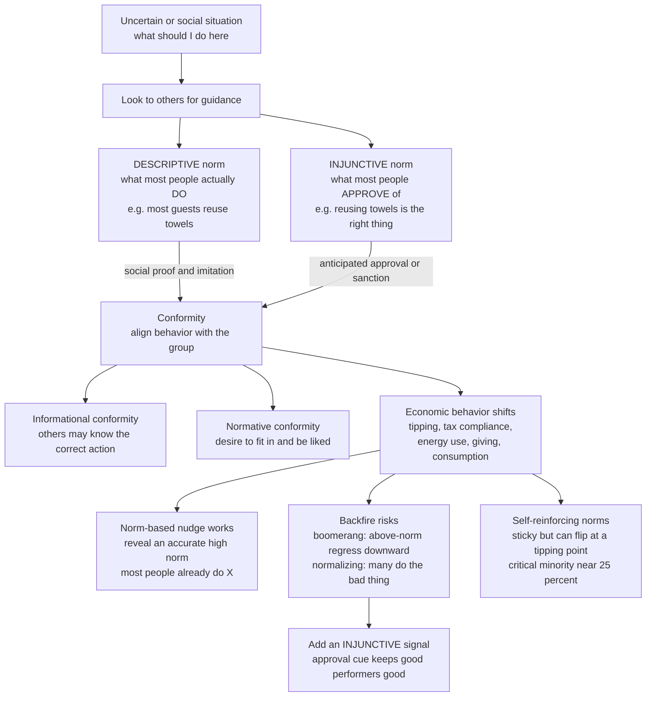

# 🤝 Social Norms and Conformity

> [!abstract] TL;DR
> **Social norms** — shared, unwritten expectations about how people *should* and typically *do* behave, enforced by social approval and disapproval rather than by law — are among the most powerful and most *underestimated* drivers of economic behavior, frequently outweighing prices and incentives. Cialdini's crucial split separates **descriptive norms** (what most people actually *do* — "most guests reuse their towels") from **injunctive norms** (what most people *approve* of — "reusing towels is the right thing"); the two operate through different channels and can even conflict. Communicating an accurate descriptive norm is a cheap, potent **nudge** (towel reuse, OPOWER energy reports, "9 out of 10 people pay their tax on time"), but it can **backfire**: telling already-good performers they beat the norm makes them *regress toward it* (the **boomerang effect**, fixed by adding an injunctive approval signal), and publicizing that "lots of people do the bad thing" *normalizes* it. Norms are held in place partly by **pluralistic ignorance** — everyone privately disapproves yet wrongly believes others approve — and, because they are self-reinforcing, they are sticky but can **flip suddenly at tipping points** once a critical minority (on the order of 25 percent) shifts, making the deliberate shaping of norms central to behavioral policy, cooperation, and large-scale social change.

---

## Intuition

**Analogy:** Hotels want guests to reuse towels. For years the card in the bathroom made an environmental plea — *save the planet, hang your towel*. Then researchers tried a different card: *"the majority of guests who stayed in this room reused their towels."* Reuse jumped, more than any appeal to the environment or to the hotel's cost savings. Nothing about the guest's incentives changed — no discount, no fine, no new information about the planet. All that changed was a single fact about **what other people in that very room had done**.

That is the quiet engine of social life. We are exquisitely sensitive to what others *do* and to what others think we *should* do. We tip in restaurants we will never revisit, form orderly queues no law requires, and lower our voices when we walk into a library — not from self-interest or statute, but from invisible norms we absorbed as children and now enforce on one another. And when the crowd's visible behavior changes, ours follows: *"everyone's doing it"* is one of the most powerful forces in economic life, for good (recycling, vaccination, honesty) and for ill (tax evasion, littering, panic buying).

---

## How It Works

### Core Mechanics

1. **A norm is a socially-enforced expectation, not a law.** Norms are unwritten rules about appropriate behavior, sustained by the anticipation of **approval or disapproval** from others rather than by courts or prices. Because the enforcement is social and often internalized as pride, guilt, or embarrassment, norms govern behavior even when no authority is watching and even when they cut against narrow self-interest — the reason we tip strangers, return lost wallets, and stand in line.

2. **Two distinct kinds of norm (Cialdini's split).** *Descriptive* norms describe **what people actually do** ("everyone recycles here") and steer behavior through **social proof and imitation** — others' behavior is treated as evidence of the sensible action. *Injunctive* norms describe **what people approve or disapprove of** ("recycling is the right thing") and steer behavior through **anticipated social sanction**. The distinction is not academic: the two can *conflict*. A sign reading "many visitors take petrified wood from this park" is a descriptive norm that quietly *licenses* theft even while an injunctive rule forbids it — and it demonstrably *increases* stealing.

3. **Conformity: informational versus normative.** Conformity is the pull to align one's behavior or beliefs with a group. It runs on two motives. **Informational conformity** copies others because they may *know the correct action* — rational under uncertainty (this is social proof). **Normative conformity** copies others to *fit in and be liked*, even against one's own judgment. Asch's line-judgment experiments showed people giving obviously *wrong* answers to match a unanimous group; Sherif's autokinetic studies showed groups spontaneously *inventing* a shared norm out of an ambiguous perception and then anchoring on it. The pull to not deviate is deep and often unconscious.

4. **Norms are an invisible governor of economic behavior.** They shape tipping, queuing, honesty and cheating, **tax compliance** (people pay partly because they believe others pay and that paying is the norm), energy and water conservation, charitable giving, **fair-wage and effort-reciprocity** norms in the workplace, fashion and "keeping up with the Joneses" (Veblen's conspicuous consumption), and diet and health behavior. In domain after domain, the norm predicts behavior better than the price does.

5. **Norm-based interventions: reveal an accurate descriptive norm.** A major applied success of behavioral science is simply *telling people, truthfully, what most others do*. The towel-reuse card, **OPOWER home-energy reports** comparing your usage to your neighbors', tax letters stating "9 out of 10 people pay on time," and campus programs correcting inflated beliefs about how much peers drink all move behavior — often more cheaply and effectively than financial incentives. This connects the topic to the sibling notes *Nudges_and_Choice_Architecture* and *Behavioral_Public_Policy_and_Libertarian_Paternalism*.

6. **Backfire risks: the boomerang and normalization.** Descriptive-norm messaging is a double-edged tool. Tell households that already use *less* energy than average that they beat the norm, and many **regress upward toward it** — the **boomerang effect** (Schultz et al., 2007). The fix is to pair the descriptive fact with an **injunctive** approval cue (a smiley face signaling "you're doing the right thing"), which holds good performers in place. And loudly advertising that "many people cheat / don't vote / evade tax" backfires by making the bad behavior look *normal*. Norm messaging is a delicate art.

7. **Pluralistic ignorance sustains norms nobody holds.** People frequently **misperceive** the norm. Under *pluralistic ignorance*, most privately disapprove of something (heavy drinking, a corrupt practice) yet each wrongly believes *others* approve, so everyone conforms to a norm no one actually endorses. Because the norm rests on a false belief about others' beliefs, **correcting the misperception** can change behavior rapidly.

8. **Norm change: stickiness, cascades, and tipping points.** Because norms are self-reinforcing — each person conforms to the prevailing behavior — they are *sticky*, trapping societies in bad equilibria. But the same feedback makes them capable of **sudden flips**. Granovetter's threshold models and Centola's experiments show that once a **critical minority** (empirically around 25 percent) adopts a new behavior, a **cascade** can tip the whole population past a threshold: smoking bans, seat-belt use, same-sex-marriage acceptance, and movements like #MeToo all show this abrupt, self-propelling character. Norms are *multiple equilibria*, and knowing how to engineer a jump between them is a policy superpower — one that laws can catalyze through *expressive* effects, or, badly designed, **crowd out**.

### Flow / Architecture



---

## Key Concepts

**Secondary (intuitive grasp).** A **social norm** is an unwritten rule about how people behave — "we tip about 18 percent," "we don't cut in line," "we keep quiet in libraries." Nobody passes a law; we just learn what's expected and feel a twinge of shame if we break it. There are two flavors: what people *actually do* (**descriptive** — "everyone recycles") and what people *think is right* (**injunctive** — "recycling is good"). The most useful practical fact is that **telling people the truth about what others do changes what they do**: "most guests in this room reused their towels" beats every lecture about the planet. The rule of thumb: humans are herd animals with a conscience, and *"everyone's doing it"* moves us more than money often does.

**Undergraduate (mechanism and named effects).** Norms drive behavior through **conformity**, which has two engines: **informational** (others are treated as evidence of the correct action — Cialdini's *social proof*, rational under uncertainty) and **normative** (conformity to gain approval and avoid rejection, even against one's own judgment — Asch's line studies, where roughly a third of responses matched an obviously wrong majority). Sherif's autokinetic experiment showed norms being *created* from nothing and then inherited by newcomers. The **descriptive/injunctive** distinction (Cialdini, Reno and Kallgren, 1990) is the field's key lever: descriptive messages work through imitation, injunctive through anticipated sanction, and mismatching them explains why some campaigns backfire. Norm-based interventions — the towel study (Goldstein, Cialdini and Griskevicius, 2008), OPOWER reports, tax-compliance letters — are documented "nudges" that often outperform prices. Two failure modes are named: the **boomerang effect** (descriptive feedback pulls the already-good back toward the mean) and **normalization** (publicizing a common bad behavior spreads it). **Pluralistic ignorance** (Prentice and Miller, 1993) names the trap where private disapproval hides behind assumed public approval.

**Graduate (dynamics, equilibria, and the policy frontier).** Model behavior with **conformity payoffs**: an individual's utility for the "good" action rises with the fraction of others taking it, so the population dynamics have **multiple stable equilibria** and history- or expectation-dependence (an all-defect and an all-cooperate norm can both be self-enforcing). **Granovetter (1978) threshold models** make this precise: agents adopt once the visible adopter fraction exceeds a heterogeneous personal threshold, so the equilibrium is a fixed point of the threshold CDF, and small shifts in the *distribution* of thresholds produce **discontinuous cascades** — the mathematics of tipping points shared with [[Bifurcations_and_Tipping_Points]] and [[Cascades_and_Systemic_Risk]]. **Centola et al. (2018)** experimentally located a **critical mass near 25 percent** for overturning an established convention. The evolutionary underpinning — why norm-following and norm-enforcing (costly punishment) are stable at all — is the province of [[The_Evolution_of_Conventions_and_Norms]] and cultural-evolution accounts of gene-culture coevolution. On the policy side, the open questions are *expressive law* (laws that shift beliefs about the norm) versus **motivational crowding-out** (incentives that erode intrinsic norm compliance, as when a fine for late daycare pickup *increased* lateness by re-framing it as a purchasable service — Gneezy and Rustichini, 2000), and the design of interventions robust to boomerang and normalization effects.

---

## Python Demo

```python
# Two dynamics of social norms, quantified.
#   (a) SOCIAL PROOF + THE BOOMERANG EFFECT
#       - Adoption of a "good" behavior rises with the FRACTION of others
#         believed to do it (conformity to a descriptive norm), so revealing
#         a HIGH descriptive norm raises adoption (an S-shaped social-proof curve).
#       - The OPOWER/Schultz energy-report boomerang: descriptive-only feedback
#         pulls EVERYONE toward the average, so heavy users cut back (good) but
#         already-frugal users creep UP toward the norm (bad). Adding an
#         INJUNCTIVE approval signal for the frugal cancels the boomerang.
#   (b) NORM CASCADES: a Granovetter/Schelling threshold model where a committed
#       minority tips the whole population past a critical mass (~ Centola 25%).
import numpy as np
import matplotlib.pyplot as plt

rng = np.random.default_rng(1)

# ============================================================= (a) social proof
def adoption_given_norm(p_norm, k=9.0, theta=0.5):
    # probability an individual adopts the good behavior when they BELIEVE a
    # fraction p_norm of others already do -> logistic response (social proof)
    return 1.0 / (1.0 + np.exp(-k * (p_norm - theta)))

revealed = np.linspace(0, 1, 101)
adopt = adoption_given_norm(revealed)
print("=== (a) Social proof: revealing a descriptive norm ===")
for pn in (0.20, 0.50, 0.80):
    print(f"revealed norm 'X percent do it' = {pn:0.0%}  ->  adoption {adoption_given_norm(pn):0.0%}")

# --------------------------------------------------- the boomerang (energy use)
N = 4000
baseline = rng.normal(100, 25, N)     # kWh; HIGHER = worse (more energy used)
norm = baseline.mean()                # neighborhood average shown to everyone
alpha = 0.30                          # strength of the pull toward the norm

# DESCRIPTIVE-ONLY: everyone drifts TOWARD the shown average.
#   above-average (bad) users fall (good);  below-average (good) users RISE (boomerang)
delta_desc = alpha * (norm - baseline)

# DESCRIPTIVE + INJUNCTIVE: an approval cue (smiley) for the below-average users
# removes their upward pull; heavy users still cut back.
delta_inj = np.where(baseline < norm, 0.0, alpha * (norm - baseline))

below = baseline < norm
print("\n=== (a) Boomerang effect (energy use, higher = worse) ===")
print(f"neighborhood norm shown           : {norm:6.1f} kWh")
print(f"BELOW-avg (already good) change    : desc-only {delta_desc[below].mean():+5.1f}"
      f"  |  +injunctive {delta_inj[below].mean():+5.1f}")
print(f"ABOVE-avg (heavy) users   change   : desc-only {delta_desc[~below].mean():+5.1f}"
      f"  |  +injunctive {delta_inj[~below].mean():+5.1f}")
print(f"TOTAL consumption change           : desc-only {delta_desc.sum():+7.0f}"
      f"  |  +injunctive {delta_inj.sum():+7.0f}")
# note: descriptive-only nets to ~0 (frugal boomerang cancels heavy-user savings);
# adding the injunctive signal turns it into a real net reduction.

# ============================================================ (b) norm cascades
def cascade_path(q, mu=0.55, sd=0.12, M=5000, steps=30, seed=0):
    """Granovetter threshold cascade seeded by a committed minority of size q.
    Committed agents (threshold < 0) always adopt; the rest adopt once the
    visible adopter fraction meets their personal threshold ~ Normal(mu, sd)."""
    r = np.random.default_rng(seed)
    n_comm = int(round(q * M))
    th = np.empty(M)
    th[:n_comm] = -1.0                                   # committed activists
    th[n_comm:] = np.clip(r.normal(mu, sd, M - n_comm), 0, 1)
    x = n_comm / M
    xs = [x]
    for _ in range(steps):
        x = np.mean(th <= x)                             # x_{t+1} = F(x_t)
        xs.append(x)
    return np.array(xs)

# time-series: small committed minorities fizzle, a large enough one cascades
q_show = [0.10, 0.18, 0.24, 0.30]
paths = {q: cascade_path(q) for q in q_show}

# sweep committed-minority size -> final adoption shows a sharp TIPPING POINT
qs = np.linspace(0.0, 0.45, 46)
finals = np.array([cascade_path(q)[-1] for q in qs])
tip = qs[np.argmax(np.diff(finals, prepend=finals[0]) > 0.25)]  # rough jump loc
print("\n=== (b) Norm cascade: committed minority -> tipping ===")
for q in q_show:
    print(f"committed minority {q:0.0%}  ->  final adoption {paths[q][-1]:0.0%}")
print(f"approx tipping point in this model : {tip:0.0%} committed")

# =============================================================== plots
fig, ax = plt.subplots(2, 2, figsize=(13, 9))

ax[0, 0].plot(revealed, adopt, color="#2563eb", lw=2.5)
for pn in (0.20, 0.80):
    ax[0, 0].plot(pn, adoption_given_norm(pn), "o", color="#dc2626")
ax[0, 0].axvline(0.5, color="gray", ls=":")
ax[0, 0].set_title("(a) Social proof: adoption rises with the revealed descriptive norm")
ax[0, 0].set_xlabel("revealed norm: fraction believed to do X")
ax[0, 0].set_ylabel("probability of adopting X")

order = np.argsort(baseline)
b = baseline[order]
ax[0, 1].plot(b, delta_desc[order], color="#dc2626", lw=2.5, label="descriptive only")
ax[0, 1].plot(b, delta_inj[order],  color="#059669", lw=2.5, label="descriptive + injunctive")
ax[0, 1].axhline(0, color="black", lw=1)
ax[0, 1].axvline(norm, color="gray", ls="--", label="neighborhood norm")
ax[0, 1].fill_between(b, 0, delta_desc[order], where=(b < norm),
                      color="#fecaca", alpha=0.6, label="BOOMERANG: frugal users rise")
ax[0, 1].set_title("(a) Boomerang: descriptive-only backfires for already-good users")
ax[0, 1].set_xlabel("baseline energy use (kWh, higher = worse)")
ax[0, 1].set_ylabel("change in energy use")
ax[0, 1].legend(fontsize=8)

for q in q_show:
    ax[1, 0].plot(paths[q], marker="o", ms=3,
                  label=f"committed {q:0.0%}  ->  {paths[q][-1]:0.0%}")
ax[1, 0].set_title("(b) Cascade dynamics: small minorities fizzle, large ones tip")
ax[1, 0].set_xlabel("time step"); ax[1, 0].set_ylabel("fraction adopting")
ax[1, 0].legend(fontsize=8)

ax[1, 1].plot(qs, finals, color="#7c3aed", lw=2.5)
ax[1, 1].axvline(0.25, color="#dc2626", ls="--", label="Centola ~25 percent benchmark")
ax[1, 1].set_title("(b) Tipping point: final adoption vs committed-minority size")
ax[1, 1].set_xlabel("committed-minority fraction")
ax[1, 1].set_ylabel("final population adoption")
ax[1, 1].legend(fontsize=8)

plt.tight_layout()
plt.savefig("social_norms_and_conformity.png", dpi=120)
plt.show()
```

Running it shows the three signatures. The **social-proof curve** is S-shaped: revealing that only 20 percent do X yields near-zero adoption, while revealing 80 percent tips the population toward the behavior. The **boomerang panel** makes the trap visible — under descriptive-only feedback the frugal (below-norm) households *increase* consumption (the shaded region), and the total change nets out near zero as their boomerang cancels the heavy users' savings; adding the injunctive approval cue zeroes out the frugal drift and converts the program into a real net reduction. The **cascade panels** show a small committed minority fizzling out while a large enough one triggers a self-propelling jump to near-universal adoption, with the sweep exposing a sharp **tipping point** in the neighborhood of Centola's ~25 percent critical mass.

---

## Real-World Applications

> **Example (OPOWER home-energy reports):** Utilities mail households a report comparing their electricity use to that of *similar neighbors* — a pure descriptive-norm nudge. Randomized trials across millions of households (Allcott, 2011) find persistent reductions of roughly 2 percent, cost-competitive with far more expensive efficiency programs. Crucially, the reports carry an **injunctive** cue (smiley faces for below-average users) precisely to defuse the boomerang that Schultz et al. documented — a direct engineering fix drawn straight from the descriptive/injunctive theory.

- **Tax compliance.** Behavioral-insights teams (the UK's BIT and others) raised on-time tax payment by adding a single descriptive-norm sentence to letters — "9 out of 10 people in your area pay their tax on time" — nudging late payers toward the majority. It works only because it is *true and high*; a low or "many evade" framing would normalize evasion.
- **Hotel towel and energy reuse.** The founding applied study: cards reporting that most previous guests (especially guests *in this room*) reused towels beat generic environmental appeals, and remain a staple of hospitality sustainability.
- **College drinking and pluralistic ignorance.** Students systematically *overestimate* peer alcohol consumption and approval; "social-norms marketing" that publishes the accurate, lower norm has reduced binge drinking on many campuses by correcting the misperception that sustains it.
- **Consumption and status.** Veblen's conspicuous consumption and "keeping up with the Joneses" are norm dynamics: demand for visible goods rises with what one's reference group displays, a channel absent from the standard price-taking model.
- **Movements and legal change.** Rapid shifts in smoking-in-public, seat-belt use, and same-sex-marriage acceptance illustrate norm cascades, where laws often act *expressively* — signaling a changed majority view and accelerating the tip rather than merely coercing.

Norm interventions are a core tool of the broader nudge program (see the sibling *Nudges_and_Choice_Architecture*) and of *Behavioral_Public_Policy_and_Libertarian_Paternalism*, and they interlock with cooperation, fairness, and trust — themes developed in the forthcoming siblings *Social_Preferences_Fairness_and_Reciprocity* and *Trust_Altruism_and_Cooperation*, and grounded evolutionarily in *Cultural_Evolution_and_Social_Learning*.

---

## Common Pitfalls

- **Confusing descriptive with injunctive norms** — the single most common design error. A message that laments how *many* people do the bad thing (littering, evading tax, not voting) is a *descriptive* norm that *licenses* the behavior, undermining the injunctive rule it means to reinforce. State the *positive* descriptive norm ("most people do the right thing") when it is true, and add an injunctive cue otherwise.
- **Triggering the boomerang** — telling above-average performers they beat the norm invites them to *regress toward it*. Never publish a descriptive comparison without an injunctive approval signal to hold the good performers in place.
- **Publicizing a bad behavior to fight it** — "an alarming number of people cheat" advertising campaigns *normalize* cheating. Publicity makes the behavior look common, which is exactly the descriptive signal you did not want to send.
- **Assuming the perceived norm is the real norm** — pluralistic ignorance means the *believed* norm can be badly wrong. Measure actual behavior and private attitudes before designing a "norm-correction" message; you may be broadcasting a false norm.
- **Fabricating or inflating the norm** — the effect depends on *accuracy* and trust. A norm claim that recipients can tell is false (or that a subgroup knows is wrong for them) breeds reactance and destroys credibility. Nudges must be truthful.
- **Ignoring crowding-out when you add incentives** — bolting a price or fine onto a norm-governed behavior can *replace* the moral frame with a market one (the daycare-fine result), eroding the very norm you relied on. Incentives and norms are not simply additive.
- **Expecting one message to flip a sticky norm** — deeply entrenched norms are multiple equilibria held by mutual expectation. Shifting them usually requires reaching a *critical mass* and making the new behavior *visible*, not a one-off leaflet.

---

## Related Concepts

- [[Behavioral_Economics_Overview]] — the parent map; social norms are the leading *social* determinant of behavior alongside the individual biases catalogued there.
- [[Reference_Dependence_and_Framing]] — norms act as social *reference points*, and whether a message frames the majority as compliant or deviant is itself a framing choice.
- [[Social_Influence_and_Conformity]] — the Psychology-vault deep dive on Asch, Sherif, Milgram, and normative versus informational influence that this note builds on.
- [[Prosocial_Behavior]] — helping, giving, and cooperation are heavily norm-governed, and social proof is a documented driver of prosocial action.
- [[Culture_Norms_Values_and_Ideology]] — the Sociology treatment of norms, values, folkways, and mores as the fabric of social order.
- [[Collective_Behavior_and_Crowds]] — crowds, fads, and panics as norm dynamics playing out at speed, the sociological cousin of the cascade model.
- [[Social_Movements_and_Revolution]] — large-scale norm change as tipping cascades, the macro payoff of the threshold model.
- [[The_Evolution_of_Conventions_and_Norms]] — the game-theoretic and evolutionary account of *why* norm-following and norm-enforcement are stable equilibria.
- [[Cultural_Evolution_and_Social_Learning]] — how norms are transmitted and selected across generations, the mechanism beneath sticky and shifting conventions.
- [[Bifurcations_and_Tipping_Points]] — the dynamical-systems mathematics of the sudden flip between norm equilibria.
- [[Cascades_and_Systemic_Risk]] — network-contagion models that generalize the Granovetter threshold cascade used in the demo.
- [[Externalities_and_Pigouvian_Tax]] — norms can substitute for or complement Pigouvian correction of externalities like pollution and littering.
- [[Public_Goods]] — voluntary contribution to public goods (recycling, tax, effort) is sustained largely by conditional-cooperation norms.

*Not yet written (Behavioral_Economics siblings referenced above in prose): Social_Preferences_Fairness_and_Reciprocity, Trust_Altruism_and_Cooperation, Nudges_and_Choice_Architecture, Behavioral_Public_Policy_and_Libertarian_Paternalism.*

---

## Review Questions

1. **(Conceptual)** Distinguish *descriptive* from *injunctive* norms and explain, with an example, how a well-intentioned campaign can accidentally set the two in conflict. Why does a sign reading "many visitors take wood from this park" *increase* theft, and how would you rewrite it?
2. **(Scenario)** A city wants to cut residential water use with a mailer comparing each household to its neighborhood average. Using the boomerang effect, predict what happens to households that *already* use less than average under a descriptive-only message, and specify the exact design change that prevents the backfire. What must be true about the norm you cite for the whole approach to be ethical and effective?
3. **(Trade-off / dynamics)** Norms are described as both extraordinarily *sticky* and capable of *sudden* change. Reconcile these using the threshold/tipping model, and explain why Centola's ~25 percent critical mass, expressive law, and the risk of incentive *crowding-out* all bear on whether a policymaker should try to *shift a norm* rather than mandate behavior or change prices.

---

## Sources

- Cialdini, R. B., Reno, R. R. & Kallgren, C. A. (1990). "A Focus Theory of Normative Conduct: Recycling the Concept of Norms to Reduce Littering in Public Places." *Journal of Personality and Social Psychology*, 58(6), 1015–1026.
- Goldstein, N. J., Cialdini, R. B. & Griskevicius, V. (2008). "A Room with a Viewpoint: Using Social Norms to Motivate Environmental Conservation in Hotels." *Journal of Consumer Research*, 35(3), 472–482.
- Schultz, P. W., Nolan, J. M., Cialdini, R. B., Goldstein, N. J. & Griskevicius, V. (2007). "The Constructive, Destructive, and Reconstructive Power of Social Norms." *Psychological Science*, 18(5), 429–434.
- Granovetter, M. (1978). "Threshold Models of Collective Behavior." *American Journal of Sociology*, 83(6), 1420–1443.
- Centola, D., Becker, J., Brackbill, D. & Baronchelli, A. (2018). "Experimental Evidence for Tipping Points in Social Convention." *Science*, 360(6393), 1116–1119.
- Bicchieri, C. (2006). *The Grammar of Society: The Nature and Dynamics of Social Norms.* Cambridge University Press.

---

#behavioral-economics #social-norms #conformity #social-proof #norm-cascades
