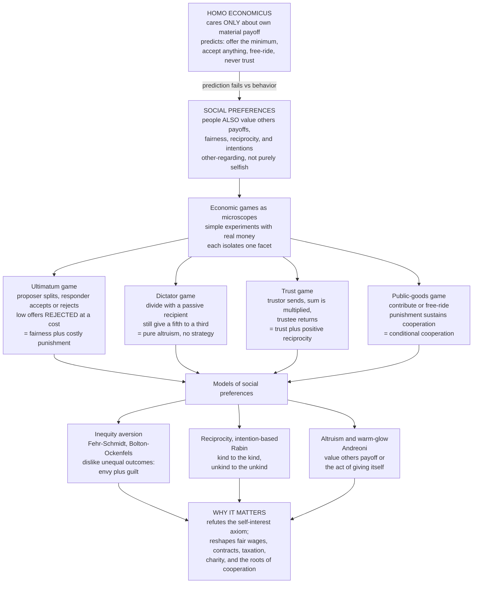

# 🤝 Social Preferences, Fairness, and Reciprocity

> [!abstract] TL;DR
> **Social preferences** are the well-documented finding that people care not only about their **own** material payoff — as standard economics assumes — but also about **others'** payoffs, about **fairness**, about **reciprocity**, and about the **intentions** behind actions. This is a direct assault on the self-interest axiom of *Homo economicus*, and it is established not by armchair philosophy but by simple **economic games with real money**: in the **ultimatum game** people reject unfair offers at a cost to themselves; in the **dictator game** they give freely with no strategic reason; and in **trust** and **public-goods** games they trust, reciprocate kindness, and engage in **altruistic punishment** of free-riders that sustains cooperation. Formal models — **inequity aversion** (Fehr–Schmidt, Bolton–Ockenfels) and **intention-based reciprocity** (Rabin) — capture the data and reshape how economists understand fair wages, contracts, negotiation, taxation, charity, and the very foundations of social order.

---

## Intuition

**Analogy:** I offer to split \$100 with you, but I decide the split — you can only **accept** or **reject**, and if you reject, we *both* walk away with nothing. A coldly rational you should pocket even \$1: one dollar beats zero, end of story. Yet across the world, from graduate students to Amazonian foragers, people angrily **reject** offers below roughly \$30, deliberately setting fire to their own money just to deny a greedy splitter his \$70. That refusal is not a miscalculation. It is a *choice* — a willingness to pay real cash to **punish unfairness**.

We are simply not the selfish maximizers economics assumed. We have genuine preferences over **fairness**; we **reciprocate** kindness with kindness and cruelty with retaliation; and we will pay out of our own pocket to reward the generous and punish the greedy. These "social preferences" are as real, as measurable, and as decision-shaping as our taste for money itself — and once you let them into the model, huge swaths of economic life that looked like anomalies suddenly make sense.

---

## How It Works

### Core mechanics

Behavioral economics does not *assert* that people are fair; it **measures** it, using a family of stripped-down experimental games — each a microscope trained on one facet of social preference, each played for real money with real stakes.

1. **The ultimatum game — fairness and costly punishment.** A **proposer** offers a split of a fixed sum; a **responder** either accepts (both get the proposed split) or rejects (both get **nothing**). The subgame-perfect, purely selfish prediction is stark: offer the smallest possible positive amount, and the responder accepts it because *something beats nothing*. Reality shatters this. Proposers offer **40–50 percent** on average, and responders **reject** offers below about **20–30 percent** — paying to punish an unfair partner. The result is astonishingly robust across cultures (with systematic variation) and stakes.

2. **The dictator game — pure altruism, strategy removed.** Strip out the responder's veto: the "dictator" simply **divides** the money with a passive recipient who has no move at all. Now there is *zero* strategic reason to give — no rejection to fear. Selfishness predicts giving nothing. Yet people still hand over **20–30 percent** on average (less than in the ultimatum game, confirming that ultimatum offers are part strategic). Giving is genuine *other-regard*, though it shrinks with **anonymity**, **social distance**, and available **"moral wiggle room"** (excuses not to give).

3. **The trust / investment game — trust and positive reciprocity.** A **trustor** decides how much of an endowment to send to a **trustee**; the sent amount is **multiplied** (say tripled) en route; the trustee then chooses how much to **return**. Selfishness predicts the trustee returns nothing, so the trustor sends nothing, and the surplus evaporates. Instead, trustors **trust** (send substantial amounts) and trustees **reciprocate** (return more when trusted more) — the signature of **positive reciprocity**, rewarding kindness. Its dark twin, **negative reciprocity** (punishing unkindness), is exactly what powers ultimatum rejections.

4. **The public-goods game — cooperation, free-riding, and altruistic punishment.** Group members each decide how much to contribute to a common pot that is multiplied and shared. The dominant selfish strategy is to **free-ride**, and contributions duly **decay** toward zero over repeated rounds — until you add a **punishment** option. When players can pay a cost to punish free-riders, cooperation **stabilizes at high levels**. That punishment is *altruistic*: the punisher bears a cost with no private future benefit, yet enforces the norm anyway.

### Models of social preferences

Three families of utility model translate these behaviors into equations:

- **Inequity aversion** (Fehr–Schmidt 1999; Bolton–Ockenfels 2000). People dislike **unequal outcomes** — both **disadvantageous** inequality (earning less than others → *envy*, weight `alpha`) and **advantageous** inequality (earning more → *guilt*, weight `beta`), with envy typically stronger than guilt. For player *i*: `U_i = x_i − alpha·max(x_j − x_i, 0) − beta·max(x_i − x_j, 0)`. This single formula predicts why low ultimatum offers get rejected (the responder's envy term makes an unfair split *worse than zero*) and, working backward, why proposers offer generously in the first place.

- **Intention-based reciprocity** (Rabin 1993; Dufwenberg–Kirchsteiger). People respond to **intentions and kindness**, not just outcomes — being **kind to the kind and unkind to the unkind**. This captures a fact inequity aversion cannot: the *same* unfair split is punished when a **person** chose it but **accepted** when a **random device** produced it. The actor's intent, not merely the outcome, drives the response.

- **Pure altruism and warm-glow** (Andreoni). People value others' payoff directly (altruism) or derive utility from the *act* of giving itself (warm-glow), explaining dictator giving and charitable donation without any reciprocity or fairness machinery.

**Strong reciprocity** (Gintis, Bowles, Fehr) ties it together: humans carry a disposition to **cooperate conditionally** and to **punish defectors even at personal cost with no future payoff** — the glue that sustains large-scale cooperation and links behavioral economics to the evolution of cooperation.



---

## Key Concepts

**Secondary (intuitive grasp).** People are not money-robots. Given free cash to split, most of us share a fair chunk rather than grabbing it all — and if *someone else* tries to grab it all, we will burn our own share just to stop them getting theirs. We trust strangers a little and pay them back when they trust us. We chip in for the group even when we could coast, and we get angry at the ones who coast. Economists study these instincts with tiny money games: the **ultimatum game** (split-or-nothing), the **dictator game** (just share), the **trust game** (send-and-return), and the **public-goods game** (pitch-in-or-slack). The headline: **fairness and reciprocity are real motives, as real as wanting the cash.**

**Undergraduate (mechanism and named effects).** The self-interest axiom of the standard model predicts sharp corner solutions — offer epsilon, accept epsilon, contribute nothing, return nothing — and every one of them is falsified in the lab. The workhorse repair is **Fehr–Schmidt inequity aversion**: `U_i = x_i − alpha_i·max(x_j − x_i, 0) − beta_i·max(x_i − x_j, 0)`, with `beta_i ≤ alpha_i` and `beta_i < 1`. In the ultimatum game a responder with disadvantageous-inequality weight `alpha` accepts an offer `s` of a pie `π` only if `s ≥ alpha·π / (1 + 2·alpha)`, giving a **minimum acceptable offer** that rises from 0 (selfish) toward the equal split as `alpha` grows — the exact reason proposers dare not lowball. Distinguish this from **intention-based reciprocity** (Rabin), which is needed because people accept an unfair split from a **random device** but punish the *same* split from a **deliberate proposer**: outcomes alone cannot explain that, intentions can. **Positive** and **negative reciprocity** are the two arms — reward kindness, punish unkindness — and **conditional cooperation** (contribute if others do) is their public-goods expression.

**Graduate (models, debates, and evolution).** The live theoretical contest is **outcome-based vs intention-based** social preferences. Fehr–Schmidt and Bolton–Ockenfels (ERC) are purely *distributional* — utility depends only on the final allocation — and they fit the ultimatum, dictator, and public-goods data with remarkable economy, yet they are **falsified by intention treatments**: Falk–Fehr–Fischbacher show that responders' rejection thresholds depend on the *alternatives the proposer could have chosen*, not just the offer itself. Reciprocity models (Rabin; Dufwenberg–Kirchsteiger's sequential-reciprocity equilibrium) embed **psychological game theory**, where payoffs depend on beliefs about intentions — mathematically heavier but behaviorally more complete. **Strong reciprocity** (Gintis, Bowles, Fehr, Gächter) is the empirical claim that **altruistic punishment** is a stable human disposition, and the **theoretical** puzzle is its evolutionary origin: how does a costly-punisher type survive when it bears costs that benefit non-punishers (a second-order free-rider problem)? Proposed answers — **cultural group selection**, **gene-culture coevolution**, **reputation and indirect reciprocity**, and spatial/network structure — connect this note to evolutionary game theory. Finally, **context-dependence** is not a bug but a boundary condition: the Henrich et al. cross-cultural ultimatum studies show offers and rejections track **market integration** and local **norms of cooperation and sharing** — social preferences are real and lawful, but calibrated by culture rather than fixed universal constants.

---

## Python Demo

```python
# Social-preference games, quantified: the SELFISH-rational prediction vs the
# EMPIRICAL data, with Fehr-Schmidt INEQUITY AVERSION doing the explanatory work.
#
#  (a) ULTIMATUM GAME
#      - Selfish theory: proposer offers the minimum; responder accepts anything > 0.
#      - Fehr-Schmidt responder with disadvantageous-inequality weight alpha accepts
#        an offer s of a pie 'pie' iff  s >= alpha*pie/(1+2*alpha).
#      - A heterogeneous population of alphas => an ACCEPTANCE CURVE that rises with
#        the offer; a payoff-maximizing (even selfish) proposer facing this curve is
#        driven to a GENEROUS offer (~40-50%), matching the data.
#  (b) DICTATOR GAME
#      - No responder, no strategy: selfish theory predicts giving 0.
#      - A mixture of types (selfish / partial giver / egalitarian) reproduces the
#        classic giving histogram with a mean of ~20-30% -- pure other-regard.
import numpy as np
import matplotlib
matplotlib.use("Agg")
import matplotlib.pyplot as plt

rng = np.random.default_rng(1)
pie = 10.0                      # the sum to be divided ($)

# ---------------------------------------------------------------------------
# (a) ULTIMATUM GAME with a Fehr-Schmidt responder population
# ---------------------------------------------------------------------------
N = 40000
# Inequity-aversion weights: a chunk of purely selfish responders (alpha=0) plus
# the rest drawn from a Gamma -> a realistic spread of fairness sensitivity.
alpha = rng.gamma(shape=1.6, scale=0.55, size=N)
alpha[rng.random(N) < 0.15] = 0.0                 # 15% purely selfish accept-anything

# Minimum acceptable OFFER (in $) for each responder: s* = alpha*pie/(1+2*alpha).
# For offer s, responder accepts iff s >= s*(alpha).  (Offers >= pie/2 always accepted.)
min_accept = alpha * pie / (1.0 + 2.0 * alpha)

offers = np.linspace(0.0, pie, 201)               # proposer's offer to responder
# Empirical acceptance probability at each offer = fraction of responders who accept.
accept_prob = np.array([np.mean(o >= min_accept) for o in offers])

# Selfish-rational benchmark: accept iff offer strictly positive (a step function).
selfish_accept = (offers > 1e-9).astype(float)

# Proposer keeps (pie - offer); expected payoff = accept_prob * (pie - offer).
exp_payoff_behavioral = accept_prob * (pie - offers)
exp_payoff_selfish    = selfish_accept * (pie - offers)   # maximized at the tiniest offer

opt_offer_behavioral = offers[np.argmax(exp_payoff_behavioral)]
opt_offer_selfish    = offers[np.argmax(exp_payoff_selfish)]

# Fehr-Schmidt mechanism: minimum acceptable offer FRACTION vs alpha (theory curve).
alpha_grid = np.linspace(0.0, 5.0, 300)
min_frac   = alpha_grid / (1.0 + 2.0 * alpha_grid)        # -> 0.5 as alpha -> inf

print("=" * 66)
print("ULTIMATUM GAME  (pie = $%.0f)" % pie)
print("=" * 66)
print("SELFISH prediction : proposer offers the minimum ($0+),")
print("                     responder accepts anything positive.")
print("                     => optimal selfish offer = $%.2f" % opt_offer_selfish)
print("-" * 66)
print("Fehr-Schmidt world : optimal PROPOSER offer     = $%.2f  (%.0f%% of pie)"
      % (opt_offer_behavioral, 100 * opt_offer_behavioral / pie))
print("                     offers below ~$%.1f are mostly rejected"
      % offers[np.argmax(accept_prob > 0.5)])
print("                     matching data: offers ~40-50%%, reject low offers.")

# ---------------------------------------------------------------------------
# (b) DICTATOR GAME: pure giving, no strategic incentive
# ---------------------------------------------------------------------------
Nd = 30000
u = rng.random(Nd)
give = np.empty(Nd)
sel  = u < 0.30                                   # 30% selfish -> give nothing
egal = (u >= 0.30) & (u < 0.50)                   # 20% egalitarian -> equal split
part = u >= 0.50                                  # 50% partial givers -> ~20-30%
give[sel]  = 0.0
give[egal] = pie / 2.0
give[part] = np.clip(rng.normal(2.5, 1.0, part.sum()), 0.0, pie / 2.0)
mean_give_frac = 100 * give.mean() / pie

print("\n" + "=" * 66)
print("DICTATOR GAME  (no responder, no strategy)")
print("=" * 66)
print("SELFISH prediction : give $0.")
print("Empirical (model)  : mean gift = $%.2f  (%.0f%% of pie)  -- genuine altruism."
      % (give.mean(), mean_give_frac))

# ---------------------------------------------------------------------------
# PLOTS
# ---------------------------------------------------------------------------
fig, ax = plt.subplots(2, 2, figsize=(13.5, 9.5))
fig.suptitle("Social Preferences: Selfish Theory vs Empirical Reality",
             fontsize=14, fontweight="bold")

# (0,0) acceptance probability vs offer: behavioral curve vs selfish step
ax[0, 0].plot(offers, accept_prob, color="#2563eb", lw=2.6,
              label="Fehr-Schmidt responders (empirical-like)")
ax[0, 0].plot(offers, selfish_accept, color="#dc2626", lw=2.0, ls="--",
              label="selfish prediction (accept any offer > 0)")
ax[0, 0].axvspan(0, 0.3 * pie, color="#fca5a5", alpha=0.20,
                 label="offers usually REJECTED (< ~30%)")
ax[0, 0].set_title("Ultimatum: low (unfair) offers get rejected")
ax[0, 0].set_xlabel("offer to responder ($)")
ax[0, 0].set_ylabel("probability of acceptance")
ax[0, 0].legend(fontsize=8); ax[0, 0].grid(alpha=0.25)

# (0,1) Fehr-Schmidt mechanism: minimum acceptable offer fraction vs alpha
ax[0, 1].plot(alpha_grid, min_frac, color="#7c3aed", lw=2.6,
              label=r"min acceptable offer = $\alpha\,\pi/(1+2\alpha)$")
ax[0, 1].axhline(0.5, color="gray", ls=":", lw=1.5, label="equal split (limit)")
ax[0, 1].axhline(0.0, color="#dc2626", ls="--", lw=1.5, label="selfish threshold = 0")
ax[0, 1].set_title("Why proposers are generous:\nenvy raises the rejection threshold")
ax[0, 1].set_xlabel(r"inequity-aversion weight  $\alpha$  (envy)")
ax[0, 1].set_ylabel("minimum acceptable share")
ax[0, 1].legend(fontsize=8); ax[0, 1].grid(alpha=0.25)

# (1,0) proposer expected payoff vs offer -> optimal offer is generous
ax[1, 0].plot(offers, exp_payoff_behavioral, color="#059669", lw=2.6,
              label="expected proposer payoff (behavioral)")
ax[1, 0].axvline(opt_offer_behavioral, color="#059669", ls="--",
                 label="optimal offer = $%.1f (%.0f%%)"
                       % (opt_offer_behavioral, 100 * opt_offer_behavioral / pie))
ax[1, 0].axvline(opt_offer_selfish, color="#dc2626", ls=":",
                 label="selfish 'offer the minimum'")
ax[1, 0].set_title("Rejection risk pushes the optimal offer toward fairness")
ax[1, 0].set_xlabel("offer to responder ($)")
ax[1, 0].set_ylabel("proposer's expected payoff ($)")
ax[1, 0].legend(fontsize=8); ax[1, 0].grid(alpha=0.25)

# (1,1) dictator giving histogram
ax[1, 1].hist(give, bins=np.linspace(0, pie / 2 + 0.25, 24),
              color="#f59e0b", edgecolor="black", linewidth=0.6)
ax[1, 1].axvline(give.mean(), color="#dc2626", lw=2.2,
                 label="mean gift = $%.2f (%.0f%%)" % (give.mean(), mean_give_frac))
ax[1, 1].axvline(0.0, color="black", lw=1.4, ls=":",
                 label="selfish prediction ($0)")
ax[1, 1].set_title("Dictator game: people give with NO strategic reason")
ax[1, 1].set_xlabel("amount given to recipient ($)")
ax[1, 1].set_ylabel("number of dictators")
ax[1, 1].legend(fontsize=8); ax[1, 1].grid(alpha=0.25)

plt.tight_layout(rect=[0, 0, 1, 0.95])
plt.savefig("social_preferences_fairness_reciprocity.png", dpi=115,
            bbox_inches="tight")
plt.show()
```

**What the demo shows.** Panel one plots the **acceptance curve** generated by a population of Fehr–Schmidt responders: it climbs from near zero for stingy offers to certainty near the equal split, while the selfish prediction is a flat "accept anything." Panel two draws the **mechanism** — a single responder's *minimum acceptable share* `alpha·π/(1+2·alpha)`, which rises from 0 (selfish) toward 50 percent as envy grows, so fair-minded responders make lowballing dangerous. Panel three multiplies acceptance probability by the amount kept to get the proposer's **expected payoff**, whose maximum sits at a **generous ~40 percent offer** rather than the selfish minimum: the proposer is *self-interested* but rationally buys off rejection risk. Panel four shows the **dictator-giving histogram** — a spike at zero, a spike at the equal split, and a mass in between, averaging **20–30 percent** even though the recipient is powerless. Together they reproduce the two signature facts (costly rejection of unfairness; strategy-free giving) that no purely selfish model can produce.

---

## Real-World Applications

> **Labor markets and the "fair wage–effort" hypothesis.** The single largest economic footprint of social preferences is the **gift-exchange** view of employment (Akerlof; Fehr, Kirchsteiger, Riedl). Firms pay wages *above* the market-clearing minimum, and workers **reciprocate** with effort above the contractible minimum — a positive-reciprocity exchange that explains **wage rigidity** (why employers resist cutting pay in downturns, fearing a collapse of morale and effort) and why "efficiency wages" work. Perceived *unfairness* in pay triggers negative reciprocity: shirking, sabotage, and quitting.

> **Contracts, negotiation, and mechanism design.** Because parties punish perceived unfairness even at a cost, contracts that a purely selfish analysis deems optimal can **backfire**. Incentive schemes seen as controlling or unfair can *crowd out* intrinsic motivation and reciprocity; "trust" contracts sometimes outperform tightly-specified ones. In bargaining, first offers must respect fairness norms or risk costly impasse — the ultimatum result generalized to real deal-making ([[Bargaining_Theory]]).

> **Taxation and public-goods provision.** Willingness to pay taxes and to contribute to public goods hinges on **conditional cooperation** and perceived fairness of the system. Compliance rises when people believe others comply and that the burden is fair; it collapses under perceived free-riding — which is precisely why **enforcement and visible sanctioning** (the altruistic-punishment analog) stabilize contribution, echoing the public-goods-with-punishment experiments.

> **Charitable giving and fundraising.** The dictator game is charity in miniature. Warm-glow and altruism explain why people donate anonymously with no return; the sensitivity of giving to **social distance, identifiability, and wiggle room** explains why "identifiable victim" appeals, matching gifts, and reduced anonymity raise donations.

> **Antitrust, pricing, and consumer backlash.** Kahneman, Knetsch, and Thaler's fairness-in-markets work explains why firms avoid **price-gouging** even when demand would bear it (surge pricing after disasters provokes reciprocal punishment via boycotts and reputational damage). Perceived unfair pricing is met with negative reciprocity that outlasts the transaction.

The behavioral-economics siblings *Trust_Altruism_and_Cooperation* and *Social_Norms_and_Conformity* develop the cooperation and norm-enforcement threads further, while *Nudges_and_Choice_Architecture* applies fairness and reciprocity levers to policy design; the evolutionary origin of these dispositions is treated from the population-dynamics side in [[Fairness_Bargaining_and_the_Ultimatum_Game]], and this note supplies the experimental, utility-model counterpart to the [[Behavioral_Economics_Overview]] map.

---

## Common Pitfalls

- **Reading rejections as irrationality.** Rejecting a lowball offer is not a *mistake* — it is a rational choice for an agent whose utility includes fairness or reciprocity. Given a Fehr–Schmidt or Rabin utility, rejection *maximizes* the responder's true objective. The lesson is that the *utility function* was mis-specified, not that the person is confused.

- **Conflating inequity aversion with reciprocity.** Purely distributional models (Fehr–Schmidt, ERC) and intention-based models (Rabin) make *identical* predictions in many games, so people treat them as interchangeable. They diverge exactly where it matters: **intention treatments** (unfair split from a random device vs a deliberate proposer) show responses track *intentions*, not just outcomes — evidence that pure inequity aversion is incomplete.

- **Ignoring context, anonymity, and stakes.** Social preferences are *lawful but context-dependent*. Giving and punishment shrink under anonymity, greater social distance, larger stakes, and available "moral wiggle room," and vary across cultures (Henrich et al.). Reporting a single number ("people give 25 percent") as a universal constant ignores the norms and framing that calibrate it.

- **Assuming the games measure pure altruism cleanly.** Dictator-game giving is sensitive to experimenter demand, the feeling of being watched, and how the choice is framed (give vs take, earned vs windfall stakes). Robust claims rest on *designs that vary these factors*, not on a single elicitation.

- **Forgetting the second-order free-rider problem.** Altruistic punishment sustains cooperation — but *who pays to punish?* Assuming punishment is costless or automatically supplied skips the deepest puzzle: the evolutionary and institutional question of how costly enforcement is itself sustained (cultural group selection, reputation, formal institutions).

- **Treating social preferences as a blanket "people are nice."** They cut both ways. **Negative** reciprocity — spite, vengeance, costly punishment of the unkind — is the same machinery as generosity. Social preferences predict conflict, feuds, and sabotage just as much as cooperation.

---

## Related Concepts

- [[Behavioral_Economics_Overview]] — the parent map; this note is the deep dive on the "social preferences" theme that refutes the self-interest axiom.
- [[Fairness_Bargaining_and_the_Ultimatum_Game]] — the **evolutionary game theory** angle on the same ultimatum result; this note is the behavioral/experimental complement, not a duplicate.
- [[The_Prisoners_Dilemma_and_Cooperation]] — the canonical cooperation dilemma whose "irrational" cooperation social preferences and strong reciprocity help explain.
- [[Bargaining_Theory]] — the formal game-theoretic backdrop to ultimatum offers, fairness constraints, and negotiation impasse.
- [[Dominance_and_Rationality]] — the standard rationality assumptions (offer epsilon, accept epsilon) that these experiments overturn.
- [[Public_Goods]] — the microeconomics of non-excludable goods and free-riding that the public-goods game and altruistic punishment address.
- [[Expected_Utility_Theory_and_Its_Violations]] — the utility framework social preferences extend by adding others' payoffs and intentions as arguments.
- [[The_Rational_Actor_Model_and_Its_Limits]] — the *Homo economicus* benchmark whose self-interest axiom this note dismantles.
- [[Loss_Aversion_and_the_Endowment_Effect]] — reference-dependent, kinked valuation whose mathematics parallels inequity aversion's asymmetric envy-vs-guilt weighting.
- [[Prosocial_Behavior]] — the social-psychology account of altruism and helping that these economic games operationalize with money.
- [[Moral_Development]] — how fairness norms and reciprocity intuitions emerge across the lifespan.
- [[Social_Influence_and_Conformity]] — norm-following and conditional cooperation, the social forces that calibrate how much fairness people express.
- [[Social_Capital_and_Trust]] — the sociology of generalized trust and reciprocity that the trust game measures at the individual level.
- [[Kin_Selection_and_Altruism]] — the evolutionary-psychology roots of other-regard, one candidate origin of the dispositions behind strong reciprocity.

*Not yet written (Behavioral_Economics siblings referenced above in prose): Trust_Altruism_and_Cooperation, Social_Norms_and_Conformity, Nudges_and_Choice_Architecture.*

---

## Review Questions

### Secondary
1. In the ultimatum game, why would a person turn down free money — say, a \$20 offer out of \$100 — when refusing means they get nothing at all? What is the refusal "buying" them?
2. The dictator game removes the responder entirely: the divider just decides how to split, and the other person cannot object. Standard economics says give nothing. Why do most people give something anyway, and what does that tell us about human motives?

### Undergraduate
1. Write down the Fehr–Schmidt utility of an ultimatum-game responder and derive the **minimum acceptable offer** as a function of the envy parameter `alpha`. Show how this explains *both* the rejection of low offers *and* the generosity of proposers, and state what a purely selfish model predicts instead.
2. A responder rejects a 20/80 split when a human proposer chose it, but *accepts* the identical 20/80 split when a computer generated it at random. Explain why **inequity aversion alone cannot** account for this, and how an **intention-based reciprocity** model does. What experimental design would you use to distinguish the two theories?

### Graduate
1. "Altruistic punishment sustains cooperation in public-goods games." State the phenomenon precisely, explain why it poses a **second-order free-rider problem**, and evaluate two proposed evolutionary or institutional resolutions (e.g., cultural group selection, reputation/indirect reciprocity, formal sanctioning institutions). What empirical evidence would favor one over another?
2. The Henrich et al. cross-cultural studies find ultimatum offers and rejection thresholds vary systematically with market integration and local cooperation norms. Discuss what this context-dependence implies for the *universality* of social preferences, whether it undermines or refines models like Fehr–Schmidt, and how you would incorporate culturally-calibrated norms into a formal utility specification without rendering the theory unfalsifiable.

---

## Sources

- [Güth, W., Schmittberger, R. & Schwarze, B. (1982). "An Experimental Analysis of Ultimatum Bargaining." *Journal of Economic Behavior & Organization* 3(4), 367–388](https://doi.org/10.1016/0167-2681(82)90011-7)
- [Fehr, E. & Schmidt, K. M. (1999). "A Theory of Fairness, Competition, and Cooperation." *Quarterly Journal of Economics* 114(3), 817–868](https://doi.org/10.1162/003355399556151)
- [Rabin, M. (1993). "Incorporating Fairness into Game Theory and Economics." *American Economic Review* 83(5), 1281–1302](https://www.jstor.org/stable/2117561)
- [Berg, J., Dickhaut, J. & McCabe, K. (1995). "Trust, Reciprocity, and Social History." *Games and Economic Behavior* 10(1), 122–142](https://doi.org/10.1006/game.1995.1027)
- [Fehr, E. & Gächter, S. (2000). "Cooperation and Punishment in Public Goods Experiments." *American Economic Review* 90(4), 980–994](https://doi.org/10.1257/aer.90.4.980)
- [Henrich, J. et al. (2001). "In Search of Homo Economicus: Behavioral Experiments in 15 Small-Scale Societies." *American Economic Review* 91(2), 73–78](https://doi.org/10.1257/aer.91.2.73)
- [Camerer, C. F. (2003). *Behavioral Game Theory: Experiments in Strategic Interaction*. Princeton University Press](https://press.princeton.edu/books/paperback/9780691090399/behavioral-game-theory)

---

#behavioral-economics #social-preferences #fairness #reciprocity #ultimatum-game
