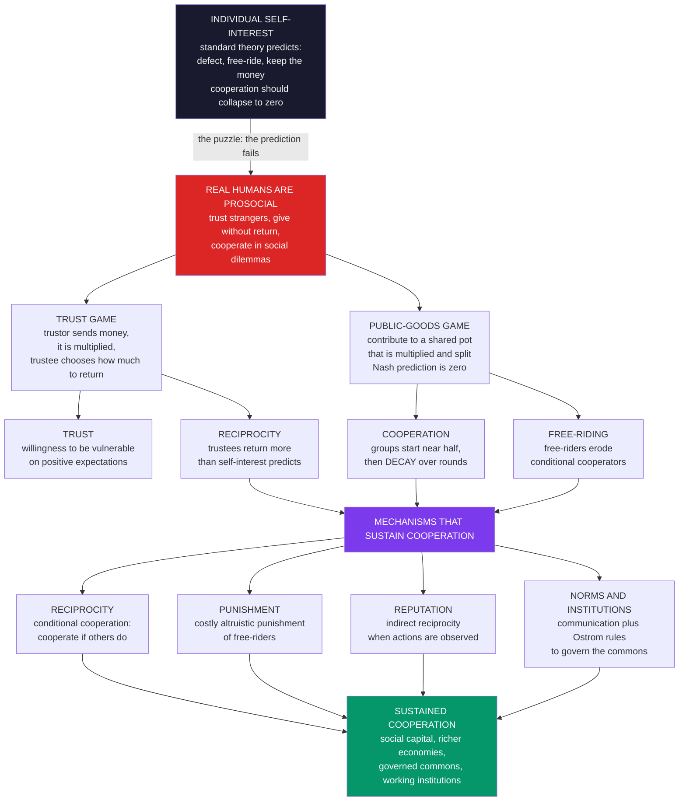

# 🤝 Trust, Altruism, and Cooperation

> [!abstract] TL;DR
> **Trust, altruism, and cooperation** are the prosocial behaviors that pure self-interest cannot easily explain but that behavioral economics documents and dissects. In the **trust (investment) game**, a trustor sends money that gets multiplied and a trustee chooses how much to return; people **trust** — sending far more than self-interest predicts — and trustees **reciprocate**. In **dictator** and charitable settings people **give** with no strategic reason (**pure** altruism versus **warm-glow / impure** altruism, à la Andreoni). In **social dilemmas** — the **public-goods game**, common-pool resources, the tragedy of the commons — individual free-riding conflicts with collective benefit; standard theory predicts **zero** cooperation, yet real groups start near **half** and **decay** over rounds as **conditional cooperators** withdraw in response to free-riders. Cooperation is **rescued** by reciprocity, reputation (indirect reciprocity), communication, norms/institutions (Ostrom), and above all **costly altruistic punishment** (the Fehr–Gächter result). These behavioral foundations are enormously consequential: high-**trust** societies are richer and grow faster (trust as social capital that lowers transaction costs), **monetary incentives can backfire** by crowding out moral motivation (the Israeli day-care fine; Titmuss's blood puzzle), and understanding human cooperation is essential for governing the commons (climate, fisheries), building institutions, and designing organizations.

---

## Intuition

**Analogy:** Imagine handing a total stranger a fistful of your money in a game, knowing full well they could simply pocket it and walk away — and knowing you will never see them again. Standard economics has a crisp prediction: *give nothing*, because a rational stranger will keep everything, so a rational you should anticipate that and hand over zero. Yet in laboratories around the world, most people hand over a large chunk anyway, betting the stranger will reciprocate — and most strangers, unprompted and unpunishable, give a fair share back.

That laboratory scene is a compressed portrait of ordinary life. Every day we trust waiters with our credit cards, drivers to stay in their lanes, plumbers to fix rather than sabotage the pipes, and businesses to honor deals — mostly among people we will never deal with again. This dense web of trust and cooperation is the *invisible infrastructure of prosperity*: economies with more of it are demonstrably richer, because trust lets contracts, credit, and trade proceed without ruinously expensive enforcement. And yet the textbook agent — coldly self-interested — predicts the whole thing should collapse into universal defection. Understanding **why** humans trust, give, and cooperate, and **when** they don't, is one of behavioral economics' deepest and most consequential projects.

---

## How It Works

### The puzzle and the workhorse games

Standard economics builds its agent — treated at length in [[The_Rational_Actor_Model_and_Its_Limits]] — out of pure self-interest. That agent generates a stark prediction in any **social dilemma**: a situation where what is individually optimal (free-ride, defect, keep the money) is collectively ruinous. By **backward induction** and **dominance** the self-interested agent should trust no one, give nothing, and contribute zero to any shared good. Behavioral economics measures how far real humans depart from that prediction using two workhorse experiments and the mechanisms that stitch cooperation back together.

**1. Trust as measured behavior — the trust (investment) game.** A *trustor* is given an endowment and can send any part of it to a *trustee*. The sent amount is **multiplied** (typically tripled) on the way, then the trustee freely chooses how much of the enlarged pot to return. A purely self-interested trustee returns **nothing**; anticipating this, a self-interested trustor sends **nothing**, and the socially valuable multiplication never happens. In reality (Berg, Dickhaut and McCabe, 1995) trustors send about **half** their endowment and trustees return roughly what was sent. Trust here is operationalized as a **willingness to be vulnerable** based on *positive expectations* of another's behavior. It is worth separating three things the word "trust" bundles: a **preference** (I intrinsically like to cooperate), a **belief** (I expect you to be trustworthy), and a stock of **social capital** (a society-wide norm that others generally reciprocate). The trust game moves the concept from vague virtue to a number you can measure and compare across people and countries.

**2. Altruism — giving without return.** Strip out reciprocity entirely with the **dictator game**: one player simply divides a pot, the other is passive and cannot respond. Self-interest says give zero; people typically give **20 to 30 percent**. Add real-world giving — charity, volunteering, blood donation, everyday helping — and genuine other-regard is undeniable. But *why* people give is contested. **Pure altruism** means caring directly about others' welfare (a public good in the utility function). **Warm-glow / impure altruism** (Andreoni, 1989–1990) means people also enjoy the private act of giving itself — a "warm glow." The distinction is not academic: a purely altruistic donor treats government aid as a perfect substitute for private giving and should **crowd out** dollar-for-dollar; a warm-glow donor keeps giving because the glow is personal and non-substitutable. Reputation and signaling motives add a third layer — people give more when observed.

**3. The cooperation problem — the public-goods game.** The canonical social dilemma. Each of several players is given tokens and privately chooses how much to contribute to a common pot; the pot is **multiplied** and split **equally** regardless of who paid in. Because the per-person return on a contributed token is less than one (the *marginal per capita return* is below 1) but the *social* return exceeds one, the dominant-strategy Nash prediction is **zero contribution** — everyone free-rides and the group forgoes a gain it could all have shared. This is the tragedy of the commons in miniature (overfishing, congestion, climate). Real groups instead **start at roughly 40 to 60 percent** cooperation — and then, over repeated rounds, contributions **decay** steadily toward the free-riding prediction. The decay is not people "learning to be rational"; it is **conditional cooperators** (see below) withdrawing in disappointment as they watch free-riders enjoy the pot without paying in.

### Types, decay, and the mechanisms that rescue cooperation

People are **heterogeneous** (Fischbacher, Gächter and Fehr, 2001): a majority are **conditional cooperators** who cooperate *if others do*, a substantial minority are **free-riders / rational egoists**, and a few are unconditional altruists. Put them together and the dynamics are tragic-but-predictable: conditional cooperators start generous, free-riders drag down the average, conditional cooperators respond by giving less next round, which lowers the average further — a downward spiral that produces the classic decay curve. Cooperation is thus **fragile** but, crucially, **repairable**. The human toolkit for solving social dilemmas — which maps onto evolutionary game theory's rules for the [[Direct_Reciprocity_and_Repeated_Games|evolution of cooperation]] — includes:

- **Reciprocity / conditional cooperation** — "I cooperate as long as you do." In repeated settings this stabilizes cooperation (the folk-theorem logic of [[Repeated_Games_and_Folk_Theorems]]).
- **Punishment of free-riders** — the headline result. When players are allowed to **pay a cost to punish** low contributors, cooperation stops decaying and instead **rises and stays high** (Fehr and Gächter, 2000, 2002). This is **altruistic punishment**: punishing is individually costly and benefits the *group*, yet people do it out of anger at unfairness — and its mere threat keeps free-riders in line.
- **Reputation / indirect reciprocity** — when actions are observed and remembered, people cooperate to protect a reputation worth having (the mechanism of [[Indirect_Reciprocity_and_Reputation]]).
- **Communication** — even non-binding "cheap talk" before play sharply raises cooperation by coordinating expectations and activating norms.
- **Norms and institutions** — Elinor Ostrom's field work on real commons (irrigation, fisheries, forests) distilled **design principles** — clear boundaries, graduated sanctions, monitoring, conflict resolution — under which communities govern shared resources sustainably without either privatization or top-down state control.



---

## Key Concepts

### Secondary Level

**Trust, in one game.** Imagine you can send some of your pocket money to a stranger. Whatever you send gets *tripled* on the way, and then the stranger decides how much to send back. If everyone were purely selfish, you'd send nothing and get nothing — and the tripling would be wasted. But most people send about half and trust the stranger to be fair, and most strangers send a fair amount back. That leap of faith is **trust**, and giving back is **reciprocity**.

**Giving for no reward.** Sometimes people give money away when there is *nothing* to gain — no return, no reward, no one watching. That's **altruism**. Part of it is genuinely caring about others; part is the plain good feeling of giving, which scientists call the **warm glow**.

**The sharing problem.** Now imagine four friends each put money into a shared jar that gets doubled and split evenly. The group is best off if everyone pays in — but each person is personally tempted to pay nothing and still grab a share of the doubled jar. That temptation is **free-riding**, and it is why shared things (clean parks, honest taxes, unpolluted air) are hard to keep going. Amazingly, real groups start out cooperating a lot — and only fall apart when a few free-riders spoil it. The fix that works best is letting people **punish** the free-riders, even at a small cost to themselves.

**Why it matters.** Places where people trust each other are richer, because you don't need a lawyer and a bodyguard for every handshake. Trust is the *oil* that keeps an economy running smoothly.

### Undergraduate Level

**The trust game formalized.** Trustor holds endowment $S$, sends $m \in [0, S]$; the trustee receives $km$ (multiplier $k$, usually 3) plus their own endowment, and returns $r \in [0, km]$. The **subgame-perfect** prediction under self-interest is $r^* = 0$, hence $m^* = 0$ — the efficient trade never occurs, a pure [[Public_Goods|efficiency loss]]. Berg et al. (1995) found mean $m \approx 0.5 S$ and mean $r$ roughly equal to $m$: substantial **trust** and **reciprocity**. Decompose trust into a **social preference** (intrinsic taste for cooperating/being kind), a **belief** about the trustee's trustworthiness (so measured "trust" mixes preference and expectation — a key identification problem), and **generalized trust** as social capital.

**Altruism: pure versus warm-glow.** Model a donor's utility as $U = u(x_i) + \alpha\, G + \beta\, g_i$, where $x_i$ is private consumption, $G$ is the *total* supply of the public good/others' welfare (pure altruism, weight $\alpha$), and $g_i$ is the donor's *own* gift (warm glow, weight $\beta$). Pure altruism ($\beta = 0$) predicts near-complete **crowding out** of private giving by government provision and by others' gifts; the robust empirical finding of only **partial** crowd-out is the classic evidence for warm glow (Andreoni). This is why matching grants and "your gift buys a bed net" appeals work — they amplify the private warm glow, not just the public total.

**The public-goods game.** $n$ players, endowment $E$, each contributes $c_i$; the pot $\sum c_i$ is multiplied by $r$ (with $1 < r < n$) and split equally. Payoff $\pi_i = E - c_i + \frac{r}{n}\sum_j c_j$. Since the **marginal per capita return** $\text{MPCR} = r/n < 1$, contributing is dominated ($\partial\pi_i/\partial c_i = \text{MPCR} - 1 < 0$), so the unique Nash equilibrium is $c_i = 0$ for all $i$ — yet the social optimum is full contribution because $r > 1$. Experiments reliably show **initial cooperation of 40 to 60 percent** followed by **decay** over ~10 rounds. Fischbacher et al.'s "strategy method" showed the decay is driven by **conditional cooperators** (the modal type) reacting to free-riders, not by everyone being selfish.

**What rescues cooperation.** Fehr and Gächter (2000) added a second stage in which players pay to punish others. Without punishment, contributions decay; **with punishment, they climb toward full cooperation and stay there**, because free-riders anticipate sanctions and conditional cooperators feel safe contributing. The punishment is *altruistic* — costly to the punisher, beneficial to the group — and points to **negative reciprocity** (the willingness to sacrifice to hurt the unfair) as the enforcement engine behind [[Social_Capital_and_Trust|social norms]]. Reputation ([[Indirect_Reciprocity_and_Reputation]]), communication, and Ostrom's institutional design principles are complementary rescues. These are the behavioral cousins of the social-preference results in the ultimatum game (see the not-yet-written sibling *Social_Preferences_Fairness_and_Reciprocity*) and of the norm-enforcement themes in the sibling *Social_Norms_and_Conformity*.

### Graduate Level

**The economics of trust: trust as an engine of prosperity.** The most consequential macro finding is that **generalized trust predicts growth**. Knack and Keefer (1997, *QJE*) and Zak and Knack (2001) show that societies and regions with higher survey-measured trust grow faster and are richer, controlling for the usual suspects; a plausible channel is that trust **lowers transaction costs** — less need for contracts, collateral, monitoring, litigation, and bribery — enabling more trade, credit, and investment. Trust is the leading component of **social capital** (Putnam), the networks and norms that let people act collectively. The stakes of this intangible are enormous: differences in trust can rationalize a meaningful share of cross-country income differences. Caveat: causality runs both ways (prosperity and good institutions build trust), and trust is entangled with formal **institutions**, corruption, and the rule of law — trust and institutions are substitutes in some accounts and complements in others.

**When incentives backfire: crowding out intrinsic motivation.** A profound policy lesson is that **monetary incentives can be counterproductive** by displacing moral or intrinsic motivation. Gneezy and Rustichini's (2000) "A Fine Is a Price": Israeli day-care centers that fined late-pickup parents saw lateness **increase** — the fine reframed a moral obligation as a *priced transaction* parents could simply buy, and the norm did not return even after the fine was removed. Titmuss's (1970) argument that **paying** for blood donations *reduces* the quantity and quality of supply — by turning a gift relationship into a market one and driving out altruistic donors — is the founding parable. Bowles ("moral economy") and Sandel ("what money can't buy") generalize: markets and monetary incentives are not motivationally neutral; they can erode the very civic and moral dispositions cooperation depends on. This crowding-out result is a crucial counterweight to naïve incentive design and a bridge to the sibling notes *Nudges_and_Choice_Architecture* and *Behavioral_Public_Policy_and_Libertarian_Paternalism*.

**Explaining cooperation: proximate and ultimate.** The *proximate* account is heterogeneous social preferences plus reciprocity and norm-enforcement (Fehr–Schmidt inequity aversion, reciprocity models). The *ultimate* (evolutionary) account asks how such preferences could evolve when free-riding pays; answers include **direct reciprocity** (repeated interaction), **indirect reciprocity** (reputation), **network/spatial** structure, **kin selection**, and **group / multilevel selection** — the five rules catalogued in evolutionary game theory ([[Group_and_Multilevel_Selection]], [[The_Prisoners_Dilemma_and_Cooperation]]). "Strong reciprocity" — a disposition to reward cooperators and punish defectors even at a net personal cost with no future payoff — is the contested but influential hypothesis linking the lab findings to gene–culture coevolution.

**Frontiers and caveats.** Effect sizes and cooperation levels are **culturally variable** (cross-cultural public-goods and ultimatum studies show large differences, and some societies practice *antisocial punishment* — punishing high contributors — which destroys the welfare gains of sanctioning). One-shot versus repeated, anonymous versus observed, and framing all move the numbers. Much of the classic evidence is from WEIRD undergraduate samples, and field-experiment effect sizes often shrink relative to the lab — the same external-validity discipline discussed in [[Behavioral_Economics_Overview]].

---

## Python Demo

```python
import numpy as np
import matplotlib
matplotlib.use("Agg")
import matplotlib.pyplot as plt

# ----------------------------------------------------------------------
# TRUST, ALTRUISM, AND COOPERATION -- three classic behavioral results.
#
#  (a) REPEATED PUBLIC-GOODS GAME.  Players contribute to a common pot
#      that is MULTIPLIED and split equally.  The selfish/Nash prediction
#      is ZERO contribution (free-ride), but real groups start ~50% and
#      DECAY toward free-riding as conditional cooperators withdraw in
#      response to free-riders.
#  (b) COSTLY PUNISHMENT reverses the decay: letting cooperators pay to
#      punish free-riders SUSTAINS high cooperation (altruistic punishment,
#      the Fehr-Gaechter result) -- even though punishing is individually
#      costly.
#  (c) THE TRUST GAME.  A trustor SENDS money (trust) that is tripled;
#      the trustee RETURNS some of it (reciprocity).  Both far exceed the
#      self-interested prediction of zero.
# ----------------------------------------------------------------------

rng = np.random.default_rng(42)

# ---- Public-goods game parameters ----
E     = 20.0        # per-round endowment (tokens)
n     = 4           # group size
r     = 1.6         # multiplication factor for the common pot
MPCR  = r / n       # marginal per-capita return = 0.40  (<1 -> free-ride dominates)
T     = 10          # rounds
G     = 500         # independent groups (for smooth averages)
p_cc  = 0.60        # ~60% conditional cooperators (Fischbacher et al. 2001)

def simulate_pgg(punishment):
    """Agent-based repeated public-goods game. Returns contributions
    array of shape (G, T, n) as token amounts in [0, E]."""
    contrib = np.zeros((G, T, n))
    is_cc = rng.random((G, n)) < p_cc          # True = conditional cooperator
    # Round 0: conditional cooperators start cooperative (~50% of E),
    # free-riders start near zero.
    contrib[:, 0, :] = np.where(
        is_cc, rng.uniform(0.40, 0.60, (G, n)) * E,
               rng.uniform(0.00, 0.10, (G, n)) * E)
    for t in range(1, T):
        prev = contrib[:, t - 1, :]                       # (G, n)
        # each player observes the mean of the OTHER n-1 players last round
        others_mean = (prev.sum(1, keepdims=True) - prev) / (n - 1)
        if not punishment:
            # Conditional cooperators match others but with a self-serving
            # downward bias -> the group spirals toward free-riding.
            new_cc = np.clip(0.75 * others_mean, 0, E)
            new_fr = np.clip(0.60 * prev, 0, E)           # free-riders drift to 0
        else:
            # Costly punishment makes free-riding expensive: free-riders climb
            # toward the norm and conditional cooperators stop withdrawing.
            norm   = 0.55 * E
            new_cc = np.clip(0.5 * others_mean + 0.5 * norm, 0, E)
            new_fr = np.clip(prev + 0.35 * (norm - prev), 0, E)
        contrib[:, t, :] = np.where(is_cc, new_cc, new_fr)
    return contrib

c_no  = simulate_pgg(punishment=False)
c_pun = simulate_pgg(punishment=True)

coop_no  = 100 * c_no.mean(axis=(0, 2))  / E      # % of endowment contributed, per round
coop_pun = 100 * c_pun.mean(axis=(0, 2)) / E

# Efficiency = total public good produced per group (sum of contributions).
eff_no  = c_no.sum(2).mean(0)                      # mean group pot per round
eff_pun = c_pun.sum(2).mean(0)

# ---- (c) Trust (investment) game ----
# Trustor endowment S; sends fraction 'sent_frac' (trust); amount is TRIPLED;
# trustee returns fraction 'ret_frac' of the tripled pot (reciprocity).
S   = 10.0
N   = 4000
mult = 3.0
sent_frac = rng.beta(3.0, 3.0, N)                  # mean ~0.50 -> substantial trust
sent      = sent_frac * S
tripled   = mult * sent
ret_frac  = rng.beta(2.2, 4.5, N)                  # mean ~0.33 of the tripled pot
returned  = ret_frac * tripled

print("=" * 64)
print("PUBLIC-GOODS GAME  (Nash prediction = 0% contribution)")
print("=" * 64)
print(f"round 1 contribution      : {coop_no[0]:5.1f}% of endowment")
print(f"round {T} WITHOUT punishment: {coop_no[-1]:5.1f}%   <- decayed toward free-riding")
print(f"round {T} WITH punishment   : {coop_pun[-1]:5.1f}%   <- sustained cooperation")
print("-" * 64)
print("TRUST GAME  (self-interest prediction: send 0, return 0)")
print(f"mean amount SENT (trust)      : ${sent.mean():4.2f} of ${S:.0f}"
      f"   ({100*sent.mean()/S:.0f}% of endowment)")
print(f"mean amount RETURNED (recipr.): ${returned.mean():4.2f}")
print(f"trustor net gain vs keeping   : ${(S - sent + returned).mean() - S:+4.2f}"
      f"   (trust pays on average)")

# ------------------------------- FIGURE -------------------------------
fig, ax = plt.subplots(2, 2, figsize=(13.5, 9.5))
fig.suptitle("Trust, Altruism, and Cooperation: decay, punishment-rescue, and trust",
             fontsize=13, fontweight="bold")

rounds = np.arange(1, T + 1)

# Panel (0,0): cooperation decay vs rescue
ax[0, 0].plot(rounds, coop_no,  "o-", color="#dc2626", lw=2.4,
              label="without punishment (decays)")
ax[0, 0].plot(rounds, coop_pun, "s-", color="#059669", lw=2.4,
              label="with punishment (sustained)")
ax[0, 0].axhline(0, color="black", ls="--", lw=1.3, label="Nash prediction = 0")
ax[0, 0].set_ylim(-5, 65)
ax[0, 0].set_title("Public-goods cooperation:\nDECAY vs PUNISHMENT-RESCUE")
ax[0, 0].set_xlabel("round"); ax[0, 0].set_ylabel("contribution (% of endowment)")
ax[0, 0].legend(fontsize=8.5); ax[0, 0].grid(alpha=0.25)

# Panel (0,1): efficiency (public good produced) per round
ax[0, 1].bar(rounds - 0.18, eff_no,  width=0.36, color="#fca5a5",
             label="without punishment")
ax[0, 1].bar(rounds + 0.18, eff_pun, width=0.36, color="#6ee7b7",
             label="with punishment")
ax[0, 1].set_title("Public good produced per group\n(punishment raises group welfare)")
ax[0, 1].set_xlabel("round"); ax[0, 1].set_ylabel("total contributions (tokens)")
ax[0, 1].legend(fontsize=8.5); ax[0, 1].grid(axis="y", alpha=0.25)

# Panel (1,0): trust game -- amount sent (trust)
ax[1, 0].hist(sent, bins=40, color="#2563eb", alpha=0.75)
ax[1, 0].axvline(0, color="black", ls="--", lw=1.5,
                 label="self-interest: send 0")
ax[1, 0].axvline(sent.mean(), color="#f59e0b", lw=2.2,
                 label=f"mean sent = ${sent.mean():.2f}")
ax[1, 0].set_title("Trust game: amount SENT by trustors\n(trust far exceeds zero)")
ax[1, 0].set_xlabel("amount sent ($ of $10)"); ax[1, 0].set_ylabel("count")
ax[1, 0].legend(fontsize=8.5)

# Panel (1,1): reciprocity -- returned vs sent
ax[1, 1].scatter(sent, returned, s=6, alpha=0.20, color="#7c3aed")
grid = np.linspace(0, S, 50)
ax[1, 1].plot(grid, grid, "--", color="#dc2626", lw=1.8,
              label="break-even (return = sent)")
# fit reciprocity slope
b, a = np.polyfit(sent, returned, 1)
ax[1, 1].plot(grid, a + b * grid, color="#059669", lw=2.4,
              label=f"reciprocity fit (slope {b:.2f})")
ax[1, 1].set_title("Reciprocity: amount RETURNED rises with trust")
ax[1, 1].set_xlabel("amount sent ($)"); ax[1, 1].set_ylabel("amount returned ($)")
ax[1, 1].legend(fontsize=8.5); ax[1, 1].grid(alpha=0.25)

plt.tight_layout(rect=[0, 0, 1, 0.95])
plt.savefig("trust_altruism_cooperation.png", dpi=115, bbox_inches="tight")
plt.show()
```

**What the demo shows:**

- **Panel (top-left) — decay vs rescue.** Both regimes start near **50 percent** cooperation, well above the Nash prediction of **zero**. *Without* punishment, conditional cooperators withdraw as free-riders exploit them and contributions **decay** round after round toward free-riding. *With* costly punishment, free-riders anticipate sanctions and climb toward the norm, so cooperation is **sustained near the top** — the signature Fehr–Gächter reversal, even though punishing is individually costly (altruistic punishment).
- **Panel (top-right) — efficiency.** Because contributions are the public good, the with-punishment groups produce a **larger common pot** in later rounds: sanctioning is privately costly but socially productive, raising overall group welfare.
- **Panel (bottom-left) — trust.** Trustors send about **half** their endowment on average — a mountain of behavior sitting exactly where self-interest says there should be a spike at zero.
- **Panel (bottom-right) — reciprocity.** The amount returned rises with the amount sent (positive slope), and much of the mass sits near or above the **break-even line**, so trust pays on average — trustees **reciprocate** rather than exploit, exactly as Berg et al. found.

---

## Real-World Applications

> **Example (economic development and institutions):** Generalized **trust** is one of the most powerful correlates of national prosperity. High-trust societies (Scandinavia, the Netherlands) sustain more anonymous exchange, credit, and complex contracting because trust **lowers transaction costs** — you need fewer lawyers, less collateral, and less monitoring to do business. Low-trust environments substitute costly enforcement (elaborate contracts, bribery, family-only dealing) that throttles growth. This is why "trust is the lubricant of the economy," and why building trustworthy **institutions** (courts, property rights, low corruption) is a first-order development priority — the theme running through [[Social_Capital_and_Trust]] and the political-economy of collective action.

> **Example (governing the commons):** Elinor Ostrom's Nobel-winning field research showed that real communities — Swiss alpine pastures, Nepali irrigation systems, Maine lobster fisheries — solve tragedy-of-the-commons dilemmas **without** privatization or central control, using locally evolved norms: boundaries, monitoring, graduated sanctions, and conflict resolution. The behavioral ingredients (conditional cooperation plus credible punishment) are exactly the lab mechanisms scaled up. The stakes are civilizational for the biggest commons of all — **climate**, fisheries, and freshwater — where cooperation, monitoring, and sanctioning must be engineered across nations (see [[Climate_Politics_and_Environmental_Governance]]).

> **Example (charity and public-goods provision):** The **warm-glow** result reshapes fundraising and policy. Because giving is partly about the private glow, government provision only **partially** crowds out private donations, and appeals that make the gift feel personal and efficacious ("your $50 buys three bed nets"), matching grants, donor recognition, and social visibility all raise giving. Blood-donation systems deliberately rely on **unpaid** altruistic donors precisely because Titmuss's insight warns that paying can crowd out and degrade supply.

> **Example (organizations, teams, and incentive design):** Cooperation, trust, and reciprocity are the glue of high-performing teams — but the **crowding-out** lesson warns managers that monetary incentives can backfire, turning intrinsic professional or moral motivation into a transaction. Piece-rate schemes, surveillance, and fines can erode the very cooperative norms they were meant to enforce (the day-care fine that *increased* lateness). Effective design blends thin extrinsic incentives with strong norms, reputation, and peer accountability rather than trying to price every behavior.

> **Example (tax compliance and civic behavior):** Paying taxes is a giant public-goods game. Compliance depends heavily on **conditional cooperation** ("I pay if I believe others pay and the state is fair") and on perceived legitimacy, which is why norm-based reminders ("9 out of 10 people already paid") and visible enforcement of free-riders outperform appeals to pure self-interest.

---

## Common Pitfalls

- **Reading cooperation as irrationality (or as proof of pure selfishness).** Neither caricature fits. People are **conditionally** cooperative — generous *when others reciprocate* and quick to withdraw when exploited. Modeling humans as either angels or knaves both miss the reactive, reciprocal structure that actually drives the data.
- **Assuming trust surveys measure a preference.** Behavioral "trust" (amount sent) conflates a *taste* for cooperation with a *belief* about the trustee's trustworthiness (and with risk attitude). Two people who send the same amount may differ entirely in whether they *like* cooperating or merely *expect* a good return — a genuine identification problem that muddies cross-country comparisons.
- **Expecting punishment to be a free lunch.** Costly punishment sustains cooperation, but it is **costly** and can be socially wasteful if misdirected. In some cultures **antisocial punishment** (sanctioning *high* contributors) appears and destroys the welfare gains. Sanctioning institutions must be legitimate and well-targeted, or they backfire.
- **Ignoring crowding-out when designing incentives.** The single most expensive mistake in applied work: bolting a monetary incentive onto a behavior that was intrinsically or morally motivated, and thereby **destroying** the motivation you relied on (the fine that becomes a price). Always ask whether an incentive will *add to* or *displace* existing moral/intrinsic motivation.
- **Over-generalizing from WEIRD lab samples and one-shot games.** Cooperation levels vary sharply with culture, stakes, anonymity, repetition, framing, and observation. A one-shot anonymous result does not license claims about repeated, reputation-rich real-world settings — and field effect sizes often shrink relative to the lab.
- **Conflating trust's correlation with growth for clean causation.** High-trust societies are richer, but prosperity, good institutions, and trust co-evolve. Treating "just add trust" as a growth lever ignores the institutional scaffolding (rule of law, low corruption) that trust both depends on and reinforces.

---

## Related Concepts

- [[Behavioral_Economics_Overview]] — the parent map; trust, altruism, and cooperation are the "social preferences" pillar that dismantles the pure-self-interest assumption.
- [[The_Rational_Actor_Model_and_Its_Limits]] — the self-interest benchmark whose stark "cooperate never, give nothing" prediction these prosocial findings falsify.
- [[Public_Goods]] — the microeconomics of non-excludable, non-rival goods and the free-rider problem that the public-goods game operationalizes in the lab.
- [[Externalities_and_Pigouvian_Tax]] — the market-failure framing of social dilemmas that cooperation, norms, and punishment address bottom-up.
- [[Coase_Theorem]] — the alternative claim that private bargaining can resolve externalities; trust and low transaction costs are exactly what make Coasean deals feasible.
- [[The_Prisoners_Dilemma_and_Cooperation]] — the two-player kernel of every social dilemma and the evolutionary account of how cooperation can emerge.
- [[Direct_Reciprocity_and_Repeated_Games]] — reciprocity and the folk-theorem logic ("cooperate if you do") that stabilizes cooperation in repeated interaction.
- [[Indirect_Reciprocity_and_Reputation]] — how reputation sustains cooperation when actions are observed, one of the rescues catalogued here.
- [[Group_and_Multilevel_Selection]] — the ultimate/evolutionary explanation for altruism and strong reciprocity when free-riding pays individually.
- [[Repeated_Games_and_Folk_Theorems]] — the game-theoretic foundation for why cooperation is an equilibrium once interactions repeat.
- [[Nash_Equilibrium]] — the solution concept that predicts zero contribution / zero trust, i.e., the benchmark the behavior violates.
- [[Bargaining_Theory]] — the formal backdrop to fairness, reciprocity, and the division problems inside trust and dictator games.
- [[Prosocial_Behavior]] — Psychology's account of helping, altruism, and cooperation and their situational and dispositional drivers.
- [[Kin_Selection_and_Altruism]] — the evolutionary-psychology route to altruism via inclusive fitness, complementing reciprocity-based explanations.
- [[Social_Capital_and_Trust]] — Sociology's treatment of trust, networks, and norms as the social infrastructure that behavioral trust games measure at the micro level.
- [[Collective_Behavior_and_Crowds]] — how cooperation, norms, and free-riding scale up to collective action.
- [[Climate_Politics_and_Environmental_Governance]] — the largest real commons dilemma, where the mechanisms sustaining cooperation must operate across nations.
- [[Prospect_Theory]] — reference dependence and loss aversion that also shape how people perceive unfair splits and losses in these games.

*Not yet written (Behavioral_Economics siblings referenced above in prose): Social_Preferences_Fairness_and_Reciprocity, Social_Norms_and_Conformity, Nudges_and_Choice_Architecture, Behavioral_Public_Policy_and_Libertarian_Paternalism.*

---

## Review Questions

### Secondary

1. In the trust game, a purely selfish person would send **nothing** because they expect to get nothing back. Explain in your own words why most real people send about half anyway — and why the strangers usually send some back.
2. Four roommates share a jar that gets doubled and split evenly. Why is each roommate tempted to put in nothing while still taking a share, and what happens to the jar if everyone gives in to that temptation? Name one thing that would keep people contributing.
3. A day-care center starts fining parents who pick up their kids late — and lateness goes *up*, not down. Give a plausible reason why adding a money penalty made the problem worse.

### Undergraduate

1. Write down the payoff function for a linear public-goods game and show algebraically why zero contribution is the dominant-strategy Nash equilibrium even though full contribution is socially optimal. Then explain, using the concept of **conditional cooperators**, why real groups start near 50 percent and *decay* rather than starting at zero.
2. Distinguish **pure** altruism from **warm-glow (impure)** altruism, and derive the different predictions each makes about how government provision of a public good crowds out private donations. Which prediction does the evidence favor, and why does it matter for fundraising design?
3. Explain how costly **altruistic punishment** rescues cooperation in the public-goods game (Fehr–Gächter). Why is it called "altruistic," and what does its existence imply about the assumption that people are purely self-interested?

### Graduate

1. Cross-country studies find that generalized trust predicts economic growth. Lay out the causal channel (transaction costs, contracting, credit), then critique the causal claim: how might reverse causality and omitted institutional variables (rule of law, corruption) confound the trust–growth relationship, and what identification strategy could help separate them?
2. Evaluate the "strong reciprocity" hypothesis — a disposition to reward cooperators and punish defectors even at net personal cost with no future benefit. What lab evidence supports it, what evolutionary mechanisms (direct/indirect reciprocity, network structure, group selection) could sustain it, and what does *antisocial punishment* across cultures imply for its universality and welfare consequences?
3. A government wants to raise a prosocial behavior (blood donation, tax compliance, vaccination) and is choosing between a **monetary incentive**, a **norm-based nudge**, and a **sanctioning institution**. Using crowding-out theory, conditional cooperation, and the external-validity gap between lab and field, analyze when each tool helps and when it backfires, and design a policy that combines them without eroding intrinsic motivation.

---

## Sources

- [Berg, J., Dickhaut, J. & McCabe, K. (1995). "Trust, Reciprocity, and Social History." *Games and Economic Behavior*, 10(1), 122–142](https://doi.org/10.1006/game.1995.1027)
- [Fehr, E. & Gächter, S. (2000). "Cooperation and Punishment in Public Goods Experiments." *American Economic Review*, 90(4), 980–994](https://doi.org/10.1257/aer.90.4.980)
- [Fischbacher, U., Gächter, S. & Fehr, E. (2001). "Are People Conditionally Cooperative? Evidence from a Public Goods Experiment." *Economics Letters*, 71(3), 397–404](https://doi.org/10.1016/S0165-1765(01)00394-9)
- [Andreoni, J. (1990). "Impure Altruism and Donations to Public Goods: A Theory of Warm-Glow Giving." *The Economic Journal*, 100(401), 464–477](https://doi.org/10.2307/2234133)
- [Gneezy, U. & Rustichini, A. (2000). "A Fine Is a Price." *The Journal of Legal Studies*, 29(1), 1–17](https://doi.org/10.1086/468061)
- [Ostrom, E. (1990). *Governing the Commons: The Evolution of Institutions for Collective Action*. Cambridge University Press](https://doi.org/10.1017/CBO9780511807763)
- [Zak, P. J. & Knack, S. (2001). "Trust and Growth." *The Economic Journal*, 111(470), 295–321](https://doi.org/10.1111/1468-0297.00609)

---

#behavioral-economics #trust #altruism #cooperation #public-goods
