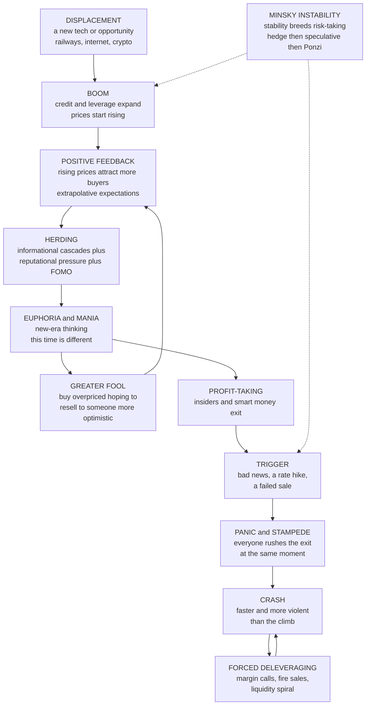

# 🫧 Herding, Bubbles, and Crashes

> [!abstract] TL;DR
> **Herding** — following the crowd via **informational cascades**, **reputational** pressure, and **FOMO** rather than one's own information — drives asset prices away from fundamentals and powers the recurring cycle of **bubbles** and **crashes**. Displacement and euphoria fuel a self-reinforcing, **greater-fool** run-up (tulips, dot-com, 2008 housing, crypto) that detaches price from value, until a trigger sparks a **panic** and a crash *faster and more violent than the climb*, amplified by **leverage** and **liquidity spirals**. Understanding these herd-driven, **Minsky**-style instability dynamics — and the fragility of a confident crowd consensus that rests on almost no independent information — is essential to explaining financial crises, systemic risk, and the perennial folly of "this time is different."

---

## Intuition

**Analogy:** In 1637, a single tulip bulb in Holland sold for more than a canal house — then the price collapsed to near zero in a matter of weeks. From tulips to dot-coms to crypto, the same drama replays: prices detach from any sane value as everyone piles in, terrified of missing out, each buyer betting they will sell to a **greater fool** before the music stops. Then confidence cracks, the herd stampedes for the exit, and the crash is faster and more violent than the climb.

Bubbles and crashes are the market's manic-depressive cycle — driven not by fundamentals (earnings, rents, cash flows) but by the *contagious human emotions* of greed, fear, and the irresistible urge to follow the crowd. The chilling part is how *rational* each individual step can feel. When you see thousands of people buying, the sensible inference is that they must know something you don't — so you buy too, adding one more body to a stampede that itself contains almost no independent information.

---

## How It Works

### Core Mechanics

1. **Herding is imitation in place of independent analysis.** To herd is to copy others' *actions* — buying because others buy, selling because others sell — rather than acting on your own signal or valuation. It is a central force in markets because it makes decisions *correlated*: instead of thousands of independent errors that wash out, you get one giant, aligned error that pushes price far from fundamental value and *amplifies* both booms and busts. The same mechanism runs fashion, viral trends, restaurant queues, and bank runs.

2. **Why people herd — four distinct engines, some rational, some not.**
   - **Informational cascades.** Under uncertainty it can be *individually rational* to infer that the crowd knows something you don't and to copy them — even when doing so means overriding your own private signal. This is the deepest and most surprising mechanism, formalized below.
   - **Reputational / career herding.** Professional money managers herd to avoid being *wrong alone*: "it is better to fail conventionally than to succeed unconventionally." If you underperform while everyone else does too, you keep your job; if you take a lonely contrarian bet and it fails, you are fired. Keynes' **beauty contest** captures it — the winning strategy is not to pick the prettiest face but to guess *whom everyone else will pick*, i.e. to forecast the average opinion about the average opinion.
   - **FOMO and emotional contagion.** Fear of missing out, greed, envy of visibly enriched neighbors, and social proof spread mood through a market like a virus, overriding deliberate valuation. This is the *irrational* root, tied to conformity and the social biases treated in [[Social_Norms_and_Conformity]].
   - **Payoff / positive-feedback herding.** Rising prices literally *reward* the buyers and *attract* more of them (trend-following, momentum, index inflows), so the act of herding is self-validating for a while — the feedback loop that inflates the bubble.

3. **Informational cascades — the crowd can be confidently, systematically wrong.** In the **Bikhchandani-Hirshleifer-Welch (1992)** model, agents decide *sequentially*, each observing predecessors' choices plus a noisy private signal. Once a short run of agents chooses the same way, the *public* evidence (two or more identical actions) outweighs any single private signal, so every subsequent agent **rationally ignores their own information and follows the herd** — a cascade. The consensus is therefore **fragile**: it rests on the private signals of only the first few movers, so a small shock, a credible dissenter, or a bit of new public information can *reverse* it wholesale. It can also **lock in the wrong outcome**: if the first two movers happen to get misleading signals, the entire crowd stampedes into the wrong choice with growing (false) confidence. "Everyone can't be wrong" is exactly backwards — because they are copying, everyone *can* be wrong at once.

4. **A bubble is a large, sustained deviation of price above fundamental value.** It is driven by self-reinforcing *expectations of further price rises* rather than by cash flows. Two behavioral engines sustain it: **extrapolation** (representativeness — projecting recent gains naively forward, "it went up 10x, why not 100x?") and the **greater-fool theory** (knowingly buying an overpriced asset because you expect to resell to someone even more optimistic before the crash). While new fools keep arriving, the strategy pays — until it doesn't.

5. **The bubble life-cycle — Kindleberger-Minsky stages.** Manias follow a recognizable arc: **displacement** (a genuine new technology or opportunity — canals, railways, the internet, crypto), **boom** with credit and leverage expansion, **euphoria / mania** (herding, new-era "this time is different" thinking, valuation metrics abandoned), **profit-taking** as insiders and smart money quietly exit, and finally **panic / crash** when a trigger sends everyone rushing for the exit at once.

6. **Minsky's financial-instability hypothesis — stability itself breeds the crash.** Hyman Minsky argued that *calm, profitable times encourage risk-taking, which breeds fragility.* Financing quietly migrates from **hedge** finance (income covers interest and principal) to **speculative** finance (income covers only interest, must roll over debt) to **Ponzi** finance (income covers neither; survival depends on asset prices rising forever). When that last stage dominates, any interruption in rising prices forces distress selling — the **Minsky moment**. The pattern is depressingly predictable *in kind*, even if its timing is not.

7. **Crashes are faster and more violent than the run-up — the asymmetry of manias and panics.** Fear is more acute and coordinated than greed, and **leverage forces selling**: falling prices trigger margin calls, stop-losses, and fire sales that push prices lower still, triggering more selling — a **liquidity spiral** and positive-feedback *downward*. **Bank runs** (and their shadow-banking cousins) are the extreme case: the **Diamond-Dybvig (1983)** model shows a run is a *coordination failure* with two equilibria — if everyone believes others will withdraw, withdrawing first is individually rational, so the panic is **self-fulfilling** even for a solvent bank. **Flash crashes** are the algorithmic, millisecond version of the same stampede.

8. **Leverage and credit are the critical amplifier.** Debt fuels the bubble (more buying power chasing the asset) and makes the crash catastrophic (forced deleveraging, margin spirals, insolvency, and **contagion** as fire sales mark down everyone's collateral). Credit cycles ride beneath asset cycles, which is why **debt-fueled** bubbles — the 2008 US housing bubble above all — are far more dangerous than equity manias funded with cash.

9. **Can bubbles be identified? — the open debate.** **Eugene Fama** argues bubbles are only "obvious" in hindsight, hard to define, and impossible to predict — a challenge to any claim that markets are inefficient. **Robert Shiller** (who publicly warned of both the dot-com and housing bubbles) counters that markets show *excess volatility* and that valuation metrics like **CAPE** (cyclically adjusted price/earnings) *do* carry predictive signal about long-horizon returns. Theory even admits **rational bubbles**: a bubble can persist among rational agents if it can grow fast enough forever, or under greater-fool dynamics with *synchronization risk* (Abreu-Brunnermeier, 2003) — arbitrageurs know it will burst but cannot coordinate on *when*, so each rides it a little longer.

### Flow / Architecture



---

## Key Concepts

**Secondary (intuitive grasp).** A **bubble** is when the price of something — a tulip, a house, a coin — floats far above what it is really worth, purely because everyone expects it to keep rising. It inflates through **herding**: people buy because *other people are buying*, each hoping to sell to a **greater fool** before the top. The engine is emotional — **FOMO** (fear of missing out), greed, and the sense that "everyone knows something." Eventually confidence cracks, and the **crash** comes down *far faster than the price went up*, because fear moves faster than greed and people borrowed money to buy. The four most dangerous words in finance are **"this time is different."**

**Undergraduate (mechanism and named episodes).** Herding has both *rational* roots (**informational cascades** — copying because others may be informed; **reputational herding** — it is safer to be wrong with the crowd) and *behavioral* ones (social proof, emotional contagion, **extrapolation** via representativeness). Manias follow the **Kindleberger-Minsky** stages — displacement, boom, euphoria, profit-taking, panic — and the canonical episodes rhyme: **Dutch tulip mania (1637)**, the **South Sea and Mississippi bubbles (1720)**, the **1929 crash**, **Japan's 1980s asset bubble**, the **dot-com bubble (1995-2000)**, the **US housing bubble and 2008 Global Financial Crisis**, and repeated **crypto boom-busts**. **Minsky's financial-instability hypothesis** explains *why* calm breeds fragility (hedge to speculative to **Ponzi** finance). Crashes are amplified by **leverage** — margin calls and fire sales create **liquidity spirals** — and by self-fulfilling **bank runs** (Diamond-Dybvig). Reinhart and Rogoff's *This Time Is Different* documents eight centuries of the same folly.

**Graduate (models, identification, and the policy frontier).** The **Bikhchandani-Hirshleifer-Welch (1992)** cascade model shows that sequential Bayesian agents observing *actions* (not signals) enter a cascade once the public log-likelihood ratio dominates any single private signal, producing a consensus that is **information-poor and fragile** and that can be *ex-post wrong* with positive probability — the formal statement of "confidently wrong crowds." The **efficient-markets vs behavioral** debate turns on identification: **Fama** denies testable bubbles (the joint-hypothesis problem), while **Shiller's** excess-volatility tests and **CAPE**'s predictive power for long-run returns argue mispricing is real. **Rational-bubble** theory (Blanchard-Watson; Abreu-Brunnermeier **synchronization risk**, 2003) shows bubbles can survive rational arbitrageurs who cannot coordinate their exit — connecting to the **limits to arbitrage** (Shleifer-Vishny, 1997) treated in [[Market_Anomalies_and_Bubbles]]. **Brunnermeier-Pedersen (2009)** formalize the **margin/liquidity spiral** by which leverage turns a price fall into a self-amplifying crash, the microfoundation of [[Cascades_and_Systemic_Risk]]. Policy divides on whether central banks should **"lean against the wind"** (raise rates pre-emptively) or merely **"clean up"** afterward as lender of last resort; the modern consensus favors **macroprudential** tools — leverage and loan-to-value caps, countercyclical capital buffers, and **circuit breakers** — that target the herd-and-leverage machinery directly.

---

## Python Demo

```python
# Two engines of herd-driven markets, quantified.
#   (a) POSITIVE-FEEDBACK BUBBLE: price rises when demand extrapolates recent
#       gains (trend-following), so rising prices attract more buyers -> an
#       unsustainable exponential run-up, then a sharp CRASH when the feedback
#       reverses. We contrast price with fundamental value and show the crash
#       is FASTER than the rise (the greater-fool asymmetry).
#   (b) INFORMATIONAL CASCADE (Bikhchandani-Hirshleifer-Welch 1992): sequential
#       agents each see predecessors' ACTIONS plus a private signal. Once two
#       agents agree, everyone RATIONALLY ignores their own signal and HERDS --
#       a fragile cascade that can lock in the WRONG choice. We plot the
#       probability a cascade has formed, and how often it herds the WRONG way.
import numpy as np
import matplotlib.pyplot as plt

# ==================================================== (a) positive-feedback bubble
F = 100.0                 # constant fundamental value (earnings/rents unchanged)
T = 160
price   = np.empty(T)
bubble  = 0.03            # initial small overvaluation (bubble as fraction of F)
g       = 0.075           # boom growth: extrapolative demand feeds on recent gains
crash   = 0.32            # crash decay per step -- DELIBERATELY faster than boom
regime  = "boom"
peak_t  = T - 1
rng     = np.random.default_rng(7)
price[0] = F * (1 + bubble)
for t in range(1, T):
    if regime == "boom":
        # POSITIVE FEEDBACK: the bigger the bubble, the more buyers it attracts
        # (rising prices reward and recruit trend-followers) -> compounding
        bubble = bubble * (1 + g) + rng.normal(0, 0.004)
        if bubble > 3.2:                      # euphoria exhausts; greater fools run out
            regime, peak_t = "crash", t
    else:
        # herd stampedes for the exit; leverage forces selling -> faster collapse
        bubble = max(bubble * (1 - crash) - 0.01, 0.0)
    price[t] = F * (1 + bubble)

# quantify the asymmetry: steps to climb vs steps to give it all back
rise_steps  = peak_t
fall_steps  = np.argmax(price[peak_t:] <= price[0] + 1e-9)
fall_steps  = fall_steps if fall_steps > 0 else (T - 1 - peak_t)
print("=== (a) Bubble-and-crash ===")
print(f"fundamental value            : {F:6.1f}")
print(f"peak price                   : {price[peak_t]:6.1f}  (x{price[peak_t]/F:0.1f} fundamental)")
print(f"steps to inflate the bubble  : {rise_steps}")
print(f"steps to crash back to start : {fall_steps}")
print(f"crash-to-rise speed ratio    : {rise_steps/max(fall_steps,1):0.1f}x faster down")

# ==================================================== (b) informational cascade
def run_cascade(state, p=0.70, N=40, seed=0):
    """BHW sequential-herding. state=1 => adopting is correct, state=0 => rejecting.
    Agents see only predecessors' ACTIONS; a cascade starts when the public tally
    of inferred signals reaches +/-2, after which own signals are ignored."""
    r = np.random.default_rng(seed)
    score = 0                       # (# inferred-high actions) - (# inferred-low)
    cascade_at, actions = None, []
    for n in range(N):
        # private signal is correct with prob p; s=+1 leans adopt, -1 leans reject
        correct = (r.random() < p)
        s = (1 if state == 1 else -1) if correct else (-1 if state == 1 else 1)
        if score >= 2:                        # UP cascade: ignore own signal
            action = 1; cascade_at = n if cascade_at is None else cascade_at
        elif score <= -2:                     # DOWN cascade: ignore own signal
            action = 0; cascade_at = n if cascade_at is None else cascade_at
        else:                                 # informative phase: own signal reveals
            total = score + s
            action = 1 if total > 0 else 0 if total < 0 else (1 if s > 0 else 0)
            score += s                        # action reveals the private signal
        actions.append(action)
    correct_action = state
    herded_wrong = (cascade_at is not None) and (actions[-1] != correct_action)
    return cascade_at, herded_wrong

# Monte Carlo: how fast do cascades form, and how often are they WRONG?
M, N, p = 20000, 40, 0.70
cascade_start = np.full(M, N)     # if no cascade, count as "after N"
wrong = np.zeros(M, dtype=bool)
for i in range(M):
    state = int(rng.integers(0, 2))
    cs, w = run_cascade(state, p=p, N=N, seed=i)
    if cs is not None:
        cascade_start[i] = cs
    wrong[i] = w

# probability a cascade has formed by agent n
n_axis = np.arange(1, N + 1)
prob_cascade = np.array([(cascade_start < n).mean() for n in n_axis])
p_wrong = wrong.mean()
p_any   = (cascade_start < N).mean()
print("\n=== (b) Informational cascade (BHW), signal accuracy p =", p, "===")
print(f"P(a cascade forms within {N} agents) : {p_any:0.1%}")
print(f"P(the herd locks onto the WRONG action) : {p_wrong:0.1%}  <-- confidently wrong crowds")
print(f"a fragile consensus resting on only the first 1-2 signals")

# ==================================================== plots
fig, ax = plt.subplots(2, 2, figsize=(13, 9))

ax[0, 0].plot(price, color="#dc2626", lw=2.5, label="market price (bubble)")
ax[0, 0].axhline(F, color="#2563eb", ls="--", lw=2, label="fundamental value")
ax[0, 0].axvline(peak_t, color="gray", ls=":", label="euphoria peaks / trigger")
ax[0, 0].set_title("(a) Positive-feedback bubble: run-up detaches from fundamentals")
ax[0, 0].set_xlabel("time"); ax[0, 0].set_ylabel("price"); ax[0, 0].legend(fontsize=8)

# log scale exposes that the DOWN slope is steeper than the UP slope
ax[0, 1].semilogy(price, color="#7c3aed", lw=2.5)
ax[0, 1].axhline(F, color="#2563eb", ls="--", lw=2)
ax[0, 1].axvline(peak_t, color="gray", ls=":")
ax[0, 1].set_title(f"(a) Log price: crash ~{rise_steps/max(fall_steps,1):0.0f}x faster than the climb")
ax[0, 1].set_xlabel("time"); ax[0, 1].set_ylabel("price (log scale)")

ax[1, 0].plot(n_axis, prob_cascade, color="#059669", lw=2.5)
ax[1, 0].axhline(p_any, color="gray", ls=":", label=f"forms within {N}: {p_any:0.0%}")
ax[1, 0].set_title("(b) Cascade forms fast: everyone soon ignores their own signal")
ax[1, 0].set_xlabel("agent number in the sequence")
ax[1, 0].set_ylabel("probability a cascade has begun"); ax[1, 0].legend(fontsize=8)

ax[1, 1].bar(["RIGHT cascade", "WRONG cascade", "no cascade"],
             [p_any - p_wrong, p_wrong, 1 - p_any],
             color=["#059669", "#dc2626", "#9ca3af"])
ax[1, 1].set_title("(b) Fragile consensus can lock in the WRONG choice")
ax[1, 1].set_ylabel("probability across simulations")
for i, v in enumerate([p_any - p_wrong, p_wrong, 1 - p_any]):
    ax[1, 1].text(i, v + 0.01, f"{v:0.0%}", ha="center", fontsize=9)

plt.tight_layout()
plt.savefig("herding_bubbles_and_crashes.png", dpi=120)
plt.show()
```

Running it shows both signatures. The **bubble panel** starts a hair above fundamental value and, because rising prices recruit more trend-following buyers, compounds into a run-up several times fundamental value — then collapses back through the fundamental line in a small fraction of the time it took to inflate (the log-scale panel makes the steeper *down* slope unmistakable, the greater-fool asymmetry). The **cascade panels** show that a herd forms *quickly* — within a handful of agents almost everyone is ignoring their own private information — and that a non-trivial share of those confident consensuses lock onto the **wrong** action, the formal picture of how crowds can be systematically, self-assuredly wrong.

---

## Real-World Applications

> **Example (the 2008 Global Financial Crisis):** Every mechanism in this note appears at once. A **displacement** (financial innovation — securitization, subprime mortgages) met cheap credit in a **boom**; **extrapolation** ("US house prices have never fallen nationally") plus **reputational herding** (no bank could sit out a business its rivals were booking record profits on — "as long as the music is playing, you've got to get up and dance") produced a **euphoric**, heavily **leveraged** mania. **Ponzi finance** (borrowers and banks solvent only if prices kept rising) is textbook **Minsky**. When prices stalled, forced deleveraging, margin calls, and a **run** on shadow-banking repo markets became a **liquidity spiral** and system-wide **contagion** — a crash far faster and more damaging than the climb. Reinhart and Rogoff's *This Time Is Different* had, quite literally, predicted the type of event.

- **Dot-com bubble (1995-2000).** Extrapolation of internet "eyeballs" over cash flows, greater-fool IPO flipping, and "new-era" thinking drove the NASDAQ up roughly 5x, then down ~78% — the equity-market template that Shiller flagged in real time.
- **Tulip mania (1637), South Sea and Mississippi bubbles (1720).** The founding case studies proving the pattern predates modern finance; Isaac Newton, having sold early and then bought back near the top of the South Sea bubble, reportedly said he "could calculate the motions of the heavenly bodies, but not the madness of people."
- **Bank runs and deposit insurance.** The **Diamond-Dybvig** coordination-failure logic is *why* deposit insurance, a lender of last resort, and (for shadow banking in 2008 and Silicon Valley Bank in 2023) emergency liquidity facilities exist — institutional circuit breakers against self-fulfilling panics.
- **Flash crashes and circuit breakers.** The May 6, 2010 flash crash — algorithmic positive-feedback selling wiping ~$1 trillion in minutes before rebounding — motivated exchange **circuit breakers** that halt trading to interrupt the stampede.
- **Crypto boom-busts.** Repeated 2017 / 2021 manias and collapses (and the 2022 Terra-Luna and FTX failures) are pure FOMO-plus-leverage cycles on assets with contested fundamental value — the modern laboratory for herd dynamics.

These market dynamics sit atop the broader behavioral-finance program. The forthcoming siblings *Behavioral_Finance_Foundations* (why psychology moves prices at all), *Market_Anomalies_and_Limits_to_Arbitrage* (why smart money cannot always correct the herd), and *Sentiment_and_Noise_Trading* (how correlated non-fundamental demand becomes a priced risk) develop the pieces this note assembles into the bubble-crash cycle.

---

## Common Pitfalls

- **"Everyone can't be wrong."** — The single most dangerous inference in a mania. Under an informational cascade the crowd is copying, not independently confirming, so the consensus can rest on the private signals of only the first few movers. A large, confident crowd can be *systematically* wrong; volume is not validation.
- **Mistaking a bubble for a "new era."** — Every mania rationalizes itself with "this time is different" (Reinhart-Rogoff's four most dangerous words). New technology can be genuinely transformative *and* its stock still be wildly overpriced; a real displacement is exactly what makes the extrapolation feel reasonable.
- **Assuming you will exit before the crash (greater-fool hubris).** — The greater-fool trade requires selling to someone more optimistic, but everyone plans to exit first, so the exit is crowded and the crash is *faster than the rise*. Synchronization risk means even sophisticated arbitrageurs mistime the top.
- **Ignoring leverage.** — Debt turns a correction into a catastrophe via margin calls and fire-sale spirals. A cash-funded overvaluation deflates; a debt-funded one (2008 housing) triggers insolvency and contagion. Always ask *who is levered against this asset.*
- **Confusing low volatility with low risk (the Minsky trap).** — Calm periods *breed* risk-taking and fragility; the quietest markets are often the ones quietly migrating toward Ponzi finance. Stability is not safety.
- **Treating "bubbles are only obvious in hindsight" as license to do nothing.** — Fama's identification skepticism is a caution against false precision, not a proof that valuation metrics (CAPE), credit growth, and leverage carry *no* signal. Macroprudential policy acts on elevated *probabilities*, not certainties.

---

## Related Concepts

- [[Behavioral_Economics_Overview]] — the parent map; herding and bubbles are the market-scale expression of the individual biases catalogued there.
- [[Market_Anomalies_and_Bubbles]] — the Finance-vault companion on anomalies and the **limits to arbitrage** that let mispricings and bubbles survive rational traders.
- [[Social_Norms_and_Conformity]] — the conformity, social-proof, and cascade machinery underlying herding, treated as social behavior.
- [[Overconfidence_and_Calibration]] — overconfident, extrapolative traders are a core driver of the excess trading and mispricing that inflate bubbles.
- [[Availability_and_Representativeness]] — extrapolation of recent gains ("it keeps going up") is representativeness applied to price history.
- [[Cascades_and_Systemic_Risk]] — the network-contagion and liquidity-spiral models that generalize a crash into system-wide failure.
- [[Network_Dynamics_and_Contagion]] — how panic and fire sales propagate through a financial network of interlinked balance sheets.
- [[Bifurcations_and_Tipping_Points]] — the dynamical-systems view of the sudden flip from boom to crash and of the Minsky moment.
- [[Feedback_Loops_and_Causality]] — positive feedback (rising prices recruiting buyers) is the reinforcing loop at the heart of a bubble.
- [[Global_Financial_Crises]] — the macroeconomic anatomy of 2008 and other crises that these herd dynamics generate.
- [[Currency_Crises]] — self-fulfilling speculative attacks, the FX cousin of the bank-run coordination failure.
- [[Money_and_Banking]] — the credit-creation and bank-run mechanics behind leverage cycles and lender-of-last-resort policy.
- [[Collective_Behavior_and_Crowds]] — the sociology of crowds, fads, and panics, the human-scale mirror of financial manias.
- [[Social_Influence_and_Conformity]] — the psychology of Asch/Sherif conformity that underlies emotional contagion and FOMO.

*Not yet written (Behavioral_Economics siblings referenced above in prose): Behavioral_Finance_Foundations, Market_Anomalies_and_Limits_to_Arbitrage, Sentiment_and_Noise_Trading.*

---

## Review Questions

1. **(Conceptual)** Explain why an informational cascade can make a large, confident crowd *systematically wrong*, and why such a consensus is described as "fragile." In your answer, distinguish herding driven by informational cascades from herding driven by *reputational* incentives and from *FOMO*, and say which of the three is individually rational.
2. **(Scenario)** A crypto token has risen 40x in six months on no change in cash flows; retail buyers are borrowing to buy, and several fund managers privately think it is overvalued but keep buying. Using the greater-fool theory, synchronization risk, and reputational herding, explain *why the smart money keeps buying* and why the eventual crash will likely be faster and more violent than the rise. What single variable most determines whether the crash causes a broader crisis?
3. **(Trade-off / policy)** Central banks debate whether to "lean against" asset bubbles by raising rates pre-emptively or to "clean up" afterward as lender of last resort. Given Fama's identification skepticism, Shiller's excess-volatility evidence, and Minsky's instability hypothesis, argue for a macroprudential middle path and name two specific tools that target the *herd-and-leverage* machinery rather than the price itself.

---

## Sources

- Kindleberger, C. P. & Aliber, R. Z. (2015). *Manias, Panics, and Crashes: A History of Financial Crises* (7th ed.). Palgrave Macmillan.
- Bikhchandani, S., Hirshleifer, D. & Welch, I. (1992). "A Theory of Fads, Fashion, Custom, and Cultural Change as Informational Cascades." *Journal of Political Economy*, 100(5), 992–1026.
- Diamond, D. W. & Dybvig, P. H. (1983). "Bank Runs, Deposit Insurance, and Liquidity." *Journal of Political Economy*, 91(3), 401–419.
- Shiller, R. J. (2015). *Irrational Exuberance* (3rd ed.). Princeton University Press.
- Reinhart, C. M. & Rogoff, K. S. (2009). *This Time Is Different: Eight Centuries of Financial Folly.* Princeton University Press.
- Brunnermeier, M. K. & Pedersen, L. H. (2009). "Market Liquidity and Funding Liquidity." *Review of Financial Studies*, 22(6), 2201–2238.
- Abreu, D. & Brunnermeier, M. K. (2003). "Bubbles and Crashes." *Econometrica*, 71(1), 173–204.

---

#behavioral-economics #herding #bubbles #crashes #informational-cascades
