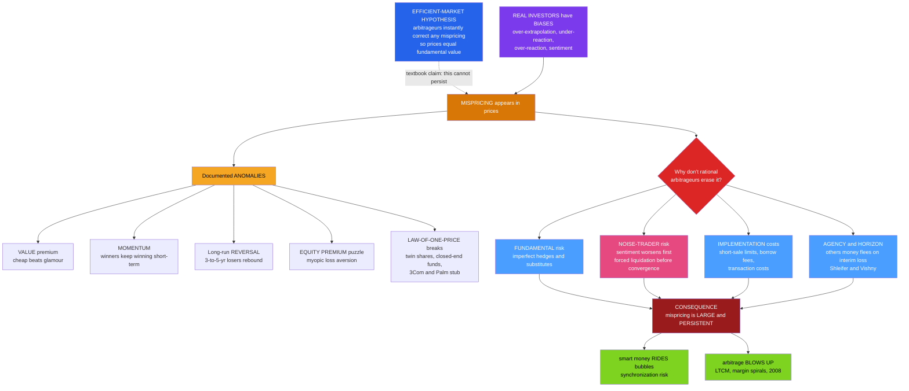

# 📉 Market Anomalies and Limits to Arbitrage

> [!abstract] TL;DR
> The **efficient-market hypothesis** says prices already reflect all information because rational arbitrageurs instantly trade away any mispricing. Two bodies of evidence dispute this. First, **market anomalies** — predictable return patterns that "should not" exist: the **value premium** (cheap low-price-to-book stocks beat glamour stocks — Fama-French), **momentum** (3-to-12-month winners keep winning — Jegadeesh-Titman), **long-run reversal** (3-to-5-year losers beat past winners — De Bondt-Thaler), the **size effect**, the **equity premium puzzle** (stocks beat bonds by far more than risk aversion can justify — Mehra-Prescott), **post-earnings-announcement drift**, and the near-arbitrage-proof **law-of-one-price violations** (Royal Dutch/Shell twin shares, closed-end-fund discounts, the negative-implied-value 3Com/Palm carve-out). Second — and this is the theoretical linchpin — **limits to arbitrage** (De Long-Shleifer-Summers-Waldmann 1990; Shleifer-Vishny 1997) explain *why* smart money does not erase these mispricings: **fundamental risk**, **noise-trader risk** (sentiment can worsen before it corrects — "the market can stay irrational longer than you can stay solvent"), **implementation costs** (short-selling limits, transaction costs), and **agency/horizon problems** (arbitrageurs manage others' capital that flees exactly when the opportunity is best). Together they explain persistent mispricings, why smart money can *ride* rather than pop bubbles, and why leveraged arbitrage blows up (LTCM 1998, 2008).

## Intuition

**Analogy — the $100 bill on the sidewalk.** An economist and a student walk down the street. The student says "look, a $100 bill!" The economist replies, "Impossible — if it were real, someone would have picked it up already." That joke *is* the efficient-market hypothesis: any obvious profit is instantly arbitraged away, so free money cannot lie around. Market anomalies are the awkward reply — bills that have lain on the sidewalk for **decades**, paying off across dozens of countries. Value and momentum are not rumors; they are among the most replicated facts in finance.

So why doesn't the crowd grab them? Because in the real world **picking up the bill is risky and costly.** The bill might get *more* mispriced before it corrects — a stock you correctly judge overpriced can double again first, and if you shorted it on margin you are wiped out before you are proven right. You may be unable to bet against it at all (no shares to borrow, or ruinous borrow costs). And you are usually managing *other people's money*: the moment your contrarian bet shows a short-term loss, your investors redeem — pulling your capital out at the exact moment the mispricing, and the future profit, is largest. **"The market can stay irrational longer than you can stay solvent."** Limits to arbitrage are why the $100 bill can just sit there, and why investor psychology gets to move prices at all.

---

## How It Works

Behavioral finance rests on **two pillars**, and the anomalies are only half the story.

**Pillar 1 — mispricing exists (the anomalies).** Real investors are not the frictionless Bayesians of theory. They **over-extrapolate** past growth (bidding glamour stocks too high and value stocks too low), **under-react** to news (letting good news diffuse slowly, which produces momentum), then eventually **over-react** (which reverses over three-to-five years). These lawful biases leave fingerprints in the cross-section of returns. The **catalog** of documented anomalies is large:

- **Value premium** — low price-to-book / low P/E stocks out-earn high-multiple "growth" stocks (Basu 1977; Fama-French 1992). Behavioral story: extrapolation of past growth, correcting.
- **Momentum** — past 3-to-12-month winners keep winning short-term (Jegadeesh-Titman 1993); violates even **weak-form** efficiency because *past prices predict future prices*. Story: under-reaction to news, gradual information diffusion.
- **Long-run reversal** — past 3-to-5-year losers beat past winners (De Bondt-Thaler 1985). Story: over-reaction correcting.
- **Size effect** — small caps historically earned higher risk-adjusted returns (Banz 1981), though much decayed post-publication.
- **Equity premium puzzle** — stocks have beaten bonds by ~6 percent a year, far more than plausible risk aversion allows (Mehra-Prescott 1985). Behavioral resolution: **myopic loss aversion** (Benartzi-Thaler) — investors check portfolios often and feel losses acutely, demanding a huge premium to hold volatile equity.
- **Post-earnings-announcement drift** — prices keep drifting in the direction of an earnings surprise for weeks; textbook under-reaction.
- **Calendar effects** — the January effect (tax-loss-selling rebound), turn-of-the-month.
- **Low-volatility / quality anomalies** — low-beta, high-profitability, low-investment firms earn *higher* risk-adjusted returns, contradicting a simple risk-return trade-off.

By the 2010s the count of published "factors" had exploded into the so-called **factor zoo** — hundreds of claimed predictors — which itself raises the suspicion of data-mining.

**The cleanest evidence — law-of-one-price violations.** Most anomalies are contestable because they might just be risk we mismeasure. But a handful of cases are the **smoking gun** because two claims to the *same* cash flows trade at *different* prices, and no risk story can explain it:
- **Twin shares.** Royal Dutch and Shell were entitled to Royal Dutch/Shell Group cash flows in a fixed **60:40** ratio, yet their relative price diverged from parity by up to ~30-35 percent for *years* (Froot-Dabora 1999).
- **Closed-end funds** trade at persistent **discounts and premiums** to the net asset value of the securities they hold — the same assets, two prices (Lee-Shleifer-Thaler 1991, who tie the discount to retail **sentiment**).
- **The 3Com/Palm carve-out (2000).** 3Com sold a slice of Palm and announced holders would receive ~1.5 Palm shares each; Palm's market price implied 3Com's *entire remaining business was worth negative billions* — a stub value that is impossible under rational pricing.

These are mispricings that **cannot** be explained by risk — only by **sentiment plus limits to arbitrage.**

**The efficient-market rebuttal (the honest debate).** Defenders of efficiency answer anomalies three ways: (1) they are **compensation for risk** — value, size, and momentum are just risk factors (Fama-French-Carhart), so the "anomaly" is a rational risk premium, not a free lunch; (2) they are **data-mining artifacts** — test enough patterns and some appear by chance, and indeed many anomalies **shrink out-of-sample and after publication** (McLean-Pontiff 2016 find ~one-third to one-half decay once known); (3) they are **small and arbitraged away** once discovered. Crucially, the **joint-hypothesis problem** (Fama) means any test of efficiency is simultaneously a test of the assumed asset-pricing model — you can *never* cleanly separate "the market is mispricing" from "your risk model is wrong." This is why the debate stays open.

**Pillar 2 — limits to arbitrage (why mispricing survives).** Here is the key theoretical contribution. In the textbook, arbitrage is riskless, costless, and infinitely scalable, so even a *few* rational traders enforce correct prices and **investor psychology cannot matter.** The behavioral insight is that **real arbitrage is none of those things.** There are four sources of limits:

1. **Fundamental risk.** The mispriced asset's own fundamentals can move against you. Perfect hedges rarely exist; a "substitute" security to lay off the fundamental bet is imperfect, so betting against a cheap stock leaves you exposed to bad news about that very firm.
2. **Noise-trader risk (De Long-Shleifer-Summers-Waldmann 1990).** Irrational **sentiment** can push a mispricing *further* from value before it corrects. A leveraged or short-horizon arbitrageur can be **forced to liquidate at a loss first** — right about fundamentals, bankrupt about timing. This is the engine behind "stay solvent."
3. **Implementation costs.** Short-selling requires **borrowing shares** (sometimes impossible, or expensive with high borrow fees and recall risk), plus transaction costs, bid-ask spreads, and liquidity limits, plus legal/institutional constraints. It is structurally *harder to bet against* an overpriced asset than to buy an underpriced one — so overpricing persists more easily.
4. **Agency / horizon problems (Shleifer-Vishny 1997, "performance-based arbitrage").** Arbitrageurs invest **other people's money.** Interim losses trigger redemptions, so capital **flees exactly when the mispricing is worst** — the arbitrageur is forced to *shrink* the trade precisely when it is most profitable. Their capital is most scarce when it is most needed, so arbitrage is weakest in the biggest dislocations.

**Why it matters that arbitrage is limited.** Once arbitrage is bounded, three consequences follow. Mispricings can be **large and persistent**, not fleeting. Smart money may rationally **ride bubbles** rather than pop them — if you can sell to a greater fool before the crash it is optimal to *buy* the overpriced asset (Abreu-Brunnermeier **synchronization risk**: no single arbitrageur dares attack the bubble alone, so they surf it — hedge funds rode the dot-com run-up). And arbitrage can even **destabilize** prices through positive-feedback trading. When leverage and funding are added, mispricing interacts with **funding liquidity**: falling prices trigger margin calls, forcing fire-sales that push prices further down in a **margin spiral** (Brunnermeier-Pedersen 2009) — the mechanism of the 2008 crisis. **LTCM (1998)** is the cautionary tale: convergence trades that were "certain" to pay off diverged long enough — amplified by noise-trader and liquidity risk after Russia's default — to exhaust the fund's capital before convergence arrived.



---

## Key Concepts / Details

### Secondary (intuition level)
- **Anomaly.** A pattern in returns that "shouldn't" exist if markets were efficient — a predictable edge, like value and momentum, that has paid off for decades.
- **The two pillars.** Behavioral finance needs *both* that people are biased **and** that arbitrage is limited. Bias alone does not move prices if smart money can costlessly correct it.
- **"Stay solvent."** Being right about a mispricing is not enough — you must survive long enough for it to correct. Sentiment can get worse first and bankrupt you.
- **Law of one price.** The same cash flows should have the same price. When twin shares or a fund and its holdings trade at *different* prices, that is mispricing you cannot blame on risk.

### Undergraduate (formal level)
- **The four limits to arbitrage.** (1) Fundamental risk — no perfect substitute to hedge the bet. (2) Noise-trader risk — sentiment `s` can move against you before reverting. (3) Implementation costs — short-sale constraints and fees. (4) Agency/horizon — performance-based capital flees on interim losses.
- **Factor models as the rational reply.** Fama-French 3-factor: `E[R_i] - R_f = b_i (E[R_m]-R_f) + s_i \cdot SMB + h_i \cdot HML`. Carhart adds momentum `WML`. If value/size/momentum are *risk factors*, their premia are rational compensation, not free money — and the joint-hypothesis problem prevents disproving this.
- **Momentum vs reversal by horizon.** Positive autocorrelation at 3-to-12 months (momentum) but negative autocorrelation at 3-to-5 years (reversal) — under-reaction then over-reaction, two effects at different frequencies.
- **The De Long-Shleifer-Summers-Waldmann model.** Noise traders with correlated, mistaken beliefs create **their own risk**: arbitrageurs fear that misperceptions deepen, so they trade *less* aggressively, and noise traders can earn *higher* expected returns by bearing the risk they themselves create — "noise traders survive."

### Graduate (frontier level)
- **Shleifer-Vishny performance-based arbitrage.** Formalizes that arbitrage capital is a decreasing function of *cumulative* performance. Because withdrawals rise with losses, the arbitrage response function is **backward-bending**: in extreme mispricing, capital contracts, so arbitrage is least effective exactly when most needed — a fundamentally different comparative static from textbook arbitrage.
- **Synchronization risk and riding bubbles (Abreu-Brunnermeier 2003).** Rational arbitrageurs who each know an asset is overpriced still delay attacking because the bubble bursts only when *enough* of them sell simultaneously, and no one knows the others' timing. The unique equilibrium can sustain the bubble for a long time and make it *optimal to ride*.
- **Funding liquidity and margin spirals (Brunnermeier-Pedersen 2009).** Market liquidity and funding liquidity are mutually reinforcing: a price drop tightens margins, forcing deleveraging that drops prices further. Mispricing, leverage, and liquidity co-move — the analytics behind 2008 and behind why "convergence" trades can diverge catastrophically first.
- **Publication decay (McLean-Pontiff 2016).** Anomaly returns fall ~32-58 percent out-of-sample after publication, consistent with sophisticated capital arbitraging away *part* of each edge while limits to arbitrage let the rest survive — evidence for a *partially* efficient market.
- **The joint-hypothesis problem (Fama 1970/1991).** Any efficiency test jointly tests the equilibrium model of expected returns; a rejected null could mean inefficiency *or* a wrong risk model, so "the market is inefficient" is never cleanly identified from returns alone.

---

## Python Demo

```python
# Market anomalies and LIMITS TO ARBITRAGE, made numerical.
#
# PART (a) NOISE-TRADER RISK (De Long-Shleifer-Summers-Waldmann style):
#   An asset's fundamental value F is CONSTANT at 100 -> the arbitrageur is RIGHT
#   that it is overpriced. Its PRICE = F + sentiment, where sentiment is a slowly
#   mean-reverting (to zero) noise-trader process. The arbitrageur SHORTS the
#   overpriced asset on margin at t=0. If sentiment gets WORSE (price rises) before
#   it reverts, a leveraged short hits a MARGIN CALL and is force-liquidated at a
#   loss -- wiped out despite being correct. Long run: price reverts to 100, so
#   SURVIVORS profit. We show both fates and the wipeout probability.
#
# PART (b) TWO ANOMALIES from a stylized cross-section of stocks:
#   Returns carry (i) a PERSISTENT expected-return component -> short-horizon
#   MOMENTUM (past 6-mo winners keep winning), and (ii) a slow, very persistent,
#   mean-reverting VALUATION component that overshoots then corrects -> long-horizon
#   REVERSAL (past 3-yr winners subsequently underperform; De Bondt-Thaler).
#   We form long-short portfolios and measure the anomalous premia.
import numpy as np
import matplotlib.pyplot as plt

rng = np.random.default_rng(7)

# ===========================================================================
# PART (a): NOISE-TRADER RISK -- the arbitrageur who is right but gets wiped out
# ===========================================================================
F      = 100.0    # fundamental value (constant -> the short is CORRECT)
s0     = 25.0     # initial OVERPRICING (sentiment); price starts at 125
kappa  = 0.025    # monthly mean-reversion speed of sentiment toward 0
sig_s  = 5.0      # monthly sentiment-shock volatility
Tn     = 60       # horizon in months
Msim   = 4000     # number of simulated paths
E0     = 100.0    # arbitrageur equity (capital)
lev    = 2.5      # leverage: short position value = lev * equity at t=0
mm     = 0.30     # maintenance margin: equity/short-value must stay >= 0.30
P0     = F + s0                       # = 125, entry price
Q      = lev * E0 / P0                # shares shorted (position sized at t=0)

s        = np.full(Msim, s0)
E_locked = np.zeros(Msim)             # equity locked in when force-liquidated
wiped    = np.full(Msim, -1)          # month of wipeout, -1 if survived
alive    = np.ones(Msim, dtype=bool)

P_hist = np.zeros((Tn + 1, Msim)); P_hist[0] = P0
E_hist = np.zeros((Tn + 1, Msim)); E_hist[0] = E0

for t in range(1, Tn + 1):
    s = s - kappa * s + sig_s * rng.standard_normal(Msim)   # OU sentiment
    P = F + s
    P_hist[t] = P
    Et = E0 + Q * (P0 - P)                                   # short gains when P falls
    Et = np.where(alive, Et, E_locked)                       # frozen if already wiped
    below = alive & (Et < mm * Q * P)                        # margin-call breach
    E_locked = np.where(below, np.maximum(Et, 0.0), E_locked)
    wiped = np.where(below & (wiped < 0), t, wiped)
    alive = np.where(below, False, alive)
    E_hist[t] = np.where(alive, Et, E_locked)

frac_wiped = np.mean(wiped >= 0)
surv_final = E_hist[-1][wiped < 0]
print("PART (a) - Noise-trader risk")
print(f"  Entry price {P0:.0f} (fundamental {F:.0f}); leverage {lev}x, maint margin {mm:.0%}")
print(f"  Arbitrageur is RIGHT (price reverts to {F:.0f}), yet")
print(f"  fraction WIPED OUT before convergence : {frac_wiped:.1%}")
print(f"  median survivor final equity          : {np.median(surv_final):.1f} "
      f"(started at {E0:.0f})\n")

# ===========================================================================
# PART (b): MOMENTUM (short-horizon) and REVERSAL (long-horizon) anomalies
# ===========================================================================
N, T = 400, 360                     # stocks, months (30 years)

# (i) Persistent expected-return component -> MOMENTUM
rho_mu, sig_mu = 0.85, 0.010
mu = np.zeros((T, N))
for t in range(1, T):
    mu[t] = rho_mu * mu[t-1] + sig_mu * np.sqrt(1 - rho_mu**2) * rng.standard_normal(N)

# (ii) Slow, very persistent, mean-reverting VALUATION level -> long-run REVERSAL
rho_v, sig_v = 0.975, 0.030          # half-life ~ 27 months: overshoot then revert
v = np.zeros((T, N))
for t in range(1, T):
    v[t] = rho_v * v[t-1] + sig_v * np.sqrt(1 - rho_v**2) * rng.standard_normal(N)
dv = np.vstack([np.zeros((1, N)), np.diff(v, axis=0)])   # change in valuation

sig_e = 0.05
ret = mu + dv + sig_e * rng.standard_normal((T, N))       # monthly returns (T,N)

def long_short(signal_window, hold, sign=+1, decile=0.1):
    """Rank on cumulative past return over `signal_window`, hold `hold` months.
    sign=+1 -> long winners minus losers (momentum); sign=-1 -> long losers (reversal)."""
    series = []
    n_top = max(1, int(decile * N))
    for t in range(signal_window, T - hold + 1):
        sig = ret[t - signal_window:t].sum(axis=0)        # past cumulative return
        order = np.argsort(sig)
        losers, winners = order[:n_top], order[-n_top:]
        fwd = ret[t:t + hold].sum(axis=0)                 # forward holding return
        wml = fwd[winners].mean() - fwd[losers].mean()    # winner minus loser
        series.append(sign * wml)
    return np.array(series)

mom = long_short(signal_window=6,  hold=1,  sign=+1)   # 6-1 momentum (winner - loser)
rev = long_short(signal_window=36, hold=12, sign=-1)   # 3yr formation, loser - winner

print("PART (b) - Anomaly premia from the stylized cross-section")
print(f"  MOMENTUM  6-1 winner-minus-loser : mean {mom.mean()*100:+.2f}% per month "
      f"(t ~ {mom.mean()/ (mom.std()/np.sqrt(len(mom))):.1f})")
print(f"  REVERSAL 36-12 loser-minus-winner: mean {rev.mean()*100:+.2f}% per year "
      f"(t ~ {rev.mean()/ (rev.std()/np.sqrt(len(rev))):.1f})")

# ===========================================================================
# PLOTS
# ===========================================================================
fig, ax = plt.subplots(2, 2, figsize=(13.5, 9))
months = np.arange(Tn + 1)

# (top-left) mispricing sample paths: price - fundamental, reverting toward 0
for j in range(12):
    ax[0,0].plot(months, P_hist[:, j] - F, lw=1.0, alpha=0.7)
ax[0,0].axhline(0, color="black", lw=1.2, label="fundamental value")
ax[0,0].set_title("(a1) Mispricing = price - fundamental (reverts, but noisily)")
ax[0,0].set_xlabel("month"); ax[0,0].set_ylabel("overpricing"); ax[0,0].legend(fontsize=8)
ax[0,0].grid(alpha=0.3)

# (top-right) arbitrageur equity: some survive to profit, some are wiped out
wiped_idx = np.where(wiped >= 0)[0][:6]
surv_idx  = np.where(wiped < 0)[0][:6]
for j in surv_idx:
    ax[0,1].plot(months, E_hist[:, j], color="#059669", lw=1.3, alpha=0.8)
for j in wiped_idx:
    ax[0,1].plot(months, E_hist[:, j], color="#dc2626", lw=1.3, alpha=0.85)
    ax[0,1].scatter(wiped[j], E_hist[wiped[j], j], color="#dc2626", zorder=5, s=25)
ax[0,1].axhline(E0, color="black", ls="--", lw=1, label="starting equity")
ax[0,1].plot([], [], color="#059669", label="survivors -> profit")
ax[0,1].plot([], [], color="#dc2626", label="margin call -> wiped out")
ax[0,1].set_title(f"(a2) Right about fundamentals, {frac_wiped:.0%} wiped out first")
ax[0,1].set_xlabel("month"); ax[0,1].set_ylabel("arbitrageur equity"); ax[0,1].legend(fontsize=8)
ax[0,1].grid(alpha=0.3)

# (bottom-left) cumulative MOMENTUM winner-minus-loser
ax[1,0].plot(np.cumsum(mom) * 100, color="#2563eb", lw=2.2)
ax[1,0].set_title("(b1) MOMENTUM: cumulative winner-minus-loser return")
ax[1,0].set_xlabel("month"); ax[1,0].set_ylabel("cumulative return, percent"); ax[1,0].grid(alpha=0.3)

# (bottom-right) cumulative long-run REVERSAL loser-minus-winner
ax[1,1].plot(np.cumsum(rev) * 100, color="#d97706", lw=2.2)
ax[1,1].set_title("(b2) REVERSAL: cumulative loser-minus-winner (3yr formation)")
ax[1,1].set_xlabel("rebalance"); ax[1,1].set_ylabel("cumulative return, percent"); ax[1,1].grid(alpha=0.3)

plt.tight_layout()
plt.savefig("market_anomalies_limits_to_arbitrage.png", dpi=120)
print("\nSaved figure: market_anomalies_limits_to_arbitrage.png")
```

Running it makes both pillars concrete. **Part (a)** builds an asset whose fundamental value never changes, so the arbitrageur who shorts it is *provably correct* — yet because noise-trader sentiment can push the price *higher* before it reverts, a meaningful fraction of leveraged arbitrageurs hit a margin call and are force-liquidated at a loss *before* convergence arrives. The top-right panel shows the split screen: green equity curves that survive the sentiment storm and end in profit, red curves that get stopped out (marked with a dot) despite being right. That is noise-trader risk and "stay solvent" in one picture. **Part (b)** manufactures a cross-section whose returns contain a persistent expected-return component (short-horizon **momentum**) layered on a slow, overshooting valuation component (long-horizon **reversal**). Sorting stocks by their past 6-month return and going long winners / short losers yields a *positive* momentum premium; sorting on the past 3 years and going long *losers* minus winners yields a positive *reversal* premium — the same market, opposite signs at different horizons, reproducing Jegadeesh-Titman and De Bondt-Thaler from first principles. Neither edge is riskless money: in a world of limited arbitrage, part (a) is exactly why part (b) is hard to harvest.

---

## Real-World Applications

- **The dot-com bubble (1995-2000) — limits to arbitrage in the wild.** Sophisticated investors *knew* many internet stocks were absurdly priced by 1999, yet shorting them meant hard-to-borrow shares, unbounded losses as prices kept climbing, and clients yanking money from any manager who lagged the soaring index. Julian Robertson's value-driven Tiger Management shut down in early 2000 — weeks before the NASDAQ peaked — for refusing to chase tech. Being right too early was indistinguishable from being wrong. Some hedge funds instead *rode* the bubble (Abreu-Brunnermeier synchronization risk), riding up and aiming to exit before the crash.
- **Long-Term Capital Management (1998).** Nobel-laureate-run convergence trades — betting that mispriced but economically identical securities would converge — were "certain" to pay off. After Russia's default, noise-trader and liquidity risk widened the spreads instead; leverage forced margin calls and liquidation *before* convergence. The mispricing was real; the fund still failed. The textbook case that arbitrage capital is scarcest when mispricing is worst.
- **2008 funding-liquidity spirals.** Brunnermeier-Pedersen margin spirals played out at system scale: falling asset prices tightened margins, forcing deleveraging that drove prices lower, freezing arbitrage exactly when it was most needed. Limits to arbitrage are central to understanding **financial crises and market fragility**, not just quirky return patterns.
- **Factor investing and the "quant" industry.** Value, momentum, size, quality, and low-volatility factors are packaged into ETFs and long-short hedge-fund strategies (AQR, Dimensional). But **crowded trades** and shared leverage create fragility — the August 2007 "quant quake" saw statistical-arbitrage funds deleverage into each other in days. See [[Momentum_Strategies]], [[Factor_Investing]], [[Statistical_Arbitrage]], [[Pairs_Trading]].
- **Index arbitrage and closed-end funds.** Persistent closed-end-fund discounts and twin-share divergences remain the cleanest teaching cases that price can deviate from value when arbitrage is bounded.

---

## Common Pitfalls

- **Treating anomalies as free money.** Paper premia ignore borrow fees, transaction costs, market impact, and capacity limits; many anomalies **decay after publication** (McLean-Pontiff) as capital arbitrages part of the edge away. The remaining return is compensation for bearing exactly the arbitrage risks that keep it alive.
- **Ignoring the joint-hypothesis problem.** An "anomaly" may just mean your risk model is wrong, not that the market is inefficient. You can *never* cleanly separate mispricing from a mis-specified risk premium using returns alone — humility is mandatory.
- **Assuming arbitrage is riskless.** Textbook arbitrage is riskless and self-financing; real arbitrage carries fundamental, noise-trader, funding, and horizon risk that can bankrupt a *correct* trader. Conflating the two is the mistake that blew up LTCM.
- **Data-mining the factor zoo.** Hundreds of published factors, most from the same datasets, guarantee false positives. Demand out-of-sample and cross-country evidence, an economic story, and multiple-testing corrections before believing a pattern is real.
- **Confusing "limits to arbitrage" with "markets are dumb."** Limits to arbitrage explain why *some* mispricing survives, not that prices are random. Markets are *mostly* efficient *because* arbitrage works imperfectly-but-largely — the point is the boundary, not the abolition, of efficiency.
- **Forgetting short-selling asymmetry.** Overpricing persists more easily than underpricing because betting *against* an asset is costlier and more constrained than buying one. Anomalies concentrated in hard-to-short, low-liquidity small caps are often unexploitable net of costs.

---

## Related Concepts

This note is the deep dive for **Behavioral_Economics / 05_Behavioral_Finance_and_Markets**. Its not-yet-written siblings in this section extend it: **Behavioral_Finance_Foundations** (the two-pillar framework and the efficient-market debate this note operationalizes), **Herding_Bubbles_and_Crashes** (the macro-scale consequence when limits to arbitrage let sentiment spirals run), **Sentiment_and_Noise_Trading** (the noise-trader process that *is* the risk in Part (a) of the demo), **Prospect_Theory_in_Markets_Disposition_Effect** (loss aversion applied to trading — a micro-driver of momentum and the equity premium), and **Risk_Ambiguity_and_Uncertainty** (below) whose ambiguity premia survive in prices for the very reasons catalogued here.

Verified cross-vault links:
- [[Market_Anomalies_and_Bubbles]] — Finance: the companion overview of anomalies and bubbles; **this** note is the distinct deep dive on the anomaly catalog and the *theory* of limits to arbitrage.
- [[Foundations_of_Behavioral_Finance]] — Finance: anomalies as the empirical case against strong-form EMH; the foundations this note builds on.
- [[Behavioral_Finance]] — Finance: home bias, the equity premium, and sentiment as behavioral footprints in asset prices.
- [[Cognitive_Biases_in_Investing]] — Finance: over-extrapolation, herding, and recency — the micro-causes of the mispricings arbitrage fails to erase.
- [[CAPM_and_Factor_Models]] — Finance: the rational risk-factor reply (Fama-French-Carhart) that reframes anomalies as risk premia.
- [[Momentum_Strategies]] — Quant Finance: the trading implementation of the momentum anomaly demonstrated here.
- [[Factor_Investing]] — Quant Finance: value/size/momentum/quality packaged as investable factors.
- [[Statistical_Arbitrage]] — Quant Finance: convergence trading and exactly the strategies limits to arbitrage constrain (and that blew up in 1998/2007).
- [[Pairs_Trading]] — Quant Finance: the archetypal relative-value arbitrage exposed to noise-trader and funding risk.
- [[Mean_Reversion]] — Quant Finance: the reversal side of the momentum/reversal horizon split.
- [[CAPM]] — Quant Finance: the single-factor benchmark whose "alphas" the anomalies represent.
- [[Value_at_Risk]] — Quant Finance: the risk limit that forces arbitrageurs to deleverage in drawdowns, tightening the horizon constraint.
- [[Risk_Ambiguity_and_Uncertainty]] — Behavioral_Economics sibling: ambiguity premia (equity premium, flight-to-safety) as anomalies that persist under limited arbitrage.
- [[Prospect_Theory]] — Behavioral_Economics: loss aversion and reference dependence underlie the disposition effect, momentum, and the equity premium puzzle.
- [[Overconfidence_and_Calibration]] — Behavioral_Economics: overconfident traders generate excess volume and the noise that becomes noise-trader risk.
- [[Availability_and_Representativeness]] — Behavioral_Economics: representativeness drives extrapolation of past growth — the behavioral value/glamour story.
- [[Cascades_and_Systemic_Risk]] — Systems Thinking: margin spirals and fire-sale contagion when funding liquidity evaporates.
- [[Feedback_Loops_and_Causality]] — Systems Thinking: positive-feedback trading and price-belief spirals behind bubbles.
- [[Evolutionary_Dynamics_in_Markets_and_Institutions]] — Evolutionary Game Theory: whether noise traders survive selection — the ecological view of why irrational agents persist.
- [[Economic_and_Social_Complexity]] — Systems Thinking: markets as complex adaptive systems where mispricing is emergent, not anomalous.

## Review Questions

1. **(Secondary)** Explain the "$100 bill on the sidewalk" joke and how it captures the efficient-market hypothesis. Then give two concrete reasons a real mispricing (a genuine $100 bill) can lie uncollected for years, and state what "the market can stay irrational longer than you can stay solvent" means for an arbitrageur.
2. **(Undergraduate)** Name the four sources of limits to arbitrage (Shleifer-Vishny and De Long et al.) and, using the Royal Dutch/Shell twin shares or the 3Com/Palm carve-out, explain why a law-of-one-price violation is *cleaner* evidence of mispricing than the value premium. Which limit specifically explains why an arbitrageur who is *correct* about fundamentals can still be forced to liquidate at a loss?
3. **(Graduate)** The value and momentum premia could be (i) rational risk compensation, (ii) behavioral mispricing sustained by limits to arbitrage, or (iii) data-mined artifacts. Lay out the strongest argument for each, explain how the **joint-hypothesis problem** prevents a clean verdict, and describe what evidence (e.g. McLean-Pontiff post-publication decay, twin-share divergence, LTCM) shifts your credence toward one view. Then argue whether it is ever *rational* to ride a bubble rather than short it.

---

## Sources

- De Long, J. B., Shleifer, A., Summers, L. H. & Waldmann, R. J. (1990). "Noise Trader Risk in Financial Markets." *Journal of Political Economy* 98(4), 703-738.
- Shleifer, A. & Vishny, R. W. (1997). "The Limits of Arbitrage." *Journal of Finance* 52(1), 35-55.
- Jegadeesh, N. & Titman, S. (1993). "Returns to Buying Winners and Selling Losers." *Journal of Finance* 48(1), 65-91.
- De Bondt, W. F. M. & Thaler, R. (1985). "Does the Stock Market Overreact?" *Journal of Finance* 40(3), 793-805.
- Fama, E. F. & French, K. R. (1992/1993). "The Cross-Section of Expected Stock Returns" and "Common Risk Factors in the Returns on Stocks and Bonds." *Journal of Finance* / *Journal of Financial Economics*.
- Lee, C. M. C., Shleifer, A. & Thaler, R. H. (1991). "Investor Sentiment and the Closed-End Fund Puzzle." *Journal of Finance* 46(1), 75-109.
- Brunnermeier, M. K. & Pedersen, L. H. (2009). "Market Liquidity and Funding Liquidity." *Review of Financial Studies* 22(6), 2201-2238.
- McLean, R. D. & Pontiff, J. (2016). "Does Academic Research Destroy Stock Return Predictability?" *Journal of Finance* 71(1), 5-32.

#behavioral-economics #limits-to-arbitrage #market-anomalies #noise-trader-risk #momentum
