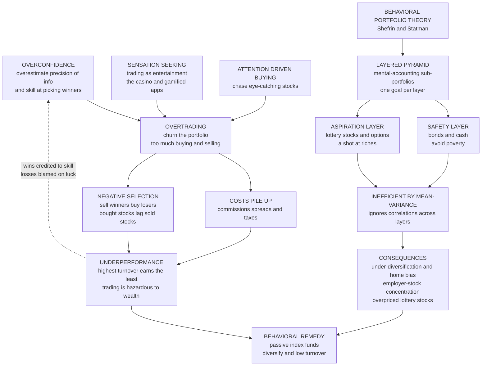

# 📉 Overtrading and Behavioral Portfolio Theory

> [!abstract] TL;DR
> **Overtrading** — buying and selling far more than is optimal — is one of the costliest and best-documented mistakes in all of investing. Its engine is **overconfidence**: investors overestimate the precision of their information and their skill at picking winners, so they churn their portfolios, paying commissions, spreads, and taxes while, on average, *selling the stocks that go on to do better and buying the ones that do worse*. Barber and Odean's landmark study of tens of thousands of brokerage accounts produced the phrase **"trading is hazardous to your wealth"**: the highest-turnover households dramatically underperformed the lowest, and because men are more overconfident than women, they traded roughly **45 percent** more and earned even less ("Boys Will Be Boys"). The flip side is **Behavioral Portfolio Theory (BPT)** — Shefrin and Statman's alternative to Markowitz: real investors do *not* hold one integrated, diversified, mean-variance-efficient portfolio. They build portfolios as **layered pyramids** of mental-accounting buckets, each tied to a goal — a bottom **safety layer** (bonds, cash — "don't be poor") and a top **aspiration layer** (lottery-like stocks, options — "get rich"). This ignores correlations across layers, so it is *inefficient* by mean-variance standards and produces under-diversification, employer-stock concentration, home bias, and overpriced lottery stocks. Together, overtrading and BPT make the behavioral case for **passive index investing, diversification, and low-turnover buy-and-hold** — the rare corner of life where doing *less* reliably beats doing *more*.

---

## Intuition

**Analogy:** Imagine a doctor watched 66,000 households' brokerage accounts for six years and found a brutal, almost cruel pattern: **the investors who traded the most earned the least.** Every trade *felt* like skilled action — spotting an opportunity, seizing control, doing something decisive. But each one quietly bled money in fees, and worse, tended to sell a good stock in order to buy a worse one. The busy traders were not paying for outperformance; they were paying to *underperform*. Meanwhile the person who bought a boring index fund and then went on with their life — who did almost nothing — quietly beat most of them. And the men in the data traded far more feverishly than the women, and earned even less for it. Overconfidence had convinced them they could beat the market, so they churned their portfolios into the ground.

That is the whole story in miniature. In the market, **activity is not the same as value**, and the gap between "feeling in control" and "actually being skilled" is exactly where your returns go to die. The second half of the story is *how* people assemble what they own: not as one carefully diversified whole, but as a **pyramid of separate hopes and fears** — a safe floor so they never fall into poverty, and a speculative penthouse where they buy a ticket to riches. That pyramid, and the churn that stirs it, is what this note is about.

---

## How It Works

### Core Mechanics

1. **Overtrading defined.** Trading has a break-even hurdle: every round trip must overcome **commissions, the bid-ask spread, market impact, and (in taxable accounts) capital-gains taxes**. A rational trader only crosses that hurdle when a trade has genuine positive expected edge. **Overtrading** is trading well past that point — churning the portfolio when the expected edge is zero or negative. Because the costs are certain and the edge is illusory, high turnover is a near-deterministic drain on returns.

2. **The overconfidence → overtrading link (the core mechanism).** Overconfident investors — see [[Overconfidence_and_Calibration]] — suffer from **overprecision**: they think their private signals are sharper than they are and their stock-picking is better than it is. This directly implies *more trading*: if you (wrongly) believe you have found a mispricing, you act on it. Barber and Odean's insight was that this makes overconfidence **empirically testable in the field**: if overconfidence drives trading, then higher turnover should predict *lower* net returns. It does — sharply.

3. **The empirical smoking gun.** Barber and Odean's studies of a large discount brokerage found the return spread was not subtle. The lowest-turnover households earned roughly the market return net of costs, while the highest-turnover households earned dramatically less — several percentage points per year worse. Crucially, the shortfall came from **two** sources, not one: (a) **transaction costs**, and (b) **negative selection** — the stocks investors *bought* subsequently *underperformed* the stocks they *sold*, even before costs. There was no edge to pay the costs with. That double failure is the signature of overconfidence rather than bad luck.

4. **Gender and demographics — "Boys Will Be Boys."** Because psychology finds men are more overconfident than women *specifically in finance*, Barber and Odean predicted and found that **men trade about 45 percent more than women and earn lower net returns as a result**. The pattern generalizes: young, single, and self-directed active traders churn most and lose most. Barber and colleagues' Taiwan studies of **day traders** are even starker — the vast majority lose money, and only a tiny persistent minority profit. Overtrading has a clear demographic signature, which is exactly what an overconfidence explanation predicts.

5. **Why overtrading persists (the reinforcement trap).** Several forces keep the mistake alive: the **illusion of control and knowledge** (trading feels like agency and expertise); **sensation-seeking / entertainment** — trading is *exciting*, the "casino pull," now amplified by gamified apps and zero-commission platforms that turn investing into a slot machine; **attention-driven buying** — retail investors disproportionately buy *attention-grabbing* stocks (news, extreme returns, high volume), a habit that predictably backfires; and above all **hindsight and self-attribution bias** — wins get credited to skill while losses get blamed on bad luck, so overconfidence *never self-corrects*. Finally, the sheer human bias toward **"doing something"** over sitting still makes passivity feel negligent even when it is optimal.

6. **Behavioral Portfolio Theory (BPT).** Shefrin and Statman's BPT replaces Markowitz's single integrated portfolio with a **layered pyramid of mental-accounting sub-portfolios**, each attached to a distinct *goal* and carrying its own risk attitude — a mechanism rooted in [[Mental_Accounting]] and [[Prospect_Theory]]. The **bottom layer is safety/security** (cash, bonds, insurance) whose job is to *avoid ruin*; the **top layer is aspiration/potential** (individual stocks, IPOs, options, lottery tickets) whose job is a *shot at wealth*. Investors set the layers by hopes and fears — "downside protection plus upside potential" — not by minimizing portfolio variance.

7. **BPT vs Markowitz (why it is inefficient).** In **mean-variance theory** (Markowitz — see [[Modern_Portfolio_Theory]]), the rational investor cares only about the *whole portfolio's* expected return and variance and holds a diversified point on the **efficient frontier**, exploiting *correlations* to cancel risk. BPT investors **violate integration**: they treat each mental-accounting layer in isolation and *ignore the correlations across layers*, so the aggregate portfolio sits *below and to the right* of the efficient frontier — more risk for the same expected return. The modern **goals-based investing** industry is essentially BPT operationalized: it works *with* the pyramid instinct while trying to keep each layer diversified.

8. **Under-diversification and lottery stocks (the costs of the pyramid).** BPT's aspiration layer predicts three pervasive, costly patterns. **Under-diversification** — the median household holds only a handful of stocks. **Employer-stock concentration** — over-weighting your own company's stock, a double risk to job *and* savings (the Enron tragedy). **Home bias** — over-weighting domestic and locally familiar firms out of familiarity and ambiguity aversion. And the **lottery-stock / skewness preference** — investors overpay for positively *skewed*, low-priced, high-volatility stocks (meme stocks, IPOs, penny stocks, out-of-the-money options), over-weighting the tiny chance of a huge payoff via **probability weighting** (see [[Probability_Weighting_and_Certainty_Effect]]). The result is the **"lottery anomaly"**: these stocks are *overvalued* and earn *low average returns*. All four raise risk without raising expected return — falling short of the frontier.

### Flow / Architecture



---

## Key Concepts

### Secondary Level

**One idea to keep:** in the stock market, being busy usually *loses* you money. The people who buy and sell the most tend to end up with the least, because every trade costs a little (fees, spreads, taxes) and, on average, the stock they sell does *better* afterward than the stock they buy. The person who buys a broad "index" fund and barely touches it usually beats them. Doing more feels smart and in-control; doing almost nothing quietly wins. That is why the classic warning is **"trading is hazardous to your wealth,"** and why, on average, **men trade more than women and earn less** for it.

**Second idea:** most people don't build one careful, spread-out portfolio. They build a **pyramid**: a safe bottom (savings, bonds) so they never go broke, and a risky top (a few exciting stocks, lottery-like bets) for a shot at getting rich. That's natural and human — but the risky top is usually *too* concentrated and often loses.

### Undergraduate Level

**The Barber-Odean design.** Their genius was turning a *psychological* claim into a *falsifiable market* prediction. If overconfidence drives trading, then sorting households by **turnover** should reveal a *negative* relationship with net return. It did: net returns fall monotonically with turnover, and the shortfall decomposes into **explicit costs** plus **negative selection** (bought-minus-sold return is negative). The gender study ("Boys Will Be Boys") added a clean *cross-sectional* test: the more-overconfident group (men) trades more and earns less, exactly as predicted.

**Behavioral Portfolio Theory, formally.** BPT descends from Lopes's **"security-potential/aspiration" (SP/A)** theory and Kahneman-Tversky's editing: investors segregate wealth into mental accounts and apply a *different* risk attitude to each. Shefrin and Statman's **BPT-MA** (multiple accounts) shows the optimal layered portfolio can look like a *combination of a bond position and a lottery ticket* — precisely the "avoid poverty, aim for riches" barbell — which is generically **off the mean-variance frontier**. The key violation is **failure of integration**: covariances *between* layers are ignored, so diversification benefits are left on the table.

**The lottery anomaly and skewness.** Standard finance says only *systematic* risk is priced; idiosyncratic volatility should not earn a premium. Yet **high-idiosyncratic-volatility, positively-skewed, lottery-like stocks earn *lower* average returns** (Bali, Cakici, Whitelaw's "MAX" effect; Kumar's "gambling" stocks). BPT explains it: aspiration-layer demand, driven by **probability weighting** (over-weighting tiny probabilities of huge gains), *bids up their prices* and drives down their future returns. Under-diversification is the other face of the same coin — concentrating in a few exciting names.

### Graduate Level

**Overconfidence models of trading volume.** Odean (1998) and Gervais-Odean (2001) formalize how overconfident traders overestimate signal precision, generating **excess trading volume**, higher volatility, and lower expected utility — trading volume itself becomes a puzzle that only behavioral models resolve (rational agents with common priors would trade little, per **no-trade theorems** à la Milgrom-Stokey). **Self-attribution bias** endogenizes the persistence: after gains, agents ratchet up their perceived skill (Gervais-Odean's "learning to be overconfident"), so overconfidence is *dynamically self-reinforcing* rather than eroded by feedback.

**BPT as constrained optimization.** BPT can be cast as expected-wealth maximization subject to a **safety-first / VaR-style floor constraint** on each mental account, with probabilities distorted by a weighting function — nesting Roy's safety-first and Telser's models. The resulting portfolio is efficient in a *behavioral (mean-variance-skewness with account constraints)* sense but inefficient in the classical mean-variance sense. Das, Markowitz, Scheid, and Statman (2010) reconcile the two: they show a **goals-based mental-accounting framework** can be mapped onto a *single* mean-variance-efficient aggregate under conditions — so goals-based investing need not sacrifice efficiency *if* products are engineered to keep sub-portfolios jointly diversified.

**Asset-pricing implications.** Aggregate overconfidence and lottery demand feed into **cross-sectional anomalies**: the idiosyncratic-volatility puzzle, the MAX effect, IPO and small-growth "junk" underperformance, and skewness pricing (Barberis-Huang's cumulative-prospect-theory asset pricing, where **probability weighting** makes positively-skewed securities overpriced). These are the market-level fingerprints of the same household behaviors — a bridge from micro psychology to the anomalies literature.

---

## Python Demo

```python
# ---------------------------------------------------------------
# OVERTRADING AND BEHAVIORAL PORTFOLIO THEORY
#
# (a) OVERTRADING: simulate investors who trade at different
#     TURNOVER levels. Each unit of turnover incurs transaction
#     COSTS and, from overconfidence, slight NEGATIVE SELECTION
#     (selling winners to buy losers) with NO offsetting edge.
#     -> NET return DECLINES with turnover, reproducing the
#        Barber-Odean "the more you trade, the less you earn."
#
# (b) BEHAVIORAL PORTFOLIO vs the MEAN-VARIANCE efficient frontier:
#     contrast Markowitz's diversified frontier with (i) a
#     BEHAVIORAL layered portfolio (big SAFETY bucket + small
#     LOTTERY/aspiration bucket) and (ii) UNDER-DIVERSIFIED single
#     stocks. Both land BELOW/RIGHT of the frontier: more risk for
#     the same expected return.
# ---------------------------------------------------------------
import numpy as np
import matplotlib
matplotlib.use("Agg")            # headless-safe backend
import matplotlib.pyplot as plt

rng = np.random.default_rng(7)

# ===============================================================
# (a) OVERTRADING: net return vs turnover
# ===============================================================
GROSS_MKT   = 0.08     # everyone's gross expected return = the market (NO edge)
COST_PER_TO = 0.012    # round-trip transaction cost per 100% turnover (1.2%)
NEG_SEL     = 0.009    # negative selection per 100% turnover (0.9%): bought lags sold
SIGMA       = 0.18     # annual return volatility
N_INV       = 4000     # investors per turnover bucket

# annual turnover levels from buy-and-hold (0) to frenetic day-trading (6 = 600%)
turnovers = np.array([0.0, 0.25, 0.5, 1.0, 1.5, 2.0, 3.0, 4.0, 6.0])
drag      = turnovers * (COST_PER_TO + NEG_SEL)      # deterministic cost of churning
exp_net   = GROSS_MKT - drag                          # expected NET return per bucket

net_mean, net_lo, net_hi = [], [], []
for t, d in zip(turnovers, drag):
    gross = rng.normal(GROSS_MKT, SIGMA, N_INV)       # luck: same for all buckets
    net   = gross - d                                 # churning only subtracts
    net_mean.append(net.mean())
    net_lo.append(np.percentile(net, 25))
    net_hi.append(np.percentile(net, 75))
net_mean = np.array(net_mean)

print("=" * 62)
print("(a) OVERTRADING  ->  NET return falls as turnover rises")
print("=" * 62)
for t, e in zip(turnovers, exp_net):
    print(f"    turnover {t*100:5.0f}%   expected NET {e:6.2%}   drag {t*(COST_PER_TO+NEG_SEL):5.2%}")
print(f"    buy-and-hold beats the busiest trader by "
      f"{(exp_net[0]-exp_net[-1])*100:.1f} percentage points per year.")

# ===============================================================
# (b) BEHAVIORAL PORTFOLIO vs MEAN-VARIANCE efficient frontier
# ===============================================================
# --- diversified risky asset universe (annual mu, vol, corr ~ 0.3) ---
mu   = np.array([0.06, 0.08, 0.09, 0.10, 0.11, 0.07])
vol  = np.array([0.15, 0.18, 0.20, 0.22, 0.25, 0.16])
n    = len(mu)
corr = np.full((n, n), 0.30); np.fill_diagonal(corr, 1.0)
Sig  = corr * np.outer(vol, vol)                     # covariance matrix

# --- Markowitz efficient frontier (closed form, allowing shorts) ---
inv   = np.linalg.inv(Sig)
one   = np.ones(n)
A = one @ inv @ one
B = one @ inv @ mu
C = mu  @ inv @ mu
D = A * C - B * B
targets = np.linspace(0.05, 0.13, 100)
front_sig = np.sqrt((A * targets**2 - 2 * B * targets + C) / D)

# --- an efficient, diversified benchmark: the equal-weight portfolio ---
w_eq   = one / n
mu_eq  = w_eq @ mu
sig_eq = np.sqrt(w_eq @ Sig @ w_eq)

# --- BEHAVIORAL layered portfolio: SAFETY bucket + LOTTERY bucket ---
mu_safe,  sig_safe  = 0.03, 0.05      # bonds/cash: avoid poverty
mu_lott,  sig_lott  = 0.04, 0.55      # lottery stock: LOW mean, HUGE vol (lottery anomaly)
w_safe,   w_lott    = 0.80, 0.20      # the pyramid: big base, small speculative top
mu_beh  = w_safe * mu_safe + w_lott * mu_lott
sig_beh = np.sqrt((w_safe * sig_safe)**2 + (w_lott * sig_lott)**2)   # corr ~ 0

# --- UNDER-DIVERSIFICATION: holding just ONE stock at a time ---
single_sig = vol                       # each single stock's own risk
single_mu  = mu                        # ...for its own return (no diversification)

print("\n" + "=" * 62)
print("(b) BEHAVIORAL / UNDER-DIVERSIFIED portfolios miss the frontier")
print("=" * 62)
print(f"    Behavioral (80% safe + 20% lottery): mu {mu_beh:5.2%}, risk {sig_beh:5.2%}")
front_sig_at_beh = np.sqrt((A*mu_beh**2 - 2*B*mu_beh + C) / D)
print(f"    Frontier risk for that SAME return : {front_sig_at_beh:5.2%}"
      f"  -> {(sig_beh-front_sig_at_beh)*100:.0f} pts of AVOIDABLE risk")
print(f"    Diversified equal-weight benchmark  : mu {mu_eq:5.2%}, risk {sig_eq:5.2%} (on frontier)")

# ===============================================================
# FIGURE
# ===============================================================
fig, (axT, axF) = plt.subplots(1, 2, figsize=(15, 6))

# Panel 1: net return vs turnover
axT.fill_between(turnovers*100, np.array(net_lo)*100, np.array(net_hi)*100,
                 color="crimson", alpha=0.12, label="25th-75th pct of investors")
axT.plot(turnovers*100, net_mean*100, "o-", color="crimson", lw=2.6,
         label="Mean NET return")
axT.axhline(GROSS_MKT*100, ls="--", color="gray", lw=1.8,
            label="Market return (buy & hold)")
axT.annotate("buy-and-hold\nindex holder", xy=(0, exp_net[0]*100),
             xytext=(60, 7.6), fontsize=9,
             arrowprops=dict(arrowstyle="->", color="black"))
axT.annotate("frenetic\nday-trader", xy=(600, exp_net[-1]*100),
             xytext=(360, 3.2), fontsize=9,
             arrowprops=dict(arrowstyle="->", color="black"))
axT.set_xlabel("Annual portfolio turnover (%)")
axT.set_ylabel("Net annual return (%)")
axT.set_title("Overtrading: the more you trade, the less you earn\n"
              "(Barber-Odean)")
axT.legend(loc="upper right", fontsize=8); axT.grid(alpha=0.3)

# Panel 2: efficient frontier vs behavioral / under-diversified
axF.plot(front_sig*100, targets*100, "-", color="steelblue", lw=2.6,
         label="Markowitz efficient frontier")
axF.scatter(single_sig*100, single_mu*100, marker="x", s=90, color="darkorange",
            linewidths=2.2, label="Single stocks (under-diversified)")
axF.scatter([sig_eq*100], [mu_eq*100], marker="*", s=320, color="green",
            edgecolor="black", zorder=5, label="Diversified portfolio (efficient)")
axF.scatter([sig_beh*100], [mu_beh*100], marker="D", s=150, color="crimson",
            edgecolor="black", zorder=5, label="Behavioral pyramid (safe + lottery)")
axF.scatter([sig_safe*100], [mu_safe*100], marker="s", s=90, color="navy",
            label="Safety layer (bonds/cash)")
axF.scatter([sig_lott*100], [mu_lott*100], marker="^", s=110, color="purple",
            label="Lottery layer (skewed, overpriced)")
axF.annotate("avoidable risk", xy=(sig_beh*100, mu_beh*100),
             xytext=(front_sig_at_beh*100, mu_beh*100), fontsize=8,
             arrowprops=dict(arrowstyle="<->", color="crimson"))
axF.set_xlabel("Risk  (annual volatility, %)")
axF.set_ylabel("Expected return (%)")
axF.set_title("Behavioral vs efficient portfolios\n"
              "layered pyramid falls BELOW the frontier")
axF.set_xlim(0, 60); axF.legend(loc="lower right", fontsize=7.5); axF.grid(alpha=0.3)

plt.tight_layout()
plt.savefig("overtrading_and_behavioral_portfolio_theory.png", dpi=120,
            bbox_inches="tight")
plt.show()
```

**What the demo shows:**

- **Panel 1 (overtrading):** every investor has the *same* gross expected return — the market, with **no edge**. The only thing turnover does is subtract certain costs plus negative selection. So mean net return falls **monotonically** from the market line at zero turnover to several points lower at day-trader turnover, reproducing Barber and Odean's core result: *the more you trade, the less you earn.*
- **Panel 2 (behavioral vs efficient):** the blue **efficient frontier** is the diversified optimum; the green star is a diversified portfolio sitting on it. The **behavioral pyramid** (red diamond = 80 percent safety layer + 20 percent lottery layer) lands well to the *right* of the frontier — the red arrow marks the **avoidable risk** it carries for its return. The orange X's are individual **single stocks**: under-diversification leaves every one of them off the frontier. The purple triangle is the lottery layer — high risk, *low* expected return (the lottery anomaly) — which nonetheless attracts aspiration-layer demand.

---

## Real-World Applications

> **Example — Vanguard, Bogle, and the index revolution.** John Bogle's index-fund thesis — *minimize costs and turnover, capture the market, do nothing else* — was, in hindsight, the practical antidote to everything in this note. Behavioral finance vindicated it: since overtrading destroys returns and stock-picking has no reliable edge for households, the **low-cost, low-turnover, fully diversified index fund** dominates the average active strategy. SPIVA scorecards showing the majority of active funds underperforming their benchmarks over long horizons are the aggregate echo of Barber-Odean at the fund level.

- **Robinhood and gamified brokerages.** Zero commissions, confetti animations, push notifications, and single-stock/option nudges are a direct exploit of **sensation-seeking and attention-driven buying**. They lower the *felt* cost of trading while leaving spreads, payment-for-order-flow, and negative selection intact — a machine for manufacturing overtrading. The 2021 meme-stock episode (GameStop, AMC) is a mass **lottery-stock / aspiration-layer** event.
- **Employer-stock concentration (Enron).** Enron employees held large fractions of their 401(k) in company stock; when the firm collapsed, they lost *job and savings together* — the canonical cost of under-diversification and the reason plans now cap and diversify employer stock.
- **Goals-based / target-date investing.** Modern advice platforms and **target-date funds** work *with* BPT's mental accounting: they let clients keep separate "safety" and "growth/aspiration" buckets by goal, while engineering each bucket to stay diversified — capturing the psychological appeal of the pyramid without its inefficiency (Das-Markowitz-Scheid-Statman).
- **Home bias in global allocation.** Investors worldwide massively over-weight domestic equities relative to the global market portfolio; advisors counter it with default global-index allocations — a nudge against a BPT-style familiarity tilt.

Foundational context for these applications lives in the forthcoming siblings *Behavioral_Finance_Foundations* and *Prospect_Theory_in_Markets_Disposition_Effect*, and in [[Behavioral_Finance]], [[Cognitive_Biases_in_Investing]], and [[Market_Anomalies_and_Bubbles]].

---

## Common Pitfalls

- **Confusing activity with skill.** The deepest trap: trading *feels* like expertise and control, so investors mistake motion for edge. The evidence says the opposite — for the typical household, **the optimal number of trades this year is close to zero**. If you cannot state your *specific, tested* edge, you are paying costs for negative selection.
- **Believing you are the exception.** Everyone reading "the average trader loses" assumes they are above average — the very **overconfidence** ([[Overconfidence_and_Calibration]]) that causes the problem. Self-attribution bias then locks it in: your wins prove skill, your losses were "just bad luck," so the belief never updates. Track your *net-of-cost, benchmark-relative* returns to break the loop.
- **Treating each mental account in isolation.** The BPT pyramid *ignores correlations across layers*, which is exactly what makes it inefficient. A "safe" bond bucket plus a concentrated tech-stock "growth" bucket may be far riskier together than it looks — integrate the whole portfolio, don't optimize buckets separately.
- **Mistaking a lottery ticket for an investment.** Positively-skewed, low-priced, high-volatility stocks *feel* like cheap shots at riches, but **probability weighting** ([[Probability_Weighting_and_Certainty_Effect]]) makes you overpay, and they earn *low* average returns. Size the aspiration layer as *entertainment/education spending*, not as a serious return engine.
- **Home bias and employer-stock loyalty.** Familiarity is not diversification. Over-weighting your own country, your own employer, or "stocks you know" concentrates exactly the risks you can least afford (your human capital already loads on your employer and economy).
- **Tax and turnover blindness in taxable accounts.** Every realized gain from churning triggers tax that a buy-and-hold investor defers indefinitely. High turnover in a taxable account compounds the drag well beyond the visible commission.

---

## Related Concepts

- [[Overconfidence_and_Calibration]] — the psychological engine of overtrading; overprecision about private signals is what makes people trade too much and earn less.
- [[Mental_Accounting]] — the mechanism BPT is built on: investors segregate wealth into goal-based buckets with different risk attitudes, producing the layered pyramid.
- [[Prospect_Theory]] — the value function and editing that underlie BPT's security/aspiration structure and lottery-seeking in the gain-and-loss domains.
- [[Probability_Weighting_and_Certainty_Effect]] — over-weighting tiny probabilities of huge gains is why lottery/skewed stocks get overpriced and earn low returns.
- [[Modern_Portfolio_Theory]] — the mean-variance efficient frontier that BPT investors fail to reach; the rational benchmark this note contrasts against.
- [[Loss_Aversion_and_the_Endowment_Effect]] — complements overconfidence in trading behavior and links to the disposition effect (selling winners, holding losers).
- [[Behavioral_Finance]] — the parent Finance-vault treatment of investor psychology, biases, and market anomalies.
- [[Foundations_of_Behavioral_Finance]] — the broader behavioral-finance framework in which overtrading and BPT sit.
- [[Cognitive_Biases_in_Investing]] — the investor-level catalogue where overconfidence, home bias, and lottery preference recur.
- [[Market_Anomalies_and_Bubbles]] — the market-level fingerprints (idiosyncratic-volatility puzzle, IPO underperformance) of aggregate overconfidence and lottery demand.

*Not yet written (Behavioral_Economics siblings referenced above in prose): Behavioral_Finance_Foundations and Prospect_Theory_in_Markets_Disposition_Effect.*

---

## Review Questions

### Secondary

1. Two neighbors both start with the same money in the same market. One trades stocks almost every day; the other buys one index fund and rarely touches it. After ten years, which is likely to have more, and give **two** reasons why.
2. In plain language, why does the saying "trading is hazardous to your wealth" make sense even when a trader sometimes *wins*?
3. Describe the "pyramid" way many people build a portfolio (a safe bottom and a risky top). Give one real example of each layer.

### Undergraduate

1. Barber and Odean argued overconfidence *predicts* a specific market pattern. State that prediction, describe how sorting households by **turnover** tests it, and explain the *two* separate sources of the high-turnover group's shortfall.
2. Explain why the **"Boys Will Be Boys"** finding (men trade ~45 percent more than women and earn less) is evidence for an *overconfidence* explanation of trading rather than, say, differing risk tolerance.
3. Contrast **Behavioral Portfolio Theory** with **Markowitz mean-variance optimization**. Which assumption does BPT violate that makes its portfolios inefficient, and what three real-world behaviors does that violation predict?

### Graduate

1. Rational agents with common priors should trade very little (no-trade theorems), yet observed volume is enormous. Sketch how an **overconfidence model** (Odean 1998; Gervais-Odean 2001) generates excess volume, and explain how **self-attribution bias** makes the overconfidence *dynamically self-reinforcing* rather than self-correcting.
2. The **lottery/idiosyncratic-volatility anomaly** says high-skewness, high-idiosyncratic-vol stocks earn *lower* average returns — a violation of standard asset pricing. Explain how **probability weighting** in a cumulative-prospect-theory pricing model (Barberis-Huang) produces this, and connect it to BPT's aspiration layer.
3. Das, Markowitz, Scheid, and Statman (2010) show goals-based mental-accounting portfolios can be reconciled with a single mean-variance-efficient aggregate. Under what conditions does this hold, and what does it imply for how to *design financial products* that honor investor psychology without sacrificing diversification?

---

## Sources

- [Barber, B. M. & Odean, T. (2000). "Trading Is Hazardous to Your Wealth: The Common Stock Investment Performance of Individual Investors." *Journal of Finance* 55(2), 773–806](https://doi.org/10.1111/0022-1082.00226)
- [Barber, B. M. & Odean, T. (2001). "Boys Will Be Boys: Gender, Overconfidence, and Common Stock Investment." *Quarterly Journal of Economics* 116(1), 261–292](https://doi.org/10.1162/003355301556400)
- [Shefrin, H. & Statman, M. (2000). "Behavioral Portfolio Theory." *Journal of Financial and Quantitative Analysis* 35(2), 127–151](https://doi.org/10.2307/2676187)
- [Odean, T. (1998). "Volume, Volatility, Price, and Profit When All Traders Are Above Average." *Journal of Finance* 53(6), 1887–1934](https://doi.org/10.1111/0022-1082.00078)
- [Das, S., Markowitz, H., Scheid, J. & Statman, M. (2010). "Portfolio Optimization with Mental Accounts." *Journal of Financial and Quantitative Analysis* 45(2), 311–334](https://doi.org/10.1017/S0022109010000141)

---

#behavioral-economics #overtrading #behavioral-portfolio-theory #overconfidence #under-diversification
