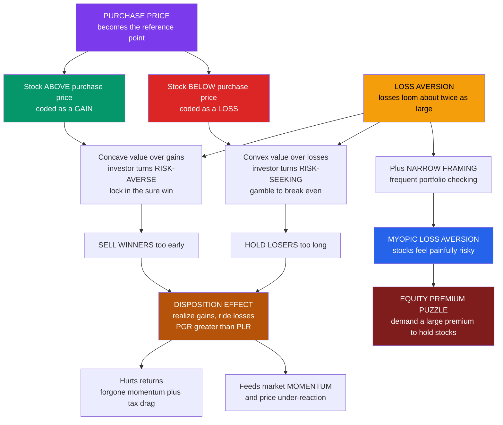

# 📉 Prospect Theory in Markets: The Disposition Effect

> [!abstract] TL;DR
> Prospect theory finds its most successful, most testable application inside real brokerage accounts. Because investors treat the **purchase price** as a reference point, a stock above it is coded as a **gain** and one below it as a **loss** — and the **reflection effect** then makes them *risk-averse over gains* (grab the sure win) but *risk-seeking over losses* (gamble to avoid realizing the pain). The result is the **disposition effect** (Shefrin-Statman 1985; Odean 1998): investors **sell winners too early and ride losers too long** — the opposite of the tax-smart, momentum-smart move — a robust, wealth-destroying bias that also feeds market **momentum**. Combine **loss aversion** with **narrow framing** (checking the portfolio often) and you get **myopic loss aversion** (Benartzi-Thaler 1995): frequent evaluators see frequent losses, perceive stocks as painfully risky, and demand a large premium to hold them — the leading behavioral resolution of the **equity premium puzzle**. Together with the house-money and break-even effects, these make prospect theory the theoretical engine of behavioral finance.

---

## Intuition

**Analogy:** You own two stocks and need cash for a down payment. One is up 30 percent since you bought it; the other is down 30 percent. Which do you sell?

Overwhelmingly, people sell the **winner** and keep the **loser** — the exact opposite of the tax-smart move (you should harvest the loss to offset taxes) *and* the momentum-smart move (winners tend to keep winning). Why? Selling the winner feels like *locking in a win* — a sure gain we reach out and grab. Selling the loser means *admitting* a loss: crystallizing pain that, by loss aversion, looms about twice as large as the equivalent gain. So we ride losers down, telling ourselves we will sell "once it gets back to even," and we cut winners short.

That is prospect theory caught red-handed in real accounts. The purchase price is the **reference point**; the S-shaped value function turns us cautious above it and reckless below it. This single asymmetry — the **disposition effect** — is behavioral finance's cleanest, most replicated prediction, documented across individual investors, real-estate sellers, mutual-fund managers, and even seasoned professional traders.

---

## How It Works

### Core mechanics

Prospect theory (see [[Prospect_Theory]]) says value is defined over **changes from a reference point**, not final wealth, through an S-shaped **value function** that is concave for gains, convex for losses, and steeper for losses (**loss aversion**, roughly 2 to 2.25 times). Drop an investor into a market and three things happen:

1. **The purchase price becomes the reference point.** A holding is mentally filed as a "gain" if it trades above what you paid and a "loss" if below — even though a forward-looking decision should ignore your cost basis entirely. This is [[Mental_Accounting]] and [[Reference_Dependence_and_Framing]] operating on each position.
2. **The reflection effect flips risk attitude by domain.** In the concave gain region the investor is **risk-averse**: a sure realized gain beats a fair gamble on the position (Jensen's inequality on a concave function), so winners get sold. In the convex loss region the investor is **risk-seeking**: a fair gamble beats the sure realized loss, so losers get held — the investor gambles on a recovery to "break even."
3. **Loss aversion makes realization painful.** Actually *closing the account at a loss* is aversive in itself — it converts a "paper loss" (still hopeful) into a booked defeat. So the disposition to **realize gains and ride losses** is over-determined: reflection plus loss aversion both push the same way.

**The signature statistic.** Odean (1998) measured this with two ratios across 10,000 brokerage accounts:

- **PGR** = proportion of gains realized = realized gains / (realized gains + paper gains)
- **PLR** = proportion of losses realized = realized losses / (realized losses + paper losses)

The disposition effect is the robust empirical finding **PGR > PLR**: on any given day, a stock sitting on a gain is far more likely to be sold than one sitting on a loss. Crucially, the winners investors sell go on to **outperform** the losers they keep — so this is not shrewd profit-taking; it is a genuine, measurable drag on returns, compounded by the tax inefficiency of never harvesting losses.

**From bias to market anomaly.** If a whole market drags its feet selling losers and rushes to sell winners, prices **under-react** to news: good news is capped by premature winner-selling, bad news is cushioned by loss-holders refusing to sell. Grinblatt and Han (2005) showed this disposition-driven under-reaction is a source of the **momentum** anomaly — the same purchase-price overhang that hurts individuals leaves exploitable drift in aggregate prices (see [[Momentum_Strategies]], [[Market_Anomalies_and_Bubbles]]).

**Myopic loss aversion and the equity premium.** Now zoom out from a single position to the whole portfolio over time. Benartzi and Thaler (1995) combined **loss aversion** with **narrow framing / frequent evaluation** ("myopia"). A loss-averse investor who checks the portfolio *often* experiences many small losses, each of which stings disproportionately, so stocks *feel* far riskier than their long-run return justifies — and the investor demands a large premium to hold them. This is the leading behavioral resolution of the **equity premium puzzle** (Mehra-Prescott 1985): the historical ~6 percent excess return of stocks over bonds is far too large for plausible rational risk aversion, but falls out naturally if investors evaluate their portfolios about **once a year**. The less often you look, the more attractive stocks become.

### Flow / Architecture



---

## Key Concepts

### Secondary Level

**The one idea to keep:** we cut our winners and we ride our losers. Selling a stock that is up feels like collecting a prize; selling a stock that is down feels like confessing a mistake — so we grab the prize and postpone the confession, hoping the loser "comes back." That instinct feels natural and is almost exactly backwards: for tax reasons you should sell losers, and in practice winners tend to keep winning.

**Why looking often makes stocks scary.** Check your investments every day and you will see a lot of red days, and because losses hurt about twice as much as gains feel good, the ride feels terrifying — so you would only hold stocks if paid a big premium. Check once a year and most years are green; the same stocks now look attractive. Nothing about the stocks changed — only how often you looked. This is why long-term investors are told, only half-jokingly, to *stop checking the app*.

### Undergraduate Level

**The mechanism, precisely.** With reference point at purchase price and value function `v` (concave over gains, convex over losses, steeper for losses), compare *realizing now* against *holding through a fair future gamble* of size `d`:

- **Gain domain** `x > 0`: by concavity, `v(x) > ½·v(x+d) + ½·v(x-d)` — the sure realized gain beats the gamble, so **sell**.
- **Loss domain** `x < 0`: by convexity, `v(x) < ½·v(x+d) + ½·v(x-d)` — the gamble beats the sure realized loss, so **hold**.

This is exactly Jensen's inequality applied on each arm of the S-curve, and it delivers **PGR > PLR** without any further assumptions. The Python demo simulates it directly.

**Why it costs money.** Odean's data show the losers investors keep subsequently *underperform* the winners they sold — so the behavior is not clever profit-taking, it is wealth destruction. On top of that it is **tax-inefficient**: in a system that lets you deduct realized losses, the optimal move is to *harvest losses* (sell losers to bank the tax benefit) and *defer gains* (hold winners to postpone the tax) — the precise reverse of what investors actually do.

**Myopic loss aversion, formally.** Let stock returns over an evaluation horizon `h` be roughly `Normal(μ·h, σ·√h)`. A loss-averse investor holds stocks only if their **prospective utility** `E[v(return)]` at least matches the safe asset (`v(0) = 0`). Because losses are weighted `λ ≈ 2.25`, at `μ = 0` the prospective utility is negative, so a positive premium `μ` is required to reach indifference. Shorter horizons (more frequent evaluation) mean the mean drift `μ·h` shrinks faster than the noise `σ·√h`, so the *annualized* premium needed scales roughly with `√n` where `n` is evaluations per year. Frequent looking demands a fat premium.

### Graduate Level

**The disposition effect is over-identified — which makes it hard to pin on one cause.** Prospect theory is the leading explanation, but competitors exist: a naive **belief in mean reversion** ("it's due for a bounce") predicts holding losers without invoking the value function; **rational rebalancing** can mimic selling winners; and **realization utility** (Barberis-Xiong 2012) locates the effect in a *burst of utility at the moment of sale* rather than in the shape of `v` over paper positions. Discriminating among these requires exploiting cases where they diverge — for example, the disposition effect survives even when mean-reversion beliefs are controlled for, and it strengthens when the sale is made salient, favoring realization-based accounts. A well-known wrinkle: the effect can *reverse* in the extreme loss region if a position is so far underwater that hope is abandoned.

**Prospect theory in asset pricing.** Barberis, Huang, and Santos (2001) build loss aversion and prior-outcome effects (the **house-money effect**) directly into a consumption-based asset-pricing model, generating a high, volatile equity premium and excess volatility from behavioral primitives. Barberis and Huang (2008) show that when investors evaluate stocks under **narrow framing** and probability weighting (see [[Probability_Weighting_and_Certainty_Effect]]), positively-skewed, lottery-like stocks become *overpriced* and earn low average returns — a prospect-theory account of the idiosyncratic-volatility and IPO under-performance puzzles.

**Myopic loss aversion is a joint hypothesis.** Benartzi-Thaler's resolution requires *both* loss aversion *and* narrow framing over a short horizon; loss aversion alone is not enough (a loss-averse investor with a long evaluation horizon holds stocks happily). This was confirmed experimentally by Thaler, Tversky, Kahneman, and Schwartz (1997) and Gneezy-Potters (1997): subjects shown returns *less frequently* (or forced to commit for longer) invest substantially *more* in the risky asset — direct causal evidence that framing the horizon, not the asset, drives the premium. This is why the debiasing lever is **evaluation frequency**, not risk preference.

**House-money and break-even effects** (Thaler-Johnson 1990) make the reference point *dynamic*: after a **gain**, people take *more* risk ("playing with the house's money," because a subsequent loss is netted against the prior gain and stings less); after a **loss**, they either become risk-averse or, if a "break-even" bet is available, reach for **long shots** to get whole. These path-dependencies feed trading streaks, doubling-down, and the late stages of bubbles. Modeling them requires abandoning a fixed reference point in favor of one that ratchets with recent outcomes.

---

## Python Demo

```python
# ---------------------------------------------------------------
# PROSPECT THEORY IN MARKETS
#   (a) THE DISPOSITION EFFECT
#       Simulate investors holding stocks with a PURCHASE-PRICE
#       reference point and prospect-theory preferences. The
#       reflection effect (risk-averse over gains, risk-seeking
#       over losses) makes them SELL WINNERS and HOLD LOSERS.
#       We recover Odean's measure: PGR (proportion of gains
#       realized) > PLR (proportion of losses realized).
#   (b) MYOPIC LOSS AVERSION and the EQUITY PREMIUM PUZZLE
#       A loss-averse investor who evaluates the portfolio OFTEN
#       sees frequent losses (which loom large) and demands a
#       large premium to hold stocks. Premium rises with how
#       often the portfolio is evaluated -> explains the puzzle.
# ---------------------------------------------------------------
import numpy as np
import matplotlib
matplotlib.use("Agg")            # headless-safe backend
import matplotlib.pyplot as plt

rng = np.random.default_rng(42)

# --- prospect-theory value function (Tversky & Kahneman 1992) ---
ALPHA  = 0.88          # value-function curvature (gains and losses)
LAMBDA = 2.25          # loss-aversion coefficient

def value(x):
    """S-shaped value coded relative to the reference point:
    concave over gains, convex over losses, STEEPER for losses."""
    x = np.asarray(x, dtype=float)
    return np.where(x >= 0.0,
                    np.power(np.abs(x), ALPHA),
                    -LAMBDA * np.power(np.abs(x), ALPHA))

def sigmoid(z):
    return 1.0 / (1.0 + np.exp(-z))

# ===============================================================
# (a) THE DISPOSITION EFFECT  (Odean's PGR vs PLR)
# ===============================================================
N_INV, N_STK = 5000, 8           # investors x holdings each
PURCHASE     = 100.0             # reference point = price paid

# current price of each holding: some winners, some losers
log_ret  = rng.normal(0.0, 0.25, size=(N_INV, N_STK))
current  = PURCHASE * np.exp(log_ret)
gainloss = current - PURCHASE                    # x relative to reference

# each holding faces a FAIR future gamble: +/- delta, prob 1/2 each
delta = 0.12 * current                            # size of the future move

# prospect-theory sell rule: realize NOW (sure v(x)) vs HOLD (gamble)
V_sell = value(gainloss)
V_hold = 0.5 * value(gainloss + delta) + 0.5 * value(gainloss - delta)

# concavity over gains  -> V_sell > V_hold -> tend to SELL winners
# convexity over losses -> V_sell < V_hold -> tend to HOLD  losers
BASE, BETA = -1.0, 1.5            # base liquidity need + PT sensitivity
p_sell = sigmoid(BASE + BETA * (V_sell - V_hold))
sold   = rng.random((N_INV, N_STK)) < p_sell

is_gain = gainloss > 0
is_loss = gainloss < 0

realized_gains  = np.sum(sold & is_gain)
paper_gains     = np.sum(~sold & is_gain)
realized_losses = np.sum(sold & is_loss)
paper_losses    = np.sum(~sold & is_loss)

PGR = realized_gains  / (realized_gains  + paper_gains)
PLR = realized_losses / (realized_losses + paper_losses)

print("=" * 62)
print("DISPOSITION EFFECT  (Odean's proportion realized)")
print("=" * 62)
print(f"  PGR  proportion of GAINS  realized = {PGR:.3f}")
print(f"  PLR  proportion of LOSSES realized = {PLR:.3f}")
print(f"  disposition ratio  PGR / PLR       = {PGR / PLR:.2f}   (> 1)")
print("  Investors realize gains far more readily than losses:")
print("  they SELL WINNERS too early and HOLD LOSERS too long.")

# ===============================================================
# (b) MYOPIC LOSS AVERSION and the EQUITY PREMIUM PUZZLE
#     For evaluation frequency n (times per year), find the annual
#     equity premium mu that makes a loss-averse investor
#     INDIFFERENT between stocks and a safe asset over ONE
#     evaluation period:  E[ v(return) ] = 0.
# ===============================================================
SIGMA_ANNUAL = 0.20              # stock volatility ~20% per year

def expected_pt_value(mu_annual, n):
    """E[v(r)] for return r over one evaluation period of length 1/n."""
    h   = 1.0 / n
    m   = mu_annual * h                          # per-period mean
    s   = SIGMA_ANNUAL * np.sqrt(h)              # per-period std
    r   = np.linspace(m - 8 * s, m + 8 * s, 1600)
    pdf = np.exp(-0.5 * ((r - m) / s) ** 2) / (s * np.sqrt(2 * np.pi))
    return np.trapz(value(r) * pdf, r)

def required_premium(n, lo=0.0, hi=3.0):
    """Bisection for the annual premium giving E[v]=0 at frequency n."""
    for _ in range(60):
        mid = 0.5 * (lo + hi)
        if expected_pt_value(mid, n) > 0.0:
            hi = mid
        else:
            lo = mid
    return 0.5 * (lo + hi)

freqs  = np.array([1, 2, 4, 6, 12, 26, 52, 252])   # evaluations per year
premia = np.array([required_premium(n) for n in freqs])

print("\n" + "=" * 62)
print("MYOPIC LOSS AVERSION and the EQUITY PREMIUM")
print("=" * 62)
for n, pr in zip(freqs, premia):
    print(f"  evaluate {n:4d} times/yr  ->  premium demanded = {pr * 100:5.1f}%")
print("  Frequent evaluation -> frequent losses loom large ->")
print("  stocks feel very risky -> a LARGE premium is demanded.")
print("  An evaluation horizon near ONE YEAR reproduces the")
print("  ~6% historical equity premium (Benartzi-Thaler 1995).")

# ===============================================================
# FIGURE: (left) disposition effect  |  (right) equity premium
# ===============================================================
fig, (axD, axM) = plt.subplots(1, 2, figsize=(13.5, 5.4))
fig.suptitle("Prospect theory in markets: the disposition effect and myopic loss aversion",
             fontsize=13, fontweight="bold")

# ---- Panel A: disposition effect (PGR vs PLR) ------------------
axD.bar(["PGR\n(gains realized)", "PLR\n(losses realized)"], [PGR, PLR],
        color=["#059669", "#dc2626"], edgecolor="black", linewidth=0.7, width=0.6)
for i, v in enumerate([PGR, PLR]):
    axD.text(i, v + 0.006, f"{v:.3f}", ha="center", fontweight="bold")
axD.set_ylim(0, max(PGR, PLR) * 1.40)
axD.set_ylabel("Proportion of positions realized")
axD.set_title(f"Disposition effect: PGR > PLR  (ratio = {PGR / PLR:.2f})", fontsize=10)
axD.text(0.5, max(PGR, PLR) * 1.26, "sell WINNERS, hold LOSERS",
         ha="center", fontsize=9.5, color="#7f1d1d", fontweight="bold")
axD.grid(axis="y", alpha=0.2)

# ---- Panel B: myopic-loss-aversion equity premium --------------
axM.plot(freqs, premia * 100, "o-", color="#2563eb", lw=2.3, markersize=7)
axM.set_xscale("log")
axM.set_xticks(freqs)
axM.set_xticklabels([str(n) for n in freqs])
axM.set_xlabel("Evaluation frequency (portfolio checks per year)")
axM.set_ylabel("Equity premium demanded (percent per year)")
axM.set_title("Myopic loss aversion: premium rises with how often you look", fontsize=10)
axM.axhline(6.0, color="#059669", ls="--", lw=1.3)
axM.annotate("historical ~6% premium\n= evaluating about once a year",
             xy=(1, 6.0), xytext=(3, 32), color="#065f46", fontsize=8.5,
             arrowprops=dict(arrowstyle="->", color="#065f46"))
axM.grid(alpha=0.2)

plt.tight_layout(rect=[0, 0, 1, 0.93])
plt.savefig("prospect_theory_in_markets.png", dpi=110, bbox_inches="tight")
plt.show()
```

**What the demo shows:**

- **Panel A (disposition effect):** with a purchase-price reference and a prospect-theory sell rule, the simulated **proportion of gains realized (PGR)** sits well above the **proportion of losses realized (PLR)** — the exact `PGR > PLR` signature Odean found in real accounts. It emerges *purely* from the concavity-over-gains, convexity-over-losses shape of the value function: no beliefs about future returns are assumed.
- **Panel B (myopic loss aversion):** the annual premium a loss-averse investor demands to hold stocks **rises steeply with evaluation frequency**. A daily-checking investor wants an implausibly huge premium; someone who evaluates about **once a year** demands roughly the historical ~6 percent — the Benartzi-Thaler resolution of the equity premium puzzle. The stock did not change; only how often it is judged against the reference point did.

---

## Real-World Applications

> **Retail brokerage and robo-advisors — automatic tax-loss harvesting.** Platforms such as Wealthfront and Betterment run algorithmic **tax-loss harvesting**, systematically selling losers to bank the tax benefit — precisely the move the disposition effect suppresses. Rules-based rebalancing likewise forces the sale of winners and purchase of losers on a schedule, counteracting the human instinct to ride losers. Design that *removes the moment of realization from the human* neutralizes the bias.

> **The equity premium and retirement-plan design.** Myopic loss aversion is why long-horizon savers who obsess over daily statements under-allocate to equities. Product responses include **target-date funds** (which frame the decision as a single long-horizon glide path rather than a stream of daily gambles) and deliberately **less frequent, gain-framed statements**. Benartzi and Thaler's *Save More Tomorrow* extends the same logic to contributions (see [[Nudges_and_Choice_Architecture]]).

> **Momentum trading strategies.** Because the disposition effect makes markets under-react — winners are sold too soon, losers held too long — a purchase-price "overhang" leaves predictable drift. Grinblatt-Han formalize this as a driver of the **momentum** anomaly, and quant desks trade the residual mispricing directly (see [[Momentum_Strategies]], [[Market_Anomalies_and_Bubbles]]).

> **Real estate and housing markets.** Genesove and Mayer (2001) found home-sellers whose expected price fell **below their purchase price** set list prices well above market, sold less, and waited longer — the disposition effect outside equities. Loss aversion around the nominal purchase price makes housing markets sticky and volume collapse in downturns.

> **Professional and institutional traders.** The bias is attenuated but not eliminated by expertise: proprietary traders and fund managers also cut winners early, and desks impose **hard stop-loss rules** precisely because discretionary loss-realization is unreliable. Rules substitute for the willpower that loss aversion erodes.

---

## Common Pitfalls

- **Confusing the disposition effect with rational profit-taking.** "I sold to lock in gains" sounds prudent, but Odean's data show the sold winners *outperform* the held losers — it is a costly bias, not skill. The tell is the *asymmetry*: real rebalancing sells winners *and* losers, disposition behavior systematically holds losers.
- **Anchoring on the purchase price.** "I'll sell when it gets back to what I paid" is the disposition effect stated aloud. The market has no memory of your cost basis; the only rational reference is the asset's *future* prospects, not your entry point.
- **Treating loss aversion alone as the equity-premium explanation.** Myopic loss aversion is a **joint** hypothesis: loss aversion *plus* narrow framing over a short horizon. A loss-averse investor with a long evaluation horizon happily holds stocks — the premium comes from *frequent looking*, so the debiasing lever is evaluation frequency, not preferences.
- **Assuming a fixed reference point.** House-money and break-even effects show the reference point **ratchets** with recent outcomes: risk-taking rises after gains and can spike toward long shots after losses. Models with a static reference miss streak dynamics, doubling-down, and bubble late-stages.
- **Ignoring taxes when reasoning about optimal selling.** In a system that lets you deduct realized losses, the tax-optimal policy is the *reverse* of the disposition effect — harvest losses, defer gains. Overlooking this understates how expensive the bias really is.
- **Over-precision on the numbers.** Odean's disposition ratio (~1.5) and the roughly one-year evaluation horizon are robust *averages*, not constants; they vary with sophistication, account type, tax status, and market regime.

---

## Related Concepts

- [[Prospect_Theory]] — the parent theory: reference dependence, the S-shaped value function, loss aversion, the reflection effect, and probability weighting that this note applies to markets.
- [[Loss_Aversion_and_the_Endowment_Effect]] — loss aversion is the master mechanism behind both the disposition effect and myopic loss aversion.
- [[Reference_Dependence_and_Framing]] — why the purchase price becomes the reference point, and how reframing the horizon or portfolio changes behavior.
- [[Mental_Accounting]] — investors evaluate each position in its own account, closing a loss account is aversive — the narrow framing that produces the disposition effect and myopic loss aversion.
- [[Probability_Weighting_and_Certainty_Effect]] — overweighting small probabilities makes lottery-like stocks overpriced (Barberis-Huang), the probability-weighting side of prospect theory in asset pricing.
- [[Expected_Utility_Theory_and_Its_Violations]] — the rational benchmark the equity premium puzzle and disposition effect violate.
- [[Prospect_Theory_and_Loss_Aversion]] — the finance-vault companion covering the value function, framing, and the disposition effect for investors.
- [[Foundations_of_Behavioral_Finance]] — the bounded-rationality and limits-to-arbitrage tradition in which these market effects sit.
- [[Cognitive_Biases_in_Investing]] — anchoring, overconfidence, and mental accounting as the disposition effect's close cousins in real portfolios.
- [[Market_Anomalies_and_Bubbles]] — how disposition-driven under-reaction feeds the momentum anomaly and limits to arbitrage.
- [[Momentum_Strategies]] — the quant strategy that harvests the price drift the disposition effect leaves behind.
- [[Behavioral_Finance]] — the risk-and-return-vault overview locating prospect theory within behavioral asset pricing.
- [[Behavioral_Economics_Psychology]] — the psychology-vault home of prospect theory, loss aversion, and mental accounting.
- [[Cognitive_Biases]] — the broader taxonomy of systematic judgment errors these effects belong to.
- [[Utility_Theory]] — the classical consumer-choice / expected-utility framework prospect theory descriptively replaces.
- [[Modern_Portfolio_Theory]] and [[CAPM]] — the rational asset-pricing baselines against which the equity premium puzzle is defined.

*Forthcoming siblings in this section (referenced above in prose):* a dedicated **Behavioral_Finance_Foundations** overview and **Overtrading_and_Behavioral_Portfolio_Theory** (overconfidence-driven excessive trading and Shefrin-Statman's behavioral portfolio theory) will extend this note.

---

## Review Questions

### Secondary

1. You own two stocks and need cash: one is up 30 percent, one is down 30 percent. Most people sell the winner and keep the loser. In plain language, why does selling the winner *feel* better even though it may be the worse move?
2. Two investors hold the same stock portfolio for ten years. One checks it every day; the other checks it once a year. Why does the daily-checker find stocks much scarier, and how could that change how much they invest?
3. A friend says, "I'm not selling this stock until it gets back to what I paid for it." What is wrong with using the purchase price to decide when to sell?

### Undergraduate

1. Using the shape of the prospect-theory value function (concave over gains, convex over losses), show why an investor prefers to *realize* a gain but *hold* through a fair gamble on a loss. Connect this to Odean's finding that PGR > PLR.
2. The tax-optimal policy is to harvest losses and defer gains — the exact reverse of the disposition effect. Explain both why the tax system rewards this and why loss-averse investors do the opposite.
3. State the equity premium puzzle and explain how *myopic* loss aversion resolves it. Why is loss aversion **alone** insufficient — what second ingredient does Benartzi-Thaler require, and what does the model predict as you vary evaluation frequency?

### Graduate

1. The disposition effect is consistent with prospect theory, naive mean-reversion beliefs, *and* realization utility (Barberis-Xiong). Design an empirical test using brokerage data that could distinguish the prospect-theory / realization-utility account from a pure mean-reversion-belief account, and state what each predicts.
2. Barberis-Huang argue that under narrow framing plus probability weighting, positively-skewed "lottery" stocks are overpriced and earn low average returns. Derive the intuition from the two relevant features of cumulative prospect theory, and name one asset-pricing puzzle this addresses.
3. House-money and break-even effects make the reference point path-dependent. Sketch how you would modify a standard prospect-theory portfolio model to incorporate a ratcheting reference point, and explain what new phenomena (streaks, doubling-down, bubble dynamics) the modification would generate that a fixed-reference model cannot.

---

## Sources

- [Shefrin, H. & Statman, M. (1985). "The Disposition to Sell Winners Too Early and Ride Losers Too Long." *Journal of Finance* 40(3), 777–790](https://doi.org/10.1111/j.1540-6261.1985.tb05002.x)
- [Odean, T. (1998). "Are Investors Reluctant to Realize Their Losses?" *Journal of Finance* 53(5), 1775–1798](https://doi.org/10.1111/0022-1082.00072)
- [Benartzi, S. & Thaler, R. (1995). "Myopic Loss Aversion and the Equity Premium Puzzle." *Quarterly Journal of Economics* 110(1), 73–92](https://doi.org/10.2307/2118511)
- [Mehra, R. & Prescott, E. (1985). "The Equity Premium: A Puzzle." *Journal of Monetary Economics* 15(2), 145–161](https://doi.org/10.1016/0304-3932%2885%2990061-3)
- [Grinblatt, M. & Han, B. (2005). "Prospect Theory, Mental Accounting, and Momentum." *Journal of Financial Economics* 78(2), 311–339](https://doi.org/10.1016/j.jfineco.2004.10.006)
- [Barberis, N. & Huang, M. (2008). "Stocks as Lotteries: The Implications of Probability Weighting for Security Prices." *American Economic Review* 98(5), 2066–2100](https://doi.org/10.1257/aer.98.5.2066)

---

#behavioral-economics #disposition-effect #prospect-theory #myopic-loss-aversion #equity-premium-puzzle
