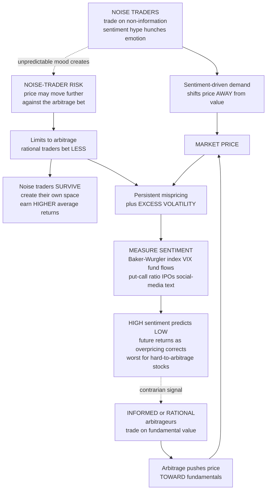

# 🌊 Sentiment and Noise Trading

> [!abstract] TL;DR
> **Noise trading** is buying and selling on *non-information* — sentiment, hype, hunches, emotions, pseudo-signals, models mistaken for facts, or a simple need for liquidity — rather than on fundamental value (Fischer Black's "Noise," 1986). It is a paradox: noise **makes markets possible** (it supplies the liquidity and counterparties without which informed traders could never trade — the Grossman-Stiglitz problem), yet it also **keeps prices noisy and inefficient**. **Investor sentiment** — the aggregate, fundamentals-unjustified mood of (especially retail) investors, Keynes' "animal spirits" — is a measurable, *return-predicting* force. The landmark **De Long-Shleifer-Summers-Waldmann (DSSW, 1990)** model overturned Friedman's confident claim that rational arbitrageurs would quickly bankrupt irrational traders: because noise-trader sentiment is *unpredictable*, it creates **noise-trader risk** that *deters* arbitrage, so mispricing persists, prices carry **excess volatility**, and noise traders can "**create their own space**" — surviving and even earning **higher** average returns for bearing the very risk they generate. Sentiment can be proxied (the **Baker-Wurgler index**, VIX, fund flows, put-call ratios, IPO and turnover data, and now social-media text), and it predicts returns *contrarily*: **high sentiment forecasts low future returns**, most sharply for hard-to-value, hard-to-arbitrage stocks. In the age of Reddit's WallStreetBets, meme stocks, and gamified apps, coordinated social-media noise trading has become a vivid, market-moving force.

---

## Intuition

**Analogy:** Classical theory says prices only move when *real information* arrives — a rational, sober machine repricing on facts. Now watch actual markets. They drift up on **sunny days** and sag under cloud cover. A country's stock index dips the morning after its national **soccer team** loses a big match. A single **tweet** sends a stock lurching. Prices swing on pure mood with no news at all. A huge share of trading is not sober fact-processing — it is people acting on **noise**: hunches, hype, fear, greed, and, above all, *each other*.

The tidy prediction was that these "noise traders" were doomed: they would systematically buy high and sell low, hemorrhage money to the rational "sharks," and quietly go extinct, leaving prices efficient. That is not what happens. Noise traders **persist**. They **move prices**. And — the twist that makes this a deep result rather than a scolding — their very *unpredictability* makes betting against them so dangerous that arbitrageurs pull back, so noise traders survive and can even **earn higher returns for the risk they themselves create**. The market has a mood, and the mood moves money. Everything below is the mechanics of that sentence.

---

## How It Works

### Noise versus information (Black, 1986)

Fischer Black's foundational move was to distinguish **information** (signals genuinely correlated with fundamental value) from **noise** (everything people *mistake* for information — stale news, chart patterns, tips, plausible-sounding models, and gut feel). His striking claims:

1. **Most trading is noise trading.** If everyone traded only on genuine, differential information, rational agents would refuse to trade against each other (why buy from someone who might know more? — the **no-trade theorems** and the **Grossman-Stiglitz paradox**: if prices already reflected all information, no one would be paid to gather it, so no one would, so prices *couldn't* reflect it). Trade requires someone willing to trade for non-informational reasons.
2. **Noise makes markets possible.** Noise traders supply **liquidity** and **counterparties**. They are the "sheep" whose presence lets informed traders profit and lets everyone transact cheaply. Without noise, markets would be thin, illiquid, and frozen.
3. **Noise makes markets inefficient.** The same noise that lubricates trading also pushes prices *away* from value and keeps them there. Black guessed prices stay within a factor of two of value "at least 90 percent of the time" — efficient-ish, but persistently, measurably off. This is **the paradox of noise**: *the trading that makes liquid markets possible is also the source of the very inefficiency it enables.*

### Investor sentiment ("animal spirits")

**Investor sentiment** is the aggregate belief/mood of (especially retail, noise) investors that is *not justified by fundamentals* — waves of optimism and pessimism, Keynes' "**animal spirits**." Sentiment shifts the **demand** for stocks away from value, and it bites hardest on assets that are **hard to value and hard to arbitrage** (small, young, volatile, unprofitable, non-dividend-paying, distressed firms), where no anchor of clear fundamentals or easy hedging exists to pin the price down.

### The DSSW model: why noise traders survive and matter

Milton **Friedman** argued the whole thing away: irrational traders buy high and sell low, lose money to rational arbitrageurs, and are selected out of the market; arbitrage keeps prices efficient. **De Long, Shleifer, Summers, and Waldmann (1990)** built a formal model showing Friedman's argument *fails*. Three linked results:

1. **Noise-trader risk deters arbitrage (limits to arbitrage).** Noise traders' sentiment is *stochastic and unpredictable*. An arbitrageur who shorts an overpriced asset faces the risk that sentiment gets *even more bullish* before it reverts — pushing the price further against the position, possibly forcing a loss or a margin-call liquidation at the worst moment (the **Shleifer-Vishny "limits of arbitrage"** logic). This extra, undiversifiable **noise-trader risk** means rational arbitrageurs *limit the size of their bets*, so **mispricing persists** instead of being competed away.
2. **Noise traders "create their own space."** Because they bear the extra risk *they themselves generate* — and because that risk carries a reward in equilibrium — noise traders can earn a **higher average return** than the cautious arbitrageurs. Being (on average) more bullish, they hold *more* of the risky asset and thus capture *more* of its risk premium. Their return is higher precisely as **compensation for bearing noise-trader risk**. So they do *not* get driven out. Irrationality can, shockingly, **pay**.
3. **Excess volatility.** Fluctuating sentiment injects price movement that has nothing to do with fundamentals, so prices vary *more* than fundamentals do — the empirical "**excess volatility**" puzzle (Shiller) gets a behavioral engine.

### Why noise traders are not arbitraged away

Friedman's "the unfit die out" argument breaks on four rocks: (a) **noise-trader risk limits arbitrage** (DSSW); (b) sentiment is **systematic and correlated** across noise traders (they move *together*, so the risk is not diversifiable and does not wash out); (c) noise traders may be **compensated** for bearing risk (higher expected returns, not pure losses); and (d) **new noise traders keep arriving** (each generation of hopeful retail entrants). The result is the **survival of the unfit** — a defining insight of behavioral finance and the theoretical foundation for sentiment mattering at all. (See the sibling *Market_Anomalies_and_Limits_to_Arbitrage* for the arbitrageur's side of this story, and *Behavioral_Finance_Foundations* for the broader framework.)

### Measuring sentiment, and sentiment predicting returns

Sentiment becomes science when you can **measure** it. Proxies turn "mood" into data: the **Baker-Wurgler index** (from **IPO volume** and **first-day IPO returns**, **closed-end fund discounts**, share **turnover**, the **equity share in new issues**, and the **dividend premium**), **confidence surveys** (AAII bull-bear, University of Michigan), the **VIX** ("fear index"), **fund flows**, **margin debt**, **put-call ratios**, and increasingly **media and social-media text** (Twitter/X, StockTwits, Reddit-WSB, Google Trends). The empirical payoff (**Baker-Wurgler, 2006**): sentiment predicts returns **contrarily** — *high* sentiment today forecasts *low* future returns as overpricing corrects — and the effect is **strongest for hard-to-arbitrage stocks**. Sentiment is thus a **contrarian indicator**, the quantitative form of Buffett's "be fearful when others are greedy."

### Flow / Architecture



---

## Key Concepts

### Secondary Level

**The one idea to keep:** a lot of buying and selling is not based on real news — it is based on **mood, hype, and copying other people**. That is "**noise trading**." Weirdly, markets *need* these traders: if everyone only traded on secret information, nobody would agree to trade at all (why buy from someone who might know more than you?). So noise traders keep the market **liquid** — but they also push prices *away* from what companies are really worth. When the whole crowd gets **optimistic** ("**animal spirits**"), prices float too high; when the crowd panics, prices sink too low.

**The surprising part.** You might think these emotional traders would just lose all their money and disappear. They do not. Because their mood is *unpredictable*, betting against them is **risky**, so the calm, rational traders play it safe and don't fully correct the price. That lets the noise traders **stick around** — and sometimes even **make more money** for taking on the extra risk. And when a crowd gets *too* excited today, prices tend to **fall back** later, which is why "be fearful when others are greedy" is good advice.

### Undergraduate Level

**Black's noise-vs-information distinction.** **Information** moves prices toward value; **noise** is what people *mistake* for information. Because rational agents won't trade against each other on pure information (**no-trade theorems**; the **Grossman-Stiglitz paradox** — informationally efficient prices destroy the incentive to gather information), *some* trade must be non-informational. Noise trading is therefore **essential to liquid markets** and simultaneously **a source of inefficiency** — the paradox of noise.

**The DSSW mechanism, in steps.** (1) Noise traders hold a *random, mean-reverting* misperception of value. (2) Arbitrageurs *would* correct the resulting mispricing, but face **noise-trader risk**: sentiment could worsen before it reverts, and with finite horizons and possible forced liquidation, that risk is real and *systematic* (correlated across the arbitrage population). (3) So arbitrageurs **limit their positions**; mispricing persists and prices show **excess volatility**. (4) Bearing the risk they create, and holding more of the risky asset on average, noise traders can earn **higher average returns** — they "**create their own space**." This is why **Friedman's selection argument fails**: the unfit *survive*.

**Sentiment as a measurable, return-predicting factor.** Aggregate sentiment can be proxied and even distilled into an index (**Baker-Wurgler**). The cross-sectional result: rank stocks by how much they are **buffeted by sentiment** (small, young, volatile, unprofitable, non-dividend-paying, distressed = high sensitivity), and after **high-sentiment** periods those stocks earn **low** subsequent returns (and vice versa). Sentiment is a **contrarian** predictor.

### Graduate Level

**The DSSW equilibrium.** In the canonical overlapping-generations setup, the risky asset's price depends on both fundamentals and the *current* noise-trader misperception, whose *unpredictable future* value is what arbitrageurs cannot hedge. Four channels shape relative returns: the **"hold-more" effect** (bullish noise traders overweight the risky asset and capture more risk premium — *raises* their return), the **"price-pressure" effect** and the **"buy-high" (Friedman) effect** (their demand shifts and mistiming — *lower* it), and the **"create-space" effect** (their own risk-generation raises the equilibrium premium — *raises* it). For a range of parameters the return-raising channels dominate, so noise traders' *expected* return exceeds arbitrageurs' — irrationality survives selection. The result is *not* a free lunch: the higher return is **compensation for higher (self-created) variance**; Sharpe-ratio superiority is not guaranteed.

**Limits to arbitrage as the linchpin.** DSSW is one pillar of the broader **limits-to-arbitrage** program (Shleifer-Vishny, 1997): real arbitrage is done by *specialized, capital-constrained* agents facing **fundamental risk, noise-trader risk, and financing/agency risk**; performance-based capital withdrawal is worst *exactly* when mispricing is largest, so arbitrage can be *destabilizing* at the margin. Sentiment therefore has *first-order* asset-pricing consequences even in a world with sophisticated, rational arbitrageurs.

**Sentiment measurement and identification.** The Baker-Wurgler index is the first principal component of several sentiment proxies, each **orthogonalized** against macro-fundamental controls to isolate the non-fundamental component. Identification is hard: is the "sentiment" proxy capturing mood or an omitted risk factor / time-varying rational risk premium? The **cross-sectional interaction** (sentiment's effect is *concentrated* in hard-to-arbitrage, hard-to-value stocks) is the key evidence that the mechanism is behavioral, not a uniform risk premium. Modern work adds **textual/NLP sentiment** (news tone, social-media polarity) and asks whether machine-extracted mood adds incremental predictive power — a bridge to *Behavioral_Economics_and_Machine_Learning*.

**Mood and market anomalies.** A striking literature finds *non-information affect* moves prices: the **weather effect** (sunshine correlates with higher returns — Hirshleifer-Shumway, 2003), **Seasonal Affective Disorder** and the length-of-day/January patterns (Kamstra-Kramer-Levi), **sports results** (World Cup soccer *losses* depress the loser country's market next day — Edmans-García-Norli, 2007), lunar-cycle and daylight-saving effects. These are **controversial** (data-mining and multiple-testing concerns loom large), but the *direction* is suggestive: **affect moves prices**. The market has a mood ring.

---

## Python Demo

```python
# ---------------------------------------------------------------
# SENTIMENT AND NOISE TRADING
#
# (a) DSSW noise-trader model intuition. A market with a RATIONAL
#     fundamental value and NOISE TRADERS whose sentiment fluctuates
#     as a mean-reverting AR(1). We show:
#       (i)  EXCESS VOLATILITY  -- price varies MORE than fundamentals,
#       (ii) mean-reverting MISPRICING driven by sentiment,
#       (iii)"create their own space" -- because noise traders bear the
#            risk THEY inject and (being optimistic) hold MORE of the
#            risky asset, they earn a HIGHER average return than the
#            cautious arbitrageur -- as compensation for higher variance,
#            NOT a free lunch (Sharpe is not higher).
#
# (b) SENTIMENT PREDICTS RETURNS (Baker-Wurgler). Because sentiment-
#     driven mispricing mean-reverts, HIGH sentiment today forecasts
#     LOW forward returns as the overpricing corrects.
# ---------------------------------------------------------------
import numpy as np
import matplotlib
matplotlib.use("Agg")            # headless-safe backend
import matplotlib.pyplot as plt

rng = np.random.default_rng(7)
T = 4000                          # trading periods

# ===============================================================
# FUNDAMENTAL VALUE: random walk with small positive drift
# (the drift is the risk premium for holding the risky asset)
# ===============================================================
mu_f, sig_f = 0.0003, 0.008       # daily drift ~7.5%/yr, fundamental vol
f_ret = rng.normal(mu_f, sig_f, T)
fundamental = 100.0 * np.exp(np.cumsum(f_ret))

# ===============================================================
# NOISE-TRADER SENTIMENT: mean-reverting AR(1) around a BULLISH bias.
# rho_star > 0 => on average, noise traders are too optimistic.
# ===============================================================
phi, rho_star, sig_s = 0.96, 0.5, 0.30
sentiment = np.empty(T)
sentiment[0] = rho_star
for t in range(1, T):
    sentiment[t] = rho_star + phi * (sentiment[t-1] - rho_star) + rng.normal(0, sig_s)

# Mispricing is proportional to sentiment; limited arbitrage means it
# is NOT competed away -> price = fundamental scaled by the mispricing.
kappa = 0.03                       # 3% price deviation per unit sentiment
misprice = kappa * sentiment       # fractional deviation from fundamental
price = fundamental * (1.0 + misprice)

# ---- (i) EXCESS VOLATILITY -------------------------------------
r_fund  = np.diff(fundamental) / fundamental[:-1]
r_price = np.diff(price)      / price[:-1]
vol_fund, vol_price = r_fund.std(), r_price.std()

print("=" * 64)
print("(a-i) EXCESS VOLATILITY  (noise adds variance beyond fundamentals)")
print("=" * 64)
print(f"    fundamental return vol : {vol_fund:6.4%}")
print(f"    market price return vol: {vol_price:6.4%}"
      f"   -> {vol_price/vol_fund:4.2f}x excess")

# ---- (iii) NOISE TRADERS 'CREATE THEIR OWN SPACE' --------------
# Optimistic noise traders overweight the risky asset (weight > 1);
# cautious arbitrageurs hold the market weight (=1). Rest is risk-free (0%).
w_noise, w_arb = 1.0 + 0.5 * rho_star, 1.0    # 1.25 vs 1.00
ret_noise = w_noise * r_price
ret_arb   = w_arb   * r_price

def stats(x):
    ann = 252
    mean, vol = x.mean() * ann, x.std() * np.sqrt(ann)
    return mean, vol, mean / vol
m_n, v_n, s_n = stats(ret_noise)
m_a, v_a, s_a = stats(ret_arb)

print("\n" + "=" * 64)
print("(a-iii) CREATE THEIR OWN SPACE  (annualised)")
print("=" * 64)
print(f"    NOISE traders : mean {m_n:6.2%}  vol {v_n:6.2%}  Sharpe {s_n:4.2f}")
print(f"    ARBITRAGEURS  : mean {m_a:6.2%}  vol {v_a:6.2%}  Sharpe {s_a:4.2f}")
print("    -> noise traders earn a HIGHER mean return (they bear more")
print("       of the risk they create) but NOT a higher Sharpe: the extra")
print("       return is compensation for risk, not a free lunch.")

# ===============================================================
# (b) SENTIMENT PREDICTS RETURNS  (Baker-Wurgler, contrarian)
# High sentiment (high mispricing) -> low forward return as it reverts.
# ===============================================================
H = 60                                            # forward horizon
fwd = price[H:] / price[:-H] - 1.0                # H-period forward return
sig = (sentiment[:-H] - sentiment[:-H].mean()) / sentiment[:-H].std()  # z-score

# OLS regression: forward_return ~ a + b * sentiment
b, a = np.polyfit(sig, fwd, 1)
corr = np.corrcoef(sig, fwd)[0, 1]

# Quintile sort: mean forward return by sentiment bucket (low -> high)
order = np.argsort(sig)
q = np.array_split(order, 5)
q_sent = [sig[idx].mean() for idx in q]
q_ret  = [fwd[idx].mean() for idx in q]

print("\n" + "=" * 64)
print("(b) SENTIMENT PREDICTS RETURNS  (60-period forward)")
print("=" * 64)
print(f"    slope = {b:+.4f}  correlation = {corr:+.2f}  (NEGATIVE = contrarian)")
for i, (qs, qr) in enumerate(zip(q_sent, q_ret), 1):
    tag = "LOW sentiment" if i == 1 else ("HIGH sentiment" if i == 5 else "")
    print(f"    Q{i}  sentiment {qs:+5.2f}  ->  forward return {qr:+6.2%}  {tag}")

# ===============================================================
# FIGURE: 4 panels
# ===============================================================
fig, ax = plt.subplots(2, 2, figsize=(15, 10))

# Panel 1: price vs fundamental -> excess volatility / mispricing
win = slice(0, 800)
ax[0, 0].plot(fundamental[win], color="black", lw=1.8, label="Fundamental value")
ax[0, 0].plot(price[win], color="crimson", lw=1.1, alpha=0.85,
              label="Market price (with noise)")
ax[0, 0].fill_between(range(len(price[win])), fundamental[win], price[win],
                      color="crimson", alpha=0.15)
ax[0, 0].set_title("Noise trading adds EXCESS VOLATILITY\nprice swings around fundamental value")
ax[0, 0].set_xlabel("Time"); ax[0, 0].set_ylabel("Level")
ax[0, 0].legend(fontsize=8); ax[0, 0].grid(alpha=0.3)

# Panel 2: mispricing time series -- persistent, mean-reverting
ax[0, 1].plot(100 * misprice[win], color="teal", lw=1.2)
ax[0, 1].axhline(0, color="black", ls="--", lw=1)
ax[0, 1].axhline(100 * misprice.mean(), color="crimson", ls=":", lw=1.5,
                 label=f"mean bias = {100*misprice.mean():+.1f}%")
ax[0, 1].set_title("Sentiment creates PERSISTENT, mean-reverting mispricing")
ax[0, 1].set_xlabel("Time"); ax[0, 1].set_ylabel("Mispricing (% from value)")
ax[0, 1].legend(fontsize=8); ax[0, 1].grid(alpha=0.3)

# Panel 3: create their own space -- return vs risk bars
labels = ["Noise\ntraders", "Arbitrageurs"]
xpos = np.arange(2)
ax[1, 0].bar(xpos - 0.18, [m_n * 100, m_a * 100], width=0.36,
             color="crimson", label="Mean return (annual %)")
ax[1, 0].bar(xpos + 0.18, [v_n * 100, v_a * 100], width=0.36,
             color="steelblue", label="Volatility (annual %)")
ax[1, 0].set_xticks(xpos); ax[1, 0].set_xticklabels(labels)
ax[1, 0].set_title("Create their own space\nnoise traders earn MORE return for MORE risk")
ax[1, 0].set_ylabel("Annualised %")
ax[1, 0].legend(fontsize=8); ax[1, 0].grid(axis="y", alpha=0.3)

# Panel 4: sentiment predicts returns (scatter + line + quintiles)
sub = rng.choice(len(sig), size=1500, replace=False)
ax[1, 1].scatter(sig[sub], 100 * fwd[sub], s=6, alpha=0.25, color="gray")
xs = np.linspace(sig.min(), sig.max(), 100)
ax[1, 1].plot(xs, 100 * (a + b * xs), color="crimson", lw=2.4,
              label=f"fit: slope {b*100:+.2f}%  corr {corr:+.2f}")
ax[1, 1].plot(q_sent, [100 * r for r in q_ret], "o-", color="black",
              lw=2, ms=8, label="quintile means")
ax[1, 1].axhline(0, color="black", ls="--", lw=0.8)
ax[1, 1].set_title("HIGH sentiment predicts LOW forward returns\n(Baker-Wurgler contrarian signal)")
ax[1, 1].set_xlabel("Investor sentiment (z-score)")
ax[1, 1].set_ylabel("Forward return (%)")
ax[1, 1].legend(fontsize=8); ax[1, 1].grid(alpha=0.3)

plt.tight_layout()
plt.savefig("sentiment_and_noise_trading.png", dpi=120, bbox_inches="tight")
plt.show()
```

**What the demo shows:**

- **Panel 1 (excess volatility):** the red market price swings *around* the black fundamental — the price varies more than value does, the "excess volatility" DSSW predicts. The printout confirms market return vol exceeds fundamental vol.
- **Panel 2 (persistent mispricing):** the sentiment-driven deviation from value is not white noise — it *drifts and mean-reverts*, with a positive average (the noise traders' bullish bias). Prices stay wrong for a while.
- **Panel 3 (create their own space):** the optimistic noise traders overweight the risky asset, so they earn a *higher mean return* — but with *higher volatility*. The key nuance (printed as Sharpe): it is **compensation for bearing the risk they create**, not a free lunch. This is why Friedman's "they lose and disappear" fails.
- **Panel 4 (sentiment predicts returns):** the regression slope and quintile means are **negative** — high sentiment today forecasts *low* forward returns as the overpricing corrects. Sentiment is a **contrarian** predictor, the Baker-Wurgler result in miniature.

---

## Real-World Applications

> **Meme stocks and social-media noise trading (GameStop, 2021).** The clearest modern illustration: Reddit's **WallStreetBets** coordinated a crowd of retail **noise traders** to buy **GameStop** and **AMC** en masse, driving prices *orders of magnitude* above any fundamental value and forcing a **short squeeze** on hedge funds. Every DSSW ingredient is visible — sentiment/hype as the driver, **noise-trader risk** that made shorting ruinous (arbitrageurs who "knew" it was overpriced were blown up as sentiment got *more* extreme before reverting), and coordination amplified at internet scale. Gamified, zero-commission apps (Robinhood) mobilized noise traders; the episode is a live experiment in sentiment moving prices.

- **Sentiment-factor and contrarian investing.** Quant desks build **sentiment indices** (Baker-Wurgler style, plus VIX, put-call ratios, fund flows, and **NLP** on news and social media) and *fade* extremes — buying hated, high-fear assets and trimming euphoric ones. The strategy's edge is concentrated in the hard-to-arbitrage names the theory flags.
- **Risk management and crowded trades.** Noise-trader risk *is* the risk that a "correct" arbitrage moves against you before it pays. Desks monitor **crowdedness**, short interest, and sentiment extremes to avoid being on the wrong side of a squeeze — the meme-stock lesson institutionalized.
- **Crypto hype cycles.** Assets with *no* fundamental anchor are pure sentiment vehicles; boom-bust cycles in Bitcoin, altcoins, and NFTs track social-media hype, influencer tweets, and Google-search intensity far more than any cash-flow model.
- **Regulation and market integrity.** Sentiment/noise dynamics motivate **retail-investor protections**, scrutiny of **social-media manipulation** and **pump-and-dump** schemes, disclosure of payment-for-order-flow, and circuit breakers for sentiment-driven volatility spikes.

---

## Common Pitfalls

- **Assuming rational arbitrage always wins ("the market can't stay wrong").** DSSW's whole point: **noise-trader risk** means the mispricing can *widen* and stay wide longer than an arbitrageur can stay solvent — "the market can stay irrational longer than you can stay solvent" (Keynes). Betting against sentiment is not a riskless free lunch; it is a risky trade that can bankrupt you first.
- **Treating sentiment as pure irrational error with no price impact.** The classical view says noise "washes out." It does not: sentiment is **systematic and correlated** across traders, so it is *not* diversifiable and it *moves aggregate prices*. Ignoring it leaves excess volatility and predictable returns unexplained.
- **Confusing sentiment (contrarian) with momentum (trend).** *Extreme* sentiment predicts *reversal* (contrarian, longer horizon), while sentiment *changes* can fuel *short-run momentum*. Using a sentiment extreme as a same-day trend signal, or a momentum signal as a long-horizon value signal, conflates two different mechanisms.
- **Over-mining mood anomalies.** Weather, sports, lunar, and daylight-saving effects are *suggestive* but sit in a garden of forking paths — huge datasets, many candidate calendars, and multiple-testing risk. Treat any single mood-anomaly as fragile until replicated out-of-sample; the *aggregate* case that affect moves prices is stronger than any one effect.
- **Naive social-media sentiment scoring.** Raw bullish-word counts are gamed by bots, sarcasm, and coordinated hype; sentiment text needs de-biasing, bot filtering, and out-of-sample validation before it predicts anything. Backtests of textual sentiment are especially prone to look-ahead and survivorship bias.
- **Believing higher noise-trader returns mean noise trading is "smart."** In the model, the extra return is **risk compensation**, not skill or a higher Sharpe ratio. On a risk-adjusted basis noise traders are *not* winning — they simply survive because they are paid for bearing (self-created) risk. Do not confuse survival with superiority.

---

## Related Concepts

- [[Foundations_of_Behavioral_Finance]] — the parent framework; noise trading and sentiment are the mechanism by which behavioral biases become *aggregate* mispricing.
- [[Market_Anomalies_and_Bubbles]] — sentiment and limited arbitrage are the engine behind the anomalies and bubbles catalogued there; excess volatility is their fingerprint.
- [[Cognitive_Biases_in_Investing]] — the individual-investor biases (overoptimism, herding, extrapolation) that *aggregate* into investor sentiment.
- [[Behavioral_Finance]] — the Finance-vault overview situating noise traders and limits to arbitrage against the efficient-markets baseline.
- [[Overconfidence_and_Calibration]] — overconfident investors overtrade and misprice precision; a core micro-foundation of the "noise" in noise trading.
- [[Statistical_Arbitrage]] — the practitioner's arbitrage that noise-trader risk constrains; shows *why* mispricing is not competed away instantly.
- [[Factor_Models]] — where a "sentiment factor" lives alongside value, size, and momentum in cross-sectional return models.
- [[Volatility_Smile]] — implied volatility and the VIX, the "fear index" used as a real-time sentiment proxy.
- [[NLP_for_Finance]] — machine extraction of news and social-media sentiment, the modern way "mood" is turned into a trading signal.
- [[Network_Dynamics_and_Contagion]] — the systems-thinking view of how sentiment spreads and herds through investor networks, coordinating noise trading at scale.
- [[Global_Financial_Crises]] — sentiment-driven booms and busts writ macro; animal spirits in the aggregate economy.
- [[Emotion_Theories]] — the psychology of affect and mood that underlies the weather, SAD, and sports "mood" effects on markets.
- [[Social_Influence_and_Conformity]] — the social-psychology mechanism (herding, conformity) that makes sentiment *correlated* across traders and thus non-diversifiable.

*Not yet written (Behavioral_Economics siblings referenced above in prose): Behavioral_Finance_Foundations, Market_Anomalies_and_Limits_to_Arbitrage, Herding_Bubbles_and_Crashes, and Behavioral_Economics_and_Machine_Learning.*

---

## Review Questions

### Secondary

1. In plain language, what is the difference between trading on **information** and trading on **noise**? Give one everyday example of each.
2. Why do markets *need* noise traders at all — what would happen to liquidity if everyone only traded on genuine information?
3. If a stock has become wildly popular and everyone is euphoric about it, what does the "high sentiment predicts low returns" idea suggest about its future, and how does this connect to "be fearful when others are greedy"?

### Undergraduate

1. State **Friedman's** argument that irrational traders are selected out of the market, then explain the **two** DSSW mechanisms — **noise-trader risk** and "**create their own space**" — that show why the argument fails.
2. Explain the **paradox of noise**: how can noise trading be *both* essential to liquid markets *and* a source of inefficiency? Reference the **Grossman-Stiglitz** problem.
3. Baker-Wurgler find that high sentiment predicts low future returns, but only for certain stocks. **Which** stocks are most affected and **why** does the effect concentrate there rather than in large, stable, dividend-paying firms?

### Graduate

1. In the DSSW demo, noise traders earn a *higher mean return* but *not* a higher Sharpe ratio. Interpret this economically: in what precise sense is their extra return "compensation for risk they create," and why does it *not* imply skill or a violation of no-arbitrage in a frictionless sense?
2. You have a candidate social-media sentiment signal that predicts next-week returns in backtest. Design an identification and validation plan that distinguishes a *genuine behavioral* sentiment effect from (a) an omitted time-varying rational risk premium and (b) look-ahead / multiple-testing artifacts. What cross-sectional prediction would most cleanly favor the behavioral interpretation?
3. Weather, SAD, and sports-result "mood" effects are widely cited yet contested. Lay out the strongest **statistical critique** (multiple testing, forking paths, publication bias) and the strongest **defense** (out-of-sample replication, a common affect mechanism, ex-ante hypotheses). On balance, how much weight should an asset-pricing model place on affect?

---

## Sources

- [Black, F. (1986). "Noise." *The Journal of Finance* 41(3), 528–543](https://doi.org/10.1111/j.1540-6261.1986.tb04513.x)
- [De Long, J. B., Shleifer, A., Summers, L. H. & Waldmann, R. J. (1990). "Noise Trader Risk in Financial Markets." *Journal of Political Economy* 98(4), 703–738](https://doi.org/10.1086/261703)
- [Baker, M. & Wurgler, J. (2006). "Investor Sentiment and the Cross-Section of Stock Returns." *The Journal of Finance* 61(4), 1645–1680](https://doi.org/10.1111/j.1540-6261.2006.00885.x)
- [Shleifer, A. & Vishny, R. W. (1997). "The Limits of Arbitrage." *The Journal of Finance* 52(1), 35–55](https://doi.org/10.1111/j.1540-6261.1997.tb03807.x)
- [Edmans, A., García, D. & Norli, Ø. (2007). "Sports Sentiment and Stock Returns." *The Journal of Finance* 62(4), 1967–1998](https://doi.org/10.1111/j.1540-6261.2007.01262.x)

---

#behavioral-economics #noise-trading #investor-sentiment #excess-volatility #behavioral-finance
