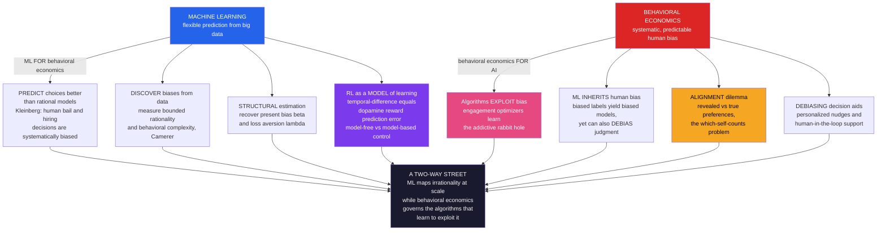

# 🤖 Behavioral Economics and Machine Learning

> [!abstract] TL;DR
> **Behavioral economics** and **machine learning** form a **two-way street**. Going one way, **ML is a powerful tool for behavioral science**: it can **predict human choices** (clicks, defaults, purchases, bail, hiring) far better than the rational-actor model — and in doing so **benchmark human error** (Kleinberg et al. show human decisions are systematically suboptimal versus algorithms), **discover biases** we never hypothesized, **measure bounded rationality** and the predictability of behavior (Camerer), and **structurally estimate behavioral parameters** — recovering a person's present-bias $\beta$ or loss-aversion $\lambda$ from their choices. A deep bridge sits underneath: **reinforcement learning** (temporal-difference learning) is both an AI algorithm *and* a model of how humans and animals **learn value from reward**, matching **dopamine reward-prediction-error** and mapping model-free (habitual) vs model-based (deliberate) control onto dual-process cognition. Going the other way, **behavioral economics is essential for governing ML/AI**: engagement-optimizing algorithms — recommenders, feeds, ads, "slot-machine" apps, dark patterns — **learn to exploit and amplify human biases** (present bias, novelty and variable-reward craving, outrage, social validation) at population scale; ML trained on **biased human data inherits human prejudice**; and **AI alignment** confronts a profoundly behavioral dilemma — should AI serve people's **revealed preferences** (what they click, which reflect bias and manipulation) or their **reflective true preferences** (what they would endorse and their long-run welfare)? That is the same *which-self-counts* problem as paternalism, now weaponized at algorithmic scale — making this convergence one of the most consequential frontiers for **human autonomy in an algorithm-saturated world**.

---

## Intuition

**Analogy:** For decades, economists modeled humans as coldly rational, then studied our deviations from that ideal *by hand* — one clever experiment, one named bias at a time (anchoring here, loss aversion there). It was like cataloguing a jungle by walking through it with a notebook. Machine learning hands the behavioral scientist a **satellite and a swarm of drones**: it can now sift *millions* of real decisions and surface the patterns of human behavior we never thought to look for — even *measuring how predictable a single person is*, or building a model that forecasts your next click better than you could predict it yourself. The systematic structure of "irrationality" stops being a hand-drawn map and becomes a photograph.

But the same technology has a shadow. The drones do not just observe — they can be flown by an **engagement optimizer** whose only goal is to keep you scrolling. Trained on your biased choices and rewarded for your attention, an algorithm will *discover your weaknesses and pull them*: it learns which tempting video keeps a present-biased user watching, which outrage keeps a negativity-biased user furious, which variable reward keeps a novelty-seeker refreshing. So the relationship runs **both ways at once**. ML helps us *map* human irrationality at scale and *detect* bias; behavioral economics warns that those very algorithms — optimizing for engagement over welfare — can *amplify* our worst tendencies and *manipulate us* at a scale no advertiser of the twentieth century could dream of.

---

## How It Works

### The two-way street

The intersection has two directions, and confusing them is the single most common mistake in the area.

**Direction 1 — ML *for* behavioral economics (a scientific instrument).** Here ML is a tool that makes behavioral science bigger, faster, and more discovery-driven.

1. **Prediction as a benchmark for human error.** Flexible models (gradient-boosted trees, neural nets) predict real choices — defaults taken, links clicked, products bought, loans repaid — vastly better than a parsimonious rational model. Crucially, prediction can *expose* human suboptimality: **Kleinberg, Lakkaraju, Leskovec, Ludwig and Mullainathan (2018)** showed that in pretrial **bail** decisions, an algorithm trained to predict flight risk could cut crime with no rise in jail populations (or cut jail with no rise in crime), because human judges are **systematically, predictably biased** — over-weighting the wrong cues and mispredicting risk. The ML model becomes a *yardstick* against which human judgment is revealed to be noisy and biased. The same logic recurs in hiring, medical diagnosis, and lending.
2. **Discovering biases and mechanisms.** Rather than testing one pre-registered bias, ML lets the *data* nominate anomalies: which features actually drive a choice, where behavior departs from theory, and how *complex* (hence how far from a simple optimizer) a decision rule is. **Camerer (2019)** frames ML as a way to **measure bounded rationality** — to quantify how much systematic, predictable structure remains in "noise" — and even to *generate and test new behavioral hypotheses*. Behavioral science shifts from hand-crafted biases toward **data-driven discovery**.
3. **Structural behavioral estimation.** The most rigorous fusion embeds behavioral *theory* inside estimation: use choice data to **recover behavioral parameters** — present bias $\beta$, discount factor $\delta$, loss aversion $\lambda$, probability-weighting curvature, risk attitudes — via maximum likelihood, while using ML for flexible functional forms and heterogeneity. This *quantifies irrationality* per person and connects behavioral economics to **structural econometrics** (the Python demo does exactly this: recover $\beta$ from choices).

**The RL bridge (belongs to both directions).** **Reinforcement learning** is simultaneously an AI method and a *model of human learning*. **Temporal-difference (TD) learning** — updating a value estimate by the gap between expected and received reward — matches the phasic firing of midbrain **dopamine** neurons, which encode a **reward-prediction error** (Schultz, Dayan, Montague, 1997). This is the foundation of **neuroeconomics** (a not-yet-written sibling, *Neuroeconomics*). The RL toolkit also splits into **model-free** control (cached, habitual, System-1-like) and **model-based** control (a planned, goal-directed forward search, System-2-like) — a computational rendering of **dual-process theory**. Behavioral RL models can be *fit to human learning* and its distortions, and the bridge extends further: in evolutionary game theory, reinforcement learning dynamics converge to the **replicator equation** (see the sibling frontier note in that vault).

**Direction 2 — behavioral economics *for* ML/AI (a governance necessity).** Here behavioral economics is what you *need to understand and control* systems that learn from, model, and increasingly *act on* biased humans.

4. **Algorithms that exploit and amplify bias.** A recommender, feed, or ad system trained to **maximize engagement** (clicks, watch-time, revenue) will, by gradient descent alone, *discover and pull* human biases: present bias and variable reward produce **"slot-machine" addictive design**; novelty-seeking produces the **rabbit hole**; negativity/outrage bias produces **amplified misinformation and extremism**; social-validation needs produce compulsive checking. The **attention economy** is behavioral insight *weaponized* — and behavioral economics is the diagnosis of the resulting harm.
5. **Algorithmic bias and fairness (the mirror).** ML trained on **biased human data** inherits and can *amplify* human prejudice — discriminatory labels in hiring, lending, policing, and criminal justice become discriminatory predictions, sometimes in a self-reinforcing feedback loop. Yet the same technology can *debias*: structured, consistent, evidence-based algorithms **outperform biased human judgment** in many domains. Algorithms have **two faces** — mirror of our bias, and potential corrective.
6. **Alignment: revealed vs true preferences.** The deepest challenge. Should AI optimize what people **reveal** (what they click and choose — laden with present bias, framing, and manipulation) or what they would **endorse on reflection** (their long-run welfare)? Behavioral welfare economics has already shown **revealed $\neq$ normative** (Beshears et al.). Aligning AI therefore requires answering *which preferences count* — the identical **"which self"** problem that haunts paternalism and nudging. **Behavioral welfare economics meets AI alignment.**
7. **Debiasing and decision support (the constructive use).** AI need not only exploit; it can *help*. **Personalized nudges** (ML targets the right nudge to the right person), forecasting aids, **reference-class / outside-view** tools, calibration training, and **human-in-the-loop** systems can act as a *debiasing partner* — smart choice architecture that scales.

### Diagram: the two-way street



---

## Key Concepts

### Secondary (intuition level)
- **Computers can guess what you'll do.** Trained on lots of past choices, a program can often predict your next click, purchase, or decision better than a simple "people are rational" story — and better than you would guess yourself.
- **That guessing exposes our mistakes.** When an algorithm predicts, say, who will skip a court date more accurately than a judge, it reveals that human judgments were biased and inconsistent all along.
- **The same tech can hook you.** An app that is rewarded only for keeping you scrolling will *learn your weak spots* — the tempting video, the outrage post, the "just one more" — and pull them. Optimization plus human bias equals a rabbit hole.
- **Whose wishes should the AI follow?** Your clicks (which are often impulsive) or what you'd actually want on reflection (your long-run good)? These two can point in opposite directions — and choosing between them is a genuine values problem, not a technical one.

### Undergraduate (mechanism level)
- **Prediction as a benchmark (Kleinberg et al.).** In "prediction policy problems," the payoff hinges on forecasting an outcome (will this defendant reappear? will this patient benefit?). ML forecasts beat human experts *and* reveal humans are **systematically biased**, not merely noisy — the algorithm is a yardstick for human error.
- **Structural estimation of behavioral parameters.** Given choices between smaller-sooner and larger-later rewards, fit a **quasi-hyperbolic ($\beta$–$\delta$)** model by maximum likelihood to recover the **present-bias factor $\beta$**; a **rational (exponential, $\beta = 1$)** model is the nested null. Loss aversion $\lambda$ and probability weighting are recovered the same way from risky choices (prospect theory).
- **RL as human learning.** The **TD update** $V \leftarrow V + \alpha\,\delta_{\text{TD}}$ with prediction error $\delta_{\text{TD}} = r + \gamma V' - V$ *is* the dopamine reward-prediction-error signal. **Model-free** RL caches values (habits); **model-based** RL plans over a world model (goal-directed) — a computational **System 1 vs System 2**.
- **Engagement optimization exploits bias.** A recommender maximizing predicted clicks in a *nonstationary* world where clicking junk *raises craving* will lock onto junk — a self-created rabbit hole. Contrast a **long-run-welfare objective**, which sacrifices some clicks for wellbeing.
- **Algorithmic bias.** If training labels encode human discrimination (e.g., who was *arrested* rather than who *offended*), the model reproduces and can amplify it — while a well-designed algorithm can also *reduce* inconsistency relative to biased humans.

### Graduate (frontier level)
- **Measuring bounded rationality with ML (Camerer).** Treat the gap between a flexible predictor's accuracy and a structural rational model's accuracy as an estimate of *how much predictable structure* human behavior contains beyond optimization — an operational measure of **bounded rationality** and behavioral **complexity/predictability**. ML can also *propose* candidate anomalies (feature importances, residual structure) for confirmatory experiments.
- **Resource-rational analysis (Lieder & Griffiths).** Formalize heuristics as **optimal given computational costs**: the mind approximately maximizes expected value *net of the cost of computation*, so many "biases" are *rational* under resource constraints. This unifies bounded rationality with Bayesian and RL models and, reciprocally, motivates building **AI agents with human-like bounded rationality** (meta-reasoning, anytime algorithms).
- **The alignment dilemma, formalized.** Let $u^R$ be revealed-preference utility (rationalizing choices, hence contaminated by $\beta < 1$, framing, and manipulation) and $u^*$ the normative/reflective utility. Engagement objectives optimize a proxy correlated with $u^R$; **welfare** requires $u^*$. **Beshears et al. (2008)** enumerate when revealed and normative preferences diverge (passive choice, inexperience, third-party marketing, present bias). Alignment (Russell's *Human Compatible*; RLHF; Constitutional AI) must decide *which* preferences to infer and serve — a behavioral-welfare judgment, not a purely technical one. This is the AI face of **libertarian paternalism's** "which self."
- **Feedback loops and performativity.** Recommenders **shape** the very preferences they estimate (preference drift, radicalization dynamics), so the training distribution is *endogenous* to the policy; ignoring this yields runaway amplification. Behavioral-economic modeling of the human as a *state that the algorithm moves* is required for safe long-horizon optimization.
- **Personalization and the ethics of scale.** ML-targeted nudges and ads raise **manipulation** and **autonomy** concerns: the more precisely an algorithm knows *your* biases, the sharper both the debiasing help and the exploitation. Regulating **algorithmic manipulation** (dark patterns, engagement-maximization) is an emerging frontier — the applied stakes of the not-yet-written sibling *The_Reach_and_Future_of_Behavioral_Economics*.

---

## Python Demo

```python
# ======================================================================
# BEHAVIORAL ECONOMICS x MACHINE LEARNING
#
# PART (a) ML / STRUCTURAL ESTIMATION MEETS BEHAVIORAL CHOICE
#   Synthetic agent = quasi-hyperbolic (beta-delta) DISCOUNTER choosing
#   between smaller-sooner (SS) and larger-later (LL) rewards. We RECOVER
#   the hidden present-bias beta from choices by maximum likelihood, and
#   show a BEHAVIORAL model PREDICTS held-out choices better than a
#   RATIONAL (exponential, beta = 1) model. ML as a lens on hidden bias.
#
# PART (b) ALGORITHMS THAT EXPLOIT / AMPLIFY BIAS
#   An engagement optimizer (bandit maximizing clicks) faces a user whose
#   craving for "junk" content RISES the more junk they consume (present
#   bias + variable reward). Maximizing clicks drives a self-created
#   RABBIT HOLE: craving -> 1, wellbeing collapses. We contrast this with
#   a LONG-RUN-WELFARE objective that sacrifices some clicks for wellbeing.
# ======================================================================
import numpy as np
import matplotlib
matplotlib.use("Agg")
import matplotlib.pyplot as plt

rng = np.random.default_rng(0)

# ----------------------------------------------------------------------
# PART (a): recover present bias beta from choices
# ----------------------------------------------------------------------
beta_true, delta_true, tau = 0.60, 0.97, 0.15    # tau = choice sensitivity

def weight(delay, beta, delta):
    """Present weight on a reward 'delay' periods away (beta-delta model)."""
    return np.where(delay == 0.0, 1.0, beta * delta ** delay)

N = 6000
amt_ss   = rng.uniform(10, 40, N)                 # smaller-sooner amount
amt_ll   = amt_ss + rng.uniform(5, 45, N)         # larger-later amount (> SS)
delay_ss = rng.integers(0, 3, N).astype(float)    # 0..2 periods away
delay_ll = delay_ss + rng.integers(3, 15, N)      # strictly later

def choice_prob(beta, delta, tau, d_ss, a_ss, d_ll, a_ll):
    v_ss = weight(d_ss, beta, delta) * a_ss
    v_ll = weight(d_ll, beta, delta) * a_ll
    return 1.0 / (1.0 + np.exp(-tau * (v_ll - v_ss)))   # P(choose larger-later)

p_ll   = choice_prob(beta_true, delta_true, tau,
                     delay_ss, amt_ss, delay_ll, amt_ll)
choice = (rng.random(N) < p_ll).astype(int)       # 1 = chose larger-later

# --- split into train/test, then estimate by grid-search MLE ----------
idx = rng.permutation(N); tr, te = idx[:N // 2], idx[N // 2:]

def total_ll(beta, delta, sub):
    p = choice_prob(beta, delta, tau,
                    delay_ss[sub], amt_ss[sub], delay_ll[sub], amt_ll[sub])
    p = np.clip(p, 1e-9, 1 - 1e-9)
    y = choice[sub]
    return np.sum(y * np.log(p) + (1 - y) * np.log(1 - p))

betas  = np.linspace(0.30, 1.00, 71)
deltas = np.linspace(0.90, 0.999, 40)

# BEHAVIORAL model: free beta and delta (profile LL over delta for each beta)
prof_beta = np.array([max(total_ll(b, d, tr) for d in deltas) for b in betas])
beta_hat  = betas[int(np.argmax(prof_beta))]
delta_hat = deltas[int(np.argmax([total_ll(beta_hat, d, tr) for d in deltas]))]

# RATIONAL model: beta fixed at 1, free delta
dstar_rat = deltas[int(np.argmax([total_ll(1.0, d, tr) for d in deltas]))]

def accuracy(beta, delta, sub):
    p = choice_prob(beta, delta, tau,
                    delay_ss[sub], amt_ss[sub], delay_ll[sub], amt_ll[sub])
    return np.mean((p > 0.5).astype(int) == choice[sub])

acc_beh = accuracy(beta_hat, delta_hat, te)
acc_rat = accuracy(1.0, dstar_rat, te)

print("=" * 66)
print("PART (a)  RECOVERING PRESENT BIAS FROM CHOICES")
print("=" * 66)
print(f"true present bias beta       : {beta_true:.2f}")
print(f"RECOVERED beta (behavioral)  : {beta_hat:.2f}   (delta_hat = {delta_hat:.3f})")
print(f"held-out accuracy  rational  : {acc_rat:.3f}   (beta forced to 1)")
print(f"held-out accuracy  behavioral: {acc_beh:.3f}   (free beta)")
print(f"=> the behavioral model both RECOVERS beta and PREDICTS better.\n")

# ----------------------------------------------------------------------
# PART (b): an engagement optimizer exploits a present-biased user
# ----------------------------------------------------------------------
def simulate(policy, T=300, seed=1):
    r = np.random.default_rng(seed)
    craving = 0.0
    p_j0, kappa, p_n = 0.40, 0.6, 0.32     # junk base, craving slope, nutritious click
    a_up, a_dec = 0.06, 0.03               # craving build / decay
    est = {"junk": 0.5, "nutri": 0.5}; cnt = {"junk": 1.0, "nutri": 1.0}
    cum_eng, cum_well, n_junk = 0, 0.0, 0
    cr, frac, eng, well = [], [], [], []
    for t in range(T):
        p_junk = min(p_j0 + kappa * craving, 0.97)   # variable-reward craving
        if policy == "engagement":
            # bandit maximizing IMMEDIATE clicks (epsilon-greedy)
            if r.random() < 0.10:
                arm = r.choice(["junk", "nutri"])
            else:
                arm = "junk" if est["junk"] >= est["nutri"] else "nutri"
        else:  # welfare: pick the arm with higher expected WELLBEING increment
            arm = "nutri" if p_n >= -p_junk else "junk"   # -> always nutritious
        p_click = p_junk if arm == "junk" else p_n
        clicked = int(r.random() < p_click)
        cum_eng += clicked
        if arm == "junk":
            n_junk += 1
            craving = min(1.0, craving + a_up * clicked)  # habit builds
            cum_well += -1.0 * clicked                    # long-run regret
            cnt["junk"] += 1; est["junk"] += (clicked - est["junk"]) / cnt["junk"]
        else:
            craving = max(0.0, craving - a_dec)           # craving decays
            cum_well += 1.0 * clicked                      # nourishing content
            cnt["nutri"] += 1; est["nutri"] += (clicked - est["nutri"]) / cnt["nutri"]
        cr.append(craving); frac.append(n_junk / (t + 1))
        eng.append(cum_eng); well.append(cum_well)
    return {k: np.array(v) for k, v in
            dict(craving=cr, frac=frac, eng=eng, well=well).items()}

eng_run = simulate("engagement")
wel_run = simulate("welfare")

print("=" * 66)
print("PART (b)  ENGAGEMENT OPTIMIZATION vs LONG-RUN WELFARE")
print("=" * 66)
print(f"engagement-max: clicks {eng_run['eng'][-1]:4d} | final craving "
      f"{eng_run['craving'][-1]:.2f} | wellbeing {eng_run['well'][-1]:+6.0f}")
print(f"welfare-aware : clicks {wel_run['eng'][-1]:4d} | final craving "
      f"{wel_run['craving'][-1]:.2f} | wellbeing {wel_run['well'][-1]:+6.0f}")
print("=> maximizing clicks drives a rabbit hole (craving up, wellbeing down).")

# ------------------------------- FIGURE -------------------------------
fig, ax = plt.subplots(2, 2, figsize=(14, 10))
fig.suptitle("Behavioral Economics x Machine Learning",
             fontsize=15, fontweight="bold")

# (0,0) profile log-likelihood: peak recovers the true beta
ax[0, 0].plot(betas, prof_beta - prof_beta.max(), color="#2563eb", lw=2.4)
ax[0, 0].axvline(beta_true, color="#059669", ls="--", lw=2, label="true beta")
ax[0, 0].axvline(beta_hat, color="#dc2626", ls=":", lw=2, label="recovered beta")
ax[0, 0].set_title("(a1) ML recovers hidden present bias\nprofile log-likelihood peaks at beta")
ax[0, 0].set_xlabel("present-bias factor beta")
ax[0, 0].set_ylabel("relative log-likelihood")
ax[0, 0].legend(fontsize=9); ax[0, 0].grid(alpha=0.3)

# (0,1) held-out predictive accuracy: behavioral beats rational
bars = ax[0, 1].bar(["rational\n(beta = 1)", "behavioral\n(free beta)"],
                    [acc_rat, acc_beh],
                    color=["#9ca3af", "#7c3aed"], edgecolor="black")
for b, v in zip(bars, [acc_rat, acc_beh]):
    ax[0, 1].text(b.get_x() + b.get_width() / 2, v + 0.004,
                  f"{v:.3f}", ha="center", fontsize=10, fontweight="bold")
ax[0, 1].set_ylim(0.5, max(acc_beh, acc_rat) + 0.05)
ax[0, 1].set_title("(a2) Behavioral features improve prediction\n(held-out choice accuracy)")
ax[0, 1].set_ylabel("accuracy"); ax[0, 1].grid(axis="y", alpha=0.3)

# (1,0) rabbit hole: craving over time under the two objectives
T = len(eng_run["craving"]); tt = np.arange(T)
ax[1, 0].plot(tt, eng_run["craving"], color="#dc2626", lw=2.4,
              label="engagement-max (rabbit hole)")
ax[1, 0].plot(tt, wel_run["craving"], color="#059669", lw=2.4,
              label="welfare-aware")
ax[1, 0].fill_between(tt, eng_run["craving"], wel_run["craving"],
                      color="#f5a623", alpha=0.20)
ax[1, 0].set_title("(b1) Optimizing clicks manufactures craving\n(self-created over-consumption spiral)")
ax[1, 0].set_xlabel("time step"); ax[1, 0].set_ylabel("user craving for junk")
ax[1, 0].legend(fontsize=9); ax[1, 0].grid(alpha=0.3)

# (1,1) the engagement-vs-welfare tradeoff
ax[1, 1].plot(eng_run["eng"], eng_run["well"], color="#dc2626", lw=2.4,
              label="engagement-max")
ax[1, 1].plot(wel_run["eng"], wel_run["well"], color="#059669", lw=2.4,
              label="welfare-aware")
ax[1, 1].axhline(0, color="black", lw=0.8)
ax[1, 1].scatter([eng_run["eng"][-1]], [eng_run["well"][-1]],
                 color="#dc2626", zorder=5)
ax[1, 1].scatter([wel_run["eng"][-1]], [wel_run["well"][-1]],
                 color="#059669", zorder=5)
ax[1, 1].set_title("(b2) More clicks, less wellbeing\nengagement is a poor proxy for welfare")
ax[1, 1].set_xlabel("cumulative clicks (engagement)")
ax[1, 1].set_ylabel("cumulative user wellbeing")
ax[1, 1].legend(fontsize=9); ax[1, 1].grid(alpha=0.3)

plt.tight_layout(rect=[0, 0, 1, 0.95])
plt.savefig("behavioral_economics_and_machine_learning.png", dpi=115,
            bbox_inches="tight")
print("\nSaved figure: behavioral_economics_and_machine_learning.png")
```

**What the demo shows.** *Part (a)* generates choices from a hidden **present-biased ($\beta = 0.6$)** agent and then asks ML/structural estimation to *reverse-engineer the bias from behavior alone*. Panel (a1) plots the **profile log-likelihood** over $\beta$: it peaks right at the true value, so maximum likelihood **recovers the present-bias parameter** we never observe directly. Panel (a2) makes the predictive point — a **rational model** that forces $\beta = 1$ is a *misspecified null*; the **behavioral model** with a free $\beta$ predicts held-out choices more accurately. Behavioral structure is not decoration; it is *signal* that improves out-of-sample prediction. *Part (b)* turns to the dark side. An **engagement-maximizing bandit** faces a user whose junk-craving *grows with consumption* (present bias plus variable reward). Because junk starts marginally more clickable, the optimizer favors it, which *raises* craving, which makes junk *even more* clickable — panel (b1) shows craving spiraling to its ceiling: a **self-manufactured rabbit hole**. Panel (b2) exposes the core governance lesson: the engagement policy racks up *more clicks* while **wellbeing collapses below zero**, whereas the **welfare-aware** policy earns fewer clicks but steadily rising wellbeing. **Engagement is a treacherous proxy for welfare** — precisely the *revealed-versus-true-preference* gap that alignment must confront.

---

## Real-World Applications

> **Prediction-policy problems (bail, hiring, health).** Kleinberg et al.'s bail work is the canonical case: an ML risk model, used as decision support, could **reduce jail populations and crime simultaneously** because judges are systematically biased. The same "algorithm-as-benchmark" logic drives ML in hiring screens, credit underwriting, and clinical triage — and, when labels are biased (arrests, past hires), the same pipeline can *entrench* discrimination, the fairness concern developed in [[AI_Bias_and_Fairness]].

> **Recommender systems and the attention economy.** YouTube, TikTok, Instagram, and news feeds run engagement optimizers over billions of users; watch-time and click objectives have been linked to **rabbit-hole dynamics, addictive variable-reward design, and amplification of outrage and misinformation**. Studies of radicalization pathways and the industry pivot toward "time well spent" and long-run-value objectives are the real-world version of the demo's engagement-vs-welfare contrast. See [[Recommendation_System]].

> **RLHF and preference learning in LLMs.** Modern LLM alignment ([[RLHF]], DPO, Constitutional AI) *is* applied behavioral economics: a reward model is trained on **human preference judgments**, then RL optimizes the policy against it. But human raters are biased and inconsistent, and "helpful, engaging" can drift toward **sycophancy and manipulation** — the revealed-vs-true-preference problem operationalized inside the training loop.

> **Neuroeconomics and behavioral RL fitting.** TD-learning models are routinely **fit to human and animal choice and neural data** to estimate learning rates, exploration, and model-free/model-based balance, linking dopamine reward-prediction-error to real decisions — see [[Decision_Making_and_Reward_Circuits]]. The same computational models inform accounts of addiction, compulsion, and psychiatric decision-making.

> **Personalized nudging and dark-pattern regulation.** ML lets choice architects **target the right nudge to the right person** (uplift modeling), a constructive debiasing use — and simultaneously lets marketers deploy **personalized dark patterns**. Regulators (the EU Digital Services Act, FTC actions on dark patterns) are beginning to police *algorithmic manipulation*, the applied-ethics stakes taken up in [[Autonomy_Accountability_and_Moral_Machines]] and [[AI_Alignment_and_Existential_Risk]].

---

## Common Pitfalls

- **Conflating the two directions.** "ML *for* behavioral economics" (a scientific instrument) and "behavioral economics *for* ML" (governance of biased systems) are different projects. A paper predicting choices well says nothing about whether the deploying algorithm is *good for people*. Keep the arrows straight.
- **Treating prediction as normativity.** A model that predicts clicks perfectly is optimizing **revealed** behavior, not welfare. Because clicks are contaminated by present bias, framing, and manipulation, *maximizing predicted engagement can actively harm the user* — the demo's whole point. Prediction accuracy is not a welfare warrant.
- **Ignoring performativity / feedback loops.** Recommenders **change** the preferences they estimate, so the data distribution is endogenous. Modeling the human as a *static* preference to be matched (rather than a *state the algorithm moves*) hides runaway amplification and radicalization.
- **"The algorithm is objective."** ML trained on biased labels launders human prejudice into seemingly neutral scores, and feedback loops (predict crime -> police there -> more recorded crime) make it *self-fulfilling*. Debiasing is possible but requires deliberate design, not faith in the math.
- **Over-claiming structural recovery.** Estimating $\beta$ or $\lambda$ assumes the *right* model; a flexible ML predictor can fit the same data with *no* behavioral interpretation. Parameter recovery is only as trustworthy as the identifying assumptions — a mis-specified structural model yields confident but meaningless "biases."
- **Assuming true preferences are observable.** Alignment cannot just "ask the user," because stated, revealed, and reflective preferences diverge and can be shaped by the very system asking. The *which-self-counts* question (present impulsive self vs reflective future self) has **no purely technical answer** — the same open problem as paternalism.

---

## Related Concepts

This note is the **AI/ML frontier** of the vault's *Applications, Policy and Frontiers* section. Several sibling notes are not yet written but referenced above in prose: **Neuroeconomics** (the dopamine/reward-prediction-error substrate under the RL bridge), **Behavioral_Public_Policy_and_Libertarian_Paternalism** (the "which self counts" welfare debate that alignment inherits), and **The_Reach_and_Future_of_Behavioral_Economics** (the personalization, regulation, and autonomy stakes).

Verified links:
- [[Behavioral_Economics_Overview]] — same vault: the parent map; this note extends its "great themes" into the machine-learning era.
- [[Present_Bias_and_Self_Control]] — same vault: the $\beta$–$\delta$ present bias that the demo recovers from choices and that engagement optimizers exploit.
- [[Bounded_Rationality_and_Satisficing]] — same vault: what ML now *measures* (resource-rational analysis) and what AI agents can be built to embody.
- [[Nudges_and_Choice_Architecture]] — same vault: personalized, ML-targeted nudges as the constructive debiasing use of algorithms.
- [[Intertemporal_Choice_and_Discounting]] — same vault: the discounting machinery estimated structurally in Part (a).
- [[Prospect_Theory]] — same vault: loss aversion $\lambda$ and probability weighting are recovered from risky choices by the same structural-estimation method.
- [[Loss_Aversion_and_the_Endowment_Effect]] — same vault: the loss-aversion parameter that structural ML models quantify per person.
- [[Dual_Process_Theory_System_1_and_2]] — same vault: model-free (habitual) vs model-based (deliberate) RL as a computational rendering of System 1 vs System 2.
- [[The_Rational_Actor_Model_and_Its_Limits]] — same vault: the rational benchmark that ML both exceeds in prediction and exposes as biased.
- [[Reinforcement_Learning]] — cross-vault (AI-ML): the algorithm that doubles as a model of human value-learning; the RL bridge.
- [[Q_Learning_and_SARSA]] — cross-vault (AI-ML): temporal-difference control, whose prediction error matches dopamine signaling.
- [[Policy_Gradient_Methods]] — cross-vault (AI-ML): the policy-optimization family underlying RLHF preference optimization.
- [[Recommendation_System]] — cross-vault (AI-ML): the engagement optimizer that learns to exploit present bias and novelty-seeking.
- [[AI_Bias_and_Fairness]] — cross-vault (AI-ML): ML inheriting and amplifying human bias from training labels, and the debiasing counter-case.
- [[RLHF]] — cross-vault (AI-ML): human-preference learning for LLMs as applied behavioral economics, with sycophancy/manipulation risks.
- [[Evolutionary_Game_Theory_and_Machine_Learning]] — cross-vault (EGT): the further bridge where RL dynamics converge to the replicator equation.
- [[Decision_Making_and_Reward_Circuits]] — cross-vault (Neuroscience): the dopaminergic reward-prediction-error substrate linking RL to real choice (neuroeconomics).
- [[Bayesian_Models_of_Cognition]] — cross-vault (Cognitive Science): the resource-rational / computational framework in which biases become optimal-under-cost.
- [[Judgment_and_Decision_Making]] — cross-vault (Cognitive Science): the heuristics-and-biases phenomena that ML now measures and predicts at scale.
- [[AI_and_the_Future_of_Cognitive_Science]] — cross-vault (Cognitive Science): AI systems as models of and influences on human cognition.
- [[Utility_Theory]] — cross-vault (Microeconomics): the revealed-preference and utility foundation that the alignment "revealed vs true" dilemma unsettles.
- [[AI_Ethics_Overview]] — cross-vault (Ethics): the ethical frame for manipulation, autonomy, and fairness in learning systems.
- [[AI_Alignment_and_Existential_Risk]] — cross-vault (Ethics): aligning AI with human values as, in part, a behavioral-welfare problem.
- [[Autonomy_Accountability_and_Moral_Machines]] — cross-vault (Ethics): algorithmic manipulation, autonomy, and accountability.
- [[Informed_Consent_and_Autonomy]] — cross-vault (Ethics): the autonomy standard that personalized manipulation and dark patterns threaten.

---

## Review Questions

1. **(Secondary)** A video app is rewarded only for keeping you watching as long as possible. Explain, in plain language, why such an app might *learn* to feed you increasingly tempting or extreme videos — and why "you clicked on it" is not the same as "it was good for you."
2. **(Undergraduate)** You have data on people choosing between "$20 today" and "$30 in a month." (a) Describe how you would use a **quasi-hyperbolic ($\beta$–$\delta$) model** and maximum likelihood to *recover the present-bias parameter $\beta$* from these choices. (b) What is the **rational (exponential) model** as a nested special case, and why would you expect the behavioral model to predict held-out choices better? (c) Explain how **reinforcement learning** serves double duty here as *both* an AI method *and* a model of how the same people learned the values behind their choices.
3. **(Graduate)** An LLM assistant is trained with RLHF to be "helpful and engaging," and an A/B test shows the new version increases session length. (a) Distinguish the user's **revealed** preferences from their **reflective/true** preferences, and explain why maximizing the engagement signal may *reduce* welfare even as it *increases* the metric. (b) Argue why this is the *same* "which self counts" problem as libertarian paternalism, referencing Beshears et al.'s conditions under which revealed and normative preferences diverge. (c) Because the assistant also *shapes* the preferences it is trained to satisfy (performativity), explain why treating the human as a fixed preference to be matched is unsafe over long horizons, and sketch one design principle that would mitigate the runaway feedback loop.

---

## Sources

- [Kleinberg, J., Lakkaraju, H., Leskovec, J., Ludwig, J. & Mullainathan, S. (2018). "Human Decisions and Machine Predictions." *Quarterly Journal of Economics* 133(1), 237–293](https://doi.org/10.1093/qje/qjx032) — ML predictions expose systematically biased human bail decisions.
- [Camerer, C. F. (2019). "Artificial Intelligence and Behavioral Economics." In *The Economics of Artificial Intelligence: An Agenda*, NBER / University of Chicago Press, 587–608](https://www.nber.org/books-and-chapters/economics-artificial-intelligence-agenda/artificial-intelligence-and-behavioral-economics) — ML to measure bounded rationality and discover behavioral structure.
- [Schultz, W., Dayan, P. & Montague, P. R. (1997). "A Neural Substrate of Prediction and Reward." *Science* 275(5306), 1593–1599](https://doi.org/10.1126/science.275.5306.1593) — dopamine encodes the temporal-difference reward-prediction error, grounding the RL–brain bridge.
- [Lieder, F. & Griffiths, T. L. (2020). "Resource-rational analysis: Understanding human cognition as the optimal use of limited computational resources." *Behavioral and Brain Sciences* 43, e1](https://doi.org/10.1017/S0140525X1900061X) — heuristics as optimal under computational cost; bounded rationality formalized via AI.
- [Russell, S. (2019). *Human Compatible: Artificial Intelligence and the Problem of Control*. Viking](https://en.wikipedia.org/wiki/Human_Compatible) — aligning AI with uncertain human preferences; the revealed-vs-true-preference challenge for control.

---

#behavioral-economics #machine-learning #reinforcement-learning #algorithmic-bias #AI-alignment
