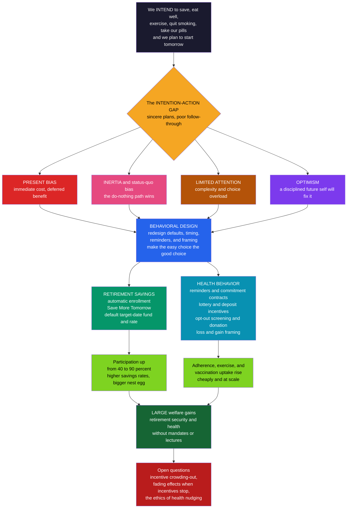

# 🪺 Behavioral Economics in Health and Retirement

> [!abstract] TL;DR
> **Health and retirement are behavioral economics' two greatest real-world triumphs**, because both are dominated by the **intention-action gap** — the chasm between what people *plan* and what they *do*. We fully intend to save for retirement, eat better, exercise, quit smoking, and take our pills — *starting tomorrow* — yet a third of workers save nothing, most diets fail, and roughly **half of patients don't take their medication as prescribed**. The culprits are **present bias** (immediate costs, deferred benefits), **inertia** and status-quo bias, **limited attention**, complexity and **choice overload**, and **optimism**. Behavioral design closes the gap cheaply and powerfully, *without mandates or lectures*: **automatic enrollment** flips the pension default from opt-in to opt-out and lifts participation from roughly **40 to 90 percent** (Madrian & Shea); **Save More Tomorrow** (Thaler & Benartzi) precommits workers to raise contributions out of *future* raises, sidestepping present bias and loss aversion because take-home pay never falls; and **reminders, commitment contracts, lottery incentives, opt-out organ donation, and loss-vs-gain framing** raise medication adherence, exercise, and health-plan choices. The payoff is huge — retirement security, longevity, lower health-care costs — while the open questions are equally real: incentive **crowding-out**, **fading** effects when incentives stop, and the **ethics** of health nudging.

---

## Intuition

**Analogy:** We *know* we should save for retirement, eat better, exercise, and take our pills — and we fully plan to, **starting tomorrow**. Yet tomorrow keeps arriving with the same excuses. A third of workers save nothing, most diets quietly fail, and half of patients don't take their medication as prescribed. The gap between our sincere good intentions and our actual behavior is exactly where present bias, inertia, and limited attention do their quiet damage — and it is precisely where behavioral economics has scored its biggest real-world wins. Instead of nagging people to be more disciplined, it *re-engineers the moment of choice*: it **auto-enrolls** workers in a pension so saving is the path of least resistance, it lets them commit their **future** raises to savings (when present bias is weak), and it sends a single **text reminder** to take a pill. Each closes the intention-action gap without lecturing anyone.

The deep point is that these two domains share one enemy. Retirement saving and health behavior *look* unrelated, but both ask you to bear a **certain cost now** (money you can't spend; effort, discomfort, a swallowed pill) for a **diffuse, delayed, uncertain benefit** (security in forty years; a heart attack that never happens). That is the exact shape of choice a present-biased, inattentive, inertial human handles worst — which is why the *same* toolkit of defaults, timing, reminders, and framing rescues both.

---

## How It Works

### The shared enemy: the intention-action gap

People are not lazy or ignorant here — they *have* the right intention. What they lack is follow-through, and five well-documented forces drain it:

1. **Present bias.** The cost is immediate and vivid (money withheld from today's paycheck; the effort of the gym; the side-effect of a pill), while the benefit is distant and abstract. Quasi-hyperbolic discounting weights *now* disproportionately, so "start next year / next Monday" always wins — see [[Present_Bias_and_Self_Control]] and [[Intertemporal_Choice_and_Discounting]].
2. **Inertia and status-quo bias.** Whatever happens if you do *nothing* is what most people end up with. Enrolling in a 401(k), switching to a healthier default, or booking a screening all require an *action*, and the action never gets taken.
3. **Limited attention.** Retirement is decades away and health risks are invisible day to day; both fall out of the mind's spotlight until a crisis forces them in.
4. **Complexity and choice overload.** Dozens of funds, deductibles, and plan tiers overwhelm the chooser, who responds by **doing nothing** or defaulting to a naive rule.
5. **Optimism.** "I'll definitely save more later / I'll take it more carefully next week" — the naive belief that a disciplined future self will fix everything (see the naive-vs-sophisticated distinction in [[Present_Bias_and_Self_Control]]).

### The retirement-savings crisis

Under-saving is the **signature present-bias failure**, and the stakes are enormous. The historic shift from employer **defined-benefit pensions** (the firm saves and guarantees a payout) to self-directed **defined-contribution plans** (401(k), IRA — *you* choose whether, how much, and where to invest) dumped a hard intertemporal problem onto exactly the biased individual least equipped to solve it. Procrastination on enrollment, plan complexity, and the pull of spending now over saving for a distant future combine so that many people reach retirement with far too little. The welfare cost — poverty in old age, reliance on public support — is huge.

### Automatic enrollment: the flagship fix

The single most successful behavioral intervention in history is almost embarrassingly simple: **make participation the default**. Switch the 401(k) from **opt-in** (default = not enrolled; you must act to join) to **opt-out / automatic enrollment** (default = enrolled; you must act to leave). Madrian and Shea's landmark 2001 study found this flip raised participation from roughly **40 to 90 percent** — with *no change in incentives whatsoever*, purely by harnessing inertia. It was adopted at scale: the US **Pension Protection Act of 2006** encouraged auto-enrollment and auto-escalation, and the UK's **automatic enrolment** rollout from 2012 brought roughly ten million new savers into workplace pensions with opt-out rates under 10 percent. This is the raw power of the default.

### Save More Tomorrow: precommitting future income

Auto-enrollment gets people *in* the door but often at a low default rate. Thaler and Benartzi's **Save More Tomorrow (SMarT)** solves the *rate* problem with an ingenious twist: workers precommit **now** to increase their savings rate **later**, tied to their **future** pay raises. Three biases are turned into allies. **Present bias** is sidestepped because the sacrifice always falls on a future self. **Loss aversion** is neutralized because contributions rise only *out of raises*, so take-home pay **never falls** — the increase is never coded as a loss. **Inertia** now works *for* saving because escalation is automatic (opt-out) once enrolled. In the original firms, average savings rates roughly tripled over a few years. SMarT is the model behavioral intervention: it fixes a problem *with* human psychology rather than against it.

### Designing the plan: defaults, simplification, framing

Good plan design follows a few behavioral rules:

- **Sensible defaults.** People stick with the **default contribution rate** and the **default fund** — so a low default rate under-saves, and a cash or money-market default under-invests. Modern plans default to a **target-date fund** and a meaningful auto-escalating rate.
- **Simplification.** Too many fund choices cause **choice overload**, which lowers participation and produces **naive diversification** — the "**1/n heuristic**" of splitting money evenly across whatever options appear, so the asset mix is an accident of the menu.
- **Active choice.** Sometimes the architect forces a deliberate pick ("choose a plan before you continue") rather than let any default ride.

The unifying maxim: **make the easy choice the good choice.**

### Health behavior: the same battle, cheaper weapons

The *same* present bias and inertia that sink saving also undermine diet, exercise, smoking cessation, and **medication adherence** (only about **half** of patients take chronic medications as prescribed — a massive driver of avoidable hospitalizations and cost). The behavioral toolkit transfers directly:

- **Reminders** — text messages and app prompts that fight forgetting and limited attention (cheap, scalable, effective for adherence and appointments).
- **Commitment devices** — deposit contracts where you put your **own** money at risk and lose it if you fail (**stickK**, "bet on yourself"), gym pre-commitment, and self-imposed deadlines.
- **Incentives** — small payments and **lotteries** for adherence, exercise, weight loss, and smoking cessation.
- **Defaults** — **opt-out** vaccination and screening appointments, default generic drugs, presumed-consent organ donation.
- **Framing** — **loss-framed** vs **gain-framed** health messages that shift screening and prevention uptake (see [[Reference_Dependence_and_Framing]]).

### Defaults and framing in health, specifically

- **Opt-out organ donation** ("presumed consent") produces effective consent near 100 percent, versus low tens of percent for opt-in countries — the famous Johnson & Goldstein contrast where near-identical cultures diverge almost entirely because of the default.
- **Default appointments and vaccination** — pre-scheduling a flu shot or booking the next screening by default (plus **planning-prompt** nudges) raises uptake.
- **Simplified insurance choice** — faced with complex menus, people routinely pick **dominated** health plans (Bhargava, Loewenstein & Sydnor found many workers chose plans that were worse *no matter what happened*), motivating "smart disclosure" and decision support.
- **Portion and menu design** — cafeteria placement, default side dishes, and default portion sizes steer healthy eating (choice architecture for the plate).

### Incentives and their limits

Financial incentives work, but with caveats. **Lotteries** exploit **probability weighting** — a small chance of a big prize motivates more than its modest expected value (see [[Probability_Weighting_and_Certainty_Effect]]). **Deposit contracts** exploit **loss aversion** — risking your own money stings more than a matched reward. Volpp and colleagues showed incentive- and deposit-based programs meaningfully raise smoking cessation and weight loss. But three warnings recur: incentives can **crowd out intrinsic motivation** (paying for a behavior can signal it isn't worth doing for its own sake), effects often **fade or reverse once the incentive stops**, and there are **equity** concerns about who can afford to put money at stake.

### Insurance and complex financial choices

Health insurance and financial products expose the same behavioral failures in sharp form: **choice overload** and **dominated choices**, poor grasp of deductibles and probabilities, a tendency to **over-insure small risks** (extended warranties) while **under-insuring catastrophic** ones, and vulnerability to opaque product design. The behavioral remedy is **smart disclosure**, decision support, and default plans — a form of **behavioral consumer protection** in markets too complex for the boundedly rational to navigate.

### The broader lesson and the frontier

Health and retirement show behavioral economics at its most impactful: **small, cheap changes** in defaults, timing, reminders, and framing produce **large** improvements in outcomes with enormous welfare stakes. The frontier is **personalized and adaptive** interventions (digital health, just-in-time nudges tailored to the individual) — alongside honest reckoning with the **limits and ethics** of health nudging, taken up in the sibling [[Behavioral_Public_Policy_and_Libertarian_Paternalism]].



---

## Key Concepts

### Secondary (explain it to a curious beginner)
- **The intention-action gap:** we mean to save, exercise, and take our pills — we just don't follow through. Behavioral economics closes that gap by redesigning the moment of choice.
- **Automatic enrollment:** sign people up for the pension by default and let them quit anytime. Most stay, so participation soars — no one is forced.
- **Save More Tomorrow:** agree *now* to save more *later*, out of future raises. It never hurts today's paycheck, so it's painless to accept and easy to keep.
- **Reminders and commitment:** a text to take your pill, or a bet where you lose your own money if you skip the gym. Cheap tricks that turn intention into action.
- **Opt-out beats opt-in:** whether it's a pension or organ donation, whatever happens "if you do nothing" is what most people end up with.

### Undergraduate (needs some economics background)
- **Under-saving as a present-bias failure:** immediate consumption is weighted disproportionately over distant retirement, so people procrastinate on enrollment and contribute too little; the DB-to-DC shift moved this risk onto biased individuals.
- **The default as the decisive lever:** because of inertia and status-quo bias, participation responds far more to *flipping the default* than to education or exhortation (Madrian & Shea, roughly 40 to 90 percent).
- **Why SMarT works — three biases turned into allies:** it defers the cost to a future self (present bias), frames increases out of *raises* so pay never falls (loss aversion), and makes escalation automatic (inertia).
- **Choice overload and the 1/n heuristic:** too many funds lower participation and produce naive even-split diversification, so the portfolio is an artifact of the menu rather than a considered choice.
- **Incentive design in health:** lotteries leverage probability weighting; deposit contracts leverage loss aversion; both beat equivalent-value flat payments, but watch for crowding-out and post-incentive fade.

### Graduate (system-level and contested)
- **Whose welfare, over what horizon?** With time-inconsistent preferences the present and future selves disagree; "helping people save/adhere more" implicitly privileges the long-run self, a normative choice, not a neutral fact — the fault line beneath every paternalistic health/savings nudge.
- **Defaults are not welfare-neutral and can be too strong:** if people passively accept *any* default, a low auto-enrollment rate can *reduce* saving for those who would have chosen more, and a poorly chosen investment default can misallocate a career of contributions. Default-setting is a serious welfare decision.
- **Crowding-out and fadeout, formalized:** extrinsic incentives can shift the perceived reason for a behavior (self-perception / motivation-crowding theory), so measured effects during an incentive can *overstate* durable change; identifying *persistent* versus *transient* effects is the key empirical challenge (habit formation vs. mere response to pay).
- **Behavioral consumer protection in insurance:** dominated-choice evidence (Bhargava, Loewenstein & Sydnor) shows markets can fail even with full information and free choice when products exceed cognitive capacity, motivating smart disclosure, decision support, and menu curation over pure caveat emptor.
- **The frontier — adaptive, personalized nudging:** just-in-time digital interventions raise both efficacy and the ethics stakes (targeting, autonomy, surveillance); the mature stance treats nudges as *complements* to incentives and regulation, chosen as the least-restrictive effective tool.

---

## Python Demo

```python
import numpy as np
import matplotlib
matplotlib.use("Agg")
import matplotlib.pyplot as plt

# ----------------------------------------------------------------------
# BEHAVIORAL ECONOMICS IN HEALTH AND RETIREMENT
#
# PART A -- the retirement-savings crisis and its behavioral fixes.
#   Three regimes for a 40-year career of present-biased workers:
#     (i)   OPT-IN            : must ACT to join -> low participation,
#                               modest 5% rate among the few who join.
#     (ii)  AUTO-ENROLLMENT   : joining is the DEFAULT -> high participation,
#                               but stuck at a low 3% default rate.
#     (iii) SAVE MORE TOMORROW: high participation AND an auto-ESCALATING
#                               rate tied to future raises (precommitting
#                               future income, when present bias is weak).
#   We plot POPULATION-AVERAGE retirement wealth = participation x balance,
#   so compound growth magnifies the early behavioral gains.
#
# PART B -- a HEALTH application: the effect of REMINDERS and a
#   COMMITMENT/INCENTIVE program on MEDICATION ADHERENCE over 12 months,
#   including the "fadeout" when the incentive is withdrawn at month 6.
# ----------------------------------------------------------------------

# ===================== PART A: RETIREMENT SAVINGS =====================
years    = np.arange(1, 41)                 # 40-year career
r        = 0.06                             # annual real investment return
salary   = 50_000.0 * (1.02) ** (years - 1) # 2%/yr raises

# participation rates (fraction of workers actually saving)
p_optin, p_auto, p_smt = 0.40, 0.90, 0.90

# contribution rate schedules (% of pay)
rate_optin = np.full(40, 5.0)                        # few join, but save 5%
rate_auto  = np.full(40, 3.0)                        # many join, stuck at 3%
rate_smt   = np.minimum(3.0 + 0.75 * (years - 1), 13.0)  # +0.75 pt per raise, cap 13%

def accumulate(rate_pct, participation):
    """Population-average wealth path: individual balance x participation."""
    bal, path = 0.0, []
    for rate, sal in zip(rate_pct, salary):
        bal = bal * (1 + r) + sal * rate / 100.0     # grow, then this year's contribution
        path.append(bal)
    return np.array(path) * participation

w_optin = accumulate(rate_optin, p_optin)
w_auto  = accumulate(rate_auto,  p_auto)
w_smt   = accumulate(rate_smt,   p_smt)

print("=" * 64)
print("RETIREMENT: population-average nest egg after a 40-year career")
print("=" * 64)
print(f"  Opt-in (40% join, 5% flat)        : ${w_optin[-1]:>12,.0f}")
print(f"  Auto-enroll (90% join, 3% flat)   : ${w_auto[-1]:>12,.0f}"
      f"   ({w_auto[-1]/w_optin[-1]:.1f}x opt-in)")
print(f"  Save More Tomorrow (90%, escalate): ${w_smt[-1]:>12,.0f}"
      f"   ({w_smt[-1]/w_optin[-1]:.1f}x opt-in)")

# ===================== PART B: MEDICATION ADHERENCE ===================
months = np.arange(1, 13)
# Adherence (% of doses taken) decays over time without support.
adh_control   = 68.0 - 2.2 * months                      # ~66 -> ~42  (usual care)
adh_reminder  = 72.0 - 0.9 * months                      # ~71 -> ~61  (text reminders)
# Commitment + small lottery incentive: high while active (months 1-6),
# then FADES after the incentive is withdrawn at month 6 (crowding-out caveat).
adh_incentive = np.where(months <= 6,
                         84.0 - 0.4 * months,             # strong while incentivized
                         84.0 - 0.4 * 6 - 4.5 * (months - 6))  # partial fade after removal

avg = lambda a: a.mean()
print("\n" + "=" * 64)
print("HEALTH: average 12-month medication adherence")
print("=" * 64)
print(f"  Usual care (control)              : {avg(adh_control):5.1f}%")
print(f"  Text reminders                    : {avg(adh_reminder):5.1f}%")
print(f"  Commitment + lottery incentive    : {avg(adh_incentive):5.1f}%"
      f"   (note post-incentive fadeout)")

# =============================== FIGURE ===============================
fig, ax = plt.subplots(2, 2, figsize=(14, 10))
fig.suptitle("Behavioral Economics in Health and Retirement",
             fontsize=15, fontweight="bold")

# Panel 1: participation rates
bars = ax[0, 0].bar(["Opt-in\n(must act to join)",
                     "Auto-enroll\n(default: enrolled)",
                     "Save More\nTomorrow"],
                    [p_optin * 100, p_auto * 100, p_smt * 100],
                    color=["#dc2626", "#059669", "#166534"], edgecolor="black")
ax[0, 0].set_ylim(0, 105)
ax[0, 0].set_ylabel("participation (%)")
ax[0, 0].set_title("(1) Flip the default -> participation\n~40% to ~90% (Madrian & Shea)")
for b, v in zip(bars, [p_optin, p_auto, p_smt]):
    ax[0, 0].text(b.get_x() + b.get_width() / 2, v * 100 + 2,
                  f"{v:.0%}", ha="center", fontweight="bold")

# Panel 2: contribution-rate schedules
ax[0, 1].plot(years, rate_optin, color="#dc2626", lw=2.5, label="opt-in: 5% flat")
ax[0, 1].plot(years, rate_auto,  color="#059669", lw=2.5, label="auto-enroll: 3% flat")
ax[0, 1].plot(years, rate_smt,   color="#166534", lw=2.5,
              label="Save More Tomorrow: escalate to 13%")
ax[0, 1].fill_between(years, rate_auto, rate_smt, color="#bbf7d0", alpha=0.5)
ax[0, 1].set_xlabel("years of tenure"); ax[0, 1].set_ylabel("savings rate (% of pay)")
ax[0, 1].set_title("(2) Save More Tomorrow escalates the\nrate out of FUTURE raises")
ax[0, 1].legend(fontsize=8, loc="center right"); ax[0, 1].grid(alpha=0.25)

# Panel 3: population-average retirement wealth (compounded)
ax[1, 0].plot(years, w_optin / 1000, color="#dc2626", lw=2.5,
              label=f"opt-in  ->  ${w_optin[-1]/1000:.0f}k")
ax[1, 0].plot(years, w_auto / 1000, color="#059669", lw=2.5,
              label=f"auto-enroll  ->  ${w_auto[-1]/1000:.0f}k")
ax[1, 0].plot(years, w_smt / 1000, color="#166534", lw=2.5,
              label=f"Save More Tomorrow  ->  ${w_smt[-1]/1000:.0f}k")
ax[1, 0].fill_between(years, w_auto / 1000, w_smt / 1000, color="#bbf7d0", alpha=0.5)
ax[1, 0].set_xlabel("years"); ax[1, 0].set_ylabel("population-avg wealth ($000s)")
ax[1, 0].set_title("(3) Compounding magnifies early\nbehavioral gains (6% return)")
ax[1, 0].legend(fontsize=9, loc="upper left"); ax[1, 0].grid(alpha=0.25)

# Panel 4: medication adherence over time
ax[1, 1].plot(months, adh_control,   "o-",  color="#dc2626", lw=2.3,
              label="usual care")
ax[1, 1].plot(months, adh_reminder,  "s-",  color="#2563eb", lw=2.3,
              label="text reminders")
ax[1, 1].plot(months, adh_incentive, "^-",  color="#166534", lw=2.3,
              label="commitment + lottery")
ax[1, 1].axvline(6, color="gray", ls=":", lw=1.4)
ax[1, 1].text(6.1, 45, "incentive\nwithdrawn", fontsize=8, color="gray")
ax[1, 1].set_xlabel("month"); ax[1, 1].set_ylabel("adherence (% of doses)")
ax[1, 1].set_ylim(30, 90)
ax[1, 1].set_title("(4) Reminders and incentives raise adherence\n(note the post-incentive fadeout)")
ax[1, 1].legend(fontsize=9, loc="lower left"); ax[1, 1].grid(alpha=0.25)

plt.tight_layout(rect=[0, 0, 1, 0.95])
plt.savefig("behavioral_health_and_retirement.png", dpi=110, bbox_inches="tight")
print("\nSaved figure: behavioral_health_and_retirement.png")
```

**What the demo shows.**

- **Panel 1 (participation)** contrasts the three regimes. Opt-in leaves participation near **40 percent** — most present-biased workers never take the action to join. Flipping the default to **auto-enrollment** lifts it to about **90 percent** with no change in incentives, and Save More Tomorrow keeps that high participation.
- **Panel 2 (the rate problem)** exposes auto-enrollment's weak spot: it gets people *in* but often parks them at a low **3 percent** default. **Save More Tomorrow** escalates the rate out of each raise, climbing toward the cap — the increase never cuts take-home pay, so loss aversion never bites.
- **Panel 3 (the payoff, compounded)** multiplies participation by the accumulated balance to get the **population-average nest egg**. Auto-enrollment beats opt-in *despite a lower rate* because so many more people save; Save More Tomorrow dominates both, and 40 years of **compounding magnifies the early behavioral gains** into a dramatically larger retirement wealth.
- **Panel 4 (health)** models a chronic medication whose adherence **decays** under usual care (from roughly 66 to 42 percent). **Text reminders** flatten the decline; a **commitment-plus-lottery** program pushes adherence highest — but note the deliberate **fadeout** after the incentive is withdrawn at month 6, the empirical caveat that incentive effects can shrink once the incentive stops.

---

## Real-World Applications

> **Automatic enrollment at national scale.** The US **Pension Protection Act of 2006** gave employers safe-harbor to auto-enroll and auto-escalate, and the UK's **automatic enrolment** program (from 2012, via NEST) brought roughly **ten million** new savers into workplace pensions with opt-out rates under 10 percent — the largest deliberate application of a behavioral default in history.

> **Save More Tomorrow.** Thaler & Benartzi's SMarT program, first deployed in the early 2000s, roughly **tripled** average savings rates among participants over a few years and is now embedded in many 401(k) plans as auto-escalation — the textbook case of designing *with* present bias and loss aversion.

> **Opt-out organ donation.** Presumed-consent ("opt-out") countries record effective consent near 100 percent versus low tens of percent for opt-in registries (Johnson & Goldstein), the single most cited demonstration that a default is a life-and-death policy lever, not an administrative detail.

> **Medication adherence and prevention.** Text-message and app **reminders**, **default appointments**, and **planning prompts** (Milkman et al. showed pre-scheduling and implementation-intention prompts raise flu-vaccination rates) improve adherence and uptake cheaply. Deposit-contract platforms (**stickK**, Beeminder) and workplace wellness programs put patients' own money at stake.

> **Financial incentives for hard behaviors.** Volpp and colleagues ran randomized trials showing **incentive- and deposit-based** programs significantly raise **smoking cessation** and **weight loss** — while documenting the crowding-out and fadeout caveats that temper enthusiasm.

> **Behavioral consumer protection in insurance.** Bhargava, Loewenstein & Sydnor found large fractions of employees chose **dominated** health plans (worse under every scenario), motivating simplified menus, smart disclosure, and default plans — behavioral protection where products outstrip cognition. See [[Insurance_and_Personal_Risk]] and [[Adverse_Selection]].

---

## Common Pitfalls

- **Treating auto-enrollment as a complete fix.** It solves *participation* but not the *rate*: people anchor on the low default and stop. Without **auto-escalation / Save More Tomorrow**, auto-enrollment can even *lower* saving for workers who would otherwise have chosen a higher rate. Set the default *rate* as deliberately as the enrollment default.
- **Assuming incentives create durable change.** Effects measured *during* an incentive often **fade or reverse** once it stops, and paying for a behavior can **crowd out** intrinsic motivation. Judge programs by *persistent* change (habit formation), not the incentive-period bump — the fadeout in the demo is the warning.
- **Confusing a reminder with solving the problem.** Reminders fight *forgetting* (limited attention) but do little against genuine *present bias* (the pill has real side-effects; the gym genuinely hurts). Match the tool to the barrier: reminders for inattention, commitment/incentives for self-control.
- **Ignoring heterogeneity and equity.** The already-organized often respond most, so a nudge can *widen* gaps; deposit contracts and lotteries can disadvantage those who can least afford to lose. Always ask *who* moves and *who* pays.
- **Forgetting the welfare question.** "Save more / adhere more" privileges the long-run self, but the present self genuinely wanted to spend / skip the dose. With time-inconsistent preferences there is **no neutral welfare metric**; name which self the policy serves rather than smuggling the assumption in (see [[Present_Bias_and_Self_Control]] and [[Behavioral_Public_Policy_and_Libertarian_Paternalism]]).
- **Over-loading the menu.** More fund choices or plan tiers feel generous but trigger **choice overload**, non-participation, and the **1/n heuristic**. Curate and simplify; a shorter, well-defaulted menu usually beats an exhaustive one.

---

## Related Concepts

This note is the **applied home** of several ideas developed elsewhere in the vault. The engine is [[Present_Bias_and_Self_Control]] (why under-saving and non-adherence happen) and its discounting machinery in [[Intertemporal_Choice_and_Discounting]]; the toolkit is [[Nudges_and_Choice_Architecture]] (defaults, framing, reminders); and [[Behavioral_Public_Policy_and_Libertarian_Paternalism]] carries the ethics and "whose welfare counts" debate.

- [[Present_Bias_and_Self_Control]] — same vault: the present-bias/commitment engine behind under-saving, non-adherence, and Save More Tomorrow.
- [[Intertemporal_Choice_and_Discounting]] — same vault: the exponential-vs-hyperbolic discounting that makes distant retirement and delayed health lose to the present.
- [[Nudges_and_Choice_Architecture]] — same vault: the default/framing/reminder toolkit these applications deploy at scale.
- [[Behavioral_Public_Policy_and_Libertarian_Paternalism]] — same vault: the philosophy, ethics, and "as judged by themselves" welfare standard behind health and savings nudges.
- [[Mental_Accounting]] — same vault: earmarked "sacred" retirement accounts and non-fungible savings jars as commitment devices for the future self.
- [[Loss_Aversion_and_the_Endowment_Effect]] — same vault: why Save More Tomorrow frames increases out of raises (no take-home loss) and why deposit contracts bite.
- [[Probability_Weighting_and_Certainty_Effect]] — same vault: why small-chance **lottery** incentives motivate more than their expected value.
- [[Reference_Dependence_and_Framing]] — same vault: gain-vs-loss framing of health messages and screening.
- [[Behavioral_Economics_Overview]] — same vault: the parent map placing health and retirement among the field's greatest practical wins.
- [[Retirement_Planning_and_FIRE]] — cross-vault (Finance): the personal-finance mechanics of the retirement problem these nudges are solving.
- [[The_Power_of_Compounding]] — cross-vault (Finance): why early, automatic behavioral gains compound into a far larger nest egg.
- [[Budgeting_and_Saving]] — cross-vault (Finance): the saving behaviors auto-enrollment and SMarT operationalize.
- [[Insurance_and_Personal_Risk]] — cross-vault (Finance): the complex insurance choices where dominated plans and over/under-insurance appear.
- [[Finance/08_Behavioral_Finance/Nudges_and_Choice_Architecture|Nudges and Choice Architecture (Finance)]] — cross-vault (Finance): the investing- and 401(k)-focused companion.
- [[Health_Behavior_and_Behavior_Change]] — cross-vault (Health): diet, exercise, and adherence change as the health side of this note.
- [[Infectious_Disease_Vaccines_and_Immunity]] — cross-vault (Health): where default appointments and planning prompts raise vaccination uptake.
- [[Behavioral_Economics_Psychology]] — cross-vault (Psychology): the psychology-of-choice treatment of these same self-control and nudge phenomena.
- [[Operant_Conditioning]] — cross-vault (Psychology): the reinforcement mechanics behind incentive and lottery programs.
- [[Reinforcement_Schedules]] — cross-vault (Psychology): why intermittent/lottery reinforcement can sustain behavior — and why removal causes fadeout.
- [[Utility_Theory]] — cross-vault (Microeconomics): the time-consistent rational benchmark these behavioral fixes depart from.
- [[Adverse_Selection]] — cross-vault (Microeconomics): the information problem interacting with behavioral failures in insurance markets.
- [[Market_Failures]] — cross-vault (Microeconomics): the "internality" (self-control failure) many of these interventions address.

---

## Review Questions

### Secondary
1. Two employers offer the *same* retirement plan. Company A asks new hires to sign up; Company B enrolls them automatically but lets them quit anytime. Which has more savers, and why — even though no one is forced and the money works the same?
2. "Save More Tomorrow" asks you to save more *later*, out of future raises, instead of more *now*. Why is that so much easier for people to accept and stick to than an immediate increase?
3. A clinic starts texting patients a daily reminder to take their pill, and adherence rises. Name two reasons the *reminder* helps, and one kind of barrier a reminder *won't* fix.

### Undergraduate
1. Explain why chronic under-saving is a "signature present-bias failure," and how the shift from defined-benefit pensions to self-directed defined-contribution plans made it worse. Then explain precisely how **auto-enrollment** and **Save More Tomorrow** each attack the problem — and which bias each one exploits or neutralizes.
2. Auto-enrollment raises *participation* but can leave people stuck at a low default rate. Using the demo's logic, explain how a plan can have high participation yet still under-save, and why auto-escalation fixes it. Why can a badly chosen default *reduce* someone's saving?
3. Compare **lottery incentives** and **deposit contracts** for improving medication adherence. Which behavioral bias does each harness, and what are the two main caveats (crowding-out and fadeout) a program designer must watch for?

### Graduate
1. A health system wants to raise adherence and is deciding between a text-reminder program, a deposit-contract program, and simply mailing patients an educational brochure. Lay out the trade-offs (cost, effect ceiling, durability, equity, which *barrier* each addresses) and argue for a portfolio. Under what conditions would you *expect* the incentive program's measured effect to overstate its durable benefit?
2. "Nudging people to save and adhere more makes them better off." State precisely the welfare criterion under which this holds and the criterion under which it fails, given that a person's present and future selves disagree. How should a policymaker choose a **default contribution rate** in light of this ambiguity?
3. Bhargava, Loewenstein & Sydnor found many employees choosing **dominated** health plans. Explain how a market can fail even with full information and free choice, why this motivates "behavioral consumer protection," and where you would draw the line between helpful menu curation and objectionable paternalism.

---

## Sources

- [Madrian, B. C. & Shea, D. F. (2001). "The Power of Suggestion: Inertia in 401(k) Participation and Savings Behavior." *Quarterly Journal of Economics* 116(4), 1149-1187](https://doi.org/10.1162/003355301753265543)
- [Thaler, R. H. & Benartzi, S. (2004). "Save More Tomorrow: Using Behavioral Economics to Increase Employee Saving." *Journal of Political Economy* 112(S1), S164-S187](https://doi.org/10.1086/380085)
- [Johnson, E. J. & Goldstein, D. (2003). "Do Defaults Save Lives?" *Science* 302(5649), 1338-1339](https://doi.org/10.1126/science.1091721)
- [Volpp, K. G. et al. (2009). "A Randomized, Controlled Trial of Financial Incentives for Smoking Cessation." *New England Journal of Medicine* 360(7), 699-709](https://doi.org/10.1056/NEJMsa0806819)
- [Milkman, K. L., Beshears, J., Choi, J. J., Laibson, D. & Madrian, B. C. (2011). "Using Implementation Intentions Prompts to Enhance Influenza Vaccination Rates." *PNAS* 108(26), 10415-10420](https://doi.org/10.1073/pnas.1103170108)

---

#behavioral-economics #retirement-savings #health-behavior #save-more-tomorrow #medication-adherence
