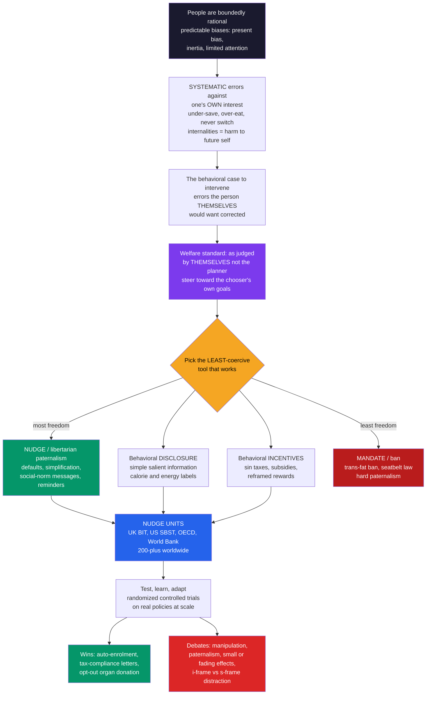

# 🏛️ Behavioral Public Policy and Libertarian Paternalism

> [!abstract] TL;DR
> **Behavioral public policy** applies the findings of behavioral economics — bounded rationality, systematic biases, and the inescapability of **choice architecture** — to the design of government policy and regulation, aiming for interventions that are more **effective** and far **cheaper** than the usual toolkit. Its signature idea is **libertarian paternalism** (Thaler & Sunstein): a "third way" between coercive paternalism and pure laissez-faire that deliberately **steers people toward choices that improve their own welfare** while **preserving complete freedom to opt out**. The justification is behavioral, not moralistic: people make **systematic errors against their own interests** — under-saving from present bias, poor health choices, never switching to a better deal, sheer inertia — errors they *themselves* would want corrected, so the target is what a person would choose **"as judged by themselves" (AJBT)**, not what a planner prefers. Policy tools form a **spectrum from nudge to shove** — nudges (defaults, simplification, reminders, social-norm messages) → behavioral disclosure (calorie/energy labels) → behavioral incentives (sin taxes, subsidies) → mandates and bans — and the discipline is to pick the **least-coercive tool that works**. The flagship is the **default**: auto-enrollment lifts pension participation from roughly 40% to over 90%, and opt-out organ donation raises consent dramatically, both at near-zero cost and coercion. This spawned **200-plus "nudge units"** worldwide (UK's Behavioural Insights Team, the US SBST, the OECD, the World Bank's *Mind, Society, and Behavior*) running policy **RCTs** under a "test, learn, adapt" model. Yet the approach faces real debates — **manipulation and autonomy**, **who decides what is "better"**, **small and sometimes-fading effect sizes** with publication bias, **distributional** worries, and the **i-frame vs s-frame** critique that individual nudges distract from structural reform — making it a powerful but **bounded complement** to incentives, regulation, and the removal of exploitative **sludge**.

---

## Intuition

**Analogy:** Should the government stop you from making bad choices? Ask three people and you get three answers. The **hard-core libertarian** says *never* — your life, your call, hands off. The **old-school paternalist** says *often, by force* — ban the cigarettes, mandate the seatbelt, outlaw the fatty food. For a century policy argued only between these two poles: freedom versus force. Behavioral economics found a clever **third way**. Suppose people *predictably* under-save, over-eat, and never get around to filling out the form — not because they have genuinely decided that a poor retirement and bad health are what they want, but because of biases and inertia they'd disown on reflection. Then you don't have to ban anything or force anyone. You just **change the default**: automatically enroll them in the pension (they can quit anytime), make the salad the standard side (they can still order fries), pre-fill the benefit form (they can still say no). You have steered them toward what they'd choose *for themselves* — while leaving every door wide open. It is "paternalism" that takes away none of your freedom: a **nudge, not a shove**.

The deep move is to notice that the choice architect **cannot opt out of influencing you** — some default, some framing, some order must exist, and it will steer millions no matter what. Given that, refusing to design it doesn't protect freedom; it just hands the outcome to accident, or to whichever firm profits from the friction. Libertarian paternalism is simply the decision to arrange that unavoidable environment **on purpose and in the chooser's own interest** — and behavioral public policy is the machinery, the evidence, and the institutions that turn that idea into working government.

---

## How It Works

### From "people are biased" to "design policy accordingly"

Standard policy analysis assumed *homo economicus*: a rational optimizer who needs only correct prices and full information. Behavioral economics documented the opposite — people are **boundedly rational** (see [[Bounded_Rationality_and_Satisficing]]), run on [[Heuristics_and_Biases_Overview|heuristics and biases]], and are exquisitely sensitive to how choices are arranged. **Behavioral public policy** is the applied consequence: if citizens predictably err, then policy designed for rational agents will underperform, and policy designed for *real* agents can do better and cheaper. This is the "behavioral revolution" in government — moving from *documenting* biases to *using* that knowledge to build more effective, less expensive interventions.

### The justification: internalities and errors people would disown

The reason to intervene is **not** that the planner has better taste; it is that people commit **systematic errors against their own interest**. Under-saving driven by [[Present_Bias_and_Self_Control|present bias]]; failing to switch to a cheaper energy or phone plan out of inertia; never returning the mail-in rebate; eating today in ways today's self already regrets. Economists call the harm a present choice inflicts on one's *own future self* an **internality** — the self-directed cousin of an **externality** (harm to others, the classic ground for a [[Externalities_and_Pigouvian_Tax|Pigouvian tax]]). Internalities are a genuine [[Market_Failures|market failure]], and they are what most nudges are meant to correct. The crucial claim is that these are errors the person **themselves would want fixed** — not preferences to override.

### The "as judged by themselves" (AJBT) welfare standard

To keep paternalism from sliding into the planner's imposing *their* values, Thaler & Sunstein anchor it to the **"as judged by themselves"** standard: an intervention is legitimate only insofar as it moves people toward what **they** would choose if they were fully attentive, informed, and free of the specific bias in play — the chooser's *own* goals, which inertia and error routinely defeat. This is the fence between **helping** ("you told me you wanted to save; I made saving the easy path") and **imposing** ("I decided saving is good for you"). It is also the program's **philosophical soft spot**: when preferences are constructed and frame-dependent (see [[Reference_Dependence_and_Framing]]), *which* self, in *which* frame, is the authoritative judge? A closely related formal version, **asymmetric paternalism** (Camerer, Issacharoff, Loewenstein, O'Donoghue & Rabin, 2003), sharpens the test: a policy is justified when it helps the biased ($\beta < 1$) majority a lot while imposing only small costs on the fully rational minority.

### The spectrum of instruments: from nudge to shove

Behavioral policy is not just nudging — it spans a **spectrum of coercion**, and the discipline is to reach for the **least-restrictive tool that achieves the goal**:

1. **Nudges (libertarian paternalism)** — defaults, simplification, reminders, salience, social-norm messages, framing. They forbid no option and barely change incentives; they are *easy and cheap to avoid*. See [[Nudges_and_Choice_Architecture]].
2. **Behaviorally-informed disclosure** — simpler, more salient information: calorie counts on menus, energy-efficiency labels, "smart disclosure" of your own usage data. Still freedom-preserving, but it acts on beliefs rather than defaults.
3. **Behaviorally-informed incentives** — **sin taxes** on tobacco and sugar, subsidies for desired behavior, and the *framing* of incentives (a "bonus" for saving lands differently than an equal "penalty"). These change payoffs, so they are more coercive than a nudge but still leave the choice open.
4. **Mandates and bans** — trans-fat bans, seatbelt laws, portion caps. This is **hard paternalism**: options are removed. Justified when errors are severe, externalities large, or softer tools demonstrably fail.

Moving down the list trades **freedom** for **certainty of effect**: nudges are cheapest and least coercive but often lowest-ceiling; mandates guarantee compliance but abolish autonomy. The mature stance treats them as **complements**, not rivals.

### Defaults: the flagship

Among all the tools, **defaults dominate**, because they harness inertia, procrastination, and status-quo bias — whatever happens if you do nothing is what most people end up with. **Automatic enrollment** in retirement plans lifts participation from roughly **40% to over 90%** by flipping the default from opt-in to opt-out, changing *no incentive whatsoever* (Madrian & Shea, 2001). **Opt-out "presumed consent"** organ-donation regimes record effective consent near-universal, while otherwise-similar opt-in countries languish in the low tens (Johnson & Goldstein, 2003). Default **green-energy tariffs** flip the majority to renewables; **automatic escalation** ("Save More Tomorrow") ratchets savings out of future raises. A well-chosen default delivers enormous impact at near-zero cost and coercion — which is exactly why setting it is a serious welfare responsibility, not a formality.

### Nudge units and the evidence movement

Behavioral policy became institutionalized. The UK's **Behavioural Insights Team** (the "Nudge Unit," 2010) and the US **Social and Behavioral Sciences Team** (SBST, 2014) pioneered a **"test, learn, adapt"** model — running **randomized controlled trials** on real policies (tax-payment letters, benefit take-up, fine collection, court reminders, energy use) rather than trusting intuition. The idea spread to **200-plus** behavioral units across governments and international bodies — the **OECD**, the **World Bank** (whose 2015 *World Development Report: Mind, Society, and Behavior* mainstreamed it), the **WHO**, and the **UN**. This is *evidence-based government*: cheap field experiments that discover what actually moves behavior at scale.



---

## Key Concepts

### Secondary (explain it to a curious beginner)
- **Libertarian paternalism:** helping people make choices that are good *for them* — but never forcing them. You can always opt out.
- **Nudge, not shove:** steering by changing the *setup* of a choice (which option is automatic, how it's shown) rather than by banning or taxing.
- **The default is the big lever:** most people just go with whatever happens if they do nothing, so setting a good default (auto-enroll in savings, opt-out organ donation) helps enormously and costs almost nothing.
- **"As judged by themselves":** the goal is what *you* would want on reflection — not what some official thinks is best for you.
- **Nudge units:** teams inside governments that test small policy tweaks with real experiments to see what actually helps people.

### Undergraduate (needs some economics background)
- **Internalities vs externalities:** an **externality** harms *other people* (the classic case for a Pigouvian tax); an **internality** harms *your own future self* (over-eating, under-saving). Both are market failures, but internalities are the specific target of paternalistic behavioral policy.
- **The instrument spectrum and least-restrictiveness:** nudge → disclosure → incentive (tax/subsidy) → mandate, ordered by rising coercion and (usually) rising effect ceiling. Good behavioral policy chooses the *least* coercive tool that meets the goal, escalating only when softer tools fail.
- **Asymmetric paternalism (Camerer et al., 2003):** a formal justification — a policy passes if it delivers **large benefits to the biased** and imposes **small costs on the rational**. Defaults score well: the boundedly rational are helped a lot; the rational simply opt out at trivial cost.
- **Why defaults beat information:** persuasion and disclosure act on effortful System-2 deliberation, which most people skip; defaults exploit the very inertia that causes the problem, so they move behavior far more per dollar (see [[Dual_Process_Theory_System_1_and_2]]).
- **RCTs and "test, learn, adapt":** behavioral units treat policies as testable hypotheses — random assignment of letter wording, form design, or default settings — replacing intuition and anecdote with measured effect sizes.

### Graduate (system-level and contested)
- **The AJBT standard under constructed preferences:** if preferences are context-dependent and constructed on the spot, "as judged by themselves" is *under-determined* — the present self and the reflective self genuinely disagree, and there is **no single utility function** to maximize (the welfare ambiguity inherited from [[Present_Bias_and_Self_Control]]). Naming *which* self the policy privileges is unavoidable, not a technicality.
- **The manipulation objection and the publicity principle:** does nudging bypass rational agency? Sunstein's defense is **transparency** — a legitimate nudge must survive being made **public**; the architect should be willing to defend it openly to those nudged. Nudges that work *only because they are hidden* fail this test and shade into manipulation and **sludge**.
- **Effect sizes, publication bias, and the 2022 debate:** a large meta-analysis (Mertens et al., 2022, PNAS) reported sizable average nudge effects, but a same-year critique (Maier et al.) argued that after correcting for **publication bias** the average effect is near zero for whole categories — and DellaVigna & Linos (2022) found that real *nudge-unit* RCTs at scale produce effects roughly an order of magnitude smaller than the academic literature. Defaults survive this scrutiny; many other nudges shrink or fade.
- **Distribution and heterogeneity:** effects vary across people, and the already-advantaged often respond more, so a poorly targeted nudge can *widen* the gap it meant to close. "Does it help those who need help most?" is a first-order design question, not an afterthought.
- **The i-frame vs s-frame critique (Chater & Loewenstein, 2023):** the sharpest structural objection — behavioral policy has over-focused on the **individual frame** (i-frame: change the person's choices) while neglecting the **system frame** (s-frame: change prices, market structure, regulation, root causes). Worse, the availability of cheap nudges can be *weaponized* by incumbents to **crowd out** stronger reform ("we added a label, no need to regulate"). The mature response reframes behavioral economics itself toward the s-frame: policing **sludge**, **dark patterns**, deceptive defaults, and firms that *exploit* biases — behavioral **consumer protection**, not just individual nudging.

---

## Python Demo

```python
import numpy as np
import matplotlib
matplotlib.use("Agg")
import matplotlib.pyplot as plt

# =====================================================================
# BEHAVIORAL PUBLIC POLICY -- two experiments.
#
#  PART A: THE POWER OF A DEFAULT AT SCALE (opt-in vs opt-out)
#    A population faces a yes/no decision (enroll in a pension / register
#    as an organ donor). Each person i has a TRUE net benefit v_i from
#    participating -- heterogeneous, POSITIVE for most (participation is
#    genuinely good for the typical person, who under-acts only through
#    inertia / present bias). Each is ACTIVE with prob a (pays the small
#    hassle cost to choose optimally); INACTIVE people keep the DEFAULT.
#    Incentives (v_i) are IDENTICAL across policies -- ONLY the default
#    changes. We compute participation AND aggregate welfare, and split
#    the switch into people HELPED vs the few HARMED.
#
#  PART B: COMPARING POLICY INSTRUMENTS to curb a harmful behavior
#    (sugary-drink consumption). Three tools on the nudge-to-shove
#    spectrum scored on effect, freedom preserved, and cost -> showing
#    the cost-effectiveness / freedom trade-off.
# =====================================================================

rng = np.random.default_rng(42)

# ---------- PART A: the default at scale ----------
N = 200_000
a = 0.30                                     # fraction who actively choose (inertia strong)
v = rng.normal(loc=1.0, scale=1.5, size=N)   # true net benefit; mean>0 => good for most
active = rng.random(N) < a
wants  = v > 0                               # if you act, you enroll iff it helps you

def enroll_and_welfare(default_enrolled):
    enrolled = np.where(active, wants, default_enrolled)   # inactive keep the default
    participation = enrolled.mean()
    welfare = v[enrolled].sum() / N                        # avg realized benefit per capita
    return participation, welfare, enrolled

p_in,  w_in,  e_in  = enroll_and_welfare(False)   # OPT-IN  (default = NOT enrolled)
p_out, w_out, e_out = enroll_and_welfare(True)    # OPT-OUT (default = enrolled)

moved   = e_out & ~e_in                                    # only inactive people move
helped  = (moved & (v > 0)).mean() * 100                  # inactive, benefit>0, now in
harmed  = (moved & (v < 0)).mean() * 100                  # inactive, benefit<0, now stuck

# ---------- PART B: instrument comparison ----------
instruments = ["Nudge\n(default + label)", "Tax\n(sin tax)", "Mandate\n(portion cap)"]
effect  = np.array([12.0, 22.0, 38.0])   # percent reduction in consumption achieved
freedom = np.array([98.0, 72.0, 15.0])   # percent of choice freedom preserved
cost    = np.array([0.5,  3.0,  6.0])    # admin + economic cost per capita (dollars)
cost_eff = effect / cost                 # behavior change per dollar of cost

print("=" * 64)
print("PART A -- THE DEFAULT AT SCALE (no incentives changed)")
print("=" * 64)
print(f"Participation  opt-in  (default OFF): {p_in:6.1%}")
print(f"Participation  opt-out (default ON) : {p_out:6.1%}")
print(f"  -> flipping ONE default moves participation by {p_out - p_in:.0%}")
print(f"Welfare/capita opt-in : {w_in:+.3f}     opt-out: {w_out:+.3f}"
      f"   (gain {w_out - w_in:+.3f})")
print(f"Of the population, {helped:.1f}% are HELPED and only {harmed:.1f}% HARMED"
      f" by the switch")
print("-" * 64)
print("PART B -- INSTRUMENT COMPARISON (curb sugary drinks)")
print("-" * 64)
for i, name in enumerate(["Nudge", "Tax", "Mandate"]):
    print(f"  {name:8s}: effect {effect[i]:4.0f}%   freedom {freedom[i]:4.0f}%"
          f"   cost ${cost[i]:.1f}   cost-eff {cost_eff[i]:5.1f} %/$")

# ------------------------------- FIGURE -------------------------------
fig, ax = plt.subplots(2, 2, figsize=(14, 10))
fig.suptitle("Behavioral Public Policy: the default at scale, and choosing the instrument",
             fontsize=14, fontweight="bold")

# Panel 1: participation opt-in vs opt-out
bars = ax[0, 0].bar(["OPT-IN\n(default: not enrolled)", "OPT-OUT\n(auto-enrolment)"],
                    [p_in * 100, p_out * 100],
                    color=["#dc2626", "#059669"], edgecolor="black")
ax[0, 0].set_ylim(0, 105); ax[0, 0].set_ylabel("participation (%)")
ax[0, 0].set_title("(a) Default effect at scale\n(same benefits, same incentives)")
for b, val in zip(bars, [p_in, p_out]):
    ax[0, 0].text(b.get_x() + b.get_width() / 2, val * 100 + 2,
                  f"{val:.0%}", ha="center", fontweight="bold")

# Panel 2: welfare + who is helped vs harmed
ax[0, 1].bar(["opt-in", "opt-out"], [w_in, w_out],
             color=["#dc2626", "#059669"], edgecolor="black")
ax[0, 1].set_ylabel("aggregate welfare per capita")
ax[0, 1].set_title(f"(b) The switch raises net welfare\n"
                   f"{helped:.0f}% helped vs {harmed:.1f}% harmed")
ax[0, 1].text(1, w_out, f"  +{w_out - w_in:.2f}", va="center", fontsize=10,
              fontweight="bold", color="#059669")
ax[0, 1].axhline(0, color="black", lw=0.8)

# Panel 3: instrument effect vs freedom (grouped bars)
x = np.arange(len(instruments)); wbar = 0.38
ax[1, 0].bar(x - wbar/2, effect,  wbar, label="behavior change (%)",
             color="#2563eb", edgecolor="black")
ax[1, 0].bar(x + wbar/2, freedom, wbar, label="freedom preserved (%)",
             color="#f5a623", edgecolor="black")
ax[1, 0].set_xticks(x); ax[1, 0].set_xticklabels(instruments, fontsize=8.5)
ax[1, 0].set_ylabel("percent"); ax[1, 0].set_ylim(0, 108)
ax[1, 0].set_title("(c) Nudge-to-shove: more effect\ncosts more freedom")
ax[1, 0].legend(fontsize=8.5, loc="upper center")

# Panel 4: the trade-off frontier (freedom vs effect, bubble = cost)
sc = ax[1, 1].scatter(freedom, effect, s=cost * 120,
                      c=["#059669", "#2563eb", "#b91c1c"], edgecolor="black", zorder=3)
for i, name in enumerate(["Nudge", "Tax", "Mandate"]):
    ax[1, 1].annotate(f"{name}\n${cost[i]:.1f}/capita",
                      (freedom[i], effect[i]), textcoords="offset points",
                      xytext=(8, 8), fontsize=9)
ax[1, 1].set_xlabel("freedom preserved (%)  -> more libertarian")
ax[1, 1].set_ylabel("behavior change achieved (%)")
ax[1, 1].set_title("(d) The policy trade-off\n(bubble size = cost per capita)")
ax[1, 1].invert_xaxis()          # coercion increases to the right
ax[1, 1].grid(alpha=0.25)

plt.tight_layout(rect=[0, 0, 1, 0.95])
plt.savefig("behavioral_public_policy.png", dpi=110, bbox_inches="tight")
print("\nSaved figure: behavioral_public_policy.png")
```

**What the demo shows.**

- **Panel (a) — the default at scale.** A population that mostly *benefits* from participating but is largely inactive (inertia) is enrolled at only ~40% under **opt-in** and over ~90% under **opt-out** — a huge behavioral swing from flipping one default that changes **no incentive at all**. This is the auto-enrollment result, reproduced from first principles.
- **Panel (b) — welfare, and who moves.** Because most people's true net benefit is positive, switching the default *raises aggregate welfare*, and the split shows the mechanism honestly: the large majority who move are **helped** (they wanted in but never acted), while a **small minority** with negative benefit are **harmed** by being stuck in a default that doesn't suit them. Net positive, essentially free, and fully reversible — but not costless for everyone, which is exactly why the default must be chosen with the AJBT standard in mind.
- **Panel (c) — the instrument spectrum.** For curbing sugary drinks, the **nudge** yields the smallest behavior change but preserves near-total freedom at trivial cost; the **tax** buys a bigger change by trading away freedom and imposing a price burden; the **mandate** delivers the largest change but obliterates freedom. Effect and coercion rise together.
- **Panel (d) — the trade-off frontier.** Plotting effect against freedom (bubble = cost) makes the choice explicit: nudges sit in the cheap, high-freedom, modest-effect corner; mandates in the costly, low-freedom, high-effect corner. The policy question is never "which is best in the abstract" but "what is the **least-coercive tool** that clears the bar for *this* problem" — and often the answer is a *combination*.

---

## Real-World Applications

> **Pension auto-enrollment.** The flagship success. The UK's **NEST / automatic enrolment** (from 2012) brought roughly **ten million** new savers into workplace pensions with opt-out rates under 10%, and the US **Pension Protection Act (2006)** encouraged auto-enrollment and auto-escalation ("Save More Tomorrow"). Participation rose dramatically by changing defaults, not incentives. The retirement-and-health application is developed in the planned sibling *Behavioral Economics in Health and Retirement*.

> **Tax compliance by social norm.** The UK Behavioural Insights Team's most cited win: letters telling late payers that **"most people in your area pay their tax on time"** (a [[Social_Norms_and_Conformity|social-norm]] nudge) measurably raised on-time payment, accelerating hundreds of millions in revenue at the cost of rewording a letter.

> **Benefit and financial-aid take-up.** Simplifying the US **FAFSA** and pre-filling data (Bettinger et al.) sharply raised college enrollment among eligible students; simplified, reminder-driven benefit forms lift take-up among families entitled to help but blocked by paperwork — an early example of removing **sludge**.

> **Organ donation.** **Opt-out "presumed consent"** defaults are associated with far higher effective consent than opt-in registries — the single most cited demonstration that a default is a life-and-death policy lever, not a neutral administrative detail.

> **Nudge units worldwide.** The UK **Behavioural Insights Team** (2010) and US **SBST** (2014) institutionalized RCT-driven policy; **200-plus** units now run in governments and bodies like the **OECD** and **World Bank** (whose 2015 *World Development Report: Mind, Society, and Behavior* mainstreamed the approach). DellaVigna & Linos (2022) analyzed millions of participants across two US nudge units — real, if modest, effects at massive scale.

> **Behavioral regulation and anti-sludge (the s-frame).** The maturing frontier turns behavioral insight *against* firms that exploit biases: the US FTC's **"click-to-cancel"** rule targeting hard-to-cancel subscriptions, EU rules against **dark patterns**, and disclosure regimes for hidden "drip" fees. This is behavioral **consumer protection** — using the same science to *remove* exploitative choice architecture rather than to nudge individuals. The broader arc is taken up in the planned capstone *The Reach and Future of Behavioral Economics*.

---

## Common Pitfalls

- **Treating nudges as a silver bullet.** Outside the standout case of **defaults**, average nudge effects are often **small**, sometimes **fade**, and shrink under **publication-bias** correction and at real-world scale (DellaVigna & Linos, 2022). Nudges do not fix poverty, monopoly, or bad prices. Use them as a *complement* to incentives and regulation, never a substitute.
- **The i-frame crowding out the s-frame.** The gravest structural failure (Chater & Loewenstein, 2023): reaching for a cheap individual nudge and thereby **letting powerful actors avoid** taxes, regulation, or fixing root causes. "We added a calorie label, so we needn't reformulate the product" is behavioral policy weaponized against reform.
- **Mislabeling coercion as "just a nudge."** A soda tax, a smoking ban, and a subsidy are **not** nudges — they change payoffs or remove options. The test is Thaler's: *easy and cheap to avoid*. Calling a mandate a "nudge" is both analytically wrong and a rhetorical dodge that hides the real coercion at stake.
- **Ignoring who moves — the distributional blind spot.** Effects are **heterogeneous**, and the already-advantaged often respond more, so a poorly targeted nudge can *widen* the gap it meant to close. Always ask whether the intervention reaches those who need it most.
- **Skating past the welfare question.** "The person is better off" quietly assumes the reflective long-run self is the "true" self, but with time-inconsistent, constructed preferences there is **no agreed metric** — the present self genuinely wanted the drink. Serious analysis *names* whose welfare it privileges under the **AJBT** standard rather than smuggling the assumption in.
- **Building sludge while claiming to nudge.** The same tools that help can be turned against people: hard-to-cancel subscriptions, pre-ticked add-ons, hidden fees. Apply the **publicity/transparency principle** — would you defend this architecture *openly* to those it steers? If it works only because it is hidden, it is manipulation, not a nudge.
- **Forgetting you are always the choice architect.** "We stay neutral / we don't nudge" is usually false: some default, frame, and order must exist and *will* steer behavior. Declining to design it yields an *arbitrary* outcome, often one that serves whoever profits from the friction.

---

## Related Concepts

This note opens the vault's **Applications, Policy and Frontiers** section. Its not-yet-written siblings extend it directly: *Behavioral_Economics_in_Health_and_Retirement* (the applied home of auto-enrollment, Save More Tomorrow, and health nudges) and *The_Reach_and_Future_of_Behavioral_Economics* (the capstone on the field's maturing scope, the i-frame/s-frame turn, and behavioral consumer protection).

Verified links:
- [[Nudges_and_Choice_Architecture]] — same vault: the toolkit and the "you cannot not nudge" argument that this policy note builds its philosophy on.
- [[Present_Bias_and_Self_Control]] — same vault: the internalities (under-saving, temptation) that supply the *behavioral case* for paternalism, and the welfare ambiguity beneath AJBT.
- [[Social_Norms_and_Conformity]] — same vault: the mechanism behind the tax-compliance and energy-use "most people do X" nudges.
- [[Intertemporal_Choice_and_Discounting]] — same vault: the discounting machinery whose present-bias wedge is the root internality policy targets.
- [[Behavioral_Economics_Overview]] — same vault: the parent map placing behavioral policy as the field's applied frontier.
- [[Heuristics_and_Biases_Overview]] — same vault: the catalog of predictable errors that make behavioral policy bite.
- [[Bounded_Rationality_and_Satisficing]] — same vault: why real citizens accept defaults instead of optimizing, the premise of the whole program.
- [[Dual_Process_Theory_System_1_and_2]] — same vault: why defaults (System 1) beat disclosure and persuasion (System 2) per dollar.
- [[Reference_Dependence_and_Framing]] — same vault: framing as a policy tool, and the constructed-preference problem that destabilizes the AJBT standard.
- [[Externalities_and_Pigouvian_Tax]] — cross-vault (Microeconomics): the externality/Pigouvian-tax model whose self-directed analogue (internalities) grounds paternalism; also the incentive alternative to nudging.
- [[Market_Failures]] — cross-vault (Microeconomics): internalities as a genuine market failure that behavioral policy addresses.
- [[Public_Goods]] — cross-vault (Microeconomics): defaults, reminders, and norm messages as low-cost tools for raising contribution and compliance.
- [[Consumer_and_Producer_Surplus]] — cross-vault (Microeconomics): the welfare accounting behind the cost of a blunt default and the deadweight of a sin tax.
- [[Utility_Theory]] — cross-vault (Microeconomics): the rational benchmark against which "as judged by themselves" welfare is measured.
- [[Behavioral_Economics_Psychology]] — cross-vault (Psychology): the psychology-of-choice treatment of nudges and the EAST framework.
- [[Social_Influence_and_Conformity]] — cross-vault (Psychology): the conformity mechanism that social-norm policy messages exploit.
- [[Cognitive_Biases]] — cross-vault (Psychology): the systematic reasoning errors behavioral policy corrects or, as sludge, exploits.
- [[Informed_Consent_and_Autonomy]] — cross-vault (Ethics): the autonomy and consent principles at the heart of the manipulation objection to nudging.
- [[Applied_Ethics_Overview]] — cross-vault (Ethics): the framework for weighing paternalism, autonomy, and the ethics of steering.
- [[Administrative_Law_and_Regulation]] — cross-vault (Law): the regulatory machinery through which behavioral policy and anti-sludge rules are actually enacted.
- [[Law_and_Economics]] — cross-vault (Law): the efficiency-and-incentives lens that behavioral law-and-economics extends with bounded rationality.
- [[Regulatory_Politics_and_Administrative_Law]] — cross-vault (Political Science): the politics of who regulates, and the crowd-out risk in the i-frame/s-frame debate.
- [[Policy_Analysis_and_the_Policy_Process]] — cross-vault (Political Science): the "test, learn, adapt" RCT model as a mode of evidence-based policymaking.
- [[Welfare_States_and_Social_Policy]] — cross-vault (Political Science): benefit take-up and pension design as behavioral-policy battlegrounds.
- [[Liberalism_and_Its_Variants]] — cross-vault (Political Science): the Millian anti-paternalist tradition that libertarian paternalism engages and partly answers.
- [[Behavioral_Finance]] — cross-vault (Finance): 401(k) design, defaults, and investor biases where these policies are applied.
- [[Retirement_Planning_and_FIRE]] — cross-vault (Finance): the personal-finance stakes of auto-enrollment and auto-escalation defaults.
- [[Foundations_of_Behavioral_Finance]] — cross-vault (Finance): the biases-in-markets grounding for behaviorally-informed financial regulation.

---

## Review Questions

### Secondary
1. Your employer automatically signs new hires up for the retirement plan but lets anyone quit in two clicks. A libertarian friend says "that's the government (or the boss) controlling people." Explain why libertarian paternalism says it *isn't* controlling anyone — and why far more people end up saving than if they had to sign up themselves.
2. A city wants people to drink fewer sugary sodas. Give three different tools it could use, from the gentlest to the strongest, and say for each whether you can still buy a soda afterward.
3. What is a "nudge unit," and why would a government run a small experiment (like changing the wording of a tax letter) before rolling a policy out to everyone?

### Undergraduate
1. Define **libertarian paternalism** and the **"as judged by themselves"** welfare standard, then explain how **asymmetric paternalism** (Camerer et al., 2003) sharpens the justification. Why does a default score well on the asymmetric-paternalism test while a mandate does not?
2. Distinguish an **internality** from an **externality**, give one policy example of each, and explain why internalities are the specific target of *paternalistic* behavioral policy whereas externalities are the classic case for a Pigouvian tax. Which market failure is auto-enrollment addressing?
3. Classify each of the following on the nudge-to-shove spectrum and justify using the "easy and cheap to avoid" test: a calorie label; automatic pension enrollment with opt-out; a 20% sugar tax; a trans-fat ban; a pre-ticked "add insurance" box at checkout. Which one is *sludge* rather than a nudge, and why?

### Graduate
1. Construct the strongest version of *each* major critique of behavioral public policy — (i) the **manipulation/autonomy** objection, (ii) the **effect-size/publication-bias** critique (Mertens et al. vs Maier et al. vs DellaVigna & Linos, 2022), and (iii) the **i-frame vs s-frame** critique (Chater & Loewenstein, 2023) — then give the defenders' best replies (the impossibility-of-neutrality argument and the publicity principle). Where do you come down, and does your answer differ across defaults versus other nudges?
2. When preferences are *constructed* and frame-dependent, the "as judged by themselves" standard is under-determined: *which* self, in *which* frame, is the authoritative judge of a person's welfare? Explain the problem, connect it to present bias and reference dependence, and argue whether it fatally undermines libertarian paternalism or merely bounds it.
3. A health ministry must cut sugary-drink consumption and can deploy a nudge (default portion size + label), an incentive (sin tax), a mandate (portion cap), or a combination. Using cost, coercion, effect ceiling, distributional impact, and the s-frame risk of *crowding out* structural reform, design and defend a policy package — and specify the empirical evidence you would collect via RCT before scaling it.

---

## Sources

- [Thaler, R. H. & Sunstein, C. R. (2008, rev. 2021). *Nudge: Improving Decisions About Health, Wealth, and Happiness*. Yale University Press / Penguin](https://yalebooks.yale.edu/book/9780300122237/nudge/) — the founding statement of libertarian paternalism and choice architecture.
- [Sunstein, C. R. (2014). *Why Nudge? The Politics of Libertarian Paternalism*. Yale University Press](https://yalebooks.yale.edu/book/9780300212693/why-nudge/) — the ethics, the manipulation objection, and the transparency/publicity defense.
- [Camerer, C., Issacharoff, S., Loewenstein, G., O'Donoghue, T. & Rabin, M. (2003). "Regulation for Conservatives: Behavioral Economics and the Case for 'Asymmetric Paternalism'." *University of Pennsylvania Law Review* 151(3), 1211-1254](https://doi.org/10.2307/3312889) — the formal asymmetric-paternalism criterion.
- [World Bank (2015). *World Development Report 2015: Mind, Society, and Behavior*. World Bank Group](https://www.worldbank.org/en/publication/wdr2015) — the mainstreaming of behavioral insights across global policy.
- [DellaVigna, S. & Linos, E. (2022). "RCTs to Scale: Comprehensive Evidence from Two Nudge Units." *Econometrica* 90(1), 81-116](https://doi.org/10.3982/ECTA18709) — real-world nudge-unit effect sizes vs the academic literature.
- [Chater, N. & Loewenstein, G. (2023). "The i-frame and the s-frame: How focusing on individual-level solutions has led behavioral public policy astray." *Behavioral and Brain Sciences* 46, e147](https://doi.org/10.1017/S0140525X22002023) — the structural critique of individual-focused nudging.

---

#behavioral-economics #public-policy #libertarian-paternalism #nudge-units #behavioral-insights
