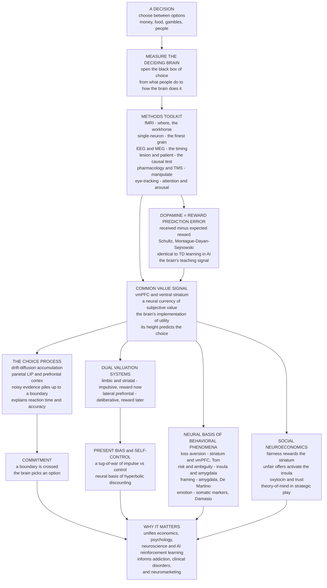

# 🧠 Neuroeconomics

> [!abstract] TL;DR
> **Neuroeconomics** is the interdisciplinary fusion of **neuroscience, economics, and psychology** that opens the *black box* of choice — measuring the **brain** as it decides (via **fMRI**, single-**neuron** recording, and **lesion/patient** studies) to explain *how* the machinery of decision-making produces the biases that behavioral economics merely documents. Its landmark findings: the brain computes a **common neural currency of subjective value** (in the **ventromedial prefrontal cortex** and **ventral striatum**) that implements economic *utility*; **dopamine** neurons encode a **reward prediction error** — the exact temporal-difference learning signal of reinforcement learning (Schultz; Montague–Dayan–Sejnowski), linking neuroscience to AI; choices unfold as **noisy evidence accumulation** to a threshold (the **drift-diffusion model**, explaining reaction times *and* accuracy and the **speed–accuracy trade-off**); and competing **limbic/impulsive** versus **prefrontal/deliberative** systems underlie **present bias** and self-control. The same lens grounds **loss aversion**, **framing**, **risk/ambiguity** attitudes, and **social preferences** (fairness, trust, altruistic punishment) in specific neural circuits. Though its *relevance to economics proper* is genuinely debated (Gul–Pesendorfer: "economics is about choices, not brains"), neuroeconomics unifies mind, brain, and economy — and informs the study of **addiction**, clinical decision disorders, and **neuromarketing**.

---

## Intuition

**Analogy:** Behavioral economics is a brilliant field of *behaviorism with better cameras* — it proves, from thousands of experiments, **that** people systematically deviate from the rational-actor ideal (they overweight losses, discount the future too steeply, chase the herd). But it watches only the *outside* of the machine: money goes in, a choice comes out, and the reasoning in between is a black box. **Neuroeconomics opens the hood.** Slide a person into an fMRI scanner and offer them **10 dollars now or 15 dollars next month**, and you can watch the argument happen in real time: the emotional, reward-hungry regions of the brain light up for the immediate cash, while the deliberative prefrontal cortex pushes back for patience. The decision is not rendered by a single rational calculator; it is the **outcome of a tug-of-war between competing neural systems** — impulse versus control — refereed in the common currency of **dopamine**.

The move is from *what people do* to *how the brain does it*. Where a behavioral economist sees "hyperbolic discounting," the neuroeconomist sees limbic reward circuits shouting over a prefrontal cortex that argues for delay. Where the economist writes "utility," the neuroeconomist finds an actual signal in the ventromedial prefrontal cortex whose height *predicts* the choice. Economics, psychology, and neuroscience — three fields that spent a century talking past one another — finally meet **at the synapse**.

---

## How It Works

### Core mechanics

**The premise: from behavior to mechanism.** Classical economics deliberately stayed *agnostic* about the mind — it modeled choices "as if" agents maximized utility, and treated the brain as an irrelevant black box (the influential Gul–Pesendorfer critique defends exactly this position). Neuroeconomics rejects the agnosticism as a lost opportunity: if we can *measure* the computations the brain actually performs, we can discriminate between economic models that predict identical *choices* but rest on different *processes*, ground the biases of prospect theory in biology, and understand what goes wrong in addiction and disease. The discipline crystallized around 2000–2005 (Glimcher, Camerer, Loewenstein, Rangel, Fehr, Montague) as economists learned neuroscience methods and neuroscientists borrowed the precision of economic choice tasks.

**The methods — measuring the deciding brain.** The neuroeconomic toolkit spans a trade-off between *spatial resolution*, *temporal resolution*, and *causal inference*:

1. **fMRI (functional magnetic resonance imaging)** — the *workhorse*. Localizes activity by tracking blood-oxygenation while a subject makes choices; good spatial resolution, poor timing, and only *correlational*.
2. **Single-neuron recording** — the *finest grain*. Electrodes read individual neurons in behaving animals (and, rarely, neurosurgical patients); this is how dopamine's reward-prediction-error and parietal evidence-accumulation signals were discovered.
3. **EEG / MEG** — millisecond *timing* of population activity, at the cost of spatial precision.
4. **Lesion and patient studies** — the *causal* gold standard: damage a region and see what breaks. Ventromedial prefrontal (vmPFC) patients (e.g., Damasio's "Elliot") retain intelligence but make catastrophic real-life decisions — evidence that this region is *necessary* for valuation.
5. **Pharmacology and brain stimulation** — dopamine agonists/antagonists, oxytocin administration, and **TMS** (transcranial magnetic stimulation) *manipulate* circuits to test causation.
6. **Eye-tracking and psychophysiology** — gaze, pupil dilation, skin conductance, and heart rate reveal attention and emotional arousal during choice.

**Finding 1 — the common value signal (a neural currency of utility).** A foundational discovery: to compare an apple against an orange against a gamble against a charitable donation, the brain must convert all of them into a **common scale of subjective value**. Activity in the **ventromedial prefrontal cortex (vmPFC)** and the **ventral striatum** tracks *how much a person values whatever is on offer* — money, food, gambles, even social outcomes — on a single axis, and the *height* of that signal **predicts the choice**. This is, quite literally, the neural implementation of the economist's **utility**. (Cross-links to the vault's [[Utility_Theory]] and [[Decision_Making_and_Reward_Circuits]].)

**Finding 2 — dopamine as a reward prediction error (the neuroscience–AI bridge).** In one of the most celebrated results in all of neuroscience, **Wolfram Schultz** recorded midbrain **dopamine** neurons and found they do *not* simply signal "pleasure" or reward. They fire to a **reward prediction error (RPE)** — the *difference* between the reward *received* and the reward *expected*: a burst when reward is *better than expected*, baseline when it is *fully predicted*, and a *dip* when an expected reward is *omitted*. **Montague, Dayan, and Sejnowski** then showed this is *precisely* the **temporal-difference (TD) learning** signal from reinforcement learning — δ = r + γV(sₜ₊₁) − V(sₜ). Dopamine is the brain's **teaching signal**, and it is *mathematically identical* to the algorithm that trains AI agents. This single finding welds neuroeconomics to [[Reinforcement_Learning]] and makes value *learning* — not just value *representation* — a neural phenomenon.

**Finding 3 — the drift-diffusion model (how the brain actually compares options).** Given the values, *how* is the choice executed? The dominant computational account is **evidence accumulation**: the brain **integrates noisy evidence** about the value difference between options *over time* until the accumulated total reaches a **decision boundary**, at which point it commits. This **drift-diffusion model (DDM)** — with neural correlates in parietal area **LIP** and prefrontal cortex — is remarkable because it jointly explains **reaction times *and* accuracy** from the same mechanism, and it naturally produces the **speed–accuracy trade-off** (lower boundaries → faster but sloppier). The **drift rate** *is* the value difference: options that are far apart in value are decided quickly and accurately; near-ties are slow and error-prone. It is the same model that explains perceptual decisions (is that dot field moving left or right?), unifying economic and perceptual choice.

**Finding 4 — dual systems and present bias.** Why do we grab the smaller-sooner reward? A widely cited (and debated) result from **McClure et al. (2004)** found that choices involving an *immediate* reward preferentially engage **limbic and striatal** reward regions (associated with impulsivity), whereas choices among *delayed* rewards, and the exercise of self-control, engage **lateral prefrontal** deliberative regions. This offers a *neural substrate* for **hyperbolic discounting**, the "multiple selves" problem, and the [[Dual_Process_Theory_System_1_and_2]] / System-1-vs-System-2 conflict — a literal **tug-of-war of impulse versus control**, with dorsolateral prefrontal cortex modulating the value signal to enforce patience. (The strict *two-system* interpretation is contested — see Pitfalls — but the connection to [[Present_Bias_and_Self_Control]] is central.)

**Finding 5 — grounding the behavioral phenomena in circuits.** Neuroeconomics gives biases a biological address:

- **Loss aversion** — **Tom et al. (2007)** found that as potential *losses* grow, activity in the striatum and vmPFC *declines more steeply* than it *rises* for equivalent gains, and this **neural loss aversion** *predicts each person's behavioral loss aversion*. (See [[Loss_Aversion_and_the_Endowment_Effect]].)
- **Risk and ambiguity** — distinct signatures: the **insula** and amygdala track risk and uncertainty; **ambiguity** aversion recruits additional prefrontal circuitry. (See [[Risk_Ambiguity_and_Uncertainty]].)
- **Framing effects** — **De Martino et al. (2006)** linked susceptibility to the framing bias to **amygdala** activity, while resistance to framing correlated with prefrontal engagement. (See [[Reference_Dependence_and_Framing]].)
- **Emotion as *essential*, not just noise** — Damasio's **somatic-marker hypothesis**: emotional signals (bodily "markers" tagged by vmPFC) are *necessary* for good decisions. vmPFC patients with flattened affect make *terrible* real-world choices, overturning the naïve view that emotion is merely a source of bias. (See [[Emotion_and_Cognition]].)

**Finding 6 — social neuroeconomics.** Our *other-regarding* preferences have a biology too. The **striatum** — the brain's reward hub — activates for **fair** outcomes and even for **altruistic punishment** (the "joy of punishing" a cheater, de Quervain et al.); the **anterior insula** (disgust, rejection) lights up in response to **unfair ultimatum-game offers**, predicting rejection; **oxytocin** administration increases **trust** in trust games; and **theory-of-mind** regions engage during strategic interaction. This grounds [[Social_Preferences_Fairness_and_Reciprocity]] and [[Trust_Altruism_and_Cooperation]] in neural circuitry.

**The debate — promise versus critique.** Neuroeconomics is genuinely contested. The **promise**: mechanism-based economics can *discriminate among competing choice models* by their neural signatures, predict behavior, inform welfare measurement, and illuminate disorders. The **critiques**: (1) the **Gul–Pesendorfer** position — economics is a theory of *choices*, not brains, so neural data is *irrelevant* to economic theory; (2) the **reverse-inference fallacy** — inferring a mental state ("the insula lit up, so they felt disgust") from an activation is logically invalid, since regions are multifunctional; (3) **small samples and replication** problems endemic to fMRI; and (4) over-hyped **"blobology"** that mistakes a colored blob for an explanation. The honest assessment: neuroscience does not *replace* economics, but it *constrains and enriches* it, and it clearly matters for the *applications* (addiction, clinical decision deficits, marketing).

**Frontiers.** The field is maturing at the seams between disciplines: **clinical** neuroeconomics (understanding **addiction** as a *hijacked* dopamine/valuation system, and decision deficits in gambling, depression, and dementia); **neuromarketing** (predicting ad response and preference from brain data — with real limits and ethical questions); improved **decision models and welfare** measurement; and a deepening fusion with **computational modeling and AI/reinforcement learning** — the theme of the not-yet-written sibling *Behavioral_Economics_and_Machine_Learning*.

### The neuroeconomic pipeline: from measured brain to explained choice



---

## Key Concepts

**Secondary (intuitive grasp).** Behavioral economics proved *that* people are not the perfectly rational choosers of textbooks — they fear losses more than they enjoy equal gains, grab money now instead of more money later, and follow the crowd. But it could only watch from the outside. **Neuroeconomics looks *inside* the brain while you decide.** Using scanners and tiny electrodes, scientists have found astonishing things: the brain keeps a single **"value" meter** — a common scale it uses to compare a candy bar, a 20-dollar bill, and a bet — and how high that meter climbs tells you what you will choose. A chemical called **dopamine** turns out to be a **surprise signal**: it spikes when a reward is *better than you expected* and goes quiet when the reward is exactly as predicted — that is how you *learn* what things are worth. And when you face "smaller-now versus bigger-later," an **emotional part of the brain screams for now** while a **thinking part argues for later** — self-control is literally that argument. Neuroeconomics is where three fields — money, mind, and brain — finally meet.

**Undergraduate (mechanism and named findings).** Neuroeconomics applies the **neuroscience toolkit** — **fMRI** (localization, the workhorse), **single-unit recording** (the finest grain, used for dopamine and LIP), **EEG/MEG** (timing), **lesion/patient** studies (causal, e.g. vmPFC damage), **pharmacology/TMS** (manipulation), and eye-tracking — to economic choice. Four pillars: (1) a **common value signal** in **vmPFC** and **ventral striatum** implementing **utility**, whose magnitude predicts choice; (2) **dopamine = reward prediction error** (Schultz), formally the **temporal-difference** signal of RL (Montague–Dayan), the substrate of value *learning*; (3) the **drift-diffusion model** — choices arise from **noisy evidence accumulation** to a **boundary**, jointly explaining RTs, accuracy, and the **speed–accuracy trade-off**, with the **drift rate = value difference**; (4) **dual valuation systems** (limbic/impulsive vs prefrontal/deliberative, McClure) as a neural basis for **present bias**. The same framework locates **loss aversion** (Tom, "neural loss aversion" predicting behavioral), **framing** (amygdala, De Martino), **risk** (insula), and **social preferences** (striatal reward for fairness and punishment; insula for unfair offers; oxytocin and trust) in circuits. Contested by the **Gul–Pesendorfer** "economics is about choices, not brains" critique and by concerns about **reverse inference** and **small-sample fMRI**.

**Graduate (models, methodology, and open problems).** The formal spine is threefold. (i) **Value computation** follows the **Rangel–Padoa-Schioppa** framework: representation, valuation, action-selection, and outcome-learning stages, with vmPFC/OFC encoding **goods-space** value on a common currency (Padoa-Schioppa's OFC "offer value" neurons in monkeys) and striatal signals encoding both value and RPE. (ii) **Learning** is the **TD/actor-critic** model: dopamine phasic firing ≈ δₜ = rₜ + γV(sₜ₊₁) − V(sₜ), with the *critic* (ventral striatum) learning state values and the *actor* (dorsal striatum) learning policies; refinements include *distributional RL* (dopamine populations encode a *distribution* of RPEs, Dabney et al. 2020) and the exploration of *model-based* vs *model-free* control (Daw). (iii) **Choice dynamics** follow the **drift-diffusion / sequential-sampling** class (Ratcliff; the *attentional* DDM of Krajbich–Rangel adds gaze-weighted evidence), which fits full RT distributions and derives the speed–accuracy trade-off as boundary-setting. The deep **methodological** hazards: **reverse inference** (P(mental state | activation) is *not* recoverable from P(activation | mental state) without base rates, Poldrack 2006); the **joint-hypothesis-style** problem that any neural test presupposes a task-to-computation mapping; and replication/power limits. The live **theoretical** debate is *mechanism vs revealed preference*: does discovering the *how* change the *economics*, or — per **Gul–Pesendorfer (2008)** — is economics complete at the level of choice, leaving neuroeconomics a contribution to *psychology and neuroscience* rather than *economic theory*? The pragmatic verdict is that neuroeconomics *constrains* which behavioral model is right and *predicts* out-of-domain behavior (e.g. dietary self-control, addiction relapse), even if pure choice theory remains formally self-sufficient.

---

## Python Demo

```python
# NEURAL MODELS OF DECISION-MAKING
#
# (a) THE DRIFT-DIFFUSION MODEL (DDM) -- the leading neuroeconomic/neuroscience
#     account of CHOICE. The brain ACCUMULATES noisy evidence about the value
#     difference between two options over time; when the running total hits a
#     decision BOUNDARY (+a or -a), it commits. The DRIFT RATE is the value
#     difference: bigger value gaps => faster, more accurate choices. We show
#     (i) sample accumulation paths, (ii) reaction-time distributions for an EASY
#     vs a HARD choice (harder => slower and more errors), and (iii) the classic
#     SPEED-ACCURACY TRADE-OFF (raising the boundary buys accuracy with time).
#
# (b) REWARD PREDICTION ERROR -- dopamine as a TEMPORAL-DIFFERENCE teaching signal
#     (Schultz; Montague-Dayan-Sejnowski). A cue predicts a later reward. Early on,
#     the prediction-error burst sits at REWARD delivery; with learning it MIGRATES
#     BACKWARD to the predictive CUE, and the fully-predicted reward stops eliciting
#     any error -- exactly the dopamine result, and exactly TD learning.
import numpy as np
import matplotlib
matplotlib.use("Agg")
import matplotlib.pyplot as plt

rng = np.random.default_rng(3)


# ===========================================================================
# (a) DRIFT-DIFFUSION MODEL
# ===========================================================================
def ddm_trial(drift, boundary, noise=1.0, dt=0.001, t0=0.15, max_t=4.0, rng=None):
    """One decision. Evidence x starts at 0, drifts at `drift`, diffuses with
    `noise`, until it crosses +boundary (choice 1 = 'correct' for positive drift)
    or -boundary (choice 0 = 'error'). Returns (rt, choice, full path)."""
    if rng is None:
        rng = np.random.default_rng()
    sqrt_dt = np.sqrt(dt)
    x, path = 0.0, [0.0]
    for i in range(int(max_t / dt)):
        x += drift * dt + noise * sqrt_dt * rng.standard_normal()
        path.append(x)
        if x >= boundary:
            return t0 + (i + 1) * dt, 1, np.asarray(path)
        if x <= -boundary:
            return t0 + (i + 1) * dt, 0, np.asarray(path)
    return t0 + max_t, int(x > 0), np.asarray(path)


def ddm_batch(drift, boundary, n, noise=1.0, dt=0.001, t0=0.15, max_t=4.0, rng=None):
    """Vectorised many-trial DDM. Returns arrays (rt, choice)."""
    if rng is None:
        rng = np.random.default_rng()
    sqrt_dt = np.sqrt(dt)
    x = np.zeros(n)
    rt = np.full(n, np.nan)
    choice = np.full(n, -1)
    active = np.ones(n, dtype=bool)
    for i in range(int(max_t / dt)):
        x[active] += drift * dt + noise * sqrt_dt * rng.standard_normal(active.sum())
        up = active & (x >= boundary)
        dn = active & (x <= -boundary)
        rt[up] = t0 + (i + 1) * dt; choice[up] = 1; active[up] = False
        rt[dn] = t0 + (i + 1) * dt; choice[dn] = 0; active[dn] = False
        if not active.any():
            break
    rt[active] = t0 + max_t
    choice[active] = (x[active] > 0).astype(int)
    return rt, choice


BOUND = 1.0
V_EASY, V_HARD = 2.5, 1.0          # drift rate = value difference (easy >> hard)

# (i) a handful of sample accumulation paths (moderate difficulty)
paths = [ddm_trial(1.3, BOUND, rng=rng) for _ in range(8)]

# (ii) RT distributions: easy vs hard choice
rt_easy, ch_easy = ddm_batch(V_EASY, BOUND, 4000, rng=rng)
rt_hard, ch_hard = ddm_batch(V_HARD, BOUND, 4000, rng=rng)

# analytic accuracy for a DDM with unbiased start: 1 / (1 + exp(-2*a*v/noise^2))
acc = lambda v: 1.0 / (1.0 + np.exp(-2.0 * BOUND * v / 1.0 ** 2))

# (iii) speed-accuracy trade-off: sweep the boundary at fixed drift
bounds = np.linspace(0.4, 1.8, 8)
sat_acc, sat_rt = [], []
for b in bounds:
    r, c = ddm_batch(1.5, b, 3000, rng=rng)
    sat_acc.append(c.mean())
    sat_rt.append(r.mean())
sat_acc, sat_rt = np.array(sat_acc), np.array(sat_rt)


# ===========================================================================
# (b) DOPAMINE = TEMPORAL-DIFFERENCE REWARD PREDICTION ERROR
# ===========================================================================
L        = 25        # timesteps per trial
CUE_T    = 5         # cue appears here
REWARD_T = 20        # reward delivered here
R        = 1.0       # reward magnitude
alpha    = 0.3       # learning rate
gamma    = 1.0       # (no) discount -- keeps value flat cue->reward
n_trials = 120

w = np.zeros(L + 1)                  # learned value of each post-cue timestep
rpe = np.zeros((n_trials, L))        # prediction error at every step, every trial
for trial in range(n_trials):
    for t in range(L):
        r = R if t == REWARD_T else 0.0
        v_t    = w[t]     if t     >= CUE_T else 0.0   # no representation pre-cue
        v_next = w[t + 1] if t + 1 >= CUE_T else 0.0
        delta = r + gamma * v_next - v_t               # TD error = dopamine
        rpe[trial, t] = delta
        if t >= CUE_T:
            w[t] += alpha * delta                      # learn

# ---- diagnostics -----------------------------------------------------------
print("=" * 70)
print("(a) DRIFT-DIFFUSION MODEL  (boundary a = %.1f)" % BOUND)
print("=" * 70)
print("EASY choice (drift=%.1f): accuracy %.3f  (theory %.3f) | mean RT %.3f s"
      % (V_EASY, ch_easy.mean(), acc(V_EASY), rt_easy.mean()))
print("HARD choice (drift=%.1f): accuracy %.3f  (theory %.3f) | mean RT %.3f s"
      % (V_HARD, ch_hard.mean(), acc(V_HARD), rt_hard.mean()))
print("=> harder choices (smaller value gap) are SLOWER and LESS accurate.")
print()
print("=" * 70)
print("(b) DOPAMINE REWARD PREDICTION ERROR  (cue @t=%d, reward @t=%d)"
      % (CUE_T, REWARD_T))
print("=" * 70)
print("trial   1: RPE at reward=%+.2f  at cue-onset=%+.2f" % (rpe[0, REWARD_T], rpe[0, CUE_T - 1]))
print("trial %3d: RPE at reward=%+.2f  at cue-onset=%+.2f" % (n_trials, rpe[-1, REWARD_T], rpe[-1, CUE_T - 1]))
print("=> the error BURST migrates from REWARD to the predictive CUE; a fully")
print("   predicted reward stops firing -- exactly Schultz's dopamine result.")

# ===========================================================================
# PLOTS
# ===========================================================================
fig, ax = plt.subplots(2, 2, figsize=(13.5, 9.5))
fig.suptitle("Neural Models of Decision-Making: Drift-Diffusion + Dopamine RPE",
             fontsize=14, fontweight="bold")

# (0,0) sample accumulation paths
for rt_i, ch_i, p in paths:
    tvec = np.arange(len(p)) * 0.001
    ax[0, 0].plot(tvec, p, lw=1.3, alpha=0.85,
                  color="#2563eb" if ch_i == 1 else "#dc2626")
ax[0, 0].axhline(BOUND,  color="#059669", ls="--", lw=1.6, label="+boundary (option A)")
ax[0, 0].axhline(-BOUND, color="#b45309", ls="--", lw=1.6, label="-boundary (option B)")
ax[0, 0].axhline(0, color="black", lw=0.8)
ax[0, 0].set_title("Evidence accumulation to a boundary\n(blue = hit A, red = hit B)")
ax[0, 0].set_xlabel("time (s)"); ax[0, 0].set_ylabel("accumulated evidence")
ax[0, 0].legend(fontsize=8); ax[0, 0].grid(alpha=0.25)

# (0,1) RT distributions: easy vs hard
ax[0, 1].hist(rt_easy, bins=50, color="#2563eb", alpha=0.6,
              density=True, label="EASY (drift=%.1f), acc=%.2f" % (V_EASY, ch_easy.mean()))
ax[0, 1].hist(rt_hard, bins=50, color="#dc2626", alpha=0.6,
              density=True, label="HARD (drift=%.1f), acc=%.2f" % (V_HARD, ch_hard.mean()))
ax[0, 1].set_title("Reaction-time distributions\nharder choice => slower, more errors")
ax[0, 1].set_xlabel("reaction time (s)"); ax[0, 1].set_ylabel("density")
ax[0, 1].legend(fontsize=8); ax[0, 1].grid(alpha=0.25)

# (1,0) speed-accuracy trade-off
axb = ax[1, 0]
l1 = axb.plot(bounds, sat_acc, "o-", color="#059669", lw=2, label="accuracy")
axb.set_xlabel("decision boundary a  (caution)")
axb.set_ylabel("accuracy", color="#059669")
axb.tick_params(axis="y", labelcolor="#059669")
axt = axb.twinx()
l2 = axt.plot(bounds, sat_rt, "s--", color="#7c3aed", lw=2, label="mean RT")
axt.set_ylabel("mean reaction time (s)", color="#7c3aed")
axt.tick_params(axis="y", labelcolor="#7c3aed")
axb.set_title("Speed-accuracy trade-off\nhigher boundary => more accurate but slower")
axb.legend(l1 + l2, [h.get_label() for h in l1 + l2], fontsize=8, loc="center right")
axb.grid(alpha=0.25)

# (1,1) dopamine RPE migrating from reward to cue over learning
for tr, col, lab in [(0, "#93c5fd", "trial 1 (naive)"),
                     (4, "#3b82f6", "trial 5"),
                     (19, "#1d4ed8", "trial 20"),
                     (n_trials - 1, "#dc2626", "trial %d (learned)" % n_trials)]:
    ax[1, 1].plot(np.arange(L), rpe[tr], "o-", ms=3, lw=1.5, color=col, label=lab)
ax[1, 1].axvline(CUE_T - 1, color="#059669", ls=":", lw=1.5, label="cue onset")
ax[1, 1].axvline(REWARD_T, color="#b45309", ls=":", lw=1.5, label="reward")
ax[1, 1].axhline(0, color="black", lw=0.8)
ax[1, 1].set_title("Dopamine reward-prediction-error (TD learning)\nburst migrates: reward -> predictive cue")
ax[1, 1].set_xlabel("timestep within trial"); ax[1, 1].set_ylabel("prediction error  (delta)")
ax[1, 1].legend(fontsize=7); ax[1, 1].grid(alpha=0.25)

plt.tight_layout(rect=[0, 0, 1, 0.95])
plt.savefig("neuroeconomics_decision_models.png", dpi=115, bbox_inches="tight")
plt.show()
```

**What the demo shows.** Panel one plots eight **evidence-accumulation** paths starting at zero and wandering noisily until each crosses a decision **boundary** — the DDM's picture of a brain *piling up evidence and committing*. Panel two contrasts **reaction-time distributions** for an *easy* choice (large drift = large value gap) versus a *hard* one: the hard choice is visibly **slower and less accurate** — the mechanistic signature of a near-tie. Panel three sweeps the **boundary** at fixed drift to reproduce the **speed–accuracy trade-off**: raising the boundary (more "caution") lifts accuracy but stretches reaction time, exactly the dial the brain adjusts under time pressure. Panel four is the **dopamine** result: the prediction-error burst starts at **reward** delivery (trial 1), then **migrates backward** to the predictive **cue** as value is learned, and the fully-predicted reward stops eliciting any error — a from-scratch reproduction of Schultz's finding and of temporal-difference [[Reinforcement_Learning]].

---

## Real-World Applications

> **Addiction as a hijacked valuation system.** The most consequential clinical application: drugs of abuse **directly stimulate dopamine**, generating an *artificial, unquenchable* reward-prediction-error signal that the brain's learning machinery treats as "better than expected, every time." This over-trains cue-triggered value signals in the striatum and erodes prefrontal self-control — a neuroeconomic account of craving, relapse, and the steep, present-biased discounting of addicts. It reframes addiction as a **disorder of learning and valuation**, not mere weakness of will, and links directly to [[Psychopharmacology_and_Drug_Mechanisms]].

> **Clinical decision disorders.** Neuroeconomic tasks and models are diagnostic windows into psychopathology: flattened reward-prediction-error and blunted striatal value signals in **depression** (anhedonia), distorted risk/probability weighting and dopamine dysregulation in **pathological gambling** and **Parkinson's** (impulse-control side effects of dopamine agonists), and vmPFC-linked valuation deficits in **frontotemporal dementia**. Computational-psychiatry fits of the DDM and RL models turn symptoms into *measurable parameters* (drift rate, learning rate, boundary), connecting to [[Psychiatric_Disorders_and_Neurobiology]].

> **Neuromarketing (with caveats).** Firms use fMRI and EEG to predict ad recall, brand preference, and even aggregate sales *better than* stated-preference surveys in some studies (Berns, Knutson) — because the ventral-striatal value signal can reveal preferences people will not or cannot report. The honest limits: reverse-inference risk, small samples, cost, and real ethical concerns about "buy buttons" and manipulation.

> **Self-control and welfare design.** Because self-control is (partly) prefrontal modulation of value signals, interventions that *strengthen or offload* that modulation work: precommitment, cue-avoidance, and choice architecture. Neuroeconomic evidence that dieting self-control involves dlPFC down-weighting of taste value (Hare et al.) informs the design of [[Present_Bias_and_Self_Control]] interventions and nudges.

> **Better economic and AI models.** Neuroeconomics feeds *back* into theory: neural evidence that value is compared by sequential sampling supports **attentional DDM** models of consumer choice (gaze predicts what you buy), and the dopamine–TD correspondence is a two-way street — neuroscience validated reinforcement learning, and modern RL (distributional value coding, model-based control) now generates fresh neural predictions. This bidirectional flow is the theme of the forthcoming sibling *Behavioral_Economics_and_Machine_Learning*.

---

## Common Pitfalls

- **The reverse-inference fallacy.** "The insula activated, therefore the subject felt disgust." Invalid: brain regions are *multifunctional*, so activation does not uniquely identify a mental state without prior base rates (Poldrack). Neuroeconomic claims must be phrased as "this region's activity *tracks/predicts* value," not "this region *is* the feeling."

- **Mistaking a blob for an explanation ("blobology").** Localizing *where* a computation happens is not the same as explaining *how* or *why*. The scientific payload is in the **computational model** (the value signal's math, the DDM parameters, the TD rule) — the fMRI blob is only its address. A colored brain picture is not a theory.

- **Over-reading the strict two-system story.** McClure-style dual-systems results are seductive but contested: **Kable and Glimcher (2007)** showed a *single* value signal that discounts hyperbolically can explain the same data without two warring systems. Treat "limbic impulse vs prefrontal control" as a *useful metaphor with partial neural support*, not settled anatomy — the caution echoed in [[Dual_Process_Theory_System_1_and_2]].

- **Small samples and low power.** fMRI studies have historically been underpowered; flashy single-study findings (especially cross-subject correlations) often fail to replicate. Weight *converging* evidence (fMRI + single-unit + lesion + pharmacology) far above any lone scanner result.

- **Assuming neuroscience overturns economics.** The Gul–Pesendorfer point stands: revealed-preference theory is *self-contained* at the level of choice, and knowing brain mechanism does not, by itself, change what a rational-choice model *predicts about choices*. Neuroeconomics adds *most* value where behavior alone is ambiguous (which model? why the bias? what breaks in disease?) — overclaiming that it "proves economics wrong" invites the critique.

- **Confusing dopamine with pleasure.** The single most common misconception. Dopamine encodes **reward *prediction error* (wanting/learning)**, *not* hedonic **pleasure (liking)** — Berridge's distinction. A fully predicted reward is deeply pleasurable yet elicits *no* dopamine burst. Getting this wrong corrupts every downstream claim about motivation and addiction.

---

## Related Concepts

- [[Behavioral_Economics_Overview]] — the parent map; neuroeconomics is the *mechanistic frontier* that asks *how the brain* produces the behavior the overview catalogs.
- [[Dual_Process_Theory_System_1_and_2]] — the behavioral System-1/System-2 framing that neuroeconomics tries (contestedly) to ground in limbic-vs-prefrontal circuitry.
- [[Present_Bias_and_Self_Control]] — hyperbolic discounting and self-control, given a candidate neural substrate (dual valuation systems; dlPFC modulation of value).
- [[Loss_Aversion_and_the_Endowment_Effect]] — loss aversion located in asymmetric striatal/vmPFC responses ("neural loss aversion," Tom et al.).
- [[Reference_Dependence_and_Framing]] — framing effects tied to amygdala engagement (De Martino et al.).
- [[Risk_Ambiguity_and_Uncertainty]] — the distinct neural signatures of risk (insula) and ambiguity that neuroeconomics dissects.
- [[Prospect_Theory]] — the value and probability-weighting functions whose *neural implementation* neuroeconomics seeks.
- [[Intertemporal_Choice_and_Discounting]] — the delay-discounting behavior that the "10 dollars now vs 15 later" scanner paradigm probes.
- [[Social_Preferences_Fairness_and_Reciprocity]] — fairness, reciprocity, and altruistic punishment, grounded in striatal reward and insular rejection signals.
- [[Trust_Altruism_and_Cooperation]] — trust games and the oxytocin/theory-of-mind circuitry of social neuroeconomics.
- [[Expected_Utility_Theory_and_Its_Violations]] — the rational benchmark whose "utility" the common value signal physically realizes (and whose violations neuroeconomics explains).
- [[Reinforcement_Learning]] — the AI framework whose **temporal-difference** error is *identical* to the dopamine reward-prediction-error signal — the field's deepest bridge.
- [[Decision_Making_and_Reward_Circuits]] — the Neuroscience vault's core account of vmPFC, striatum, dopamine, and the reward system this note applies to economics.
- [[Neuroimaging_Methods]] — the fMRI/EEG/MEG methodology underlying the "measure the deciding brain" toolkit.
- [[Cerebellum_and_Basal_Ganglia]] — the basal-ganglia/striatal circuitry that carries dopaminergic value and prediction-error signals.
- [[Synaptic_Transmission_and_Neurotransmitters]] — the dopamine neurotransmitter system that serves as the brain's teaching signal.
- [[Attention_and_Executive_Function]] — the prefrontal executive/self-control machinery that modulates value signals to enforce patience.
- [[Judgment_and_Decision_Making]] — the Cognitive Science treatment of the choice processes the DDM formalizes.
- [[Bayesian_Models_of_Cognition]] — the evidence-accumulation/optimal-inference view that the drift-diffusion model instantiates.
- [[Emotion_and_Cognition]] — the somatic-marker hypothesis: emotion as *essential* to good decisions, not merely a bias.
- [[Problem_Solving_and_Decision_Making]] — the Psychology-vault companion on how humans reach decisions.
- [[Utility_Theory]] — the microeconomic *utility* that the vmPFC/striatal common value signal biologically implements.

*Not yet written (Behavioral_Economics sibling referenced above in prose): Behavioral_Economics_and_Machine_Learning.*

---

## Review Questions

### Secondary
1. Behavioral economics can only watch a person's choices from the *outside* (money in, decision out). Name two tools neuroeconomics uses to look *inside* the brain as it decides, and explain in plain words what the "common value signal" is — and why watching it could tell you what someone is about to choose.
2. Dopamine is often called the brain's "pleasure chemical," but neuroeconomics says that is wrong: it is a **surprise** signal. Using the "reward that is exactly as expected produces *no* dopamine burst" fact, explain the difference between *liking* a reward and *learning* its value — and why a slot machine's unpredictable payouts are so good at hooking people.

### Undergraduate
1. Explain the **drift-diffusion model** of choice. Define the **drift rate**, the **boundary**, and the noise, and show how the *same* mechanism explains both **reaction time** and **accuracy**. Why does a smaller *value difference* between two options make a choice slower *and* more error-prone, and what does raising the boundary trade away?
2. State the correspondence between **dopamine firing** and the **temporal-difference reward prediction error** δ = r + γV(sₜ₊₁) − V(sₜ). Walk through *why*, over repeated trials, the prediction-error burst **migrates** from the moment of reward to the predictive **cue**, and what happens to the signal when a fully-expected reward is suddenly *omitted*.

### Graduate
1. Assess the **Gul–Pesendorfer** claim that "neuroeconomics is irrelevant to economics because economics is about choices, not brains." Construct the strongest version of their argument, then give two concrete cases where neural/process data *does* add scientific value that choice data alone cannot (hint: discriminating observationally-equivalent models; predicting out-of-domain behavior such as addiction relapse). Where do you land?
2. The **McClure et al. (2004)** dual-systems result and the **Kable–Glimcher (2007)** single-value-signal result both fit intertemporal-choice data, yet imply different neural architectures for **present bias**. Explain how a *single* hyperbolically-discounting value signal can mimic a *two-system* tug-of-war, why this is an identifiability problem, and what kind of evidence (causal manipulation? single-unit? pharmacology?) could adjudicate between them.

---

## Sources

- [Glimcher, P. W. & Fehr, E. (eds.) (2014). *Neuroeconomics: Decision Making and the Brain*, 2nd ed. Academic Press](https://www.sciencedirect.com/book/9780124160088/neuroeconomics)
- [Schultz, W., Dayan, P. & Montague, P. R. (1997). "A Neural Substrate of Prediction and Reward." *Science* 275(5306), 1593–1599](https://doi.org/10.1126/science.275.5306.1593)
- [Rangel, A., Camerer, C. & Montague, P. R. (2008). "A Framework for Studying the Neurobiology of Value-Based Decision Making." *Nature Reviews Neuroscience* 9, 545–556](https://doi.org/10.1038/nrn2357)
- [Tom, S. M., Fox, C. R., Trepel, C. & Poldrack, R. A. (2007). "The Neural Basis of Loss Aversion in Decision-Making Under Risk." *Science* 315(5811), 515–518](https://doi.org/10.1126/science.1134239)
- [McClure, S. M., Laibson, D. I., Loewenstein, G. & Cohen, J. D. (2004). "Separate Neural Systems Value Immediate and Delayed Monetary Rewards." *Science* 306(5695), 503–507](https://doi.org/10.1126/science.1100907)
- [Gul, F. & Pesendorfer, W. (2008). "The Case for Mindless Economics." In *The Foundations of Positive and Normative Economics*, Oxford University Press](https://www.princeton.edu/~pesendor/mindless.pdf)
- [Camerer, C., Loewenstein, G. & Prelec, D. (2005). "Neuroeconomics: How Neuroscience Can Inform Economics." *Journal of Economic Literature* 43(1), 9–64](https://doi.org/10.1257/0022051053737843)

---

#behavioral-economics #neuroeconomics #drift-diffusion-model #dopamine #decision-neuroscience
