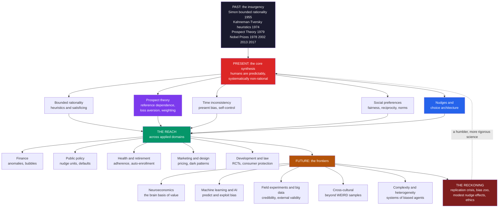

# 🧭 The Reach and Future of Behavioral Economics

> [!abstract] TL;DR
> Behavioral economics completed a fifty-year revolution — from the insurgency of Simon, Kahneman-Tversky, and Thaler to the mainstream of the discipline, honored with multiple Nobel Prizes (Simon 1978, Kahneman 2002, Shiller 2013, Thaler 2017) — that replaced the perfectly rational **Homo economicus** with a psychologically realistic human who is *boundedly rational, loss-averse, present-biased, socially motivated, and predictably biased*. Synthesizing this vault's arc — bounded rationality, prospect theory, the heuristics and biases, time inconsistency, social preferences, and the nudge revolution — it has transformed **finance, public policy, health, savings, marketing, development, and law**, and now pushes into **neuroeconomics, machine learning, field experiments, and cross-cultural** research. Chastened by the **replication crisis** and real critiques (the "bias zoo," external validity, modest nudge effects, the ethics of manipulation), it has matured into a humbler, more rigorous science. Its enduring legacy is an economics grounded in how real humans actually decide — and its defining future challenge is safeguarding human welfare and autonomy in an age of algorithms that can exploit our biases at scale.

---

## Intuition

**Analogy:** Behavioral economics began as a **rebel insurgency**. A handful of psychologists and heterodox economists — armed with lab experiments, counterexamples, and stubborn empirical facts — started poking holes in the perfect rationality of *Homo economicus*, the coldly optimizing fiction at the heart of classical theory. For decades the establishment dismissed them as gadflies cataloguing curiosities. Then, fifty years, three-plus Nobel Prizes, and a global army of "nudge units" later, the rebels *won*. No serious economist today believes people are perfectly rational; "behavioral" insights are woven into policy, finance, marketing, and product design worldwide. The revolution succeeded so completely that it is simply becoming... *economics*. The most successful insurgencies do not overthrow the capital and rule as a rival faction — they dissolve into the new normal, until nobody remembers there was ever a fight.

That is where the field now stands. The frontier is no longer *whether* humans are irrational — that battle is over. The open questions are richer and harder: how to build a genuinely *human* science of decisions from a sprawling list of biases, and how to protect that humanity when algorithms can now learn our weaknesses faster than we can. The insurgency became the government; the hard part of governing has just begun.

---

## How It Works

### The grand arc: from fringe critique to mainstream

The revolution ran in three acts. **Act I (the critique)** was Herbert Simon's [[Bounded_Rationality_and_Satisficing]] (1955) — cognition is limited, so people *satisfice* rather than optimize — and Kahneman and Tversky's heuristics-and-biases program of the 1970s ([[Heuristics_and_Biases_Overview]], [[Availability_and_Representativeness]], [[Anchoring_and_Adjustment]]), which showed the mind's shortcuts produce *systematic* errors, not random noise. **Act II (the theory)** was [[Prospect_Theory]] (1979), the field's crown jewel: a precise, testable replacement for expected-utility theory built on [[Loss_Aversion_and_the_Endowment_Effect|reference dependence and loss aversion]] and [[Probability_Weighting_and_Certainty_Effect|nonlinear probability weighting]]. **Act III (the application)** was Thaler and Sunstein's *Nudge* (2008), which turned descriptive science into a policy toolkit through [[Nudges_and_Choice_Architecture|choice architecture]]. The Nobel Prizes mark the ascent: Simon (1978), Kahneman (2002), Shiller for behavioral finance (2013), Thaler (2017). A victorious insurgency, now simply becoming economics.

### The core synthesis: the whole vault in one picture

Strip away the taxonomy and behavioral economics tells a single story: humans are **predictably, systematically non-rational**. The story has six load-bearing pillars, each a section of this vault.

1. **Bounded rationality** — limited attention, memory, and computation force reliance on heuristics and satisficing ([[The_Rational_Actor_Model_and_Its_Limits]], [[Bounded_Rationality_and_Satisficing]]).
2. **Heuristics and biases** — availability, representativeness, [[Anchoring_and_Adjustment|anchoring]], [[Overconfidence_and_Calibration|overconfidence]], [[Confirmation_Bias_and_Motivated_Reasoning|confirmation bias]], and [[Base_Rate_Neglect_and_Bayesian_Reasoning|base-rate neglect]] — the shortcuts and their lawful errors.
3. **Dual-process thinking** — a fast, intuitive System 1 and a slow, deliberate System 2 ([[Dual_Process_Theory_System_1_and_2]]); most biases are System 1 answers System 2 fails to catch.
4. **Prospect theory** — the theoretical core: [[Reference_Dependence_and_Framing|reference dependence]], loss aversion, probability weighting ([[Prospect_Theory]], [[Mental_Accounting]], [[Risk_Ambiguity_and_Uncertainty]]).
5. **Time inconsistency** — hyperbolic discounting produces [[Present_Bias_and_Self_Control|present bias]] and a demand for commitment ([[Intertemporal_Choice_and_Discounting]]).
6. **Social preferences** — fairness, reciprocity, trust, and norms ([[Social_Preferences_Fairness_and_Reciprocity]], [[Trust_Altruism_and_Cooperation]], [[Social_Norms_and_Conformity]]).

These six converge on the applied triumph — **nudges and choice architecture** — and radiate outward into the markets studied in [[Behavioral_Finance_Foundations]], [[Herding_Bubbles_and_Crashes]], [[Market_Anomalies_and_Limits_to_Arbitrage]], and the [[Prospect_Theory_in_Markets_Disposition_Effect|disposition effect]].

### The reach and the frontier

From this core the field radiates into nearly every applied domain — finance, public policy, health, retirement, marketing, development, law, management, environment, education — and then presses on to five research frontiers: **neuroeconomics** (the brain basis of value), **machine learning and AI** (predicting behavior, and algorithms that exploit bias), **field experiments and big data** (scaling and external validity — the credibility revolution), **cross-cultural** work (beyond WEIRD samples), and **complexity and heterogeneity** (systems of interacting biased agents, not single effects). The diagram maps this past-to-present-to-future sweep.



---

## Key Concepts

### Secondary Level

**The rebels who won.** For a long time, economics textbooks described people as flawless calculators who always make the smart money choice. A small group of researchers said "that's not how real people actually behave" — and spent fifty years proving it with experiments. They were right, and they won so completely that their ideas are now just part of ordinary economics. Several of them received the Nobel Prize.

**What they discovered, in one line:** people make mistakes, but the mistakes *follow patterns*. We fear losing more than we enjoy winning; we grab rewards now even when waiting is smarter; we copy the crowd; we care about being treated fairly. Once you know the pattern, you can predict the mistake — and gently design around it (a **nudge**).

**Why the future is tricky.** The same knowledge that lets a government help you save for retirement lets an app keep you scrolling, or a store trick you into a subscription you cannot cancel. The big question ahead is: now that companies and algorithms know our weaknesses, how do we make sure this powerful knowledge helps people instead of exploiting them?

### Undergraduate Level

**A field defined by its benchmark.** Behavioral economics is not a rejection of economics; it is *economics done with a more realistic model of the agent*. It keeps the discipline's method — build a model, derive predictions, test them — but swaps the rational-actor axioms (complete, stable, transitive preferences; expected-utility maximization; Bayesian updating; unlimited willpower; pure self-interest) for empirically grounded departures. Prospect theory is the paradigm case: it retains the multiply-and-sum structure of expected utility but redefines value over reference-dependent gains and losses and runs probabilities through a weighting function. See [[The_Rational_Actor_Model_and_Its_Limits]] and [[Expected_Utility_Theory_and_Its_Violations]].

**The reach, concretely.** The same handful of mechanisms recur across domains. *Loss aversion* drives the [[Prospect_Theory_in_Markets_Disposition_Effect|disposition effect]] in finance, opt-out defaults in policy, and "don't lose your streak" in app design. *Present bias* explains under-saving, the appeal of commitment savings (Save More Tomorrow), and poor medication adherence. *Social norms* power tax-compliance letters ("9 out of 10 people already paid") and energy-conservation nudges. One toolkit, many industries.

**The credibility revolution.** What separates modern behavioral economics from a catalog of quirks is *method*. The field moved from hypothetical questionnaires to incentivized lab tasks, and then to large **field experiments** — randomized controlled trials embedded in real firms, tax agencies, and clinics (the development-economics RCT tradition of Banerjee, Duflo, Kremer; the field-experiment program of John List). Lab effects often *shrink* in the field, which is exactly why running the field test matters.

**The honest reckoning.** A mature field is a self-critical one. The **replication crisis** in psychology forced pre-registration and larger samples: robust findings (loss aversion, default effects, anchoring) survived; flashier ones (many priming effects, some ego-depletion results) did not. The **"bias zoo"** critique notes that a list of dozens of effects lacks the parsimony of rational choice — many effects, weak unifying theory. And nudges, celebrated in 2008, often deliver *modest* real-world effects, reviving debate about whether behavioral policy is a substitute for, or a distraction from, structural reform.

### Graduate Level

**The i-frame versus s-frame critique.** Chater and Loewenstein (2023) argue that behavioral economics drifted toward an **individual frame** (i-frame) — fixing the person via nudges — at the expense of the **system frame** (s-frame) — fixing the structure via taxes, regulation, and market design. The danger is *political capture*: industries that resist regulation happily fund a recycling nudge or a "please gamble responsibly" message that leaves the profitable structure untouched. A responsible behavioral policy specifies when an i-frame nudge complements an s-frame reform and when it substitutes for and crowds it out. This connects to the [[Nudges_and_Choice_Architecture|choice-architecture]] literature and to the *Behavioral Public Policy and Libertarian Paternalism* note (forthcoming in this section).

**External validity and ecological rationality.** Gigerenzer's ecological-rationality school argues many "biases" are artifacts of unnatural question formats (probabilities rather than natural frequencies) and that simple heuristics can *outperform* optimization in the noisy, small-sample environments humans inhabit (the bias-variance tradeoff, "less-is-more"). List's field-experiment program adds that stakes, selection, experience, and market discipline attenuate many lab anomalies. The productive synthesis is **resource-rational analysis**: apparent irrationality is optimal *given* the true costs of computation — reconciling Simon, Kahneman, and Gigerenzer rather than choosing a victor.

**The welfare problem: which preferences count?** Behavioral welfare economics faces a foundational puzzle. Standard welfare economics equates well-being with *revealed preference* — what you choose is what is good for you. But if preferences are *constructed, reference-dependent, and manipulable*, revealed preference reveals the choice architect as much as the person. So *which* preferences define welfare: the ones revealed in the moment, or "true," reflective, error-corrected preferences? This is precisely the **libertarian-paternalism** justification for nudging ("help people achieve what they themselves would endorse on reflection") — and precisely the same question that reappears, at civilization scale, in **AI alignment**: whose preferences, revealed or reflective, should an optimizing system be aligned to?

**The grand questions ahead.** Five open challenges define the future. (1) *Unification* — can the bias zoo be derived from a small set of principles (resource rationality, predictive processing, a common valuation system) rather than enumerated? (2) *Integration* — can behavioral and rational-choice economics merge into one science of behavior that specifies *when* each model applies? (3) *Welfare* — which preferences count, and how do we do paternalism without arrogance? (4) *Autonomy in the algorithmic age* — how to protect human welfare when recommender systems, personalized pricing, and generative AI can learn and exploit individual biases at scale, deploying **sludge** and dark patterns faster than regulators can respond? (5) *Scaling and heterogeneity* — how to move from average treatment effects to *personalized, adaptive* interventions that respect the enormous variation across people, cultures, and contexts (beyond the WEIRD samples critiqued by Henrich).

---

## Python Demo

```python
# ---------------------------------------------------------------
# CAPSTONE GALLERY: Behavioral Economics in one dashboard.
# Four signature departures from the rational Homo economicus:
#   (1) Prospect-theory VALUE FUNCTION  -> loss aversion
#   (2) HYPERBOLIC vs EXPONENTIAL discounting -> present bias
#   (3) PROBABILITY-WEIGHTING function  -> overweighting rare events
#   (4) The NUDGE / DEFAULT effect      -> opt-in vs opt-out enrollment
# Each panel contrasts the BEHAVIORAL agent with the RATIONAL benchmark.
# ---------------------------------------------------------------
import numpy as np
import matplotlib
matplotlib.use("Agg")            # headless-safe backend
import matplotlib.pyplot as plt

# ---- Tversky & Kahneman (1992) parameter estimates -------------
ALPHA, BETA = 0.88, 0.88   # value-function curvature (gains, losses)
LAMBDA      = 2.25         # loss-aversion coefficient
GAMMA       = 0.61         # probability-weighting curvature

def value(x):
    """S-shaped prospect-theory value, coded from the reference point."""
    x = np.asarray(x, dtype=float)
    return np.where(x >= 0, np.abs(x) ** ALPHA, -LAMBDA * np.abs(x) ** BETA)

def weight(p):
    """Inverse-S probability weighting: overweights small p."""
    p = np.asarray(p, dtype=float)
    return p ** GAMMA / (p ** GAMMA + (1.0 - p) ** GAMMA) ** (1.0 / GAMMA)

# ===============================================================
# (1) LOSS AVERSION: value of a gain vs an equal loss.
# ===============================================================
g = 100.0
loss_gain_ratio = abs(value(-g)) / value(g)

# ===============================================================
# (2) PRESENT BIAS: today's value of a $100 reward delayed t weeks.
#   Exponential (rational, time-consistent):  delta ** t
#   Quasi-hyperbolic beta-delta (behavioral):  beta * delta ** t for t>0
# ===============================================================
weeks = np.arange(0, 27)
delta = 0.97                       # weekly long-run discount factor
beta  = 0.70                       # present-bias parameter (t=0 gets full weight)
exp_disc  = delta ** weeks
hyp_disc  = np.where(weeks == 0, 1.0, beta * delta ** weeks)

# Preference REVERSAL demo: smaller-sooner $100 at week 4 vs larger-later $110 at week 6.
def pv_exp(amount, t):  return amount * delta ** t
def pv_hyp(amount, t):  return amount * (1.0 if t == 0 else beta * delta ** t)
# Seen from today (week 0) both options are in the future:
ss_now, ll_now = pv_hyp(100, 4), pv_hyp(110, 6)
# Seen from week 4, the sooner reward is NOW (t=0), triggering the reversal:
ss_at4, ll_at4 = pv_hyp(100, 0), pv_hyp(110, 2)

# ===============================================================
# (3) PROBABILITY WEIGHTING across the [0,1] range.
# ===============================================================
p = np.linspace(0.0001, 0.9999, 400)
w = weight(p)

# ===============================================================
# (4) NUDGE / DEFAULT EFFECT: retirement-plan participation.
#   Real pattern (Madrian & Shea 2001): opt-IN ~ 40-60%, opt-OUT ~ 90%+.
# ===============================================================
optin, optout = 49.0, 93.0        # % participating (auto-enrollment defaults)

print("=" * 64)
print("BEHAVIORAL ECONOMICS CAPSTONE -- four departures from rationality")
print("=" * 64)
print(f"(1) Loss aversion: |v(-100)| / v(+100) = {loss_gain_ratio:.2f}"
      f"  (a loss stings ~{loss_gain_ratio:.1f}x an equal gain)")
print(f"(2) Present bias (viewed from TODAY, week 0):")
print(f"      smaller-sooner $100@wk4  PV={ss_now:6.2f}   "
      f"larger-later $110@wk6  PV={ll_now:6.2f}"
      f"  -> prefers {'LATER (patient)' if ll_now > ss_now else 'SOONER'}")
print(f"    Present bias (viewed from WEEK 4, sooner reward is NOW):")
print(f"      smaller-sooner $100@now  PV={ss_at4:6.2f}   "
      f"larger-later $110@wk2  PV={ll_at4:6.2f}"
      f"  -> prefers {'SOONER (impatient)' if ss_at4 > ll_at4 else 'LATER'}")
print(f"      => PREFERENCE REVERSAL: the hallmark of hyperbolic discounting.")
print(f"(3) Probability weighting: w(0.01) = {float(weight(0.01)):.3f}"
      f"  (a 1% chance FEELS like ~{100*float(weight(0.01)):.0f}%)")
print(f"(4) Nudge/default: opt-IN {optin:.0f}%  ->  opt-OUT {optout:.0f}%"
      f"  ({optout-optin:.0f} pt jump from one design change)")

# ---------------------------- FIGURE ----------------------------
fig, axes = plt.subplots(2, 2, figsize=(14, 10))
fig.suptitle("Behavioral Economics in One View: Four Departures from Homo Economicus",
             fontsize=14, fontweight="bold")
(ax1, ax2), (ax3, ax4) = axes

# Panel 1: prospect-theory value function (loss aversion)
x = np.linspace(-150, 150, 600)
ax1.plot(x, value(x), color="#7c3aed", lw=2.6, label="behavioral value v(x)")
ax1.plot(x, x, color="#94a3b8", ls="--", lw=1.4, label="rational linear value")
ax1.axhline(0, color="black", lw=0.8); ax1.axvline(0, color="black", lw=0.8)
ax1.plot([g, g], [0, float(value(g))],   color="#059669", lw=1.3, ls=":")
ax1.plot([-g, -g], [0, float(value(-g))], color="#dc2626", lw=1.3, ls=":")
ax1.annotate(f"loss arm ~{loss_gain_ratio:.1f}x steeper\n(loss aversion)",
             xy=(-g, float(value(-g))), xytext=(-148, -235), fontsize=9,
             color="#dc2626", arrowprops=dict(arrowstyle="->", color="#dc2626"))
ax1.set_title("1. Prospect theory: reference-dependent value\n(losses loom larger than gains)",
              fontsize=10.5)
ax1.set_xlabel("Outcome relative to reference point"); ax1.set_ylabel("Subjective value")
ax1.legend(fontsize=8, loc="upper left"); ax1.grid(alpha=0.25)

# Panel 2: hyperbolic vs exponential discounting (present bias)
ax2.plot(weeks, exp_disc, "o-", color="#2563eb", ms=3.5, lw=2.0,
         label="exponential (rational, consistent)")
ax2.plot(weeks, hyp_disc, "s-", color="#dc2626", ms=3.5, lw=2.0,
         label="quasi-hyperbolic (present-biased)")
ax2.axvline(0, color="#6b7280", ls=":", lw=1.0)
ax2.annotate("sharp drop after 'now'\n= present bias", xy=(1, hyp_disc[1]),
             xytext=(6, 0.85), fontsize=9, color="#7f1d1d",
             arrowprops=dict(arrowstyle="->", color="#7f1d1d"))
ax2.set_title("2. Discounting: the present-bias kink\n(impatience that reverses one's own plans)",
              fontsize=10.5)
ax2.set_xlabel("Delay (weeks)"); ax2.set_ylabel("Discount weight on future reward")
ax2.legend(fontsize=8, loc="upper right"); ax2.grid(alpha=0.25); ax2.set_ylim(0, 1.05)

# Panel 3: probability-weighting function
ax3.plot(p, w, color="#f59e0b", lw=2.6, label="decision weight w(p)")
ax3.plot([0, 1], [0, 1], color="#94a3b8", ls="--", lw=1.4, label="rational w(p) = p")
ax3.fill_between(p, w, p, where=(w > p), color="#f59e0b", alpha=0.15)
ax3.fill_between(p, w, p, where=(w < p), color="#2563eb", alpha=0.12)
ax3.text(0.04, 0.33, "rare events\nOVER-weighted\n(lotteries + insurance)",
         fontsize=8.5, color="#b45309")
ax3.text(0.52, 0.42, "likely events\nUNDER-weighted", fontsize=8.5, color="#1e40af")
ax3.set_title("3. Probability weighting: the certainty and\nrare-event distortions",
              fontsize=10.5)
ax3.set_xlabel("Objective probability p"); ax3.set_ylabel("Decision weight w(p)")
ax3.legend(fontsize=8, loc="lower right"); ax3.grid(alpha=0.25)

# Panel 4: nudge / default effect
bars = ax4.bar(["Opt-IN default\n(must sign up)", "Opt-OUT default\n(auto-enrolled)"],
               [optin, optout], color=["#9ca3af", "#059669"],
               edgecolor="black", linewidth=0.9, width=0.55)
for b, v in zip(bars, [optin, optout]):
    ax4.text(b.get_x() + b.get_width()/2, v + 1.5, f"{v:.0f}%",
             ha="center", fontsize=11, fontweight="bold")
ax4.annotate("", xy=(1, optout), xytext=(1, optin),
             arrowprops=dict(arrowstyle="<->", color="#dc2626", lw=1.8))
ax4.text(1.05, (optin+optout)/2, f"+{optout-optin:.0f} pts\nsame freedom,\nnew default",
         fontsize=9, color="#7f1d1d", va="center")
ax4.set_title("4. The nudge: retirement-plan participation\n(choice architecture, not coercion)",
              fontsize=10.5)
ax4.set_ylabel("% participating"); ax4.set_ylim(0, 105); ax4.grid(axis="y", alpha=0.25)

plt.tight_layout(rect=[0, 0, 1, 0.95])
plt.savefig("behavioral_economics_capstone.png", dpi=110, bbox_inches="tight")
plt.show()
```

**What the demo shows:**

- **Panel 1 (loss aversion):** the prospect-theory value function is kinked at the reference point and roughly `2.25x` steeper below it — the single most consequential behavioral fact, and the engine behind the endowment effect, the disposition effect, and default stickiness.
- **Panel 2 (present bias):** exponential discounting is a smooth curve; quasi-hyperbolic discounting has a *kink* right after "now." The console prints the resulting **preference reversal** — patient when both rewards are distant, impatient once the sooner reward becomes immediate — the formal signature of self-control problems and the reason commitment devices exist.
- **Panel 3 (probability weighting):** the weighting curve bows *above* the diagonal for small probabilities (a 1 percent chance feels like far more than 1 percent, so we buy lotteries *and* insurance) and *below* it for large ones — the distortion behind the fourfold pattern and the certainty effect.
- **Panel 4 (the nudge):** flipping a retirement plan from opt-in to opt-out lifts participation from roughly half to over ninety percent, with no one losing a single option. One design change, an entire nation's savings behavior transformed — the applied triumph, and the double-edged power, of the whole field.

---

## Real-World Applications

> **Finance.** Behavioral finance ([[Behavioral_Finance_Foundations]], Shiller's Nobel 2013) reframed [[Herding_Bubbles_and_Crashes|bubbles and crashes]] as products of herding, extrapolative expectations, and "irrational exuberance," and explained [[Market_Anomalies_and_Limits_to_Arbitrage|persistent anomalies]] via limits to arbitrage. Loss aversion drives the [[Prospect_Theory_in_Markets_Disposition_Effect|disposition effect]] and the equity-premium puzzle; overconfidence drives [[Overtrading_and_Behavioral_Portfolio_Theory|overtrading]].

> **Public policy and the nudge units.** After *Nudge* (2008), governments built behavioral-insights teams — the UK's "Nudge Unit," the US SBST, and dozens worldwide. Flagship results: **auto-enrollment** in retirement plans (participation from ~50% to over 90%), **opt-out organ-donation** defaults (consent near 90% versus ~15% in opt-in countries), and reframed tax letters that measurably raise compliance. See [[Nudges_and_Choice_Architecture]] and the forthcoming *Behavioral Public Policy and Libertarian Paternalism*.

> **Health and retirement.** Present bias and friction are the enemies of healthy and prudent behavior, so interventions attack them: **Save More Tomorrow** commits raises to future saving; default appointment slots and text reminders lift vaccination and adherence; cafeteria placement nudges healthier eating. Detailed in the forthcoming *Behavioral Economics in Health and Retirement*.

> **Marketing, product design, and the dark side.** Reference points and anchoring drive perceived value ("was $200, now $120"); loss-framed messaging and expiring "streaks" weaponize loss aversion; [[Mental_Accounting|mental accounting]] explains why "free shipping" beats an equal discount. The *same* science powers **dark patterns** and **sludge** — pre-ticked upsells, hard-to-cancel subscriptions — which is why regulators increasingly police manipulative choice architecture.

> **Development economics and law.** Field RCTs (Banerjee, Duflo, Kremer, Nobel 2019) embed behavioral levers — reminders, small incentives, commitment savings — to raise vaccination, savings, and schooling in low-income settings; Mullainathan and Shafir's work on *scarcity* shows how poverty itself taxes cognitive bandwidth. In law, "law and behavioral economics" reshapes consumer protection, disclosure, and default rules.

---

## Common Pitfalls

- **Over-claiming and the "bias zoo."** A field with dozens of documented effects invites *post hoc* storytelling ("that's just the endowment effect") and the illusion of a complete science. The honest position: behavioral economics has a rich *catalog* but a weak *unifying theory*, and rational choice still wins on parsimony. Good behavioral work makes *ex ante*, falsifiable, quantitative predictions.
- **Ignoring the replication crisis.** Not all findings are equal. Robust effects (loss aversion, default effects, anchoring) replicate; several celebrated ones (many social-priming, some ego-depletion results) did not survive pre-registered replication. Citing a flashy 2010-era single study as settled fact is a mistake; see the forthcoming *The Replication Crisis and Critiques of Behavioral Economics*.
- **Assuming lab biases survive markets, stakes, and experience.** External-validity failures are the rule, not the exception: effects often shrink under real incentives, expertise, competition, and repetition (List's field critique; Gigerenzer's ecological-rationality critique). A responsible claim specifies the conditions under which the effect holds.
- **Treating nudges as a silver bullet (the i-frame trap).** Real nudge effects are frequently modest and sometimes fade. Worse, over-focus on individual nudges (i-frame) can *substitute* for and crowd out structural reform (s-frame) — and can be captured by industries that prefer a harmless nudge to real regulation (Chater-Loewenstein).
- **Forgetting the ethics.** The toolkit is double-edged. The line between a *nudge* (helping people achieve their own goals) and *manipulation* (exploiting biases against their interest via sludge, dark patterns, algorithmic targeting) is the field's central moral problem — and it sharpens dramatically when AI can personalize exploitation at scale.
- **Swapping one caricature for another.** "Humans are irrational" is as wrong as "Homo economicus is real." People are *boundedly* rational — often impressively adaptive given genuine constraints. The science is about *when and how* each model applies, not about declaring humans stupid.

---

## Related Concepts

**Within this vault (the arc this note synthesizes):**

- [[Behavioral_Economics_Overview]] — the field's opening map; this capstone is its closing synthesis and forward look.
- [[The_Rational_Actor_Model_and_Its_Limits]] — the Homo economicus benchmark the whole revolution dethroned.
- [[Bounded_Rationality_and_Satisficing]] — Simon's founding critique; Act I of the arc.
- [[Heuristics_and_Biases_Overview]], [[Availability_and_Representativeness]], [[Anchoring_and_Adjustment]], [[Overconfidence_and_Calibration]], [[Confirmation_Bias_and_Motivated_Reasoning]], [[Base_Rate_Neglect_and_Bayesian_Reasoning]] — the systematic-error program.
- [[Dual_Process_Theory_System_1_and_2]] — the System 1 / System 2 machinery beneath the biases.
- [[Prospect_Theory]], [[Loss_Aversion_and_the_Endowment_Effect]], [[Reference_Dependence_and_Framing]], [[Probability_Weighting_and_Certainty_Effect]], [[Mental_Accounting]], [[Risk_Ambiguity_and_Uncertainty]], [[Expected_Utility_Theory_and_Its_Violations]] — the theoretical core (Act II).
- [[Intertemporal_Choice_and_Discounting]], [[Present_Bias_and_Self_Control]] — time inconsistency and commitment.
- [[Social_Preferences_Fairness_and_Reciprocity]], [[Trust_Altruism_and_Cooperation]], [[Social_Norms_and_Conformity]] — the social dimension of choice.
- [[Nudges_and_Choice_Architecture]] — the applied triumph (Act III) and the ethical frontier.
- [[Behavioral_Finance_Foundations]], [[Herding_Bubbles_and_Crashes]], [[Market_Anomalies_and_Limits_to_Arbitrage]], [[Overtrading_and_Behavioral_Portfolio_Theory]], [[Prospect_Theory_in_Markets_Disposition_Effect]] — the reach into markets.

*Forthcoming siblings in this section (referenced in prose):* Behavioral Public Policy and Libertarian Paternalism, Behavioral Economics in Health and Retirement, Neuroeconomics, The Replication Crisis and Critiques of Behavioral Economics, and Behavioral Economics and Machine Learning.

**Across the vault (cross-domain connections):**

- [[Behavioral_Economics_Psychology]] — Psychology's applied treatment of the same material; this vault centralizes and deepens it.
- [[Judgment_and_Decision_Making]] — Cognitive Science's home for heuristics, biases, and the normative-vs-descriptive debate.
- [[Dual_Process_Theory]] — the cognitive-science account of the System 1 / System 2 architecture.
- [[Cognitive_Biases]], [[Problem_Solving_and_Decision_Making]] — Psychology's catalog of biases and its model of how people actually decide.
- [[Utility_Theory]] — Microeconomics' neoclassical benchmark that prospect theory descriptively replaces.
- [[Foundations_of_Behavioral_Finance]], [[Behavioral_Finance]] — the finance-vault treatments of investor psychology.
- [[Dominance_and_Rationality]], [[Bargaining_Theory]] — Game Theory's formal rationality assumptions and the backdrop to ultimatum-game fairness.
- [[The_Prisoners_Dilemma_and_Cooperation]] — the evolutionary-game-theory account of how cooperation and social preferences can be adaptive.
- [[Decision_Making_and_Reward_Circuits]] — the neuroscience of valuation and reward-prediction error that neuroeconomics builds on.
- [[Reinforcement_Learning]] — the ML framework whose reward-prediction-error updates mirror dopaminergic valuation, and the technical bridge to the machine-learning frontier.
- [[The_WEIRD_Problem]], [[Culture_and_Cognition]] — Henrich's cross-cultural critique motivating the "beyond WEIRD" frontier.
- [[Economic_and_Social_Complexity]], [[Complex_Adaptive_Systems]] — complexity economics, the frontier of modeling heterogeneous, interacting biased agents.
- [[Social_Influence_and_Conformity]] — the social-psychology roots of norms, herding, and conformity effects.

---

## Review Questions

### Secondary

1. Behavioral economists started as outsiders who disagreed with mainstream economics — and eventually won, receiving Nobel Prizes. In one or two sentences, what was the main thing they were arguing about, and what did they show?
2. A company changes its retirement plan so new workers are automatically enrolled (but can opt out) instead of having to sign up. Participation jumps from about half to over ninety percent. Why does this small change matter so much, even though no one is forced to do anything?
3. The same knowledge that helps a government nudge people to save can help an app keep you scrolling or trick you into a subscription. Why does this make the *ethics* of behavioral economics such an important question for the future?

### Undergraduate

1. Behavioral economics is often described as "economics with a more realistic agent" rather than a rejection of economics. Defend that characterization using prospect theory as your example: what does it *keep* from expected-utility theory, and what does it *change*?
2. Explain the "credibility revolution" in behavioral economics — the shift from hypothetical questionnaires to incentivized lab tasks to large field RCTs. Why do lab effects frequently *shrink* in the field, and what does that imply for how confidently we should apply a classic anomaly in policy?
3. Distinguish a *nudge* from *manipulation* (sludge, dark patterns). Using loss aversion and default effects, give one example of each and state the principle that separates them.

### Graduate

1. Critically evaluate the claim that behavioral economics suffers from a "bias zoo" problem — many effects, weak unifying theory — relative to the parsimony of rational choice. What would a genuine *unification* of the field look like (consider resource-rational analysis, predictive processing, and a common valuation system), and would achieving it dissolve behavioral economics into mainstream economics entirely?
2. Analyze the i-frame versus s-frame critique (Chater-Loewenstein). Under what conditions does an individual-level nudge *complement* structural reform, and under what conditions does it *substitute* for and crowd it out? Discuss the political-economy risk of industry capture, using a concrete policy domain (e.g., obesity, climate, or gambling).
3. Behavioral welfare economics asks "which preferences count" — revealed, in-the-moment preferences, or reflective, error-corrected ones. Explain why constructed, reference-dependent preferences threaten the revealed-preference foundation of standard welfare economics, how libertarian paternalism attempts to answer the question, and how the *same* problem reappears in AI alignment. What is at stake for human autonomy in an attention economy where algorithms can learn and exploit individual biases at scale?

---

## Sources

- [Kahneman, D. (2011). *Thinking, Fast and Slow*. Farrar, Straus and Giroux](https://us.macmillan.com/books/9780374533557/thinkingfastandslow)
- [Thaler, R. H. (2015). *Misbehaving: The Making of Behavioral Economics*. W. W. Norton](https://wwnorton.com/books/misbehaving)
- [Thaler, R. H. & Sunstein, C. R. (2008). *Nudge: Improving Decisions About Health, Wealth, and Happiness*. Yale University Press](https://yalebooks.yale.edu/book/9780300122237/nudge/)
- [Chater, N. & Loewenstein, G. (2023). "The i-frame and the s-frame: How focusing on individual-level solutions has led behavioral public policy astray." *Behavioral and Brain Sciences* 46, e147](https://doi.org/10.1017/S0140525X22002023)
- [Camerer, C. F., Loewenstein, G. & Rabin, M. (eds.) (2004). *Advances in Behavioral Economics*. Princeton University Press](https://press.princeton.edu/books/paperback/9780691116822/advances-in-behavioral-economics)
- [DellaVigna, S. (2009). "Psychology and Economics: Evidence from the Field." *Journal of Economic Literature* 47(2), 315–372](https://doi.org/10.1257/jel.47.2.315)

---

#behavioral-economics #homo-economicus #nudges #interdisciplinary #capstone
